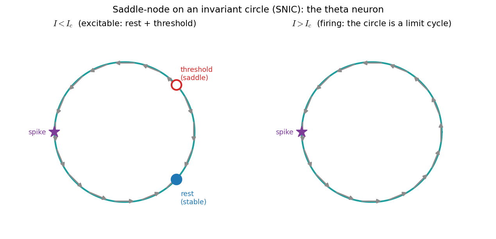
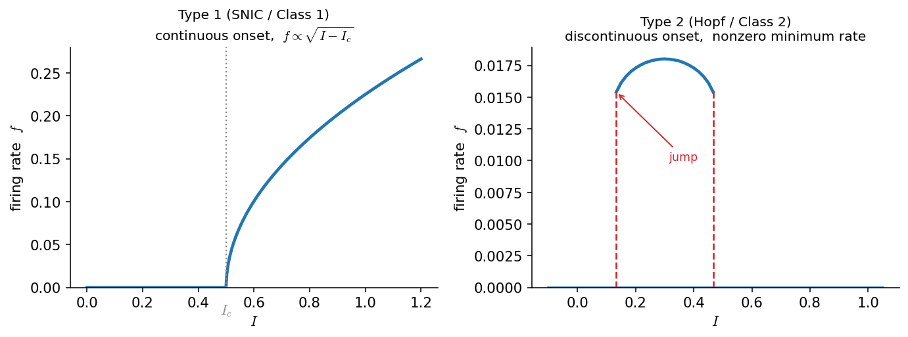

# سیستم‌های دینامیکی

> «همهٔ مدل‌ها نادرست‌اند، اما برخی مدل‌ها سودمندند.» — جورج باکس

بخشِ بزرگی از علوم اعصاب محاسباتی، در بنیادِ خود، مطالعهٔ **معادلاتِ دیفرانسیل** است: پتانسیلِ غشایی که به حالتِ استراحت بازمی‌گردد، دو ژن که یکدیگر را مهار می‌کنند، یا جمعیتی از نورون‌ها که به یک نوسانِ هماهنگ می‌رسند. در تقریباً همهٔ این موارد نمی‌توانیم جواب را به‌صورتِ یک فرمولِ بسته بنویسیم. خبرِ خوب این است که معمولاً به آن نیازی هم نداریم. با چند ایدهٔ کلیدی — **نقاطِ ثابت**، **پایداری**، **پرترهٔ فاز** و **انشعاب‌ها** — می‌توانیم رفتارِ کیفیِ یک مدل را در سراسرِ گستره‌ای از پارامترها و شرایطِ اولیه پیش‌بینی کنیم، **بی‌آنکه هرگز آن را به‌صورتِ بسته حل کنیم**. این شاخه از ریاضیات را **نظریهٔ سیستم‌های دینامیکی** می‌نامند و یکی از نیرومندترین و زیباترین ابزارهایی است که در اختیارِ یک مدل‌ساز قرار دارد.

در فصلِ [حل عددی معادلات دیفرانسیل معمولی](https://computational-neuroscience.ir/ch-num-06-ode/) دیدیم که چگونه یک معادلهٔ دیفرانسیل را در زمان **حل** کنیم؛ آن فصل، ابزارِ محاسباتی بود. این فصل، چارچوبِ **تحلیلیِ** همان مسیرهاست: به‌جای آنکه بپرسیم «جواب چه عددی است؟»، می‌پرسیم «جواب در درازمدت چه شکلی دارد و با تغییرِ پارامترها چگونه دگرگون می‌شود؟».

این فصل نظریه را از پایه می‌سازد. نخست در یک بُعد آغاز می‌کنیم، جایی که همه‌چیز را می‌توان از یک تصویرِ واحد (**خطِ فاز**) خواند. سپس به دستگاه‌های دو یا چندمعادله‌ای می‌رویم، جایی که شیءِ تازهٔ مرکزی، **ماتریسِ ژاکوبی** است. سرانجام، این دستگاه را روی دو مدلِ کلاسیکِ علوم اعصاب به کار می‌بریم: یک **کلیدِ ژنتیکیِ دوپایدار** (سازوکارِ بنیادیِ حافظهٔ سلولی) و **نورونِ فیتزهیو–ناگومو** (ساده‌ترین مدلی که پتانسیلِ عمل تولید می‌کند).

???+ tip "در پایانِ این فصل خواهید توانست"
    - **نقاطِ ثابتِ** یک مدل را بیابید و **پایدار** یا **ناپایدار**بودنِ هرکدام را تعیین کنید.
    - یک **خطِ فاز** (یک‌بُعدی) و یک **صفحهٔ فاز** (دوبُعدی) را رسم و تفسیر کنید.
    - یک نقطهٔ ثابتِ دوبُعدی را با کمکِ **اثر (trace)** و **دترمینانِ** ژاکوبین به‌صورتِ **گره، زین یا مارپیچ** رده‌بندی کنید.
    - دو انشعابی را که در علوم اعصاب بیش از همه اهمیت دارند — **زین–گره** و **هاپف** — بازشناسید و بگویید هرکدام چه بر سرِ دینامیک می‌آورند.
    - تفاوتِ **ردهٔ ۱ و ردهٔ ۲**ِ تحریک‌پذیری را از روی **منحنیِ بسامد–جریان (f–I)** بازشناسید و بگویید هر رده از کدام انشعاب (SNIC یا هاپف) برمی‌خیزد.
    - کدی را بخوانید که همهٔ این‌ها را به شکل‌های بازتولیدپذیر (پرترهٔ فاز، نمودارِ انشعاب) تبدیل می‌کند.

---

## معادلاتِ خودگردان: ایدهٔ «بگذار معادله خودش بگوید چه می‌شود»

یک معادلهٔ دیفرانسیلِ مرتبهٔ اول صورتِ کلیِ زیر را دارد:

\[
\frac{dx}{dt} = f(x, t), \qquad x(t_0) = x_0 .
\]

هرگاه سمتِ راست به‌طورِ صریح به زمان **وابسته نباشد** — یعنی \(f(x,t)=f(x)\) — معادله را **خودگردان** (autonomous) می‌نامیم:

\[
\frac{dx}{dt} = f(x), \qquad x(t_0) = x_0 .
\]

همین ویژگیِ خودگردانی است که دیدگاهِ سیستم‌های دینامیکی را ممکن می‌کند. شیبِ \(dx/dt\) در هر حالتِ معیّنِ \(x\) **همیشه همان عدد است**، فارغ از اینکه کِی به آنجا برسیم. پس فضای حالت با یک «میدانِ جریانِ» ثابت پوشانده می‌شود: در هر مقدارِ \(x\) یک سرعتِ مشخص هست، و جواب چیزی نیست جز منحنی‌ای که از این سرعت‌ها پیروی می‌کند.

بسیاری از مدل‌های علوم اعصاب هرگاه ورودی‌شان ثابت نگه داشته شود، خودگردان‌اند. نورونِ یکپارچه‌و‌شلیکِ نشت‌دار (LIF) با جریانِ ثابت، یا مدلِ فیتزهیو–ناگومو با \(I_\text{ext}\) ثابت، هر دو خودگردان‌اند. (هرگاه ورودی در زمان تغییر کند، دستگاه **ناخودگردان** می‌شود؛ به این حالت در بخشِ [فراتر از خودگردانی](#_18) بازمی‌گردیم.)

برای درمانی کامل‌تر از آنچه این فصل می‌تواند بدهد، کتابِ *دینامیکِ غیرخطی و آشوبِ* استیون استروگاتز مرجعِ استاندارد و بسیار خواندنی است، و پیوست‌های کتابِ *مدل‌سازیِ مدارهای عصبیِ* رابرت روزنبام منبعی است که این فصل بیش از همه از آن پیروی می‌کند.

---

## یک بُعد: نقاطِ ثابت، خطِ فاز و پایداری

### نقاطِ ثابت

یک **نقطهٔ ثابت** (fixed point، یا *تعادل* یا *حالتِ پایا*) از معادلهٔ \(\dot x = f(x)\)، مقداری مانندِ \(x^*\) است که در آن جریان صفر می‌شود:

\[
f(x^*) = 0 .
\]

برای نقاطِ ثابت نمادِ ستاره‌دارِ \(x^*\) را به کار می‌بریم تا با شرطِ اولیهٔ \(x_0\) اشتباه نشوند. ویژگیِ تعریف‌کنندهٔ یک نقطهٔ ثابت بسیار ساده است:

!!! important "اصلِ بنیادی"
    **اگر جوابی از یک نقطهٔ ثابت آغاز شود، برای همیشه همان‌جا می‌ماند.**

دلیلش بی‌درنگ روشن است. اگر \(x(t_0) = x^*\) و \(f(x^*) = 0\)، آن‌گاه \(\dot x(t_0) = f(x^*) = 0\): حالت هیچ سرعتی ندارد، پس نمی‌تواند حرکت کند؛ با سرعتِ صفر همان‌جا می‌ماند، پس سرعتش صفر باقی می‌ماند، و همین‌طور تا ابد. تابعِ ثابتِ \(x(t)=x^*\) دقیقاً معادله را برآورده می‌کند. پس نقاطِ ثابت، **اسکلتِ** دینامیک‌اند: حالت‌های استراحت، حالت‌های حافظه، و پیکربندی‌های «هیچ‌کاری‌نکردنِ» یک مدل.

### جواب‌ها نمی‌توانند از نقاطِ ثابت بگذرند و علامتِ سرعت تغییر نمی‌کند

دو واقعیت، دینامیکِ یک‌بُعدی را بی‌نهایت پیش‌بینی‌پذیر می‌کنند. هر دو تنها به پیوستگیِ \(f\) و یکتاییِ جواب‌ها تکیه دارند.

۱. **یک مسیر هرگز نمی‌تواند در حرکتِ واقعی به یک نقطهٔ ثابت برسد.** فرض کنید \(\dot x(t_0) = f(x_0) > 0\) (حالت به راست می‌رود) و فرض کنید بعداً دقیقاً به نقطهٔ ثابتی مانندِ \(x_1\) رسیده باشد. اما از \(x_1\) تنها جوابِ ممکن، جوابِ ثابت است — و جوابِ ثابت **همه‌جا** سرعتِ صفر دارد، که با \(\dot x(t_0)>0\) در تناقض است. پس جوابی که به راست می‌رود می‌تواند به یک نقطهٔ ثابت **نزدیک** شود اما هرگز به آن **نمی‌رسد**.

۲. **علامتِ \(\dot x\) در زمان ثابت می‌ماند.** اگر سرعت در یک لحظه مثبت و در لحظه‌ای دیگر منفی بود، آن‌گاه بنا بر قضیهٔ مقدارِ میانی باید در زمانی میانی از صفر بگذرد — یعنی مسیر لحظه‌ای روی یک نقطهٔ ثابت بنشیند، که (بنا بر بندِ ۱) آن را برای همیشه منجمد می‌کند و باز با فرض در تناقض است.

با کنارِ هم گذاشتنِ این دو:

!!! important "نتیجه"
    برای یک معادلهٔ خودگردانِ یک‌بُعدی، **علامتِ \(\dot x(t)\) هرگز تغییر نمی‌کند**. هر جواب به‌صورتِ یکنوا حرکت می‌کند، یا همواره افزایشی یا همواره کاهشی، و میانِ دو نقطهٔ ثابتِ مجاور به دام می‌افتد.

### خطِ فاز

این مشاهدات یعنی می‌توانیم **همهٔ** جواب‌ها را در یک تصویرِ یک‌بُعدی به نامِ **خطِ فاز** (phase line) خلاصه کنیم. دستورِ کار چنین است:

۱. \(f(x)\) را رسم کنید و نقاطِ ثابت را — جایی که از صفر می‌گذرد — مشخص کنید.
۲. روی محورِ \(x\)، هرجا \(f(x) > 0\) است یک **پیکانِ راست‌گرا** (حالت افزایش می‌یابد) و هرجا \(f(x) < 0\) است یک **پیکانِ چپ‌گرا** (حالت کاهش می‌یابد) بکشید.

پیکان‌ها به شما می‌گویند هر شرطِ اولیه به کجا جریان می‌یابد. شکلِ زیر این کار را برای مثالِ کلاسیکِ

\[
\dot x = x^2 - 1
\]

انجام می‌دهد که نقاطِ ثابتش در \(x^* = -1\) و \(x^* = +1\) قرار دارند.


*خطِ فاز برای \(\dot x = x^2 - 1\). منحنیِ \(f(x)=x^2-1\) با رنگِ فیروزه‌ای رسم شده و دایره‌های روی محورِ پایین، دو نقطهٔ ثابت‌اند. در چپِ \(-1\) و راستِ \(+1\) مقدارِ \(f>0\) است و جریان به راست می‌رود؛ در میان، \(f<0\) است و جریان به چپ می‌رود. پس پیکان‌ها به‌سوی \(x^*=-1\) (پایدار، آبی) همگرا و از \(x^*=+1\) (ناپایدار، قرمز) واگرا می‌شوند.*

توجه کنید که **کلِ داستان** را می‌توان در یک نگاه دید: هر حالتی که از زیرِ \(-1\) آغاز شود به‌سوی \(-1\) رانده می‌شود؛ هر حالتِ میانِ \(-1\) و \(+1\) به پایین، به‌سوی \(-1\) می‌لغزد؛ و هر حالتِ بالای \(+1\) به بی‌نهایت می‌گریزد. ما رفتارِ درازمدت را به‌طورِ کامل توصیف کردیم، بی‌آنکه معادله را حل کنیم.

```python
import numpy as np
import matplotlib.pyplot as plt

def phase_line(f, xrange=(-2.2, 2.2), n=400):
    """Plot f(x) together with directional arrows showing the 1-D flow."""
    x = np.linspace(*xrange, n)
    y = f(x)
    fig, ax = plt.subplots(figsize=(6, 3.2))
    ax.axhline(0, color="0.6", lw=1)
    ax.plot(x, y, lw=2)
    # mark sign-change points (fixed points) and draw flow arrows
    sign = np.sign(y)
    for i in np.where(np.diff(sign) != 0)[0]:
        ax.plot(0.5 * (x[i] + x[i + 1]), 0, "o", ms=9, mfc="white", mec="k")
    for a, b in zip(x[:-1:40], x[1::40]):
        s = np.sign(f(0.5 * (a + b)))
        ax.annotate("", xy=(0.5*(a+b) + 0.1*s, 0), xytext=(0.5*(a+b) - 0.1*s, 0),
                    arrowprops=dict(arrowstyle="-|>", color="0.3"))
    ax.set(xlabel="x", ylabel="f(x)")
    return ax

phase_line(lambda x: x**2 - 1)
plt.show()
```

### پایداری و آزمونِ خطی‌سازی

باز به شکلِ خطِ فاز نگاه کنید. پیرامونِ \(x^*=-1\) هر دو پیکان به *درون* اشاره دارند: حالتی که در نزدیکی آغاز شود، پس‌رانده می‌شود. پیرامونِ \(x^*=+1\) هر دو پیکان به *بیرون* اشاره دارند: کوچک‌ترین جابه‌جایی تقویت می‌شود. این همان تفاوتِ میانِ یک نقطهٔ ثابتِ **پایدار** و **ناپایدار** است.

!!! note "تعریف‌ها"
    یک نقطهٔ ثابتِ \(x^*\) را **پایدار (مجانبی)** می‌گوییم اگر هر جوابی که به‌اندازهٔ کافی نزدیکِ \(x^*\) آغاز شود، با \(t\to\infty\) به آن همگرا شود. آن را **ناپایدار** می‌گوییم اگر جواب‌ها بتوانند دلخواهانه نزدیک آغاز شوند و باز همگرا نشوند.

یک آزمونِ جبریِ سریع وجود دارد. نزدیکِ یک نقطهٔ پایدار، جریانِ \(f\) با افزایشِ \(x\) از مثبت (راندن به راست) به منفی (راندن به چپ) تغییر می‌کند — پس \(f\) در آنجا *کاهشی* است. نزدیکِ یک نقطهٔ ناپایدار، عکسِ این رخ می‌دهد. این دقیقاً همان علامتِ مشتقِ \(f'(x^*)\) است:

!!! important "آزمونِ پایداریِ خطی (یک‌بُعدی)"
    فرض کنید \(x^*\) نقطهٔ ثابتِ \(\dot x = f(x)\) باشد.

    - اگر \(f'(x^*) < 0\)، آن‌گاه \(x^*\) **پایدار** است.
    - اگر \(f'(x^*) > 0\)، آن‌گاه \(x^*\) **ناپایدار** است.

برای مثالِ ما \(f'(x) = 2x\)، پس \(f'(-1) = -2 < 0\) (پایدار) و \(f'(+1) = +2 > 0\) (ناپایدار)، که تصویر را تأیید می‌کند. شهودِ پشتِ آن — *شیبِ منفی تو را بازمی‌گرداند، شیبِ مثبت تو را بیرون می‌اندازد* — بذرِ یک‌بُعدیِ هر چیزی است که در ادامه می‌آید؛ در ابعادِ بالاتر، نقشِ \(f'(x^*)\) را مقادیرِ ویژهٔ یک ماتریس بر عهده می‌گیرند.

### حالت‌های مرزی

این آزمون هرگاه \(f'(x^*) = 0\) باشد خاموش است، چون منحنی بر محور مماس می‌شود و جملهٔ خطی چیزی به ما نمی‌گوید. دو گونه رفتارِ مرزی ممکن است رخ دهد، و در هر دو، خطِ فاز همچنان بی‌درنگ تکلیف را روشن می‌کند.

- **نیمه‌پایدار (semi-stable).** برای \(f(x) = x^2\) تنها نقطهٔ ثابت \(x^*=0\) است، با \(f'(0)=0\). مسیرها از چپ ( \(f<0\) ) نزدیک می‌شوند اما در راست ( \(f>0\) ) می‌گریزند: از یک سو جذب و از سوی دیگر دفع می‌کند.
- **پایدارِ خنثی (neutrally stable).** برای جریانِ بدیهیِ \(f(x)=0\)، *هر* نقطه یک نقطهٔ ثابت است. حالت‌های نزدیک نه نزدیک می‌شوند و نه دور؛ همان‌جا که هستند می‌مانند.

توجه کنید که \(f'(x^*)=0\) به‌خودیِ‌خود به معنای «نیمه‌پایدار» نیست: برای \(f(x)=x^3\) نقطهٔ \(x^*=0\) به‌راستی ناپایدار است. درسِ ماجرا این است که **رسمِ خطِ فاز از به‌خاطرسپردنِ قاعده‌ها مطمئن‌تر است.** هرگاه \(f'(x^*)\neq 0\)، آزمونِ خطی قاطع است؛ در غیرِ این صورت، به علامتِ \(f\) در دو سو نگاه کنید.

### نخستین انشعابِ ما: زین–گره

پاداشِ واقعیِ این دیدگاه آن است که می‌توانیم بپرسیم دینامیک با تغییرِ یک پارامتر چگونه *دگرگون* می‌شود. مقداری از پارامتر که در آن **تعداد یا پایداریِ نقاطِ ثابت تغییر می‌کند**، یک **انشعاب** (bifurcation) نامیده می‌شود. در یک بُعد، رایج‌ترین آن‌ها **زین–گره** (saddle-node، که *تاشو* یا *مماسی* نیز نامیده می‌شود) است که در آن دو نقطهٔ ثابت با هم برخورد و یکدیگر را نابود می‌کنند. کمینه‌مثالِ آن چنین است:

\[
\dot x = x^2 + a ,
\]

که در آن \(a\) یک پارامترِ کنترل است.


*انشعابِ زین–گرهٔ \(\dot x = x^2 + a\). **برای \(a<0\)** دو نقطهٔ ثابت \(x^* = \pm\sqrt{-a}\) هست: پایینی پایدار (آبی) و بالایی ناپایدار (قرمز). **در \(a=0\)** آن‌ها در یک نقطهٔ نیمه‌پایدارِ واحد ادغام می‌شوند. **برای \(a>0\)** سهمی از محور بالا می‌رود و **هیچ** نقطهٔ ثابتی نمی‌ماند. پنلِ راست، **نمودارِ انشعاب** است: مکانِ نقطهٔ ثابت بر حسبِ \(a\)، با شاخهٔ پایدارِ توپُر و شاخهٔ ناپایدارِ خط‌چین. دو شاخه در \(a=0\) به هم می‌رسند و ناپدید می‌شوند.*

در علوم اعصاب، این همان راهِ کلاسیکی است که یک نورون **روشن** می‌شود: همین‌که جریانِ ورودی از یک آستانه می‌گذرد، یک حالتِ پایدارِ «استراحت» و یک حالتِ ناپایدارِ «آستانه‌ایِ» نزدیکِ آن با هم برخورد و ناپدید می‌شوند، و دستگاه چاره‌ای جز شلیک ندارد. دقیقاً همین را در مدلِ فیتزهیو–ناگومو در بخشِ [مثالِ دوم](#_15) خواهیم دید.

!!! example "تمرین‌ها (یک‌بُعدی)"
    ۱. **حل‌کن‌و‌بسنج.** برای \(\dot x = x^2 - 1\) با \(x(0)=1\)، جوابِ دقیق چیست؟ (راهنمایی: \(x_0\) یک نقطهٔ ثابت است.) با اویلرِ پیشرو، \(dt=0.01\) و \(T=5\)، عددی تأیید کنید.

    ۲. **خطِ فاز.** خطِ فازِ \(\dot x = -(x+1)(x-1)(x-2)\) را رسم کنید. هر سه نقطهٔ ثابت را بیابید و هرکدام را با علامتِ \(f'(x^*)\) رده‌بندی کنید. با شبیه‌سازی از چند شرطِ اولیه راستی‌آزمایی کنید.

    ۳. **توانِ سوم.** نشان دهید \(x^*=0\) برای \(\dot x = x^3\) ناپایدار است، هرچند \(f'(0)=0\). چرا آزمونِ خطی اینجا شکست می‌خورد و چرا خطِ فاز همچنان کار می‌کند؟

    ۴. **انشعاب را بیاب.** برای \(\dot x = x^2 + a\)، نقاطِ ثابت را برای \(a=-1\)، \(a=0\) و \(a=1\) رده‌بندی کنید و تأیید کنید که انشعاب در \(a=0\) است.

---

## ابعادِ بالاتر: دستگاه‌های معادلات

تقریباً هر مدلِ جالبی دستِ‌کم به دو متغیر نیاز دارد — یک ولتاژ و یک جریانِ بازیابی، دو ژنِ مهارگرِ متقابل، یا یک جمعیتِ تحریکی و یک مهاری. پس همهٔ آنچه را گفتیم به **دستگاه‌های** معادلاتِ خودگردان تعمیم می‌دهیم:

\[
\frac{d\mathbf{u}}{dt} = \mathbf{F}(\mathbf{u}), \qquad
\mathbf{u}\in\mathbb{R}^n,\;\; \mathbf{F}:\mathbb{R}^n\to\mathbb{R}^n .
\]

برای \(n=2\) اغلب نوشتنِ مؤلفه‌ها روشن‌تر است:

\[
\frac{\partial x}{\partial t} = f(x, y), \qquad
\frac{\partial y}{\partial t} = g(x, y),
\]

با \(\mathbf{u}=(x,y)\). یک **نقطهٔ ثابت** باز هم حالتی است که در آن جریان صفر می‌شود، \(\mathbf{F}(\mathbf{u}^*) = \mathbf{0}\)، یعنی \(f(x^*,y^*)=g(x^*,y^*)=0\) هم‌زمان. مانندِ پیش، *جوابی که از یک نقطهٔ ثابت آغاز شود همان‌جا می‌ماند* و *جوابی که از آن آغاز نشود هرگز به آن نمی‌رسد*.

تعریف‌های پایدار و ناپایدار، واژه‌به‌واژه همان‌اند که در یک بُعد بود. آنچه به‌راستی تازه است این است که **تعیینِ** پایداری دشوارتر است: در یک بُعد یک عددِ \(f'(x^*)\) کار را تمام می‌کرد؛ در \(n\) بُعد به یک *ماتریس* نیاز داریم.

### دو تصویر: میدانِ برداری و خط‌پوچ‌ها

دو ابزارِ بصری، تقریباً همهٔ شهودِ لازم در صفحه را در خود دارند.

- **میدانِ برداری** (vector field، یا *جریان*) پیکانِ \(\mathbf{F}(x,y)=(f,g)\) را به هر نقطهٔ \((x,y)\) می‌چسباند. مسیرها منحنی‌هایی‌اند که از این پیکان‌ها پیروی می‌کنند. در پایتون، `plt.streamplot` آن‌ها را به‌زیبایی رسم می‌کند.
- **خط‌پوچ‌ها** (nullclines) منحنی‌هایی‌اند که روی آن‌ها یک مؤلفهٔ جریان صفر است. *خط‌پوچِ \(x\)* همان \(f(x,y)=0\) است (آنجا مسیرها تنها عمودی حرکت می‌کنند) و *خط‌پوچِ \(y\)* همان \(g(x,y)=0\) است (آنجا مسیرها تنها افقی حرکت می‌کنند). **نقاطِ ثابت دقیقاً محلِ تقاطعِ دو خط‌پوچ‌اند** — جایی که هر دو مؤلفه هم‌زمان صفر می‌شوند. رسمِ خط‌پوچ‌ها سریع‌ترین راهِ یافتنِ تعادل‌ها با چشم است.

از هر دو در همهٔ مثال‌های زیر استفاده خواهیم کرد.

### دستگاه‌های خطی و مقادیرِ ویژه

پاکیزه‌ترین حالت، یک دستگاهِ **خطی** است:

\[
\frac{d\mathbf{u}}{dt} = A\mathbf{u}, \qquad \mathbf{u}(0)=\mathbf{u}_0,
\]

با \(A\) یک ماتریسِ \(n\times n\). مبدأ \(\mathbf{u}^*=\mathbf{0}\) همواره یک نقطهٔ ثابت است، و (اگر \(A\) وارون‌پذیر باشد) تنها نقطهٔ ثابت. پایداریِ آن کاملاً با **مقادیرِ ویژهٔ** \(A\) تعیین می‌شود — اعدادی مانندِ \(\lambda\) که برای آن‌ها برداری مانندِ \(\mathbf{v}\) با \(A\mathbf{v}=\lambda\mathbf{v}\) وجود دارد. مقادیرِ ویژه می‌توانند حقیقی باشند یا به‌صورتِ زوج‌های مزدوجِ مختلط \(\lambda=\alpha\pm i\beta\) بیایند، و از حلِ زیر یافت می‌شوند:

\[
\det(A - \lambda I) = 0 .
\]

مهم‌ترین قضیهٔ کلِ این فصل این است:

!!! important "پایداریِ یک دستگاهِ خطی"
    نقطهٔ ثابتِ مبدأ در \(\dot{\mathbf u}=A\mathbf u\) **پایدار** است اگر *همهٔ* مقادیرِ ویژهٔ \(A\) **بخشِ حقیقیِ منفی** داشته باشند، و **ناپایدار** است اگر *هر یک* از مقادیرِ ویژه بخشِ حقیقیِ مثبت داشته باشد.

*بخشِ حقیقی* رشد یا میرایی را تعیین می‌کند؛ *بخشِ موهومی* چرخش را. این به **پنج پرترهٔ فازِ متعارف** در دو بُعد می‌انجامد:


*پنج رفتارِ یک دستگاهِ خطیِ دوبُعدی، با مقادیرِ ویژه در عنوان‌ها. **حقیقی، هر دو منفی** ← *گرهِ پایدار* (همه‌چیز مستقیم به درون میرا می‌شود). **حقیقی، هر دو مثبت** ← *گرهِ ناپایدار* (همه‌چیز به بیرون رشد می‌کند). **حقیقی، با علامتِ مخالف** ← *زین* (در یک راستا جذب، در راستای دیگر دفع). **مختلط با بخشِ حقیقیِ منفی** ← *مارپیچِ پایدار / کانونِ پایدار* (نوسانِ میرا). **مختلط با بخشِ حقیقیِ مثبت** ← *مارپیچِ ناپایدار* (نوسانِ رشدیابنده).*

مقادیرِ ویژهٔ مختلط همیشه **مارپیچ** تولید می‌کنند، و یک مارپیچ در صفحهٔ \((u_1,u_2)\) با **نوسان** در هر مؤلفه به‌عنوانِ تابعی از زمان متناظر است — آهنگِ چرخش همان بخشِ موهومیِ \(\beta\) است. به همین دلیل، نوسان و مقادیرِ ویژهٔ مختلط، در عمل یک پدیده‌اند.

```python
import numpy as np

A = np.array([[-1.0, -10.0],
              [10.0, -1.0]])
eigvals, eigvecs = np.linalg.eig(A)
print(eigvals)          # -1+10j, -1-10j  -> stable spiral
```

### رده‌بندیِ یک نقطهٔ ثابتِ دوبُعدی با اثر و دترمینان

در دو بُعد به‌ندرت لازم است مقادیرِ ویژه را صریحاً محاسبه کنید. دو عددِ اسکالر که مستقیماً از ماتریس ساخته می‌شوند همه‌کاره‌اند، زیرا برای یک ماتریسِ \(2\times2\):

\[
\det(A) = \lambda_1\lambda_2, \qquad \operatorname{Tr}(A)=\lambda_1+\lambda_2 ,
\]

و خودِ مقادیرِ ویژه عبارت‌اند از:

\[
\lambda_{1,2} = \frac{T \pm \sqrt{T^2 - 4D}}{2}, \qquad T=\operatorname{Tr}(A),\; D=\det(A).
\]

از همین سه فرمول، کلِ رده‌بندی با یک نگاه به‌دست می‌آید:

| شرط | نوع | پایداری |
|---|---|---|
| \(D < 0\) | **زین** (مقادیرِ ویژه حقیقی، علامتِ مخالف) | ناپایدار |
| \(D > 0,\; T < 0,\; T^2 > 4D\) | **گرهِ** پایدار | پایدار |
| \(D > 0,\; T > 0,\; T^2 > 4D\) | **گرهِ** ناپایدار | ناپایدار |
| \(D > 0,\; T < 0,\; T^2 < 4D\) | **مارپیچِ** پایدار | پایدار |
| \(D > 0,\; T > 0,\; T^2 < 4D\) | **مارپیچِ** ناپایدار | ناپایدار |

به بیانِ ساده: **دترمینان دربارهٔ گره‌در‌برابرِ‌زین تصمیم می‌گیرد، اثر دربارهٔ پایدار‌در‌برابرِ‌ناپایدار، و مبیّن \(T^2-4D\) دربارهٔ گره‌در‌برابرِ‌مارپیچ.** این همه در **صفحهٔ اثر–دترمینان** خلاصه می‌شود؛ نقشه‌ای واحد از هر رفتارِ ممکنِ خطیِ دوبُعدی، و همان تصویری که باید تا پایانِ فصل در ذهن نگه دارید.


*صفحهٔ اثر–دترمینان. محورِ افقی \(T=\operatorname{Tr}(A)\) و محورِ عمودی \(D=\det(A)\) است. خطِ \(D=0\)، خطِ \(T=0\) و سهمیِ \(D=T^2/4\) صفحه را به پنج ناحیه می‌برند، یکی برای هر پرتره. عبور از سهمی یک گره را به مارپیچ بدل می‌کند؛ عبور از \(T=0\) با \(D>0\) یک **انشعابِ هاپف** است؛ و عبور از \(D=0\) یک **انشعابِ زین–گره**.*

### دستگاه‌های غیرخطی: ماتریسِ ژاکوبی

مدل‌های واقعی غیرخطی‌اند، اما نزدیکِ یک نقطهٔ ثابت، یک دستگاهِ غیرخطیِ هموار *خطی به نظر می‌رسد*. ماتریسی که این خطی‌سازیِ محلی را در خود دارد، **ماتریسِ ژاکوبی** (Jacobian) است — تعمیمِ چندبُعدیِ مشتقِ \(f'(x^*)\). برای یک دستگاهِ دوبُعدی، درایه‌هایش مشتق‌های جزئیِ جریان‌اند که **در نقطهٔ ثابت** ارزیابی شده‌اند:

\[
J \big|_{(x^*,y^*)}=
\begin{bmatrix}
\dfrac{\partial f}{\partial x} & \dfrac{\partial f}{\partial y}\\[2ex]
\dfrac{\partial g}{\partial x} & \dfrac{\partial g}{\partial y}
\end{bmatrix} .
\]

قضیهٔ کلیدی می‌گوید که تصویرِ محلی، درست مانندِ حالتِ خطی، با مقادیرِ ویژهٔ ژاکوبین تعیین می‌شود:

!!! important "قضیهٔ خطی‌سازی"
    نزدیکِ یک نقطهٔ ثابتِ \(\mathbf u^*\)، جواب‌های دستگاهِ غیرخطیِ \(\dot{\mathbf u}=\mathbf F(\mathbf u)\) مانندِ جواب‌های دستگاهِ خطیِ \(\dot{\mathbf u}=J\mathbf u\) نزدیکِ مبدأ رفتار می‌کنند. به‌ویژه: اگر **همهٔ** مقادیرِ ویژهٔ \(J\) بخشِ حقیقیِ منفی داشته باشند، \(\mathbf u^*\) **پایدار** است؛ اگر **هر یک** بخشِ حقیقیِ مثبت داشته باشد، **ناپایدار** است. مقادیرِ ویژهٔ مختلط یعنی نزدیک‌شدن (یا گریز) به‌صورتِ **مارپیچ** است.

پس کلِ روالِ تحلیلِ یک مدلِ غیرخطی چنین است:

۱. نقاطِ ثابت را با حلِ \(\mathbf F(\mathbf u^*)=\mathbf 0\) بیابید (اغلب جایی که خط‌پوچ‌ها هم را قطع می‌کنند).
۲. ژاکوبینِ \(J\) را محاسبه و در هر نقطهٔ ثابت ارزیابی کنید.
۳. نوع و پایداری را از \(\operatorname{Tr}(J)\)، \(\det(J)\) و \(T^2-4D\) بخوانید.

### یک جعبه‌ابزارِ بازکاربردپذیرِ تحلیل

توابعِ خوداتکای زیر، گام‌های ۱ تا ۳ را یک‌بار برای همیشه پیاده می‌کنند. هر مثالِ زیر از همین‌ها استفاده می‌کند و تنها جریان و ژاکوبینِ ویژهٔ مدل را عوض می‌کند.

```python
import numpy as np
import scipy.integrate
import scipy.optimize

def integrate(flow, y0, t):
    """Numerically integrate dy/dt = flow(y, t) from y0 over time array t."""
    return scipy.integrate.odeint(flow, y0, t)

def find_equilibrium(flow, guess):
    """Solve flow(y) = 0 starting from `guess`; return the root or NaNs."""
    sol, info, ok, msg = scipy.optimize.fsolve(flow, guess, full_output=1)
    return sol if ok == 1 else np.full_like(np.asarray(guess, float), np.nan)

def unique_equilibria(flow, guesses, tol=1e-4):
    """Collect distinct equilibria found from a list of starting guesses."""
    eqs = []
    for g in guesses:
        r = find_equilibrium(flow, g)
        if not np.any(np.isnan(r)) and not any(np.allclose(r, e, atol=tol) for e in eqs):
            eqs.append(r)
    return eqs

def classify(J):
    """Return (name, is_stable) for a 2x2 Jacobian via trace & determinant."""
    T, D = np.trace(J), np.linalg.det(J)
    if D < 0:
        return "saddle", False
    stable = T < 0
    shape = "spiral" if T**2 - 4 * D < 0 else "node"
    return f"{'stable' if stable else 'unstable'} {shape}", stable
```

راهی طبیعی برای *یافتنِ* تعادل‌های یک مدلِ ناآشنا این است که از شرایطِ اولیهٔ متعدد انتگرال بگیریم، بگذاریم مسیرها بنشینند، و از نقطهٔ پایانیِ آن‌ها به‌عنوانِ حدسِ آغازین برای `fsolve` استفاده کنیم (تعادل‌های پایدار به این روش خودکار یافت می‌شوند؛ تعادل‌های ناپایدار به حدس‌هایی نزدیکِ خودشان نیاز دارند، مثلاً روی یک خط‌پوچ).

!!! example "تمرین‌ها (دستگاه‌ها)"
    ۱. یک ماتریسِ \(2\times2\) دلخواه بسازید، مقادیرِ ویژه‌اش را با دست محاسبه کنید، مبدأ را رده‌بندی کنید، سپس با `np.linalg.eig` و با شبیه‌سازیِ \(\dot{\mathbf u}=A\mathbf u\) از چند شرطِ اولیه بسنجید.

    ۲. تمرینِ ۱ را تنها با \(\operatorname{Tr}(A)\) و \(\det(A)\) تکرار کنید — بدونِ محاسبهٔ مقادیرِ ویژه.

    ۳. برای دستگاهِ غیرخطیِ \(\dot x = -(1-y^2)x - y,\; \dot y = x\)، نقطهٔ ثابتِ یکتا را بیابید، ژاکوبین را آنجا محاسبه و آن را رده‌بندی کنید. با شبیه‌سازی تأیید کنید.

### انشعاب در دستگاه‌ها: زین–گره، هاپف و چرخهٔ حدی

دستگاه‌ها انشعابِ **زین–گره** را از یک بُعد به ارث می‌برند: با تغییرِ یک پارامتر، دو تعادل می‌توانند برخورد و ناپدید شوند. روی صفحهٔ اثر–دترمینان این همان لحظه‌ای است که \(\det(J)\) از صفر می‌گذرد ( \(D=0\) ) و یک گرهِ پایدار را به زین بدل می‌کند.

اما دستگاه‌ها می‌توانند کاری کنند که در یک بُعد *ناممکن* است. هنگامی که یک **مارپیچ** پایداری‌اش را عوض می‌کند — یعنی \(\operatorname{Tr}(J)\) با \(\det(J)>0\) از صفر می‌گذرد، پس زوجی از مقادیرِ ویژهٔ مختلط از محورِ موهومی عبور می‌کنند — یک **انشعابِ هاپف** (Hopf bifurcation) داریم. وقتی یک مارپیچِ پایدار پایداری‌اش را از دست می‌دهد، معمولاً یک **چرخهٔ حدی** (limit cycle) زاده می‌شود: یک مسیرِ *بستهٔ* جداافتاده که جواب‌های نزدیک روی آن مارپیچ می‌زنند. چرخهٔ حدی یک نوسانِ خودپایدار است، و قلبِ ریاضیِ *شلیکِ ریتمیک*، *مولّدهای الگوی مرکزی* و در اصل هر ساعتِ زیستی است. پس انشعابِ هاپف، مهم‌ترین انشعابِ علوم اعصاب محاسباتی است، و در بخشِ بعد آن را در حالِ آفریدنِ شلیک خواهیم دید.

---

## مثالِ اول — دوپایداری: کلیدِ ژنتیکیِ دوحالته

نخستین مدلِ کاملِ ما **کلیدِ ژنتیکیِ دوحالتهٔ** گاردنر، کانتور و کالینز است. دو ژن، هرکدام پروتئینی می‌سازند که دیگری را *مهار* می‌کند. غلظت‌های \(u\) و \(v\) از معادلاتِ زیر پیروی می‌کنند:

\[
\frac{du}{dt} = \frac{\alpha}{1+v^{\beta}} - u, \qquad
\frac{dv}{dt} = \frac{\alpha}{1+u^{\beta}} - v .
\]

اینجا \(\alpha\) بیشینهٔ آهنگِ تولید و \(\beta\) **هم‌یاری** (cooperativity، یعنی اینکه یک پروتئین چقدر تند دیگری را خاموش می‌کند) است؛ جمله‌های \(-u\) و \(-v\) همان تجزیهٔ ساده‌اند. هرچند این مدل برای زیست‌شناسیِ ترکیبی ساخته شد، نمونهٔ اولیهٔ هر دستگاهی است که باید *یک حافظهٔ گسسته را ذخیره کند*: نورون یا مداری که می‌تواند در حالتِ پایین یا بالا بنشیند و همان‌جا بماند. نشانهٔ ریاضیِ حافظه، **دوپایداری** (bistability) است — دو نقطهٔ ثابتِ پایدارِ هم‌زیست — و این مدل به ما اجازه می‌دهد ببینیم دقیقاً کِی پدیدار می‌شود.

### خط‌پوچ‌ها، تعادل‌ها و صفحهٔ فاز

با صفر قراردادنِ هر مشتق، دو خط‌پوچ به‌دست می‌آید:

\[
\dot u = 0 \;\Leftrightarrow\; u = \frac{\alpha}{1+v^{\beta}}, \qquad
\dot v = 0 \;\Leftrightarrow\; v = \frac{\alpha}{1+u^{\beta}} ,
\]

و تعادل‌ها تقاطعِ آن‌هایند. تعدادِ تقاطع‌ها به \(\beta\) بستگی دارد: برای هم‌یاریِ کم، منحنی‌ها **یک‌بار** هم را قطع می‌کنند (یک حالتِ پایدارِ واحد — *تک‌پایدار*)، اما با بزرگ‌شدنِ \(\beta\) خط‌پوچ‌ها چندان خم می‌شوند که **سه‌بار** قطع می‌کنند و **دو حالتِ پایدارِ جداشده با یک زین** پدید می‌آورند (*دوپایدار*). مَنیفلدِ پایدارِ زین همان *آستانه‌ای* است که تعیین می‌کند دستگاه به کدام‌یک از دو حافظه می‌افتد.


*صفحهٔ فازِ کلیدِ دوحالته ( \(\alpha=1\) ). منحنی‌های فیروزه‌ای و نارنجی خط‌پوچ‌های \(\dot u=0\) و \(\dot v=0\) هستند؛ خطوطِ خاکستری جریان‌اند. **چپ ( \(\beta=2\) ):** خط‌پوچ‌ها یک‌بار قطع می‌کنند — یک گرهِ پایدارِ واحد (آبی)، پس دستگاه *تک‌پایدار* است. **راست ( \(\beta=10\) ):** سه‌بار قطع می‌کنند — دو گرهِ پایدار (آبی) در دو سوی یک زین (بنفش). دستگاه یک **کلیدِ دوپایدارِ** واقعی است، و زین مرزِ میانِ دو حوضهٔ جذب را نشان می‌دهد.*

```python
from functools import partial
import numpy as np

def toggle(y, t, alpha, beta):
    u, v = y
    return np.array([alpha / (1 + v**beta) - u,
                     alpha / (1 + u**beta) - v])

def toggle_jacobian(u, v, alpha, beta):
    # J = -[[1, a*b*v^(b-1)/(1+v^b)^2], [a*b*u^(b-1)/(1+u^b)^2, 1]]
    return -np.array([[1, alpha*beta*v**(beta-1) / (1 + v**beta)**2],
                      [alpha*beta*u**(beta-1) / (1 + u**beta)**2, 1]])

params = {"alpha": 1.0, "beta": 10.0}
flow = lambda y: toggle(y, 0, **params)

# locate equilibria by relaxing from a spread of initial conditions
guesses = [integrate(partial(toggle, **params), ic, np.linspace(0, 50, 500))[-1]
           for ic in [(.1, 1), (2, 2), (1, 1.3), (2, 3), (2, 1), (1, 2)]]
for eq in unique_equilibria(flow, guesses):
    name, _ = classify(toggle_jacobian(*eq, **params))
    print(f"{name:14s} at (u, v) = ({eq[0]:.3f}, {eq[1]:.3f})")
```

اگر مایل نیستید ژاکوبین را با دست مشتق بگیرید، `sympy` آن را برایتان انجام می‌دهد و یک تابعِ عددیِ سریع بازمی‌گرداند:

```
import sympy
u, v, alpha, beta = sympy.symbols("u v alpha beta")
F = sympy.Matrix([alpha/(1 + v**beta) - u, alpha/(1 + u**beta) - v])
J = F.jacobian(sympy.Matrix([u, v]))
toggle_jacobian = sympy.lambdify((u, v, alpha, beta), J, dummify=False)
```

### نمودارِ انشعاب و نقشِ تقارن

برای آنکه ببینیم دوپایداری *کِی* روشن می‌شود، تعادل‌ها را با تغییرِ \(\beta\) دنبال می‌کنیم. حل‌کردنِ دوبارهٔ مسئله از صفر در هر \(\beta\) اتلاف است؛ به‌جای آن از **ادامهٔ پارامترِ طبیعی** (natural-parameter continuation) استفاده می‌کنیم — جوابِ یک \(\beta\) را به‌عنوانِ حدسِ آغازینِ \(\beta\) بعدی می‌گیریم. چند خط کد هر شاخه را ردیابی می‌کند:

```python
def continuation(flow_of_param, u0, param_values):
    """Follow a root of flow_of_param(u, p)=0 as p sweeps through param_values."""
    eqs, u = [], np.array(u0, float)
    for p in param_values:
        u = find_equilibrium(lambda y: flow_of_param(y, p), u)
        eqs.append(u.copy())
    return np.array(eqs)

beta_space = np.linspace(0.5, 10, 800)
for start in [(0.5, 0.99), (0.84, 0.84), (0.99, 0.5)]:
    branch = continuation(lambda y, b: toggle(y, 0, 1.0, b), start, beta_space)
    # colour each point by stability via toggle_jacobian + classify ...
```

نتیجه، شکلِ زیر است: یک شاخهٔ پایدارِ واحد برای \(\beta\)های کوچک که با عبورِ \(\beta\) از یک مقدارِ بحرانی به دو شاخهٔ پایدار به‌علاوهٔ یک شاخهٔ میانیِ ناپایدار **می‌شکافد**. چون مدل زیرِ جابه‌جاییِ \(u\leftrightarrow v\) متقارن است، این یک **انشعابِ چنگالی** (pitchfork) است.


*نمودارِ انشعابِ کلیدِ دوحالتهٔ متقارن: مقدارِ پایای \(u\) بر حسبِ هم‌یاریِ \(\beta\). زیرِ \(\beta\approx4\) یک حالتِ پایدار هست؛ بالای آن، شاخه به دو حالتِ پایدار (آبی) با یک زینِ ناپایدار (بنفش) در میان دوشاخه می‌شود. این دوشاخگی یک **انشعابِ چنگالیِ فوق‌بحرانی** است — آغازِ حافظه.*

انشعابِ چنگالی پیامدِ تقارنِ کاملِ مدل است، و تقارنِ کامل شکننده است. اگر دو ژن با هم‌یاری‌های *متفاوتِ* \(\beta_1\neq\beta_2\) مهار کنند، انشعابِ چنگالی به یک زوج انشعابِ زین–گرهٔ معمولی **باز می‌شود**: چنگال به یک شاخهٔ هموار به‌علاوهٔ یک تای جداافتاده می‌شکند. جاروبِ هم‌زمانِ \(\beta_1\) و \(\beta_2\) آشکار می‌کند که این دو زین–گره در یک نقطه به هم می‌رسند — یک **کاسپ** (cusp)، ساده‌ترین انشعابِ *هم‌بُعدِ‌دو*، جایی که مرزِ میانِ نواحیِ «تک‌پایدار» و «دوپایدار» به یک نوکِ تیز می‌رسد. (مدلِ نامتقارن و کاسپِ آن به‌طورِ کامل در نوت‌بوکِ همراهِ `bistable_systems.ipynb` کار شده است.)

!!! example "تمرین‌ها (کلیدِ دوحالته)"
    ۱. شکلِ صفحهٔ فاز را بازتولید کنید و با شمارشِ تقاطع‌های خط‌پوچ تأیید کنید که \(\beta=2\) تک‌پایدار و \(\beta=10\) دوپایدار است. گذار تقریباً کجا رخ می‌دهد؟

    ۲. از دو شرطِ اولیهٔ نزدیک به هم اما در دو سوی زین شبیه‌سازی کنید و نشان دهید که به حالت‌های پایدارِ *متفاوت* همگرا می‌شوند. این همان *به‌خاطرسپردنِ* ورودی توسطِ کلید است.

    ۳. تقارن را بشکنید: \(\beta_1=6\) بگذارید، \(\beta_2\) را جارو کنید، و انشعاب‌های زین–گره را در نمودارِ حاصل بازشناسید.

---

## مثالِ دوم — تحریک‌پذیری: نورونِ فیتزهیو–ناگومو

مدلِ **فیتزهیو–ناگومو** (FitzHugh–Nagumo، به‌اختصار FHN) کاریکاتوری دومتغیره از معادلاتِ هاجکین–هاکسلی است که با این حال، گنجینهٔ اساسیِ یک نورون را بازتولید می‌کند — استراحت، آستانه، اسپایک و شلیکِ تکراری. این مدل را در فصلِ [حل عددی معادلات دیفرانسیل معمولی](https://computational-neuroscience.ir/ch-num-06-ode/) به‌صورتِ عددی حل کردیم؛ اینجا آن را **تحلیل** می‌کنیم. معادله چنین است:

\[
\frac{dv}{dt} = v - v^3 - w + I_\text{ext}, \qquad
\tau\,\frac{dw}{dt} = v - a - b\,w ,
\]

که در آن \(v\) یک پتانسیلِ غشای (بی‌بُعد)، \(w\) یک متغیرِ **بازیابیِ** کند، \(\tau\) ثابتِ زمانیِ (بزرگِ) آن و \(I_\text{ext}\) یک جریانِ تزریقی است. توانِ سومِ \(v\) بالاروِ سریعِ خودتقویت‌گرِ یک اسپایک را فراهم می‌کند؛ \(w\)ِ کند که با \(v\) کشیده می‌شود و با \(-bw\) میرا می‌شود، بازیابی‌ای را تأمین می‌کند که سلول را به‌سوی استراحت بازمی‌کشد. سه واقعیتِ تجربی این ساختار را برمی‌انگیزند: سلول آرام استراحت می‌کند؛ یک اختلالِ *کوچک* به استراحت بازمی‌گردد؛ اما اختلالی فراتر از یک **آستانه** یک گردشِ بزرگ — یک اسپایک — را پیش از بازگشت رها می‌کند. دستگاهی با این ویژگیِ «کیک‌های کوچک را نادیده بگیر، بزرگ‌ها را تقویت کن» را **تحریک‌پذیر** (excitable) می‌نامند.

### خط‌پوچ‌ها، تعادل‌ها و صفحهٔ فاز

خط‌پوچ‌ها عبارت‌اند از:

\[
\dot v = 0 \;\Leftrightarrow\; w = v - v^3 + I_\text{ext}\quad\text{(منحنیِ سه‌گانه)}, \qquad
\dot w = 0 \;\Leftrightarrow\; w = \tfrac{1}{b}(v - a)\quad\text{(خط)} .
\]

تعادل‌ها یک معادلهٔ سه‌گانه (مکعبی) در \(v\) را برآورده می‌کنند که می‌توان آن را دقیقاً با `numpy.roots` حل کرد:

\[
v^3 + v\!\left(\tfrac{1}{b}-1\right) - \left(\tfrac{a}{b}+I_\text{ext}\right) = 0,
\qquad w^* = v^* - (v^*)^3 + I_\text{ext} .
\]

```python
import numpy as np
from functools import partial

def fitzhugh_nagumo(x, t, a, b, tau, I):
    v, w = x
    return np.array([v - v**3 - w + I,
                     (v - a - b * w) / tau])

def fhn_equilibria(a, b, tau, I):
    coeffs = [1, 0, 1/b - 1, -a/b - I]               # v^3 + (1/b - 1) v - (a/b + I)
    return [[r.real, r.real - r.real**3 + I]
            for r in np.roots(coeffs) if abs(r.imag) < 1e-9]

def fhn_jacobian(v, w, a, b, tau, I):
    return np.array([[1 - 3*v**2, -1.0],
                     [1/tau,      -b/tau]])

p = {"a": -0.3, "b": 1.0, "tau": 20, "I": 0.0}
for v, w in fhn_equilibria(**p):
    name, _ = classify(fhn_jacobian(v, w, **p))
    print(f"{name:14s} at v* = {v:+.3f}")
```

شکلِ زیر صفحهٔ فاز را در دو رژیم نشان می‌دهد. **در استراحت ( \(I=0\) )** خط، منحنیِ سه‌گانه را یک‌بار، در یک نقطهٔ ثابتِ **پایدارِ** واحد قطع می‌کند: جابه‌جایی‌های کوچک در امتدادِ جریان به استراحت بازمی‌گردند، اما جابه‌جایی‌ای فراتر از شاخهٔ میانیِ منحنی، یک حلقهٔ بلند — یک تک‌اسپایک — را پیش از بازگشت پرتاب می‌کند. **با جریانِ کافی ( \(I=0.4\) )** تقاطع به شاخهٔ میانیِ ناپایدارِ منحنی می‌رود، نقطهٔ ثابت **ناپایدار** می‌شود، و مسیر دیگر نمی‌تواند بنشیند: در یک **چرخهٔ حدی** (قرمز) گرفتار می‌شود و نورون *تکراری* شلیک می‌کند.


*صفحهٔ فازِ فیتزهیو–ناگومو ( \(a=-0.3,\,b=1.0,\,\tau=20\) ). منحنیِ سه‌گانهٔ فیروزه‌ای خط‌پوچِ \(\dot v=0\) و خطِ نارنجی خط‌پوچِ \(\dot w=0\) است؛ تقاطعشان نقطهٔ ثابت است. **چپ ( \(I=0\) ):** یک نقطهٔ ثابتِ *پایدارِ* واحد (آبی) — حالتِ استراحت؛ مسیرهای کیک‌های کوچک (خاکستری) بازمی‌گردند. **راست ( \(I=0.4\) ):** نقطهٔ ثابت اکنون *ناپایدار* (قرمز) است و یک *چرخهٔ حدیِ پایدار* (حلقهٔ قرمز) آن را در بر گرفته — نورون به‌صورتِ دوره‌ای اسپایک می‌زند.*

همین دو رژیم را به‌صورتِ ردِ ولتاژ نیز می‌توان دید: یک برآمدگیِ زیرِ‌آستانه‌ای که در چپ میرا می‌شود، و یک قطارِ منظمِ اسپایک در راست.


*پتانسیلِ غشای \(v(t)\) برای همان دو حالت. **چپ ( \(I=0\) ):** کیک‌های کوچک میرا می‌شوند؛ یک کیکِ بزرگ‌تر یک اسپایک تولید می‌کند و سپس خاموشی (تحریک‌پذیر اما بدونِ نوسان). **راست ( \(I=0.4\) ):** شلیکِ پایدار و دوره‌ای — چهرهٔ زمانیِ چرخهٔ حدی.*

### جریان چه می‌کند: یک انشعابِ هاپف و انسدادِ تحریک

جاروبِ \(I_\text{ext}\) و رده‌بندیِ نقطهٔ ثابت در هر مقدار، نمودارِ انشعابِ زیر را می‌دهد. با افزایشِ \(I\)، نقطهٔ ثابتِ استراحت در یک **انشعابِ هاپف** ( \(\operatorname{Tr}(J)\) از صفر می‌گذرد) پایداری‌اش را از دست می‌دهد، چرخهٔ حدی زاده می‌شود، و نورون شروع به شلیک می‌کند؛ در یک هاپفِ *دوم* نقطهٔ ثابت پایداری‌اش را بازمی‌یابد و شلیک متوقف می‌شود. این گذارِ بالایی، **انسدادِ تحریک** (excitation block، یا *انسدادِ دپلاریزاسیون*) است: جریانِ بیش‌ازحد تزریق کنید و یک نورونِ واقعی، برخلافِ شهود، *خاموش* می‌شود و در یک حالتِ پایای بالا و دپلاریزه‌شده میخکوب می‌گردد. شلیک تنها در نوارِ میانِ دو نقطهٔ هاپف زندگی می‌کند.


*نمودارِ انشعابِ فیتزهیو–ناگومو: پتانسیلِ پایای \(v^*\) بر حسبِ جریانِ تزریقیِ \(I_\text{ext}\) ( \(b=1.0\) ). آبی نقطهٔ ثابتِ پایدار و قرمز نقطهٔ ناپایدار را نشان می‌دهد. نقطهٔ ثابت در جریان‌های کم و زیاد پایدار و **در نوارِ سایه‌خوردهٔ میانی** ناپایدار است، که با دو انشعابِ هاپف کران‌دار شده. درونِ این نوار، حالتِ استراحتِ پایدار جای خود را به یک چرخهٔ حدی می‌دهد — این همان گسترهٔ شلیکِ نورون است. پس از هاپفِ بالایی سلول دوباره خاموش می‌شود (انسدادِ تحریک).*

```python
import matplotlib.pyplot as plt

I_values = np.linspace(-0.2, 1.0, 500)
for I in I_values:
    p = {"a": -0.3, "b": 1.0, "tau": 20, "I": I}
    for v, w in fhn_equilibria(**p):
        name, stable = classify(fhn_jacobian(v, w, **p))
        plt.plot(I, v, ".", color="C0" if stable else "C3", ms=4)
plt.xlabel(r"$I_{\rm ext}$"); plt.ylabel(r"$v^*$"); plt.show()
```

یک جاروبِ دوپارامتری روی \((I, b)\) این تصویر را ریزتر می‌کند و صفحه را به نواحیِ *تک‌پایدار*، *دوپایدار* و *شلیکِ‌دوره‌ای* تقسیم می‌کند. آن تحلیل نیز در نوت‌بوکِ همراهِ `excitable_systems.ipynb` انجام شده است.

### فراتر از خودگردانی: ورودیِ وابسته به زمان و نوفه

ثابت‌نگه‌داشتنِ \(I_\text{ext}\) دستگاه را خودگردان نگه داشت و اجازه داد همهٔ ابزارهای بالا را به کار بریم. دو گسترشِ واقع‌گرایانه این فرض را می‌شکنند اما مستقیماً بر همین مدل بنا می‌شوند.

- **برانگیزشِ ناخودگردان.** بگذارید جریان به زمان وابسته باشد، \(I_\text{ext}=I_\text{ext}(t)\) — یک پله، یک سینوسی، یک موجِ نوفه‌ای. دستگاه دیگر خودگردان نیست، پس «نقاطِ ثابت» را باید از نو تفسیر کرد، اما شهودِ صفحهٔ فاز همچنان راهنماست؛ کافی است ببینیم با بالا‌و‌پایین‌رفتنِ خط‌پوچ‌ها همراهِ ورودی، مسیر چه می‌کند.
- **دینامیکِ تصادفی.** جایگزینیِ معادلهٔ معمولی با یک **معادلهٔ دیفرانسیلِ تصادفی** (SDE)، \(dY_t = f(Y_t,t)\,dt + g(Y_t,t)\,dB_t\)، نوفهٔ براونیِ \(B_t\) را می‌افزاید. روشِ عددیِ این کار، طرحِ **اویلر–مارویاما** است که در فصلِ [حل عددی معادلات دیفرانسیل تصادفی](https://computational-neuroscience.ir/ch-num-07-sde/) آمده — همان اویلرِ پیشرو با یک جملهٔ نوفهٔ افزوده که با \(\sqrt{dt}\) مقیاس می‌خورد:

```python
def euler_maruyama(drift, diffusion, y0, t):
    """Integrate dY = drift(Y,t) dt + diffusion(Y,t) dB, B Brownian."""
    y = np.zeros((len(t), len(y0)))
    y[0] = y0
    for n, dt in enumerate(np.diff(t), 1):
        noise = np.random.normal(0.0, np.sqrt(dt))
        y[n] = y[n-1] + drift(y[n-1], t[n]) * dt + diffusion(y[n-1], t[n]) * noise
    return y
```

نزدیکِ یک حالتِ استراحتِ پایدار که اندکی زیرِ آستانهٔ شلیک است، نوفه نشانهٔ شاخصِ تحریک‌پذیری را پدید می‌آورد: بیشترِ نوسان‌ها میرا می‌شوند، اما گردشِ بزرگِ گاه‌به‌گاه از آستانه می‌گذرد و یک اسپایکِ کامل می‌زند — *شلیکِ القاشده با نوفه*، پدیده‌ای که با کدِ بالا می‌توان کاوید.

!!! example "تمرین‌ها (فیتزهیو–ناگومو)"
    ۱. صفحهٔ فاز را بازتولید کنید. با آغاز از کمی پایین‌تر و کمی بالاتر از شاخهٔ میانیِ منحنیِ سه‌گانه، نشان دهید که یک شرطِ اولیه میرا می‌شود و دیگری یک اسپایکِ کامل تولید می‌کند — که *آستانه* را نمایش می‌دهد.

    ۲. انشعابِ هاپفِ پایینی را در \(I\) (برای \(b=1.0\) ) با یافتنِ جایی که \(\operatorname{Tr}(J)\) در نقطهٔ ثابت علامت عوض می‌کند، مکان‌یابی کنید. تأیید کنید که شلیک از همان‌جا آغاز می‌شود.

    ۳. \(I\) را از هاپفِ بالایی فراتر ببرید و نشان دهید که سلول شلیک را متوقف می‌کند (انسدادِ تحریک).

    ۴. مدل را با کدِ اویلر–مارویاما و دامنهٔ نوفهٔ کوچک نزدیکِ استراحت برانید. برآورد کنید که آهنگِ اسپایک چگونه به سطحِ نوفه بستگی دارد.

---

## دو راه به‌سوی شلیک: منحنیِ بسامد–جریان و ردهٔ تحریک‌پذیری

در مثالِ فیتزهیو–ناگومو دیدیم که یک نورون با عبورِ جریان از یک آستانه، از راهِ یک **انشعابِ هاپف** روشن می‌شود و به شلیکِ دوره‌ای می‌افتد. اما این تنها راهِ روشن‌شدنِ یک نورون نیست. پرسشِ کلیدی این است: وقتی جریانِ ورودی را کم‌کم زیاد می‌کنیم، **بسامدِ شلیک چگونه از صفر آغاز می‌شود؟** پاسخ، نورون‌ها را به دو ردهٔ بنیادی تقسیم می‌کند که نخستین‌بار **آلن هاجکین** در ۱۹۴۸ بر پایهٔ آزمایش شناساییشان کرد، و هر رده با نوعِ متفاوتی از انشعاب همراه است.

### منحنیِ بسامد–جریان (f–I)

ابزارِ یکپارچه‌ای که این دو رده را از هم جدا می‌کند، **منحنیِ بسامد–جریان** (frequency–current curve، کوتاه‌شده f–I) است: نمودارِ بسامدِ شلیکِ پایای \(f\) بر حسبِ جریانِ ثابتِ تزریقیِ \(I\).

ساختنش ساده است: به ازای هر \(I\)، مدل را به‌قدرِ کافی طولانی انتگرال می‌گیریم تا گذارهای اولیه فروکش کند؛ سپس یا دستگاه به یک نقطهٔ ثابت می‌نشیند (\(f=0\)، بدونِ شلیک) یا به یک چرخهٔ حدی می‌رسد که در آن صورت \(f\) را از **دورهٔ** آن چرخه (فاصلهٔ زمانیِ میانِ دو اسپایکِ پیاپی) می‌خوانیم. برای مدل‌های ساده، \(f(I)\) را می‌توان دقیقاً با دست به‌دست آورد؛ برای مدل‌های واقع‌گرایانه‌تر، عددی محاسبه‌اش می‌کنیم. آنچه بیش از همه اهمیت دارد، **شکلِ این منحنی درست در آستانهٔ شلیک** است — جایی که دو رفتارِ کاملاً متفاوت ممکن است رخ دهد.

### ردهٔ ۲: روشن‌شدنِ ناپیوسته از راهِ هاپف

فیتزهیو–ناگومو نمونهٔ رده‌ای است که هاجکین آن را **ردهٔ ۲** (Class 2) نامید و ما نورونِ **نوعِ انشعابِ ۲** می‌خوانیمش. چون شلیک از راهِ یک انشعابِ هاپف زاده می‌شود، چرخهٔ حدی از همان آغاز با یک **بسامدِ ناصفر** ظاهر می‌شود (به یاد آورید که بخشِ موهومیِ مقادیرِ ویژه در نقطهٔ هاپف، آهنگِ چرخش را تعیین می‌کند و در آستانه صفر نیست). پس همین‌که \(I\) از \(I_c\) بگذرد، بسامد از صفر به یک مقدارِ متناهی **می‌پرد**: منحنیِ f–I در آستانه **ناپیوسته** است و نورون یک **کمینه‌بسامدِ شلیکِ ناصفر** دارد. اگر هاپف زیربحرانی باشد — چنان‌که در بسیاری از مدل‌های واقعی هست — یک نوارِ کوچکِ **دوپایداری** هم پدید می‌آید که در آن استراحت و شلیک هر دو پایدارند.

### ردهٔ ۱: روشن‌شدنِ پیوسته از راهِ SNIC

راهِ دوم ظریف‌تر و در قشرِ مغز رایج‌تر است. تصور کنید در فضای فاز یک **دایرهٔ ناوردا** (invariant circle) هست: حلقه‌ای بسته که مسیرها نمی‌توانند از آن بیرون بروند. زیرِ آستانه، دو نقطهٔ ثابت روی این دایره نشسته‌اند: یک **گرهِ پایدار** (استراحت) و یک **زین** (آستانه). با افزایشِ \(I\) این دو به هم نزدیک می‌شوند، در \(I_c\) برخورد می‌کنند و در یک **انشعابِ زین–گره** یکدیگر را نابود می‌کنند — اما این‌بار برخورد **روی همان دایرهٔ ناوردا** رخ می‌دهد. لحظه‌ای که نقاطِ ثابت ناپدید می‌شوند، دایره چاره‌ای جز تبدیل‌شدن به یک **چرخهٔ حدی** ندارد و شلیکِ دوره‌ای آغاز می‌شود. این سازوکار را **انشعابِ زین–گره روی دایرهٔ ناوردا** (saddle-node on an invariant circle، کوتاه‌شده **SNIC**) می‌نامند.



*سازوکارِ SNIC روی نورونِ تتا. دایرهٔ فیروزه‌ای همان دایرهٔ ناوردا و پیکان‌های خاکستری جریانِ روی آن‌اند؛ نقطهٔ شلیک در \(\theta=\pi\) (سمتِ چپ) است. **چپ ( \(I<I_c\) ):** دو نقطهٔ ثابت روی دایره‌اند — یک گرهِ پایدار (استراحت، آبی) و یک نقطهٔ ناپایدار که در یک مدلِ دوبُعدی یک زین است (آستانه، قرمز)؛ همهٔ مسیرها سرانجام به استراحت می‌رسند. **راست ( \(I>I_c\) ):** نقاطِ ثابت نابود شده‌اند و دایره یک چرخهٔ حدیِ کامل است؛ جریان بی‌وقفه می‌چرخد و نورون به‌صورتِ دوره‌ای شلیک می‌کند.*

نکتهٔ سرنوشت‌ساز در **بسامدِ** شلیکِ تازه‌زاده است. درست پس از آنکه زین و گره ناپدید می‌شوند، یک **شبح** (ghost) از آن‌ها بر جای می‌ماند: ناحیه‌ای که جریان در آن بسیار کند است، چون تازه از صفر فاصله گرفته. مسیر، بیشترِ دورهٔ خود را صرفِ خزیدن از میانِ این گلوگاهِ کند می‌کند. می‌توان نشان داد (تمرینِ ۲) که زمانِ عبور از شبحِ یک زین–گره مانندِ \(1/\sqrt{I-I_c}\) واگرا می‌شود؛ پس دوره به بی‌نهایت می‌رود و بسامد **به‌صورتِ پیوسته از صفر** آغاز می‌شود، با قانونِ مشخصِ

\[
f \;\propto\; \sqrt{I - I_c}\,.
\]

این همان **ردهٔ ۱** (Class 1) هاجکین است: منحنیِ f–I پیوسته است و نورون می‌تواند با بسامدِ **دلخواه‌کوچک** شلیک کند.



*دو ردهٔ تحریک‌پذیری از روی منحنیِ f–I. **چپ (نوعِ ۱ / SNIC):** بسامد به‌صورتِ پیوسته و با شیبِ عمودیِ \(\sqrt{I-I_c}\) از صفر بالا می‌آید؛ هیچ کمینه‌بسامدی وجود ندارد. **راست (نوعِ ۲ / هاپف، محاسبه‌شده برای فیتزهیو–ناگومو):** بسامد در آستانه **می‌پرد** و نورون کمینه‌بسامدِ ناصفر دارد؛ در جریانِ زیاد نیز شلیک ناگهان قطع می‌شود (انسدادِ تحریک). توجه کنید که محورهای عمودی هم‌مقیاس نیستند — آنچه اهمیت دارد شکلِ منحنی در آستانه است، نه مقدارِ مطلقِ بسامد.*

### کمینه‌مدلِ ردهٔ ۱: نورونِ QIF و نورونِ تتا

همان‌طور که \(\dot x = x^2 + a\) کمینه‌مثالِ یک انشعابِ زین–گره بود، یک کمینه‌مدلِ نورونی هم برای ردهٔ ۱ هست: نورونِ **درجه‌دومِ یکپارچه‌و‌شلیک** (quadratic integrate-and-fire، QIF):

\[
\frac{dv}{dt} = v^2 + I,
\]

با این قاعده که هرگاه \(v\) به \(+\infty\) بگریزد، یک اسپایک ثبت و \(v\) به مقداری منفی و بزرگ بازنشانی می‌شود.

- **برای \(I<0\):** دو نقطهٔ ثابت در \(v^*=\pm\sqrt{-I}\) هست؛ \(-\sqrt{-I}\) پایدار (استراحت) و \(+\sqrt{-I}\) ناپایدار (آستانه). این‌ها همان دو نقطهٔ روی دایرهٔ ناوردایند.
- **برای \(I>0\):** هیچ نقطهٔ ثابتی نمی‌ماند؛ \(v\) در زمانِ متناهی به بی‌نهایت می‌گریزد، بازنشانی می‌شود و باز می‌گریزد — شلیکِ تکراری. با انتگرال‌گیری از \(dv/(v^2+I)\) به‌دست می‌آید که دوره \(T=\pi/\sqrt{I}\) و بنابراین

\[
f = \frac{\sqrt{I}}{\pi}\,,
\]

که دقیقاً همان قانونِ پیوستهٔ \(\sqrt{I-I_c}\) با \(I_c=0\) است.

اگر همین معادله را با تغییرِ متغیرِ \(v=\tan(\theta/2)\) روی یک دایره بپیچیم، به **نورونِ تتا** (theta neuron) می‌رسیم — که همان دایرهٔ ناوردای شکلِ بالاست. QIF و نورونِ تتا دو نمایِ یک چیزند و **صورتِ نرمالِ** جهانیِ هر نورونِ ردهٔ ۱ به‌شمار می‌آیند. (این مدل‌ها را دوباره و با جزئیاتِ بیشتر در فصلِ مدل‌های ساده‌شدهٔ نورون خواهیم دید.)

```python
import numpy as np

def qif_rate(I, v_reset=-100.0, v_peak=100.0):
    """Firing rate of the quadratic integrate-and-fire neuron  dv/dt = v^2 + I."""
    if I <= 0:
        return 0.0                       # rest + threshold coexist: no firing
    # period = ∫_{v_reset}^{v_peak} dv / (v^2 + I)
    T = (np.arctan(v_peak / np.sqrt(I)) - np.arctan(v_reset / np.sqrt(I))) / np.sqrt(I)
    return 1.0 / T

I_values = np.linspace(-0.5, 1.5, 400)
rates = [qif_rate(I) for I in I_values]      # continuous rise from zero at I = 0
```

### انتگرال‌گر در برابر تشدیدگر

این دو رده تنها تفاوتی صوری در منحنیِ f–I نیستند؛ دو **سبکِ محاسباتیِ** متفاوت‌اند.

- نورون‌های **ردهٔ ۱ (SNIC)** مانندِ یک **انتگرال‌گر** (integrator) رفتار می‌کنند: نوسانِ زیرِآستانه ندارند، به ورودی‌های هم‌زمان پاسخِ انباشتی می‌دهند، و می‌توانند با هر بسامدِ کوچکی شلیک کنند. منحنیِ پاسخِ فازشان (phase response curve، PRC) یک‌علامته است — هر ورودیِ تحریکی، اسپایکِ بعدی را جلو می‌اندازد.
- نورون‌های **ردهٔ ۲ (هاپف)** مانندِ یک **تشدیدگر** (resonator) رفتار می‌کنند: نوسانِ زیرِآستانه دارند، به ورودی‌هایی با بسامدِ نزدیک به بسامدِ ذاتیِ خود حساس‌ترند، و کمینه‌بسامدِ ناصفر دارند.

این تمایز — که ایژیکویچ آن را به‌تفصیل شکافته — تعیین می‌کند که یک نورون در یک شبکه چگونه اطلاعات را کدگذاری و با دیگران هماهنگ می‌کند.

جدولِ زیر دو راه را کنارِ هم می‌گذارد:

| ویژگی | نوعِ ۱ (SNIC) | نوعِ ۲ (هاپف) |
|---|---|---|
| انشعابِ آغازِ شلیک | زین–گره روی دایرهٔ ناوردا | هاپف |
| منحنیِ f–I در آستانه | پیوسته، \(f\propto\sqrt{I-I_c}\) | ناپیوسته (می‌پرد) |
| کمینه‌بسامدِ شلیک | صفر (دلخواه‌کوچک) | ناصفر |
| نوسانِ زیرِآستانه | ندارد | دارد |
| سبکِ محاسباتی | انتگرال‌گر | تشدیدگر |
| ردهٔ هاجکین (۱۹۴۸) | ردهٔ ۱ | ردهٔ ۲ |
| کمینه‌مدل | QIF / نورونِ تتا | فیتزهیو–ناگومو |

!!! example "تمرین‌ها (ردهٔ ۱ و ردهٔ ۲)"
    ۱. **قانونِ ریشهٔ دوم.** برای QIF با \(I>0\) نشان دهید که \(\int_{-\infty}^{\infty} dv/(v^2+I)=\pi/\sqrt{I}\) و از آنجا \(f=\sqrt{I}/\pi\). با کدِ `qif_rate` (و بازنشانی‌های متناهی) بررسی کنید که با بزرگ‌شدنِ دامنهٔ بازنشانی، منحنی به این حدِ پیوسته نزدیک می‌شود.

    ۲. **شبحِ زین–گره.** برای \(\dot x = x^2 + a\) با \(a>0\) (بدونِ نقطهٔ ثابت)، زمانِ عبورِ \(x\) از \(-\infty\) تا \(+\infty\) را حساب کنید و تأیید کنید که مانندِ \(1/\sqrt{a}\) رفتار می‌کند. توضیح دهید که چرا همین، قانونِ \(f\propto\sqrt{I-I_c}\) را برای نورون‌های ردهٔ ۱ توجیه می‌کند.

    ۳. **منحنیِ f–I عددی برای فیتزهیو–ناگومو.** با انتگرال‌گیری از مدلِ FHN (پارامترهای \(a=-0.3,\ b=1,\ \tau=20\)) به ازای گستره‌ای از \(I\)، بسامدِ شلیک را از فاصلهٔ زمانیِ اسپایک‌ها اندازه بگیرید و منحنیِ f–I را رسم کنید. نشان دهید که در آستانه **می‌پرد** (ردهٔ ۲) و در جریانِ زیاد به‌سببِ انسدادِ تحریک قطع می‌شود.

    ۴. **رده را عوض کن.** (پیشرفته) به یک مدلِ ردهٔ ۲ یک جریانِ آهستهٔ انطباقی (مثلاً یک جریانِ M) بیفزایید و به‌طورِ عددی نشان دهید که می‌تواند به ردهٔ ۱ بدل شود — یعنی آستانه از هاپف به SNIC جابه‌جا شود.

---

## جمع‌بندی

| پرسش | یک بُعد | دستگاه‌ها ( \(n\ge2\) ) |
|---|---|---|
| نقطهٔ ثابت چیست؟ | \(f(x^*)=0\) | \(\mathbf F(\mathbf u^*)=\mathbf 0\) (تقاطعِ خط‌پوچ‌ها) |
| دینامیک را چگونه تصویر کنم؟ | خطِ فاز | میدانِ برداری + خط‌پوچ‌ها (صفحهٔ فاز) |
| چه چیزی پایداری را تعیین می‌کند؟ | علامتِ \(f'(x^*)\) | بخش‌های حقیقیِ مقادیرِ ویژهٔ **ژاکوبینِ** \(J\) |
| آزمونِ سریعِ دوبُعدی | — | \(\det J\): گره/زین؛ \(\operatorname{Tr}J\): پایدار/ناپایدار؛ \(T^2-4D\): گره/مارپیچ |
| انشعاب‌های نوعی | زین–گره | زین–گره **و هاپف** (چرخهٔ حدی می‌سازد) |
| معنای عصبی | آستانه / روشن‌شدن | حافظهٔ دوپایدار؛ شلیکِ ریتمیک / تکراری |

تنها ایدهٔ بیش‌از‌همه قابل‌انتقال این است که **رفتارِ یک مدل با نقاطِ ثابتش و انشعاب‌هایی که آن‌ها را می‌سازند، نابود می‌کنند یا ناپایدار می‌کنند، سازمان می‌یابد.** تعادل‌ها را مکان‌یابی کنید، برای گرفتنِ ژاکوبین خطی‌سازی کنید، پایداری را از مقادیرِ ویژه بخوانید، و سپس بپرسید این ساختار با بالا‌و‌پایین‌بردنِ یک پارامترِ زیستی — یک جریان، یک رسانایی، یک شدتِ جفت‌شدگی — چگونه از نو سازمان می‌یابد. دوپایداری (دو حالتِ پایدار) زیربنای حافظهٔ گسسته است؛ یک انشعابِ هاپف و چرخهٔ حدیِ آن زیربنای هر گونه نوسانِ عصبی است. ادامهٔ این کتاب بارها به این دو نقش‌مایه بازمی‌گردد.

??? note "خواندنِ بیشتر"
    - استیون استروگاتز، *دینامیکِ غیرخطی و آشوب* (Nonlinear Dynamics and Chaos) — مرجعِ استاندارد و بسیار خواندنیِ این حوزه.
    - کریستوف بورگرز، *مقدمه‌ای بر مدل‌سازیِ دینامیکِ نورونی* (An Introduction to Modeling Neuronal Dynamics, 2017) — به‌ویژه فصل‌های ۱۰ تا ۱۷، که ردهٔ ۱/۲ و منحنی‌های f–I را با دقت می‌پرورانند.
    - یوجین ایژیکویچ، *سیستم‌های دینامیکی در علوم اعصاب* (Dynamical Systems in Neuroscience, 2007) — مرجعِ جامعِ پیوندِ انشعاب‌ها و تحریک‌پذیری.
    - آلن هاجکین (۱۹۴۸)، «رده‌بندیِ پاسخ‌های تکراری در تارهای عصبی» — منشأِ تمایزِ ردهٔ ۱ و ۲.
    - رابرت روزنبام، *مدل‌سازیِ مدارهای عصبی به‌سادگی با پایتون* (Modeling Neural Circuits Made Simple with Python, 2022) — پیوست‌های A.7 و A.9، که این فصل بیش از همه بر آن‌ها استوار است.
    - گاردنر، کانتور و کالینز (۲۰۰۰)، «ساختِ یک کلیدِ ژنتیکیِ دوحالته در *E. coli*»، *Nature* — منشأِ مدلِ کلیدِ دوحالته.
