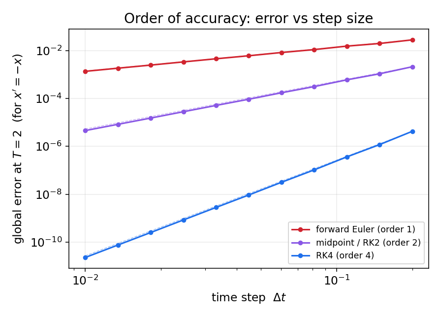
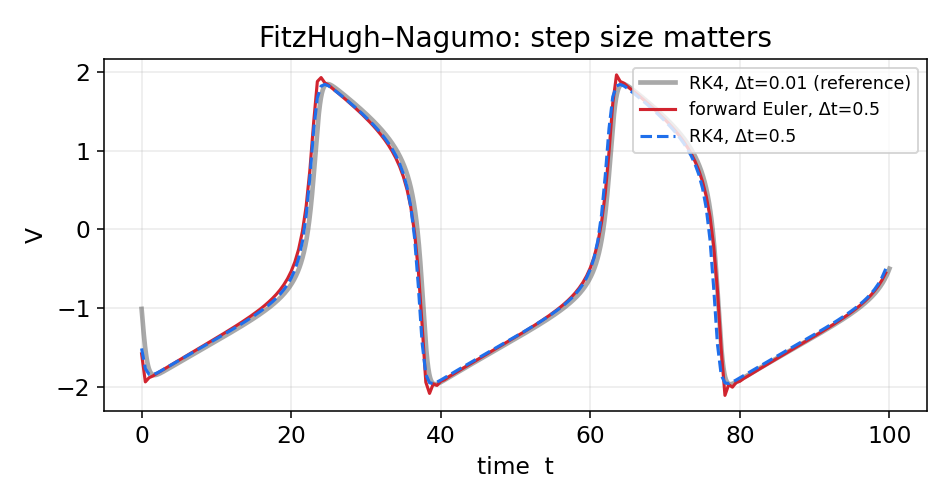
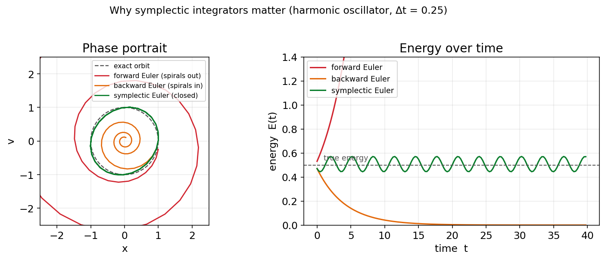

# پیوست: حل عددی معادلات دیفرانسیل معمولی

تقریباً همهٔ مدل‌های این کتاب — از هاجکین–هاکسلی تا ویلسون–کوان — به‌صورتِ معادلهٔ دیفرانسیلِ معمولی نوشته می‌شوند و جوابِ تحلیلیِ بسته ندارند. بنابراین آن‌ها را عددی حل می‌کنیم. این پیوست، روش‌های پایه‌ای را که در سراسرِ کتاب به‌کار می‌بریم گرد هم می‌آورد. مسئله این است: با داشتنِ

$$
\frac{d\mathbf{x}}{dt} = \mathbf{f}(\mathbf{x}, t), \qquad \mathbf{x}(t_0) = \mathbf{x}_0,
$$

می‌خواهیم $\mathbf{x}(t)$ را برای $t>t_0$ تقریب بزنیم. همهٔ روش‌ها زمان را به گام‌های کوچکِ $\Delta t$ می‌شکنند و از حالتِ کنونی، حالتِ گامِ بعد را می‌سازند.

## روش اویلر پیشرو

ساده‌ترین روش، مستقیماً از تعریفِ مشتق می‌آید. تقریبِ $\frac{d\mathbf{x}}{dt}\approx\frac{\mathbf{x}(t+\Delta t)-\mathbf{x}(t)}{\Delta t}$ می‌دهد:

$$
\mathbf{x}_{n+1} = \mathbf{x}_n + \Delta t\,\mathbf{f}(\mathbf{x}_n, t_n).
$$

این روش **صریح** است (سمتِ راست فقط به مقادیرِ معلومِ گامِ کنونی بستگی دارد) و **مرتبهٔ یک**: خطای محلی در هر گام از مرتبهٔ $\mathcal{O}(\Delta t^2)$ و خطای سراسری از مرتبهٔ $\mathcal{O}(\Delta t)$ است. سادگیِ آن بهای پایداریِ ضعیف دارد: برای گامِ بزرگ واگرا می‌شود، و چنان‌که خواهیم دید، برای سامانه‌های نوسانی انرژی را به‌طورِ مصنوعی می‌افزاید.

```python
def forward_euler(f, x, t, dt):
    return x + dt*f(x, t)
```

## روش اویلر پسرو

اگر به‌جای شیبِ گامِ کنونی، شیبِ گامِ بعد را به‌کار بریم، روشِ **ضمنی** اویلر پسرو به‌دست می‌آید:

$$
\mathbf{x}_{n+1} = \mathbf{x}_n + \Delta t\,\mathbf{f}(\mathbf{x}_{n+1}, t_{n+1}).
$$

اکنون $\mathbf{x}_{n+1}$ در هر دو سو ظاهر می‌شود، پس در هر گام باید یک معادله را حل کنیم (برای سامانه‌های خطی یک دستگاهِ خطی، و برای غیرخطی با روشی مانندِ نیوتن). در ازای این هزینه، روش **پایداریِ** بسیار بهتری دارد و برای سامانه‌های **سفت** (stiff) — که در آن‌ها مقیاس‌های زمانیِ بسیار متفاوت کنار هم‌اند — مناسب است. عیبِ آن، میرایی عددیِ مصنوعی است. برای معادلهٔ نمونهٔ خطیِ $x'=-x$، حل صریح است: $x_{n+1}=x_n/(1+\Delta t)$.

## روش نقطهٔ میانی

دقت را می‌توان با ارزیابیِ شیب در میانهٔ گام بالا برد. این روش، که نمونه‌ای از روش‌های **رونگه–کوتای مرتبهٔ دو** است، چنین است:

$$
\mathbf{k}_1 = \mathbf{f}(\mathbf{x}_n, t_n), \qquad
\mathbf{x}_{n+1} = \mathbf{x}_n + \Delta t\,\mathbf{f}\!\left(\mathbf{x}_n + \tfrac{\Delta t}{2}\mathbf{k}_1,\; t_n + \tfrac{\Delta t}{2}\right).
$$

خطای سراسریِ آن از مرتبهٔ $\mathcal{O}(\Delta t^2)$ است؛ یعنی نصف‌کردنِ گام، خطا را به یک‌چهارم می‌رساند.

```python
def midpoint(f, x, t, dt):
    k1 = f(x, t)
    return x + dt*f(x + 0.5*dt*k1, t + 0.5*dt)
```

## روش پرش‌قورباغه

برای سامانه‌های مرتبهٔ دومِ مکانیکی به شکلِ $\ddot{x} = a(x)$ (که در آن نیرو تنها به مکان بستگی دارد، مانندِ سامانه‌های هامیلتونی)، روشِ **پرش‌قورباغه** (leapfrog) — یا شکلِ هم‌ارزِ آن، وِرلهٔ سرعتی — انتخابِ طبیعی است. در این روش مکان و سرعت به‌صورتِ «درهم‌بافته» به‌روزرسانی می‌شوند:

$$
\begin{aligned}
v_{n+1/2} &= v_n + \tfrac{\Delta t}{2}\,a(x_n),\\
x_{n+1} &= x_n + \Delta t\,v_{n+1/2},\\
v_{n+1} &= v_{n+1/2} + \tfrac{\Delta t}{2}\,a(x_{n+1}).
\end{aligned}
$$

این روش مرتبهٔ دو، صریح، و **برگشت‌پذیر در زمان** است و — مهم‌تر از همه — یک **انتگرال‌گیرِ سیمپلکتیک** است؛ ویژگی‌ای که در بخشِ پایانیِ این پیوست به اهمیتِ آن می‌پردازیم.

## روش‌های رونگه–کوتای مرتبهٔ بالا و گام وفقی

پرکاربردترین روشِ همه‌منظوره، **رونگه–کوتای مرتبهٔ چهار** (RK4) است که با ترکیبِ وزن‌دارِ چهار ارزیابیِ شیب در هر گام، خطای سراسریِ $\mathcal{O}(\Delta t^4)$ به‌دست می‌دهد:

$$
\begin{aligned}
\mathbf{k}_1 &= \mathbf{f}(\mathbf{x}_n, t_n), &
\mathbf{k}_2 &= \mathbf{f}(\mathbf{x}_n + \tfrac{\Delta t}{2}\mathbf{k}_1,\, t_n + \tfrac{\Delta t}{2}),\\
\mathbf{k}_3 &= \mathbf{f}(\mathbf{x}_n + \tfrac{\Delta t}{2}\mathbf{k}_2,\, t_n + \tfrac{\Delta t}{2}), &
\mathbf{k}_4 &= \mathbf{f}(\mathbf{x}_n + \Delta t\,\mathbf{k}_3,\, t_n + \Delta t),
\end{aligned}
$$

$$
\mathbf{x}_{n+1} = \mathbf{x}_n + \frac{\Delta t}{6}\big(\mathbf{k}_1 + 2\mathbf{k}_2 + 2\mathbf{k}_3 + \mathbf{k}_4\big).
$$

```python
def rk4(f, x, t, dt):
    k1 = f(x, t)
    k2 = f(x + 0.5*dt*k1, t + 0.5*dt)
    k3 = f(x + 0.5*dt*k2, t + 0.5*dt)
    k4 = f(x + dt*k3, t + dt)
    return x + (dt/6.0)*(k1 + 2*k2 + 2*k3 + k4)
```

روش‌های **گام‌وفقی** مانندِ RK45 (زوجِ دورماند–پرینس) یک گام جلوتر می‌روند: در هر گام دو تقریب با مرتبه‌های متفاوت (چهار و پنج) محاسبه می‌کنند و از تفاوتِ آن‌ها برای برآوردِ خطا و تنظیمِ خودکارِ $\Delta t$ استفاده می‌کنند — گامِ کوچک آن‌جا که جواب تند تغییر می‌کند و گامِ بزرگ آن‌جا که هموار است. تابعِ `solve_ivp` در کتابخانهٔ `scipy` به‌طورِ پیش‌فرض همین روش را به‌کار می‌برد و برای بیشترِ کارهای غیرسفت انتخابِ خوبی است.

## مرتبهٔ دقت در عمل

تفاوتِ مرتبه‌ها را می‌توان مستقیماً دید: اگر خطای سراسری را در زمانِ پایانیِ ثابت بر حسبِ $\Delta t$ در مقیاسِ لگاریتمی رسم کنیم، هر روش خطی با شیبی برابرِ مرتبه‌اش ظاهر می‌شود.

<figure markdown="span">
  
  <figcaption>خطای سراسری بر حسب گام زمانی برای معادلهٔ آزمونِ x'=-x. شیبِ هر خط برابرِ مرتبهٔ روش است: ۱ برای اویلر، ۲ برای نقطهٔ میانی و ۴ برای RK4. کاهشِ گام در RK4 خطا را بسیار تندتر کم می‌کند.</figcaption>
</figure>

این تفاوت در عمل اهمیت دارد. برای نمونه، در مدلِ فیتزهیو–ناگومو با گامِ نسبتاً بزرگ، اویلرِ پیشرو خطای فازِ محسوسی انباشت می‌کند، حال‌آن‌که RK4 با همان گام به جوابِ مرجع بسیار نزدیک می‌ماند:

<figure markdown="span">
  
  <figcaption>مدل فیتزهیو–ناگومو با گام درشتِ Δt=0.5: اویلرِ پیشرو نسبت به جوابِ مرجع (RK4 با گام ریز) خطای فاز انباشت می‌کند، در حالی که RK4 با همان گامِ درشت بسیار دقیق‌تر است.</figcaption>
</figure>

## دینامیک هامیلتونی و انتگرال‌گیرهای سیمپلکتیک

دسته‌ای ویژه از سامانه‌ها، **سامانه‌های هامیلتونی** هستند که در آن‌ها کمیتی به نامِ انرژی (هامیلتونیِ $H$) در طولِ حرکت پایسته می‌ماند و جریانِ سامانه حجمِ فضای فاز را حفظ می‌کند (قضیهٔ لیوویل). نوسانگرِ هماهنگ ساده‌ترین نمونه است، و سامانه‌های مدارِی و مسئلهٔ سه‌جسمی نمونه‌های پیچیده‌ترِ آن‌اند. مشکل این‌جاست که روش‌های همه‌منظوره مانندِ اویلر یا حتی RK4 این ساختار را حفظ نمی‌کنند: انرژیِ عددی به‌تدریج از مقدارِ درستش دور می‌شود (در اویلرِ پیشرو می‌افزاید، در اویلرِ پسرو می‌کاهد) و در شبیه‌سازی‌های بلندمدت جواب بی‌اعتبار می‌شود.

**انتگرال‌گیرهای سیمپلکتیک** برای همین ساخته شده‌اند: آن‌ها ساختارِ هندسیِ (سیمپلکتیکِ) فضای فاز را دقیقاً حفظ می‌کنند. در نتیجه، هرچند انرژی را کاملاً ثابت نگه نمی‌دارند، خطای انرژی را **کران‌دار** می‌کنند — انرژی پیرامونِ مقدارِ درست نوسان می‌کند اما به‌طورِ مداوم دور نمی‌شود. اویلرِ سیمپلکتیک (نیمه‌ضمنی) و روشِ پرش‌قورباغه نمونه‌های ساده‌ای از این انتگرال‌گیرها هستند. شکلِ زیر تفاوت را آشکار می‌کند:

<figure markdown="span">
  
  <figcaption>نوسانگر هماهنگ با Δt=0.25. چپ: در صفحهٔ فاز، اویلرِ پیشرو به بیرون و اویلرِ پسرو به درون مارپیچ می‌زند، اما اویلرِ سیمپلکتیک روی مداری بسته نزدیکِ مدارِ دقیق می‌ماند. راست: انرژی در اویلرِ پیشرو می‌افزاید، در پسرو می‌میرد، و در سیمپلکتیک کران‌دار می‌ماند.</figcaption>
</figure>

به همین دلیل، هرگاه با سامانه‌ای هامیلتونی سر و کار داشته باشیم و به شبیه‌سازیِ بلندمدتِ پایدار نیاز باشد، انتگرال‌گیرِ سیمپلکتیک انتخابِ درست است، نه لزوماً روشی با مرتبهٔ دقتِ بالاتر.

## جمع‌بندی

جدولِ زیر روش‌ها را کنار هم می‌گذارد:

| روش | مرتبه | نوع | کاربردِ شاخص |
|---|---|---|---|
| اویلر پیشرو | ۱ | صریح | آموزشی، گامِ بسیار ریز |
| اویلر پسرو | ۱ | ضمنی | سامانه‌های سفت |
| نقطهٔ میانی (RK2) | ۲ | صریح | مصالحهٔ ساده دقت/هزینه |
| پرش‌قورباغه / ورله | ۲ | صریح (سیمپلکتیک) | سامانه‌های هامیلتونی |
| RK4 | ۴ | صریح | پیش‌فرضِ همه‌منظوره |
| RK45 (گام‌وفقی) | ۴–۵ | صریح | کنترلِ خودکارِ خطا |

در سراسرِ این کتاب، برای سادگی و شفافیتِ آموزشی بیشتر از اویلرِ پیشرو با گامِ ریز استفاده کرده‌ایم؛ اما برای کارِ پژوهشیِ جدی، RK4 یا `solve_ivp` انتخابِ بهتری است، و برای سامانه‌های هامیلتونی، یک انتگرال‌گیرِ سیمپلکتیک.

---

برای مطالعهٔ بیشتر:

<div dir="ltr" markdown>

- Hairer, E., Nørsett, S.P., Wanner, G., 1993. Solving Ordinary Differential Equations I. Springer.
- Press, W.H., Teukolsky, S.A., Vetterling, W.T., Flannery, B.P., 2007. Numerical Recipes, 3rd ed. Cambridge University Press.
- Hairer, E., Lubich, C., Wanner, G., 2006. Geometric Numerical Integration. Springer.

</div>
