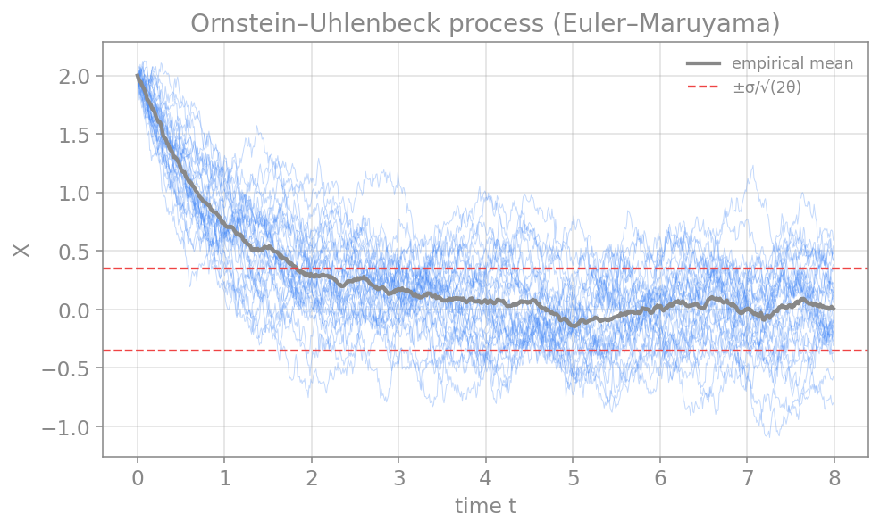
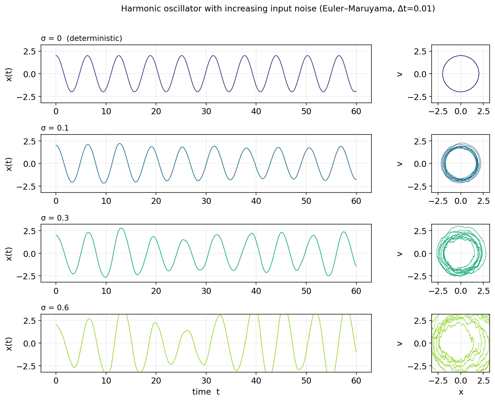
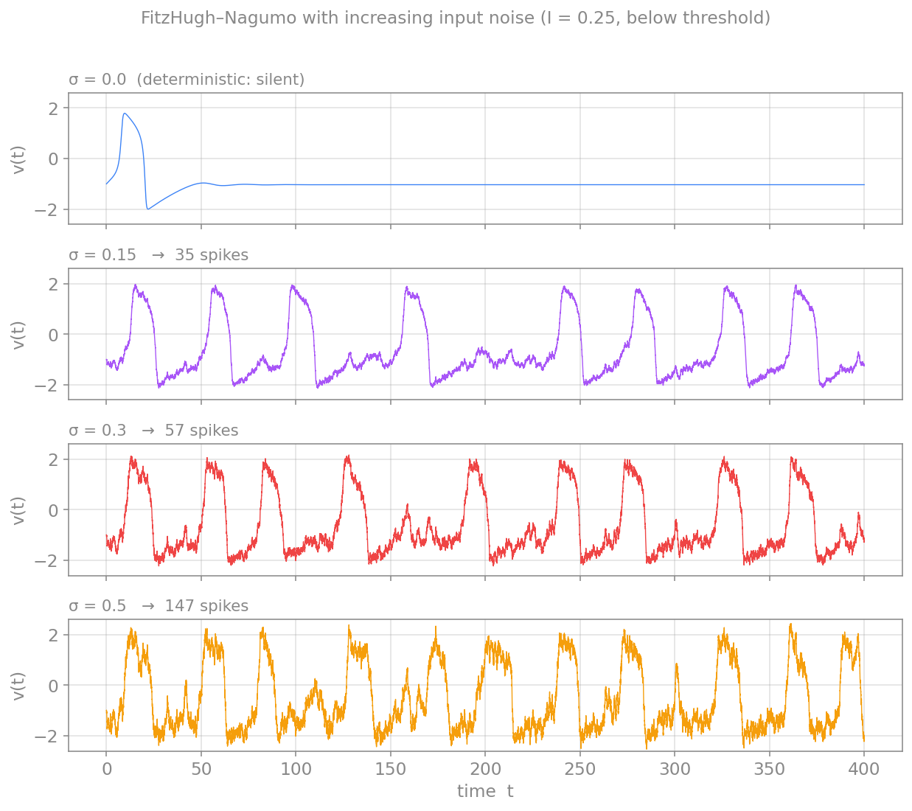
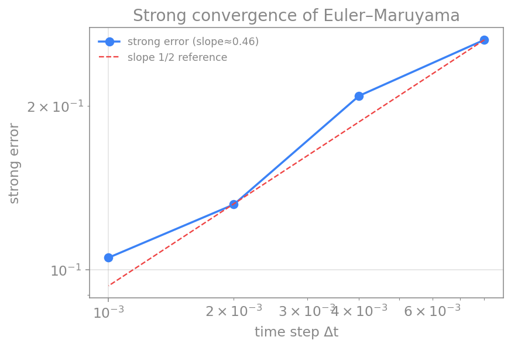

# پیوست: حل عددی معادلات دیفرانسیل تصادفی (روش اویلر–مارویاما)

تا اینجا سامانه‌ها را قطعی فرض کردیم: شرطِ اولیه آینده را به‌طورِ یکتا تعیین می‌کرد. اما نورون‌ها در محیطی پرنوفه زندگی می‌کنند — بازشدنِ تصادفیِ کانال‌های یونی، بمبارانِ سیناپسیِ نامنظم و ورودی‌های پس‌زمینه همگی نوفه‌اند. برای مدل‌کردنِ این پدیده‌ها به **معادلهٔ دیفرانسیلِ تصادفی** (SDE) و روشی برای حلِ عددیِ آن نیاز داریم. ساده‌ترین و پرکاربردترین چنین روشی، **اویلر–مارویاما** است.

## فرایند وینر: سنگ‌بنای نوفه

نوفهٔ پایه در این چارچوب، **فرایند وینر** (یا حرکتِ براونی) $W(t)$ است. تنها ویژگیِ موردِ نیازِ ما این است که افزایش‌های آن در بازه‌های جدا از هم مستقل‌اند و توزیعِ نرمال با واریانسی برابرِ طولِ بازه دارند:

$$
\Delta W = W(t+\Delta t) - W(t) \sim \mathcal{N}(0, \Delta t).
$$

نکتهٔ کلیدی و سرنوشت‌ساز در همین‌جاست: انحرافِ معیارِ $\Delta W$ نه با $\Delta t$، بلکه با $\sqrt{\Delta t}$ مقیاس می‌خورد. همین ریشهٔ دوم است که حسابِ تصادفی را از حسابِ معمولی جدا می‌کند و، چنان‌که خواهیم دید، مرتبهٔ همگراییِ روش را نصف می‌کند.

## معادلهٔ دیفرانسیل تصادفی

یک SDE دو بخش دارد: یک جملهٔ **روند** (drift) که مانندِ یک ODE معمولی رفتارِ متوسط را می‌راند، و یک جملهٔ **پخش** (diffusion) که نوفه را وارد می‌کند:

$$
dX = \underbrace{a(X, t)\,dt}_{\text{drift}} + \underbrace{b(X, t)\,dW}_{\text{diffusion}}.
$$

در تفسیرِ ایتو، که در این‌جا به‌کار می‌بریم، جملهٔ پخش در آغازِ هر بازه ارزیابی می‌شود. این معادله را باید به‌صورتِ شکلِ انتگرالی فهمید، چون $W$ مشتق‌پذیر نیست؛ اما برای شبیه‌سازی، تنها به شکلِ گسسته‌شدهٔ آن نیاز داریم.

## روش اویلر–مارویاما

روشِ اویلر–مارویاما دقیقاً همان اویلرِ پیشرو است، با یک افزوده: گامِ نوفه. هر بازه را گسسته می‌کنیم و افزایشِ وینر را با یک عددِ تصادفیِ نرمال می‌سازیم:

$$
X_{n+1} = X_n + a(X_n, t_n)\,\Delta t + b(X_n, t_n)\,\sqrt{\Delta t}\;\xi_n,
\qquad \xi_n \sim \mathcal{N}(0, 1).
$$

توجه کنید که جملهٔ نوفه در $\sqrt{\Delta t}$ ضرب می‌شود، نه در $\Delta t$ — این مستقیماً از ویژگیِ فرایندِ وینر می‌آید و قلبِ تفاوتِ این روش با اویلرِ معمولی است.

```python
import numpy as np

def euler_maruyama(a, b, x0, T, dt, rng=None):
    rng = rng or np.random.default_rng()
    n = int(T/dt)
    x = np.empty(n); x[0] = x0
    for i in range(n-1):
        dW = rng.normal(0.0, np.sqrt(dt))      # Wiener increment ~ N(0, dt)
        x[i+1] = x[i] + a(x[i])*dt + b(x[i])*dW
    return np.arange(n)*dt, x
```

## مثال: فرایند اورنشتاین–اولنبک

نمونهٔ کلاسیک، فرایندِ **اورنشتاین–اولنبک** (OU) است که یک سامانهٔ خطیِ بازگشت‌به‌میانگین را با نوفه توصیف می‌کند و در علوم اعصاب برای مدل‌کردنِ ولتاژِ زیرآستانه با ورودیِ پس‌زمینه به‌کار می‌رود:

$$
dX = -\theta\,X\,dt + \sigma\,dW.
$$

جملهٔ روندِ $-\theta X$ متغیر را به‌سمتِ صفر بازمی‌کشد و جملهٔ پخشِ $\sigma\,dW$ آن را پراکنده می‌کند. تعادلِ این دو، یک توزیعِ ایستا با انحرافِ معیارِ $\sigma/\sqrt{2\theta}$ می‌سازد. اگر چند مسیرِ نمونه را شبیه‌سازی کنیم، می‌بینیم که میانگین به‌صورتِ نمایی به صفر می‌رسد و پراکندگیِ مسیرها در همان نوارِ ایستا تثبیت می‌شود:

<figure markdown="span">
  
  <figcaption>چند مسیرِ نمونهٔ فرایند اورنشتاین–اولنبک با روش اویلر–مارویاما. میانگینِ تجربی (سیاه) به‌صورت نمایی به صفر بازمی‌گردد و پراکندگیِ مسیرها در نوارِ ایستای ±σ/√(2θ) (خط‌چینِ قرمز) تثبیت می‌شود.</figcaption>
</figure>

## مثال: نوسانگر هماهنگ با ورودی نوفه‌ای

روش به همان سادگی به سامانه‌های دوبعدی تعمیم می‌یابد. نوسانگرِ هماهنگ را در نظر بگیرید که یک جریانِ نوفه‌ای روی سرعتِ آن اثر می‌گذارد — نمونه‌ای ساده از یک سامانهٔ نوسانی که پیوسته تحتِ تأثیرِ نوفهٔ پس‌زمینه است:

$$
\begin{aligned}
dx &= v\,dt,\\
dv &= -\omega^2 x\,dt + \sigma\,dW.
\end{aligned}
$$

تنها معادلهٔ سرعت یک جملهٔ پخش دارد، چون نوفه روی نیرو (و نه مستقیماً روی مکان) وارد می‌شود. در شکلِ گسسته، فقط همان معادله یک گامِ $\sigma\sqrt{\Delta t}\,\xi$ می‌گیرد. نکتهٔ ظریف این است که برای پایدارماندنِ دامنهٔ نوسانِ نسخهٔ قطعی، سرعت را پیش از مکان به‌روزرسانی می‌کنیم و سپس از سرعتِ تازه برای مکان استفاده می‌کنیم؛ این همان ترتیبِ نیمه‌ضمنیِ (سیمپلکتیکِ) پیوستِ معادلات قطعی است که از انباشتِ مصنوعیِ انرژی در اویلر جلوگیری می‌کند.

```python
def sho_step(x, v, dt, omega, sigma, rng):
    dW = rng.normal(0.0, np.sqrt(dt))         # Wiener increment ~ N(0, dt)
    v_new = v + (-omega**2 * x)*dt + sigma*dW  # update velocity first (noise here)
    x_new = x + v_new*dt                        # semi-implicit: use the new velocity
    return x_new, v_new
```

اکنون به‌جای یک مقدارِ نوفه، چند مقدار را امتحان می‌کنیم تا اثرِ توانِ نوفه را ببینیم. با $\sigma=0$ نوسان کاملاً منظم و دامنه‌اش ثابت است (در صفحهٔ فاز یک دایرهٔ بسته). با افزایشِ $\sigma$، نوفه پیوسته نوسانگر را از مدارش بیرون می‌راند: نوسان نامنظم‌تر می‌شود و دایرهٔ صفحهٔ فاز به یک حلقهٔ پهن و پُرنوفه بدل می‌شود، اما نوسان از میان نمی‌رود.

<figure markdown="span">
  
  <figcaption>نوسانگر هماهنگ با توان‌های فزایندهٔ نوفه (σ = ۰، ۰٫۱، ۰٫۳، ۰٫۶). ستون چپ سری زمانی و ستون راست صفحهٔ فاز است. با σ=۰ مدار یک دایرهٔ بسته است؛ هرچه σ بزرگ‌تر شود، مدار به حلقه‌ای پهن‌تر و نامنظم‌تر تبدیل می‌شود.</figcaption>
</figure>

## مثال: مدل فیتزهیو–ناگومو با جریان نوفه‌ای

نمونهٔ مهم‌تر برای علوم اعصاب، افزودنِ نوفه به جریانِ ورودیِ یک نورونِ تحریک‌پذیر است. مدلِ فیتزهیو–ناگومو (که در فصل دوم دیدیم) را با یک جملهٔ نوفه روی معادلهٔ ولتاژ می‌نویسیم:

$$
\begin{aligned}
dv &= \Big(v - \tfrac{v^3}{3} - w + I\Big)\,dt + \sigma\,dW,\\
dw &= \varepsilon\,(v + a - b\,w)\,dt.
\end{aligned}
$$

```python
def fhn_step(v, w, dt, a, b, eps, I, sigma, rng):
    dW = rng.normal(0.0, np.sqrt(dt))                # Wiener increment ~ N(0, dt)
    v_new = v + (v - v**3/3 - w + I)*dt + sigma*dW    # noisy input current
    w_new = w + eps*(v + a - b*w)*dt
    return v_new, w_new
```

جریانِ ورودیِ $I$ را زیرِ آستانهٔ شلیک انتخاب می‌کنیم؛ در نتیجه نسخهٔ قطعی روی نقطهٔ تعادلِ پایدار می‌ماند و کاملاً خاموش است. حال همان شبیه‌سازی را برای چند توانِ نوفه تکرار می‌کنیم. با $\sigma=0$ نورون ساکت است؛ اما همین‌که نوفه را بزرگ‌تر کنیم، تلنگرهای تصادفی نورون را از آستانه عبور می‌دهند و پتانسیل‌های عمل پدید می‌آیند — و هرچه توانِ نوفه بیشتر، شلیک‌ها پُرتکرارتر. این پدیده به **شلیکِ القاشده با نوفه** مشهور است و نشان می‌دهد که نرخِ شلیک می‌تواند مستقیماً با شدتِ نوفه تنظیم شود.

<figure markdown="span">
  
  <figcaption>مدل فیتزهیو–ناگومو با جریان زیرآستانه (I=۰٫۲۵) و توان‌های فزایندهٔ نوفه. با σ=۰ نورون خاموش است؛ با افزایش σ شمار پتانسیل‌های عملِ القاشده با نوفه به‌طور یکنواخت بیشتر می‌شود.</figcaption>
</figure>

این دو مثال نشان می‌دهند که نوفه صرفاً «اخلال» نیست؛ شدتِ آن می‌تواند رفتارِ سامانه را به‌طور پیوسته تنظیم کند و گاه رفتارِ کیفیِ تازه‌ای (مانندِ شلیکِ یک نورونِ خاموش) بیافریند.

## همگرایی: قوی، ضعیف و بهای نوفه

در سامانه‌های تصادفی دو نوع همگرایی را از هم جدا می‌کنیم. **همگراییِ قوی** به دقتِ خودِ مسیر (به‌ازای همان تحققِ نوفه) می‌پردازد، حال‌آن‌که **همگراییِ ضعیف** تنها دقتِ کمیت‌های میانگین مانندِ امید یا واریانس را می‌سنجد. روشِ اویلر–مارویاما مرتبهٔ همگراییِ **قویِ** $1/2$ و مرتبهٔ همگراییِ **ضعیفِ** $1$ دارد.

مرتبهٔ قویِ $1/2$ پیامدِ مستقیمِ همان $\sqrt{\Delta t}$ است و آن را می‌توان به‌روشنی دید: اگر خطای قوی را بر حسبِ گام در مقیاسِ لگاریتمی رسم کنیم، شیبِ خط نزدیکِ $1/2$ است — یعنی نصفِ مرتبهٔ اویلرِ معمولی برای ODEها. به بیانِ دیگر، نوفه نیمی از مرتبهٔ دقت را می‌گیرد.

<figure markdown="span">
  
  <figcaption>همگراییِ قویِ روش اویلر–مارویاما. خطای قوی با شیبی نزدیک به ۱/۲ کاهش می‌یابد؛ نصفِ مرتبهٔ اویلرِ پیشرو برای معادلات قطعی. این، بهای حضورِ نوفه است.</figcaption>
</figure>

## نکته‌ها و گام‌های بعدی

دو نکتهٔ تکمیلی ارزشِ یادآوری دارند. نخست، **تفسیرِ ایتو در برابرِ استراتونوویچ**: وقتی جملهٔ پخش به حالت بستگی دارد ($b$ تابعی از $X$)، انتخابِ نقطهٔ ارزیابیِ نوفه در نتیجه اثر می‌گذارد؛ ما تفسیرِ ایتو را به‌کار بردیم که با شکلِ اویلر–مارویاما سازگار است. دوم، روشِ **میلستین** با افزودنِ یک جملهٔ تصحیحی، مرتبهٔ همگراییِ قوی را به $1$ می‌رساند و گزینهٔ بعدی است اگر دقتِ مسیرها اهمیت داشته باشد.

این ابزار در بخش‌های بعدی بارها به کار می‌آید: از مدل‌های نورونِ نوفه‌ای و نسخهٔ تصادفیِ هاجکین–هاکسلی گرفته تا ورودیِ پس‌زمینهٔ تصادفی در شبکه‌های بزرگ که در بخشِ شبکه‌ها به آن می‌پردازیم.

---

برای مطالعهٔ بیشتر:

<div dir="ltr" markdown>

- Higham, D.J., 2001. An algorithmic introduction to numerical simulation of stochastic differential equations. SIAM Review 43(3), 525–546.
- Kloeden, P.E., Platen, E., 1992. Numerical Solution of Stochastic Differential Equations. Springer.
- Gardiner, C., 2009. Stochastic Methods, 4th ed. Springer.

</div>
