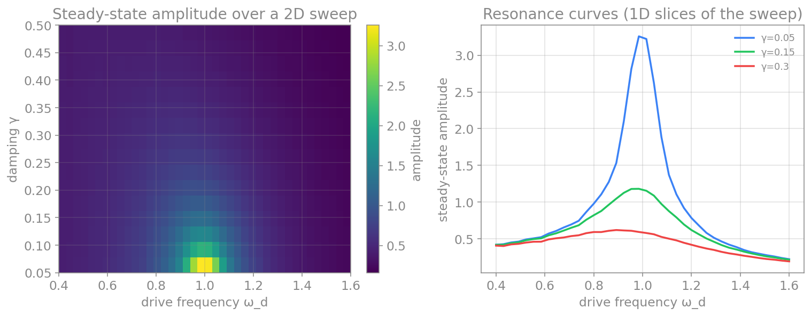
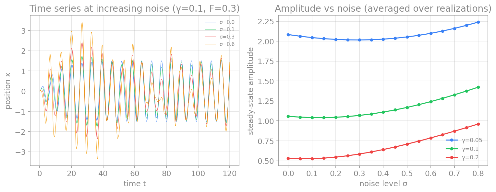
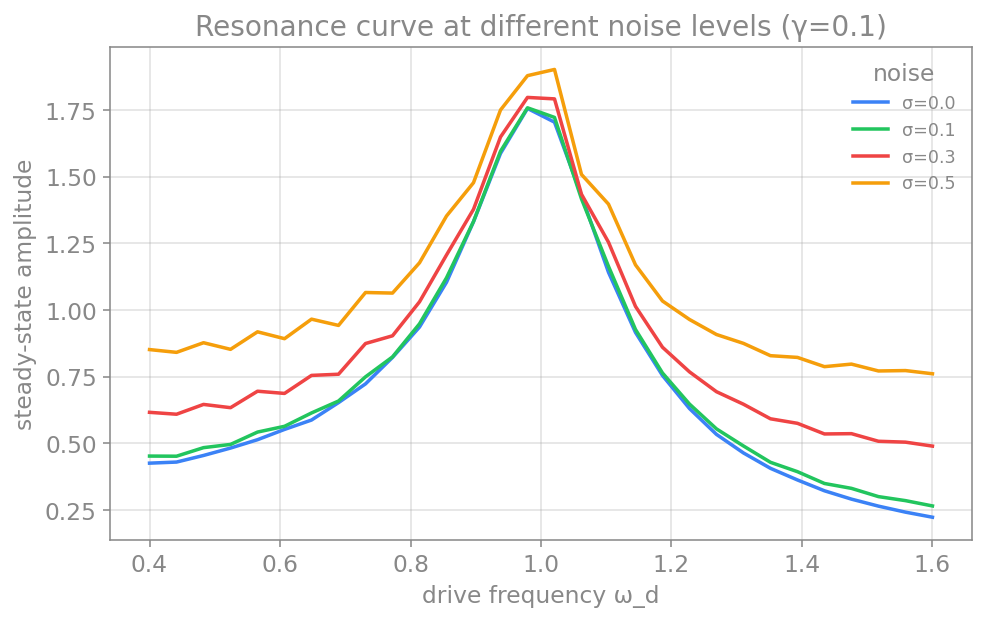
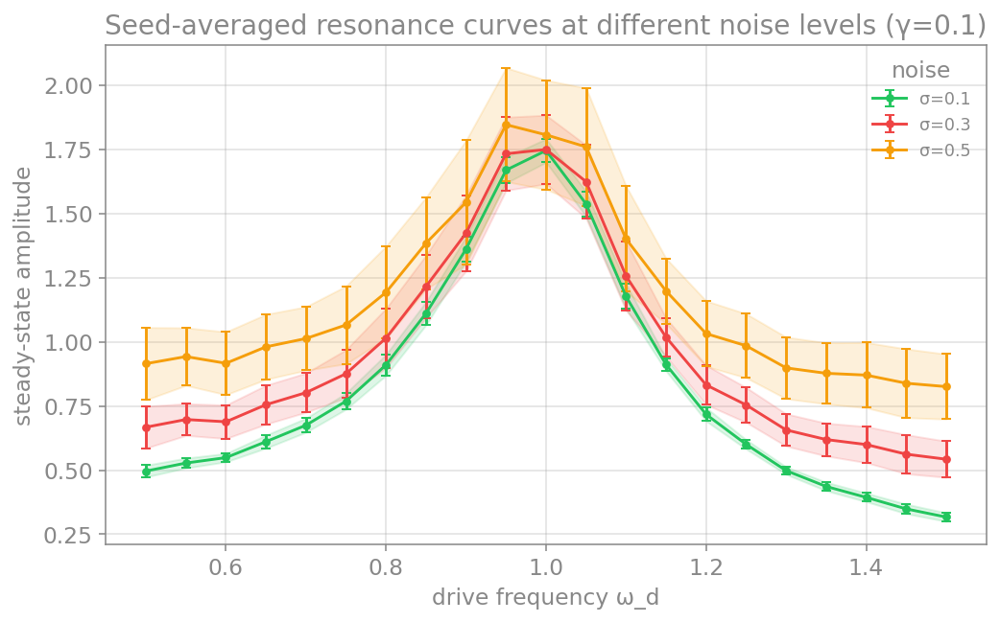

# پیوست: طراحی گردش‌کار و آزمایش محاسباتی

در فصل‌های پیش، روش‌های عددی را آموختیم و یاد گرفتیم که چگونه **یک** شبیه‌سازی را اجرا کنیم. اما در پژوهشِ واقعی، به‌ندرت تنها یک بار شبیه‌سازی می‌کنیم. تقریباً همیشه می‌خواهیم بدانیم که رفتارِ سامانه چگونه به پارامترها بستگی دارد: اگر نوفه را بیشتر کنیم چه می‌شود؟ اگر میرایی را کم کنیم؟ اگر نیروی محرک را تغییر دهیم؟ پاسخ به این پرسش‌ها نیازمندِ **جاروبِ پارامترها** (parameter sweep) است؛ یعنی اجرای ده‌ها، صدها یا هزاران شبیه‌سازی با مقادیرِ متفاوتِ پارامترها.

این پیوست دربارهٔ ریاضیاتِ روش‌ها نیست، بلکه دربارهٔ **طراحیِ گردش‌کار** است: چگونه آزمایشِ محاسباتیِ خود را چنان سازمان دهیم که پاکیزه، قابلِ‌فهم و مهم‌تر از همه **بازتولیدپذیر** (reproducible) باشد. یک نتیجهٔ عددی که نتوان آن را دوباره تولید کرد، در علم ارزشِ چندانی ندارد.

## چرا یک شبیه‌سازی هرگز کافی نیست

برای آنکه ملموس باشد، یک سامانهٔ نمونه را در نظر می‌گیریم که سه پارامترِ جالب دارد: **نوسانگرِ هماهنگِ میرا با نیروی محرک و نوفه**. معادلهٔ آن چنین است:

$$
\ddot{x} + 2\gamma\dot{x} + \omega_0^2 x = F\cos(\omega_d t) + \sigma\,\xi(t),
$$

که در آن $\gamma$ ضریبِ میرایی، $F$ دامنهٔ نیروی محرک، $\omega_d$ بسامدِ محرک، و $\sigma$ شدتِ نوفه است. این یک سامانهٔ غنی است: میرایی نوسان را خاموش می‌کند، نیروی محرک آن را زنده نگه می‌دارد، و نوفه آن را آشفته می‌کند. رفتارِ آن، به‌ویژه پدیدهٔ **تشدید** (resonance)، تنها وقتی آشکار می‌شود که پارامترها را تغییر دهیم.

برای نمونه، اگر دامنهٔ پایدارِ نوسان را بر حسبِ بسامدِ محرک و میرایی جاروب کنیم، ساختاری پدید می‌آید که هیچ شبیه‌سازیِ منفردی نمی‌توانست آن را نشان دهد:

<figure markdown="span">
  
  <figcaption>دامنهٔ پایدارِ نوسانگرِ محرک‌دار بر حسبِ بسامدِ محرک و میرایی. چپ: نقشهٔ رنگیِ یک جاروبِ دوبعدی که ستیغِ تشدید را آشکار می‌کند (دامنه در ωᵈ≈ω₀ بیشینه است و برای میرایی کم تیزتر). راست: همان داده به‌صورتِ چند برشِ یک‌بعدی، یعنی منحنی‌های آشنای تشدید.</figcaption>
</figure>

جاروب بر پارامترِ **نوفه** نیز پرسشِ متفاوتی را روشن می‌کند: نوفه چه اثری بر دامنهٔ نوسان دارد؟ یک نکتهٔ مهم در اینجا پدیدار می‌شود: چون نوفه تصادفی است، هر اجرای منفرد کمی متفاوت است؛ پس برای دیدنِ روندِ واقعی باید کمیتِ موردِنظر را روی **چند تحققِ نوفه** میانگین بگیریم. شکلِ زیر این جاروب را نشان می‌دهد:

<figure markdown="span">
  
  <figcaption>اثرِ نوفه بر نوسانگر. چپ: سری‌های زمانی برای توان‌های فزایندهٔ نوفه (σ = ۰، ۰٫۱، ۰٫۳، ۰٫۶)؛ هرچه σ بزرگ‌تر، نوسان نامنظم‌تر. راست: دامنهٔ پایدار بر حسبِ توانِ نوفه برای چند مقدارِ میرایی، میانگین‌گرفته‌شده روی چند تحققِ نوفه؛ افزایشِ نوفه دامنه را بالا می‌برد و این اثر به میرایی بستگی دارد.</figcaption>
</figure>

نکته روشن است: یک نقطه از این نقشه، حاصلِ یک شبیه‌سازی است، اما **کلِ داستان** تنها از مجموعهٔ شبیه‌سازی‌ها بیرون می‌آید. پس باید یاد بگیریم که جاروبِ پارامترها را به‌شکلی سازمان‌یافته اجرا کنیم.

## گامِ نخست: یک تابع برای یک شبیه‌سازی

سنگ‌بنای یک گردش‌کارِ پاکیزه این است که **یک شبیه‌سازی را در یک تابعِ مستقل** بگنجانیم. این تابع همهٔ پارامترها را به‌صورتِ ورودی می‌گیرد و نتیجه را برمی‌گرداند، بدونِ هیچ متغیرِ سراسری یا وابستگیِ پنهان. این کار، شبیه‌سازی را قابلِ‌آزمون، قابلِ‌تکرار و آسان برای جاروب می‌کند.

```python
import numpy as np

def simulate_oscillator(gamma, F, sigma, omega0=1.0, omega_d=1.0,
                        x0=0.0, v0=0.0, T=100.0, dt=0.01, seed=0):
    """Run one simulation of the driven damped noisy oscillator.

    Returns the time array and the position and velocity trajectories.
    """
    rng = np.random.default_rng(seed)
    n = int(T / dt)
    t = np.arange(n) * dt
    x = np.empty(n)
    v = np.empty(n)
    x[0], v[0] = x0, v0
    for i in range(n - 1):
        drive = F * np.cos(omega_d * t[i])
        dW = rng.normal(0.0, np.sqrt(dt))
        acceleration = -2*gamma*v[i] - omega0**2 * x[i] + drive
        v[i+1] = v[i] + acceleration * dt + sigma * dW
        x[i+1] = x[i] + v[i+1] * dt
    return t, x, v
```

چند انتخابِ طراحیِ مهم در همین تابع دیده می‌شود. نخست، **همهٔ پارامترها صریح‌اند**؛ هیچ‌چیز از بیرونِ تابع خوانده نمی‌شود. دوم، **مقدارِ اولیهٔ تصادفی** (random seed، در کد با نامِ `seed`) یک ورودیِ صریح است؛ این برای بازتولیدپذیری حیاتی است، چون با مقدارِ اولیهٔ یکسان همان نوفه و همان نتیجه را به‌دست می‌آوریم. سوم، تابع تنها **یک کار** می‌کند: شبیه‌سازی. رسم، ذخیره و تحلیل را به بخش‌های دیگر می‌سپاریم.

اغلب به‌جای کلِ مسیر، تنها به یک یا چند **کمیتِ خلاصه** نیاز داریم؛ مثلاً دامنهٔ پایدار. خوب است این کمیت‌ها را نیز در توابعِ جداگانه تعریف کنیم:

```python
def steady_state_amplitude(x):
    # standard deviation of the second half of the trajectory
    half = len(x) // 2
    return np.std(x[half:])
```

## گامِ دوم: جاروب در چند پارامتر

اکنون که یک شبیه‌سازی در یک تابع است، جاروب به‌سادگیِ چند حلقهٔ تودرتو می‌شود. اما نکتهٔ مهمِ طراحی این است که جاروب نباید تنها نتیجه را چاپ کند و فراموش کند؛ باید **داده‌ها را ذخیره کند** و نیز یک **فرادادهٔ** (metadata) دقیق نگه دارد که بگوید هر فایلِ خروجی با کدام پارامترها تولید شده است.

ساختارِ پیشنهادی چنین است: برای هر اجرا، (۱) یک شناسهٔ یکتا می‌سازیم، (۲) داده‌های عددی را در یک فایل ذخیره می‌کنیم، و (۳) پارامترها و مسیرِ فایل را در یک فهرست نگه می‌داریم. در پایان، این فهرست را در یک فایلِ فرادادهٔ واحد می‌نویسیم.

```python
import numpy as np
import json
import os
from datetime import datetime, timezone

def simulate_oscillator(gamma, F, sigma, omega0=1.0, omega_d=1.0,
                        x0=0.0, v0=0.0, T=50.0, dt=0.01, seed=0):
    rng = np.random.default_rng(seed)
    n = int(T / dt)
    t = np.arange(n) * dt
    x = np.empty(n)
    v = np.empty(n)
    x[0], v[0] = x0, v0
    for i in range(n - 1):
        drive = F * np.cos(omega_d * t[i])
        dW = rng.normal(0.0, np.sqrt(dt))
        acceleration = -2*gamma*v[i] - omega0**2 * x[i] + drive
        v[i+1] = v[i] + acceleration * dt + sigma * dW
        x[i+1] = x[i] + v[i+1] * dt
    return t, x, v

def run_name(gamma, F, sigma, omega_d):
    # a descriptive filename built from the parameter values
    return f"run_gamma{gamma:.2f}_F{F:.2f}_sigma{sigma:.2f}_wd{omega_d:.2f}"

def run_sweep(gammas, forces, sigmas, omega_ds, fixed, output_dir):
    os.makedirs(output_dir, exist_ok=True)
    runs = []
    index = 0
    for gamma in gammas:
        for F in forces:
            for sigma in sigmas:
                for omega_d in omega_ds:
                    params = {"gamma": gamma, "F": F, "sigma": sigma,
                              "omega_d": omega_d, **fixed}
                    t, x, v = simulate_oscillator(gamma=gamma, F=F, sigma=sigma,
                                                  omega_d=omega_d, **fixed)

                    # save the numerical data (compressed) for this run
                    file_path = f"{run_name(gamma, F, sigma, omega_d)}.npz"
                    np.savez_compressed(os.path.join(output_dir, file_path),
                                        t=t, x=x, v=v)

                    # record an incremental index, the parameters, and the file path
                    runs.append({"index": index, "params": params,
                                 "file_path": file_path})
                    index += 1

    # write a single metadata file describing the whole sweep
    metadata = {
        "created": datetime.now(timezone.utc).isoformat(),
        "description": "driven damped noisy oscillator parameter sweep",
        "swept_parameters": {"gamma": gammas, "F": forces,
                             "sigma": sigmas, "omega_d": omega_ds},
        "fixed_parameters": fixed,
        "n_runs": len(runs),
        "runs": runs,
    }
    with open(os.path.join(output_dir, "metadata.json"), "w") as f:
        json.dump(metadata, f, indent=2)
    return metadata

# define the sweep: damping, drive force, noise, and drive frequency
gammas = [0.05, 0.1, 0.2]
forces = [0.0, 0.5, 1.0]
sigmas = [0.0, 0.05]
omega_ds = [0.9, 1.0, 1.1]
fixed = {"omega0": 1.0, "T": 50.0, "dt": 0.01, "seed": 0}

metadata = run_sweep(gammas, forces, sigmas, omega_ds, fixed, output_dir="sweep_output")
print(f"ran {metadata['n_runs']} simulations")
print("data and metadata saved in: sweep_output/")
```

این کد $3 \times 3 \times 2 \times 3 = 54$ شبیه‌سازی را اجرا می‌کند، داده‌های هرکدام را در یک فایلِ فشردهٔ `.npz` با نامی **توصیفی** ذخیره می‌کند (مانندِ `run_gamma0.05_F0.50_sigma0.05_wd1.00.npz`)، و یک فایلِ `metadata.json` می‌سازد که همهٔ پارامترها و مسیرِ فایلِ هر اجرا را در خود دارد.

!!! tip "نام‌گذاریِ توصیفی در برابر هش"
    در اینجا فایل‌ها را با نامی توصیفی، شاملِ مقدارِ هر پارامتر، نام‌گذاری کردیم. مزیتِ این روش این است که با یک نگاه به نامِ فایل می‌توان فهمید با کدام پارامترها ساخته شده، و برای یافتنِ خروجیِ یک شبیه‌سازیِ خاص (مثلاً وقتی می‌خواهیم رفتارِ عجیبی را دقیق‌تر بررسی کنیم) نیازی به مراجعه به فراداده نیست. برای جاروب‌های کم‌بُعد (دو یا سه پارامتر)، این روش بهترین انتخاب است.

    اما اگر شمارِ پارامترها زیاد باشد (مثلاً هفت یا هشت)، نامِ توصیفی بسیار طولانی و ناخوانا می‌شود و حتی ممکن است از حدِ مجازِ طولِ نامِ فایل در سیستم‌عامل بگذرد. در آن حالت، روشِ بهتر ساختنِ یک **هشِ کوتاه** (مثلاً با `hashlib.md5`) از مجموعهٔ پارامترهاست؛ نامی مانندِ `run_3a8f1c2d.npz` که کوتاه و یکتاست، و پیوندِ آن به پارامترها تنها از راهِ فایلِ فراداده برقرار می‌شود. پس انتخابِ روشِ نام‌گذاری به ابعادِ جاروب بستگی دارد.

## گامِ سوم: چرا فراداده اهمیت دارد

ممکن است پرسیده شود چرا این‌همه دقت در فراداده لازم است. تصور کنید چند ماه بعد به این داده‌ها بازمی‌گردید و با پوشه‌ای پر از فایل‌های `run_3a8f1c2d.npz` روبه‌رو می‌شوید. بدونِ فراداده، نمی‌دانید کدام فایل با کدام پارامترها ساخته شده است؛ داده‌ها عملاً بی‌ارزش‌اند. اما با فایلِ فراداده، می‌توانید هر اجرا را به‌دقت بازشناسید و بارگذاری کنید:

```python
import json
import numpy as np

# this assumes the sweep above has already been run and saved to sweep_output/
# load the metadata and find a specific run
with open("sweep_output/metadata.json") as f:
    metadata = json.load(f)

# find the run with no noise, strong drive, at resonance
for run in metadata["runs"]:
    p = run["params"]
    if p["sigma"] == 0.0 and p["F"] == 1.0 and p["omega_d"] == 1.0:
        data = np.load(f"sweep_output/{run['file_path']}")
        x = data["x"]
        print(f"loaded run #{run['index']} with x of length {len(x)}")
        break
```

یک فایلِ فرادادهٔ خوب دستِ‌کم این‌ها را در بر می‌گیرد: تاریخِ اجرا، شرحی کوتاه از آزمایش، فهرستِ پارامترهای جاروب‌شده و پارامترهای ثابت، شمارِ اجراها، و برای هر اجرا، پارامترهای دقیق و مسیرِ فایلِ خروجی. افزودنِ نسخهٔ کد (مثلاً شناسهٔ کامیتِ گیت) و نسخهٔ کتابخانه‌ها نیز عادتِ بسیار خوبی است، چون بازتولیدپذیریِ کامل را تضمین می‌کند.

برای آنکه ملموس‌تر باشد، بخشی از یک فایلِ `metadata.json` واقعی را در زیر می‌بینید (برای کوتاهی، تنها دو اجرای نخست نشان داده شده):

<div dir="ltr" markdown>

```json
{
  "created": "2026-03-15T10:24:08+00:00",
  "description": "driven damped noisy oscillator sweep with seed repetitions",
  "swept_parameters": {
    "gamma": [0.05, 0.1],
    "F": [0.5],
    "sigma": [0.0, 0.05],
    "omega_d": [1.0],
    "seed": [0, 1]
  },
  "fixed_parameters": {
    "omega0": 1.0,
    "T": 50.0,
    "dt": 0.01
  },
  "n_runs": 8,
  "runs": [
    {
      "index": 0,
      "params": {
        "gamma": 0.05, "F": 0.5, "sigma": 0.0, "omega_d": 1.0, "seed": 0,
        "omega0": 1.0, "T": 50.0, "dt": 0.01
      },
      "file_path": "run_gamma0.05_F0.50_sigma0.00_wd1.00_seed0.npz"
    },
    {
      "index": 1,
      "params": {
        "gamma": 0.05, "F": 0.5, "sigma": 0.0, "omega_d": 1.0, "seed": 1,
        "omega0": 1.0, "T": 50.0, "dt": 0.01
      },
      "file_path": "run_gamma0.05_F0.50_sigma0.00_wd1.00_seed1.npz"
    }
  ]
}
```

</div>

ساختار روشن است: یک بخشِ سرآمد که کلِ آزمایش را توصیف می‌کند (تاریخ، شرح، پارامترهای جاروب‌شده و ثابت، شمارِ اجراها)، و سپس فهرستِ `runs` که برای هر اجرا، نام، پارامترهای دقیق و نامِ فایلِ داده را در بر دارد. همین فایل، پیوندِ میانِ پارامترها و فایل‌های خروجی را برای همیشه حفظ می‌کند.

برای تحلیل، معمولاً می‌خواهیم این فراداده را به یک **جدول** تبدیل کنیم تا بتوانیم به‌سادگی اجراها را فیلتر، مرتب و گروه‌بندی کنیم. ابزارِ طبیعیِ این کار در پایتون، کتابخانهٔ `pandas` و ساختارِ **دیتافریم** (DataFrame) آن است. فهرستِ `runs` دقیقاً به یک جدول نگاشته می‌شود که هر سطرِ آن یک اجرا و هر ستونِ آن یک ویژگی است:

<div dir="ltr" markdown>

| index | gamma | F | sigma | omega_d | seed | file_path |
|---|---|---|---|---|---|---|
| 0 | 0.05 | 0.5 | 0.00 | 1.0 | 0 | run_gamma0.05_F0.50_sigma0.00_wd1.00_seed0.npz |
| 1 | 0.05 | 0.5 | 0.00 | 1.0 | 1 | run_gamma0.05_F0.50_sigma0.00_wd1.00_seed1.npz |
| 2 | 0.05 | 0.5 | 0.05 | 1.0 | 0 | run_gamma0.05_F0.50_sigma0.05_wd1.00_seed0.npz |
| 3 | 0.05 | 0.5 | 0.05 | 1.0 | 1 | run_gamma0.05_F0.50_sigma0.05_wd1.00_seed1.npz |
| 4 | 0.10 | 0.5 | 0.00 | 1.0 | 0 | run_gamma0.10_F0.50_sigma0.00_wd1.00_seed0.npz |
| ... | ... | ... | ... | ... | ... | ... |

</div>

ساختنِ این جدول از فایلِ فراداده تنها چند خط است. تابعِ `pandas.json_normalize` فهرستِ `runs` را، حتی با وجودِ بخشِ تودرتوی `params`، به‌خوبی به یک دیتافریمِ مسطح تبدیل می‌کند:

```python
import json
import pandas as pd

# load the metadata and turn the run list into a table
with open("sweep_output/metadata.json") as f:
    metadata = json.load(f)

df = pd.json_normalize(metadata["runs"])
# the nested params become columns like "params.gamma"; drop the prefix for clarity
df.columns = [col.replace("params.", "") for col in df.columns]

print(df.head())

# now filtering, sorting and grouping are trivial:
strong_noise = df[df["sigma"] >= 0.05]          # only the noisy runs
print(f"{len(strong_noise)} runs have sigma >= 0.05")
```

با داشتنِ این دیتافریم، تحلیل بسیار آسان می‌شود: می‌توانیم اجراهای موردِنظر را فیلتر کنیم، بر حسبِ یک پارامتر مرتب کنیم، یا اجراها را گروه‌بندی کنیم و میانگین بگیریم. حتی می‌توانیم یک ستونِ تازه بیفزاییم که داده‌های هر اجرا را از فایلِ `.npz` آن بارگذاری کند و کمیتِ خلاصه‌ای (مانندِ دامنه) را حساب کند؛ به این ترتیب، فراداده و داده در یک جدولِ واحد کنار هم می‌آیند و کلِ تحلیل بر آن استوار می‌شود.

از آنجا که در اینجا نام‌گذاریِ توصیفی به کار بردیم، گاه حتی نیازی به جست‌وجو در فراداده نیست؛ اگر پارامترهای موردِنظر را بدانیم، می‌توانیم فایلِ آن را مستقیماً بارگذاری کنیم، مثلاً `np.load("sweep_output/run_gamma0.05_F1.00_sigma0.00_wd1.00.npz")`. با این همه، فایلِ فراداده همچنان ارزشمند است، چون پارامترهای ثابت و اطلاعاتِ کلیِ آزمایش را نگه می‌دارد.

## گامِ چهارم: تکرار با مقدارِ اولیهٔ تصادفیِ متفاوت و میانگین‌گیری

تا اینجا هر ترکیبِ پارامتر را تنها **یک بار** اجرا کردیم. اما وقتی سامانه نوفه دارد، یک اجرا تنها **یک تحققِ تصادفی** است؛ اگر **مقدارِ اولیهٔ تصادفی** (random seed) را عوض کنیم، نتیجهٔ کمی متفاوتی می‌گیریم. برای رسیدن به یک نتیجهٔ آماریِ معنادار، باید هر ترکیبِ پارامتر را با **چند مقدارِ اولیهٔ متفاوت** تکرار کنیم و سپس روی آن‌ها میانگین بگیریم. این کار، تنها یک حلقهٔ تودرتوی دیگر به جاروب می‌افزاید: حلقه‌ای روی مقدارهای اولیه.

نخست، ببینیم نوفه چگونه **منحنیِ تشدید** را تغییر می‌دهد. اگر دامنهٔ پایدار را بر حسبِ بسامدِ محرک برای چند توانِ نوفه رسم کنیم (هر منحنی میانگینِ چند مقدارِ اولیهٔ تصادفی)، می‌بینیم که قلهٔ تشدید در جای خود (ωᵈ≈ω₀) می‌ماند، اما با افزایشِ نوفه کلِ منحنی بالاتر می‌رود، به‌ویژه در دامنه‌های دور از تشدید؛ چون نوفه انرژی‌ای مستقل از بسامدِ محرک به سامانه می‌افزاید.

<figure markdown="span">
  
  <figcaption>منحنیِ تشدید (دامنه بر حسبِ بسامدِ محرک) برای چند توانِ نوفه، هر منحنی میانگینِ ده مقدارِ اولیهٔ تصادفی. قلهٔ تشدید در ωᵈ≈ω₀ ثابت می‌ماند، اما نوفهٔ بیشتر کلِ منحنی را، به‌ویژه در نواحیِ دور از تشدید، بالا می‌برد.</figcaption>
</figure>

اکنون حلقهٔ مقدارِ اولیه را به تابعِ جاروب می‌افزاییم. ساختار همان است، تنها یک حلقهٔ درونیِ دیگر برای مقدارهای اولیه اضافه می‌شود و نامِ فایل نیز شمارهٔ آن را در بر می‌گیرد:

```python
import numpy as np
import json
import os
from datetime import datetime, timezone

def simulate_oscillator(gamma, F, sigma, omega0=1.0, omega_d=1.0,
                        x0=0.0, v0=0.0, T=50.0, dt=0.01, seed=0):
    rng = np.random.default_rng(seed)
    n = int(T / dt)
    t = np.arange(n) * dt
    x = np.empty(n)
    v = np.empty(n)
    x[0], v[0] = x0, v0
    for i in range(n - 1):
        drive = F * np.cos(omega_d * t[i])
        dW = rng.normal(0.0, np.sqrt(dt))
        acceleration = -2*gamma*v[i] - omega0**2 * x[i] + drive
        v[i+1] = v[i] + acceleration * dt + sigma * dW
        x[i+1] = x[i] + v[i+1] * dt
    return t, x, v

def run_name(gamma, F, sigma, omega_d, seed):
    # descriptive filename now also includes the drive frequency and the seed
    return f"run_gamma{gamma:.2f}_F{F:.2f}_sigma{sigma:.2f}_wd{omega_d:.2f}_seed{seed}"

def run_sweep_with_seeds(gammas, forces, sigmas, omega_ds, seeds, fixed, output_dir):
    os.makedirs(output_dir, exist_ok=True)
    runs = []
    index = 0
    for gamma in gammas:
        for F in forces:
            for sigma in sigmas:
                for omega_d in omega_ds:
                    for seed in seeds:                # extra loop over seeds
                        params = {"gamma": gamma, "F": F, "sigma": sigma,
                                  "omega_d": omega_d, "seed": seed, **fixed}
                        t, x, v = simulate_oscillator(gamma=gamma, F=F, sigma=sigma,
                                                      omega_d=omega_d, seed=seed,
                                                      **fixed)
                        file_path = f"{run_name(gamma, F, sigma, omega_d, seed)}.npz"
                        np.savez_compressed(os.path.join(output_dir, file_path),
                                            t=t, x=x, v=v)
                        runs.append({"index": index, "params": params,
                                     "file_path": file_path})
                        index += 1

    metadata = {
        "created": datetime.now(timezone.utc).isoformat(),
        "description": "oscillator sweep with seed repetitions",
        "swept_parameters": {"gamma": gammas, "F": forces, "sigma": sigmas,
                             "omega_d": omega_ds, "seed": seeds},
        "fixed_parameters": fixed,
        "n_runs": len(runs),
        "runs": runs,
    }
    with open(os.path.join(output_dir, "metadata.json"), "w") as f:
        json.dump(metadata, f, indent=2)
    return metadata

# run the sweep: repeat each parameter combination over several seeds
gammas = [0.05, 0.1, 0.2]
forces = [0.0, 0.5, 1.0]
sigmas = [0.0, 0.05]
omega_ds = [0.9, 1.0, 1.1]
seeds = [0, 1, 2, 3, 4]
fixed = {"omega0": 1.0, "T": 50.0, "dt": 0.01}

metadata = run_sweep_with_seeds(gammas, forces, sigmas, omega_ds, seeds, fixed,
                                output_dir="sweep_output_seeds")
print(f"ran {metadata['n_runs']} simulations")
```

توجه کنید که افزودنِ مقدارهای اولیه شمارِ اجراها را در شمارِ آن‌ها ضرب می‌کند؛ پنج مقدارِ اولیه یعنی پنج‌برابر اجرا. پس باید میانِ دقتِ آماری (تکرارِ بیشتر) و هزینهٔ محاسبه تعادل برقرار کنیم.

برای تحلیل، کمیتِ موردِنظر (اینجا دامنه) را روی مقدارهای اولیه میانگین می‌گیریم و **انحرافِ معیار** را نیز نگه می‌داریم تا پراکندگیِ نتیجه را بسنجیم. سپس منحنیِ تشدید را با **میله‌های خطا** رسم می‌کنیم:

```python
import numpy as np
import matplotlib.pyplot as plt

def simulate_oscillator(gamma, F, sigma, omega0=1.0, omega_d=1.0,
                        x0=0.0, v0=0.0, T=120.0, dt=0.01, seed=0):
    rng = np.random.default_rng(seed)
    n = int(T / dt)
    t = np.arange(n) * dt
    x = np.empty(n)
    v = np.empty(n)
    x[0], v[0] = x0, v0
    for i in range(n - 1):
        drive = F * np.cos(omega_d * t[i])
        dW = rng.normal(0.0, np.sqrt(dt))
        acceleration = -2*gamma*v[i] - omega0**2 * x[i] + drive
        v[i+1] = v[i] + acceleration * dt + sigma * dW
        x[i+1] = x[i] + v[i+1] * dt
    return t, x, v

def steady_state_amplitude(x):
    half = len(x) // 2
    return np.std(x[half:])

def amplitude_statistics(gamma, F, sigma, omega_d, seeds):
    # run the same parameters with many seeds, return mean and std of the amplitude
    values = []
    for seed in seeds:
        t, x, v = simulate_oscillator(gamma=gamma, F=F, sigma=sigma,
                                      omega_d=omega_d, seed=seed)
        values.append(steady_state_amplitude(x))
    return np.mean(values), np.std(values)

# build resonance curves for several noise levels, averaging over seeds
omega_ds = np.linspace(0.5, 1.5, 21)
seeds = range(20)
for sigma in [0.1, 0.3, 0.5]:
    means = np.empty(len(omega_ds))
    stds = np.empty(len(omega_ds))
    for i, omega_d in enumerate(omega_ds):
        means[i], stds[i] = amplitude_statistics(0.1, 0.5, sigma, omega_d, seeds)
    plt.errorbar(omega_ds, means, yerr=stds, fmt="o-", capsize=3,
                 label=f"sigma = {sigma}")
    plt.fill_between(omega_ds, means - stds, means + stds, alpha=0.15)

plt.xlabel("drive frequency omega_d")
plt.ylabel("steady-state amplitude")
plt.legend()
plt.show()
```

<figure markdown="span">
  
  <figcaption>منحنی‌های تشدید با میانگین‌گیری روی بیست مقدارِ اولیهٔ تصادفی، برای سه توانِ نوفه (σ = ۰٫۱، ۰٫۳، ۰٫۵، با γ=۰٫۱). نقاط میانگینِ دامنه و میله‌های خطا (و نوارِ سایه‌دار) انحرافِ معیار میانِ مقدارهای اولیه را نشان می‌دهند. با افزایشِ نوفه هم کلِ منحنی بالاتر می‌رود و هم پهنای نوارِ خطا بیشتر می‌شود، یعنی پراکندگیِ نتیجه افزایش می‌یابد.</figcaption>
</figure>

این شکل بسیار گویاتر از یک منحنیِ حاصلِ یک مقدارِ اولیه است: نه‌تنها رفتارِ میانگین، بلکه **میزانِ عدمِ‌قطعیتِ** ناشی از نوفه را نیز نشان می‌دهد. در پژوهشِ واقعی، گزارشِ نتایجِ تصادفی بدونِ میله‌های خطا (یا معیارِ دیگری از پراکندگی) ناقص است؛ چون خواننده نمی‌تواند بداند که آیا تفاوتِ میانِ دو نقطه واقعی است یا تنها نوسانِ تصادفیِ یک تحقق.

## گامِ پنجم: اجرای موازی

تا اینجا فضای پارامتری کوچکی داشتیم. اما به‌سرعت به مقیاسی می‌رسیم که اجرای ترتیبی (یکی پس از دیگری) بسیار کند می‌شود. فرض کنید می‌خواهیم همان نوسانگر را برای همه این مقادیر اجرا کنیم: بسامدِ محرک از ۰٫۵ تا ۱٫۵ با گامِ ۰٫۱ (یازده مقدار)، توانِ نوفه از ۰ تا ۱٫۰ با گامِ ۰٫۱ (یازده مقدار)، میرایی از ۰٫۰۵ تا ۰٫۵ با گامِ ۰٫۰۵ (ده مقدار)، و برای هر ترکیب نُه مقدارِ اولیهٔ تصادفیِ متفاوت. شمارِ کلِ شبیه‌سازی‌ها چنین می‌شود:

$$
11 \times 11 \times 10 \times 9 = 10{,}890.
$$

اگر هر شبیه‌سازی تنها یک ثانیه طول بکشد، اجرای ترتیبی نزدیک به سه ساعت زمان می‌برد. اما نکتهٔ کلیدی این است که این شبیه‌سازی‌ها **کاملاً مستقل‌اند**: نتیجهٔ هر اجرا به اجراهای دیگر بستگی ندارد. چنین مسائلی را در محاسبات «خجالت‌آور-موازی» (embarrassingly parallel) می‌نامند، چون موازی‌کردنشان بسیار ساده است. اگر رایانهٔ ما هشت هسته داشته باشد، می‌توانیم هشت شبیه‌سازی را هم‌زمان اجرا کنیم و زمان را تقریباً هشت برابر کاهش دهیم.

### نخ در برابر فرایند: نکتهٔ مهمِ پایتون

پایتون دو سازوکارِ اصلی برای اجرای هم‌زمان دارد، و تفاوتِ آن‌ها در پایتون اهمیتِ ویژه‌ای دارد:

**نخ‌ها** (threads، با ماژولِ `threading`) چند جریانِ اجرا را در یک فرایندِ واحد و با حافظهٔ مشترک می‌سازند. اما پایتون یک محدودیتِ مشهور دارد به نامِ **قفلِ سراسریِ مفسر** (Global Interpreter Lock، به‌اختصار GIL) که اجازه نمی‌دهد بیش از یک نخ در آنِ واحد کدِ پایتون را اجرا کند. در نتیجه، برای کارهای **محاسبه‌محور** (مانندِ شبیه‌سازی‌های ما که پردازنده را مشغول می‌کنند)، نخ‌ها شتابِ واقعی نمی‌دهند. نخ‌ها تنها برای کارهای **ورودی/خروجی-محور** (مانندِ دانلودِ هم‌زمانِ چند فایل یا انتظار برای پاسخِ شبکه) مفیدند.

**فرایندها** (processes، با ماژولِ `multiprocessing`) هر کدام یک مفسرِ پایتونِ مستقل با حافظهٔ جداگانه‌اند. چون هر فرایند GIL مخصوصِ خود را دارد، فرایندها می‌توانند کدِ پایتون را به‌راستی هم‌زمان و روی هسته‌های متفاوت اجرا کنند. پس برای جاروبِ پارامترهای محاسبه‌محورِ ما، **فرایندها انتخابِ درست‌اند**، نه نخ‌ها.

### پیاده‌سازی با فرایندها

ترفندِ موازی‌سازی این است که کاری که می‌خواهیم تکرار شود را در یک **تابعِ مستقل** بگذاریم (که خوشبختانه از همان آغاز چنین کردیم)، سپس فهرستِ همهٔ ورودی‌ها را بسازیم و آن را به یک «استخرِ فرایند» بسپاریم تا میانِ هسته‌ها پخش کند. پایتون ماژولِ `concurrent.futures` را برای این کار دارد که واسطی ساده فراهم می‌کند:

```python
import numpy as np
from concurrent.futures import ProcessPoolExecutor

def simulate_oscillator(gamma, F, sigma, omega0=1.0, omega_d=1.0,
                        T=50.0, dt=0.01, seed=0):
    rng = np.random.default_rng(seed)
    n = int(T / dt)
    t = np.arange(n) * dt
    x = np.empty(n)
    v = np.empty(n)
    x[0], v[0] = 0.0, 0.0
    for i in range(n - 1):
        drive = F * np.cos(omega_d * t[i])
        dW = rng.normal(0.0, np.sqrt(dt))
        acceleration = -2*gamma*v[i] - omega0**2 * x[i] + drive
        v[i+1] = v[i] + acceleration * dt + sigma * dW
        x[i+1] = x[i] + v[i+1] * dt
    return np.std(x[len(x)//2:])      # steady-state amplitude

def run_one(task):
    # a worker that runs ONE simulation from a tuple of parameters
    gamma, F, sigma, omega_d, seed = task
    amplitude = simulate_oscillator(gamma=gamma, F=F, sigma=sigma,
                                    omega_d=omega_d, seed=seed)
    return {"gamma": gamma, "F": F, "sigma": sigma,
            "omega_d": omega_d, "seed": seed, "amplitude": amplitude}

# build the full list of tasks (one tuple per simulation)
tasks = []
for omega_d in np.arange(0.5, 1.5 + 1e-9, 0.1):
    for sigma in np.arange(0.0, 1.0 + 1e-9, 0.1):
        for gamma in np.arange(0.05, 0.5 + 1e-9, 0.05):
            for seed in range(9):
                tasks.append((gamma, 0.5, sigma, omega_d, seed))

if __name__ == "__main__":
    # distribute the tasks across all available CPU cores
    with ProcessPoolExecutor() as executor:
        results = list(executor.map(run_one, tasks))
    print(f"finished {len(results)} simulations in parallel")
```

چند نکته در این کد مهم است. نخست، تابعِ `run_one` تنها یک ورودی (یک چندتاییِ پارامترها) می‌گیرد و یک خروجی برمی‌گرداند؛ این شکلِ ساده برای `executor.map` لازم است. دوم، `ProcessPoolExecutor` بدونِ آرگومان به‌طورِ پیش‌فرض از همهٔ هسته‌های در دسترس استفاده می‌کند. سوم، محافظِ `if __name__ == "__main__"` در برنامه‌های چندفرایندیِ پایتون ضروری است (به‌ویژه روی ویندوز و مک)، چون از اجرای دوبارهٔ کدِ سطحِ بالا در فرایندهای فرزند جلوگیری می‌کند.

!!! tip "شتاب چقدر است؟"
    در حالتِ آرمانی، شتاب با شمارِ هسته‌ها متناسب است: با هشت هسته، نزدیک به هشت برابر سریع‌تر. اما در عمل، شتاب کمی کمتر است، چون مدیریتِ فرایندها و انتقالِ داده میانِ آن‌ها سرباری دارد. برای شبیه‌سازی‌های کوتاه، این سربار می‌تواند بخشِ بزرگی از زمان شود؛ پس موازی‌سازی وقتی بیشترین سود را دارد که هر کار به‌قدرِ کافی سنگین باشد. همچنین، فراموش نکنید که نتیجهٔ هر کار باید به‌درستی (مثلاً با مقدارِ اولیهٔ مخصوصِ خودش) برچسب‌گذاری و ذخیره شود، دقیقاً مانندِ جاروبِ ترتیبی.

به‌طورِ خلاصه، هرگاه با جاروبِ پارامترهای بزرگی روبه‌رو شدیم که اجراهایش مستقل‌اند (که در شبیه‌سازی‌های علمی بسیار رایج است)، موازی‌سازی با فرایندها می‌تواند زمانِ محاسبه را از ساعت‌ها به دقیقه‌ها کاهش دهد. و چون از همان آغاز شبیه‌سازی را در یک تابعِ مستقل گذاشتیم، این کار تنها به چند خطِ افزوده نیاز دارد.

## پرسش‌هایی که پیش از طراحی باید بیندیشیم

طراحیِ یک آزمایشِ محاسباتیِ خوب، پیش از نوشتنِ کد آغاز می‌شود. چند پرسشِ کلیدی که خوب است پیش از شروع به آن‌ها فکر کنیم:

**کدام پارامترها را جاروب کنیم و در چه بازه‌ای؟** هر پارامترِ افزوده، شمارِ اجراها را چندبرابر می‌کند (نفرینِ ابعاد). جاروبِ سه پارامتر با ده مقدار هرکدام، هزار اجرا می‌شود. باید آگاهانه انتخاب کنیم که کدام پارامترها مهم‌اند و چه گامی میانِ مقادیر معقول است (خطی یا لگاریتمی).

**چه چیزی را ذخیره کنیم؟** آیا به کلِ مسیر نیاز داریم یا تنها چند کمیتِ خلاصه؟ ذخیرهٔ کلِ مسیرها برای هزاران اجرا می‌تواند گیگابایت‌ها فضا بگیرد. گاه بهتر است تنها کمیت‌های خلاصه را نگه داریم، و کلِ مسیر را فقط برای چند اجرای منتخب ذخیره کنیم.

**چگونه بازتولیدپذیری را تضمین کنیم؟** مقدارِ اولیهٔ تصادفی را صریح و ثبت‌شده نگه می‌داریم. همهٔ پارامترها را در فراداده می‌نویسیم. نسخهٔ کد و کتابخانه‌ها را ثبت می‌کنیم. هدف این است که هر کسی (از جمله خودِ ما در آینده) بتواند دقیقاً همان نتیجه را بازتولید کند.

**آیا شبیه‌سازی‌ها مستقل‌اند؟** اگر اجراها به هم وابسته نباشند (که در جاروبِ پارامترها معمولاً چنین است)، می‌توان آن‌ها را **موازی** اجرا کرد و زمانِ محاسبه را به‌شدت کاهش داد. طراحیِ تابعِ مستقلِ یک‌شبیه‌سازی، این موازی‌سازی را بسیار آسان می‌کند.

**همگراییِ عددی را چگونه بررسی کنیم؟** پیش از اعتماد به نتایجِ یک جاروبِ بزرگ، باید مطمئن شویم که گامِ زمانیِ ($\Delta t$) به‌قدرِ کافی کوچک است. خوب است آزمایشی کوچک انجام دهیم: یک اجرا را با چند گامِ زمانیِ کاهنده تکرار کنیم و ببینیم که آیا نتیجه به مقداری پایدار همگرا می‌شود یا نه (همان اصلِ اعتبارسنجیِ فصلِ معادلاتِ دیفرانسیل).

**ساختارِ پوشه‌ها و نام‌گذاری چگونه باشد؟** یک ساختارِ پوشهٔ روشن (مثلاً پوشه‌ای جداگانه برای هر آزمایش، با داده، فراداده و کدِ مولد در کنارِ هم) بازگشت به کار را در آینده بسیار آسان می‌کند.

!!! example "نمونه‌ای از یک ساختارِ پوشهٔ پاکیزه"
    یک چیدمانِ خوب، کد، داده و فراداده را از هم جدا اما به هم پیوسته نگه می‌دارد. برای مثال:

    <div dir="ltr" markdown>

    ```text
    oscillator_experiment/
    ├── README.md                  # what this experiment is, how to run it
    ├── simulate.py                # the single-simulation function
    ├── run_sweep.py               # the sweep driver (loops + saving)
    ├── analyze.py                 # loads results, makes figures
    ├── environment.yml            # library versions (for reproducibility)
    │
    ├── sweep_output/              # all generated data lives here
    │   ├── metadata.json          # parameters + file paths for every run
    │   ├── run_gamma0.05_F0.50_sigma0.00_seed0.npz   # one file per run
    │   ├── run_gamma0.05_F0.50_sigma0.00_seed1.npz
    │   └── ...
    │
    └── figures/                   # plots produced from the data
        ├── resonance_map.png
        └── amplitude_vs_noise.png
    ```

    </div>

    سه اصلِ کلیدی در این چیدمان دیده می‌شود: کدِ مولد (`simulate.py`، `run_sweep.py`) از داده‌های تولیدشده (`sweep_output/`) جداست؛ همهٔ خروجی‌های عددی در یک پوشهٔ واحد و در کنارِ فرادادهٔ خود جای دارند؛ و یک فایلِ `README` و فایلِ محیط (`environment.yml`) آزمایش را برای آینده خوداتکا و بازتولیدپذیر می‌کنند.

## جمع‌بندی

پژوهشِ محاسباتیِ خوب، چیزی فراتر از نوشتنِ کدی است که کار کند. این پژوهش نیازمندِ **طراحیِ آگاهانهٔ گردش‌کار** است: یک تابعِ پاکیزه برای یک شبیه‌سازی، یک سازوکارِ منظم برای جاروبِ پارامترها، ذخیرهٔ بازتولیدپذیرِ داده‌ها، و فراداده‌ای که هر نتیجه را به پارامترهایش پیوند می‌دهد. این عادت‌ها در آغاز کمی وقت می‌گیرند، اما در درازمدت ساعت‌ها سردرگمی را از میان می‌برند و، مهم‌تر، پژوهشِ ما را قابلِ‌اعتماد و قابلِ‌بازتولید می‌کنند. این، تفاوتِ میانِ «یک بار شبیه‌سازی کردم» و «یک آزمایشِ محاسباتیِ دقیق طراحی کردم» است.
