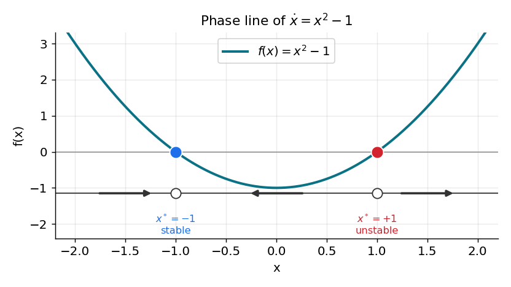
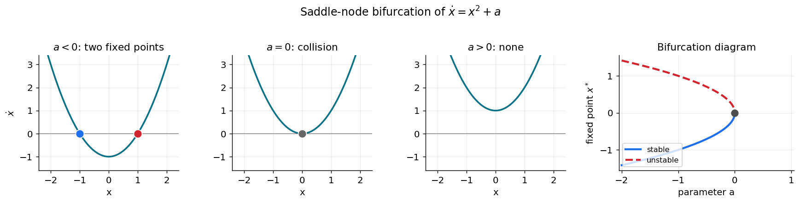

# مرور مفاهیم پایه

> «همهٔ مدل‌ها نادرست‌اند، اما برخی مدل‌ها سودمندند.» — جورج باکس

بخشِ بزرگی از علوم اعصاب محاسباتی، در بنیادِ خود، مطالعهٔ **معادلاتِ دیفرانسیل** است: پتانسیلِ غشایی که به استراحت بازمی‌گردد، دو ژن که یکدیگر را مهار می‌کنند، یا جمعیتی از نورون‌ها که به یک نوسانِ هماهنگ می‌رسند. در تقریباً همهٔ این موارد نمی‌توانیم جواب را به‌صورتِ یک فرمولِ بسته بنویسیم — و خبرِ خوب این است که معمولاً نیازی هم نداریم.

در فصلِ [حل عددی معادلات دیفرانسیل معمولی](https://computational-neuroscience.ir/ch-num-06-ode/) آموختیم چگونه یک معادلهٔ دیفرانسیل را در زمان **حل** کنیم؛ آن فصل، ابزارِ محاسباتی بود. این بخش از کتاب چارچوبِ **تحلیلیِ** همان مسیرهاست: به‌جای پرسشِ «جواب چه عددی است؟»، می‌پرسیم **«جواب در درازمدت چه شکلی دارد و با تغییرِ پارامترها چگونه دگرگون می‌شود؟»**. این شاخه از ریاضیات را **نظریهٔ سیستم‌های دینامیکی** می‌نامند. با چند ایدهٔ کلیدی — **نقاطِ ثابت**، **پایداری** و **انشعاب** — می‌توان رفتارِ کیفیِ یک مدل را در سراسرِ گستره‌ای از پارامترها و شرایطِ اولیه پیش‌بینی کرد، بی‌آنکه هرگز آن را به‌صورتِ بسته حل کنیم.

این فصلِ نخست، مفاهیمِ پایه را در ساده‌ترین حالتِ ممکن — یک معادله در یک بُعد — بنا می‌کند. همه‌چیزِ این فصل را می‌توان از یک تصویرِ واحد به نامِ **خطِ فاز** خواند. فصل‌های بعد همین ایده‌ها را به دو بُعد و بالاتر تعمیم می‌دهند.

???+ tip "در پایانِ این فصل خواهید توانست"
    - یک معادلهٔ دیفرانسیلِ **خودگردان** را بازشناسید.
    - **نقاطِ ثابتِ** یک مدلِ یک‌بُعدی را بیابید.
    - یک **خطِ فاز** رسم کنید و رفتارِ درازمدتِ همهٔ جواب‌ها را از روی آن بخوانید.
    - **پایدار** یا **ناپایدار**بودنِ یک نقطهٔ ثابت را با علامتِ \(f'(x^*)\) تعیین کنید.
    - نخستین **انشعاب** (زین–گره) را بشناسید و معنای آن را در شلیکِ یک نورون بیابید.

---

## معادلاتِ خودگردان: «بگذار معادله خودش بگوید چه می‌شود»

یک معادلهٔ دیفرانسیلِ مرتبهٔ اول صورتِ کلیِ زیر را دارد:

\[
\frac{dx}{dt} = f(x, t), \qquad x(t_0) = x_0 .
\]

هرگاه سمتِ راست به‌طورِ صریح به زمان **وابسته نباشد** — یعنی \(f(x,t)=f(x)\) — معادله را **خودگردان** (autonomous) می‌نامیم:

\[
\frac{dx}{dt} = f(x), \qquad x(t_0) = x_0 .
\]

همین ویژگیِ خودگردانی است که دیدگاهِ سیستم‌های دینامیکی را ممکن می‌کند. شیبِ \(dx/dt\) در هر حالتِ معیّنِ \(x\) **همیشه همان عدد است**، فارغ از اینکه کِی به آنجا برسیم. پس فضای حالت با یک «میدانِ جریانِ» ثابت پوشانده می‌شود: در هر مقدارِ \(x\) یک سرعتِ مشخص هست، و جواب چیزی نیست جز منحنی‌ای که از این سرعت‌ها پیروی می‌کند.

بسیاری از مدل‌های علوم اعصاب هرگاه ورودی‌شان ثابت نگه داشته شود، خودگردان‌اند. نورونِ یکپارچه‌و‌شلیکِ نشت‌دار (LIF) با جریانِ ثابت، یا مدلِ فیتزهیو–ناگومو با \(I_\text{ext}\) ثابت، هر دو خودگردان‌اند. (هرگاه ورودی در زمان تغییر کند، دستگاه **ناخودگردان** می‌شود؛ این حالت را در فصلِ [نوسانگرها](ch-dynamics-04-oscillators.md) و در مثال‌های عصبی بازمی‌بینیم.)

---

## نقاطِ ثابت

یک **نقطهٔ ثابت** (fixed point، یا *تعادل* یا *حالتِ پایا*) از معادلهٔ \(\dot x = f(x)\)، مقداری مانندِ \(x^*\) است که در آن جریان صفر می‌شود:

\[
f(x^*) = 0 .
\]

برای نقاطِ ثابت نمادِ ستاره‌دارِ \(x^*\) را به کار می‌بریم تا با شرطِ اولیهٔ \(x_0\) اشتباه نشوند. ویژگیِ تعریف‌کنندهٔ یک نقطهٔ ثابت بسیار ساده است:

!!! important "اصلِ بنیادی"
    **اگر جوابی از یک نقطهٔ ثابت آغاز شود، برای همیشه همان‌جا می‌ماند.**

دلیلش بی‌درنگ روشن است. اگر \(x(t_0) = x^*\) و \(f(x^*) = 0\)، آن‌گاه \(\dot x(t_0) = f(x^*) = 0\): حالت هیچ سرعتی ندارد، پس نمی‌تواند حرکت کند؛ با سرعتِ صفر همان‌جا می‌ماند، پس سرعتش صفر باقی می‌ماند، و همین‌طور تا ابد. تابعِ ثابتِ \(x(t)=x^*\) دقیقاً معادله را برآورده می‌کند. پس نقاطِ ثابت، **اسکلتِ** دینامیک‌اند: حالت‌های استراحت، حالت‌های حافظه، و پیکربندی‌های «هیچ‌کاری‌نکردنِ» یک مدل.

### جواب‌ها نمی‌توانند از نقاطِ ثابت بگذرند

دو واقعیت، دینامیکِ یک‌بُعدی را بی‌نهایت پیش‌بینی‌پذیر می‌کنند. هر دو تنها به پیوستگیِ \(f\) و یکتاییِ جواب‌ها تکیه دارند.

۱. **یک مسیر هرگز نمی‌تواند در حرکتِ واقعی به یک نقطهٔ ثابت برسد.** فرض کنید \(\dot x(t_0) = f(x_0) > 0\) (حالت به راست می‌رود) و فرض کنید بعداً دقیقاً به نقطهٔ ثابتی مانندِ \(x_1\) رسیده باشد. اما از \(x_1\) تنها جوابِ ممکن، جوابِ ثابت است — و جوابِ ثابت **همه‌جا** سرعتِ صفر دارد، که با \(\dot x(t_0)>0\) در تناقض است.

۲. **علامتِ \(\dot x\) در زمان ثابت می‌ماند.** اگر سرعت در یک لحظه مثبت و در لحظه‌ای دیگر منفی بود، آن‌گاه بنا بر قضیهٔ مقدارِ میانی باید در زمانی میانی از صفر بگذرد — یعنی مسیر لحظه‌ای روی یک نقطهٔ ثابت بنشیند، که آن را برای همیشه منجمد می‌کند و باز با فرض در تناقض است.

!!! important "نتیجه"
    برای یک معادلهٔ خودگردانِ یک‌بُعدی، **علامتِ \(\dot x(t)\) هرگز تغییر نمی‌کند**. هر جواب به‌صورتِ یکنوا حرکت می‌کند، یا همواره افزایشی یا همواره کاهشی، و میانِ دو نقطهٔ ثابتِ مجاور به دام می‌افتد.

---

## خطِ فاز

این مشاهدات یعنی می‌توانیم **همهٔ** جواب‌ها را در یک تصویرِ یک‌بُعدی به نامِ **خطِ فاز** (phase line) خلاصه کنیم. دستورِ کار چنین است:

۱. \(f(x)\) را رسم کنید و نقاطِ ثابت را — جایی که از صفر می‌گذرد — مشخص کنید.
۲. روی محورِ \(x\)، هرجا \(f(x) > 0\) است یک **پیکانِ راست‌گرا** (حالت افزایش می‌یابد) و هرجا \(f(x) < 0\) است یک **پیکانِ چپ‌گرا** (حالت کاهش می‌یابد) بکشید.

شکلِ زیر این کار را برای مثالِ کلاسیکِ \(\dot x = x^2 - 1\) انجام می‌دهد که نقاطِ ثابتش در \(x^* = -1\) و \(x^* = +1\) قرار دارند.



*خطِ فاز برای \(\dot x = x^2 - 1\). منحنیِ \(f(x)=x^2-1\) با رنگِ فیروزه‌ای رسم شده و دایره‌های روی محورِ پایین، دو نقطهٔ ثابت‌اند. در چپِ \(-1\) و راستِ \(+1\) مقدارِ \(f>0\) است و جریان به راست می‌رود؛ در میان، \(f<0\) است و جریان به چپ می‌رود. پس پیکان‌ها به‌سوی \(x^*=-1\) (پایدار، آبی) همگرا و از \(x^*=+1\) (ناپایدار، قرمز) واگرا می‌شوند.*

توجه کنید که **کلِ داستان** را می‌توان در یک نگاه دید: هر حالتی که از زیرِ \(-1\) آغاز شود به‌سوی \(-1\) رانده می‌شود؛ هر حالتِ میانِ \(-1\) و \(+1\) به‌سوی \(-1\) می‌لغزد؛ و هر حالتِ بالای \(+1\) به بی‌نهایت می‌گریزد. ما رفتارِ درازمدت را به‌طورِ کامل توصیف کردیم، بی‌آنکه معادله را حل کنیم.

```python
import numpy as np
import matplotlib.pyplot as plt

def phase_line(f, xrange=(-2.2, 2.2), n=400):
    """Plot f(x) together with directional arrows showing the 1-D flow."""
    x = np.linspace(*xrange, n)
    y = f(x)
    fig, ax = plt.subplots(figsize=(6, 3.2))
    ax.axhline(0, color="0.6", lw=1)
    ax.plot(x, y, lw=2)
    # mark sign-change points (fixed points)
    sign = np.sign(y)
    for i in np.where(np.diff(sign) != 0)[0]:
        ax.plot(0.5 * (x[i] + x[i + 1]), 0, "o", ms=9, mfc="white", mec="k")
    # draw flow arrows: right where f>0, left where f<0
    for a, b in zip(x[:-1:40], x[1::40]):
        s = np.sign(f(0.5 * (a + b)))
        ax.annotate("", xy=(0.5*(a+b) + 0.1*s, 0), xytext=(0.5*(a+b) - 0.1*s, 0),
                    arrowprops=dict(arrowstyle="-|>", color="0.3"))
    ax.set(xlabel="x", ylabel="f(x)")
    return ax

phase_line(lambda x: x**2 - 1)
plt.show()
```

---

## پایداری و آزمونِ خطی‌سازی

باز به شکلِ خطِ فاز نگاه کنید. پیرامونِ \(x^*=-1\) هر دو پیکان به *درون* اشاره دارند: حالتی که در نزدیکی آغاز شود پس‌رانده می‌شود. پیرامونِ \(x^*=+1\) هر دو پیکان به *بیرون* اشاره دارند: کوچک‌ترین جابه‌جایی تقویت می‌شود. این همان تفاوتِ میانِ یک نقطهٔ ثابتِ **پایدار** و **ناپایدار** است.

!!! note "تعریف‌ها"
    یک نقطهٔ ثابتِ \(x^*\) را **پایدار (مجانبی)** می‌گوییم اگر هر جوابی که به‌اندازهٔ کافی نزدیکِ \(x^*\) آغاز شود، با \(t\to\infty\) به آن همگرا شود. آن را **ناپایدار** می‌گوییم اگر جواب‌ها بتوانند دلخواهانه نزدیک آغاز شوند و باز همگرا نشوند.

یک آزمونِ جبریِ سریع وجود دارد. نزدیکِ یک نقطهٔ پایدار، جریانِ \(f\) با افزایشِ \(x\) از مثبت (راندن به راست) به منفی (راندن به چپ) تغییر می‌کند — پس \(f\) در آنجا *کاهشی* است. نزدیکِ یک نقطهٔ ناپایدار، عکسِ این رخ می‌دهد. این دقیقاً همان علامتِ مشتقِ \(f'(x^*)\) است:

!!! important "آزمونِ پایداریِ خطی (یک‌بُعدی)"
    فرض کنید \(x^*\) نقطهٔ ثابتِ \(\dot x = f(x)\) باشد.

    - اگر \(f'(x^*) < 0\)، آن‌گاه \(x^*\) **پایدار** است.
    - اگر \(f'(x^*) > 0\)، آن‌گاه \(x^*\) **ناپایدار** است.

برای مثالِ ما \(f'(x) = 2x\)، پس \(f'(-1) = -2 < 0\) (پایدار) و \(f'(+1) = +2 > 0\) (ناپایدار)، که تصویر را تأیید می‌کند. شهودِ پشتِ آن — *شیبِ منفی تو را بازمی‌گرداند، شیبِ مثبت تو را بیرون می‌اندازد* — بذرِ یک‌بُعدیِ هر چیزی است که در ادامه می‌آید؛ در ابعادِ بالاتر، نقشِ \(f'(x^*)\) را مقادیرِ ویژهٔ یک ماتریس بر عهده می‌گیرند.

### حالت‌های مرزی

این آزمون هرگاه \(f'(x^*) = 0\) باشد خاموش است، چون منحنی بر محور مماس می‌شود و جملهٔ خطی چیزی نمی‌گوید. دو گونه رفتارِ مرزی ممکن است رخ دهد، و در هر دو خطِ فاز همچنان بی‌درنگ تکلیف را روشن می‌کند.

- **نیمه‌پایدار (semi-stable).** برای \(f(x) = x^2\) تنها نقطهٔ ثابت \(x^*=0\) است، با \(f'(0)=0\). مسیرها از چپ ( \(f<0\) ) نزدیک می‌شوند اما در راست ( \(f>0\) ) می‌گریزند.
- **پایدارِ خنثی (neutrally stable).** برای جریانِ بدیهیِ \(f(x)=0\)، *هر* نقطه یک نقطهٔ ثابت است. حالت‌های نزدیک نه نزدیک می‌شوند و نه دور.

توجه کنید که \(f'(x^*)=0\) به‌خودیِ‌خود به معنای «نیمه‌پایدار» نیست: برای \(f(x)=x^3\) نقطهٔ \(x^*=0\) به‌راستی ناپایدار است. درسِ ماجرا این است که **رسمِ خطِ فاز از به‌خاطرسپردنِ قاعده‌ها مطمئن‌تر است.**

---

## نخستین انشعابِ ما: زین–گره

پاداشِ واقعیِ این دیدگاه آن است که می‌توانیم بپرسیم دینامیک با تغییرِ یک پارامتر چگونه *دگرگون* می‌شود. مقداری از پارامتر که در آن **تعداد یا پایداریِ نقاطِ ثابت تغییر می‌کند**، یک **انشعاب** (bifurcation) نامیده می‌شود. در یک بُعد، رایج‌ترین آن‌ها **زین–گره** (saddle-node، که *تاشو* یا *مماسی* نیز نامیده می‌شود) است که در آن دو نقطهٔ ثابت با هم برخورد و یکدیگر را نابود می‌کنند. کمینه‌مثالِ آن چنین است:

\[
\dot x = x^2 + a ,
\]

که در آن \(a\) یک پارامترِ کنترل است.



*انشعابِ زین–گرهٔ \(\dot x = x^2 + a\). **برای \(a<0\)** دو نقطهٔ ثابت \(x^* = \pm\sqrt{-a}\) هست: پایینی پایدار (آبی) و بالایی ناپایدار (قرمز). **در \(a=0\)** آن‌ها در یک نقطهٔ نیمه‌پایدارِ واحد ادغام می‌شوند. **برای \(a>0\)** سهمی از محور بالا می‌رود و **هیچ** نقطهٔ ثابتی نمی‌ماند. پنلِ راست، **نمودارِ انشعاب** است: مکانِ نقطهٔ ثابت بر حسبِ \(a\)، با شاخهٔ پایدارِ توپُر و شاخهٔ ناپایدارِ خط‌چین. دو شاخه در \(a=0\) به هم می‌رسند و ناپدید می‌شوند.*

در علوم اعصاب، این همان راهِ کلاسیکی است که یک نورون **روشن** می‌شود: همین‌که جریانِ ورودی از یک آستانه می‌گذرد، یک حالتِ پایدارِ «استراحت» و یک حالتِ ناپایدارِ «آستانه‌ایِ» نزدیکِ آن با هم برخورد و ناپدید می‌شوند، و دستگاه چاره‌ای جز شلیک ندارد. این مکانیزم را به‌تفصیل در فصلِ [تحریک‌پذیری و نورونِ فیتزهیو–ناگومو](ch-dynamics-07-neuro-excitability.md) خواهیم دید.

!!! example "تمرین‌ها"
    ۱. **حل‌کن‌و‌بسنج.** برای \(\dot x = x^2 - 1\) با \(x(0)=1\)، جوابِ دقیق چیست؟ (راهنمایی: \(x_0\) یک نقطهٔ ثابت است.) با اویلرِ پیشرو، \(dt=0.01\) و \(T=5\)، عددی تأیید کنید.

    ۲. **خطِ فاز.** خطِ فازِ \(\dot x = -(x+1)(x-1)(x-2)\) را رسم کنید. هر سه نقطهٔ ثابت را بیابید و هرکدام را با علامتِ \(f'(x^*)\) رده‌بندی کنید. با شبیه‌سازی از چند شرطِ اولیه راستی‌آزمایی کنید.

    ۳. **توانِ سوم.** نشان دهید \(x^*=0\) برای \(\dot x = x^3\) ناپایدار است، هرچند \(f'(0)=0\). چرا آزمونِ خطی اینجا شکست می‌خورد و چرا خطِ فاز همچنان کار می‌کند؟

    ۴. **انشعاب را بیاب.** برای \(\dot x = x^2 + a\)، نقاطِ ثابت را برای \(a=-1\)، \(a=0\) و \(a=1\) رده‌بندی کنید و تأیید کنید که انشعاب در \(a=0\) است.

---

در فصلِ بعد، این ایده‌ها را به **دستگاه‌های خطیِ** دو بُعد و بالاتر تعمیم می‌دهیم، جایی که نقشِ \(f'(x^*)\) را **مقادیرِ ویژهٔ یک ماتریس** بر عهده می‌گیرند.
