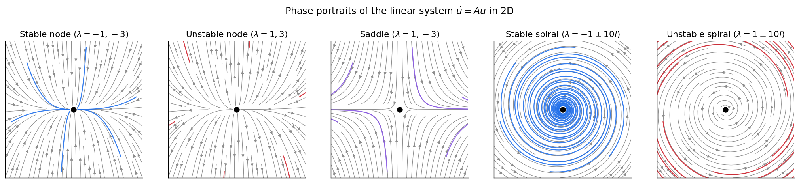
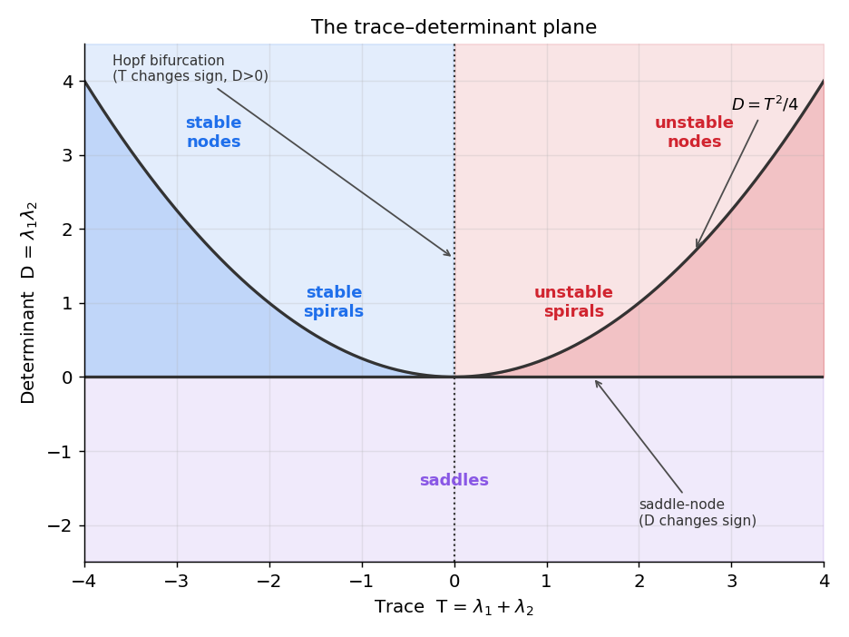

# سیستم‌های خطی

در فصلِ پیش، دینامیک را در یک بُعد به‌طورِ کامل با یک عددِ \(f'(x^*)\) فهمیدیم. اما تقریباً هر مدلِ جالبی دستِ‌کم به دو متغیر نیاز دارد — یک ولتاژ و یک جریانِ بازیابی، دو ژنِ مهارگرِ متقابل، یا یک جمعیتِ تحریکی و یک مهاری. این فصل، گامِ نخست به ابعادِ بالاتر است: **دستگاه‌های خطی**. اینجا نقشِ \(f'(x^*)\) را **مقادیرِ ویژهٔ یک ماتریس** بر عهده می‌گیرند، و خواهیم دید که تنها **پنج** رفتارِ کیفیِ ممکن وجود دارد.

???+ tip "در پایانِ این فصل خواهید توانست"
    - یک دستگاهِ معادلات را به‌صورتِ برداری \(\dot{\mathbf u}=A\mathbf u\) بنویسید.
    - **میدانِ برداری** و **نولکلین‌ها** را به‌عنوانِ دو تصویرِ کلیدیِ صفحهٔ فاز به کار ببرید.
    - پایداری را از **بخشِ حقیقیِ مقادیرِ ویژهٔ** \(A\) تعیین کنید.
    - پنج پرترهٔ فازِ متعارف را بازشناسید: گرهِ پایدار/ناپایدار، زین، و مارپیچِ پایدار/ناپایدار.
    - یک نقطهٔ ثابتِ دوبُعدی را تنها با **اثر** و **دترمینان**، بدونِ محاسبهٔ مقادیرِ ویژه، رده‌بندی کنید.

---

## از یک معادله به یک دستگاه

یک دستگاهِ خودگردانِ معادلات را می‌توان به‌صورتِ برداری نوشت:

\[
\frac{d\mathbf{u}}{dt} = \mathbf{F}(\mathbf{u}), \qquad
\mathbf{u}\in\mathbb{R}^n,\;\; \mathbf{F}:\mathbb{R}^n\to\mathbb{R}^n .
\]

برای \(n=2\) اغلب نوشتنِ مؤلفه‌ها روشن‌تر است:

\[
\frac{\partial x}{\partial t} = f(x, y), \qquad
\frac{\partial y}{\partial t} = g(x, y),
\]

با \(\mathbf{u}=(x,y)\). یک **نقطهٔ ثابت** باز هم حالتی است که در آن جریان صفر می‌شود، \(\mathbf{F}(\mathbf{u}^*) = \mathbf{0}\)، یعنی \(f(x^*,y^*)=g(x^*,y^*)=0\) هم‌زمان. مانندِ یک بُعد، *جوابی که از یک نقطهٔ ثابت آغاز شود همان‌جا می‌ماند* و *جوابی که از آن آغاز نشود هرگز به آن نمی‌رسد*.

### دو تصویر: میدانِ برداری و نولکلین‌ها

دو ابزارِ بصری، تقریباً همهٔ شهودِ لازم در صفحه را در خود دارند.

- **میدانِ برداری** (vector field، یا *جریان*) پیکانِ \(\mathbf{F}(x,y)=(f,g)\) را به هر نقطهٔ \((x,y)\) می‌چسباند. مسیرها منحنی‌هایی‌اند که از این پیکان‌ها پیروی می‌کنند. در پایتون، `plt.streamplot` آن‌ها را به‌زیبایی رسم می‌کند.
- **نولکلین‌ها** (nullclines) منحنی‌هایی‌اند که روی آن‌ها یک مؤلفهٔ جریان صفر است. *نولکلینِ \(x\)* همان \(f(x,y)=0\) است (آنجا مسیرها تنها عمودی حرکت می‌کنند) و *نولکلینِ \(y\)* همان \(g(x,y)=0\) است (آنجا مسیرها تنها افقی حرکت می‌کنند). **نقاطِ ثابت دقیقاً محلِ تقاطعِ دو نولکلین‌اند** — جایی که هر دو مؤلفه هم‌زمان صفر می‌شوند.

---

## دستگاه‌های خطی و مقادیرِ ویژه

پاکیزه‌ترین حالت، یک دستگاهِ **خطی** است:

\[
\frac{d\mathbf{u}}{dt} = A\mathbf{u}, \qquad \mathbf{u}(0)=\mathbf{u}_0,
\]

با \(A\) یک ماتریسِ \(n\times n\). مبدأ \(\mathbf{u}^*=\mathbf{0}\) همواره یک نقطهٔ ثابت است، و (اگر \(A\) وارون‌پذیر باشد) تنها نقطهٔ ثابت. پایداریِ آن کاملاً با **مقادیرِ ویژهٔ** \(A\) تعیین می‌شود — اعدادی مانندِ \(\lambda\) که برای آن‌ها برداری مانندِ \(\mathbf{v}\) با \(A\mathbf{v}=\lambda\mathbf{v}\) وجود دارد. مقادیرِ ویژه می‌توانند حقیقی باشند یا به‌صورتِ زوج‌های مزدوجِ مختلط \(\lambda=\alpha\pm i\beta\) بیایند، و از حلِ زیر یافت می‌شوند:

\[
\det(A - \lambda I) = 0 .
\]

مهم‌ترین قضیهٔ این فصل این است:

!!! important "پایداریِ یک دستگاهِ خطی"
    نقطهٔ ثابتِ مبدأ در \(\dot{\mathbf u}=A\mathbf u\) **پایدار** است اگر *همهٔ* مقادیرِ ویژهٔ \(A\) **بخشِ حقیقیِ منفی** داشته باشند، و **ناپایدار** است اگر *هر یک* از مقادیرِ ویژه بخشِ حقیقیِ مثبت داشته باشد.

*بخشِ حقیقی* رشد یا میرایی را تعیین می‌کند؛ *بخشِ موهومی* چرخش را. این به **پنج پرترهٔ فازِ متعارف** در دو بُعد می‌انجامد:



*پنج رفتارِ یک دستگاهِ خطیِ دوبُعدی، با مقادیرِ ویژه در عنوان‌ها. **حقیقی، هر دو منفی** ← *گرهِ پایدار* (همه‌چیز مستقیم به درون میرا می‌شود). **حقیقی، هر دو مثبت** ← *گرهِ ناپایدار*. **حقیقی، با علامتِ مخالف** ← *زین* (در یک راستا جذب، در راستای دیگر دفع). **مختلط با بخشِ حقیقیِ منفی** ← *مارپیچِ پایدار / کانونِ پایدار* (نوسانِ میرا). **مختلط با بخشِ حقیقیِ مثبت** ← *مارپیچِ ناپایدار* (نوسانِ رشدیابنده).*

مقادیرِ ویژهٔ مختلط همیشه **مارپیچ** تولید می‌کنند، و یک مارپیچ در صفحهٔ \((u_1,u_2)\) با **نوسان** در هر مؤلفه به‌عنوانِ تابعی از زمان متناظر است — آهنگِ چرخش همان بخشِ موهومیِ \(\beta\) است. به همین دلیل، نوسان و مقادیرِ ویژهٔ مختلط، در عمل یک پدیده‌اند. نوسانگرها موضوعِ کاملِ فصلِ [نوسانگرها](ch-dynamics-04-oscillators.md) خواهند بود.

```python
import numpy as np

A = np.array([[-1.0, -10.0],
              [10.0, -1.0]])
eigvals, eigvecs = np.linalg.eig(A)
print(eigvals)          # -1+10j, -1-10j  -> stable spiral
```

---

## رده‌بندی با اثر و دترمینان

در دو بُعد به‌ندرت لازم است مقادیرِ ویژه را صریحاً محاسبه کنید. دو عددِ اسکالر که مستقیماً از ماتریس ساخته می‌شوند همه‌کاره‌اند، زیرا برای یک ماتریسِ \(2\times2\):

\[
\det(A) = \lambda_1\lambda_2, \qquad \operatorname{Tr}(A)=\lambda_1+\lambda_2 ,
\]

که در آن **اثر** (رد یا تریس (به [انگلیسی](https://fa.wikipedia.org/wiki/%D8%B2%D8%A8%D8%A7%D9%86_%D8%A7%D9%86%DA%AF%D9%84%DB%8C%D8%B3%DB%8C): Trace)) جمعِ درایه‌های قطریِ ماتریس است. خودِ مقادیرِ ویژه نیز عبارت‌اند از:

\[
\lambda_{1,2} = \frac{T \pm \sqrt{T^2 - 4D}}{2}, \qquad T=\operatorname{Tr}(A),\; D=\det(A).
\]

از همین سه فرمول، کلِ رده‌بندی با یک نگاه به‌دست می‌آید:

| شرط | نوع | پایداری |
|---|---|---|
| \(D < 0\) | **زین** (مقادیرِ ویژه حقیقی، علامتِ مخالف) | ناپایدار |
| \(D > 0,\; T < 0,\; T^2 > 4D\) | **گرهِ** پایدار | پایدار |
| \(D > 0,\; T > 0,\; T^2 > 4D\) | **گرهِ** ناپایدار | ناپایدار |
| \(D > 0,\; T < 0,\; T^2 < 4D\) | **مارپیچِ** پایدار | پایدار |
| \(D > 0,\; T > 0,\; T^2 < 4D\) | **مارپیچِ** ناپایدار | ناپایدار |

به بیانِ ساده: **دترمینان دربارهٔ گره‌در‌برابرِ‌زین تصمیم می‌گیرد، اثر دربارهٔ پایدار‌در‌برابرِ‌ناپایدار، و مبیّن \(T^2-4D\) دربارهٔ گره‌در‌برابرِ‌مارپیچ.** این همه در **صفحهٔ اثر–دترمینان** خلاصه می‌شود؛ نقشه‌ای واحد از هر رفتارِ ممکنِ خطیِ دوبُعدی.



*صفحهٔ اثر–دترمینان. محورِ افقی \(T=\operatorname{Tr}(A)\) و محورِ عمودی \(D=\det(A)\) است. خطِ \(D=0\)، خطِ \(T=0\) و سهمیِ \(D=T^2/4\) صفحه را به پنج ناحیه می‌برند، یکی برای هر پرتره. عبور از سهمی یک گره را به مارپیچ بدل می‌کند؛ عبور از \(T=0\) با \(D>0\) یک **انشعابِ هاپف** است؛ و عبور از \(D=0\) یک **انشعابِ زین–گره**.*

این صفحه چیزی فراتر از یک نمودارِ رده‌بندی است: همان‌طور که نشان داده شده، **حرکت در آن، انشعاب‌ها را آشکار می‌کند.** هر بار که یک پارامتر تغییر کند، نقطهٔ \((T, D)\)ِ مربوط به یک تعادل در این صفحه جابه‌جا می‌شود؛ و هرگاه از یکی از مرزها بگذرد، رفتارِ کیفیِ دستگاه دگرگون می‌شود. این ایده، ستونِ فقراتِ تحلیلِ مدل‌های عصبی در فصل‌های پایانیِ این بخش است.

!!! example "تمرین‌ها"
    ۱. یک ماتریسِ \(2\times2\) دلخواه بسازید، مقادیرِ ویژه‌اش را با دست محاسبه کنید، مبدأ را رده‌بندی کنید، سپس با `np.linalg.eig` و با شبیه‌سازیِ \(\dot{\mathbf u}=A\mathbf u\) از چند شرطِ اولیه بسنجید.

    ۲. تمرینِ ۱ را تنها با \(\operatorname{Tr}(A)\) و \(\det(A)\) تکرار کنید — بدونِ محاسبهٔ مقادیرِ ویژه. به همان نتیجه می‌رسید؟

    ۳. برای ماتریسِ \(A=\begin{bmatrix} 0 & 1 \\ -1 & -c \end{bmatrix}\)، نشان دهید با تغییرِ \(c\) از منفی به مثبت، مبدأ از مارپیچِ ناپایدار به مارپیچِ پایدار می‌گذرد. این عبور (در \(c=0\)) همان جایی است که در فصلِ نوسانگرها انشعابِ هاپف را خواهیم دید.

---

تا اینجا تنها دستگاه‌های **خطی** را بررسی کردیم. در فصلِ بعد می‌بینیم که چگونه همین ابزار، با کمکِ **ماتریسِ ژاکوبی**، پایداریِ دستگاه‌های **غیرخطی** را نیز تعیین می‌کند.
