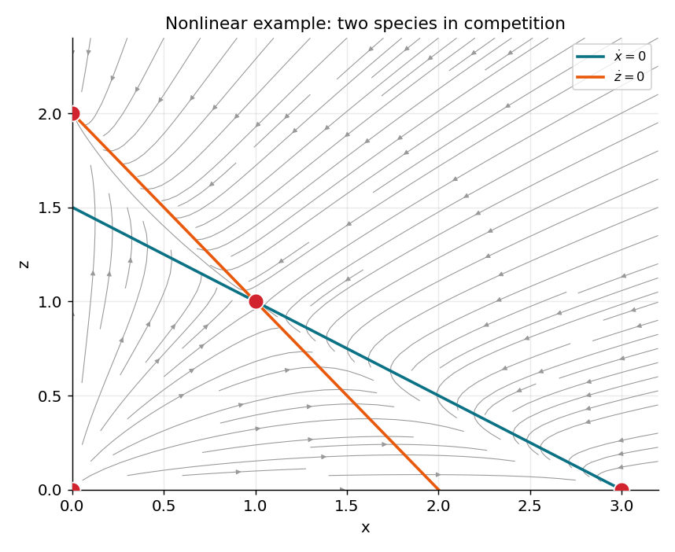

# سیستم‌های غیرخطی

دستگاه‌های خطیِ فصلِ پیش زیبا و کامل‌اند، اما مدل‌های واقعی تقریباً همیشه **غیرخطی‌اند**. خبرِ خوب این است که نزدیکِ یک نقطهٔ ثابت، یک دستگاهِ غیرخطیِ هموار *خطی به نظر می‌رسد* — و همین به ما اجازه می‌دهد همهٔ ابزارِ خطیِ فصلِ پیش را به کار بریم. کلیدِ این کار، تعمیمِ مشتق به چند بُعد است: **ماتریسِ ژاکوبی**.

???+ tip "در پایانِ این فصل خواهید توانست"
    - **نقاطِ ثابتِ** یک دستگاهِ غیرخطی را به‌صورتِ عددی بیابید.
    - **ماتریسِ ژاکوبی** را به‌عنوانِ بهترین تقریبِ خطیِ جریان در یک نقطهٔ ثابت بسازید.
    - پایداری و نوعِ هر تعادل را با خطی‌سازی تعیین کنید.
    - یک **جعبه‌ابزارِ بازکاربردپذیر** برای یافتن و رده‌بندیِ تعادل‌ها بنویسید.
    - بفهمید چگونه انشعاب‌های **زین–گره** و **هاپف** در دستگاه‌ها رخ می‌دهند.

---

## ماتریسِ ژاکوبی

نزدیکِ یک نقطهٔ ثابتِ \(\mathbf u^* = (x^*, y^*)\)، می‌توان جریانِ غیرخطی را با بسطِ تیلورِ مرتبهٔ اول تقریب زد. ماتریسی که این خطی‌سازیِ محلی را در خود دارد، **ماتریسِ ژاکوبی** (Jacobian) است — تعمیمِ چندبُعدیِ مشتقِ \(f'(x^*)\). برای یک دستگاهِ دوبُعدی، درایه‌هایش مشتق‌های جزئیِ جریان‌اند که **در نقطهٔ ثابت** ارزیابی شده‌اند:

\[
J \big|_{(x^*,y^*)}=
\begin{bmatrix}
\dfrac{\partial f}{\partial x} & \dfrac{\partial f}{\partial y}\\[2ex]
\dfrac{\partial g}{\partial x} & \dfrac{\partial g}{\partial y}
\end{bmatrix} .
\]

قضیهٔ کلیدی می‌گوید که تصویرِ محلی، درست مانندِ حالتِ خطی، با مقادیرِ ویژهٔ ژاکوبین تعیین می‌شود:

!!! important "قضیهٔ خطی‌سازی"
    نزدیکِ یک نقطهٔ ثابتِ \(\mathbf u^*\)، جواب‌های دستگاهِ غیرخطیِ \(\dot{\mathbf u}=\mathbf F(\mathbf u)\) مانندِ جواب‌های دستگاهِ خطیِ \(\dot{\mathbf u}=J\mathbf u\) نزدیکِ مبدأ رفتار می‌کنند. به‌ویژه: اگر **همهٔ** مقادیرِ ویژهٔ \(J\) بخشِ حقیقیِ منفی داشته باشند، \(\mathbf u^*\) **پایدار** است؛ اگر **هر یک** بخشِ حقیقیِ مثبت داشته باشد، **ناپایدار** است. مقادیرِ ویژهٔ مختلط یعنی نزدیک‌شدن (یا گریز) به‌صورتِ **مارپیچ** است.

پس کلِ روالِ تحلیلِ یک مدلِ غیرخطی چنین است:

۱. نقاطِ ثابت را با حلِ \(\mathbf F(\mathbf u^*)=\mathbf 0\) بیابید (اغلب جایی که نولکلین‌ها هم را قطع می‌کنند).
۲. ژاکوبینِ \(J\) را محاسبه و در هر نقطهٔ ثابت ارزیابی کنید.
۳. نوع و پایداری را از \(\operatorname{Tr}(J)\)، \(\det(J)\) و \(T^2-4D\) بخوانید (همان جدولِ فصلِ [سیستم‌های خطی](ch-dynamics-02-linear-systems.md)).

---

## یک جعبه‌ابزارِ بازکاربردپذیرِ تحلیل

توابعِ خوداتکای زیر، گام‌های ۱ تا ۳ را یک‌بار برای همیشه پیاده می‌کنند. هر مدلِ غیرخطیِ این کتاب — از کلیدِ ژنتیکی تا فیتزهیو–ناگومو — از همین‌ها استفاده می‌کند و تنها جریان و ژاکوبینِ ویژهٔ مدل را عوض می‌کند.

```python
import numpy as np
import scipy.integrate
import scipy.optimize

def integrate(flow, y0, t):
    """Numerically integrate dy/dt = flow(y, t) from y0 over time array t."""
    return scipy.integrate.odeint(flow, y0, t)

def find_equilibrium(flow, guess):
    """Solve flow(y) = 0 starting from `guess`; return the root or NaNs."""
    sol, info, ok, msg = scipy.optimize.fsolve(flow, guess, full_output=1)
    return sol if ok == 1 else np.full_like(np.asarray(guess, float), np.nan)

def unique_equilibria(flow, guesses, tol=1e-4):
    """Collect distinct equilibria found from a list of starting guesses."""
    eqs = []
    for g in guesses:
        r = find_equilibrium(flow, g)
        if not np.any(np.isnan(r)) and not any(np.allclose(r, e, atol=tol) for e in eqs):
            eqs.append(r)
    return eqs

def classify(J):
    """Return (name, is_stable) for a 2x2 Jacobian via trace & determinant."""
    T, D = np.trace(J), np.linalg.det(J)
    if D < 0:
        return "saddle", False
    stable = T < 0
    shape = "spiral" if T**2 - 4 * D < 0 else "node"
    return f"{'stable' if stable else 'unstable'} {shape}", stable
```

راهی طبیعی برای *یافتنِ* تعادل‌های یک مدلِ ناآشنا این است که از شرایطِ اولیهٔ متعدد انتگرال بگیریم، بگذاریم مسیرها بنشینند، و از نقطهٔ پایانیِ آن‌ها به‌عنوانِ حدسِ آغازین برای `fsolve` استفاده کنیم. (تعادل‌های پایدار به این روش خودکار یافت می‌شوند؛ تعادل‌های ناپایدار به حدس‌هایی نزدیکِ خودشان نیاز دارند، مثلاً روی یک نولکلین.)

!!! note "ژاکوبین را با دست نگیرید — `sympy` بگیرد"
    گرفتنِ مشتق‌های جزئیِ یک جریانِ پیچیده با دست خطاخیز است. کتابخانهٔ `sympy` (پایتونِ نمادین) می‌تواند ژاکوبین را دقیق محاسبه و سپس به یک تابعِ عددیِ سریع تبدیل کند:

    ```python
    import sympy
    x, y = sympy.symbols("x y")
    F = sympy.Matrix([f_expr, g_expr])           # your symbolic flow
    J = F.jacobian(sympy.Matrix([x, y]))
    jac_numeric = sympy.lambdify((x, y), J, dummify=False)
    ```

---

## یک مثالِ غیرخطیِ کامل: رقابتِ دو گونه

برای دیدنِ روال در عمل، مدلِ کلاسیکِ **رقابتِ لوتکا–ولترا** را در نظر بگیرید که جمعیتِ دو گونه ( \(x\) و \(z\) ) را که بر سرِ یک منبع رقابت می‌کنند، توصیف می‌کند:

\[
\dot x = x\,(3 - x - 2z), \qquad \dot z = z\,(2 - x - z).
\]

نولکلین‌ها (nullclines) از صفر قراردادنِ هر مؤلفه به‌دست می‌آیند: محورها ( \(x=0\) و \(z=0\) ) به‌علاوهٔ دو خطِ \(x+2z=3\) و \(x+z=2\). تقاطع‌های آن‌ها چهار نقطهٔ ثابت می‌دهند. ژاکوبین چنین است:

\[
J =
\begin{bmatrix}
3 - 2x - 2z & -2x \\
-z & 2 - x - 2z
\end{bmatrix}.
\]

با ارزیابیِ ژاکوبین و کاربردِ تابعِ `classify`، رده‌بندیِ زیر به‌دست می‌آید:

- \((0,0)\): **گرهِ ناپایدار** — هر دو گونه از صفر رشد می‌کنند.
- \((3,0)\): **گرهِ پایدار** — تنها گونهٔ \(x\) باقی می‌ماند.
- \((0,2)\): **گرهِ پایدار** — تنها گونهٔ \(z\) باقی می‌ماند.
- \((1,1)\): **زین** — هم‌زیستیِ ناپایدار.



*صفحهٔ فازِ مدلِ رقابتِ دو گونه. منحنی‌های فیروزه‌ای و نارنجی نولکلین‌ها و خطوطِ خاکستری جریان‌اند. دو گرهِ پایدار (آبی) در \((3,0)\) و \((0,2)\) دو سرنوشتِ ممکن‌اند — یعنی یکی از دو گونه برنده می‌شود — و زینِ میانی (بنفش) در \((1,1)\) مرزِ میانِ دو حوضهٔ جذب را مشخص می‌کند. این یک نمونهٔ زیستیِ **دوپایداری** است: سرنوشتِ نهایی به شرطِ اولیه بستگی دارد.*

```python
from functools import partial
import numpy as np

def comp(y, t):
    x, z = y
    return np.array([x * (3 - x - 2*z), z * (2 - x - z)])

def comp_jacobian(x, z):
    return np.array([[3 - 2*x - 2*z, -2*x],
                     [-z,            2 - x - 2*z]])

for eq in [(0, 0), (3, 0), (0, 2), (1, 1)]:
    name, _ = classify(comp_jacobian(*eq))
    print(f"{name:14s} at {eq}")
```

این الگو — یافتنِ تعادل‌ها، خطی‌سازی، و رده‌بندی — همان روالی است که در دو فصلِ پایانیِ این بخش، روی مدل‌های واقعیِ عصبی به کار خواهیم برد.

---

## انشعاب در دستگاه‌ها

دستگاه‌ها دو نوعِ مهمِ انشعاب دارند.

**انشعابِ زین–گره** را از یک بُعد به ارث می‌برند: با تغییرِ یک پارامتر، دو تعادل می‌توانند برخورد و ناپدید شوند. روی صفحهٔ اثر–دترمینان این همان لحظه‌ای است که \(\det(J)\) از صفر می‌گذرد ( \(D=0\) ) و یک گرهِ پایدار را به زین بدل می‌کند. این مکانیزم، زیربنای **دوپایداری** و **حافظه** است که در فصلِ [دوپایداری](ch-dynamics-06-neuro-bistability.md) به‌تفصیل می‌آید.

**انشعابِ هاپف** کاری می‌کند که در یک بُعد *ناممکن* است. هنگامی که یک **مارپیچ** پایداری‌اش را عوض می‌کند — یعنی \(\operatorname{Tr}(J)\) با \(\det(J)>0\) از صفر می‌گذرد، پس زوجی از مقادیرِ ویژهٔ مختلط از محورِ موهومی عبور می‌کنند — یک **انشعابِ هاپف** (Hopf bifurcation) داریم. وقتی یک مارپیچِ پایدار پایداری‌اش را از دست می‌دهد، معمولاً یک **چرخهٔ حدی** زاده می‌شود: یک نوسانِ خودپایدار. این انشعاب، قلبِ هر شلیکِ ریتمیک است و موضوعِ کاملِ فصلِ بعد، [نوسانگرها](ch-dynamics-04-oscillators.md)، خواهد بود.

!!! example "تمرین‌ها"
    ۱. برای دستگاهِ غیرخطیِ \(\dot x = -(1-y^2)x - y,\; \dot y = x\)، نقطهٔ ثابتِ یکتا را بیابید، ژاکوبین را آنجا محاسبه و آن را رده‌بندی کنید (گره، زین یا مارپیچ). با شبیه‌سازی تأیید کنید.

    ۲. مدلِ رقابت را با ضرایبِ متفاوت بازنویسی کنید تا نقطهٔ هم‌زیستیِ \((1,1)\) به یک **گرهِ پایدار** بدل شود (هم‌زیستیِ پایدار). کدامین تغییر در ضرایبِ نولکلین‌ها این را ممکن می‌کند؟

    ۳. تابعِ `classify` را گسترش دهید تا حالت‌های مرزی ( \(\det J \approx 0\) یا \(\operatorname{Tr} J \approx 0\) ) را نیز برچسب بزند، چون این‌ها دقیقاً جایی‌اند که انشعاب‌ها رخ می‌دهند.
