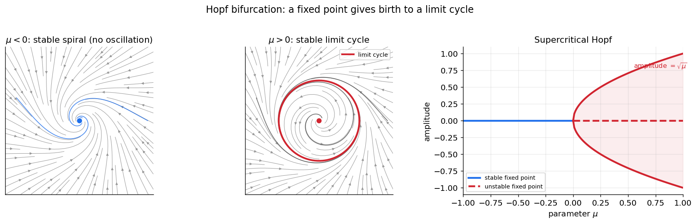
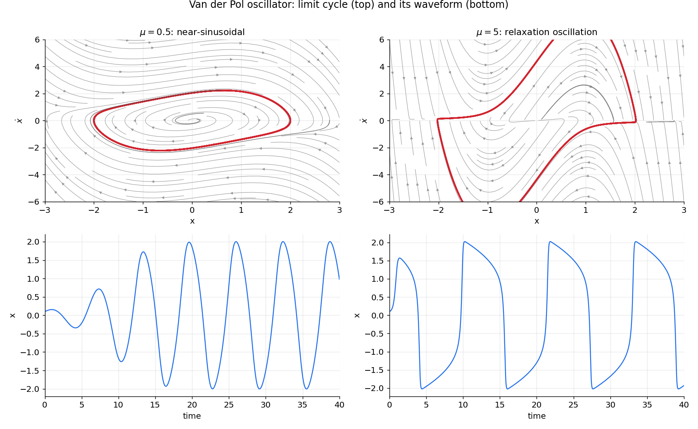

# نوسانگرها

ریتم همه‌جا در زیست‌شناسی هست: ضربانِ قلب، چرخهٔ شبانه‌روزی، راه‌رفتن، و — مهم‌تر از همه برای ما — **شلیکِ تکراریِ نورون‌ها** و نوسان‌های جمعیتیِ مغز. این فصل به ریاضیاتِ نوسان می‌پردازد. شیءِ مرکزیِ تازه، **چرخهٔ حدی** است: یک مدارِ بستهٔ منزوی که نوسان‌های خودپایدار را نمایندگی می‌کند. خواهیم دید چرخه‌های حدی از کجا می‌آیند (انشعابِ هاپف)، چه شکلی دارند (از سینوسیِ ملایم تا «واهلشیِ» تند)، و چرا برای آشوب باید از دو بُعد فراتر رفت.

???+ tip "در پایانِ این فصل خواهید توانست"
    - **چرخهٔ حدی** را از یک مرکزِ خطی تمیز دهید و بفهمید چرا تنها چرخهٔ حدی «استوار» است.
    - **انشعابِ هاپف** را به‌عنوانِ زادگاهِ نوسان توضیح دهید.
    - **نوسانگرِ فان‌در‌پل** و گذار از نوسانِ سینوسی به **نوسانِ واهلشی** را بسازید.
    - قضیهٔ **پوانکاره–بندیکسون** را بیان کنید و دریابید چرا آشوب در دو بُعدِ پیوسته ناممکن است.

---

## نوسان به چه معناست؟

یک **جوابِ دوره‌ای** (periodic) جوابی است که خود را پس از یک دورهٔ \(T\) تکرار می‌کند: \(\mathbf u(t+T)=\mathbf u(t)\). در صفحهٔ فاز، چنین جوابی یک **مدارِ بسته** می‌سازد. اما همهٔ مدارهای بسته یکسان نیستند، و تفاوتِ آن‌ها در علوم اعصاب حیاتی است.

در فصلِ [سیستم‌های خطی](ch-dynamics-02-linear-systems.md) دیدیم که یک دستگاهِ خطی با مقادیرِ ویژهٔ موهومیِ محض ( \(\lambda=\pm i\omega\) ) یک **مرکز** دارد: بی‌نهایت مدارِ بستهٔ تودرتو. اما این مرکز **استوار نیست** (structurally unstable): کوچک‌ترین تغییرِ غیرخطی در مدل، آن را یا به مارپیچِ پایدار یا به مارپیچِ ناپایدار بدل می‌کند. مرکزها در طبیعت نادرند، چون هر نوفه یا ناهماهنگیِ کوچک نابودشان می‌کند.

آنچه در زیست‌شناسی فراوان است، **چرخهٔ حدی** (limit cycle) است: یک مدارِ بستهٔ **منزوی** که مسیرهای همسایه به‌سویش مارپیچ می‌زنند.

!!! important "چرخهٔ حدیِ پایدار"
    یک **چرخهٔ حدیِ پایدار** یک نوسانِ خودپایدار است که جواب‌های نزدیک — چه از درون و چه از بیرون — به‌سویش همگرا می‌شوند. برخلافِ مرکز، **استوار** است: پس از یک اختلالِ کوچک، دستگاه به همان دامنه و دورهٔ نوسان بازمی‌گردد. به همین دلیل، چرخهٔ حدی مدلِ درستِ یک ریتمِ زیستیِ مقاوم است، نه مرکز.

---

## انشعابِ هاپف: زادگاهِ نوسان

چرخه‌های حدی معمولاً در یک **انشعابِ هاپف** (Hopf bifurcation) زاده می‌شوند. تصور کنید پارامتری مانندِ \(\mu\) را تغییر می‌دهیم تا یک نقطهٔ ثابتِ مارپیچی، پایداری‌اش را از دست بدهد — یعنی \(\operatorname{Tr}(J)\) با \(\det(J)>0\) از صفر بگذرد. در همان لحظه، یک چرخهٔ حدیِ کوچک پدید می‌آید و با دورشدنِ \(\mu\) از مقدارِ بحرانی بزرگ‌تر می‌شود.

ساده‌ترین صورتِ آن، **فرمِ نرمالِ هاپف** در مختصاتِ قطبی است:

\[
\dot r = \mu\,r - r^3, \qquad \dot\theta = \omega .
\]

برای \(\mu<0\)، تنها تعادل در \(r=0\) است و پایدار (مارپیچِ پایدار). برای \(\mu>0\)، مبدأ ناپایدار می‌شود و یک چرخهٔ حدیِ پایدار با شعاعِ \(r^*=\sqrt{\mu}\) پدیدار می‌گردد. دامنهٔ نوسان مانندِ \(\sqrt{\mu}\) به‌نرمی از صفر رشد می‌کند؛ این را **هاپفِ فوق‌بحرانی** می‌نامند.



*انشعابِ هاپفِ فوق‌بحرانی. **چپ ( \(\mu<0\) ):** مبدأ یک مارپیچِ پایدار است و هر مسیر به آن میرا می‌شود — نوسانی پایا وجود ندارد. **میانه ( \(\mu>0\) ):** مبدأ ناپایدار شده و یک چرخهٔ حدیِ پایدار (قرمز) آن را در بر گرفته است. **راست:** نمودارِ دامنه؛ شاخهٔ پایدارِ \(r=0\) (آبی) برای \(\mu<0\)، و چرخهٔ حدی با دامنهٔ \(\sqrt{\mu}\) (قرمز) برای \(\mu>0\). دامنه از صفر به‌نرمی رشد می‌کند.*

```python
from functools import partial
import numpy as np
import scipy.integrate

def hopf(y, t, mu, omega=1.0):
    x, z = y
    r2 = x*x + z*z
    return np.array([mu*x - omega*z - x*r2,
                     omega*x + mu*z - z*r2])

# mu < 0 : decays to origin ; mu > 0 : settles on a limit cycle of radius sqrt(mu)
t = np.linspace(0, 60, 4000)
for mu in (-0.4, 0.5):
    traj = scipy.integrate.odeint(partial(hopf, mu=mu), [0.05, 0.05], t)
    print(f"mu={mu:+.1f}  final radius = {np.hypot(*traj[-1]):.3f}")
```

(هاپفِ **زیربحرانی** نیز وجود دارد که در آن چرخهٔ حدیِ ناپایدار است و انشعاب «سخت» و پرش‌گونه رخ می‌دهد؛ این حالت در برخی مدل‌های نورونی اهمیت دارد اما اینجا به همان فوق‌بحرانی بسنده می‌کنیم.)

!!! note "هاپف تنها یکی از دو راهِ نوسان است"
    انشعابِ هاپف یک چرخهٔ حدی را با **بسامدِ ناصفر** می‌زایاند — این در نورون‌ها به تحریک‌پذیریِ **نوعِ ۲** می‌انجامد. اما راهِ دیگری هم هست: **انشعابِ زین–گره روی دایرهٔ ناوردا (SNIC)**، که در آن بسامد **پیوسته از صفر** آغاز می‌شود (**نوعِ ۱**). این دو راه و منحنیِ بسامد–جریانِ متمایزشان را در فصلِ [تحریک‌پذیری](ch-dynamics-07-neuro-excitability.md) می‌بینیم.

---

## نوسانگرِ فان‌در‌پل: از سینوسی تا واهلشی

نمونه‌ای‌ترین نوسانگرِ غیرخطی، **فان‌در‌پل** (van der Pol) است که نخست برای مدارهای الکترونیکیِ لامپی ساخته شد اما به الگوی هر نوسانگرِ زیستی بدل شده:

\[
\ddot x - \mu\,(1 - x^2)\,\dot x + x = 0 .
\]

جملهٔ میرایی، \(-\mu(1-x^2)\dot x\)، نکتهٔ کلیدی است: برای دامنه‌های کوچک ( \(|x|<1\) ) **میراییِ منفی** است و نوسان را تقویت می‌کند؛ برای دامنه‌های بزرگ ( \(|x|>1\) ) میراییِ مثبت است و آن را فرومی‌نشاند. تعادلِ این دو، یک چرخهٔ حدیِ پایدار با دامنهٔ معیّن می‌سازد. با ترفندِ فصلِ عددی (تبدیلِ مرتبهٔ دوم به دستگاهِ مرتبهٔ اول) با حالتِ \((x,\dot x)\) به‌دست می‌آید:

\[
\dot x = y, \qquad \dot y = \mu\,(1 - x^2)\,y - x .
\]

پارامترِ \(\mu\) شخصیتِ نوسان را تعیین می‌کند. برای \(\mu\) کوچک، نوسان تقریباً سینوسی است. برای \(\mu\) بزرگ، به یک **نوسانِ واهلشی** (relaxation oscillation) بدل می‌شود: بازه‌های کندِ انباشت که با پرش‌های ناگهانی و سریع قطع می‌شوند — درست همان ساختارِ زمانیِ یک قطارِ اسپایکِ نورونی.



*نوسانگرِ فان‌در‌پل. **چپ ( \(\mu=0.5\) ):** چرخهٔ حدی (قرمز، بالا) تقریباً بیضوی و موجِ زمانی (پایین) تقریباً سینوسی است. **راست ( \(\mu=5\) ):** چرخهٔ حدی به یک شکلِ کشیده بدل شده و موجِ زمانی **واهلشی** است — بالاروِ کندِ پیاپی با فروافت‌های ناگهانی. مسیرهای خاکستری گذراها هستند که به چرخهٔ حدی می‌رسند.*

```python
def vdp(y, t, mu):
    x, ydot = y
    return np.array([ydot, mu*(1 - x*x)*ydot - x])

# both an inside and an outside start converge onto the SAME limit cycle
t = np.linspace(0, 60, 6000)
inside  = scipy.integrate.odeint(partial(vdp, mu=5.0), [0.1, 0.1], t)
outside = scipy.integrate.odeint(partial(vdp, mu=5.0), [2.8, 0.0], t)
```

این جداییِ مقیاس‌های زمانی — یک متغیرِ سریع و یک متغیرِ کند — همان سازوکاری است که در نورونِ فیتزهیو–ناگومو (فصلِ [تحریک‌پذیری](ch-dynamics-07-neuro-excitability.md)) اسپایک می‌سازد. در آنجا متغیرِ سریعْ ولتاژ و متغیرِ کندْ بازیابی است.

---

## قضیهٔ پوانکاره–بندیکسون: چرا دو بُعد آرام است

یک نتیجهٔ ژرف، رفتارِ ممکن در صفحه را به‌شدت محدود می‌کند:

!!! important "قضیهٔ پوانکاره–بندیکسون"
    در یک دستگاهِ پیوستهٔ **دوبُعدی**، اگر یک مسیر در ناحیه‌ای کران‌دار محبوس بماند و به هیچ نقطهٔ ثابتی نرسد، آن‌گاه ناگزیر به یک **چرخهٔ حدی** نزدیک می‌شود.

به بیانِ دیگر، تنها رفتارهای درازمدتِ ممکن در صفحه، **نشستن روی یک نقطهٔ ثابت** یا **چرخیدن روی یک چرخهٔ حدی‌اند**. هیچ چیزِ پیچیده‌تری ممکن نیست. دلیلِ شهودی این است که مسیرها در صفحه نمی‌توانند یکدیگر را قطع کنند (یکتاییِ جواب)، پس یک مسیر «گیرافتاده» چاره‌ای جز پیچیدن به‌سوی یک حلقه ندارد.

این قضیه پیامدِ مهمی دارد: **آشوب در دستگاه‌های پیوستهٔ دوبُعدی ناممکن است.** برای رفتارِ آشوبناک به دستِ‌کم **سه بُعد** (در جریان‌های پیوسته) نیاز است — همان موضوعی که فصلِ بعد، [نظریهٔ آشوب](ch-dynamics-05-chaos-theory.md)، به آن می‌پردازد.

!!! note "نوسانگرهای جفت‌شده و همگام‌سازی"
    وقتی بسیاری از نوسانگرها به هم جفت می‌شوند، می‌توانند **همگام** شوند — پدیده‌ای که در فصلِ [حل عددی معادلات دیفرانسیل معمولی](https://computational-neuroscience.ir/ch-num-06-ode/) با مدلِ کوراموتو دیدیم. همگام‌سازیِ نورون‌ها زیربنای بسیاری از ریتم‌های مغزی (مانندِ نوسان‌های گاما و تتا) است و در فصل‌های شبکه‌های عصبی به آن بازمی‌گردیم.

!!! example "تمرین‌ها"
    ۱. فرمِ نرمالِ هاپف را برای چند \(\mu>0\) شبیه‌سازی کنید و تأیید کنید که شعاعِ نهاییِ چرخهٔ حدی برابرِ \(\sqrt{\mu}\) است.

    ۲. نوسانگرِ فان‌در‌پل را از یک نقطهٔ درونی و یک نقطهٔ بیرونی شبیه‌سازی کنید و نشان دهید هر دو به **همان** چرخهٔ حدی می‌رسند — ویژگیِ تعریف‌کنندهٔ چرخهٔ حدی.

    ۳. دورهٔ نوسانِ فان‌در‌پل را بر حسبِ \(\mu\) برای \(\mu \in [0.1, 10]\) اندازه بگیرید و رشدِ آن را با بزرگ‌شدنِ \(\mu\) (رژیمِ واهلشی) نشان دهید.
