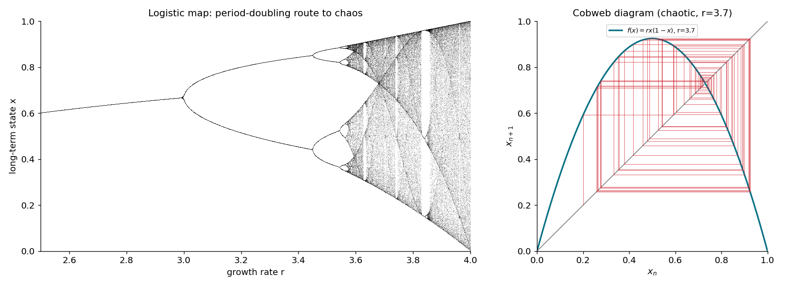
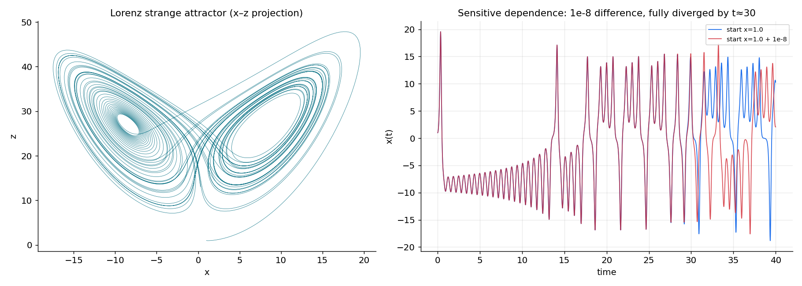

# نظریهٔ آشوب

تا اینجا دینامیک‌هایی دیدیم که سرانجام آرام می‌گیرند: روی یک نقطهٔ ثابت می‌نشینند یا روی یک چرخهٔ حدی می‌چرخند. اما دستگاه‌های **قطعی** (deterministic) — دستگاه‌هایی که هیچ تصادفی در معادلاتشان نیست — می‌توانند رفتاری پدید آورند که به‌ظاهر تصادفی و پیش‌بینی‌ناپذیر است. این پدیده را **آشوب** (chaos) می‌نامند. آشوب جادو نیست؛ پیامدِ ناگزیرِ غیرخطی‌بودن در سه بُعد یا بیشتر است. این فصل، نشانهٔ شاخصِ آن (وابستگیِ حساس به شرایطِ اولیه)، دو مثالِ کلاسیک (نگاشتِ لجستیک و دستگاهِ لورنتس) و راهِ سنجشِ کمّیِ آن (نمای لیاپانوف) را معرفی می‌کند.

???+ tip "در پایانِ این فصل خواهید توانست"
    - **وابستگیِ حساس به شرایطِ اولیه** («اثرِ پروانه‌ای») را توضیح دهید.
    - بفهمید چرا آشوب در جریان‌های پیوسته به دستِ‌کم **سه بُعد** نیاز دارد.
    - **آبشارِ دوبرابرشدنِ دوره** را در نگاشتِ لجستیک بازشناسید.
    - **جاذبِ غریبِ لورنتس** و معنای آن را شرح دهید.
    - مفهومِ **نمای لیاپانوف** را به‌عنوانِ سنجهٔ آشوب به کار ببرید.

---

## وابستگیِ حساس: اثرِ پروانه‌ای

ویژگیِ تعریف‌کنندهٔ آشوب، **وابستگیِ حساس به شرایطِ اولیه** است: دو مسیر که از نقاطی بسیار نزدیک به هم آغاز می‌شوند، با گذرِ زمان به‌صورتِ **نمایی** از هم دور می‌شوند، تا جایی که سرنوشتشان کاملاً نامرتبط می‌شود. این همان «اثرِ پروانه‌ای» است: بال‌زدنِ یک پروانه می‌تواند، در اصول، مسیرِ یک طوفان را در آن‌سوی جهان تغییر دهد.

پیامدِ عملیِ این ویژگی ژرف است: حتی اگر معادلات را دقیقاً بدانیم، پیش‌بینیِ درازمدت ناممکن می‌شود، زیرا هر خطای کوچک در دانستنِ حالتِ آغازین — و اندازه‌گیری همیشه خطا دارد — به‌سرعت تقویت می‌شود. **قطعی‌بودن، پیش‌بینی‌پذیری را تضمین نمی‌کند.**

توجه کنید که این با **نوفه** فرق دارد. یک دستگاهِ آشوبناک کاملاً قطعی است؛ بی‌نظمیِ آن از خودِ دینامیک می‌آید، نه از یک منبعِ تصادفیِ بیرونی. تمیزدادنِ آشوب از نوفه در داده‌های واقعی (مثلاً در فعالیتِ نامنظمِ نورون‌ها) یکی از پرسش‌های دشوار و جالبِ علوم اعصاب است.

---

## آشوب به سه بُعد نیاز دارد (اما نه در نگاشت‌ها)

در فصلِ [نوسانگرها](ch-dynamics-04-oscillators.md) قضیهٔ پوانکاره–بندیکسون را دیدیم: در یک جریانِ پیوستهٔ **دوبُعدی**، تنها رفتارهای ممکن نقطهٔ ثابت و چرخهٔ حدی‌اند. مسیرها در صفحه نمی‌توانند یکدیگر را قطع کنند، پس فضای کافی برای «درهم‌پیچیدنِ» آشوبناک وجود ندارد.

پس برای آشوب در یک **جریانِ پیوسته** به دستِ‌کم **سه بُعد** نیاز است؛ در بُعدِ سوم، مسیرها می‌توانند بی‌آنکه هم را قطع کنند، بی‌پایان روی هم تا بخورند و کش بیایند.

اما یک استثناءِ مهم هست: **نگاشت‌های گسسته** (که زمان را گام‌به‌گام پیش می‌برند، نه پیوسته) می‌توانند حتی در **یک بُعد** آشوبناک باشند. ساده‌ترین و مشهورترین نمونه، نگاشتِ لجستیک است.

---

## نگاشتِ لجستیک: راهِ دوبرابرشدنِ دوره

نگاشتِ **لجستیک** (logistic map) مدلی فریبنده‌ساده برای جمعیتی است که سال‌به‌سال تغییر می‌کند:

\[
x_{n+1} = r\,x_n\,(1 - x_n),
\]

که در آن \(x_n \in [0,1]\) جمعیتِ بهنجارشده در نسلِ \(n\) و \(r\) آهنگِ رشد است. جملهٔ \((1-x_n)\) رقابت بر سرِ منابع را مدل می‌کند: وقتی جمعیت بزرگ است، رشد کند می‌شود.

با افزایشِ \(r\)، رفتارِ درازمدت یک دنبالهٔ شگفت‌انگیز را طی می‌کند:

- برای \(r<3\): جمعیت به یک مقدارِ ثابت می‌رسد (یک نقطهٔ ثابتِ پایدار).
- در \(r=3\): نقطهٔ ثابت ناپایدار می‌شود و جمعیت میانِ **دو** مقدار نوسان می‌کند (دورهٔ ۲).
- با افزایشِ بیشترِ \(r\): دوره به ۴، سپس ۸، ۱۶ و … **دوبرابر** می‌شود، و این دوبرابرشدن‌ها سریع‌تر و سریع‌تر رخ می‌دهند.
- در \(r\approx 3.57\): دوره به بی‌نهایت می‌رسد و **آشوب** آغاز می‌شود.

این **آبشارِ دوبرابرشدنِ دوره** (period-doubling cascade) یکی از راه‌های جهان‌شمولِ رسیدن به آشوب است؛ نسبتِ همگراییِ آن (عددِ فایگنباوم، \(\delta\approx 4.669\)) در دستگاه‌های بسیار متفاوت یکسان است.



*نگاشتِ لجستیک. **چپ — نمودارِ انشعاب:** برای هر \(r\) حالت‌های درازمدت رسم شده‌اند. یک شاخهٔ واحد تا \(r=3\)، سپس دوشاخه‌شدن‌های پیاپی (دوره‌های ۲، ۴، ۸، …) و سرانجام ناحیه‌های آشوبناکِ پُرنقطه — که با «پنجره‌های» نظمِ ناگهانی (مثلاً پنجرهٔ دورهٔ ۳) قطع می‌شوند. **راست — نمودارِ تار‌عنکبوتی** در \(r=3.7\): دنبالهٔ \(x_n\) بی‌آنکه به مقداری بنشیند، آشوبناک در بازه سرگردان می‌ماند.*

```python
import numpy as np
import matplotlib.pyplot as plt

r_values = np.linspace(2.5, 4.0, 1600)
x = 0.5 * np.ones_like(r_values)
for _ in range(400):                  # discard the transient
    x = r_values * x * (1 - x)
for _ in range(200):                  # plot the long-term attractor
    x = r_values * x * (1 - x)
    plt.plot(r_values, x, ",k", alpha=0.25)
plt.xlabel("growth rate r"); plt.ylabel("long-term state x")
plt.show()
```

نکتهٔ خیره‌کننده این است که یک معادلهٔ به این سادگی، با تنها یک پارامتر، می‌تواند نظم، نوسان و آشوب را در خود داشته باشد.

---

## دستگاهِ لورنتس: نخستین جاذبِ غریب

نخستین نمونهٔ تاریخیِ آشوب در یک جریانِ پیوسته، دستگاهِ سه‌معادله‌ای است که ادوارد لورنتس در ۱۹۶۳ هنگامِ مدل‌سازیِ سادهٔ همرفتِ جوّی یافت:

\[
\dot x = \sigma(y - x), \qquad
\dot y = x(\rho - z) - y, \qquad
\dot z = xy - \beta z,
\]

با مقادیرِ کلاسیکِ \(\sigma=10\)، \(\rho=28\) و \(\beta=8/3\). این دستگاه هیچ جوابِ پایا یا دوره‌ای ندارد؛ به‌جای آن، مسیر برای همیشه روی یک شیءِ هندسیِ شگفت‌انگیز به نامِ **جاذبِ غریب** (strange attractor) سرگردان می‌ماند — ساختاری با شکلِ پروانه که مسیرها به‌سویش جذب می‌شوند اما هرگز روی آن تکرار نمی‌شوند.



*دستگاهِ لورنتس. **چپ:** تصویرِ مسیر در صفحهٔ \(x\)–\(z\)؛ شکلِ پروانه‌ایِ مشهورِ جاذبِ غریب. مسیر بی‌پایان میانِ دو «بال» می‌چرخد بی‌آنکه هرگز خود را تکرار کند. **راست — وابستگیِ حساس:** دو مسیر که شرطِ اولیه‌شان تنها \(10^{-8}\) تفاوت دارد، تا حدودِ \(t\approx 25\) بر هم منطبق‌اند، اما سپس کاملاً واگرا می‌شوند. پیش‌بینیِ بلندمدت ناممکن است.*

```python
import scipy.integrate

def lorenz(state, t, sigma=10., rho=28., beta=8/3):
    x, y, z = state
    return [sigma*(y - x), x*(rho - z) - y, x*y - beta*z]

t = np.linspace(0, 50, 12000)
# two nearly-identical starting points diverge completely
a = scipy.integrate.odeint(lorenz, [1., 1., 1.],         t)
b = scipy.integrate.odeint(lorenz, [1. + 1e-8, 1., 1.],  t)
```

---

## نمای لیاپانوف: سنجشِ کمّیِ آشوب

«وابستگیِ حساس» را می‌توان با یک عدد سنجید: **نمای لیاپانوف** (Lyapunov exponent). اگر فاصلهٔ میانِ دو مسیرِ نزدیک در آغاز \(\delta_0\) باشد، در دستگاهی آشوبناک این فاصله به‌طورِ میانگین نمایی رشد می‌کند:

\[
\delta(t) \approx \delta_0\, e^{\lambda t} .
\]

نرخِ \(\lambda\) همان بزرگ‌ترین نمای لیاپانوف است. علامتِ آن همه‌چیز را می‌گوید:

- \(\lambda > 0\): مسیرها واگرا می‌شوند ← **آشوب**.
- \(\lambda < 0\): مسیرها همگرا می‌شوند ← یک نقطهٔ ثابتِ پایدار.
- \(\lambda = 0\): فاصله ثابت می‌ماند ← یک چرخهٔ حدی (نوسانِ پایا).

پس یک نمای لیاپانوفِ مثبت، تعریفِ عملیِ آشوب است. مقیاسِ زمانیِ \(1/\lambda\) نیز «افقِ پیش‌بینی» را می‌دهد: زمانی که پس از آن، پیش‌بینی بی‌فایده می‌شود.

!!! note "آشوب در علوم اعصاب"
    آیا مغز آشوبناک است؟ فعالیتِ بسیاری از نورون‌ها و شبکه‌ها **نامنظم** به‌نظر می‌رسد، و مدل‌هایی مانندِ شبکه‌های تصادفیِ متعادل (که در فصل‌های بعدی می‌آیند) می‌توانند دینامیکِ آشوبناک تولید کنند. اما تمیزدادنِ آشوبِ قطعی از نوفهٔ تصادفی در داده‌های عصبیِ واقعی دشوار است و موضوعِ پژوهش‌های فعال. این نکته یادآور می‌شود که «نامنظم» همیشه به معنای «تصادفی» نیست — گاه یک دینامیکِ قطعیِ ساده در پسِ آن نهفته است.

!!! example "تمرین‌ها"
    ۱. نمودارِ انشعابِ نگاشتِ لجستیک را بازتولید کنید و نخستین چند نقطهٔ دوبرابرشدنِ دوره را مکان‌یابی کنید. آیا نسبتِ فاصله‌های پیاپیِ آن‌ها به عددِ فایگنباوف (\(\approx 4.669\)) نزدیک می‌شود؟

    ۲. دستگاهِ لورنتس را برای دو شرطِ اولیه با تفاوتِ \(10^{-8}\) شبیه‌سازی کنید و فاصلهٔ آن‌ها را بر حسبِ زمان در مقیاسِ لگاریتمی رسم کنید. شیبِ بخشِ خطی، نمای لیاپانوف را تخمین می‌زند.

    ۳. دستگاهِ لورنتس را برای \(\rho\)های کوچک‌تر (مثلاً \(\rho=10\)) شبیه‌سازی کنید. آیا هنوز آشوبناک است؟ \(\rho\) را افزایش دهید تا گذار به آشوب را بیابید.
