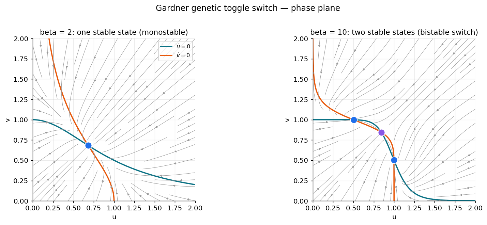
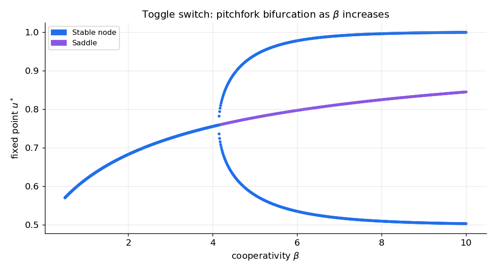
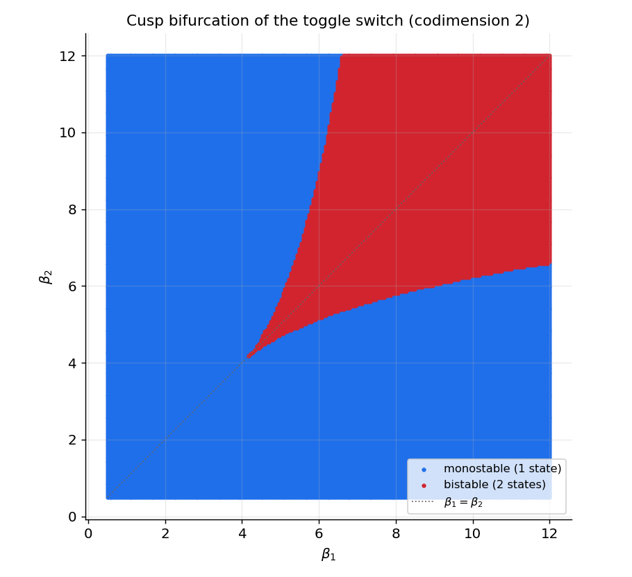

# کاربرد ۱ — دوپایداری: کلیدِ ژنتیکیِ دوحالته

تا اینجا نظریه را ساختیم؛ اکنون آن را روی یک مدلِ واقعی به کار می‌بریم و، مهم‌تر، نشان می‌دهیم چگونه از «حلِ یک مدل» به **پژوهشِ واقعی** می‌رسیم. این فصل یک درس‌نامهٔ گام‌به‌گام است: از صفر آغاز می‌کنیم، هر مرحله را با کد و شکل پیش می‌بریم، و در پایان به ابزارهایی می‌رسیم (ادامهٔ عددی، نمودارِ انشعابِ دوپارامتری) که در مقاله‌های واقعی به کار می‌روند.

مدلِ ما **کلیدِ ژنتیکیِ دوحالتهٔ** گاردنر، کانتور و کالینز ([Gardner et al., 2000, *Nature*](https://www.nature.com/articles/35002131)) است. این مدل را برای زیست‌شناسیِ ترکیبی ساختند، اما نمونهٔ اولیهٔ هر دستگاهی است که باید **یک حافظهٔ گسسته را ذخیره کند**.

???+ tip "چرا این مدل برای علوم اعصاب مهم است؟"
    نشانهٔ ریاضیِ **حافظه**، **دوپایداری** (bistability) است: دو حالتِ پایدارِ هم‌زیست که دستگاه می‌تواند در یکی بنشیند و همان‌جا بماند تا یک محرکِ کافی آن را به دیگری بیندازد. این الگو در سراسرِ علوم اعصاب تکرار می‌شود:

    - **حافظهٔ کاری**: جمعیت‌هایی از نورون‌ها که پس از حذفِ محرک، در حالتِ «روشن» باقی می‌مانند.
    - **تصمیم‌گیری**: انتخابِ میانِ دو گزینه، به‌صورتِ افتادن به یکی از دو حوضهٔ جذب.
    - **حالت‌های بالا/پایینِ** قشر مغز در خواب.
    - **ادراکِ دوحالته** (مانندِ مکعبِ نِکر) که میانِ دو تعبیر می‌پرد.

    کلیدِ ژنتیکی، ساده‌ترین و شفاف‌ترین مدلی است که سازوکارِ ریاضیِ مشترکِ همهٔ این‌ها را آشکار می‌کند.

---

## ۱. مدل

دو ژن را در نظر بگیرید که هرکدام پروتئینی می‌سازد که تولیدِ دیگری را **مهار** می‌کند. اگر \(u\) و \(v\) غلظتِ این دو پروتئین باشند:

\[
\frac{du}{dt} = \frac{\alpha}{1+v^{\beta}} - u, \qquad
\frac{dv}{dt} = \frac{\alpha}{1+u^{\beta}} - v .
\]

هر معادله دو بخش دارد: یک **جملهٔ تولید** و یک **جملهٔ تجزیه** ( \(-u\) یا \(-v\) ).

- جملهٔ تولیدِ \(u\)، یعنی \(\dfrac{\alpha}{1+v^{\beta}}\)، یک **تابعِ هیل** (Hill function) است. وقتی \(v\) کوچک است، این تقریباً \(\alpha\) (تولیدِ بیشینه) است؛ وقتی \(v\) بزرگ است، به صفر میل می‌کند (مهارِ کامل). پس \(v\) تولیدِ \(u\) را خاموش می‌کند، و بالعکس.
- پارامترِ \(\alpha\) بیشینهٔ آهنگِ تولید است.
- پارامترِ \(\beta\) **هم‌یاری** (cooperativity) است: اینکه مهار چقدر **تند** عمل می‌کند. \(\beta\)ِ بزرگ یعنی یک گذارِ تیزِ شبیهِ کلید.

شهودِ پشتِ دوپایداری ساده است: اگر \(u\) بالا باشد، \(v\) را خاموش می‌کند، و \(v\)ِ خاموش دیگر نمی‌تواند \(u\) را مهار کند، پس \(u\) بالا می‌ماند. این یک **بازخوردِ مثبتِ متقابل** است که می‌تواند به دو حالتِ پایدار بینجامد: «\(u\) بالا، \(v\) پایین» یا «\(u\) پایین، \(v\) بالا». اما این تنها وقتی رخ می‌دهد که مهار به‌اندازهٔ کافی تند باشد — یعنی \(\beta\) به‌اندازهٔ کافی بزرگ. هدفِ تحلیلِ ما یافتنِ همین آستانه است.

```python
from functools import partial
import numpy as np
import scipy.integrate
import scipy.optimize
import matplotlib.pyplot as plt

def cellular_switch(y, t, alpha, beta):
    """Flow of Gardner's bistable genetic toggle switch.
    y = (u, v): protein concentrations.  alpha: max production.  beta: cooperativity."""
    u, v = y
    return np.array([alpha / (1 + v**beta) - u,
                     alpha / (1 + u**beta) - v])
```

---

## ۲. مسیرها: دستگاه را «حس» کنیم

نخستین گام در روبه‌روشدن با هر مدلِ تازه، صرفاً **شبیه‌سازیِ آن از چند شرطِ اولیه** و تماشای رفتارش است. این به ما حس می‌دهد که تعادل‌ها کجایند و چندتایند. از تابعِ `scipy.integrate.odeint` استفاده می‌کنیم.

```python
scenarios = [{"alpha": 1, "beta": 2},        # low cooperativity
             {"alpha": 1, "beta": 10}]       # high cooperativity
time = np.linspace(0, 20, 1000)
initial_conditions = [(.1, 1), (2, 2), (1, 1.3), (2, 3), (2, 1), (1, 2)]

trajectory = {}
for i, param in enumerate(scenarios):
    for j, ic in enumerate(initial_conditions):
        trajectory[i, j] = scipy.integrate.odeint(
            partial(cellular_switch, **param), y0=ic, t=time)
```

اگر مسیرها را رسم کنید، می‌بینید که برای \(\beta=2\) همهٔ شرایطِ اولیه به **یک** حالت می‌رسند، اما برای \(\beta=10\) بسته به نقطهٔ آغاز، به **دو** حالتِ متفاوت همگرا می‌شوند. این نخستین نشانهٔ دوپایداری است.

---

## ۳. نولکلین‌ها (nullclines)

برای فهمِ ساختار، نولکلین‌ها را می‌یابیم — منحنی‌هایی که روی آن‌ها یک مؤلفهٔ جریان صفر است:

\[
\frac{du}{dt} = 0 \;\Leftrightarrow\; u = \frac{\alpha}{1 + v^\beta}, \qquad
\frac{dv}{dt} = 0 \;\Leftrightarrow\; v = \frac{\alpha}{1 + u^\beta}.
\]

تعادل‌ها تقاطعِ این دو منحنی‌اند.

```python
def plot_isocline(ax, uspace, vspace, alpha, beta, color="k", style="--"):
    """Plot the two nullclines of the symmetric toggle switch."""
    ax.plot(uspace, alpha / (1 + uspace**beta), style, color=color, alpha=0.6)
    ax.plot(alpha / (1 + vspace**beta), vspace, style, color=color, alpha=0.6)
    ax.set(xlabel="u", ylabel="v")
```

---

## ۴. میدانِ جریان

میدانِ برداری، رفتارِ محلیِ دستگاه را در هر نقطه نشان می‌دهد. با `streamplot` رسم می‌شود:

```python
def plot_flow(ax, param, uspace, vspace):
    """Plot the vector field (flow) of the toggle switch."""
    U, V = np.meshgrid(uspace, vspace)
    flow = cellular_switch([U, V], 0, **param)
    ax.streamplot(U, V, flow[0], flow[1], color=(0, 0, 0, 0.1))
```

---

## ۵. یافتنِ تعادل‌ها

تعادل‌ها ریشه‌های جریان‌اند: جایی که \(F(u,v)=G(u,v)=0\). آن‌ها را با `scipy.optimize.fsolve` می‌یابیم. ترفندِ کلیدی این است که از **نقطهٔ پایانیِ مسیرهای شبیه‌سازی‌شده** به‌عنوانِ حدسِ آغازین استفاده کنیم؛ چون مسیرها به تعادل‌های پایدار می‌رسند، این حدس‌ها معمولاً خوب‌اند.

```python
def findroot(func, init):
    """Find a root of func(x)=0; return it if fsolve converged, else NaNs."""
    sol, info, convergence, msg = scipy.optimize.fsolve(func, init, full_output=1)
    if convergence == 1:
        return sol
    return np.array([np.nan] * len(init))

def find_unique_equilibria(flow, starting_points):
    """Return the list of distinct equilibria found from several starting points."""
    equilibria = []
    for init in starting_points:
        r = findroot(flow, init)
        if (not any(np.isnan(r)) and
                not any(all(np.isclose(r, e)) for e in equilibria)):
            equilibria.append(r)
    return equilibria

equilibria = {}
for i, param in enumerate(scenarios):
    flow = partial(cellular_switch, t=0, **param)
    starts = [trajectory[i, j][-1, :] for j in range(len(initial_conditions))]
    equilibria[i] = find_unique_equilibria(flow, starts)
    print(f"{len(equilibria[i])} equilibrium point(s) for {param}")
```

برای \(\beta=2\) یک تعادل و برای \(\beta=10\) سه تعادل می‌یابیم — همان نشانهٔ دوپایداری.

---

## ۶. سرشتِ تعادل‌ها: ژاکوبین

برای دانستنِ اینکه هر تعادل پایدار است یا نه، جریان را در آن نقطه **خطی‌سازی** می‌کنیم. ماتریسِ ژاکوبی را می‌توان دستی محاسبه کرد:

\[
J \big\rvert_{u,v} =
- \begin{bmatrix}
1 & \dfrac{\alpha \beta\, v^{\beta-1}}{(1+v^\beta)^2}\\[2ex]
\dfrac{\alpha \beta\, u^{\beta-1}}{(1+u^\beta)^2} & 1
\end{bmatrix},
\]

و سپس از اثر (trace) و دترمینان، نوع و پایداری را خواند.

```python
def jacobian_cellular_switch(u, v, alpha, beta):
    """Jacobian of the symmetric toggle switch at (u, v)."""
    return -np.array([[1, alpha*beta*v**(beta-1) / (1 + v**beta)**2],
                      [alpha*beta*u**(beta-1) / (1 + u**beta)**2, 1]])

def stability(jacobian):
    """Classify a 2x2 Jacobian using trace and determinant."""
    det = np.linalg.det(jacobian)
    trace = np.trace(jacobian)
    if np.isclose(trace, 0) and np.isclose(det, 0):
        return "Center (Hopf)"
    elif np.isclose(det, 0):
        return "Transcritical (Saddle-Node)"
    elif det < 0:
        return "Saddle"
    else:
        nature = "Stable" if trace < 0 else "Unstable"
        nature += " focus" if (trace**2 - 4 * det) < 0 else " node"
        return nature
```

!!! note "اگر مشتق‌گیریِ دستی خسته‌کننده شد"
    `sympy` ژاکوبین را خودکار می‌سازد:

    ```python
    import sympy
    u, v, alpha, beta = sympy.symbols("u v alpha beta")
    F = sympy.Matrix([alpha/(1 + v**beta) - u, alpha/(1 + u**beta) - v])
    J = F.jacobian(sympy.Matrix([u, v]))
    jacobian_cellular_switch = sympy.lambdify((u, v, alpha, beta), J, dummify=False)
    ```

با اجرای این برای \(\beta=10\) می‌بینیم که دو تعادلِ بیرونی **گرهِ پایدار** و تعادلِ میانی **زین** است — دقیقاً ساختارِ دوپایدار.

---

## ۷. نمودارِ کاملِ فاز

اکنون همه‌چیز را در یک تصویر گرد می‌آوریم: نولکلین‌ها، جریان، تعادل‌ها (با رنگِ نوعشان) و مسیرها.



*صفحهٔ فازِ کلیدِ دوحالته ( \(\alpha=1\) ). منحنی‌های فیروزه‌ای و نارنجی نولکلین‌ها و خطوطِ خاکستری جریان‌اند. **چپ ( \(\beta=2\) ):** نولکلین‌ها یک‌بار قطع می‌کنند — یک گرهِ پایدارِ واحد (آبی)، پس دستگاه *تک‌پایدار* است. **راست ( \(\beta=10\) ):** سه‌بار قطع می‌کنند — دو گرهِ پایدار (آبی) در دو سوی یک زین (بنفش). دستگاه یک **کلیدِ دوپایدارِ** واقعی است؛ زین مرزِ میانِ دو حوضهٔ جذب را مشخص می‌کند، یعنی همان «آستانه‌ای» که تعیین می‌کند دستگاه به کدام حافظه می‌افتد.*

---

## ۸. نمودارِ انشعاب: حافظه کِی روشن می‌شود؟

تا اینجا برای دو مقدارِ \(\beta\) کار کردیم. اما پرسشِ پژوهشیِ واقعی این است: **دقیقاً در چه مقداری از \(\beta\)، دستگاه از تک‌پایدار به دوپایدار می‌گذرد؟** پاسخ، یک **نمودارِ انشعاب** است: مکان و پایداریِ تعادل‌ها بر حسبِ پارامتر.

راهِ ساده‌لوحانه این است که برای هر \(\beta\) همه‌چیز را از نو حل کنیم. اما این پرهزینه و ناپایدار است. روشِ حرفه‌ای، **ادامهٔ عددی** (numerical continuation) است: جوابِ یک \(\beta\) را حدسِ آغازینِ \(\beta\) بعدی می‌گیریم. ساده‌ترین گونهٔ آن، **ادامهٔ پارامترِ طبیعی** است.

```python
def numerical_continuation(f, initial_u, lambda_values):
    """Follow a root of f(u, lambda)=0 as lambda sweeps through lambda_values.
    The solution at one step seeds the solver at the next."""
    eq = []
    for lam in lambda_values:
        seed = eq[-1] if eq else initial_u
        eq.append(findroot(lambda x: f(x, lam), seed))
    return eq

def func(u, lam):
    return cellular_switch(u, t=0, alpha=1.0, beta=lam)

beta_space = np.linspace(10, 0.5, 1000)
starting_points = [(.5, .99), (0.84, .84), (.99, .5)]   # one per branch
```

با ردیابیِ سه شاخه (دو شاخهٔ پایدارِ بیرونی و یک شاخهٔ ناپایدارِ میانی) و رنگ‌کردنِ هر نقطه بر اساسِ پایداری‌اش، نمودارِ زیر به‌دست می‌آید.



*نمودارِ انشعابِ کلیدِ دوحالتهٔ متقارن: مقدارِ پایای \(u\) بر حسبِ هم‌یاریِ \(\beta\). زیرِ \(\beta\approx4\) یک حالتِ پایدار هست؛ بالای آن، شاخه به دو حالتِ پایدار (آبی) با یک زینِ ناپایدار (بنفش) در میان دوشاخه می‌شود. این دوشاخگی یک **انشعابِ چنگالیِ فوق‌بحرانی** (supercritical pitchfork) است — آغازِ حافظه. در سمتِ چپ، نقطه‌ای که شاخه‌ها از آن جدا می‌شوند، نقطهٔ انشعاب است.*

```python
def get_branches(func, starting_points, lambda_space, jac):
    """Continue each branch and classify the nature of the equilibrium along it."""
    branches = []
    for init in starting_points:
        eq = numerical_continuation(func, np.array(init), lambda_space)
        nature = [stability(jac(u[0], u[1], 1.0, lam))
                  for u, lam in zip(eq, lambda_space)]
        branches.append((np.array([u[0] for u in eq]), nature))
    return branches
```

---

## ۹. راهِ پژوهش: شکستنِ تقارن و انشعابِ کاسپ

اینجاست که از یک تمرینِ درسی به یک پرسشِ پژوهشی می‌رسیم. انشعابِ چنگالی **پیامدِ تقارنِ کاملِ مدل** است (تقارنِ \(u\leftrightarrow v\)). اما تقارنِ کامل در طبیعت نادر است. چه می‌شود اگر دو ژن با هم‌یاری‌های **متفاوت** مهار کنند؟ این مدلِ نامتقارن، الهام‌گرفته از کارِ [Ozbudak et al., 2004, *Nature*](https://www.nature.com/articles/nature02298)، چنین است:

\[
\frac{du}{dt} = \frac{\alpha}{1+v^{\beta_1}} - u, \qquad
\frac{dv}{dt} = \frac{\alpha}{1+u^{\beta_2}} - v .
\]

اگر یک پارامتر را ثابت کنیم و دیگری را جارو کنیم، می‌بینیم که انشعابِ چنگالی **می‌شکند**: به یک شاخهٔ هموار به‌علاوهٔ یک جفت **انشعابِ زین–گرهٔ** معمولی باز می‌شود. این یعنی انشعابِ چنگالی **استوار نیست** (structurally unstable): کوچک‌ترین نامتقارنی، سرشتِ آن را عوض می‌کند. این یک درسِ ژرفِ مدل‌سازی است — به انشعاب‌هایی که بر تقارنِ دقیق تکیه دارند نباید بیش‌ازحد اعتماد کرد.

اکنون اگر **هر دو** پارامترِ \(\beta_1\) و \(\beta_2\) را جارو کنیم، می‌توانیم نقشهٔ کاملِ رفتار را در صفحهٔ \((\beta_1,\beta_2)\) بکشیم: کجا دستگاه تک‌پایدار و کجا دوپایدار است. دو خمِ زین–گره در یک نقطه به هم می‌رسند و یک **انشعابِ کاسپ** (cusp) می‌سازند — ساده‌ترین انشعابِ **هم‌بُعدِ‌دو** (codimension-2).



*انشعابِ کاسپ در صفحهٔ \((\beta_1,\beta_2)\). ناحیهٔ آبی تک‌پایدار (یک حالت) و ناحیهٔ قرمز دوپایدار (دو حالت) است. مرزِ میانِ آن‌ها از دو خمِ زین–گره ساخته شده که در یک **نوکِ تیز** (کاسپ، نزدیکِ \(\beta_1=\beta_2\approx4\)) به هم می‌رسند. خطِ نقطه‌چینِ قطری، حالتِ متقارنِ \(\beta_1=\beta_2\) را نشان می‌دهد که در آن انشعابِ چنگالی رخ می‌داد. کاسپ، نقطه‌ای است که دو زین–گره و یک چنگال در آن به‌هم می‌رسند.*

این دقیقاً همان نوع تحلیلی است که در مقاله‌های واقعیِ زیست‌شناسیِ سیستم‌ها و علوم اعصابِ محاسباتی دیده می‌شود: نه فقط «این مدل دوپایدار است»، بلکه **«مرزِ دوپایداری در فضای پارامتر کجاست و چه ساختاری دارد»**. نوت‌بوکِ `bistable_systems.ipynb` این محاسبه را به‌طورِ کامل، همراه با رسمِ سه‌بُعدیِ منیفلدِ تعادل‌ها، انجام می‌دهد.

!!! note "اصطلاحِ «هم‌بُعد» (codimension)"
    هم‌بُعدِ یک انشعاب، تعدادِ پارامترهایی است که باید هم‌زمان تنظیم شوند تا آن انشعاب رخ دهد. زین–گره و هاپف **هم‌بُعدِ‌یک‌اند** (یک پارامتر کافی است) و در نمودارهای تک‌پارامتری دیده می‌شوند. کاسپ **هم‌بُعدِ‌دو** است و تنها در یک صفحهٔ دوپارامتری پدیدار می‌شود. هرچه هم‌بُعد بالاتر باشد، آن انشعاب نادرتر و «سازمان‌دهنده‌تر» است.

---

## پیوند با علوم اعصاب و پروژه‌ها

سازوکارِ این کلید — دو حالتِ پایدار که با یک زین جدا شده‌اند — همان سازوکاری است که در مدل‌های **حافظهٔ کاری** و **تصمیم‌گیریِ** عصبی به کار می‌رود؛ آنجا \(u\) و \(v\) به‌جای غلظتِ پروتئین، نرخِ آتشِ دو جمعیتِ رقیبِ نورونی‌اند. منطق یکسان است: بازخوردِ مثبتِ متقابل + مهارِ به‌اندازهٔ‌کافی‌تند = دو حالتِ پایدار = حافظه.

!!! example "تمرین‌ها و پروژه‌ها"
    ۱. **(تمرین)** نمودارِ فاز را برای \(\beta=2\) و \(\beta=10\) بازتولید کنید و با شمارشِ تقاطعِ نولکلین‌ها تأیید کنید که گذار به دوپایداری رخ داده. آستانهٔ تقریبیِ \(\beta\) را با ادامهٔ عددی بیابید.

    ۲. **(تمرین)** از دو شرطِ اولیهٔ نزدیک به هم اما در دو سوی زین شبیه‌سازی کنید و نشان دهید به حالت‌های پایدارِ متفاوت می‌رسند. این همان *به‌خاطرسپردنِ* ورودی است.

    ۳. **(پروژه)** مدلِ نامتقارن را پیاده کنید و نقشهٔ کاملِ \((\beta_1,\beta_2)\) را بسازید. نوکِ کاسپ را مکان‌یابی کنید. سپس یک محرکِ گذرا به یکی از متغیرها بدهید و نشان دهید چگونه می‌توان دستگاه را میانِ دو حالت **سوئیچ** کرد (همان عملیاتِ نوشتنِ حافظه).

    ۴. **(پروژه)** نوفه را به مدل بیفزایید (با اویلر–مارویاما، فصلِ [SDE](https://computational-neuroscience.ir/ch-num-07-sde/)) و بررسی کنید که نوفه چگونه می‌تواند دستگاه را به‌طورِ خودبه‌خودی میانِ دو حالت بپراند (سوئیچِ القاشده با نوفه) — پدیده‌ای که در بیانِ ژن و در ادراکِ دوحالته اهمیت دارد.
