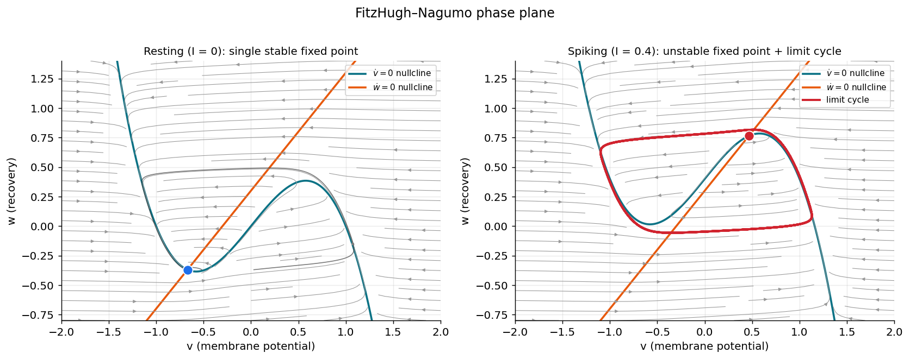
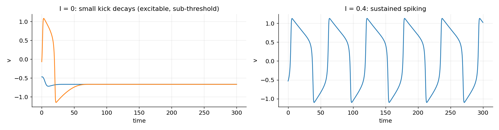
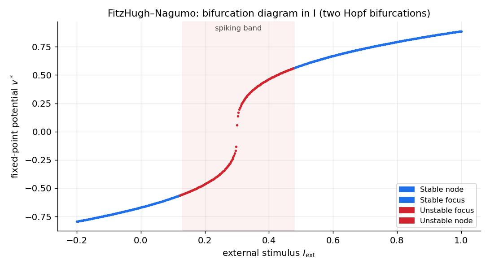
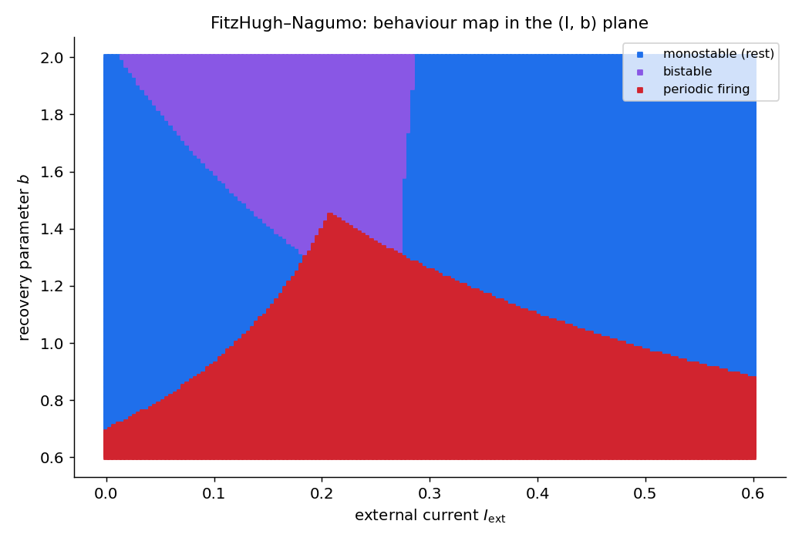
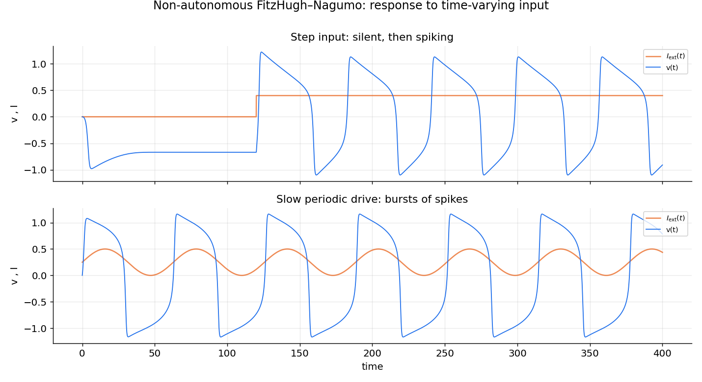
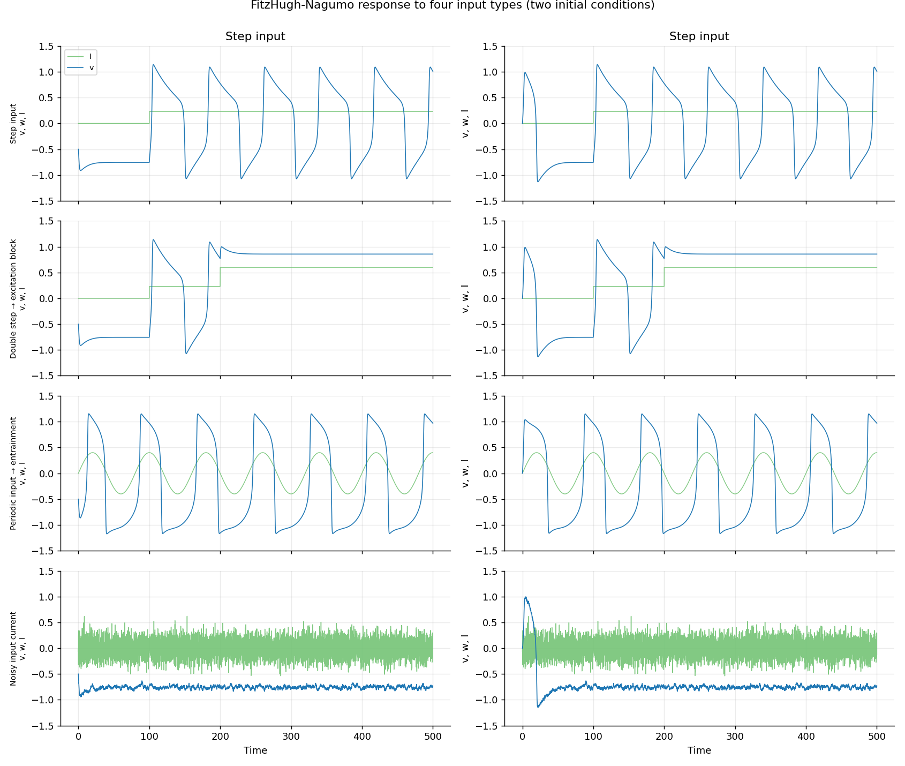
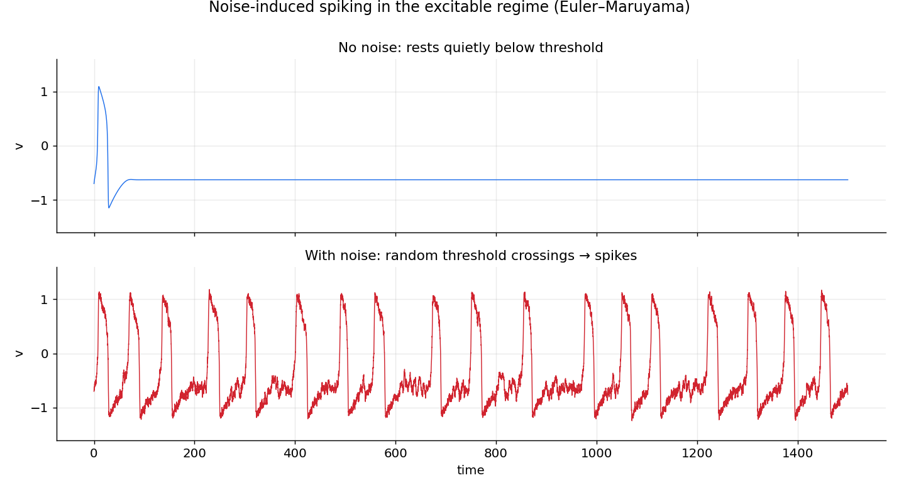
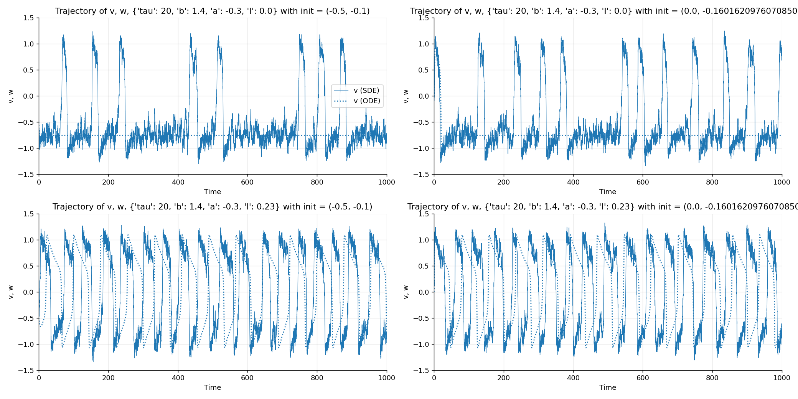
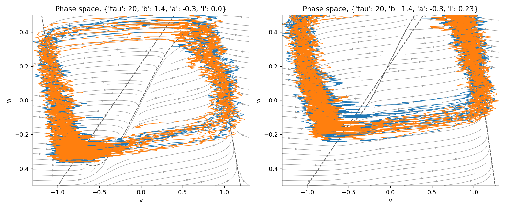

# کاربرد ۲ — تحریک‌پذیری: نورونِ فیتزهیو–ناگومو

در فصلِ پیش دیدیم چگونه دو حالتِ پایدار، **حافظه** می‌سازند. اکنون به پدیدهٔ بنیادینِ دیگرِ علوم اعصاب می‌پردازیم: **اسپایک**. چگونه یک نورون آرام استراحت می‌کند، اما با یک محرکِ کافی یک پتانسیلِ عمل بزرگ شلیک می‌کند و سپس به استراحت بازمی‌گردد؟ این رفتار را **تحریک‌پذیری** (excitability) می‌نامند، و ساده‌ترین مدلی که آن را بازتولید می‌کند، نورونِ **فیتزهیو–ناگومو** است.

این فصل، مانندِ فصلِ پیش، یک درس‌نامهٔ گام‌به‌گام است که از صفر تا پژوهشِ واقعی پیش می‌رود. مدل و کدها از نوت‌بوکِ `excitable_systems.ipynb` می‌آیند.

???+ tip "تحریک‌پذیری یعنی چه؟"
    سه واقعیتِ تجربی، رفتارِ یک نورونِ تحریک‌پذیر را تعریف می‌کنند:

    - **استراحت:** بدونِ ورودی، سلول در یک ولتاژِ پایای آرام می‌نشیند.
    - **آستانه:** یک محرکِ *کوچک* میرا می‌شود و سلول به استراحت بازمی‌گردد؛ اما محرکی فراتر از یک **آستانه**، یک گردشِ بزرگ — یک **اسپایک** — را پیش از بازگشت رها می‌کند.
    - **شلیکِ تکراری:** اگر ورودی به‌اندازهٔ کافی بزرگ و پایا باشد، سلول به‌صورتِ ریتمیک و پیوسته اسپایک می‌زند.

    نکتهٔ کلیدی این است که سلول به محرک‌ها **«همه یا هیچ»** پاسخ می‌دهد: کیک‌های کوچک را نادیده می‌گیرد و بزرگ‌ها را به یک اسپایکِ کامل تقویت می‌کند.

---

## از هاجکین–هاکسلی تا فیتزهیو–ناگومو

مدلِ کاملِ [هاجکین–هاکسلی](https://computational-neuroscience.ir/ch03/) پتانسیلِ عمل را با **چهار** متغیر توصیف می‌کند (ولتاژ به‌علاوهٔ سه دروازهٔ یونی). این مدل دقیق است اما تحلیلِ هندسیِ آن دشوار. فیتزهیو دریافت که می‌توان آن را به یک کاریکاتورِ **دومتغیره** فروکاست که جوهرِ رفتار را نگه می‌دارد:

- یک متغیرِ **سریعِ فعال‌ساز** \(v\) (شبیهٔ ولتاژ غشا) که بازخوردِ مثبت دارد و بالاروِ تندِ اسپایک را می‌سازد.
- یک متغیرِ **کندِ بازیابی** \(w\) که با تأخیر سلول را به استراحت بازمی‌کشد (نقشِ غیرفعال‌شدنِ سدیم و فعال‌شدنِ پتاسیم را یک‌جا بازی می‌کند).

این جداییِ مقیاسِ زمانیِ سریع–کند، همان سازوکارِ نوسانِ واهلشیِ فان‌در‌پل (فصلِ [نوسانگرها](ch-dynamics-04-oscillators.md)) است. کاهش به دو بُعد یک پاداشِ بزرگ دارد: می‌توانیم کلِ رفتار را در **صفحهٔ فاز** ببینیم.

---

## ۱. مدل

\[
\frac{dv}{dt} = v - v^3 - w + I_\text{ext}, \qquad
\tau\,\frac{dw}{dt} = v - a - b\,w .
\]

- \(v\): پتانسیلِ غشای (بی‌بُعد). جملهٔ \(v - v^3\) همان بازخوردِ مثبتِ غیرخطی است که اسپایک را می‌زند.
- \(w\): متغیرِ بازیابیِ کند.
- \(\tau\): ثابتِ زمانیِ بزرگِ بازیابی (اینجا \(\tau=20\))؛ بزرگ‌بودنِ آن، «کند»بودنِ \(w\) را تضمین می‌کند.
- \(I_\text{ext}\): جریانِ تزریقی.
- \(a, b\): پارامترهای شکلِ نولکلینِ بازیابی (اینجا \(a=-0.3\)، \(b=1.0\)).

(فیتزهیو–ناگومو چند صورتِ هم‌ارز دارد؛ نسخه‌ای که فصلِ [حل عددی معادلات دیفرانسیل معمولی](https://computational-neuroscience.ir/ch-num-06-ode/) به کار برد، بهنجارشِ اندکی متفاوتی دارد اما رفتارِ کیفیِ یکسانی.)

```python
from functools import partial
import numpy as np
import scipy.integrate
import matplotlib.pyplot as plt

def fitzhugh_nagumo(x, t, a, b, tau, I):
    """FitzHugh-Nagumo flow. x = (v, w): voltage and recovery."""
    v, w = x
    return np.array([v - v**3 - w + I,
                     (v - a - b * w) / tau])
```

---

## ۲. مسیرها: آستانه را ببینیم

نخست دستگاه را از چند جابه‌جاییِ کوچک و بزرگ از استراحت می‌رانیم ( \(I=0\) ) و تماشا می‌کنیم. این، نشانهٔ شاخصِ تحریک‌پذیری — وجودِ یک **آستانه** — را آشکار می‌کند.

```python
base = {"a": -0.3, "b": 1.0, "tau": 20, "I": 0.0}
time = np.linspace(0, 200, 2000)

for v0 in [-1.0, -0.9, -0.6, -0.2]:        # increasingly strong kicks from rest
    traj = scipy.integrate.odeint(partial(fitzhugh_nagumo, **base),
                                  y0=(v0, -0.4), t=time)
    plt.plot(time, traj[:, 0], label=f"v0 = {v0}")
plt.xlabel("time"); plt.ylabel("v"); plt.legend(); plt.show()
```

جابه‌جایی‌های کوچک به‌نرمی به استراحت بازمی‌گردند، اما همین‌که از یک آستانه بگذریم، مسیر یک حلقهٔ بزرگ — یک اسپایکِ کامل — می‌زند و سپس بازمی‌گردد. پاسخ «همه یا هیچ» است.

---

## ۳. نولکلین‌ها (nullclines)

با صفر قراردادنِ هر مشتق:

\[
\frac{dv}{dt}=0 \;\Leftrightarrow\; w = v - v^3 + I_\text{ext}\quad\text{(N-shaped cubic nullcline)},
\]
\[
\frac{dw}{dt}=0 \;\Leftrightarrow\; w = \frac{v - a}{b}\quad\text{(straight line)} .
\]

تعادل‌ها تقاطعِ این دو هستند. شکلِ N-مانندِ نولکلینِ \(v\) قلبِ تحریک‌پذیری است: شاخهٔ میانیِ آن (با شیبِ مثبت) ناپایدار است و نقشِ «آستانه» را بازی می‌کند.

```python
def plot_nullclines(ax, a, b, tau, I, vs=np.linspace(-2.2, 2.2, 400)):
    ax.plot(vs, vs - vs**3 + I, label=r"$\dot v=0$")     # cubic
    ax.plot(vs, (vs - a) / b, label=r"$\dot w=0$")        # line
    ax.set(xlabel="v", ylabel="w")
```

---

## ۴. یافتنِ تعادل‌ها — با ریشه‌های چندجمله‌ای

برای فیتزهیو–ناگومو، یافتنِ تعادل‌ها از مدلِ پیش هم تمیزتر است: با جای‌گذاریِ خطِ بازیابی در منحنیِ سه‌گانه، به یک **معادلهٔ درجهٔ سومِ دقیق** در \(v\) می‌رسیم که `numpy.roots` آن را کامل حل می‌کند (هیچ حدسِ آغازینی لازم نیست):

\[
v^3 + v\!\left(\frac{1}{b}-1\right) - \left(\frac{a}{b}+I_\text{ext}\right) = 0,
\qquad w^* = v^* - (v^*)^3 + I_\text{ext} .
\]

```python
def fhn_equilibria(a, b, tau, I):
    """All real equilibria of FHN, found exactly via the cubic's roots."""
    coeffs = [1, 0, 1/b - 1, -(a/b + I)]       # v^3 + (1/b - 1) v - (a/b + I)
    return [(r.real, r.real - r.real**3 + I)
            for r in np.roots(coeffs) if abs(r.imag) < 1e-9]
```

بسته به پارامترها، این می‌تواند یک یا سه ریشهٔ حقیقی بدهد — یعنی یک یا سه تعادل.

---

## ۵. سرشتِ تعادل‌ها: ژاکوبین

ژاکوبین را با دست می‌گیریم:

\[
J\big\rvert_{(v,w)} =
\begin{bmatrix}
1 - 3v^2 & -1 \\[1ex]
\dfrac{1}{\tau} & -\dfrac{b}{\tau}
\end{bmatrix},
\]

و با یک تابعِ `stability` (نسخهٔ فشرده‌ترِ همان تابعِ فصلِ [دوپایداری](ch-dynamics-06-neuro-bistability.md)) رده‌بندی می‌کنیم.

```python
def fhn_jacobian(v, w, a, b, tau, I):
    return np.array([[1 - 3*v**2, -1.0],
                     [1/tau,      -b/tau]])

def stability(J):
    """Classify a 2x2 Jacobian via trace and determinant."""
    det, trace = np.linalg.det(J), np.trace(J)
    if det < 0:
        return "Saddle"
    nature = "Stable" if trace < 0 else "Unstable"
    nature += " focus" if (trace**2 - 4*det) < 0 else " node"
    return nature

for v, w in fhn_equilibria(**base):
    print(f"{stability(fhn_jacobian(v, w, **base)):14s} at v* = {v:+.3f}")
```

!!! note "همان الگو با `sympy`"
    اگر ترجیح می‌دهید مشتق‌ها را با دست نگیرید، `sympy` (مانندِ فصلِ پیش) ژاکوبین را خودکار می‌سازد. الگوی کار دقیقاً یکسان است: یک ماتریسِ نمادینِ جریان تعریف کنید، `.jacobian` بگیرید، و با `lambdify` به تابعِ عددی بدل کنید.

---

## ۶. نمودارِ کاملِ فاز: استراحت در برابرِ شلیک

اکنون همه‌چیز را در صفحهٔ فاز گرد می‌آوریم، برای دو رژیمِ کلیدی.



*صفحهٔ فازِ فیتزهیو–ناگومو ( \(a=-0.3,\,b=1.0,\,\tau=20\) ). منحنیِ سه‌گانهٔ فیروزه‌ای نولکلینِ \(\dot v=0\) و خطِ نارنجی نولکلینِ \(\dot w=0\) است؛ تقاطعشان نقطهٔ ثابت است. **چپ ( \(I=0\) ):** یک نقطهٔ ثابتِ *پایدارِ* واحد (آبی) — حالتِ استراحت؛ مسیرهای کیک‌های کوچک (خاکستری) بازمی‌گردند، اما کیکی فراتر از شاخهٔ میانیِ منحنی یک حلقهٔ بلند (اسپایک) می‌زند. **راست ( \(I=0.4\) ):** نقطهٔ ثابت اکنون *ناپایدار* (قرمز) است و یک **چرخهٔ حدیِ پایدار** (حلقهٔ قرمز) آن را در بر گرفته — نورون به‌صورتِ دوره‌ای اسپایک می‌زند.*

همین دو رژیم را به‌صورتِ ردِ ولتاژ نیز می‌توان دید:



*پتانسیلِ غشای \(v(t)\) برای همان دو حالت. **چپ ( \(I=0\) ):** کیک‌های کوچک میرا می‌شوند؛ یک کیکِ بزرگ‌تر یک اسپایک تولید می‌کند و سپس خاموشی (تحریک‌پذیر اما بدونِ نوسانِ پایا). **راست ( \(I=0.4\) ):** شلیکِ پایدار و دوره‌ای — چهرهٔ زمانیِ چرخهٔ حدی.*

به‌یاد بیاورید (فصلِ [نوسانگرها](ch-dynamics-04-oscillators.md)) که گذار از «نقطهٔ ثابتِ پایدار» به «چرخهٔ حدی» نشانهٔ یک **انشعابِ هاپف** است. بیایید این را دقیق‌تر بررسی کنیم.

---

## ۷. نمودارِ انشعاب در \(I\): دو هاپف و انسدادِ تحریک

اکنون پرسشِ پژوهشی: **با افزایشِ تدریجیِ جریانِ \(I_\text{ext}\)، رفتارِ نورون چگونه تغییر می‌کند؟** جریان را جارو می‌کنیم و تعادل را در هر مقدار رده‌بندی می‌کنیم.

```python
I_values = np.linspace(-0.2, 1.0, 500)
for I in I_values:
    p = {"a": -0.3, "b": 1.0, "tau": 20, "I": I}
    for v, w in fhn_equilibria(**p):
        nature = stability(fhn_jacobian(v, w, **p))
        color = "C0" if nature.startswith("Stable") else "C3"
        plt.plot(I, v, ".", color=color, ms=4)
plt.xlabel(r"$I_{\rm ext}$"); plt.ylabel(r"$v^*$"); plt.show()
```



*نمودارِ انشعابِ فیتزهیو–ناگومو: پتانسیلِ پایای \(v^*\) بر حسبِ جریانِ تزریقیِ \(I_\text{ext}\) ( \(b=1.0\) ). آبی نقطهٔ ثابتِ پایدار و قرمز نقطهٔ ناپایدار است. نقطهٔ ثابت در جریان‌های کم و زیاد پایدار و **در نوارِ سایه‌خوردهٔ میانی** ناپایدار است، که با دو **انشعابِ هاپف** کران‌دار شده. درونِ این نوار، حالتِ استراحتِ پایدار جای خود را به یک چرخهٔ حدی می‌دهد — این همان گسترهٔ شلیکِ نورون است.*

دو نکتهٔ مهم در این نمودار:

۱. **آغازِ شلیک (هاپفِ پایینی):** با افزایشِ \(I\) از صفر، در یک مقدارِ بحرانی، \(\operatorname{Tr}(J)\) از صفر می‌گذرد، تعادل ناپایدار می‌شود، و چرخهٔ حدی زاده می‌شود. اینجا نورون «روشن» می‌شود.

۲. **انسدادِ تحریک (هاپفِ بالایی):** در یک جریانِ *بزرگ‌ترِ* دوم، تعادل پایداری‌اش را **بازمی‌یابد** و شلیک متوقف می‌شود. این پدیدهٔ شگفت — **انسدادِ تحریک** (excitation block، یا *انسدادِ دپلاریزاسیون*) — برخلافِ شهود است: جریانِ بیش‌ازحد، نورون را *خاموش* می‌کند و در یک حالتِ پایای بالا و دپلاریزه‌شده میخکوب می‌کند. شلیک تنها در **نوارِ میانِ دو هاپف** زندگی می‌کند.

---

## ۸. دو ردهٔ تحریک‌پذیری: منحنیِ بسامد–جریان (f–I)، نوعِ ۱ و نوعِ ۲

در بخشِ پیش دیدیم که فیتزهیو–ناگومو با عبور از یک **انشعابِ هاپف** روشن می‌شود. اما این تنها راهِ روشن‌شدنِ یک نورون نیست. پرسشِ کلیدی این است: با افزایشِ تدریجیِ جریان، **بسامدِ شلیک چگونه از صفر آغاز می‌شود؟** پاسخ، نورون‌ها را به دو ردهٔ بنیادی تقسیم می‌کند که آلن هاجکین نخستین‌بار در ۱۹۴۸ بر پایهٔ آزمایش شناختشان، و هر رده با نوعِ متفاوتی از انشعاب همراه است.

### منحنیِ بسامد–جریان (f–I)

**منحنیِ بسامد–جریان** (frequency–current curve، کوتاه‌شده f–I) نمودارِ بسامدِ شلیکِ پایای \(f\) بر حسبِ جریانِ ثابتِ تزریقیِ \(I\) است. ساختنش ساده است: به ازای هر \(I\)، مدل را به‌قدرِ کافی طولانی می‌رانیم تا گذارها فروکش کند؛ سپس یا دستگاه به یک نقطهٔ ثابت می‌نشیند (\(f=0\)، بدونِ شلیک) یا روی یک چرخهٔ حدی می‌افتد که در آن صورت \(f\) را از **دورهٔ** آن (فاصلهٔ زمانیِ میانِ دو اسپایک) می‌خوانیم. آنچه بیش از همه اهمیت دارد، **شکلِ این منحنی درست در آستانهٔ شلیک** است.

### نوعِ ۲: روشن‌شدنِ ناپیوسته از راهِ هاپف

فیتزهیو–ناگومو نمونهٔ رده‌ای است که هاجکین آن را **ردهٔ ۲** (Class 2) نامید. چون شلیک از راهِ یک انشعابِ هاپف زاده می‌شود، چرخهٔ حدی از همان آغاز با یک **بسامدِ ناصفر** ظاهر می‌شود — به یاد آورید که بخشِ موهومیِ مقادیرِ ویژه در نقطهٔ هاپف، آهنگِ چرخش را تعیین می‌کند و در آستانه صفر نیست. پس همین‌که \(I\) از مقدارِ بحرانی بگذرد، بسامد از صفر به یک مقدارِ متناهی **می‌پرد**: منحنیِ f–I در آستانه **ناپیوسته** است و نورون یک **کمینه‌بسامدِ شلیکِ ناصفر** دارد.

### نوعِ ۱: روشن‌شدنِ پیوسته از راهِ SNIC

راهِ دوم ظریف‌تر و در قشرِ مغز رایج‌تر است. فرض کنید در صفحهٔ فاز یک **دایرهٔ ناوردا** (invariant circle) هست: حلقه‌ای بسته که مسیرها نمی‌توانند از آن بیرون بروند. زیرِ آستانه، دو نقطهٔ ثابت روی این دایره نشسته‌اند: یک **گرهِ پایدار** (استراحت) و یک **زین** (آستانه). با افزایشِ \(I\) این دو به هم نزدیک می‌شوند، برخورد می‌کنند و در یک **انشعابِ زین–گره** (فصلِ [مرور مفاهیم پایه](ch-dynamics-01-revision.md)) یکدیگر را نابود می‌کنند — اما این‌بار برخورد **روی همان دایرهٔ ناوردا** رخ می‌دهد. لحظه‌ای که نقاطِ ثابت ناپدید می‌شوند، دایره چاره‌ای جز تبدیل‌شدن به یک **چرخهٔ حدی** ندارد و شلیکِ دوره‌ای آغاز می‌شود. این سازوکار را **انشعابِ زین–گره روی دایرهٔ ناوردا** (saddle-node on an invariant circle، کوتاه‌شده **SNIC**) می‌نامند.


*سازوکارِ SNIC روی نورونِ تتا. دایرهٔ فیروزه‌ای همان دایرهٔ ناوردا و پیکان‌های خاکستری جریانِ روی آن‌اند؛ نقطهٔ شلیک در \(\theta=\pi\) (سمتِ چپ) است. **چپ ( \(I<I_c\) ):** دو نقطهٔ ثابت روی دایره‌اند — یک گرهِ پایدار (استراحت، آبی) و یک نقطهٔ ناپایدار که در یک مدلِ دوبُعدی یک زین است (آستانه، قرمز)؛ همهٔ مسیرها سرانجام به استراحت می‌رسند. **راست ( \(I>I_c\) ):** نقاطِ ثابت نابود شده‌اند و دایره یک چرخهٔ حدیِ کامل است؛ جریان بی‌وقفه می‌چرخد و نورون به‌صورتِ دوره‌ای شلیک می‌کند.*

نکتهٔ سرنوشت‌ساز در **بسامدِ** شلیکِ تازه‌زاده است. درست پس از آنکه زین و گره ناپدید می‌شوند، یک **شبح** (ghost) از آن‌ها بر جای می‌ماند: ناحیه‌ای که جریان در آن بسیار کند است، چون تازه از صفر فاصله گرفته. مسیر، بیشترِ دورهٔ خود را صرفِ خزیدن از میانِ این گلوگاهِ کند می‌کند. می‌توان نشان داد (تمرینِ ۲) که زمانِ عبور از شبحِ یک زین–گره مانندِ \(1/\sqrt{I-I_c}\) واگرا می‌شود؛ پس دوره به بی‌نهایت می‌رود و بسامد **به‌صورتِ پیوسته از صفر** آغاز می‌شود، با قانونِ مشخصِ

\[
f \;\propto\; \sqrt{I - I_c}\,.
\]

این همان **ردهٔ ۱** (Class 1) هاجکین است: منحنیِ f–I پیوسته است و نورون می‌تواند با بسامدِ **دلخواه‌کوچک** شلیک کند.


*دو ردهٔ تحریک‌پذیری از روی منحنیِ f–I. **چپ (نوعِ ۱ / SNIC):** بسامد به‌صورتِ پیوسته و با شیبِ عمودیِ \(\sqrt{I-I_c}\) از صفر بالا می‌آید؛ هیچ کمینه‌بسامدی وجود ندارد. **راست (نوعِ ۲ / هاپف، محاسبه‌شده برای فیتزهیو–ناگومو):** بسامد در آستانه **می‌پرد** و نورون کمینه‌بسامدِ ناصفر دارد؛ در جریانِ زیاد نیز شلیک ناگهان قطع می‌شود (انسدادِ تحریکِ بخشِ ۷). توجه کنید که محورهای عمودی هم‌مقیاس نیستند — آنچه اهمیت دارد شکلِ منحنی در آستانه است.*

### کمینه‌مدلِ ردهٔ ۱: نورونِ QIF و نورونِ تتا

همان‌طور که \(\dot x = x^2 + a\) کمینه‌مثالِ یک انشعابِ زین–گره بود، یک کمینه‌مدلِ نورونی هم برای ردهٔ ۱ هست: نورونِ **درجه‌دومِ یکپارچه‌و‌شلیک** (quadratic integrate-and-fire، QIF):

\[
\frac{dv}{dt} = v^2 + I,
\]

با این قاعده که هرگاه \(v\) به \(+\infty\) بگریزد، یک اسپایک ثبت و \(v\) به مقداری منفی و بزرگ بازنشانی می‌شود.

- **برای \(I<0\):** دو نقطهٔ ثابت در \(v^*=\pm\sqrt{-I}\) هست؛ \(-\sqrt{-I}\) پایدار (استراحت) و \(+\sqrt{-I}\) ناپایدار (آستانه) — همان دو نقطهٔ روی دایرهٔ ناوردا.
- **برای \(I>0\):** هیچ نقطهٔ ثابتی نمی‌ماند؛ \(v\) در زمانِ متناهی می‌گریزد، بازنشانی می‌شود و باز می‌گریزد. با انتگرال‌گیری از \(dv/(v^2+I)\) دوره برابرِ \(T=\pi/\sqrt{I}\) و بنابراین \(f = \sqrt{I}/\pi\) — دقیقاً همان قانونِ پیوستهٔ \(\sqrt{I-I_c}\) با \(I_c=0\).

اگر همین معادله را با تغییرِ متغیرِ \(v=\tan(\theta/2)\) روی یک دایره بپیچیم، به **نورونِ تتا** (theta neuron) می‌رسیم — که همان دایرهٔ ناوردای شکلِ بالاست. QIF و نورونِ تتا دو نمایِ یک چیزند و **صورتِ نرمالِ** جهانیِ هر نورونِ ردهٔ ۱ به‌شمار می‌آیند. (این مدل‌ها را دوباره و با جزئیاتِ بیشتر در فصلِ مدل‌های ساده‌شدهٔ نورون خواهیم دید.)

```python
import numpy as np

def qif_rate(I, v_reset=-100.0, v_peak=100.0):
    """Firing rate of the quadratic integrate-and-fire neuron  dv/dt = v^2 + I."""
    if I <= 0:
        return 0.0                       # rest + threshold coexist: no firing
    # period = integral of dv / (v^2 + I) from v_reset to v_peak
    T = (np.arctan(v_peak / np.sqrt(I)) - np.arctan(v_reset / np.sqrt(I))) / np.sqrt(I)
    return 1.0 / T

I_values = np.linspace(-0.5, 1.5, 400)
rates = [qif_rate(I) for I in I_values]      # continuous rise from zero at I = 0
```

### انتگرال‌گر در برابر تشدیدگر

این دو رده تنها تفاوتی صوری در منحنیِ f–I نیستند؛ دو **سبکِ محاسباتیِ** متفاوت‌اند.

- نورون‌های **ردهٔ ۱ (SNIC)** مانندِ یک **انتگرال‌گر** (integrator) رفتار می‌کنند: نوسانِ زیرِآستانه ندارند، به ورودی‌های هم‌زمان پاسخِ انباشتی می‌دهند، و می‌توانند با هر بسامدِ کوچکی شلیک کنند.
- نورون‌های **ردهٔ ۲ (هاپف)** مانندِ یک **تشدیدگر** (resonator) رفتار می‌کنند: نوسانِ زیرِآستانه دارند، به ورودی‌هایی با بسامدِ نزدیک به بسامدِ ذاتیِ خود حساس‌ترند، و کمینه‌بسامدِ ناصفر دارند.

این تمایز — که ایژیکویچ آن را به‌تفصیل شکافته — تعیین می‌کند که یک نورون در یک شبکه چگونه اطلاعات را کدگذاری و با دیگران هماهنگ می‌کند. جدولِ زیر دو راه را کنارِ هم می‌گذارد:

| ویژگی | نوعِ ۱ (SNIC) | نوعِ ۲ (هاپف) |
|---|---|---|
| انشعابِ آغازِ شلیک | زین–گره روی دایرهٔ ناوردا | هاپف |
| منحنیِ f–I در آستانه | پیوسته، \(f\propto\sqrt{I-I_c}\) | ناپیوسته (می‌پرد) |
| کمینه‌بسامدِ شلیک | صفر (دلخواه‌کوچک) | ناصفر |
| نوسانِ زیرِآستانه | ندارد | دارد |
| سبکِ محاسباتی | انتگرال‌گر | تشدیدگر |
| ردهٔ هاجکین (۱۹۴۸) | ردهٔ ۱ | ردهٔ ۲ |
| کمینه‌مدل | QIF / نورونِ تتا | فیتزهیو–ناگومو |

!!! example "تمرین‌ها (نوعِ ۱ و نوعِ ۲)"
    ۱. **قانونِ ریشهٔ دوم.** برای QIF با \(I>0\) نشان دهید که \(\int_{-\infty}^{\infty} dv/(v^2+I)=\pi/\sqrt{I}\) و از آنجا \(f=\sqrt{I}/\pi\). با کدِ `qif_rate` بررسی کنید که با بزرگ‌شدنِ دامنهٔ بازنشانی، منحنی به این حدِ پیوسته نزدیک می‌شود.

    ۲. **شبحِ زین–گره.** برای \(\dot x = x^2 + a\) با \(a>0\)، زمانِ عبورِ \(x\) از \(-\infty\) تا \(+\infty\) را حساب کنید و تأیید کنید که مانندِ \(1/\sqrt{a}\) رفتار می‌کند. توضیح دهید چرا همین، قانونِ \(f\propto\sqrt{I-I_c}\) را برای نورون‌های ردهٔ ۱ توجیه می‌کند.

---

## ۹. راهِ پژوهش (الف): نقشهٔ رفتار در صفحهٔ \((I, b)\)

نمودارِ تک‌پارامتری بالا تنها برشی از تصویرِ کامل است. پرسشِ عمیق‌تر این است که رفتار چگونه به **دو** پارامتر هم‌زمان بستگی دارد. جریانِ \(I\) و پارامترِ بازیابیِ \(b\) را جارو می‌کنیم و در هر نقطهٔ \((I,b)\) رفتار را رده‌بندی می‌کنیم: **تک‌پایدار** (یک تعادلِ پایدار = استراحت)، **دوپایدار** (دو تعادلِ پایدار)، یا **شلیکِ دوره‌ای** (هیچ تعادلِ پایداری نیست ← چرخهٔ حدی).

```python
def fhn_regime(a, b, tau, I):
    """Label the (I, b) cell as monostable / bistable / periodic."""
    eqs = fhn_equilibria(a, b, tau, I)
    stable = [(np.trace(fhn_jacobian(v, w, a, b, tau, I)) < 0 and
               np.linalg.det(fhn_jacobian(v, w, a, b, tau, I)) > 0)
              for v, w in eqs]
    if not any(stable):
        return "periodic"
    return "bistable" if sum(stable) >= 2 else "monostable"
```



*نقشهٔ رفتارِ فیتزهیو–ناگومو در صفحهٔ \((I_\text{ext}, b)\). آبی: تک‌پایدار (استراحت). بنفش: دوپایدار. قرمز: شلیکِ دوره‌ای (چرخهٔ حدی). مرزهای میانِ این نواحی خمینه‌های انشعاب‌اند (هاپف و زین–گره) که در نقاطی **هم‌بُعدِ‌دو** به هم می‌رسند. این نوع نقشه دقیقاً همان چیزی است که در مقاله‌های واقعیِ دینامیکِ نورونی برای رده‌بندیِ «نوعِ تحریک‌پذیریِ» یک نورون به کار می‌رود.*

این نقشه ربطِ مستقیم به علوم اعصاب دارد: ردهٔ تحریک‌پذیریِ یک نورون (نوعِ ۱ در برابرِ نوعِ ۲، بخشِ ۸) با همین ساختارِ انشعاب در فضای پارامتر تعیین می‌شود — مرزهای هاپف به نوعِ ۲ و مرزهای زین–گره (SNIC) به نوعِ ۱ می‌انجامند.

---

## ۱۰. راهِ پژوهش (ب): ورودیِ وابسته به زمان

تا اینجا \(I_\text{ext}\) را ثابت نگه داشتیم تا دستگاه خودگردان بماند. اما نورون‌های واقعی ورودیِ **متغیر با زمان** می‌گیرند. با \(I_\text{ext}=I_\text{ext}(t)\) دستگاه **ناخودگردان** می‌شود؛ دیگر نمی‌توان از «نقاطِ ثابتِ» ساده حرف زد، اما شهودِ صفحهٔ فاز همچنان راهنماست — کافی است ببینیم با بالا‌و‌پایین‌رفتنِ نولکلینِ \(v\) همراهِ ورودی، مسیر چه می‌کند.

```python
def fhn_driven(x, t, a, b, tau, I_of_t):
    v, w = x
    return np.array([v - v**3 - w + I_of_t(t), (v - a - b*w)/tau])

step     = lambda t: 0.0 if t < 120 else 0.4
periodic = lambda t: 0.25 + 0.25*np.sin(0.10*t)
```



*پاسخِ فیتزهیو–ناگومو به ورودیِ وابسته به زمان (منحنیِ نارنجی ورودی، آبی پاسخِ \(v(t)\)). **بالا — ورودیِ پله‌ای:** سلول تا لحظهٔ پله خاموش است، سپس وارد رژیمِ شلیک می‌شود. **پایین — ورودیِ کندِ دوره‌ای:** هرگاه ورودی از آستانهٔ شلیک بالا برود، **دسته‌ای از اسپایک‌ها** ظاهر می‌شود و هرگاه پایین بیاید، خاموشی — یک الگوی دسته‌ای (bursting) که با آهنگِ ورودی هم‌گام است.*

با گسترشِ این ایده می‌توان چهار نوعِ ورودی را در کنارِ هم بررسی کرد. شکلِ زیر (با \(b=1.4\) و دو شرطِ اولیه) همین کار را می‌کند و یک رفتارِ تازه را نیز آشکار می‌سازد: اگر در یک **پلهٔ دوم** جریان را بسیار بزرگ کنیم، سلول از شلیک به یک **حالتِ پایای دپلاریزه** می‌پرد — همان **انسدادِ تحریکِ** بخشِ ۷، این‌بار در حوزهٔ زمان.



*پاسخِ فیتزهیو–ناگومو ( \(b=1.4\) ) به چهار نوعِ ورودی (منحنیِ سبز ورودیِ \(I\)، آبی پاسخِ \(v\))؛ دو ستون، دو شرطِ اولیهٔ متفاوت. **ردیفِ ۱ — پله:** خاموشی، سپس شلیکِ منظم. **ردیفِ ۲ — پلهٔ دوگانه:** شلیک پس از پلهٔ نخست، و سپس **انسدادِ تحریک** (نشستن در یک حالتِ بالا) پس از پلهٔ بزرگ‌ترِ دوم. **ردیفِ ۳ — ورودیِ دوره‌ای:** هم‌گامیِ شلیک با آهنگِ ورودی. **ردیفِ ۴ — جریانِ ورودیِ نوفه‌ای:** پاسخِ نامنظمِ سلول به یک ورودیِ تصادفی. توجه کنید که پاسخ به شرطِ اولیه تقریباً ناوابسته است (دو ستون بسیار شبیه‌اند) — نشانهٔ آنکه دینامیکِ بلندمدت را ورودی تعیین می‌کند، نه نقطهٔ آغاز.*

---

## ۱۱. راهِ پژوهش (ج): نوفه و شلیکِ القاشده با نوفه

سرانجام، نورون‌های واقعی **نوفه‌ای‌اند**. معادلهٔ معمولی را با یک **معادلهٔ دیفرانسیلِ تصادفی** (SDE) جایگزین می‌کنیم و با طرحِ **اویلر–مارویاما** (فصلِ [حل عددی معادلات دیفرانسیل تصادفی](https://computational-neuroscience.ir/ch-num-07-sde/)) حل می‌کنیم — همان اویلرِ پیشرو با یک جملهٔ نوفه که با \(\sqrt{dt}\) مقیاس می‌خورد:

```python
def euler_maruyama(drift, sigma, y0, t):
    """Integrate dY = drift(Y,t) dt + sigma dB (noise on v only)."""
    y = np.zeros((len(t), len(y0)))
    y[0] = y0
    for n, dt in enumerate(np.diff(t), 1):
        dB = np.random.normal(0.0, np.sqrt(dt))
        y[n] = y[n-1] + drift(y[n-1], t[n]) * dt + np.array([sigma, 0.0]) * dB
    return y
```

اگر سلول را در رژیمِ تحریک‌پذیر، کمی **زیرِ** آستانهٔ شلیک، نگه داریم و نوفه بیفزاییم، نشانهٔ شاخصِ تحریک‌پذیری پدیدار می‌شود: بیشترِ نوسان‌ها میرا می‌شوند، اما گردشِ بزرگِ گاه‌به‌گاه از آستانه می‌گذرد و یک اسپایکِ کامل می‌زند.



*شلیکِ القاشده با نوفه در رژیمِ تحریک‌پذیر ( \(I=0.05\)، اندکی زیرِ آستانه). **بالا — بدونِ نوفه:** سلول پس از یک پاسخِ گذرا، آرام زیرِ آستانه می‌نشیند. **پایین — با نوفه:** نوفهٔ تصادفی گاه‌به‌گاه سلول را از آستانه می‌گذراند و اسپایک‌هایی با فاصله‌های نامنظم تولید می‌کند. این، سازوکارِ بنیادیِ شلیکِ خودبه‌خودیِ نورون‌ها در نبودِ ورودیِ معیّن است.*

برای دیدنِ روشن‌ترِ نقشِ نوفه، سودمند است که مسیرِ **تصادفی** (SDE) را در کنارِ مسیرِ **قطعیِ** متناظر (ODE) رسم کنیم. در دو رژیم: استراحت ( \(I=0\) ) و شلیک ( \(I=0.23\) )، با \(b=1.4\) — مقداری که سلول را نزدیکِ مرزِ هاپف نگه می‌دارد و اثرِ نوفه را برجسته می‌کند.

```python
import scipy.integrate

scenarios = [{"tau": 20, "b": 1.4, "a": -0.3, "I": 0.0},
             {"tau": 20, "b": 1.4, "a": -0.3, "I": 0.23}]
initial_conditions = [(-0.5, -0.1), (0.0, -0.16)]
time_s = np.linspace(0, 1000, 20001)

trajectory, stochastic = {}, {}
for i, param in enumerate(scenarios):
    flow = partial(fitzhugh_nagumo, **param)
    for j, ic in enumerate(initial_conditions):
        trajectory[i, j] = scipy.integrate.odeint(flow, ic, time_s)        # ODE
        stochastic[i, j] = euler_maruyama(flow, 0.16, ic, time_s)          # SDE
```



*مقایسهٔ مسیرِ تصادفی (خطِ توپُر، v (SDE)) با مسیرِ قطعی (خط‌چین، v (ODE)) برای دو شرطِ اولیه. **ردیفِ بالا ( \(I=0\) ):** مسیرِ قطعی در استراحت می‌ماند (خطِ افقیِ پایین)، اما نوفه گاه‌به‌گاه اسپایک‌های منفرد می‌سازد — *شلیکِ القاشده با نوفه*. **ردیفِ پایین ( \(I=0.23\) ):** مسیرِ قطعی روی یک چرخهٔ حدیِ منظم شلیک می‌کند، و نوفه تنها زمان‌بندیِ اسپایک‌ها را اندکی به‌هم می‌ریزد (لرزشِ فاز).*

و همین مسیرها در صفحهٔ فاز، روی میدانِ برداری و نولکلین‌ها:



*مسیرهای تصادفی در صفحهٔ فاز ( \(b=1.4\) )؛ خطوطِ خط‌چینِ خاکستری نولکلین‌ها و پیکان‌های خاکستری میدانِ برداری‌اند. **چپ ( \(I=0\) ):** مسیرها بیشترِ وقت نزدیکِ نقطهٔ استراحت (پایین‌–چپ) می‌لرزند، اما گاه‌به‌گاه نوفه آن‌ها را در یک گردشِ بزرگِ تحریک‌پذیر می‌اندازد. **راست ( \(I=0.23\) ):** مسیرها چرخهٔ حدی را پُر می‌کنند و نوفه آن را به یک نوارِ پهن بدل می‌کند. این تصویر نشان می‌دهد چگونه نوفه، ساختارِ هندسیِ زیربنایی (نقطهٔ استراحت در برابرِ چرخهٔ حدی) را آشکار می‌کند، نه پنهان.*

!!! note "نوفه روی چه چیزی؟"
    در این مثال‌ها نوفه تنها به معادلهٔ \(v\) افزوده شده (شبیه‌سازِ نوسانِ تصادفیِ جریانِ غشا). می‌توان نوفه را به \(w\) یا به هر دو نیز افزود؛ انتخابِ محلِ نوفه به فرضِ زیستی دربارهٔ منشأِ آن بستگی دارد و بر نتیجه اثر می‌گذارد.

---

## پیوندها و پروژه‌ها

فیتزهیو–ناگومو پلی است میانِ نظریهٔ سیستم‌های دینامیکی و زیستِ‌فیزیکِ نورون. همان ابزارهایی که اینجا به کار بردیم — نولکلین‌ها، ژاکوبین، انشعابِ هاپف، نقشهٔ پارامتر — مستقیماً به مدلِ کاملِ [هاجکین–هاکسلی](https://computational-neuroscience.ir/ch03/) و به مدل‌های ساده‌شده مانندِ [غشای تحریک‌پذیر](https://computational-neuroscience.ir/ch01/) تعمیم می‌یابند. شبکه‌ای از همین نورون‌ها نیز در فصلِ عددی ([نمونهٔ پنجاه نورونِ فیتزهیو–ناگومو](https://computational-neuroscience.ir/ch-num-06-ode/)) شبیه‌سازی شد.

!!! example "تمرین‌ها و پروژه‌ها"
    ۱. **(تمرین)** صفحهٔ فاز را بازتولید کنید. با آغاز از کمی پایین‌تر و کمی بالاتر از شاخهٔ میانیِ منحنیِ سه‌گانه، نشان دهید که یک شرطِ اولیه میرا می‌شود و دیگری یک اسپایکِ کامل می‌زند — نمایشِ مستقیمِ *آستانه*.

    ۲. **(تمرین)** انشعابِ هاپفِ پایینی را در \(I\) (برای \(b=1.0\) ) با یافتنِ جایی که \(\operatorname{Tr}(J)\) در تعادل علامت عوض می‌کند، دقیق مکان‌یابی کنید. تأیید کنید که شلیک از همان‌جا آغاز می‌شود.

    ۳. **(تمرین)** \(I\) را از هاپفِ بالایی فراتر ببرید و **انسدادِ تحریک** را نشان دهید: سلول دوباره خاموش می‌شود.

    ۴. **(پروژه)** منحنیِ **بسامد–جریان** (f–I) را برای فیتزهیو–ناگومو به‌صورتِ عددی بسازید: بسامدِ شلیک را از فاصلهٔ زمانیِ اسپایک‌ها بر حسبِ \(I\) رسم کنید. تأیید کنید که در آستانه **می‌پرد** — یعنی این نورون از **نوعِ ۲** است (بخشِ ۸) — و در جریانِ زیاد به‌سببِ انسدادِ تحریک قطع می‌شود.

    ۵. **(پروژه)** مدلِ تصادفی را برای دامنه‌های مختلفِ نوفه اجرا کنید و **آهنگِ اسپایک** را بر حسبِ سطحِ نوفه اندازه بگیرید. سپس بررسی کنید که آیا یک سطحِ نوفهٔ **بهینه** وجود دارد که منظم‌ترین شلیک را می‌دهد (پدیدهٔ *تشدیدِ هم‌دوسی*، coherence resonance).
