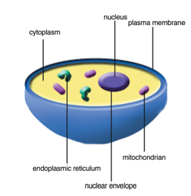
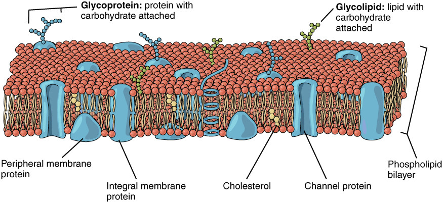

# سلول، غشا و کانال‌های یونی

علوم اعصاب محاسباتی، در بنیادِ خود، کوششی است برای توصیفِ ریاضیِ آنچه در یک نورون می‌گذرد. اما پیش از نوشتنِ هر معادله‌ای باید بدانیم آن معادله چه چیزی را مدل می‌کند. این نخستین فصل از بخشِ **بیوفیزیک نورون**، پایهٔ زیستی را می‌سازد: نورون چیست، غشای آن چگونه ساخته شده، و چرا این غشا می‌تواند بار الکتریکی را از دو سو جدا کند. فصل‌های بعدِ این بخش هر یک از این ایده‌ها را به یک مدلِ کمّیِ محاسباتی بدل می‌کنند — پتانسیلِ استراحت (نرنست و گلدمن)، غشای غیرفعال (مدارِ RC)، انتشارِ فضایی (نظریهٔ کابل)، و ورودیِ سیناپسی.

???+ tip "در پایانِ این فصل خواهید توانست"
    - اجزای اصلیِ یک سلول و به‌ویژه یک نورون را نام ببرید.
    - توضیح دهید چرا دولایهٔ فسفولیپیدی نسبت به یون‌ها نفوذناپذیر است و چگونه غشا به یک **عایقِ الکتریکی** بدل می‌شود.
    - کانال‌های یونی را بر پایهٔ سازوکارِ **دریچه‌گذاری** (gating) دسته‌بندی کنید.
    - سرچشمهٔ **گزینش‌گریِ** کانال‌ها را توضیح دهید و بگویید چرا یک کانالِ پتاسیمی، پتاسیم را بر سدیمِ کوچک‌تر ترجیح می‌دهد.

---

## ساختار سلول

سلول‌ها واحدهای بنیادینِ حیات‌اند. یک سلول از محلولِ آبیِ غلیظی از مواد شیمیایی تشکیل شده و می‌تواند با رشد و تقسیم خود را تکثیر کند. سلول‌هایی که هسته دارند **یوکاریوت** و آن‌ها که هسته ندارند **پروکاریوت** نامیده می‌شوند؛ حیوانات موجوداتی چندسلولی با سلول‌های یوکاریوتی‌اند. قطرِ یک سلولِ نوعی در حدودِ ۵ تا ۲۰ میکرومتر است. همهٔ سلول‌های یوکاریوت ساختارِ اساسیِ مشابهی دارند: یک **هسته** (که DNA در کروموزوم‌های آن بسته‌بندی شده)، شماری **اندامک** درونِ **سیتوپلاسم** (مانندِ میتوکندری که انرژی تولید می‌کند و شبکهٔ آندوپلاسمی)، و یک **غشای پلاسمایی** که سلول را از محیطِ بیرون جدا می‌کند.

*یک سلول با هسته و شماری اندامک.*

همین غشای پلاسمایی است که برای ما بیش از همه اهمیت دارد، چون همهٔ پدیده‌های الکتریکیِ نورون بر سطحِ آن رخ می‌دهند.

---

## سلول‌های عصبی

در بدنِ انسان سلول‌های متنوعی وجود دارند: سلول‌های ماهیچه‌ای، سلول‌های حسی، گلبول‌های خون، و **سلول‌های عصبی** یا **نورون‌ها**. وظیفهٔ بنیادیِ نورون‌ها **دریافت، هدایت و انتقالِ سیگنال** است: آن‌ها سیگنال‌ها را از اندام‌های حسی به سیستمِ عصبیِ مرکزی (مغز و نخاع) می‌برند، آنجا سیگنال‌ها تحلیل و تفسیر می‌شوند، و پاسخ دوباره به‌سوی ماهیچه‌ها و غدد فرستاده می‌شود.

نورون‌ها شکل‌ها و اندازه‌های گوناگون دارند، اما یک نورونِ نوعی از چهار بخش تشکیل شده است: **جسمِ سلولی** (سوما)، **دندریت‌ها** (که ورودی می‌گیرند)، **آکسون** (که خروجی را حمل می‌کند)، و **پایانه‌های پیش‌سیناپسی** (که سیگنال را به سلولِ بعدی می‌رسانند).

*یک سلولِ عصبی؛ جهتِ فلش‌ها جهتِ هدایتِ سیگنال را نشان می‌دهد.*

---

## غشای سلول و ساختارِ فسفولیپیدی

غشای پلاسمایی از یک **دولایهٔ لیپیدی** ساخته شده که در جای‌جای آن پروتئین نشسته است. سازندهٔ اصلیِ این دولایه، **فسفولیپید** است: مولکولی با یک **سرِ آب‌دوست** (قطبی) و دو **دمِ آب‌گریز** (ناقطبی). همین دوگانگی باعث می‌شود فسفولیپیدها در محیطِ آبی به‌طورِ خودبه‌خود به شکلِ یک دولایه سامان یابند — سرهای آب‌دوست رو به محلولِ آبیِ درون و بیرونِ سلول، و دم‌های آب‌گریز رو به یکدیگر در میانهٔ غشا.

*دولایهٔ فسفولیپیدی: سرهای آب‌دوست به‌سویِ آب و دم‌های آب‌گریز به‌سویِ یکدیگر.*

نتیجهٔ کلیدیِ این ساختار این است که میانهٔ آب‌گریزِ غشا برای یون‌ها و مولکول‌های آب‌دوست **تقریباً نفوذناپذیر** است. یک یون که با پوسته‌ای از مولکول‌های آب احاطه شده، نمی‌تواند به‌سادگی واردِ این ناحیهٔ چرب شود. همین نفوذناپذیری، پایهٔ **جداسازیِ الکتریکیِ** درونِ سلول از بیرون است: غشا مانندِ یک **عایق** میانِ دو محیطِ رسانا (محلول‌های یونیِ درون و بیرون) عمل می‌کند. در فصلِ [غشای غیرفعال](ch-biophysics-03-passive-rc.md) خواهیم دید که همین ویژگی، غشا را به یک **خازن** بدل می‌کند.

*دولایهٔ فسفولیپیدی همراه با پروتئین‌ها و دیگر مؤلفه‌های نشسته در آن.*

---

## کانال‌های یونی

اگر غشا نسبت به یون‌ها نفوذناپذیر است، پس یون‌ها چگونه از آن می‌گذرند؟ پاسخ، **کانال‌های یونی** است: گروهی از پروتئین‌های **تراغشایی** که مسیرهایی گزینشی برای عبورِ یون از عرضِ غشا می‌سازند. چون دولایهٔ لیپیدی به‌تنهایی نفوذناپذیر است، این کانال‌ها تنها مسیرِ عبورِ سریعِ یون‌اند. عبورِ یون از یک کانالِ باز یک فرایندِ **غیرفعال** است: یون‌ها در جهتِ شیبِ الکتروشیمیاییِ خود حرکت می‌کنند و هیچ انرژیِ متابولیکی مستقیماً مصرف نمی‌شود.

*نمایی از یک کانالِ یونی در غشای سلول.*

### دریچه‌گذاری: باز و بسته‌شدنِ کانال‌ها

بسیاری از کانال‌ها می‌توانند میانِ دو حالتِ **باز** و **بسته** جابه‌جا شوند؛ این فرایند را **دریچه‌گذاری** یا **گِیتینگ** (gating) می‌نامند. در حالتِ بسته، بخشی از زنجیرهٔ پروتئینی مانندِ دروازه‌ای مسیر را می‌بندد، و یک محرکِ مشخص با تغییرِ شکلِ (کنفورماسیونِ) پروتئین آن را می‌گشاید. کانال‌ها را بر پایهٔ نوعِ این محرک دسته‌بندی می‌کنند:

- **کانال‌های وابسته به ولتاژ:** با اختلافِ پتانسیلِ دو سوی غشا باز و بسته می‌شوند. این کانال‌ها در تولید و انتشارِ پتانسیلِ عمل نقشِ کلیدی دارند و در فصلِ [پتانسیل عمل](ch-biophysics-06-action-potential.md) و سپس در مدلِ [هاجکین–هاکسلی](https://computational-neuroscience.ir/ch03/) با جزئیات بررسی می‌شوند.
- **کانال‌های وابسته به لیگاند:** با اتصالِ یک مولکولِ خاص (لیگاند) مانندِ یک ناقلِ عصبی باز می‌شوند و پایهٔ [انتقالِ سیناپسیِ شیمیایی](ch-biophysics-05-synapses.md) هستند.
- **کانال‌های مکانیکی:** با کشش یا فشارِ مکانیکیِ غشا باز می‌شوند و در حسِ لامسه، شنوایی و تعادل دخیل‌اند.

افزون بر این کانال‌های دریچه‌دار، دسته‌ای به نامِ **کانال‌های نشتی** (leak) عملاً همیشه بازند و عبورِ پیوستهٔ مقدارِ کمی یون (به‌ویژه پتاسیم) را در حالتِ استراحت ممکن می‌سازند. همان‌طور که در فصلِ بعد خواهیم دید، همین کانال‌های نشتی نقشِ تعیین‌کننده‌ای در شکل‌گیریِ **پتانسیلِ استراحت** دارند.

### گزینش‌گری: چرا پتاسیم و نه سدیم؟

ویژگیِ برجستهٔ بسیاری از کانال‌ها **گزینش‌گریِ** بالای آن‌هاست: یک کانالِ پتاسیمی می‌تواند یونِ پتاسیم (\(\text{K}^+\)) را با سرعتِ بسیار بالا عبور دهد، اما عبورِ یونِ سدیم (\(\text{Na}^+\)) را تا حدودِ **هزار برابر** بیشتر سد می‌کند — با آنکه سدیم کوچک‌تر است. این رفتار در نگاهِ نخست متناقض می‌نماید.

توضیح در ساختارِ بخشی از کانال به نامِ **فیلترِ گزینش‌گر** نهفته است. هر یون در محلولِ آبی با پوسته‌ای از مولکول‌های آب احاطه (هیدراته) شده است، و برای عبور باید این پوسته را از دست بدهد که مستلزمِ صرفِ انرژی است. در فیلترِ کانالِ پتاسیمی، اتم‌های اکسیژنِ کربونیلِ زنجیرهٔ پروتئینی چنان آرایش یافته‌اند که فاصله‌شان دقیقاً با اندازهٔ یونِ پتاسیمِ بدونِ آب جور است؛ پس این اکسیژن‌ها جایِ مولکول‌های آب را می‌گیرند و هزینهٔ آب‌زداییِ پتاسیم را جبران می‌کنند. یونِ سدیمِ کوچک‌تر در همان آرایش نمی‌تواند به‌خوبی با اکسیژن‌ها تماس بگیرد، پس هزینهٔ آب‌زدایی‌اش جبران نمی‌شود و عبورش پرهزینه و کند می‌ماند. به این ترتیب گزینش‌گری نه بر پایهٔ اندازهٔ منفذ، بلکه بر پایهٔ **توازنِ دقیقِ انرژی** میانِ آب‌زدایی و برهم‌کنشِ یون با دیوارهٔ فیلتر استوار است.

---

## از زیست‌شناسی به مدل

اکنون قطعاتِ اصلی را در دست داریم: یک غشای عایق که درون را از بیرون جدا می‌کند، و کانال‌هایی که مسیرهای گزینشیِ عبورِ یون‌اند. در فصلِ بعد، نخستین پرسشِ کمّی را می‌پرسیم: اگر غلظتِ یون‌ها در دو سوی غشا متفاوت باشد و غشا تنها نسبت به برخی از آن‌ها نفوذپذیر باشد، **چه اختلافِ پتانسیلی** پدید می‌آید؟ پاسخ، پتانسیلِ استراحت است، و ابزارِ آن **معادلهٔ نرنست** و **معادلهٔ گلدمن**.

!!! example "تمرین‌ها"
    ۱. **نفوذناپذیری.** به‌زبانِ خودتان توضیح دهید چرا یک یونِ باردار به‌سختی از میانهٔ دولایهٔ لیپیدی می‌گذرد، حال آنکه یک مولکولِ کوچکِ ناقطبی (مانندِ \(\text{O}_2\)) به‌آسانی عبور می‌کند.

    ۲. **دریچه‌گذاری.** برای هر یک از سه نوع کانالِ دریچه‌دار (وابسته به ولتاژ، لیگاند، مکانیکی) یک مثالِ زیستی بیاورید که در آن آن نوع کانال نقشِ اصلی را دارد.

    ۳. **گزینش‌گری.** اگر گزینش‌گری تنها بر پایهٔ اندازهٔ منفذ بود، انتظار داشتیم کدام یون (سدیم یا پتاسیم) راحت‌تر عبور کند؟ چرا مشاهدهٔ واقعی برعکسِ این است، و این دربارهٔ سازوکارِ فیلترِ گزینش‌گر چه می‌گوید؟
