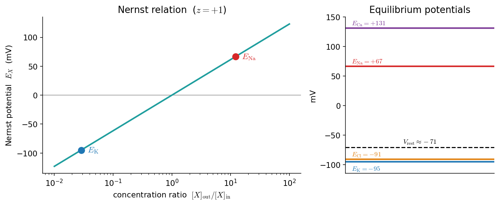
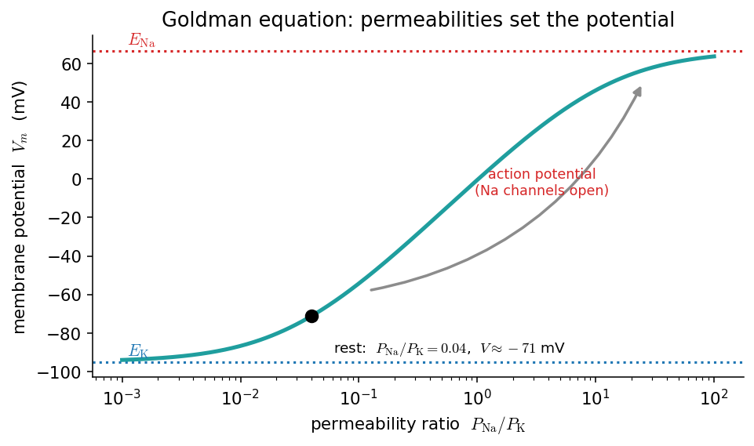
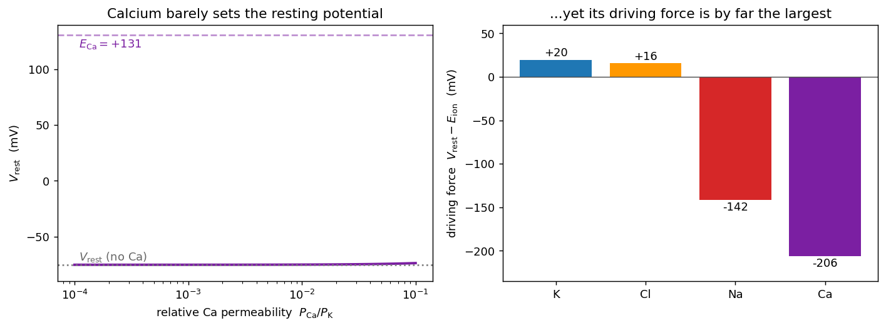

# پتانسیل استراحت: نرنست و گلدمن

در فصلِ پیش دیدیم که غشا یک عایق است و کانال‌ها مسیرهای گزینشیِ عبورِ یون‌اند. اکنون نخستین پرسشِ کمّیِ بیوفیزیکِ نورون را می‌پرسیم: اگر غلظتِ یون‌ها در دو سوی غشا متفاوت باشد و غشا تنها نسبت به برخی از آن‌ها نفوذپذیر باشد، **چه اختلافِ پتانسیلی** پدید می‌آید؟ پاسخ، **پتانسیلِ استراحت** است، و دو ابزارِ محاسبهٔ آن **معادلهٔ نرنست** و **معادلهٔ گلدمن** هستند.

???+ tip "در پایانِ این فصل خواهید توانست"
    - **پتانسیلِ تعادلِ** یک یون را با **معادلهٔ نرنست** (Nernst) محاسبه کنید و اشتقاقِ آن را دنبال کنید.
    - **پتانسیلِ استراحتِ** غشا را با **معادلهٔ گلدمن** (Goldman) از روی غلظت‌ها و نفوذپذیری‌ها به‌دست آورید.
    - با کد، ببینید چگونه پتانسیل با تغییرِ غلظت یا نفوذپذیری جابه‌جا می‌شود — و چرا همین جابه‌جایی، بذرِ پتانسیلِ عمل است.
    - دریابید چرا **کلسیم** در معادلهٔ بستهٔ گلدمن نمی‌گنجد و پتانسیلِ استراحت را با **حلِ عددیِ** معادلهٔ جریانِ GHK به‌دست آورید.
    - با **باغ‌وحشِ کانال‌های یونی** آشنا شوید و ببینید چگونه ترکیبِ کانال‌ها دینامیکِ نورون را کوک می‌کند.

---

## ترکیبِ یونیِ دو سوی غشا

نیروی محرکهٔ همهٔ پدیده‌های الکتریکیِ نورون، **تفاوتِ غلظتِ یون‌ها** در دو سوی غشاست. به‌طورِ کلی پتاسیم در درونِ سلول بسیار پرغلظت‌تر از بیرون است، و سدیم، کلر و کلسیم در بیرون پرغلظت‌ترند. این عدمِ تعادل را **پمپِ سدیم–پتاسیم** با مصرفِ ATP پیوسته برقرار نگه می‌دارد (پایانِ همین فصل). جدولِ زیر مقادیرِ نمونه‌وار را برای یک نورونِ پستانداران (بر حسبِ میلی‌مولار) می‌دهد:

| یون | بیرون (mM) | درون (mM) | ظرفیت \(z\) |
|---|---|---|---|
| پتاسیم \(\text{K}^+\) | ۴ | ۱۴۰ | ‎+۱ |
| سدیم \(\text{Na}^+\) | ۱۴۵ | ۱۲ | ‎+۱ |
| کلر \(\text{Cl}^-\) | ۱۲۰ | ۴ | ‎−۱ |
| کلسیم \(\text{Ca}^{2+}\) | ۱٫۸ | ۱۰⁻⁴ | ‎+۲ |

قرارداد این است که پتانسیلِ غشا را **درون منهای بیرون** تعریف کنیم: \(V_m = \phi_{\text{in}} - \phi_{\text{out}}\). با این قرارداد، پتانسیلِ استراحتِ نوعیِ یک نورون حدودِ ۷۰− میلی‌ولت است (درون نسبت به بیرون منفی).

---

## معادلهٔ نرنست

**معادلهٔ نرنست** پتانسیلِ **تعادلِ** یک یونِ منفرد را می‌دهد: همان پتانسیلِ غشایی که در آن شارِ خالصِ آن یون صفر می‌شود. برای یونِ \(X\) با ظرفیتِ \(z\):

\[
E_X = \frac{RT}{zF}\,\ln\frac{[X]_{\text{out}}}{[X]_{\text{in}}}
\]

که در آن \(R\) ثابتِ جهانیِ گازها، \(T\) دمای مطلق (کلوین)، \(F\) ثابتِ فارادی، و \(z\) ظرفیتِ یون است.

### اشتقاق

دو نیرو بر یونِ درونِ غشا وارد می‌شود: **انتشار** که یون را از غلظتِ زیاد به کم می‌راند، و **رانشِ الکتریکی** ناشی از میدانِ اختلافِ پتانسیل. شارِ مولیِ یون، مجموعِ این دو است — همان معادلهٔ **نرنست–پلانک**:

\[
J = -D\left(\frac{dc}{dx} + \frac{zF}{RT}\,c\,\frac{d\phi}{dx}\right).
\]

در **تعادل** شارِ خالص صفر است (\(J=0\))، پس \( \frac{dc}{dx} = -\frac{zF}{RT}\,c\,\frac{d\phi}{dx}\). با جداسازیِ متغیرها و انتگرال‌گیری از درون تا بیرون:

\[
\int_{\text{in}}^{\text{out}}\frac{dc}{c} = -\frac{zF}{RT}\int_{\text{in}}^{\text{out}} d\phi
\;\Longrightarrow\;
\ln\frac{c_{\text{out}}}{c_{\text{in}}} = \frac{zF}{RT}\,(\phi_{\text{in}}-\phi_{\text{out}}),
\]

و چون در تعادل \(\phi_{\text{in}}-\phi_{\text{out}} = E_X\)، با مرتب‌کردن به معادلهٔ نرنست می‌رسیم.

### شکلِ کاربردی و محاسبهٔ عددی

در دمای بدن (\(T=310\,\mathrm{K}\)) و با تبدیلِ لگاریتمِ طبیعی به پایهٔ ۱۰، ضریبِ \(\frac{RT}{F}\ln 10\) تقریباً **۶۱٫۵ میلی‌ولت** می‌شود:

\[
E_X \approx \frac{61.5}{z}\,\log_{10}\frac{[X]_{\text{out}}}{[X]_{\text{in}}}\quad(\text{mV}).
\]

چند خط کد، پتانسیلِ تعادلِ همهٔ یون‌ها را یک‌جا می‌دهد:

```python
import numpy as np

R, F, T = 8.314, 96485.0, 310.0          # J/mol/K , C/mol , K (body temperature)
RT_F = R * T / F * 1e3                    # mV   (≈ 26.7)

# ion : (outside, inside, valence z)   concentrations in mM
ions = {"K":  (4,   140,  +1),
        "Na": (145, 12,   +1),
        "Cl": (120, 4,    -1),
        "Ca": (1.8, 1e-4, +2)}

def nernst(out, inn, z):
    """Equilibrium (Nernst) potential in mV."""
    return (RT_F / z) * np.log(out / inn)

for ion, (o, i, z) in ions.items():
    print(f"E_{ion:2s} = {nernst(o, i, z):+6.1f} mV")
# E_K  = -95.0 mV   E_Na = +66.6 mV   E_Cl = -90.9 mV   E_Ca = +130.9 mV
```

شکلِ زیر همین را تصویر می‌کند: سمتِ چپ، رابطهٔ خطیِ \(E_X\) با لگاریتمِ نسبتِ غلظت (شیبِ ۶۱٫۵ میلی‌ولت به‌ازای هر دهه)، و سمتِ راست، «چشم‌اندازِ» پتانسیل‌های تعادل در کنارِ پتانسیلِ استراحت.



*چپ: پتانسیلِ نرنست بر حسبِ نسبتِ غلظتِ \([X]_{\text{out}}/[X]_{\text{in}}\) برای \(z=+1\)؛ نقطهٔ آبی پتاسیم و نقطهٔ قرمز سدیم است. راست: پتانسیل‌های تعادلِ چهار یونِ اصلی و پتانسیلِ استراحت (خط‌چین). توجه کنید که \(V_{\text{rest}}\approx-71\) بسیار به \(E_{\text{K}}\) نزدیک است — چون غشا در استراحت عمدتاً به پتاسیم نفوذپذیر است.*

نکتهٔ کلیدی همین نزدیکیِ \(V_{\text{rest}}\) به \(E_{\text{K}}\) است. اگر غشا **فقط** به پتاسیم نفوذپذیر بود، پتانسیلِ استراحت دقیقاً \(E_{\text{K}}=-95\) می‌شد. اینکه مقدارِ واقعی کمی مثبت‌تر (حدودِ ۷۰−) است، نشان می‌دهد که یون‌های دیگر — به‌ویژه سدیم — هم سهمی دارند. برای در نظر گرفتنِ همهٔ آن‌ها به معادلهٔ گلدمن نیاز داریم.

---

## معادلهٔ گلدمن

معادلهٔ نرنست تنها برای **یک یون در تعادلِ خودش** معتبر است. اما غشای واقعی هم‌زمان به چند یون نفوذپذیر است و پتانسیلِ استراحت حاصلِ سهمِ همهٔ آن‌هاست. **معادلهٔ گلدمن–هاجکین–کاتز** (Goldman–Hodgkin–Katz) پتانسیلی را می‌دهد که در آن شارِ خالصِ **کلِ بار** صفر است:

\[
V_m = \frac{RT}{F}\,\ln\frac{P_{\text{K}}[\text{K}^+]_{\text{out}} + P_{\text{Na}}[\text{Na}^+]_{\text{out}} + P_{\text{Cl}}[\text{Cl}^-]_{\text{in}}}{P_{\text{K}}[\text{K}^+]_{\text{in}} + P_{\text{Na}}[\text{Na}^+]_{\text{in}} + P_{\text{Cl}}[\text{Cl}^-]_{\text{out}}},
\]

که در آن \(P_X\) نفوذپذیریِ نسبیِ غشا نسبت به یونِ \(X\) است. توجه کنید که برای کلر، جای غلظتِ درون و بیرون جابه‌جا شده — این به‌سببِ بارِ منفیِ کلر (\(z=-1\)) است.

```python
def goldman(P, ions):
    """GHK membrane potential in mV. P = dict of relative permeabilities.
    Cations use out/in; the anion Cl uses in/out (its sign flips the ratio)."""
    Ko, Ki = ions["K"][:2];  Nao, Nai = ions["Na"][:2];  Clo, Cli = ions["Cl"][:2]
    num = P["K"]*Ko + P["Na"]*Nao + P["Cl"]*Cli
    den = P["K"]*Ki + P["Na"]*Nai + P["Cl"]*Clo
    return RT_F * np.log(num / den)

P_rest = {"K": 1.0, "Na": 0.04, "Cl": 0.45}     # resting permeabilities
print(f"V_rest = {goldman(P_rest, ions):+.1f} mV")     # ≈ -75 mV

P_spike = {"K": 1.0, "Na": 20.0, "Cl": 0.45}    # Na channels wide open
print(f"V_peak = {goldman(P_spike, ions):+.1f} mV")    # ≈ +51 mV  (toward E_Na)
```

سه نکتهٔ کلیدی:

- اگر غشا تنها به یک یون نفوذپذیر باشد (بقیهٔ \(P\)ها صفر)، معادلهٔ گلدمن دقیقاً به **معادلهٔ نرنستِ** همان یون فرومی‌کاهد. پس گلدمن، تعمیمِ نرنست برای چند یون است.
- وزنِ هر یون با نفوذپذیریِ آن متناسب است. در استراحت \(P_{\text{K}} \gg P_{\text{Na}}\) (نسبتِ نوعیِ \(P_{\text{K}} : P_{\text{Na}} : P_{\text{Cl}} \approx 1 : 0.04 : 0.45\))، پس \(V_m\) نزدیکِ \(E_{\text{K}}\) می‌ماند.
- برخلافِ نرنست، گلدمن یک **حالتِ پایای دینامیکی** را توصیف می‌کند (نه یک تعادلِ ترمودینامیکی)؛ پمپ‌های فعال، انرژیِ لازم برای نگه‌داشتنِ آن را تأمین می‌کنند.

### چرا این معادله بذرِ پتانسیلِ عمل است

قدرتِ واقعیِ معادلهٔ گلدمن وقتی آشکار می‌شود که نفوذپذیری‌ها را **متغیر** بگیریم. شکلِ زیر \(V_m\) را بر حسبِ نسبتِ \(P_{\text{Na}}/P_{\text{K}}\) رسم می‌کند (با \(P_{\text{Cl}}=0\) تا برهم‌کنشِ سدیم–پتاسیم خالص دیده شود):



*پتانسیلِ غشا از معادلهٔ گلدمن بر حسبِ نسبتِ نفوذپذیریِ \(P_{\text{Na}}/P_{\text{K}}\). وقتی این نسبت کوچک است (استراحت، نقطهٔ سیاه)، \(V_m\) نزدیکِ \(E_{\text{K}}\) است. اگر کانال‌های سدیمی باز شوند و نسبت بزرگ شود، \(V_m\) به‌سرعت به‌سویِ \(E_{\text{Na}}\) بالا می‌رود — درست همان چیزی که در قلهٔ پتانسیلِ عمل رخ می‌دهد.*

پس کلِ داستانِ پتانسیلِ عمل را می‌توان چنین خلاصه کرد: نورون در استراحت روی شاخهٔ پایینِ این منحنی (نزدیکِ \(E_{\text{K}}\)) می‌نشیند؛ باز شدنِ ناگهانیِ کانال‌های سدیمیِ وابسته به ولتاژ نسبتِ \(P_{\text{Na}}/P_{\text{K}}\) را بالا می‌برد و دستگاه را به شاخهٔ بالا (نزدیکِ \(E_{\text{Na}}\)) پرتاب می‌کند. این را در فصلِ [پتانسیل عمل](ch-biophysics-06-action-potential.md) به‌صورتِ کیفی و در مدلِ [هاجکین–هاکسلی](https://computational-neuroscience.ir/ch03/) به‌صورتِ کمّی خواهیم دید.

---

## کلسیم و مرزهای معادلهٔ گلدمن

در جدولِ آغازِ فصل، **کلسیم** \(\text{Ca}^{2+}\) را هم آوردیم، اما در معادلهٔ گلدمن آن را کنار گذاشتیم. چرا؟ پاسخ، هم زیستی و هم **ریاضی** است.

نکتهٔ ریاضی ظریف و آموزنده است: شکلِ زیبای لگاریتمیِ معادلهٔ گلدمن تنها وقتی به‌دست می‌آید که همهٔ یون‌های نفوذپذیر **یک‌ظرفیتی** باشند (\(|z|=1\)). اشتقاقِ گلدمن بر پایهٔ **فرضِ میدانِ ثابت** است: شارِ هر یون از غشا با **معادلهٔ جریانِ گلدمن–هاجکین–کاتز** توصیف می‌شود،

\[
I_S \;=\; P_S\,z_S^{2}\,\frac{F^2 V_m}{RT}\,
\frac{[S]_{\text{in}} - [S]_{\text{out}}\,e^{-z_S F V_m/RT}}{1 - e^{-z_S F V_m/RT}} .
\]

وقتی همهٔ یون‌ها یک‌ظرفیتی‌اند، در شرطِ صفرشدنِ جریانِ کل (\(\sum_S I_S = 0\)) نماها همگی به‌صورتِ \(e^{-FV/RT}\) ظاهر می‌شوند، تجزیه می‌شوند و می‌توان \(V_m\) را به‌صورتِ **بسته** بیرون کشید — همان لگاریتمِ گلدمن. اما کلسیم با \(z=2\) واردِ معادله می‌شود و نمای \(e^{-2FV/RT}\) می‌آورد. اکنون شرطِ صفرشدنِ جریان، دو نمای متفاوت (\(e^{-FV/RT}\) و \(e^{-2FV/RT}\)) را با هم دارد و دیگر **جوابِ بستهٔ لگاریتمی ندارد**. چاره، برگشت به تعریفِ بنیادی است: پتانسیلِ استراحت، **ریشهٔ** معادلهٔ \(\sum_S I_S(V)=0\) است و آن را **عددی** پیدا می‌کنیم — دقیقاً همان‌جا که یک ابزارِ ساده مانندِ **دوبخشی** (bisection) از فصلِ ریشه‌یابی به کار می‌آید.

```python
# GHK *current* for one ion (constant-field flux; the common factor F is dropped).
# For monovalent ions the zero-current condition has the closed-form Goldman
# solution; a divalent ion (Ca, z = 2) breaks that closed form -> solve numerically.
def ghk_current(V, P, z, o, i):
    u = z * V / RT_F                        # dimensionless   z F V / RT
    if abs(u) < 1e-9:                        # u -> 0 limit
        return P * z * (i - o)
    return P * z * u * (i - o*np.exp(-u)) / (1 - np.exp(-u))

def v_rest_numeric(P):
    """Resting potential as the root of the total GHK current, by bisection."""
    total = lambda V: sum(ghk_current(V, P[k], ions[k][2], ions[k][0], ions[k][1])
                          for k in P)
    lo, hi = -150.0, 100.0                   # V_rest is bracketed in this range
    for _ in range(60):
        mid = 0.5 * (lo + hi)
        if total(lo) * total(mid) <= 0: hi = mid
        else:                           lo = mid
    return 0.5 * (lo + hi)

P_noca = {"K": 1.0, "Na": 0.04, "Cl": 0.45}
P_ca   = {**P_noca, "Ca": 0.01}              # add a small calcium permeability

print(f"V_rest (no Ca) = {v_rest_numeric(P_noca):+.1f} mV")   # -75.3 : matches Goldman
print(f"V_rest (+Ca)   = {v_rest_numeric(P_ca):+.1f} mV")     # -75.2 : barely moves
print(f"E_Ca           = {nernst(*ions['Ca']):+.1f} mV")      # +130.9
```

دو درسِ مهم در این خروجی نهفته است:

- **اعتبارسنجی:** وقتی کلسیم را خاموش می‌کنیم (\(P_{\text{Ca}}=0\))، ریشه‌یابِ عددی **دقیقاً** همان مقداری را می‌دهد که معادلهٔ بستهٔ گلدمنِ بخشِ پیش داد (‎۷۵٫۳−). این یعنی کدِ عددیِ ما درست است و گلدمن، حالتِ خاصِ یک‌ظرفیتیِ همین معادلهٔ کلی‌تر است.
- **کلسیم پتانسیلِ استراحت را تعیین نمی‌کند:** چون نفوذپذیریِ کلسیم در استراحت بسیار کوچک است، افزودنِ آن \(V_m\) را تنها کسری از میلی‌ولت جابه‌جا می‌کند — حتی اگر آن را صد برابر کنیم.



*چپ: پتانسیلِ استراحت بر حسبِ نفوذپذیریِ نسبیِ کلسیم \(P_{\text{Ca}}/P_{\text{K}}\)؛ در سه دهه تغییرِ نفوذپذیری، \(V_m\) عملاً ثابت و نزدیکِ ‎۷۵− می‌ماند و بسیار پایین‌تر از \(E_{\text{Ca}}=+131\) است. راست: **نیروی رانشِ** \((V_{\text{rest}}-E_{\text{ion}})\) برای هر یون در استراحت؛ کلسیم با اختلافِ زیاد بزرگ‌ترین نیروی رانش (حدودِ ‎۲۰۶− میلی‌ولت) را دارد.*

اینجا پارادوکسِ ظاهری حل می‌شود: کلسیم در استراحت تقریباً هیچ سهمی در **تعیینِ ولتاژ** ندارد، اما **نیروی رانشِ** آن از هر یونِ دیگری بزرگ‌تر است (نمودارِ راست). به این دلیل که \(E_{\text{Ca}}\) بسیار مثبت است و غلظتِ درونیِ کلسیم بسیار ناچیز (حدودِ \(10^{-4}\) میلی‌مولار، یعنی شیبی ده‌هزاربرابری). پس هر بار که کانالی کلسیمی باز شود، سیلی از کلسیم به درون می‌ریزد و غلظتِ درونیِ آن را **به‌نسبت** بسیار تغییر می‌دهد. به همین سبب، نقشِ اصلیِ کلسیم نه **الکتریکی** (تنظیمِ ولتاژ) بلکه **پیام‌رسانی** است: کلسیمِ ورودی به‌مثابهٔ یک **پیام‌رسانِ ثانویه** آبشاری از رخدادهای درون‌سلولی — از رهاسازیِ ناقلِ عصبی تا انعطاف‌پذیریِ سیناپسی — را به راه می‌اندازد. این درست همان چیزی است که ما را از دنیای سادهٔ سه‌یونیِ گلدمن به دنیای بسیار غنی‌ترِ کانال‌های یونی می‌برد.

---

## باغ‌وحشِ کانال‌های یونی

تا اینجا با چهار یون (K، Na، Cl، Ca) و یکی‌دو نوع کانال (نشتی و وابسته به ولتاژ) کار کردیم. اما نورونِ واقعی بسیار پیچیده‌تر است: **حدودِ ۲۰۰ نوع کانالِ یونی** شناخته شده و بسیاری از آن‌ها به‌صورتِ ژنتیکی شناسایی شده‌اند. گرستنر و همکاران این تنوعِ چشمگیر را به‌شوخی **«باغ‌وحشِ کانال‌های یونی»** (the zoo of ion channels) می‌نامند. کانال‌ها را می‌توان از چند زاویه دسته‌بندی کرد: بر پایهٔ **هویتِ ژنتیکی** (مثلاً \(\text{Na}_v1.1\)، \(\text{K}_v\))، **گزینشِ یونی** (سدیم، پتاسیم، کلسیم)، **وابستگی به ولتاژ**، **حساسیت به پیام‌رسانِ ثانویه** (مثلاً کلسیم)، و **نقشِ عملکردی**.

چند نمونه که هرکدام رفتاری کیفیتاً متفاوت به نورون می‌دهند:

- **جریانِ \(I_M\) (پتاسیمیِ کند):** با غیرفعال‌شدنِ آهسته در ده‌ها میلی‌ثانیه، **تطبیقِ بسامدِ شلیک** (spike-frequency adaptation) می‌سازد — نورون در پاسخ به محرکِ ثابت، رفته‌رفته کندتر شلیک می‌کند.
- **جریانِ \(I_A\) (پتاسیمیِ گذرا):** یک بی‌پاسخیِ کوتاهِ نیرومند ایجاد می‌کند و فاصلهٔ میانِ اسپایک‌ها را تنظیم می‌کند.
- **کانالِ پتاسیمیِ وابسته به کلسیم \(I_{K(\text{Ca})}\):** پلی است میانِ دو جهان — کلسیمی که در هر اسپایک وارد می‌شود این کانال را می‌گشاید و به‌طورِ **غیرمستقیم** تطبیق می‌سازد. اینجا دقیقاً همان نقشِ **پیام‌رسانیِ** کلسیم است که در بخشِ پیش دیدیم.
- **کانالِ کلسیمیِ آستانه‌پایین \(I_T\):** در استراحت غیرفعال است و تنها پس از یک **فروقطبش** آزاد می‌شود؛ همین، پدیدهٔ **بازگشتِ پس‌ازمهاری** (postinhibitory rebound) و شلیکِ انفجاری را ممکن می‌کند.
- **جریانِ \(I_h\) (فعال‌شونده با فروقطبش):** به نوسان‌ها و ریتم‌سازیِ نورون کمک می‌کند.

نکتهٔ ژرف این است که **ترکیبِ کانال‌ها، دینامیکِ نورون را کوک می‌کند**. تغییری کوچک در سینتیکِ یک کانال می‌تواند رفتارِ نورون را کیفیتاً دگرگون کند؛ برای نمونه، جابه‌جاییِ منحنیِ غیرفعال‌شدنِ کانالِ سدیمی به‌اندازهٔ ۲۰ میلی‌ولت، یک نورون را از **تحریک‌پذیریِ نوعِ ۲** به **نوعِ ۱** می‌برد — همان تمایزی که در فصلِ [تحریک‌پذیری](https://computational-neuroscience.ir/ch-dynamical-systems/ch-dynamics-07-neuro-excitability/) با زبانِ سیستم‌های دینامیکی دیدیم. نورون حتی می‌تواند با تغییرِ **بیانِ ژنی**، ترکیبِ کانال‌هایش و در نتیجه رفتارِ الکتریکی‌اش را در طولِ رشد و در پاسخ به تجربه بازتنظیم کند.

برای ما این «باغ‌وحش» دو پیام دارد. نخست، مدلی که در فصل‌های بعد می‌سازیم — [هاجکین–هاکسلی](https://computational-neuroscience.ir/ch03/) با تنها دو کانالِ فعال (سدیم و پتاسیم) — کمینه‌ترین مدلِ ممکن است؛ کارِ آن، **گرفتنِ جوهرِ** پتانسیلِ عمل است، نه بازتولیدِ همهٔ تنوعِ زیستی. دوم، همان **معماریِ محاسباتی** — معادلهٔ موازنهٔ جریان به‌علاوهٔ یک جریان به‌ازای هر کانال — به ما اجازه می‌دهد هر عضوِ این باغ‌وحش را که خواستیم به مدل بیفزاییم. زبانِ ریاضیِ همه‌شان یکی است؛ تنها توصیفِ رسانایی عوض می‌شود.

!!! quote "برای مطالعهٔ بیشتر"
    بحثِ کامل‌ترِ «باغ‌وحشِ کانال‌های یونی» را در کتابِ *Neuronal Dynamics* گرستنر و همکاران می‌توانید ببینید: [بخشِ ۲٫۳](https://neuronaldynamics.epfl.ch/online/Ch2.S3.html).

---

## پمپِ سدیم–پتاسیم

نشتِ پیوستهٔ پتاسیم به بیرون و سدیم به درون، در درازمدت شیب‌های غلظتی را از میان می‌برد. **پمپِ سدیم–پتاسیم** با مصرفِ ATP و جابه‌جاییِ **سه** یونِ سدیم به بیرون در ازای **دو** یونِ پتاسیم به درون، این شیب‌ها را پیوسته بازسازی می‌کند. چون در هر چرخه یک بارِ مثبتِ خالص به بیرون می‌برد، خود پمپ نیز اندکی به منفی‌ماندنِ درونِ سلول کمک می‌کند (پمپِ **الکتروژنیک**). بدونِ این پمپ، پتانسیلِ استراحت در عرضِ دقایقی فرومی‌پاشید.

---

## تمرین‌ها

این‌ها مسئله‌های «فکرکردن مثلِ یک مدل‌ساز»اند، نه پرسش‌های حفظی. پیش از باز کردنِ پاسخ، خودتان روی کاغذ یا با کدِ همین فصل امتحان کنید؛ پاسخ‌ها راهِ رسیدن به جواب و کدِ لازم را نشان می‌دهند.

**۱. دمای اتاق.** ضریبِ \(\frac{RT}{F}\ln 10\) را برای دمای اتاق (\(T=293\,\mathrm{K}\)) دوباره حساب کنید. پتانسیل‌های تعادل چقدر تغییر می‌کنند؟

??? success "پاسخ"
    ضریب با دما **خطی** است، پس کافی است \(T\) را عوض کنیم:

    ```python
    RTF = lambda T: 8.314*T/96485*1e3      # mV
    print(RTF(310)*np.log(10), RTF(293)*np.log(10))   # 61.5 , 58.1
    ```

    ضریب از **۶۱٫۵** به **۵۸٫۱** میلی‌ولت افت می‌کند (نسبتِ \(293/310\approx0.945\)). چون هر پتانسیلِ نرنست متناسب با همین ضریب است، همهٔ \(E\)ها حدودِ **۵٪ کوچک‌تر** (به استراحت نزدیک‌تر) می‌شوند؛ مثلاً \(E_{\text{K}}\) از \(-95\) به حدودِ \(-90\) میلی‌ولت می‌رود. درسِ مدل‌سازی: دمای بدن را نمی‌توان با دمای اتاق اشتباه گرفت — این خطا چند میلی‌ولت جابه‌جایی می‌سازد.

**۲. پتاسیمِ خارجی.** فرض کنید غلظتِ پتاسیمِ بیرونی از ۴ به ۸ میلی‌مولار برسد (مثلاً در آسیبِ بافتی). \(E_{\text{K}}\) و — با کدِ گلدمن — \(V_{\text{rest}}\) را دوباره حساب کنید. چرا افزایشِ پتاسیمِ خارجی، غشا را **دپلاریزه** می‌کند؟

??? success "پاسخ"
    ```python
    print(nernst(8, 140, +1))                 # E_K: -95 -> -76.5 mV
    ions2 = {**ions, "K": (8, 140, +1)}
    print(goldman({"K":1,"Na":0.04,"Cl":0.45}, ions2))   # V_rest: -75 -> -67 mV
    ```

    دوبرابرکردنِ \([\text{K}^+]_{\text{out}}\) شیبِ غلظتیِ پتاسیم را **کم** می‌کند، پس \(E_{\text{K}}\) از \(-95\) به \(-76\) میلی‌ولت بالا می‌آید. چون در استراحت \(V_m\) عمدتاً پتاسیم را دنبال می‌کند، \(V_{\text{rest}}\) هم حدودِ ۸ میلی‌ولت **دپلاریزه** می‌شود (\(-75\to-67\)). همین است که چرا **هایپرکالمی** (پتاسیمِ بالای خون) خطرناک است و می‌تواند تحریک‌پذیریِ سلول‌های قلبی و عصبی را برهم بزند.

**۳. حدِ گلدمن.** به‌صورتِ عددی نشان دهید که وقتی \(P_{\text{Na}}=P_{\text{Cl}}=0\)، خروجیِ `goldman` دقیقاً برابرِ `nernst` برای پتاسیم می‌شود.

??? success "پاسخ"
    ```python
    print(goldman({"K":1.0, "Na":0.0, "Cl":0.0}, ions))   # -95.0
    print(nernst(4, 140, +1))                              # -95.0
    ```

    وقتی تنها یک یون نفوذپذیر است، صورت و مخرجِ کسرِ گلدمن به \([\text{K}]_{\text{out}}\) و \([\text{K}]_{\text{in}}\) فرومی‌کاهند و عبارت **دقیقاً** به معادلهٔ نرنست تبدیل می‌شود. این یک **آزمونِ سلامتِ** خوب برای هر پیاده‌سازیِ گلدمن است: همیشه باید در این حدِ خاص به نرنست برگردد.

**۴. منحنیِ گلدمن.** شکلِ \(V_m\) بر حسبِ \(P_{\text{Na}}/P_{\text{K}}\) را بازتولید کنید. نسبتی را بیابید که در آن \(V_m=0\) می‌شود. این نسبت چه معنای زیستی‌ای دارد؟

??? success "پاسخ"
    ```python
    r = np.logspace(-3, 2, 200)
    Vm = [goldman({"K":1.0, "Na":ri, "Cl":0.0}, ions) for ri in r]
    # V_m = 0 near P_Na/P_K ~ 1.0 :
    from scipy.optimize import brentq
    root = brentq(lambda ri: goldman({"K":1.0,"Na":ri,"Cl":0.0}, ions), 0.1, 10)
    print(round(root, 2))     # ~1.02
    ```

    \(V_m\) وقتی صفر می‌شود که نفوذپذیریِ سدیم و پتاسیم تقریباً **برابر** شوند (\(P_{\text{Na}}/P_{\text{K}}\approx1\)). این همان چیزی است که نزدیکِ **قلهٔ پتانسیلِ عمل** رخ می‌دهد: باز شدنِ انبوهِ کانال‌های سدیمی نسبت را از \(\sim0.04\) به مقادیرِ بزرگ می‌رساند و \(V_m\) را از نزدیکِ \(E_{\text{K}}\) به سمتِ صفر و بالاتر پرتاب می‌کند.

**۵. کلسیم و گلدمن.** با تابعِ `v_rest_numeric`، نشان دهید که با \(P_{\text{Ca}}=0\) خروجی دقیقاً با معادلهٔ بستهٔ `goldman` یکی می‌شود. سپس \(P_{\text{Ca}}\) را از صفر تا \(0.1\) جارو کنید و منحنیِ \(V_{\text{rest}}\) بر حسبِ \(P_{\text{Ca}}\) را رسم کنید (نمودارِ چپِ شکلِ کلسیم را بازتولید کنید). چرا این منحنی این‌قدر مسطح است؟

??? success "پاسخ"
    ```python
    print(v_rest_numeric({"K":1,"Na":0.04,"Cl":0.45}))              # -75.3
    print(goldman({"K":1,"Na":0.04,"Cl":0.45}, ions))              # -75.3  (identical)

    for pca in [0, 0.001, 0.01, 0.1]:
        print(pca, round(v_rest_numeric({"K":1,"Na":0.04,"Cl":0.45,"Ca":pca}), 2))
    ```

    با \(P_{\text{Ca}}=0\)، ریشه‌یابِ عددی دقیقاً همان \(-75.3\) میلی‌ولتِ گلدمن را می‌دهد (اعتبارسنجی). منحنی **مسطح** است چون سهمِ هر یون در \(V_{\text{rest}}\) با **نفوذپذیریِ** آن وزن می‌خورد، و \(P_{\text{Ca}}\) در استراحت بسیار کوچک است؛ پس با آنکه \(E_{\text{Ca}}\) بسیار مثبت است، وزنش ناچیز است و ولتاژ را تکان نمی‌دهد.

**۶. نیروی رانشِ کلسیم.** نیروی رانشِ \((V_{\text{rest}}-E_{\text{ion}})\) را برای هر چهار یون در استراحت حساب کنید و توضیح دهید چرا با وجودِ کوچک‌بودنِ سهمِ کلسیم در پتانسیلِ استراحت، ورودِ کلسیم می‌تواند یک **پیامِ** نیرومند باشد. (راهنما: به شیبِ غلظتیِ ده‌هزاربرابریِ کلسیم فکر کنید.)

??? success "پاسخ"
    ```python
    V0 = goldman({"K":1,"Na":0.04,"Cl":0.45}, ions)   # -75.3 mV
    for k,(o,i,z) in ions.items():
        print(f"{k}: E={nernst(o,i,z):+6.1f}  driving={V0-nernst(o,i,z):+6.0f} mV")
    # K:+20  Na:-142  Cl:+16  Ca:-206
    ```

    نیروی رانشِ کلسیم (حدودِ \(-206\) میلی‌ولت) از هر یونِ دیگری بزرگ‌تر است. افزون بر آن، غلظتِ درونیِ کلسیم بسیار ناچیز است (\(\sim10^{-4}\) میلی‌مولار)، پس هر مقدارِ کوچکی کلسیمِ ورودی، غلظتِ درونی را **به‌نسبت** ده‌ها یا صدها برابر می‌کند. ترکیبِ «نیروی رانشِ عظیم» و «پس‌زمینهٔ تقریباً صفر» کلسیم را به یک **پیام‌رسانِ ثانویهٔ** ایده‌آل بدل می‌کند — حتی وقتی نقشش در تعیینِ ولتاژ ناچیز است.

**۷. (پروژه) نقشهٔ رژیم‌ها.** پتانسیلِ استراحت را بر حسبِ **دو** پارامترِ \(P_{\text{Na}}/P_{\text{K}}\) و \([\text{K}^+]_{\text{out}}\) به‌صورتِ یک نقشهٔ رنگی رسم کنید و نواحیِ «قطبیده» و «دپلاریزه» را مشخص کنید.

??? success "راهنمای حل"
    این یک تمرینِ **باز** است؛ یک اسکلتِ کاری:

    ```python
    import numpy as np, matplotlib.pyplot as plt
    ratios = np.logspace(-3, 0.5, 60)      # P_Na/P_K
    Kout   = np.linspace(2, 12, 60)        # mM
    Z = np.zeros((len(Kout), len(ratios)))
    for a, ko in enumerate(Kout):
        io = {**ions, "K": (ko, 140, +1)}
        for b, r in enumerate(ratios):
            Z[a, b] = goldman({"K":1.0, "Na":r, "Cl":0.45}, io)
    plt.pcolormesh(ratios, Kout, Z, shading="auto", cmap="RdBu_r")
    plt.colorbar(label="V_rest (mV)"); plt.xscale("log")
    ```

    انتظار: گوشهٔ «\(P_{\text{Na}}/P_{\text{K}}\) کوچک و \([\text{K}]_{\text{out}}\) کم» بسیار **قطبیده** (نزدیکِ \(E_{\text{K}}\)) است؛ با بزرگ‌شدنِ هر دو پارامتر، به ناحیهٔ **دپلاریزه** می‌رویم. مرزِ \(V_m\approx-55\) (آستانه) نشان می‌دهد کدام ترکیب‌ها سلول را به مرزِ شلیک می‌برند.
