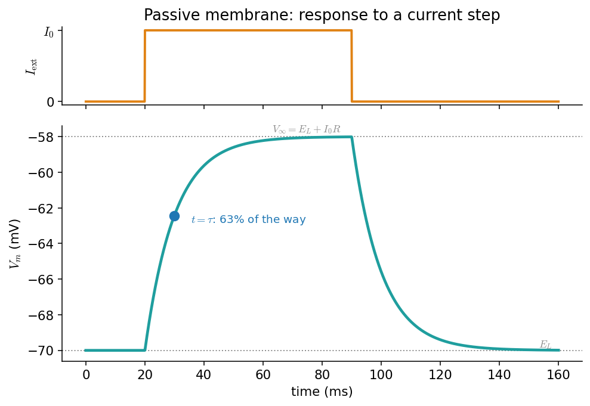
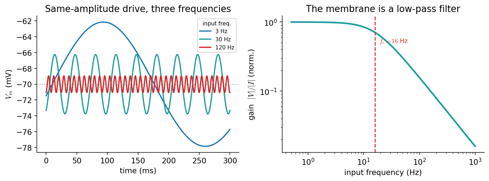

# غشای غیرفعال: مدارِ RC

در فصلِ [پتانسیل استراحت](ch-biophysics-02-resting-potential.md) دیدیم که غشا در حالتِ استراحت چه ولتاژی دارد. اکنون می‌پرسیم: اگر جریانی به سلول تزریق کنیم، ولتاژ **چگونه در زمان** پاسخ می‌دهد؟ تا وقتی کانال‌های وابسته به ولتاژ خاموش‌اند (یعنی **زیرِ آستانه**)، پاسخِ غشا شگفت‌آور ساده است: غشا مانندِ یک **مدارِ الکتریکیِ RC** رفتار می‌کند. این ساده‌ترین و پرکاربردترین مدلِ نورون است و — همان‌طور که خواهیم دید — **استخوان‌بندیِ همهٔ مدل‌های پیچیده‌ترِ** فصل‌های بعد نیز هست.

???+ tip "در پایانِ این فصل خواهید توانست"
    - غشا را با یک **خازن**، یک **مقاومتِ نشتی** و یک **باتری** مدل کنید.
    - **معادلهٔ موازنهٔ جریان** را بنویسید و آن را به‌صورتِ عددی حل کنید.
    - **ثابتِ زمانیِ** \(\tau=R_mC_m\) را تعریف کنید و از روی پاسخِ پله‌ای بخوانید.
    - توضیح دهید چرا غشا یک **صافیِ پایین‌گذر** است و بسامدِ برشِ آن را بیابید.

---

## غشا یک مدارِ RC است

دولایهٔ لیپیدی یک عایقِ نازک میانِ دو محلولِ رساناست، و هر عایقی که میانِ دو رسانا قرار گیرد یک **خازن** می‌سازد. پس غشا یک **ظرفیتِ خازنیِ** \(C_m\) دارد و می‌تواند بار را روی دو سطحِ خود نگه دارد. در کنارِ آن، کانال‌های نشتی مسیرهایی برای عبورِ بار فراهم می‌کنند و نقشِ یک **مقاومتِ** \(R_m\) (یا رساناییِ \(g_L=1/R_m\)) را بازی می‌کنند؛ و چون هر دسته کانال یک پتانسیلِ تعادل دارد، یک **باتریِ** \(E_L\) نیز در این شاخه هست. بنابراین کوچک‌ترین مدلِ غشا، یک خازن به‌موازاتِ یک شاخهٔ مقاومت–باتری است.


*مدلِ مداریِ ساده‌شدهٔ غشا: خازنِ \(C_m\) به‌موازاتِ یک شاخهٔ نشتی شاملِ مقاومتِ \(R_m\) و باتریِ \(E_L\).*

## معادلهٔ موازنهٔ جریان

قانونِ پایستگیِ بار همه‌چیز را تعیین می‌کند: جریانی که به غشا می‌رسد یا بارِ خازن را تغییر می‌دهد یا از شاخهٔ نشتی می‌گذرد. جریانِ خازنی \(C_m\,\frac{dV}{dt}\) و جریانِ نشتی \(g_L(V-E_L)\) است، پس با جریانِ تزریقیِ \(I_{\text{ext}}\):

\[
C_m\,\frac{dV_m}{dt} = -\,g_L\,(V_m - E_L) + I_{\text{ext}}.
\]

این معادله، **استخوان‌بندیِ همهٔ مدل‌های نورونیِ** این کتاب است. مدلِ [هاجکین–هاکسلی](https://computational-neuroscience.ir/ch03/)، مدل‌های ساده‌شده و حتی مدل‌های جمعیتی، همگی شکل‌هایی از همین موازنه‌اند؛ تنها چیزی که عوض می‌شود، توصیفِ جریان‌های یونی است. اینجا ساده‌ترین حالت را داریم: یک جریانِ نشتیِ **خطی**.

حلِ عددیِ این معادله با همان روشِ [اویلرِ پیشرو](https://computational-neuroscience.ir/ch-num-06-ode/) چند خط بیش نیست:

```python
import numpy as np

# passive (leaky) membrane:  C dV/dt = -g_L (V - E_L) + I_ext
C   = 100.0        # pF
g_L = 10.0         # nS      ->  tau = C / g_L = 10 ms
E_L = -70.0        # mV
tau = C / g_L      # ms

def simulate(I_ext, T=160.0, dt=0.05, V0=E_L):
    """Forward-Euler integration of the passive membrane; I_ext(t) in pA."""
    t = np.arange(0, T, dt)
    V = np.empty_like(t); V[0] = V0
    for n in range(len(t) - 1):
        dV = (-g_L * (V[n] - E_L) + I_ext(t[n])) / C
        V[n + 1] = V[n] + dV * dt
    return t, V

step = lambda tt: 120.0 if 20 <= tt < 90 else 0.0     # a 120 pA current step
t, V = simulate(step)
```

## پاسخ به پلهٔ جریان و ثابتِ زمانی

برای یک جریانِ **ثابتِ** \(I_0\)، معادله یک جوابِ دقیقِ نمایی دارد. اگر سلول از \(E_L\) آغاز کند:

\[
V_m(t) = E_L + I_0 R_m\left(1 - e^{-t/\tau}\right),\qquad \tau = R_m C_m = \frac{C_m}{g_L}.
\]

دو نکته: نخست، ولتاژِ **پایا** برابرِ \(V_\infty = E_L + I_0 R_m\) است — یعنی پاسخ با جریان **خطی** است (قانونِ اهم). دوم، سرعتِ رسیدن به این مقدار را **ثابتِ زمانیِ** \(\tau\) تعیین می‌کند: پس از یک \(\tau\)، ولتاژ ۶۳٪ راه را رفته است. مقدارِ نوعیِ \(\tau\) چند تا چند ده میلی‌ثانیه است و همین، مقیاسِ زمانیِ پاسخ‌های زیرآستانهٔ نورون را مشخص می‌کند.



*پاسخِ غشای غیرفعال به یک پلهٔ جریان. **بالا:** جریانِ تزریقی. **پایین:** ولتاژ به‌صورتِ نمایی به سمتِ \(V_\infty=E_L+I_0R_m\) بالا می‌رود و پس از قطعِ جریان، نمایی به \(E_L\) بازمی‌گردد. نقطهٔ آبی، لحظهٔ \(t=\tau\) را نشان می‌دهد که در آن ولتاژ ۶۳٪ راه را پیموده است.*

پس از قطعِ جریان، ولتاژ با همان \(\tau\) به استراحت بازمی‌گردد. توجه کنید که غشا **هیچ حافظه‌ای فراتر از \(\tau\)** ندارد: هر رویدادِ ورودی پس از چند \(\tau\) کاملاً فراموش می‌شود. همین ویژگی، غشای غیرفعال را به یک **انباشتگرِ نشت‌دار** (leaky integrator) بدل می‌کند — ایده‌ای که مستقیماً به مدلِ نورونِ [یکپارچه‌و‌شلیک](https://computational-neuroscience.ir/ch04/) می‌انجامد.

## غشا یک صافیِ پایین‌گذر است

اگر به‌جای یک پله، جریانی **نوسانی** با بسامدِ \(f\) تزریق کنیم، همان معادلهٔ خطی می‌گوید که ولتاژ نیز با همان بسامد نوسان می‌کند، اما با دامنه‌ای که به بسامد بستگی دارد. **بهرهٔ** دستگاه (نسبتِ دامنهٔ ولتاژ به دامنهٔ جریان) چنین است:

\[
|H(f)| = \frac{R_m}{\sqrt{1 + (2\pi f\,\tau)^2}}.
\]

برای بسامدهای کوچک (\(2\pi f\tau \ll 1\)) بهره ثابت و برابرِ \(R_m\) است؛ اما برای بسامدهای بزرگ، خازن «فرصتِ» شارژ‌شدن نمی‌یابد و بهره مانندِ \(1/f\) افت می‌کند. مرزِ این دو رژیم، **بسامدِ برش** \(f_c = 1/(2\pi\tau)\) است. به‌بیانِ دیگر، غشا یک **صافیِ پایین‌گذر** است: تغییراتِ آهسته را می‌گذراند و تغییراتِ تندِ ورودی را صاف می‌کند.



*غشا به‌مثابهٔ صافیِ پایین‌گذر. **چپ:** پاسخ به سه جریانِ نوسانیِ هم‌دامنه با بسامدهای متفاوت؛ هرچه بسامد بالاتر، دامنهٔ ولتاژ کوچک‌تر. **راست:** منحنیِ بهره بر حسبِ بسامد؛ زیرِ بسامدِ برشِ \(f_c\approx16\) هرتز بهره تقریباً ثابت است و بالای آن مانندِ \(1/f\) افت می‌کند.*

```python
# amplitude of the subthreshold voltage response to a sinusoidal current, vs frequency
freq = np.logspace(-0.3, 3, 400)               # Hz
gain = 1.0 / np.sqrt(1 + (2*np.pi*freq*tau/1000)**2)   # tau in ms -> /1000
f_c  = 1000.0 / (2*np.pi*tau)                   # cutoff frequency in Hz  (≈ 16 Hz)
```

این «پایین‌گذر بودن» پیامدهای مهمی برای پردازشِ اطلاعات دارد: نورون به‌تنهایی نمی‌تواند به تغییراتِ بسیار سریعِ ورودی پاسخِ زیرآستانه بدهد، و همین، یکی از دلایلی است که چرا اطلاعاتِ سریع در مغز اغلب با **زمان‌بندیِ اسپایک‌ها** کدگذاری می‌شود، نه با ولتاژِ زیرآستانه.

---

!!! example "تمرین‌ها"
    ۱. **قانونِ اهم.** با کدِ `simulate`، پاسخِ پله‌ای را برای سه جریانِ \(I_0=60,120,240\) پیکوآمپر رسم کنید. نشان دهید که \(V_\infty-E_L\) با \(I_0\) خطی است و شیبِ آن \(R_m=1/g_L\) است.

    ۲. **اندازه‌گیریِ \(\tau\).** از یک شبیه‌سازیِ پله‌ای، ثابتِ زمانی را به‌صورتِ عددی برآورد کنید (زمانی که ولتاژ به ۶۳٪ مقدارِ نهایی می‌رسد) و با \(C/g_L\) بسنجید.

    ۳. **صافی.** غشا را با جریان‌های نوسانیِ هم‌دامنه در بسامدهای گوناگون بِرانید، دامنهٔ ولتاژِ پایا را اندازه بگیرید، و منحنیِ بهره را بازتولید کنید. تأیید کنید که در \(f_c=1/(2\pi\tau)\) بهره به \(1/\sqrt2\) برابرِ مقدارِ کم‌بسامد افت می‌کند.

    ۴. **انباشتگرِ نشت‌دار.** به مدل یک **آستانه** بیفزایید: هرگاه \(V_m\) از یک مقدارِ آستانه گذشت، یک «اسپایک» ثبت کنید و \(V_m\) را به \(E_L\) بازنشانی کنید. این همان مدلِ **یکپارچه‌و‌شلیکِ نشت‌دار** (LIF) است؛ بسامدِ شلیک را بر حسبِ جریانِ ثابت رسم کنید.
