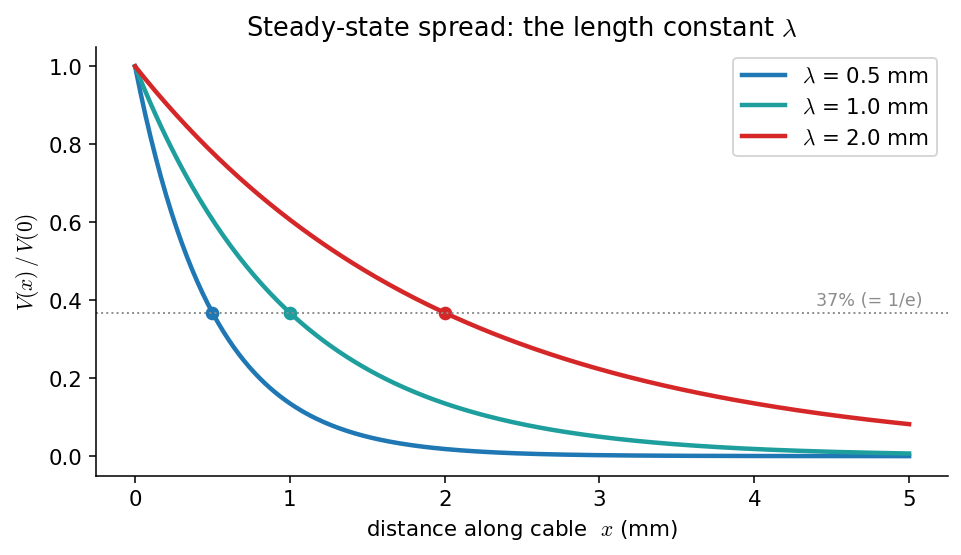
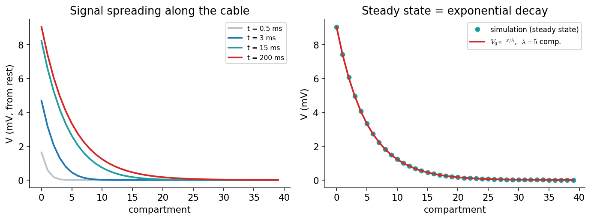

# کابل و مدل‌های تقسیمی

تا اینجا نورون را یک **نقطه** فرض کردیم: یک ولتاژِ واحد \(V_m(t)\) برای کلِ سلول. اما نورون‌های واقعی **گسترده**اند — دندریت‌های بلند ورودی می‌گیرند و آکسونی که گاه تا یک متر است خروجی را حمل می‌کند. پس پرسشِ تازه‌ای پیش می‌آید: وقتی جریانی در یک نقطه از یک زائدهٔ دراز تزریق می‌شود، ولتاژ **در فضا** چگونه پخش می‌شود؟ پاسخ در **نظریهٔ کابل** است، و ابزارِ محاسباتیِ آن، **مدل‌های تقسیمی**.

???+ tip "در پایانِ این فصل خواهید توانست"
    - **معادلهٔ کابل** را به‌عنوانِ تعمیمِ فضاییِ مدلِ RC بشناسید.
    - **ثابتِ طولِ** \(\lambda\) را تعریف کنید و بگویید سیگنالِ زیرآستانه تا چه فاصله‌ای پخش می‌شود.
    - یک زائدهٔ عصبی را به زنجیره‌ای از **اجزای تقسیمیِ** جفت‌شده بشکنید و آن را شبیه‌سازی کنید.
    - ببینید چگونه شبیه‌سازیِ تقسیمی، جوابِ تحلیلیِ معادلهٔ کابل را بازتولید می‌کند.

---

## معادلهٔ کابل

یک زائدهٔ نازکِ عصبی را مانندِ یک **کابلِ الکتریکی** در نظر بگیرید: غشا در هر نقطه همان مدارِ RC فصلِ [پیش](ch-biophysics-03-passive-rc.md) است، اما اکنون نقاطِ مجاور با **مقاومتِ محوریِ** درونِ سیتوپلاسم به هم وصل‌اند. موازنهٔ جریان در هر نقطه، یک جملهٔ تازه — نشتِ محوری به همسایه‌ها — می‌گیرد، و به یک **معادلهٔ دیفرانسیلِ با مشتقاتِ جزئی** می‌رسیم:

\[
\tau\,\frac{\partial V}{\partial t} = \lambda^2\,\frac{\partial^2 V}{\partial x^2} - (V - E_L),
\]

که در آن \(\tau = R_m C_m\) همان ثابتِ زمانیِ فصلِ پیش است و \(\lambda\) یک **ثابتِ طول** با بُعدِ مکان است. جملهٔ \(\partial^2 V/\partial x^2\) همان **پخش** (diffusion) است — دقیقاً همان ساختارِ [معادلهٔ گرما](https://computational-neuroscience.ir/ch-num-03-fdm/): ولتاژ در امتدادِ کابل «نشت» می‌کند و پخش می‌شود.

## ثابتِ طولِ λ

ساده‌ترین و مهم‌ترین حالت، **حالتِ پایا** است (\(\partial V/\partial t = 0\)). آن‌گاه معادلهٔ کابل به یک معادلهٔ ساده فرومی‌کاهد:

\[
\lambda^2\,\frac{d^2 V}{d x^2} = V - E_L,
\]

که جوابش برای جریانی که در \(x=0\) تزریق می‌شود، یک **افتِ نمایی** در فضاست:

\[
V(x) - E_L = \big(V(0)-E_L\big)\,e^{-x/\lambda}.
\]

پس \(\lambda\) فاصله‌ای است که در آن دامنهٔ سیگنال به \(1/e\approx 37\%\) می‌افتد. هرچه غشا نشت‌ناپذیرتر (\(R_m\) بزرگ‌تر) و مقاومتِ محوری کمتر باشد، \(\lambda\) بزرگ‌تر است و سیگنال دورتر می‌رسد: \(\lambda = \sqrt{R_m/R_a}\). مقادیرِ نوعیِ \(\lambda\) در دندریت‌ها چند دهم تا چند میلی‌متر است.



*افتِ نماییِ ولتاژِ پایا در امتدادِ کابل برای سه مقدارِ \(\lambda\). نقطه‌ها جایی‌اند که ولتاژ به \(1/e\) (۳۷٪) می‌رسد، یعنی \(x=\lambda\). \(\lambda\)ی بزرگ‌تر یعنی سیگنال دورتر پخش می‌شود.*

پیامدِ زیستیِ این افت، ژرف است: یک سیناپس بر یک دندریتِ دور، اثری بسیار کوچک‌تر بر سومای نورون دارد تا سیناپسی نزدیک. **مکانِ ورودی روی دندریت اهمیت دارد** — نکته‌ای که مدل‌های نقطه‌ایِ ساده آن را نادیده می‌گیرند.

## مدل‌های تقسیمی

معادلهٔ کابل را جز در ساده‌ترین حالت‌ها نمی‌توان به‌صورتِ بسته حل کرد. راهِ محاسباتی، **مدلِ تقسیمی** (compartmental model) است: کابل را به \(N\) قطعهٔ کوتاه می‌شکنیم، هر قطعه را یک مدارِ RC می‌گیریم، و قطعاتِ مجاور را با یک رساناییِ محوریِ \(g_a\) به هم وصل می‌کنیم. برای قطعهٔ \(i\):

\[
C\,\frac{dV_i}{dt} = -g_L(V_i - E_L) + g_a(V_{i-1}-V_i) + g_a(V_{i+1}-V_i) + I_i.
\]

این چیزی جز \(N\) نسخهٔ جفت‌شده از همان معادلهٔ RC نیست، و با اویلرِ پیشرو مستقیماً حل می‌شود. (همین ایده، هستهٔ نرم‌افزارهای دقیقِ شبیه‌سازیِ نورون مانندِ NEURON است، که مورفولوژیِ کاملِ یک نورون را به هزاران جزء می‌شکنند.)

```python
import numpy as np

N   = 40          # number of compartments
gL  = 1.0         # leak conductance   (per compartment)
ga  = 25.0        # axial coupling conductance
C   = 10.0
lam = np.sqrt(ga / gL)          # length constant, in compartments (= 5)

def simulate_cable(I_amp=50.0, T=200.0, dt=0.02):
    """Passive cable of N coupled RC compartments; current injected at compartment 0."""
    t = np.arange(0, T, dt)
    V = np.zeros((len(t), N))                 # deflection from rest
    for n in range(len(t) - 1):
        v = V[n]
        axial = np.zeros(N)                   # axial current into each compartment
        axial[:-1] += ga * (v[1:] - v[:-1])
        axial[1:]  += ga * (v[:-1] - v[1:])   # sealed ends
        I = np.zeros(N); I[0] = I_amp
        V[n + 1] = v + (-gL * v + axial + I) / C * dt
    return t, V

t, V = simulate_cable()
V_steady = V[-1]                              # matches  V0 * exp(-x / lam)
```

شکلِ زیر نتیجه را نشان می‌دهد. سمتِ چپ، پخشِ سیگنال را در زمان دنبال می‌کند: جریان در قطعهٔ صفر تزریق می‌شود و ولتاژ به‌تدریج در امتدادِ کابل پیش می‌رود تا به حالتِ پایا برسد. سمتِ راست تأیید می‌کند که حالتِ پایای شبیه‌سازی دقیقاً همان افتِ نماییِ \(e^{-x/\lambda}\)ی نظریهٔ کابل است.



*شبیه‌سازیِ کابلِ تقسیمی. **چپ:** ولتاژ در امتدادِ کابل در چند زمانِ متوالی؛ سیگنال از قطعهٔ ورودی پخش می‌شود و می‌نشیند. **راست:** حالتِ پایای شبیه‌سازی (نقطه‌ها) دقیقاً روی منحنیِ تحلیلیِ \(V_0 e^{-x/\lambda}\) با \(\lambda=5\) قطعه می‌افتد — یعنی مدلِ تقسیمی، معادلهٔ کابل را بازتولید می‌کند.*

---

!!! example "تمرین‌ها"
    ۱. **وابستگیِ \(\lambda\).** شبیه‌سازی را برای چند مقدارِ \(g_a\) اجرا کنید و نشان دهید که \(\lambda\)ی برازش‌شده مانندِ \(\sqrt{g_a/g_L}\) رشد می‌کند.

    ۲. **مکانِ ورودی مهم است.** یک ورودیِ یکسان را یک‌بار در قطعهٔ ۰ (نزدیکِ سوما) و یک‌بار در قطعهٔ ۳۰ (دور) تزریق کنید و ولتاژِ پایای قطعهٔ ۰ را در دو حالت مقایسه کنید. کدام ورودی اثرِ بیشتری بر سوما دارد؟

    ۳. **گذرا در برابر پایا.** زمانی را که طول می‌کشد تا قطعهٔ دور (مثلاً قطعهٔ ۲۰) به نیمهٔ ولتاژِ پایای خود برسد اندازه بگیرید. این تأخیر با فاصله چگونه تغییر می‌کند؟

    ۴. **(پروژه)** به هر قطعه به‌جای نشتِ خطی، یک جریانِ **فعالِ** وابسته به ولتاژ (مثلاً از نوعِ [هاجکین–هاکسلی](https://computational-neuroscience.ir/ch03/)) بیفزایید و نشان دهید که اکنون به‌جای افتِ نمایی، یک پتانسیلِ عمل می‌تواند بدونِ افت در امتدادِ کابل **منتشر** شود.
