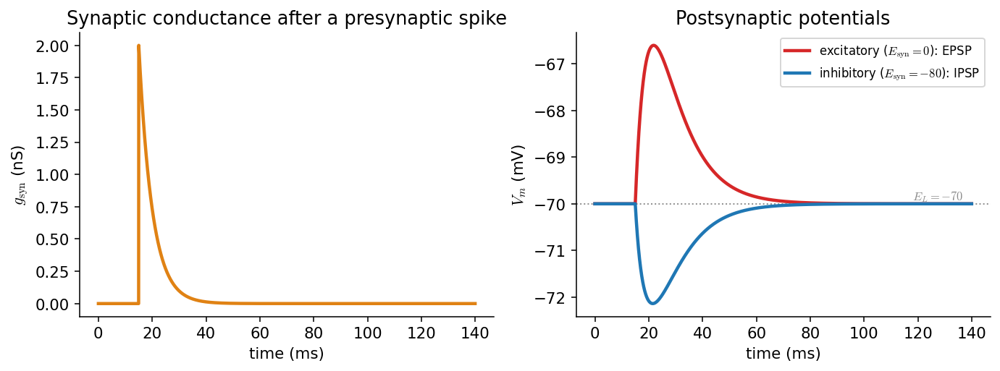
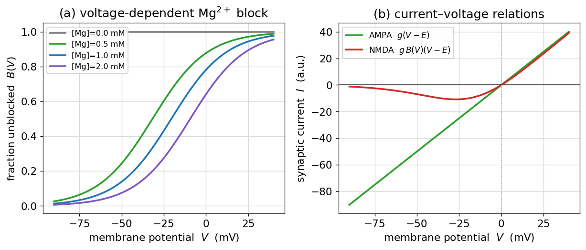
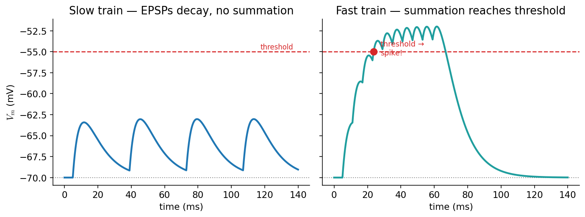
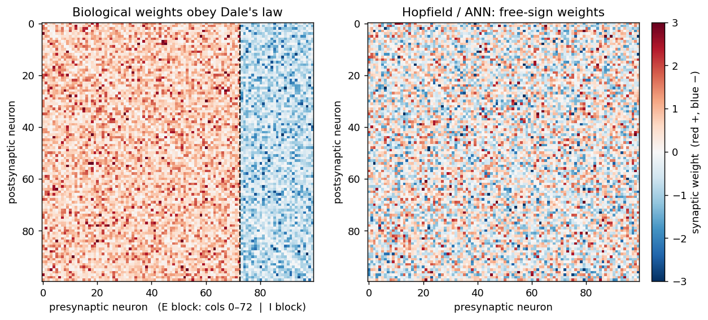

# سیناپس‌ها و ورودیِ سیناپسی

تا اینجا نورون را در انزوا دیدیم. اما نورون‌ها در شبکه زندگی می‌کنند و از راهِ **سیناپس** با هم سخن می‌گویند. این فصل می‌پرسد: وقتی یک نورونِ پیش‌سیناپسی شلیک می‌کند، چه اثری بر ولتاژِ نورونِ پس‌سیناپسی می‌گذارد؟ پاسخ، همان مدلِ RC فصلِ [پیش](ch-biophysics-03-passive-rc.md) است، اما این‌بار با یک جریانِ تازه: **جریانِ سیناپسی**.

???+ tip "در پایانِ این فصل خواهید توانست"
    - سیناپسِ شیمیایی را با یک **رساناییِ گذرا** \(g_{\text{syn}}(t)\) مدل کنید.
    - **جریانِ سیناپسی** و نقشِ **نیروی رانش** \((V-E_{\text{syn}})\) را توضیح دهید.
    - تفاوتِ سیناپسِ **تحریکی** و **مهاری** را از روی پتانسیلِ وارونگیِ \(E_{\text{syn}}\) دریابید.
    - **EPSP** و **IPSP** را شبیه‌سازی کنید و **انباشتگیِ زمانی** را تا رسیدن به آستانه ببینید.
    - **اصلِ (قانونِ) دِیل** را بیان کنید و بفهمید چرا نورون‌ها به دو جمعیتِ تحریکی و مهاری تقسیم می‌شوند.
    - نقشِ **NMDA** به‌مثابهٔ آشکارسازِ هم‌زمانی و پدیدهٔ **پلاستیسیتیِ کوتاه‌مدت** را توضیح دهید.

---

## سیناپسِ شیمیایی: از اسپایک تا رسانایی

در یک سیناپسِ شیمیایی، اسپایکِ نورونِ پیش‌سیناپسی باعثِ رهاشدنِ **ناقلِ عصبی** می‌شود؛ ناقل به گیرنده‌های روی غشای پس‌سیناپسی می‌چسبد و **کانال‌های وابسته به لیگاند** را می‌گشاید. نتیجه، یک **افزایشِ گذرای رسانایی** در غشای پس‌سیناپسی است. ساده‌ترین مدلِ این رسانایی آن است که هر اسپایکِ پیش‌سیناپسی یک پرشِ \(\bar g\) به رسانایی می‌افزاید که سپس به‌صورتِ نمایی با ثابتِ زمانیِ \(\tau_{\text{syn}}\) فرومی‌نشیند:

\[
\frac{dg_{\text{syn}}}{dt} = -\frac{g_{\text{syn}}}{\tau_{\text{syn}}},\qquad
g_{\text{syn}} \to g_{\text{syn}} + \bar g \quad \text{at each presynaptic spike}.
\]



*چپ: رساناییِ سیناپسیِ \(g_{\text{syn}}(t)\) پس از یک اسپایکِ پیش‌سیناپسی — یک پرشِ سریع و افتِ نمایی. راست: پاسخِ ولتاژِ پس‌سیناپسی؛ سیناپسِ تحریکی (\(E_{\text{syn}}=0\)) یک **EPSP** (برجستگیِ رو به بالا) و سیناپسِ مهاری (\(E_{\text{syn}}=-80\)) یک **IPSP** (فرورفتگیِ رو به پایین) می‌سازد.*

## جریانِ سیناپسی و نیروی رانش

این رسانایی یک **جریانِ سیناپسی** تولید می‌کند که مانندِ جریانِ نشتی، هم به رسانایی و هم به فاصلهٔ ولتاژ تا پتانسیلِ وارونگیِ سیناپس بستگی دارد:

\[
I_{\text{syn}} = -\,g_{\text{syn}}(t)\,(V_m - E_{\text{syn}}).
\]

جملهٔ \((V_m - E_{\text{syn}})\) همان **نیروی رانش** است. مقدارِ \(E_{\text{syn}}\)، سرشتِ سیناپس را تعیین می‌کند:

- **سیناپسِ تحریکی:** \(E_{\text{syn}}\approx 0\) میلی‌ولت (کانال‌های AMPA/NMDA، عبورِ سدیم و پتاسیم). چون \(E_{\text{syn}}\) بسیار بالاتر از استراحت است، جریان، غشا را **دپلاریزه** می‌کند و \(V_m\) را به‌سویِ آستانه می‌برد.
- **سیناپسِ مهاری:** \(E_{\text{syn}}\approx -80\) میلی‌ولت (کانال‌های GABA، عبورِ کلر). چون \(E_{\text{syn}}\) نزدیک یا پایین‌ترِ استراحت است، جریان، غشا را **هایپرپلاریزه** می‌کند یا دستِ‌کم آن را نزدیکِ استراحت «قفل» می‌کند.

نکتهٔ ظریف این است که در حالتِ استراحت، IPSP کوچک است، چون نیروی رانشِ آن (\(V_m - E_{\text{syn}}\)) کوچک است. مهار اغلب نه با هایپرپلاریزه‌کردن، بلکه با **بالابردنِ رسانایی** عمل می‌کند و ورودی‌های تحریکی را «کوتاه» (shunt) می‌کند — پدیده‌ای به نامِ **مهارِ شنتی**.

افزودنِ این جریان به مدلِ RC فصلِ پیش، مدلِ کاملِ نورونِ گیرنده را می‌دهد:

```python
import numpy as np

C, g_L, E_L = 100.0, 10.0, -70.0      # passive membrane (from the RC chapter)
tau_syn = 5.0                          # ms

def run(pre_spikes, g_bar, E_syn, T=140.0, dt=0.05):
    """Postsynaptic voltage driven by synaptic input arriving at pre_spikes (ms)."""
    t = np.arange(0, T, dt)
    V = np.full(len(t), E_L); g = 0.0; sp = list(pre_spikes)
    for n in range(len(t) - 1):
        while sp and sp[0] <= t[n]:          # a presynaptic spike arrives
            g += g_bar; sp.pop(0)
        I_syn = -g * (V[n] - E_syn)
        V[n+1] = V[n] + (-g_L*(V[n]-E_L) + I_syn) / C * dt
        g += -g / tau_syn * dt               # conductance decays
    return t, V

t, V_epsp = run([15.0], g_bar=2.0,  E_syn=0.0)     # EPSP
t, V_ipsp = run([15.0], g_bar=10.0, E_syn=-80.0)   # IPSP
```

### گیرندهٔ NMDA: یک آشکارسازِ هم‌زمانی

سیناپسِ تحریکی معمولاً دو نوع کانال دارد: **AMPA** و **NMDA**، و این دو تفاوتی بنیادی دارند. کانالِ AMPA یک رساناییِ ساده و **مستقل از ولتاژ** است؛ جریانش خطی و برابرِ \(g\,(V-E)\) است. اما کانالِ NMDA ویژگیِ شگفتی دارد: در ولتاژهای نزدیکِ استراحت، یونِ **منیزیم** (\(\text{Mg}^{2+}\)) از بیرون در دهانهٔ کانال گیر می‌کند و آن را **می‌بندد**. تنها وقتی غشا به‌قدرِ کافی **دپلاریزه** شود، منیزیم از کانال بیرون رانده می‌شود و کانال جریان می‌گذراند. کسرِ کانال‌های **ناسدود** را می‌توان چنین نوشت:

\[
B(V) = \frac{1}{1 + \dfrac{[\text{Mg}^{2+}]}{3.57}\,e^{-0.062\,V}},
\qquad
I_{\text{NMDA}} = g_{\text{NMDA}}\,B(V)\,(V-E).
\]



*چپ: کسرِ ناسدودِ NMDA، \(B(V)\)، بر حسبِ ولتاژ برای چند غلظتِ منیزیم؛ در استراحت (سمتِ چپِ نمودار) کانال عمدتاً سدود است و تنها با دپلاریزاسیون باز می‌شود. راست: رابطهٔ جریان–ولتاژ؛ جریانِ AMPA خطی است، اما جریانِ NMDA به‌سببِ سدِ منیزیم در ولتاژهای پایین تقریباً صفر است.*

پیامدِ این سازوکار ژرف است: کانالِ NMDA تنها وقتی جریانِ چشمگیر می‌گذراند که **هم‌زمان** دو شرط برقرار باشد — (۱) ناقلِ عصبی (گلوتامات) از نورونِ **پیش‌سیناپسی** رها شده باشد (تا کانال به لحاظِ شیمیایی باز باشد)، و (۲) نورونِ **پس‌سیناپسی** از پیش دپلاریزه باشد (تا سدِ منیزیم برداشته شود). پس NMDA یک **آشکارسازِ هم‌زمانی** (coincidence detector) است که فعالیتِ پیش و پس‌سیناپسی را با هم می‌سنجد — و همین، پایهٔ مولکولیِ **یادگیریِ هبی** و تقویتِ درازمدتِ سیناپسی (LTP) است.

## انباشتگیِ سیناپسی: راه به‌سوی آستانه

یک EPSP به‌تنهایی نورون را شلیک نمی‌کند. اما نورون هزاران سیناپس دارد، و پاسخِ آن به **جمعِ** ورودی‌هاست. چون هر EPSP با ثابتِ زمانیِ غشا (\(\tau_m\)) میرا می‌شود، اگر ورودی‌ها به‌قدرِ کافی **پشتِ‌سرِ‌هم** برسند، EPSPها روی هم **انباشته** می‌شوند و ولتاژ می‌تواند به آستانهٔ شلیک برسد. این را **انباشتگیِ زمانی** (temporal summation) می‌نامند (انباشتگیِ **فضایی** نیز هست: ورودی‌های هم‌زمان از سیناپس‌های مختلف).



*انباشتگیِ زمانی. **چپ:** قطاری از EPSPهای با فاصلهٔ زیاد؛ هر EPSP پیش از رسیدنِ بعدی میرا می‌شود، پس ولتاژ هرگز به آستانه (خط‌چینِ قرمز) نمی‌رسد. **راست:** همان تعداد ورودی اما با فاصلهٔ کم؛ EPSPها انباشته می‌شوند، ولتاژ بالا می‌رود و به آستانه می‌رسد — نقطه‌ای که نورون یک اسپایک تولید می‌کند.*

پس نورون یک **آشکارساز هم‌زمانی و بسامد** است: تنها وقتی ورودی‌های تحریکی به‌قدرِ کافی زیاد و نزدیک به هم باشند (و مهارِ کافی در کار نباشد) شلیک می‌کند. همین‌جاست که بیوفیزیکِ تک‌نورون به **دینامیکِ شبکه** می‌پیوندد: خروجیِ این فصل — جریانِ سیناپسی — دقیقاً ورودیِ مدل‌های نورونی و شبکه‌ای در بخش‌های بعدیِ کتاب است.

## پلاستیسیتیِ کوتاه‌مدت: سیناپس ثابت نیست

تا اینجا فرض کردیم هر اسپایکِ پیش‌سیناپسی همان پرشِ ثابتِ \(\bar g\) را به رسانایی می‌افزاید. اما سیناپس‌های واقعی **تاریخ‌مند**اند: پاسخشان به هر اسپایک به اسپایک‌های اخیر بستگی دارد. وقتی یک قطارِ اسپایکِ پرشتاب می‌رسد، دامنهٔ پاسخ می‌تواند به‌تدریج **کوچک** شود (**تضعیف** یا depression — از ته‌کشیدنِ ناقلِ آماده‌ی رهاسازی) یا **بزرگ** شود (**تسهیل** یا facilitation — از انباشتِ کلسیم در پایانهٔ پیش‌سیناپسی). به این پدیده **پلاستیسیتیِ کوتاه‌مدت** می‌گویند.


*دامنهٔ EPSC در پاسخ به یک قطارِ ۲۰ هرتزیِ اسپایک، بهنجارشده به نخستین پاسخ. سیناپسِ **تضعیف‌شونده** (آبی) با هر اسپایک ضعیف‌تر می‌شود؛ سیناپسِ **تسهیل‌شونده** (قرمز) نخست تقویت می‌شود. اینکه کدام رخ دهد، عمدتاً به احتمالِ رهاسازیِ اولیهٔ سیناپس بستگی دارد.*

پلاستیسیتیِ کوتاه‌مدت به سیناپس یک نقشِ محاسباتی می‌دهد: سیناپسِ تضعیف‌شونده به **تغییراتِ** نرخِ ورودی حساس است (نوعی صافیِ بالاگذر)، و سیناپسِ تسهیل‌شونده می‌تواند شروعِ یک قطارِ پرشتاب را برجسته کند. ساده‌ترین مدلِ کمّیِ این رفتار، مدلِ **سودیکس–مارکرام** (Tsodyks–Markram) است که در آن دو متغیرِ «منابعِ در دسترس» و «احتمالِ رهاسازی» با هر اسپایک به‌روز می‌شوند.

## اصلِ دِیل: نورونِ تحریکی یا مهاری

تا اینجا سیناپس را «تحریکی» یا «مهاری» نامیدیم، انگار این صفت به خودِ سیناپس بچسبد. اما پرسشی ژرف‌تر هست: آیا یک نورونِ **پیش‌سیناپسی** می‌تواند بر یکی از هدف‌هایش اثرِ تحریکی و بر دیگری اثرِ مهاری بگذارد؟ پاسخِ تجربی، تقریباً همیشه **نه** است. این مشاهده را **اصلِ دِیل** (Dale's principle) می‌نامند.

نامِ این اصل از **هنری دِیل** گرفته شده که در دههٔ ۱۹۳۰ دربارهٔ پیام‌رسانیِ شیمیایی کار می‌کرد؛ خودِ دِیل هرگز آن را به‌صورتِ یک «اصل» بیان نکرد، و بعدها **جان اِکلز** (۱۹۵۴) این نام را بر پایهٔ این ایدهٔ او گذاشت که «**همان** ناقلِ عصبی از همهٔ پایانه‌های سیناپسیِ یک نورون رها می‌شود». صورتِ سخت‌گیرانهٔ «هر نورون فقط یک ناقل» امروزه **نادرست** شناخته می‌شود — بسیاری از نورون‌ها هم‌زمان چند پیام‌رسان رها می‌کنند (پدیدهٔ **هم‌رهایی** یا co-transmission). اما صورتِ پالوده‌ترِ آن — که اکلز در ۱۹۷۶ با افزودنِ «ناقل یا ناقل‌ها» بیان کرد — همچنان یک قاعدهٔ سرانگشتیِ نیرومند با استثناهای اندک است: یک نورون **همان مجموعهٔ ناقل‌ها** را در همهٔ سیناپس‌هایش رها می‌کند، پس اثرِ آن بر همهٔ هدف‌ها **هم‌علامت** است.

برای ما پیامدِ محاسباتیِ این اصل مهم است. در مدل‌های شبکه، برهم‌کنشِ نورون‌ها را با یک **ماتریسِ وزنِ سیناپسیِ** \(W\) نشان می‌دهیم که در آن \(W_{ij}\) وزنِ اتصال از نورونِ پیش‌سیناپسیِ \(j\) به نورونِ پس‌سیناپسیِ \(i\) است. اصلِ دِیل — که در بافتِ مغز به آن **قانونِ دِیل** هم می‌گویند — یک قیدِ ساختاری بر این ماتریس می‌گذارد: **همهٔ اتصال‌هایی که از یک نورونِ پیش‌سیناپسی سرچشمه می‌گیرند، هم‌علامت‌اند** (همه تحریکی یا همه مهاری). به‌بیانِ دیگر، هر **ستونِ** ماتریسِ \(W\) تنها یک علامت دارد. همین قید، نورون‌ها را به دو جمعیتِ مجزّای **تحریکی** و **مهاری** دسته‌بندی می‌کند — دسته‌بندیِ بنیادیِ نورون‌ها در مغز.

این نکته نقطهٔ تمایزِ مهمی است میانِ شبکه‌های زیستی و شبکه‌های عصبیِ مصنوعی (مانندِ مدلِ [هاپفیلد](https://computational-neuroscience.ir/ch-dynamical-systems/ch-dynamics-06-neuro-bistability/) یا شبکه‌های یادگیریِ ژرف)، که در آن‌ها وزن‌ها آزادانه می‌توانند هم مثبت و هم منفی باشند و یک واحد می‌تواند بعضی هدف‌ها را برانگیزد و بعضی را مهار کند. طبیعت این آزادی را ندارد؛ در مغز، مهار باید از راهِ **جمعیت‌های جداگانهٔ نورون‌های مهاری** انجام شود، نه با منفی‌کردنِ وزنِ یک نورونِ تحریکی.

```python
import numpy as np
rng = np.random.default_rng(0)

N, f_exc = 100, 0.8                       # 100 neurons, 80% excitatory
is_exc = rng.random(N) < f_exc            # each neuron's identity — fixed for life
sign   = np.where(is_exc, +1.0, -1.0)     # Dale: +1 for excitatory, -1 for inhibitory

W = np.abs(rng.normal(0, 1, (N, N)))      # nonnegative synaptic *strengths*
W = W * sign[np.newaxis, :]               # column j inherits presynaptic neuron j's sign
np.fill_diagonal(W, 0.0)                  # no self-synapses

# Dale's law holds by construction: every outgoing column has a single sign
single_signed = all(len(set(np.sign(W[W[:, j] != 0, j]))) <= 1 for j in range(N))
print("each presynaptic neuron is purely E or I:", single_signed)   # True
```



*ماتریسِ وزنِ سیناپسی (\(W_{ij}\): از پیش‌سیناپسیِ ستون به پس‌سیناپسیِ ردیف). **چپ:** با قانونِ دِیل، هر ستون تنها یک علامت دارد — نورون‌های تحریکی (بلوکِ قرمز، وزنِ مثبت) و مهاری (بلوکِ آبی، وزنِ منفی) دو جمعیتِ جدا می‌سازند. **راست:** در مدلِ هاپفیلد/شبکهٔ مصنوعی، علامتِ وزن‌ها آزاد است و چنین ساختاری وجود ندارد.*

!!! note "کجا دوباره به این برمی‌خوریم"
    قانونِ دِیل ستون‌فقراتِ ساختارِ **شبکه‌های تحریکی–مهاری (E–I)** است که در بخشِ شبکه‌ها و در مدل‌هایی مانندِ [ویلسون–کوان](https://computational-neuroscience.ir/ch-signal-05-time-frequency/) به کار می‌آید: در آن‌جا به‌جای یک نورون، دو **جمعیت** (E و I) داریم که برهم‌کنش‌شان ریتم و رقابت می‌سازد. تفکیکِ تحریک و مهار که اینجا در سطحِ تک‌سیناپس دیدیم، آنجا به معماریِ کلِ شبکه بدل می‌شود.

!!! quote "برای مطالعهٔ بیشتر"
    - مروری بر تاریخچه و صورت‌بندی‌های اصلِ دِیل: [ویکی‌پدیا — Dale's principle](https://en.wikipedia.org/wiki/Dale%27s_principle).
    - نقشِ قانونِ دِیل در مدل‌های شبکه و تمایزِ آن با مدلِ هاپفیلد: *Neuronal Dynamics* گرستنر و همکاران، [بخشِ ۱۷٫۳](https://neuronaldynamics.epfl.ch/online/Ch17.S3.html).

---

!!! example "تمرین‌ها"
    ۱. **نیروی رانش.** یک EPSP را از دو سطحِ آغازینِ متفاوت (\(-70\) و \(-55\) میلی‌ولت) شبیه‌سازی کنید. چرا دامنهٔ EPSP در ولتاژِ دپلاریزه‌تر کوچک‌تر است؟

    ۲. **مهارِ شنتی.** یک سیناپسِ مهاری با \(E_{\text{syn}}=-70\) (دقیقاً برابرِ استراحت) بسازید. این سیناپس هیچ IPSPی تولید نمی‌کند، اما نشان دهید که هنوز می‌تواند یک EPSPِ هم‌زمان را **کوچک** کند. این همان مهارِ شنتی است.

    ۳. **انباشتگی.** آهنگِ قطارِ ورودیِ تحریکی را جارو کنید و کمینه‌بسامدی را بیابید که در آن انباشتگی به آستانه می‌رسد. این به \(\tau_m\) و \(\tau_{\text{syn}}\) چگونه بستگی دارد؟

    ۴. **توازنِ تحریک و مهار.** یک قطارِ تحریکی که به‌تنهایی به آستانه می‌رسد را با یک قطارِ مهاریِ هم‌زمان ترکیب کنید و نشان دهید که مهار می‌تواند از شلیک جلوگیری کند. نسبتِ \(\bar g_{\text{inh}}/\bar g_{\text{exc}}\)ی لازم برای این کار چقدر است؟

    ۵. **قانونِ دِیل.** یک ماتریسِ وزنِ \(N\times N\) با ۸۰٪ نورونِ تحریکی و ۲۰٪ مهاری بسازید که قانونِ دِیل را رعایت کند (هر ستون تک‌علامت). سپس یک ماتریسِ آزاد-علامت (مانندِ هاپفیلد) بسازید و به‌صورتِ عددی نشان دهید که در حالتِ اول هر ستون تنها یک علامت دارد، اما در حالتِ دوم نه. برای هر نورونِ پس‌سیناپسی، مجموعِ وزن‌های ورودی از نورون‌های تحریکی و از نورون‌های مهاری را جداگانه حساب کنید.
