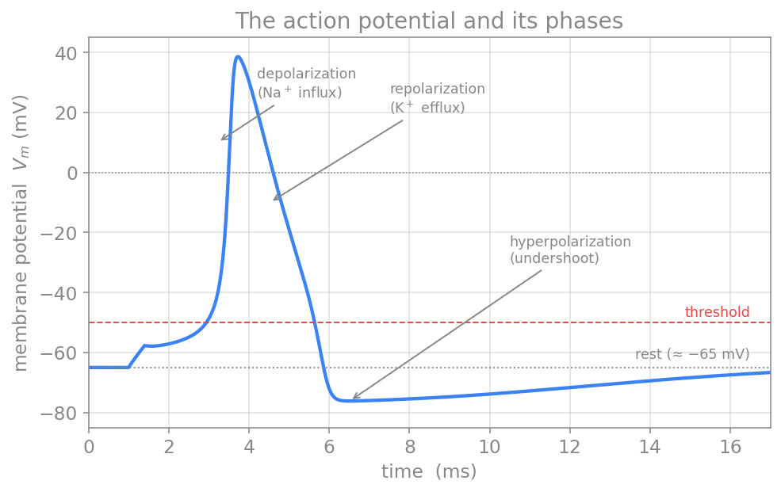
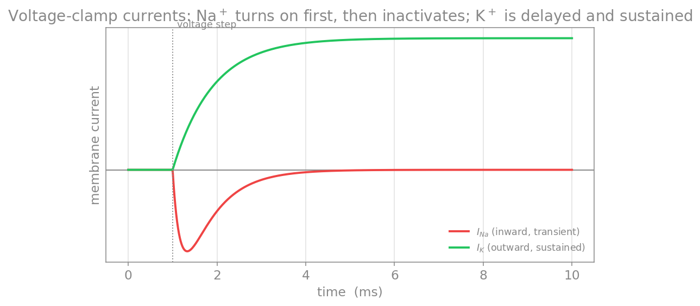
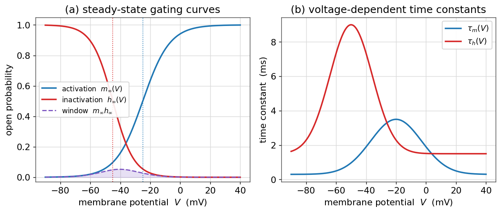

# پتانسیل عمل و انتشار

تا اینجا غشا را در رژیمِ **زیرآستانه** دیدیم، جایی که رفتارش خطی و مانندِ یک مدارِ RC بود. اما ویژگیِ تعیین‌کنندهٔ نورون، توانایی آن در تولیدِ **پتانسیلِ عمل** است: یک موجِ گذرا و بسیار سریع از وارونگیِ پتانسیلِ غشا که در امتدادِ آکسون منتشر می‌شود و پیامِ عصبی را حمل می‌کند. این فصل، تصویرِ **کیفیِ** پتانسیلِ عمل را کامل می‌کند و پلی می‌زند به مدلِ کمّیِ [هاجکین–هاکسلی](https://computational-neuroscience.ir/ch03/) که آن را به معادله بدل می‌کند.

???+ tip "در پایانِ این فصل خواهید توانست"
    - رفتارِ **همه‌یاهیچ** و مفهومِ **آستانه** را توضیح دهید.
    - سازوکارِ یونیِ پتانسیلِ عمل را به‌صورتِ یک **چرخهٔ بازخوردِ مثبت** و سپس مهارِ آن شرح دهید.
    - نقشِ **دورهٔ بی‌پاسخی** را در محدودکردنِ بسامد و یک‌سویه‌کردنِ انتشار دریابید.
    - **هدایتِ جهشی** و نقشِ میلین را توضیح دهید.

---

## آستانه و پاسخ همه‌یاهیچ

اگر غشا را اندکی **دپلاریزه** کنیم، تا وقتی از یک **آستانه** (نوعاً حدودِ ۵۵− میلی‌ولت) نگذشته‌ایم، تنها یک پاسخِ کوچکِ زیرآستانه می‌گیریم و غشا به استراحت بازمی‌گردد. اما به‌محضِ عبور از آستانه، یک پتانسیلِ عملِ کامل برانگیخته می‌شود. نکتهٔ کلیدی این است که **دامنهٔ پتانسیلِ عمل به شدتِ محرک بستگی ندارد**: محرکِ زیرآستانه هیچ اسپایکی نمی‌سازد، و هر محرکِ فراتر از آستانه اسپایکی با دامنهٔ تقریباً یکسان می‌سازد. به این ویژگی **همه‌یاهیچ** می‌گویند — و همان چیزی است که در فصلِ [تحریک‌پذیری](https://computational-neuroscience.ir/ch-dynamical-systems/ch-dynamics-07-neuro-excitability/) آن را به‌زبانِ سیستم‌های دینامیکی (نقطهٔ ثابت، آستانه، چرخهٔ حدی) بازخواندیم.

*پتانسیلِ عمل و فازهای آن: دپلاریزاسیونِ سریع (ورودِ سدیم)، رپلاریزاسیون (خروجِ پتاسیم)، و فرابیش‌قطبش پیش از بازگشت به استراحت. خط‌چینِ قرمز آستانه و خط‌چینِ خاکستری سطحِ استراحت را نشان می‌دهد.*

## سازوکارِ یونی: یک چرخهٔ بازخوردِ مثبت

پتانسیلِ عمل، نتیجهٔ رقصی دقیق میانِ دو دسته کانالِ وابسته به ولتاژ است. نخست، دپلاریزاسیونِ آغازین **کانال‌های سدیمیِ وابسته به ولتاژ** را می‌گشاید. چون \(E_{\text{Na}}\) بسیار مثبت است، سدیم به‌سرعت به درون سرازیر می‌شود و غشا را مثبت‌تر می‌کند؛ این خود کانال‌های سدیمیِ بیشتری را می‌گشاید، و چرخه خود را تقویت می‌کند. این **بازخوردِ مثبت** همان است که به پتانسیلِ عمل سرشتِ انفجاری و همه‌یاهیچ می‌دهد و \(V_m\) را به‌سوی \(E_{\text{Na}}\) بالا می‌برد — دقیقاً همان جابه‌جاییِ وزنِ یون‌ها که در [نمودارِ گلدمن](ch-biophysics-02-resting-potential.md) دیدیم.

اما این صعود متوقف می‌شود، به دو دلیلِ هم‌زمان:

- **غیرفعال‌شدنِ کانالِ سدیمی:** کانال‌های سدیمی پس از باز شدن، با تأخیری کوتاه به‌طورِ خودکار **غیرفعال** می‌شوند؛ دریچهٔ دومی جریانِ سدیم را می‌بندد، حتی اگر محرک هنوز برقرار باشد.
- **باز شدنِ کانالِ پتاسیمی:** **کانال‌های پتاسیمیِ وابسته به ولتاژ** (یکسوسازِ تأخیری) کندتر پاسخ می‌دهند و نزدیکِ قله باز می‌شوند؛ خروجِ پتاسیم، غشا را دوباره منفی می‌کند (**رپلاریزاسیون**).

چون کانال‌های پتاسیمی با تأخیر بسته می‌شوند، غشا اغلب مدتی کوتاه از استراحت هم منفی‌تر می‌شود — **فرابیش‌قطبش**. سپس کانال‌ها به حالتِ استراحت بازمی‌گردند.

## دورهٔ بی‌پاسخی

غیرفعال‌شدنِ کانالِ سدیمی پیامدی مهم دارد: بلافاصله پس از یک پتانسیلِ عمل، تا وقتی کانال‌های سدیمی از حالتِ غیرفعال بیرون نیامده‌اند، غشا نمی‌تواند اسپایکِ تازه‌ای تولید کند. این بازه را **دورهٔ بی‌پاسخی** (نسوز) می‌نامند. این دوره دو نقشِ کلیدی دارد: نخست، بسامدِ شلیک را به یک بیشینه محدود می‌کند؛ دوم، تضمین می‌کند که پتانسیلِ عمل تنها **رو به جلو** منتشر شود و به عقب بازنگردد.

## انتشارِ پتانسیلِ عمل

پتانسیلِ عمل در یک نقطه تولید می‌شود اما باید بدونِ افت در سراسرِ آکسون منتشر شود. سازوکار، **جریان‌های مدارِ محلی** است — همان جریان‌های محوریِ [نظریهٔ کابل](ch-biophysics-04-cable-compartments.md): ناحیه‌ای که وارونه شده با ناحیهٔ مجاورِ در حالِ استراحت اختلافِ پتانسیل دارد، و جریانِ محلی ناحیهٔ بعدی را تا آستانه دپلاریزه می‌کند. چون هر نقطه پتانسیلِ عمل را از نو می‌سازد، دامنهٔ سیگنال در طولِ مسیر کم نمی‌شود — برخلافِ افتِ نماییِ سیگنالِ **غیرفعال**. (این همان تفاوتِ کابلِ فعال و غیرفعال است، تمرینِ پایانیِ فصلِ کابل.)

## میلین و هدایتِ جهشی

در بسیاری از آکسون‌های مهره‌داران، غلافی عایق به نامِ **میلین** بخش‌هایی از آکسون را می‌پوشاند و مقاومتِ غشا را بالا و ظرفیتِ خازنی را پایین می‌برد. کانال‌های سدیمی تنها در شکاف‌های میانِ قطعاتِ میلین — **گره‌های رانویه** — متمرکزند، پس پتانسیلِ عمل به‌جای بازتولیدِ پیوسته، از گرهی به گرهِ بعد **می‌جهد**: **هدایتِ جهشی**.

*هدایتِ جهشی: کانال‌های سدیمی در گره‌های رانویه (قرمز) متمرکزند و پتانسیلِ عمل از گرهی به گرهِ بعد می‌جهد؛ در نتیجه هدایت بسیار سریع‌تر و کم‌هزینه‌تر می‌شود.*

میلین سرعتِ هدایت را بسیار بالا می‌برد (تا حدودِ ۱۲۰ متر بر ثانیه) و مصرفِ انرژی را کاهش می‌دهد. از دست رفتنِ میلین در بیماری‌هایی مانندِ ام‌اس هدایت را مختل می‌کند.

## چگونه این‌ها را اندازه می‌گیریم؟

دانشِ ما از این جریان‌ها، که پایهٔ مدلِ هاجکین–هاکسلی است، از چند روشِ تجربیِ هوشمندانه آمده. در **تثبیتِ ولتاژ** (voltage clamp)، آزمایشگر پتانسیل را در مقداری ثابت نگه می‌دارد و جریانِ لازم برای این کار را اندازه می‌گیرد — جریانی که دقیقاً قرینهٔ مجموعِ جریان‌های یونی است. هاجکین و هاکسلی با همین روش بر آکسونِ غول‌پیکرِ ماهیِ مرکب، جریانِ سدیم و پتاسیم را از هم جدا کردند.

*جریان‌های یک آزمایشِ تثبیتِ ولتاژ: با یک پلهٔ دپلاریزه‌کننده، نخست جریانِ سدیمِ روبه‌داخل (قرمز) به‌سرعت روشن و سپس غیرفعال می‌شود، و با تأخیر جریانِ پتاسیمِ روبه‌بیرون (سبز) روشن می‌ماند.*

روشِ دقیق‌ترِ **تثبیتِ قطعه** (patch clamp) رفتارِ تک‌کانال‌ها را آشکار می‌کند، و **تحلیلِ نوفه** پیش از آن اجازه می‌داد شمار و رساناییِ کانال‌ها را به‌صورتِ آماری برآورد کنند.

## به‌سوی مدلِ کمّی

همهٔ آنچه در این بخش ساختیم — غشای عایق، کانال‌های گزینشی، پتانسیل‌های تعادل، مدارِ RC، و کانال‌های وابسته به ولتاژ — اکنون آمادهٔ آن است که به یک مدلِ **کمّی** بدل شود. کافی است در معادلهٔ موازنهٔ جریانِ [فصلِ RC](ch-biophysics-03-passive-rc.md)، جریانِ نشتیِ خطی را با جریان‌های سدیم و پتاسیمِ **وابسته به ولتاژ** جایگزین کنیم.

اما «وابسته به ولتاژ» یعنی چه؟ رفتارِ یک کانالِ وابسته به ولتاژ را دو خانواده منحنی توصیف می‌کنند. نخست، **منحنی‌های حالتِ پایا**: احتمالِ بازبودنِ هر دریچه در هر ولتاژ، که شکلی **سیگموئید** (تابعِ بولتزمان) دارد — یک دریچهٔ **فعال‌ساز** (مانندِ \(m\)) با دپلاریزاسیون باز می‌شود و یک دریچهٔ **غیرفعال‌ساز** (مانندِ \(h\)) بسته می‌شود. دوم، **ثابت‌های زمانیِ** \(\tau(V)\) که می‌گویند هر دریچه چه‌قدر **کند** به تغییرِ ولتاژ پاسخ می‌دهد.

*متغیرهای دروازه‌ایِ یک کانالِ وابسته به ولتاژ. **چپ:** منحنی‌های حالتِ پایا؛ فعال‌سازیِ \(m_\infty(V)\) با دپلاریزاسیون بالا می‌رود و غیرفعال‌سازیِ \(h_\infty(V)\) پایین می‌آید. هم‌پوشانیِ کوچکِ آن‌ها (ناحیهٔ رنگی، «جریانِ پنجره‌ای») تنها بازه‌ای است که کانال می‌تواند پیوسته کمی باز بماند. **راست:** ثابت‌های زمانیِ \(\tau_m(V)\) و \(\tau_h(V)\)؛ چون \(\tau_m\) کوچک است، فعال‌سازیِ سدیم بسیار سریع‌تر از غیرفعال‌سازی رخ می‌دهد — و همین جدائیِ مقیاسِ زمانی است که به بازخوردِ مثبتِ بالا فرصتِ انفجار می‌دهد پیش از آنکه مهار برسد.*

اگر این منحنی‌ها را در معادلهٔ موازنهٔ جریان بگذاریم، به مدلِ [هاجکین–هاکسلی](https://computational-neuroscience.ir/ch03/) می‌رسیم — موضوعِ بخشِ بعد.

---

!!! example "تمرین‌ها"
    ۱. **همه‌یاهیچ.** چرا دامنهٔ پتانسیلِ عمل به شدتِ محرک بستگی ندارد، اما **بسامدِ** شلیک بستگی دارد؟ این را با ایدهٔ آستانه و دورهٔ بی‌پاسخی توضیح دهید.

    ۲. **دورهٔ بی‌پاسخی و بیشینهٔ بسامد.** اگر دورهٔ بی‌پاسخیِ مطلق حدودِ ۲ میلی‌ثانیه باشد، بیشینهٔ بسامدِ شلیک تقریباً چقدر است؟

    ۳. **میلین.** با استفاده از رابطهٔ ثابتِ طولِ \(\lambda=\sqrt{R_m/R_a}\) از فصلِ کابل، توضیح دهید چرا بالابردنِ \(R_m\) توسطِ میلین به هدایتِ سریع‌تر کمک می‌کند.

    ۴. **(پروژه)** با مدلِ [هاجکین–هاکسلی](https://computational-neuroscience.ir/ch03/)، رفتارِ همه‌یاهیچ و آستانه را به‌صورتِ عددی بازتولید کنید: جریان‌های زیرآستانه و فراآستانه را تزریق کنید و نشان دهید که تنها دومی یک اسپایک می‌سازد.
