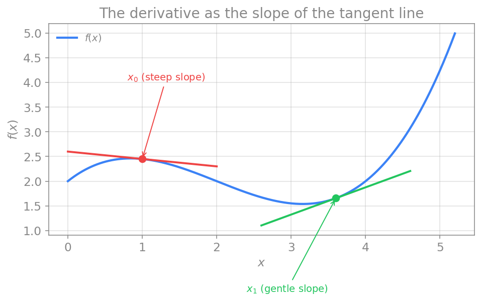
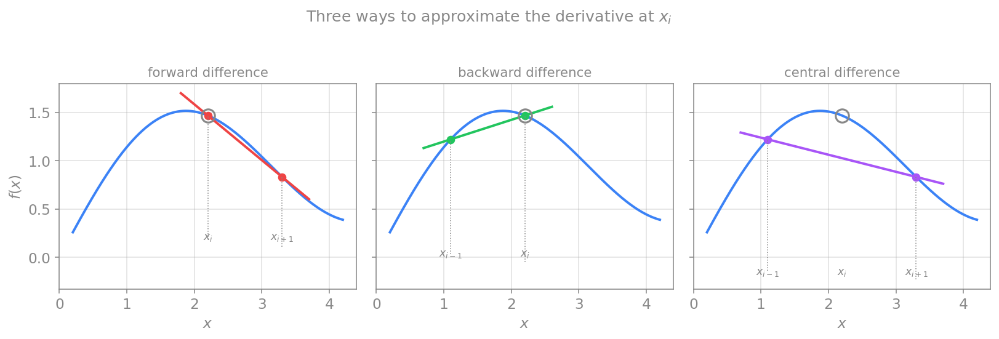

# مشتق اول

بسیاری از معادلاتی که در فصل پیش دیدیم، حولِ مفهومِ **مشتق** می‌چرخند. مشتق، آهنگِ تغییرِ یک کمیت را اندازه می‌گیرد: سرعت، آهنگِ تغییرِ مکان در زمان است؛ و $dV/dt$ در یک نورون، آهنگِ تغییرِ ولتاژ غشاست. برای حلِ عددیِ معادلات دیفرانسیل، نخست باید بدانیم چگونه می‌توان مشتق را به‌صورتِ عددی تقریب زد. این فصل به همین پرسش می‌پردازد.

## تعریف تحلیلی مشتق

در درس حسابان، مشتق را به‌صورتِ یک **حد** تعریف کردید. مشتقِ تابعِ $f(x)$ در نقطهٔ $x_0$ چنین است:

$$
\left.\frac{df}{dx}\right|_{x_0} = f'(x_0) = \lim_{x \to x_0}\frac{f(x) - f(x_0)}{x - x_0}.
$$

این تعریف، شیبِ خطی را که دو نقطهٔ $\big(x_0, f(x_0)\big)$ و $\big(x, f(x)\big)$ را به هم وصل می‌کند (خطِ قاطع) به‌دست می‌دهد، و سپس فاصلهٔ این دو نقطه را آن‌قدر کوچک می‌کند که به صفر میل کند. در این حدّ، خطِ قاطع به **خطِ مماس** تبدیل می‌شود و شیبِ آن، همان مشتق است.

<figure markdown="span">
  
  <figcaption>مشتق به‌مثابهٔ شیبِ خطِ مماس. شیب در x₀ تندتر از شیب در x₁ است، یعنی تابع در x₀ سریع‌تر تغییر می‌کند.</figcaption>
</figure>

**مشتق نمایندهٔ چیست؟** یک آهنگِ تغییر. در شکلِ بالا، مشتق در دو نقطهٔ مختلف به‌صورتِ شیبِ مماس نشان داده شده است؛ دیده می‌شود که آهنگِ تغییر در $x_0$ بزرگ‌تر از آهنگِ تغییر در $x_1$ است. مشتق می‌تواند نسبت به مکان، زمان، یا هر متغیرِ مستقلِ دیگری تعریف شود.

## چرا گام نمی‌تواند صفر شود

اینجا به یک محدودیتِ بنیادیِ محاسبهٔ عددی می‌رسیم. تعریفِ تحلیلی به یک **حد** نیاز دارد، یعنی فاصلهٔ $x - x_0$ باید به‌سمتِ صفر میل کند. اما رایانه نمی‌تواند چنین حدّی را بگیرد؛ تقسیم بر صفر معنا ندارد و رایانه تنها می‌تواند با فاصله‌های **محدود و ناصفر** کار کند. بنابراین در محاسبهٔ عددی، به‌جای گرفتنِ حد، فاصله را کوچک اما **محدود** نگه می‌داریم و مشتق را تقریب می‌زنیم:

$$
f'(x_0) \approx \frac{f(x) - f(x_0)}{\Delta x}, \qquad \Delta x = x - x_0.
$$

این تقریب، شیبِ خطِ قاطع است (نه خطِ مماس). هرچه $\Delta x$ کوچک‌تر باشد، خطِ قاطع به خطِ مماس نزدیک‌تر می‌شود و تقریب دقیق‌تر می‌گردد، اما هرگز به‌طورِ کامل با آن یکی نمی‌شود. این تفاوتِ میانِ خطِ قاطع و خطِ مماس، سرچشمهٔ خطایی است که در فصل‌های بعد، با کمکِ بسطِ تیلور، آن را به‌دقت اندازه خواهیم گرفت.

## آزادیِ عددی در محاسبهٔ مشتق

در تعریفِ بالا، تقریبِ مشتق را با دو نقطه ساختیم: نقطه‌ای که مشتق در آن ارزیابی می‌شود و نقطه‌ای جلوتر از آن. اما این تنها انتخابِ ممکن نیست. اگر نقطه‌ای را که مشتق در آن می‌خواهیم با $x_i$ و نقاطِ مجاورِ آن را با $x_{i-1}$ (نقطهٔ پیشین) و $x_{i+1}$ (نقطهٔ پسین) نشان دهیم، سه راهِ ساده برای تقریبِ مشتق با دو نقطه وجود دارد.

تفاضلِ **پیشرو** از نقطهٔ کنونی و نقطهٔ پسین استفاده می‌کند:

$$
\left.\frac{df}{dx}\right|_{x_i} \approx \frac{f(x_{i+1}) - f(x_i)}{x_{i+1} - x_i}.
$$

تفاضلِ **پسرو** از نقطهٔ پیشین و نقطهٔ کنونی استفاده می‌کند:

$$
\left.\frac{df}{dx}\right|_{x_i} \approx \frac{f(x_i) - f(x_{i-1})}{x_i - x_{i-1}}.
$$

و تفاضلِ **مرکزی** از دو نقطهٔ طرفینِ نقطهٔ کنونی استفاده می‌کند:

$$
\left.\frac{df}{dx}\right|_{x_i} \approx \frac{f(x_{i+1}) - f(x_{i-1})}{x_{i+1} - x_{i-1}}.
$$

<figure markdown="span">
  
  <figcaption>سه راهِ تقریبِ مشتق در نقطهٔ xᵢ (دایرهٔ توخالی): تفاضلِ پیشرو با xᵢ و xᵢ₊₁، تفاضلِ پسرو با xᵢ₋₁ و xᵢ، و تفاضلِ مرکزی با xᵢ₋₁ و xᵢ₊₁. هر خط، شیبِ تقریب‌زده را نشان می‌دهد.</figcaption>
</figure>

همان‌طور که از شکل پیداست، هر سه تقریب شیبِ خطِ قاطعی را می‌دهند که از دو نقطهٔ انتخابی می‌گذرد، اما این شیب‌ها اندکی با هم و با شیبِ واقعیِ مماس در $x_i$ تفاوت دارند. به‌طورِ شهودی، تفاضلِ مرکزی، که نقطهٔ موردِ نظر را در میان دو نقطهٔ متقارن قرار می‌دهد، معمولاً تقریبِ بهتری از دو روشِ دیگر به‌دست می‌دهد؛ دلیلِ دقیقِ این برتری را در فصلِ بسطِ تیلور خواهیم دید.

## نگاهی به جلو

در این فصل دیدیم که مشتق یک آهنگِ تغییر است و چون رایانه نمی‌تواند حدِ واقعی بگیرد، آن را با تفاضلِ مقادیرِ تابع روی فاصله‌ای محدود تقریب می‌زنیم، و برای این کار سه گزینهٔ پیشرو، پسرو و مرکزی داریم. دو پرسش هنوز باز مانده است: این نقاطِ $x_i$ را چگونه روی دامنه بچینیم (موضوعِ فصلِ **روش تفاضل محدود**)، و خطای هر یک از این تقریب‌ها دقیقاً چقدر است و چرا تفاضلِ مرکزی دقیق‌تر است (موضوعِ فصلِ **بسط تیلور**). این دو پرسش را در فصل‌های بعد دنبال می‌کنیم.
