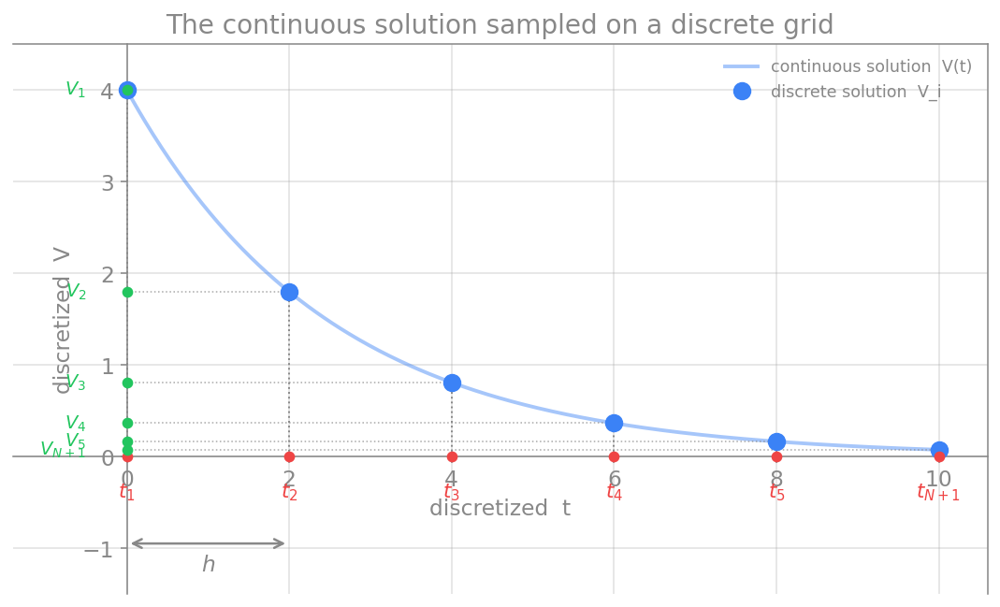

# روش تفاضل محدود

در دو فصل پیش دیدیم که مشتق چیست و چگونه می‌توان آن را با تفاضل‌های عددی (پیشرو، پسرو و مرکزی) تقریب زد. اکنون می‌خواهیم از این ابزار برای حلِ خودِ معادلات دیفرانسیل استفاده کنیم. روشی که در این فصل معرفی می‌کنیم، **روش تفاضل محدود** (Finite Difference Method، به‌اختصار FDM) نام دارد.

## ایدهٔ اصلی

برای روشن‌شدن، یک معادلهٔ دیفرانسیلِ آشنا را در نظر می‌گیریم. واهلشِ ولتاژ غشای یک نورونِ ساده، وقتی ورودی‌ای ندارد، با این معادله توصیف می‌شود:

$$
\frac{dV}{dt} = -\frac{V}{\tau},
$$

که در آن $V$ ولتاژ غشا و $\tau$ ثابتِ زمانیِ غشاست. این یک معادلهٔ دیفرانسیل است، چون مشتقِ $V$ نسبت به زمان در آن ظاهر می‌شود. می‌خواهیم ببینیم چگونه می‌توان چنین معادله‌ای را به‌صورت عددی و تقریبی حل کرد.

**ایدهٔ بنیادیِ روش تفاضل محدود این است: مشتق‌های موجود در معادلهٔ دیفرانسیل را با تفاضل‌های عددی جایگزین کنیم.** درست همان تفاضل‌های پیشرو، پسرو یا مرکزی که در فصل پیش دیدیم. با این جایگزینی، یک اتفاق مهم می‌افتد: معادلهٔ دیفرانسیل، که دربارهٔ مشتق‌ها و کمیت‌های پیوسته بود، به یک **معادلهٔ جبری** تبدیل می‌شود که تنها شاملِ جمع و تفریق و ضربِ مقادیر در چند نقطه است. به این فرایندِ تبدیلِ معادلهٔ پیوسته به فرمِ جبریِ گسسته، **گسسته‌سازی** (discretization) می‌گویند.

در مثالِ ما، آهنگِ تغییرِ ولتاژ، یعنی $\frac{dV}{dt}$، را با یکی از تفاضل‌های عددی تقریب می‌زنیم. معادلهٔ حاصل را می‌توان برای یافتنِ ولتاژ در گامِ زمانیِ بعدی حل کرد. به این ترتیب، به‌جای یک فرمولِ پیوسته، مقدارِ ولتاژ را گام‌به‌گام جلو می‌بریم.

## گسسته‌سازیِ دامنه

اگر این روش را به کار ببندیم، دیگر یک **پاسخِ پیوسته** نخواهیم داشت، بلکه پاسخ را تنها در شمارِ محدودی از نقاط به‌دست می‌آوریم. بنابراین نخست باید **دامنهٔ حل** را تعریف کنیم.

برای مثالِ ما، یک زمانِ آغازین و یک زمانِ پایانی، یعنی بازهٔ $[a,b]$، لازم است؛ به $a$ و $b$ **نقاط انتهایی** می‌گویند. دامنهٔ میانِ این دو را به $N$ زیربازهٔ مساوی تقسیم می‌کنیم. طولِ هر زیربازه، که آن را **گامِ شبکه** می‌نامیم، چنین است:

$$
h = \frac{b-a}{N}.
$$

<figure markdown="span">
  
  <figcaption>پاسخِ پیوسته V(t) روی شبکه‌ای گسسته نمونه‌برداری می‌شود. محورِ زمان به گره‌های t₁ تا  t₍ₙ₊₁₎ با گامِ h تقسیم می‌شود (نقاط قرمز)، و در هر گره یک مقدارِ گسستهٔ Vᵢ به‌دست می‌آید (نقاط سبز روی محورِ عمودی). روش تفاضل محدود همین مقادیرِ گسسته را محاسبه می‌کند.</figcaption>
</figure>

نقاطِ روی این شبکه، که آن‌ها را با $t_i$ نشان می‌دهیم، **گره** (node) نامیده می‌شوند و این ترتیب میانشان برقرار است:

$$
a = t_1 < t_2 < \cdots < t_N < t_{N+1} = b.
$$

نکته‌ای دربارهٔ نمایه‌گذاری: انتخابِ شمارهٔ گره‌ها با خودِ ماست. در شکلِ بالا نمایه از $1$ آغاز شده است، یعنی $i = 1, 2, \ldots, N, N+1$. اما می‌توان نمایه را از $0$ نیز آغاز کرد، یعنی $i = 0, 1, \ldots, N-1, N$. هر دو شیوه درست‌اند، تنها باید در سراسرِ محاسبه یکدست بمانیم.

## فرمِ گسستهٔ معادله

اکنون معادلهٔ بالا را ساده می‌نویسیم و آن را در فرمِ استانداردِ یک معادلهٔ دیفرانسیلِ معمولی قرار می‌دهیم:

$$
\frac{dV}{dt} = f,
$$

که در آن $f$ سمتِ راستِ معادله است (در مثالِ ما $f = -V/\tau$). این معادله را می‌توان به فرمِ گسسته بازنویسی کرد:

$$
V'_i = f_i.
$$

در اینجا $V'_i$ مشتقِ اولِ ولتاژ در گرهِ $i$ است و در آن گره برابر با مقدارِ تابعِ $f_i$ است. هدفِ ما این است که با روش تفاضل محدود، مقدارِ پاسخِ $V_i$ را در هر گرهِ $t_i$ به‌صورت عددی محاسبه کنیم.

اما هنوز یک حلقهٔ مفقوده وجود دارد: پیوندِ میانِ مشتقِ $V'_i$ و مقادیرِ $V$ در گره‌های مجاور. این پیوند را با کمکِ **بسط تیلور** برقرار می‌کنیم، که هم به ما می‌گوید چگونه مشتق را بر حسبِ مقادیرِ گره‌ای بنویسیم و هم خطای این تقریب را دقیقاً مشخص می‌کند. بسط تیلور، موضوعِ فصلِ بعد است.

## جمع‌بندی

روش تفاضل محدود، یک معادلهٔ دیفرانسیل را با جایگزینیِ مشتق‌ها با تفاضل‌های عددی به یک معادلهٔ جبریِ گسسته تبدیل می‌کند. برای این کار، نخست دامنهٔ حل را به شبکه‌ای از گره‌ها با گامِ $h$ تقسیم می‌کنیم، سپس معادله را در هر گره به فرمِ گسسته می‌نویسیم. آنچه باقی می‌ماند، یافتنِ رابطهٔ دقیقِ میانِ مشتق در یک گره و مقادیرِ تابع در گره‌های همسایه است؛ و این، همان کاری است که بسط تیلور در فصلِ بعد برای ما انجام می‌دهد. هنگامی که این رابطه را به‌دست آوریم، می‌توانیم مدل‌های واقعیِ نورونی، از نورونِ ساده تا هاجکین–هاکسلی، را گام‌به‌گام در زمان حل کنیم.
