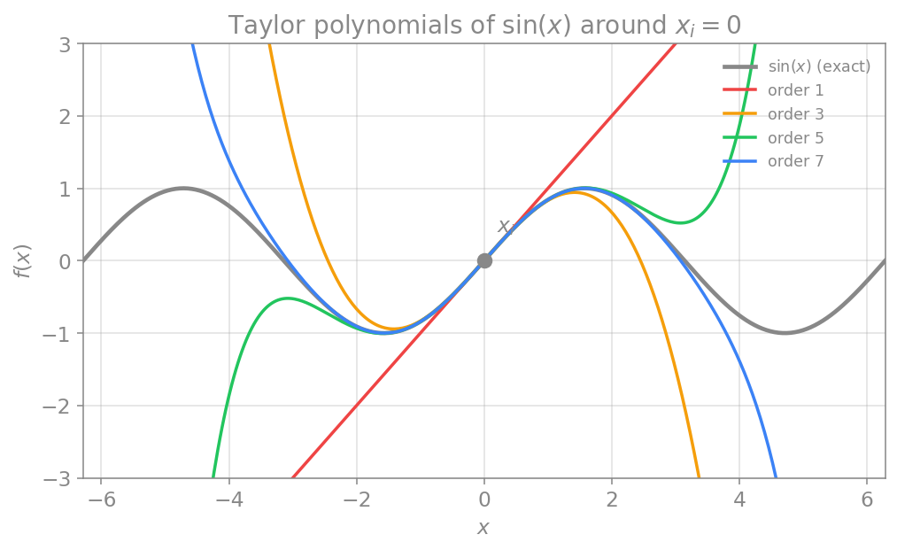

# بسط تیلور

در فصل‌های پیش، سه تقریبِ مشتق (پیشرو، پسرو و مرکزی) را معرفی کردیم و گفتیم که هر یک خطایی دارد و تفاضلِ مرکزی دقیق‌تر است، اما دلیلِ این ادعاها را نگفتیم. این فصل، آن حلقهٔ مفقوده را پر می‌کند. ابزارِ کار، **بسط تیلور** است که هم به ما می‌گوید چگونه تقریب‌های مشتق را بسازیم و هم **خطای** هر یک را دقیقاً مشخص می‌کند.

## تعریف

ایدهٔ بنیادیِ بسط تیلور این است: هر تابع را می‌توان در همسایگیِ یک نقطه با یک **چندجمله‌ای** تقریب زد. این تقریب سودمند است، چون چندجمله‌ای‌ها توابعِ «دست‌و‌دل‌بازی» هستند؛ ارزیابی، مشتق‌گیری و انتگرال‌گیریِ آن‌ها آسان است.

بسطِ تیلورِ یک تابعِ دلخواهِ $f(x)$ حولِ نقطهٔ $x = x_i$ چنین است:

$$
f(x) = f(x_i) + (x - x_i)f'(x_i) + \frac{(x-x_i)^2}{2!}f''(x_i) + \frac{(x-x_i)^3}{3!}f'''(x_i) + \cdots
$$

ساختارِ این جمله‌ها معنادار است. جملهٔ نخست، صرفاً مقدارِ خودِ تابع در نقطهٔ $x_i$ است. جملهٔ دوم، شیبِ چندجمله‌ای را برابرِ شیبِ تابعِ $f$ در آن نقطه می‌کند. هر جملهٔ بعدی، یک مشتقِ مرتبهٔ بالاترِ چندجمله‌ای را با مشتقِ متناظرِ تابع برابر می‌کند. به این ترتیب، هرچه جمله‌های بیشتری نگه داریم، چندجمله‌ای در بازهٔ وسیع‌تری به تابع نزدیک می‌ماند.

<figure markdown="span">
  
  <figcaption>چندجمله‌ای‌های تیلورِ تابعِ sin(x) حولِ نقطهٔ xᵢ=0 با مرتبه‌های فزاینده. هرچه مرتبه بالاتر باشد، تقریب بهتر است؛ اما هرچه از نقطهٔ بسط (xᵢ) دورتر شویم، خطا بزرگ‌تر می‌شود. تقریبِ مرتبهٔ یک، یک خطِ راست است.</figcaption>
</figure>

از این شکل دو نتیجهٔ مهم به‌دست می‌آید: نخست آنکه با افزایشِ مرتبه (تعدادِ جمله‌ها) تقریب بهتر می‌شود؛ و دوم آنکه هرچه از نقطهٔ بسط دورتر شویم، خطا بزرگ‌تر می‌گردد.

کدِ زیر، چندجمله‌ای تیلورِ تابعِ سینوس را تا مرتبهٔ دلخواه حولِ نقطهٔ $x_i$ می‌سازد. مشتقِ $n$اُمِ سینوس به‌صورتِ دوره‌ای میانِ $\sin$، $\cos$، $-\sin$ و $-\cos$ تکرار می‌شود:

```python
import numpy as np
import math

def sine_derivative(x, n):
    # nth derivative of sin(x) cycles every 4 steps
    k = n % 4
    if k == 0:
        return np.sin(x)
    elif k == 1:
        return np.cos(x)
    elif k == 2:
        return -np.sin(x)
    else:
        return -np.cos(x)

def taylor_sine(x, xi, order):
    # Taylor polynomial of sin(x) around xi, up to the given order
    result = 0.0
    for n in range(order + 1):
        term = (x - xi)**n / math.factorial(n) * sine_derivative(xi, n)
        result = result + term
    return result

# compare orders 1, 3, 5, 7 at a point far from the expansion point
x = 3.0
xi = 0.0
print("exact sin(3.0) =", round(np.sin(x), 5))
for order in [1, 3, 5, 7]:
    approx = taylor_sine(x, xi, order)
    print(f"order {order}: {approx:8.5f}")
```

## خطای برش

بسطِ تیلور تنها زمانی **دقیق** است که بی‌نهایت جمله را نگه داریم. اما در عمل ناچاریم بسط را در جایی **قطع** کنیم و تنها چند جملهٔ نخست را نگه داریم؛ یعنی به یک **تقریب** بسنده می‌کنیم. اگر فاصلهٔ میانِ نقطهٔ معلوم و نقطهٔ مطلوب را با $\Delta x = x - x_i$ نشان دهیم، بسط را می‌توان چنین بازنویسی کرد:

$$
f(x_i + \Delta x) = f(x_i) + \Delta x\, f'(x_i) + \frac{\Delta x^2}{2!}f''(x_i) + \frac{\Delta x^3}{3!}f'''(x_i) + \mathcal{O}(\Delta x^4).
$$

نمادِ $\mathcal{O}(\Delta x^4)$ به این معناست که جمله‌های مرتبهٔ چهارم و بالاتر را کنار گذاشته‌ایم؛ به این کنارگذاشتن، **خطای برش** (truncation error) می‌گویند و مرتبهٔ آن در اینجا چهار است. نتیجهٔ کلیدی این است: **هرچه گامِ $\Delta x$ بزرگ‌تر باشد، خطا بزرگ‌تر است.** این همان توازنی است که در حلِ عددی همواره با آن روبه‌روییم؛ گامِ کوچک‌تر دقت را بالا می‌برد اما محاسبات را بیشتر می‌کند.

!!! tip "نمادگذاری"
    از این پس $\Delta x$ را زیاد به کار می‌بریم. خوب است به یاد داشته باشیم که این تنها راهی دیگر برای نوشتنِ افزایشِ کوچک است؛ برای مثال $f(x_{i+1}) = f(x_i + \Delta x)$ و $f(x_{i+2}) = f(x_i + 2\Delta x)$.

!!! note "مثال: محاسبهٔ ‪e^{0.2}‬ با سه جملهٔ بسط تیلور"
    می‌خواهیم $e^{0.2}$ را با سه جملهٔ بسط تیلور حولِ $x_i = 0$ تقریب بزنیم. چون $e^{x_i + \Delta x} = e^{0.2}$، داریم $\Delta x = 0.2$. برای تابعِ نمایی، همهٔ مشتق‌ها در صفر برابرِ یک‌اند، پس:

    $$
    e^{0.2} \approx 1 + \Delta x + \frac{\Delta x^2}{2} + \frac{\Delta x^3}{6} \approx 1 + 0.2 + 0.02 + 0.00133 = 1.22133.
    $$

    مقدارِ دقیق $e^{0.2} \approx 1.2214$ است؛ پس تنها با سه جمله، تقریبی بسیار خوب به‌دست آمد.

## استخراج مشتق اول از بسط تیلور

اکنون به هدفِ اصلی می‌رسیم: استفاده از بسط تیلور برای ساختنِ تقریب‌های مشتق و یافتنِ خطای آن‌ها.

### تفاضل پیشرو و پسرو

نکتهٔ کلیدی این است که در بسط تیلور، تنها به مقدارِ تابع و مشتق‌هایش در نقطهٔ $x_i$ نیاز داریم. حال بسط را در نقطهٔ $x_{i+1} = x_i + \Delta x$، یعنی اندکی سمتِ راستِ $x_i$، می‌نویسیم:

$$
f(x_{i+1}) = f(x_i) + \Delta x\, f'(x_i) + \frac{\Delta x^2}{2!}f''(x_i) + \frac{\Delta x^3}{3!}f'''(x_i) + \cdots
$$

این رابطه را برای مشتقِ اول حل می‌کنیم:

$$
f'(x_i) = \frac{f(x_i + \Delta x) - f(x_i)}{\Delta x} - \frac{\Delta x}{2!}f''(x_i) - \frac{\Delta x^2}{3!}f'''(x_i) - \cdots
$$

اگر جمله‌های شاملِ مشتقِ دوم و بالاتر را قطع کنیم (تا از محاسبهٔ آن‌ها بپرهیزیم)، به **تفاضلِ پیشرو** می‌رسیم:

$$
f'(x_i) = \frac{f(x_i + \Delta x) - f(x_i)}{\Delta x} + \mathcal{O}(\Delta x).
$$

این دقیقاً همان فرمولی است که در فصلِ مشتق اول دیدیم، اما اکنون چیزِ تازه‌ای هم می‌دانیم: خطای آن از مرتبهٔ $\Delta x$ است.

به‌همین شیوه، اگر بسط را در نقطهٔ $x_{i-1} = x_i - \Delta x$ بنویسیم و حل کنیم، به **تفاضلِ پسرو** می‌رسیم که آن نیز خطایی از مرتبهٔ $\Delta x$ دارد:

$$
f'(x_i) = \frac{f(x_i) - f(x_i - \Delta x)}{\Delta x} + \mathcal{O}(\Delta x).
$$

### تفاضل مرکزی

اکنون می‌توانیم ببینیم **چرا** تفاضلِ مرکزی دقیق‌تر است. اگر دو رابطهٔ کاملِ پیشرو و پسرو را با هم جمع کنیم، اتفاقِ جالبی می‌افتد:

$$
f'(x_i) = \frac{f(x_{i+1}) - f(x_i)}{\Delta x} - \frac{\Delta x}{2!}f''(x_i) - \cdots
$$

$$
f'(x_i) = \frac{f(x_i) - f(x_{i-1})}{\Delta x} + \frac{\Delta x}{2!}f''(x_i) - \cdots
$$

جمله‌های شاملِ مشتقِ دوم، علامتِ مخالف دارند و **یکدیگر را حذف می‌کنند**. با جمعِ دو رابطه و تقسیم بر دو، به تفاضلِ مرکزی می‌رسیم:

$$
f'(x_i) = \frac{f(x_{i+1}) - f(x_{i-1})}{2\Delta x} + \mathcal{O}(\Delta x^2).
$$

چون جمله‌های مرتبهٔ اولِ خطا حذف شدند، **خطای تفاضلِ مرکزی از مرتبهٔ توانِ دومِ گام است**، یعنی $\mathcal{O}(\Delta x^2)$. از آنجا که $\Delta x$ کوچک است، توانِ دومِ آن بسیار کوچک‌تر از خودِ آن است؛ پس تفاضلِ مرکزی به‌مراتب دقیق‌تر از پیشرو یا پسرو است. این همان برتری‌ای است که در فصلِ پیش به‌صورتِ شهودی دیدیم و اکنون اثباتِ آن را داریم.

سه تابعِ زیر، این سه تقریب را پیاده‌سازی می‌کنند:

```python
def forward_difference(f, x, dx):
    return (f(x + dx) - f(x)) / dx

def backward_difference(f, x, dx):
    return (f(x) - f(x - dx)) / dx

def central_difference(f, x, dx):
    return (f(x + dx) - f(x - dx)) / (2 * dx)
```

برای آنکه ادعای مرتبهٔ دقت را به‌چشم ببینیم، مشتقِ $\sin(x)$ را در نقطهٔ $x=1$ تقریب می‌زنیم (که مقدارِ دقیقِ آن $\cos(1)$ است) و خطا را برای چند گامِ کوچک‌شونده می‌سنجیم:

```python
import numpy as np

def f(x):
    return np.sin(x)

df_exact = np.cos(1.0)   # exact derivative of sin at x = 1

print(f"{'dx':>8} {'forward error':>16} {'central error':>16}")
for dx in [0.1, 0.05, 0.025, 0.0125]:
    ef = abs(forward_difference(f, 1.0, dx) - df_exact)
    ec = abs(central_difference(f, 1.0, dx) - df_exact)
    print(f"{dx:8.4f} {ef:16.3e} {ec:16.3e}")
```

با هر بار نصف‌کردنِ گام، خطای تفاضلِ پیشرو تقریباً **نصف** می‌شود (نشانهٔ مرتبهٔ یک)، اما خطای تفاضلِ مرکزی تقریباً به **یک‌چهارم** می‌رسد (نشانهٔ مرتبهٔ دو). همین رفتار، تأییدِ عددیِ همان چیزی است که با بسط تیلور اثبات کردیم.

## مشتق دوم

برخی معادلات به مشتقِ دوم نیاز دارند؛ نمونهٔ مهمِ آن، معادلهٔ پخش است (که در علوم اعصاب در معادلهٔ کابلیِ دندریت ظاهر می‌شود):

$$
\frac{\partial f}{\partial t} = v\,\frac{\partial^2 f}{\partial x^2},
$$

که در آن $v$ ضریبِ پخش است. با همان روشِ بسط تیلور می‌توان یک تقریبِ عددی برای مشتقِ دوم ساخت. ایده این است که جمله‌های شاملِ مشتقِ اول را حذف کنیم و تنها مشتقِ دوم را جدا نگه داریم. نتیجه، تقریبِ **پیشروی** مشتقِ دوم است:

$$
f''(x_i) = \frac{f(x_i + 2\Delta x) - 2f(x_i + \Delta x) + f(x_i)}{\Delta x^2} + \mathcal{O}(\Delta x).
$$

دو نکته در اینجا دیده می‌شود: نخست آنکه برای محاسبهٔ مشتقِ دوم به یک نقطهٔ بیشتر نیاز داریم؛ دوم آنکه خطای ساده‌ترین صورتِ آن نیز از مرتبهٔ گام است. صورت‌های **پسرو** و **مرکزی** مشتقِ دوم نیز وجود دارند که در اینجا نمی‌آوریم.

## تقریب‌های دقیق‌تر

تا اینجا، به‌جز تفاضلِ مرکزی، بیشترِ تقریب‌ها خطایی نسبتاً بزرگ از مرتبهٔ $\mathcal{O}(\Delta x)$ داشتند. گاه به دقتِ بالاتری نیاز داریم. با همان شیوهٔ دستکاریِ جبریِ چند بسطِ تیلور در فاصله‌های مختلف، می‌توان به تقریب‌های دقیق‌تر رسید. برای نمونه، تقریبِ پیشروی دقیق‌ترِ مشتقِ اول چنین است:

$$
f'(x_i) = \frac{-f(x_i + 2\Delta x) + 4f(x_i + \Delta x) - 3f(x_i)}{2\Delta x} + \mathcal{O}(\Delta x^2).
$$

دقت از $\mathcal{O}(\Delta x)$ به $\mathcal{O}(\Delta x^2)$ بهبود یافته، اما بهایِ آن استفاده از یک نقطهٔ بیشتر است. با افزودنِ نقاطِ بیشتر می‌توان دقت را باز هم بالا برد. نکتهٔ مهم آنکه با شمارِ یکسانی از نقاط، تفاضل‌های مرکزی همواره دقیق‌تر از پیشرو و پسرو هستند.

## جمع‌بندی

بسط تیلور، شالودهٔ همهٔ روش‌های تفاضل محدود است. این بسط، یک تابع را با چندجمله‌ای تقریب می‌زند، و با قطع‌کردنِ آن، هم تقریب‌های مشتق (پیشرو، پسرو، مرکزی) را به‌دست می‌دهد و هم خطای دقیقِ هر یک را مشخص می‌کند. دیدیم که تفاضل‌های پیشرو و پسرو خطایی از مرتبهٔ $\mathcal{O}(\Delta x)$ دارند، حال‌آنکه تفاضلِ مرکزی، به‌سببِ حذفِ جمله‌های مرتبهٔ اولِ خطا، دقتِ $\mathcal{O}(\Delta x^2)$ دارد. همچنین دیدیم که می‌توان تقریب‌هایی برای مشتق‌های مرتبهٔ بالاتر و با دقتِ بیشتر ساخت، به‌بهایِ استفاده از نقاطِ بیشتر. اکنون که می‌دانیم چگونه مشتق‌ها را با دقتِ معلوم تقریب بزنیم، در فصل‌های بعد آماده‌ایم که معادلات دیفرانسیلِ واقعی، از مدلِ نورونِ ساده تا هاجکین–هاکسلی، را به‌صورت عددی حل کنیم.
