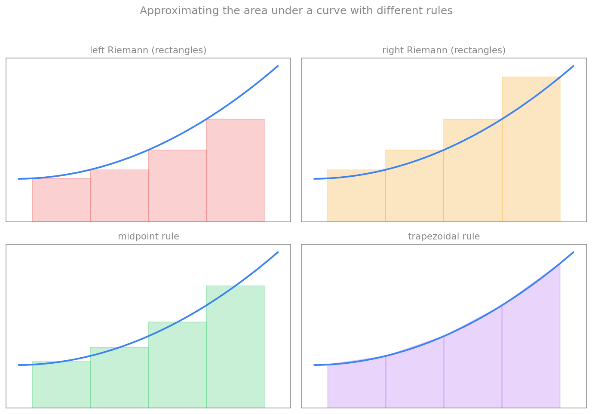

# انتگرال‌گیری عددی

در فصل‌های پیش دیدیم چگونه مشتق را به‌صورت عددی تقریب بزنیم. اکنون به عملِ معکوس می‌پردازیم: **انتگرال‌گیری عددی**. در بسیاری از مسائلِ علمی و مهندسی، انتگرالِ تحلیلیِ یک تابع در دست نیست و باید آن را به‌صورت عددی تقریب بزنیم. برای نمونه، اگر یک کمیتِ فیزیکی، انتگرالِ کمیت‌های اندازه‌گیری‌شدهٔ دیگری باشد، اغلب تنها داده‌های گسسته در اختیار داریم و انتگرال را باید از روی همان داده‌ها برآورد کنیم. در علوم اعصاب نیز، برای مثال، شمارِ کلِ بارِ الکتریکیِ واردشده به نورون در طولِ یک پتانسیل عمل، انتگرالِ جریان نسبت به زمان است.

## انتگرال به‌مثابهٔ مساحت زیر منحنی

در حالتِ یک‌بعدی، انتگرالِ

$$
I = \int_a^b f(x)\,dx
$$

نمایندهٔ **مساحتِ زیرِ منحنیِ** $f$ در بازهٔ $[a,b]$ است. یک راهِ شهودی برای تقریبِ این مساحت، تقسیمِ ناحیه به مستطیل‌ها یا شکل‌های سادهٔ دیگر و جمع‌کردنِ مساحتِ آن‌هاست. هرچه این شکل‌ها ریزتر و بهتر منطبق بر منحنی باشند، تقریب دقیق‌تر است.

ایدهٔ کلیِ همهٔ روش‌های انتگرال‌گیریِ عددی (که به آن‌ها فرمول‌های نیوتن–کاتس می‌گویند) سه گام دارد: نخست بازهٔ $[a,b]$ را به چند زیربازه تقسیم می‌کنیم؛ سپس در هر زیربازه، تابع را با یک چندجمله‌ای ساده جایگزین می‌کنیم و مساحتِ زیرِ آن را حساب می‌کنیم؛ و سرانجام همهٔ مساحت‌ها را با هم جمع می‌زنیم. تفاوتِ روش‌ها در این است که از چه نوع چندجمله‌ای و کدام نقاط استفاده می‌کنند.

<figure markdown="span">
  
  <figcaption>تقریبِ مساحتِ زیرِ منحنی با چهار قاعدهٔ گوناگون. ریمانِ چپ ارتفاع را از نقطهٔ چپِ هر بازه می‌گیرد و در این منحنیِ صعودی کم‌برآورد می‌کند؛ ریمانِ راست از نقطهٔ راست و بیش‌برآورد می‌کند؛ نقطهٔ میانی و ذوزنقه‌ای بسیار بهتر بر منحنی منطبق‌اند.</figcaption>
</figure>

## قاعده‌های انتگرال‌گیری

در همهٔ فرمول‌های زیر، بازهٔ $[a,b]$ را به $n$ زیربازهٔ مساوی با طولِ $\Delta x = (b-a)/n$ تقسیم می‌کنیم و نقاطِ شبکه را با $x_i$ نشان می‌دهیم.

### ریمان چپ و راست

ساده‌ترین قاعده، چندجمله‌ای از مرتبهٔ صفر (یک مقدارِ ثابت) را در هر زیربازه به کار می‌برد؛ یعنی مساحتِ هر زیربازه را با یک **مستطیل** تقریب می‌زند. اگر ارتفاعِ مستطیل را از نقطهٔ **چپِ** هر زیربازه بگیریم، به **ریمانِ چپ** می‌رسیم:

$$
\int_a^b f(x)\,dx \approx \sum_{i=0}^{n-1} f(x_i)\,\Delta x.
$$

و اگر ارتفاع را از نقطهٔ **راست** بگیریم، به **ریمانِ راست** می‌رسیم:

$$
\int_a^b f(x)\,dx \approx \sum_{i=0}^{n-1} f(x_{i+1})\,\Delta x.
$$

### قاعدهٔ نقطهٔ میانی

در این قاعده، ارتفاعِ مستطیل را در **نقطهٔ میانیِ** هر زیربازه می‌گیریم. این انتخاب، بخشی از کم‌برآورد و بیش‌برآوردِ دو سرِ بازه را جبران می‌کند و معمولاً دقیق‌تر از ریمان است:

$$
\int_a^b f(x)\,dx \approx \sum_{i=0}^{n-1} f\!\left(\frac{x_i + x_{i+1}}{2}\right)\Delta x.
$$

### قاعدهٔ ذوزنقه‌ای

این قاعده از چندجمله‌ای مرتبهٔ اول (یک خطِ راست) استفاده می‌کند. در نتیجه، شکلِ زیرِ هر زیربازه یک **ذوزنقه** است که بالای آن، خطی است که دو نقطهٔ انتهاییِ تابع را به هم وصل می‌کند. مساحتِ آن برابرِ میانگینِ دو مستطیلِ چپ و راست است:

$$
\int_a^b f(x)\,dx \approx \sum_{i=0}^{n-1} \frac{f(x_i) + f(x_{i+1})}{2}\,\Delta x.
$$

### قاعدهٔ سیمپسون

قاعدهٔ سیمپسون از چندجمله‌ای مرتبهٔ دوم (یک **سهمی**) استفاده می‌کند. در هر گام، یک سهمی را بر **سه** نقطهٔ متوالی برازش می‌دهد و مساحتِ زیرِ آن را حساب می‌کند. چون به سه نقطه نیاز دارد، طولِ مؤثرِ بازه دو برابر می‌شود:

$$
\int_a^b f(x)\,dx \approx \sum_{i=1}^{n/2} \frac{f(x_{2i-2}) + 4f(x_{2i-1}) + f(x_{2i})}{6}\,2\Delta x.
$$

قاعدهٔ سیمپسون به‌سببِ استفاده از سهمی، معمولاً بسیار دقیق‌تر از قاعده‌های پیشین است (به‌ویژه برای توابعِ هموار)، چنان‌که در بخشِ خطاها خواهیم دید.

## پیاده‌سازی

هر پنج قاعده را می‌توان با یک حلقهٔ ساده پیاده کرد. توابعِ زیر تابعِ $f$، دو سرِ بازه و شمارِ زیربازه‌ها را می‌گیرند و انتگرال را برمی‌گردانند:

```python
def left_riemann(f, a, b, n):
    dx = (b - a) / n
    total = 0.0
    for i in range(n):
        x_i = a + i * dx
        total = total + f(x_i) * dx
    return total

def right_riemann(f, a, b, n):
    dx = (b - a) / n
    total = 0.0
    for i in range(n):
        x_next = a + (i + 1) * dx
        total = total + f(x_next) * dx
    return total

def midpoint(f, a, b, n):
    dx = (b - a) / n
    total = 0.0
    for i in range(n):
        x_mid = a + (i + 0.5) * dx
        total = total + f(x_mid) * dx
    return total

def trapezoidal(f, a, b, n):
    dx = (b - a) / n
    total = 0.0
    for i in range(n):
        x_i = a + i * dx
        x_next = a + (i + 1) * dx
        total = total + 0.5 * (f(x_i) + f(x_next)) * dx
    return total

def simpson(f, a, b, n):
    # n must be even for Simpson's rule
    dx = (b - a) / n
    total = f(a) + f(b)
    for i in range(1, n):
        x_i = a + i * dx
        if i % 2 == 1:
            total = total + 4 * f(x_i)
        else:
            total = total + 2 * f(x_i)
    return total * dx / 3
```

!!! note "مثال ۱: انتگرالِ ‪x⁴‬ روی بازهٔ ‪[۰٫۵، ۱]‬"
    می‌خواهیم انتگرالِ $\int_{0.5}^{1} x^4\,dx$ را با $n=2$ زیربازه تقریب بزنیم. مقدارِ دقیقِ آن برابر است با:

    $$
    \int_{0.5}^{1} x^4\,dx = \left.\frac{x^5}{5}\right|_{0.5}^{1} = \frac{1}{5} - \frac{0.5^5}{5} = 0.19375.
    $$

    با کدِ بالا، نتیجه‌ها چنین می‌شوند:

    ```python
    def f(x):
        return x**4

    exact = 0.19375
    for name, value in [("left", left_riemann(f, 0.5, 1, 2)),
                        ("midpoint", midpoint(f, 0.5, 1, 2)),
                        ("trapezoidal", trapezoidal(f, 0.5, 1, 2))]:
        print(f"{name:12s} = {value:.6f}   error = {abs(exact - value):.6f}")
    ```

    خروجی نشان می‌دهد که ریمانِ چپ مقدارِ ۰٫۰۹۴۷ (کم‌برآورد)، نقطهٔ میانی ۰٫۱۸۴۷ و ذوزنقه‌ای ۰٫۲۱۱۹ را می‌دهد. در اینجا قاعدهٔ نقطهٔ میانی نزدیک‌ترین تقریب به مقدارِ دقیق است.

!!! note "مثال ۲: انتگرالِ ‪5/x⁴‬ روی بازهٔ ‪[۱، ۳]‬"
    اکنون $\int_{1}^{3} \frac{5}{x^4}\,dx$ را با گامِ $\Delta x = 0.5$ (یعنی $n=4$) تقریب می‌زنیم. مقدارِ دقیق برابر است با:

    $$
    \int_{1}^{3} \frac{5}{x^4}\,dx = \left.-\frac{5}{3x^3}\right|_{1}^{3} \approx 1.60494.
    $$

    ```python
    def g(x):
        return 5 / (x**4)

    exact = 1.60494
    print("right Riemann =", right_riemann(g, 1, 3, 4))
    print("Simpson       =", simpson(g, 1, 3, 4))
    print("exact         =", exact)
    ```

    اینجا ریمانِ راست مقدارِ ۰٫۷۴۴۹ را می‌دهد که خطای بزرگی دارد (تابع به‌سرعت افت می‌کند و چهار زیربازه درشت است)، حال‌آنکه قاعدهٔ سیمپسون مقدارِ ۱٫۶۹۲ را می‌دهد که بسیار نزدیک‌تر به مقدارِ دقیق است. این تفاوت، برتریِ قاعده‌های مرتبه‌بالاتر را نشان می‌دهد.

## خطای برش هر قاعده

خطای هر قاعده، تفاوتِ میانِ انتگرالِ دقیق و تقریبِ آن است. با کمکِ بسط تیلور (که در فصلِ پیش دیدیم) می‌توان نشان داد که خطای هر قاعده با چه مرتبه‌ای از گامِ $\Delta x$ کوچک می‌شود. نتیجه‌ها چنین‌اند:

| قاعده | مرتبهٔ خطا |
|---|---|
| ریمانِ چپ | O(Δx) |
| ریمانِ راست | O(Δx) |
| نقطهٔ میانی | O(Δx²) |
| ذوزنقه‌ای | O(Δx²) |
| سیمپسون | O(Δx⁴) |

تفسیرِ این جدول روشن است: اگر شمارِ زیربازه‌ها ($n$) را دو برابر کنیم (یعنی $\Delta x$ را نصف کنیم)، خطای ریمان تقریباً نصف می‌شود، خطای نقطهٔ میانی و ذوزنقه‌ای به یک‌چهارم می‌رسد، و خطای سیمپسون به یک‌شانزدهم کاهش می‌یابد. به همین دلیل، قاعده‌های مرتبه‌بالاتر برای رسیدن به دقتِ یکسان، به نقاطِ بسیار کمتری نیاز دارند.

برای نمونه، خطای ریمانِ چپ را می‌توان به این صورت نوشت:

$$
\text{Left Riemann Error} \approx \left| \bar{f}'\,(b-a)\,\frac{\Delta x}{2} \right|,
$$

که در آن $\bar{f}'$ میانگینِ مشتقِ تابع در بازه است. این رابطه چند نکتهٔ شهودی را آشکار می‌کند: خطا با شیبِ تابع متناسب است (برای یک خطِ افقی که مشتقش صفر است، خطا صفر می‌شود)، با طولِ دامنه $(b-a)$ بزرگ‌تر می‌شود، و مهم‌تر از همه، با گامِ $\Delta x$ متناسب است؛ یعنی از مرتبهٔ $\mathcal{O}(\Delta x)$.

## جمع‌بندی

انتگرال‌گیریِ عددی، مساحتِ زیرِ منحنی را با تقسیمِ بازه به زیربازه‌ها و جایگزینیِ تابع با چندجمله‌ای‌های ساده تقریب می‌زند. دیدیم که ریمانِ چپ و راست (مستطیل) ساده اما کم‌دقت‌اند ($\mathcal{O}(\Delta x)$)، نقطهٔ میانی و ذوزنقه‌ای دقیق‌ترند ($\mathcal{O}(\Delta x^2)$)، و سیمپسون با برازشِ سهمی به دقتِ $\mathcal{O}(\Delta x^4)$ می‌رسد. انتخابِ قاعده، توازنی است میانِ سادگیِ پیاده‌سازی و دقتِ موردِنیاز. در فصل بعد، از همین ایده‌های گسسته‌سازی برای حلِ گام‌به‌گامِ معادلاتِ دیفرانسیلِ معمولی در زمان بهره خواهیم برد.
