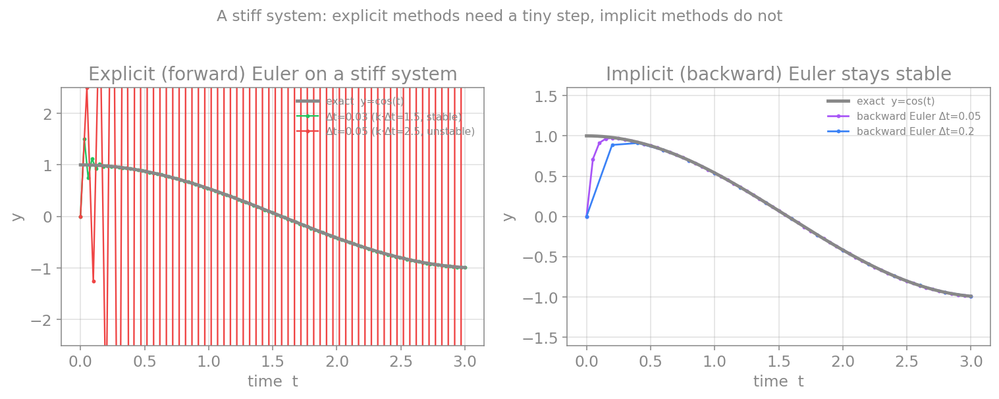
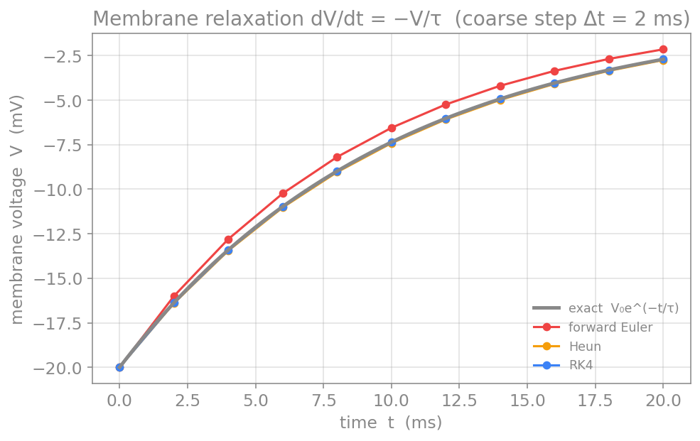
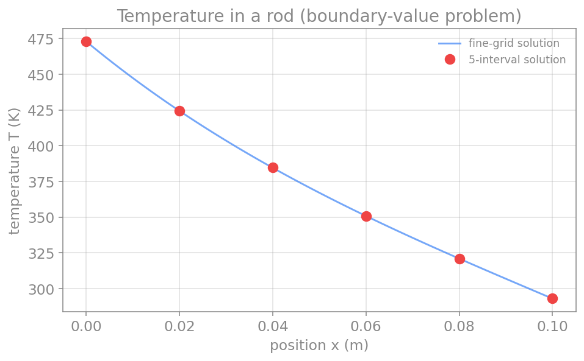
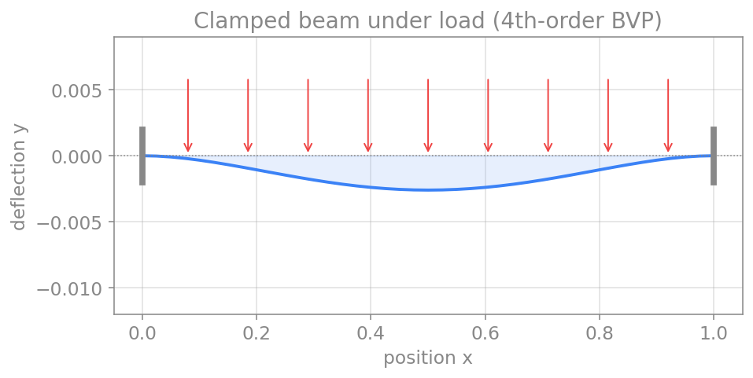
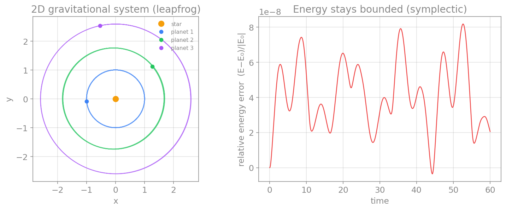
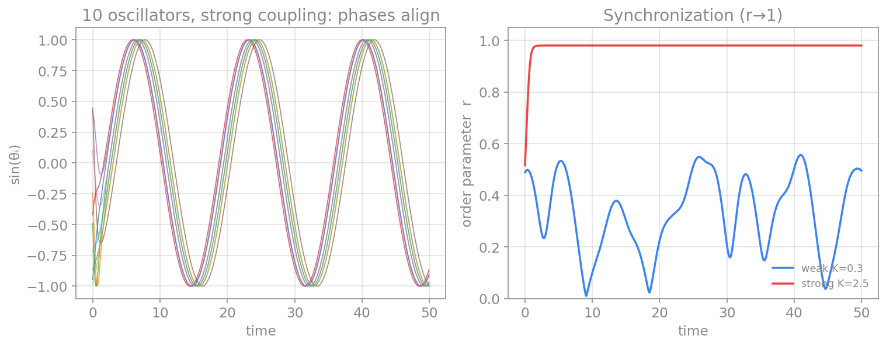
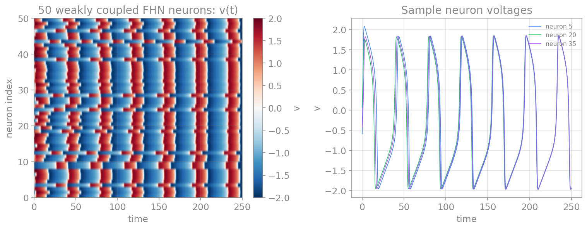

# حل عددی معادلات دیفرانسیل معمولی

تقریباً همهٔ مدل‌های این کتاب، از هاجکین–هاکسلی تا ویلسون–کوان، به‌صورتِ معادلهٔ دیفرانسیلِ معمولی نوشته می‌شوند و جوابِ تحلیلیِ بسته ندارند. در فصل‌های پیش دیدیم چگونه مشتق و انتگرال را به‌صورت عددی تقریب بزنیم؛ اکنون این ابزارها را به کار می‌گیریم تا یک معادلهٔ دیفرانسیل را در زمان **حل** کنیم. این فصل، روش‌های پایه‌ای را که در سراسرِ کتاب به کار می‌بریم گرد هم می‌آورد.

## مسئلهٔ مقدار اولیه

مسئله‌ای که می‌خواهیم حل کنیم، **مسئلهٔ مقدار اولیه** (Initial Value Problem) نام دارد. صورتِ کلیِ آن چنین است:

$$
\frac{d\mathbf{x}}{dt} = \mathbf{f}(\mathbf{x}, t), \qquad \mathbf{x}(t_0) = \mathbf{x}_0.
$$

به عبارتِ دیگر، آهنگِ تغییرِ حالتِ سامانه ($\mathbf{f}$) و حالتِ آغازینِ آن ($\mathbf{x}_0$) را می‌دانیم و می‌خواهیم $\mathbf{x}(t)$ را برای $t > t_0$ بیابیم. همهٔ روش‌هایی که در ادامه می‌آیند، یک ایدهٔ مشترک دارند: زمان را به گام‌های کوچکِ $\Delta t$ می‌شکنند و از حالتِ کنونی، حالتِ گامِ بعد را می‌سازند. تفاوتِ روش‌ها در این است که شیب (یعنی $\mathbf{f}$) را کجا و چند بار ارزیابی می‌کنند.

برای آزمونِ روش‌ها، در سراسرِ این فصل از معادلهٔ سادهٔ خطیِ $x' = -x$ استفاده می‌کنیم که جوابِ دقیقِ آن $x(t) = x_0 e^{-t}$ است؛ این به ما اجازه می‌دهد خطای هر روش را دقیقاً بسنجیم. در پایان نیز یک مثالِ نورونی واقعی را حل می‌کنیم.

## روش اویلر پیشرو

ساده‌ترین روش، مستقیماً از تعریفِ مشتق و تفاضلِ پیشروی فصلِ مشتق می‌آید. اگر $\frac{d\mathbf{x}}{dt} \approx \frac{\mathbf{x}(t+\Delta t) - \mathbf{x}(t)}{\Delta t}$ را در معادله بگذاریم و برای حالتِ گامِ بعد حل کنیم:

$$
\mathbf{x}_{n+1} = \mathbf{x}_n + \Delta t\,\mathbf{f}(\mathbf{x}_n, t_n).
$$

این روش **صریح** است (سمتِ راست تنها به مقادیرِ معلومِ گامِ کنونی بستگی دارد) و **مرتبهٔ یک**: خطای محلی در هر گام از مرتبهٔ $\mathcal{O}(\Delta t^2)$ و خطای سراسری از مرتبهٔ $\mathcal{O}(\Delta t)$ است. سادگیِ آن بهای پایداریِ ضعیف دارد: برای گامِ بزرگ واگرا می‌شود، و چنان‌که خواهیم دید، برای سامانه‌های نوسانی انرژی را به‌طور مصنوعی می‌افزاید.

```python
def forward_euler(f, x, t, dt):
    return x + dt * f(x, t)
```

## روش اویلر پسرو

اگر به‌جای شیبِ گامِ کنونی، شیبِ گامِ بعد را به کار بریم، روشِ **ضمنی** اویلر پسرو به‌دست می‌آید:

$$
\mathbf{x}_{n+1} = \mathbf{x}_n + \Delta t\,\mathbf{f}(\mathbf{x}_{n+1}, t_{n+1}).
$$

اکنون $\mathbf{x}_{n+1}$ در هر دو سو ظاهر می‌شود، پس در هر گام باید یک معادله را حل کنیم (برای سامانه‌های خطی یک دستگاهِ خطی، و برای غیرخطی با روشی مانندِ نیوتن). در ازای این هزینه، روش **پایداریِ** بسیار بهتری دارد. برای معادلهٔ نمونهٔ خطیِ $x' = -x$، حل صریح است و به $x_{n+1} = x_n / (1 + \Delta t)$ می‌رسد.

!!! info "پیشرفته (اختیاری): سامانه‌های سفت"
    اویلر پسرو و دیگر روش‌های ضمنی، برای سامانه‌های **سفت** (stiff) مناسب‌اند؛ سامانه‌هایی که در آن‌ها فرایندهایی با مقیاس‌های زمانیِ بسیار متفاوت هم‌زمان رخ می‌دهند، یعنی برخی متغیرها بسیار سریع و برخی بسیار کند تغییر می‌کنند. در چنین مواردی، روش‌های صریح ناچارند گامِ زمانی را به‌خاطرِ سریع‌ترین متغیر بسیار کوچک نگه دارند، حتی وقتی بقیهٔ سامانه کند است؛ روش‌های ضمنی این محدودیت را ندارند. عیبِ اویلر پسرو، میرایی عددیِ مصنوعی است که در سامانه‌های نوسانی دامنه را به‌تدریج کم می‌کند.

شکلِ زیر این پدیده را نشان می‌دهد. سامانه‌ای را در نظر بگیرید که جوابِ دقیقش $y = \cos(t)$ است اما یک مؤلفهٔ بسیار سریع (با ضریبِ بزرگِ $k$) نیز دارد. برای اویلرِ پیشرو، پایداری تنها زمانی برقرار است که $k\,\Delta t < 2$ باشد؛ اگر گام اندکی از این حد بزرگ‌تر شود، جوابِ عددی به‌جای دنبال‌کردنِ منحنیِ آرام، به نوسان‌های مهارگسیخته می‌افتد. اما اویلرِ پسرو حتی با گام‌های بسیار بزرگ‌تر پایدار می‌ماند.

<figure markdown="span">
  
  <figcaption>یک سامانهٔ سفت با جوابِ دقیقِ y=cos(t). چپ: اویلرِ پیشرو با گامِ کوچک (سبز، k·Δt=۱٫۵) پایدار است، اما با گامِ اندکی بزرگ‌تر (قرمز، k·Δt=۲٫۵) واگرا می‌شود و به نوسان‌های مهارگسیخته می‌افتد. راست: اویلرِ پسرو حتی با گام‌های بسیار بزرگ‌تر پایدار می‌ماند و به جوابِ دقیق نزدیک است.</figcaption>
</figure>

## روش‌های ضمنی برای معادلات غیرخطی

در اویلرِ پسرو دیدیم که مجهولِ $x_{n+1}$ در هر دو سوی معادله ظاهر می‌شود. برای یک معادلهٔ **خطی** مانندِ $x'=-x$، این مشکلی نبود: می‌توانستیم مستقیماً برای $x_{n+1}$ حل کنیم. اما اگر معادله **غیرخطی** باشد، دیگر نمی‌توان آن را مستقیماً جدا کرد و باید در هر گام یک معادلهٔ غیرخطی را به‌صورتِ عددی حل کنیم.

برای نمونه، معادلهٔ غیرخطیِ زوالِ مرتبهٔ دوم را در نظر بگیرید (که در سینتیکِ شیمیایی و برخی مدل‌های زیستی پیش می‌آید):

$$
\frac{dc}{dt} = -k\,c^2.
$$

اویلرِ پسرو برای آن چنین است:

$$
c_{i+1} = c_i + \Delta t\,(-k\,c_{i+1}^2).
$$

اکنون $c_{i+1}$ به‌صورتِ درجهٔ دوم در معادله آمده و نمی‌توان آن را جدا کرد. ترفند این است که مسئله را به یک **مسئلهٔ ریشه‌یابی** تبدیل کنیم: تابعِ کمکیِ $q$ را چنان تعریف می‌کنیم که ریشهٔ آن همان $c_{i+1}$ موردِنظرِ ما باشد:

$$
q(c_{i+1}) = c_{i+1} - c_i + \Delta t\,k\,c_{i+1}^2 = 0.
$$

سپس این ریشه را با **روشِ نیوتن–رافسون** (که در فصلِ مرورِ مفاهیم دیدیم) می‌یابیم. روشِ نیوتن به مشتقِ تابع نیاز دارد:

$$
q'(c_{i+1}) = 1 + 2\,\Delta t\,k\,c_{i+1},
$$

و در هر تکرار، تخمین را با $c^{j+1} = c^{j} - q(c^{j})/q'(c^{j})$ بهبود می‌دهد. توجه کنید که در اینجا دو شمارنده داریم: نمایهٔ $i$ به گامِ زمانیِ اویلر اشاره دارد و نمایهٔ $j$ به تکرارِ نیوتن. به همین دلیل، پیاده‌سازیِ این روش **دو حلقهٔ تودرتو** دارد: یک حلقهٔ بیرونی برای گام‌های زمانی، و یک حلقهٔ درونی برای تکرارهای نیوتن.

```python
import numpy as np
import matplotlib.pyplot as plt

def implicit_euler_nonlinear(c0, k, dt, n_steps):
    c = np.empty(n_steps + 1)
    c[0] = c0
    for i in range(n_steps):                 # outer loop: time stepping
        c_old = c[i]
        guess = c_old                        # initial Newton guess
        for j in range(50):                  # inner loop: Newton-Raphson
            q = guess - c_old + dt * k * guess**2
            dq = 1 + 2 * dt * k * guess
            new_guess = guess - q / dq
            if abs(new_guess - guess) < 1e-12:
                guess = new_guess
                break
            guess = new_guess
        c[i+1] = guess
    return c

k = 1.0
dt = 0.1
c0 = 10.0
n_steps = 50
c = implicit_euler_nonlinear(c0, k, dt, n_steps)

# this nonlinear ODE has a known exact solution, so we can check the result
t = np.arange(n_steps + 1) * dt
exact = c0 / (1 + c0 * k * t)

plt.plot(t, c, "o", label="implicit Euler + Newton")
plt.plot(t, exact, "-", label="exact  c0/(1+c0 k t)")
plt.xlabel("time t")
plt.ylabel("c")
plt.legend()
plt.show()
```

اگر مشتقِ $q'$ به‌صورتِ تحلیلی در دست نباشد، می‌توان آن را با تفاضلِ محدود (فصلِ مشتق) تقریب زد. این روش گران‌تر از روش‌های صریح است، اما برای سامانه‌های سفت یا وقتی پایداری اهمیت دارد، همین هزینه ارزشش را دارد.

## روش هون

دقتِ اویلر را می‌توان با یک ایدهٔ ساده بهبود داد: به‌جای استفاده از شیب در ابتدای گام، **میانگینِ** شیبِ ابتدا و انتهای گام را به کار ببریم. اما شیبِ انتهای گام به حالتِ انتهایی نیاز دارد که هنوز نمی‌دانیم؛ پس نخست با یک گامِ اویلر آن را **پیش‌بینی** می‌کنیم و سپس **تصحیح** می‌کنیم. این روشِ «پیش‌بینی–تصحیح» را روشِ **هون** می‌نامند:

$$
\begin{aligned}
\mathbf{k}_1 &= \mathbf{f}(\mathbf{x}_n, t_n),\\
\tilde{\mathbf{x}}_{n+1} &= \mathbf{x}_n + \Delta t\,\mathbf{k}_1,\\
\mathbf{k}_2 &= \mathbf{f}(\tilde{\mathbf{x}}_{n+1}, t_{n+1}),\\
\mathbf{x}_{n+1} &= \mathbf{x}_n + \frac{\Delta t}{2}(\mathbf{k}_1 + \mathbf{k}_2).
\end{aligned}
$$

در اینجا $\tilde{\mathbf{x}}_{n+1}$ همان پیش‌بینیِ اویلر است؛ سپس شیب را در آن نقطه دوباره می‌سنجیم و میانگینِ دو شیب را برای گامِ نهایی به کار می‌بریم. روشِ هون مرتبهٔ دو است ($\mathcal{O}(\Delta t^2)$) و نمونه‌ای از روش‌های **رونگه–کوتای مرتبهٔ دو** به‌شمار می‌رود.

```python
def heun(f, x, t, dt):
    k1 = f(x, t)
    x_predict = x + dt * k1          # Euler prediction
    k2 = f(x_predict, t + dt)
    return x + (dt / 2.0) * (k1 + k2)  # correction with averaged slope
```

## روش نقطهٔ میانی

راهِ دیگرِ رسیدن به مرتبهٔ دو، ارزیابیِ شیب در **میانهٔ** گام است. این روش نیز نمونه‌ای از رونگه–کوتای مرتبهٔ دو است:

$$
\mathbf{k}_1 = \mathbf{f}(\mathbf{x}_n, t_n), \qquad
\mathbf{x}_{n+1} = \mathbf{x}_n + \Delta t\,\mathbf{f}\!\left(\mathbf{x}_n + \tfrac{\Delta t}{2}\mathbf{k}_1,\; t_n + \tfrac{\Delta t}{2}\right).
$$

خطای سراسریِ آن نیز از مرتبهٔ $\mathcal{O}(\Delta t^2)$ است؛ یعنی نصف‌کردنِ گام، خطا را به یک‌چهارم می‌رساند.

```python
def midpoint(f, x, t, dt):
    k1 = f(x, t)
    return x + dt * f(x + 0.5*dt*k1, t + 0.5*dt)
```

## روش رونگه–کوتای مرتبهٔ چهار (RK4)

پرکاربردترین روشِ همه‌منظوره، **رونگه–کوتای مرتبهٔ چهار** (RK4) است که با ترکیبِ وزن‌دارِ چهار ارزیابیِ شیب در هر گام، خطای سراسریِ $\mathcal{O}(\Delta t^4)$ به‌دست می‌دهد:

$$
\begin{aligned}
\mathbf{k}_1 &= \mathbf{f}(\mathbf{x}_n, t_n), &
\mathbf{k}_2 &= \mathbf{f}(\mathbf{x}_n + \tfrac{\Delta t}{2}\mathbf{k}_1,\, t_n + \tfrac{\Delta t}{2}),\\
\mathbf{k}_3 &= \mathbf{f}(\mathbf{x}_n + \tfrac{\Delta t}{2}\mathbf{k}_2,\, t_n + \tfrac{\Delta t}{2}), &
\mathbf{k}_4 &= \mathbf{f}(\mathbf{x}_n + \Delta t\,\mathbf{k}_3,\, t_n + \Delta t),
\end{aligned}
$$

$$
\mathbf{x}_{n+1} = \mathbf{x}_n + \frac{\Delta t}{6}\big(\mathbf{k}_1 + 2\mathbf{k}_2 + 2\mathbf{k}_3 + \mathbf{k}_4\big).
$$

```python
def rk4(f, x, t, dt):
    k1 = f(x, t)
    k2 = f(x + 0.5*dt*k1, t + 0.5*dt)
    k3 = f(x + 0.5*dt*k2, t + 0.5*dt)
    k4 = f(x + dt*k3, t + dt)
    return x + (dt/6.0)*(k1 + 2*k2 + 2*k3 + k4)
```

روش‌های **گام‌وفقی** مانندِ RK45 (زوجِ دورماند–پرینس) یک گام جلوتر می‌روند: در هر گام دو تقریب با مرتبه‌های متفاوت (چهار و پنج) محاسبه می‌کنند و از تفاوتِ آن‌ها برای برآوردِ خطا و تنظیمِ خودکارِ $\Delta t$ استفاده می‌کنند؛ گامِ کوچک آنجا که جواب تند تغییر می‌کند و گامِ بزرگ آنجا که هموار است. تابعِ `solve_ivp` در کتابخانهٔ `scipy` به‌طور پیش‌فرض همین روش را به کار می‌برد و برای بیشترِ کارهای غیرسفت انتخابِ خوبی است.

## روش‌های چندمرحله‌ای و چندگامی

روش‌هایی که تا اینجا دیدیم را می‌توان در دو دستهٔ کلی جای داد، و این دسته‌بندی به فهمِ بهترِ آن‌ها کمک می‌کند.

**روش‌های چندمرحله‌ای** (multi-stage) شیب را در چند **مرحله** تقریب می‌زنند، اما همگیِ این مرحله‌ها تنها به **یک نقطه** (گامِ کنونی) متکی‌اند. روشِ هون و RK4 که پیش‌تر ساختیم، دقیقاً از همین دسته‌اند: هون دو مرحله ($k_1$ و $k_2$) و RK4 چهار مرحله ($k_1$ تا $k_4$) دارد، اما هر دو تنها از $\mathbf{x}_n$ آغاز می‌کنند. این روش‌ها دقتِ بالایی می‌دهند، اما به بهای ارزیابی‌های متعددِ تابع در هر گام.

**روش‌های چندگامی** (multi-step) رویکردِ دیگری دارند: به‌جای ارزیابیِ تابع در نقاطِ میانی، از **چند گامِ پیشین** استفاده می‌کنند. پرکاربردترین نمونهٔ صریح، روشِ **آدامز–باشفورثِ دوگامی** است:

$$
y_{i+1} = y_i + \frac{\Delta t}{2}\big(3 f(y_i) - f(y_{i-1})\big).
$$

این رابطه را می‌توان از بسط تیلور در چند نقطه به‌دست آورد. مزیتِ آن این است که در هر گام تنها **یک** ارزیابیِ تازهٔ تابع لازم است (چون $f(y_{i-1})$ از گامِ پیش در دست است)، پس از روش‌های چندمرحله‌ای ارزان‌تر است. اما یک مشکل دارد: برای محاسبهٔ $y_{i+1}$ به دو نقطهٔ پیشین ($y_i$ و $y_{i-1}$) نیاز است. در آغازِ حل، تنها $y_0$ را داریم و $y_1$ هنوز معلوم نیست؛ پس این روش‌ها **خودآغازگر نیستند** و باید نخستین گام را با روشی دیگر (مثلاً یک گامِ RK4) به‌دست آورد.

```python
import numpy as np
import matplotlib.pyplot as plt

def f(y):
    return -y          # test equation y' = -y, exact solution exp(-t)

def rk4_scalar(f, y, dt):
    k1 = f(y)
    k2 = f(y + 0.5*dt*k1)
    k3 = f(y + 0.5*dt*k2)
    k4 = f(y + dt*k3)
    return y + (dt/6.0)*(k1 + 2*k2 + 2*k3 + k4)

def adams_bashforth2(f, y0, dt, n_steps):
    y = np.empty(n_steps + 1)
    y[0] = y0
    # not self-starting: take the first step with RK4 to get y[1]
    y[1] = rk4_scalar(f, y[0], dt)
    for i in range(1, n_steps):
        y[i+1] = y[i] + (dt/2.0)*(3*f(y[i]) - f(y[i-1]))
    return y

dt = 0.1
n_steps = 30
y = adams_bashforth2(f, 1.0, dt, n_steps)
t = np.arange(n_steps + 1) * dt

plt.plot(t, y, "o", label="Adams-Bashforth (2-step)")
plt.plot(t, np.exp(-t), "-", label="exact  exp(-t)")
plt.xlabel("time t")
plt.ylabel("y")
plt.legend()
plt.show()
```

!!! note "مثالِ دستی: یک گامِ RK4"
    برای آنکه ببینیم RK4 چقدر دقیق است، یک گام را با دست حساب کنیم. معادلهٔ $\frac{dy}{dt} = -y$ با $y_0 = 1$ و گامِ $\Delta t = 0.2$ را در نظر بگیرید:

    $$
    \begin{aligned}
    k_1 &= -y_0 = -1, & y^\ast_{1/2} &= 1 + \tfrac{0.2}{2}(-1) = 0.9,\\
    k_2 &= -0.9, & y^{\ast\ast}_{1/2} &= 1 + \tfrac{0.2}{2}(-0.9) = 0.91,\\
    k_3 &= -0.91, & y^\ast_1 &= 1 + 0.2(-0.91) = 0.818,\\
    k_4 &= -0.818.
    \end{aligned}
    $$

    حال این‌ها را در فرمولِ RK4 می‌گذاریم:

    $$
    y_1 = 1 + \frac{0.2}{6}\big(-1 - 2(0.9) - 2(0.91) - 0.818\big) = 0.81873.
    $$

    مقدارِ دقیق $e^{-0.2} = 0.8187308\ldots$ است؛ پس تنها با یک گام، RK4 تا پنج رقمِ اعشار درست است.

به‌طورِ خلاصه، روش‌های چندگامی آسان‌تر، ارزان‌تر و پایدارترند و گام‌های بزرگ‌تری را ممکن می‌کنند، اما به مقداردهیِ آغازین نیاز دارند؛ روش‌های چندمرحله‌ای به نقاطِ پیشین وابسته نیستند اما در هر گام پرهزینه‌ترند. انتخابِ میانِ آن‌ها به دقت و کاراییِ موردِنیاز بستگی دارد. روش‌های چندگامیِ ضمنی نیز وجود دارند (مانندِ خانوادهٔ آدامز–مولتون) که هم پایداریِ روش‌های ضمنی و هم کم‌هزینگیِ روش‌های چندگامی را دارند.

## یک حلقهٔ حل ساده

هر یک از توابعِ بالا تنها **یک گام** را جلو می‌برد. برای حلِ کامل، آن‌ها را در یک حلقه روی بازهٔ زمانی تکرار می‌کنیم:

```python
import numpy as np

def integrate(method, f, x0, t0, t_end, dt):
    n_steps = int(round((t_end - t0) / dt))
    t = t0
    x = x0
    xs = [x0]
    for _ in range(n_steps):
        x = method(f, x, t, dt)
        t = t + dt
        xs.append(x)
    return np.array(xs)
```

!!! note "مثال نورونی: واهلش ولتاژ غشا"
    واهلشِ ولتاژ غشای یک نورون ساده، وقتی ورودی ندارد، با معادلهٔ $\frac{dV}{dt} = -V/\tau$ توصیف می‌شود (همان مدلِ RC که در فصلِ غشای تحریک‌پذیر دیدیم). جوابِ دقیقِ آن $V(t) = V_0\,e^{-t/\tau}$ است. بیایید آن را با گامِ نسبتاً درشتِ $\Delta t = 2$ و $\tau = 10$ تا زمانِ $t = 20$ حل کنیم:

    ```python
    tau = 10.0
    V0 = -20.0   # initial displacement from rest, in mV

    def f(V, t):
        return -V / tau

    exact = V0 * np.exp(-20.0 / tau)
    for name, method in [("forward_euler", forward_euler),
                        ("heun", heun),
                        ("rk4", rk4)]:
        V = integrate(method, f, V0, 0.0, 20.0, dt=2.0)[-1]
        print(f"{name:14s} V(20) = {V:9.5f}   error = {abs(exact - V):.2e}")
    ```

    با این گامِ درشت، اویلرِ پیشرو خطای بزرگی دارد، هون آن را حدودِ ده برابر کم می‌کند، و RK4 تقریباً به مقدارِ دقیق می‌رسد. همین تفاوت، اهمیتِ انتخابِ روش را نشان می‌دهد.

<figure markdown="span">
  
  <figcaption>واهلش ولتاژ غشا dV/dt = −V/τ با گام درشتِ Δt=۲ میلی‌ثانیه. اویلرِ پیشرو (قرمز) به‌وضوح از منحنیِ دقیق (خاکستری) فاصله می‌گیرد، حال‌آنکه هون (نارنجی) و RK4 (آبی) تقریباً روی آن منطبق‌اند.</figcaption>
</figure>

## دستگاه‌های معادلات درهم‌تنیده

تا اینجا یک معادلهٔ تک‌متغیره را حل کردیم. اما بیشترِ مدل‌های جالبِ علوم اعصاب، **چند متغیر** دارند که آهنگِ تغییرِ هرکدام به دیگری بستگی دارد. به چنین مجموعه‌ای، یک **دستگاه معادلاتِ دیفرانسیلِ درهم‌تنیده** (coupled ODEs) می‌گویند. خبرِ خوب این است که هیچ روشِ تازه‌ای لازم نیست: تنها کافی است حالتِ سامانه را به‌جای یک عدد، یک **بردار** بگیریم، و تابعِ $\mathbf{f}$ نیز برداری از آهنگِ تغییرها را برگرداند. همان معادلهٔ به‌روزرسانیِ $\mathbf{x}_{n+1} = \mathbf{x}_n + \Delta t\,\mathbf{f}(\mathbf{x}_n, t_n)$ بدونِ تغییر کار می‌کند، تنها این‌بار روی بردارها.

نمونهٔ خوبِ نورونی، مدلِ **فیتزهیو–ناگومو** است که با دو متغیرِ درهم‌تنیده، رفتارِ شلیکِ یک نورون را به‌صورتِ ساده‌شده توصیف می‌کند: متغیرِ $v$ (شبیهٔ ولتاژ غشا) و متغیرِ بازیابیِ $w$:

$$
\begin{aligned}
\frac{dv}{dt} &= v - \frac{v^3}{3} - w + I,\\
\frac{dw}{dt} &= \frac{1}{\tau}\,(v + a - b w).
\end{aligned}
$$

آهنگِ تغییرِ $v$ به $w$ بستگی دارد و آهنگِ تغییرِ $w$ به $v$؛ پس نمی‌توان آن‌ها را جداگانه حل کرد و باید هم‌زمان پیش برد. در کد، حالت را یک آرایهٔ `numpy` به شکلِ `[v, w]` می‌گیریم و تابع نیز آرایه‌ای به شکلِ `[dv, dw]` برمی‌گرداند:

```python
import numpy as np

def fitzhugh_nagumo(state, t, I=0.5, a=0.7, b=0.8, tau=12.5):
    v = state[0]
    w = state[1]
    dv = v - v**3 / 3 - w + I
    dw = (v + a - b * w) / tau
    return np.array([dv, dw])

# the SAME integrate loop and rk4 step from before work unchanged,
# because they only use vector addition and scalar multiplication
trajectory = integrate(rk4, fitzhugh_nagumo,
                       x0=np.array([0.0, 0.0]),
                       t0=0.0, t_end=200.0, dt=0.1)

v_trace = trajectory[:, 0]   # first column: v over time
w_trace = trajectory[:, 1]   # second column: w over time
```

نکتهٔ کلیدی این است که توابعِ `forward_euler`، `heun` و `rk4` که پیش‌تر نوشتیم، **بدونِ هیچ تغییری** روی این دستگاه کار می‌کنند؛ زیرا تنها از جمعِ بردارها و ضربِ بردار در عدد استفاده می‌کنند، و `numpy` این عمل‌ها را روی کلِ آرایه انجام می‌دهد. همین، زیباییِ این روش‌هاست: یک‌بار آن‌ها را می‌نویسیم و برای هر دستگاهی، از یک نورون تا هزاران نورونِ به‌هم‌پیوسته، به کار می‌بریم.

## تبدیل معادلهٔ مرتبهٔ دوم به دستگاه مرتبهٔ اول

همهٔ روش‌هایی که تا اینجا دیدیم، برای معادلاتِ **مرتبهٔ اول** نوشته شده‌اند (تنها مشتقِ اول در آن‌ها ظاهر می‌شود). اما بسیاری از معادلاتِ فیزیکی مرتبهٔ دوم‌اند؛ برای نمونه، نوسانگرِ هماهنگ:

$$
\frac{d^2 x}{dt^2} = -\omega^2 x.
$$

چگونه این را با روش‌هایی که داریم حل کنیم؟ ترفندِ ساده و پرکاربرد این است: **هر معادلهٔ مرتبهٔ دوم را می‌توان به یک دستگاهِ دو معادلهٔ مرتبهٔ اولِ درهم‌تنیده تبدیل کرد.** برای این کار، یک متغیرِ تازه برای مشتقِ اول تعریف می‌کنیم. اگر سرعت را $v = \frac{dx}{dt}$ بنامیم، آن‌گاه:

$$
\begin{aligned}
\frac{dx}{dt} &= v,\\
\frac{dv}{dt} &= -\omega^2 x.
\end{aligned}
$$

اکنون به‌جای یک معادلهٔ مرتبهٔ دوم، دو معادلهٔ مرتبهٔ اول داریم که دقیقاً همان دستگاهِ درهم‌تنیده‌ای است که در بخشِ پیش دیدیم. حالتِ سامانه بردارِ `[x, v]` است:

```python
def harmonic_oscillator(state, t, omega=2.0):
    x = state[0]
    v = state[1]
    dx = v
    dv = -omega**2 * x
    return np.array([dx, dv])

trajectory = integrate(rk4, harmonic_oscillator,
                       x0=np.array([1.0, 0.0]),   # start at x=1, v=0
                       t0=0.0, t_end=10.0, dt=0.01)
```

همین ترفند برای هر معادلهٔ مرتبهٔ بالاتر نیز کار می‌کند: یک معادلهٔ مرتبهٔ $n$اُم به دستگاهی از $n$ معادلهٔ مرتبهٔ اول تبدیل می‌شود، با تعریفِ متغیرهای تازه برای مشتق‌های متوالی. به این ترتیب، تنها با روش‌های مرتبهٔ اول می‌توان هر معادلهٔ دیفرانسیلی را حل کرد.

!!! tip "پیوند با سیستم‌های دینامیکی"
    این بردارِ حالت، همان مفهومِ **فضای حالت** در نظریهٔ سیستم‌های دینامیکی است. برای نوسانگرِ هماهنگ، نقطهٔ $(x, v)$ یک نقطه در صفحهٔ فاز است و جوابِ عددی، مسیری در این صفحه می‌سازد. همین دیدگاه است که در فصلِ سیستم‌های دینامیکی برای تحلیلِ نقاطِ ثابت، چرخه‌های حدی و پایداری به کار می‌رود. به بیانِ دیگر، روش‌های عددیِ این فصل، ابزارِ محاسباتی‌اند و نظریهٔ سیستم‌های دینامیکی، چارچوبِ تحلیلیِ همان مسیرهاست.

## مسئلهٔ مقدار مرزی: گونهٔ دیگری از معادلهٔ مرتبهٔ دوم

نوسانگرِ هماهنگ را در بخشِ پیش به‌صورتِ یک **مسئلهٔ مقدار اولیه** حل کردیم: مکان و سرعتِ آغازین ($x$ و $v$ در لحظهٔ $t=0$) را می‌دانستیم و جواب را در زمان جلو می‌بردیم. اما این تنها راهِ مطرح‌شدنِ یک معادلهٔ مرتبهٔ دوم نیست.

یک معادلهٔ مرتبهٔ دوم به **دو قید** نیاز دارد. اگر هر دو قید در **یک نقطه** داده شوند (مثلاً مکان و سرعت در لحظهٔ آغاز)، با یک **مسئلهٔ مقدار اولیه** (Initial Value Problem) سر و کار داریم، همان‌گونه که نوسانگر را حل کردیم. اما اگر دو قید در **دو نقطهٔ متفاوتِ** دامنه داده شوند، با یک **مسئلهٔ مقدار مرزی** (Boundary Value Problem، به‌اختصار BVP) روبه‌روییم. به‌طورِ شهودی: وقتی مشتق نسبت به **زمان** است، معمولاً مسئلهٔ مقدار اولیه داریم (حالتِ آغازین را می‌دانیم و آینده را می‌سازیم)؛ و وقتی مشتق نسبت به **مکان** است، اغلب مسئلهٔ مقدار مرزی داریم (شرایط را در دو سرِ یک ناحیهٔ مکانی می‌دانیم).

پس هر معادلهٔ مرتبهٔ دومی لزوماً مسئلهٔ مقدار مرزی نیست؛ نوسانگرِ هماهنگ با مکان و سرعتِ آغازین، یک مسئلهٔ مقدار اولیه بود. در این بخش به گونهٔ دیگر، یعنی مسئلهٔ مقدار مرزی، می‌پردازیم که روشِ حلِ آن کاملاً متفاوت است.

دو نوعِ رایجِ شرطِ مرزی وجود دارد: شرطِ **دیریکله** (Dirichlet) که مقدارِ خودِ تابع را در مرز ثابت می‌کند، و شرطِ **نویمان** (Neumann) که مقدارِ مشتقِ تابع را در مرز ثابت می‌کند. ترکیبِ این دو نیز ممکن است.

### مثال: دمای یک میله

معادلهٔ زیر، دمای $T$ را در یک میلهٔ فلزیِ نازک توصیف می‌کند:

$$
\frac{d^2 T}{dx^2} - \alpha\,(T - T_s) = 0, \qquad x \in (0, 0.1).
$$

جملهٔ نخست رساناییِ گرما در میله و جملهٔ دوم تبادلِ گرما با محیطِ پیرامون (با دمای ثابتِ $T_s$) را نشان می‌دهد. دمای دو سرِ میله ثابت نگه داشته می‌شود (شرطِ دیریکله در هر دو مرز):

$$
T(0) = 473\,\mathrm{K}, \qquad T(0.1) = 293\,\mathrm{K},
$$

با پارامترهای $\alpha = 166\,\mathrm{m}^{-2}$ و $T_s = 293\,\mathrm{K}$.

### روشِ حل: تفاضل محدود و دستگاه معادلات

برخلافِ مسئلهٔ مقدار اولیه که گام‌به‌گام پیش می‌رفت، اینجا نمی‌توان از یک سر آغاز کرد و جلو رفت، چون شرطِ سرِ دیگر را هم باید برآورده کنیم. در عوض، **همهٔ نقاطِ شبکه را هم‌زمان** حل می‌کنیم. مراحلِ کلیِ کار چنین است: (۱) معادله را با یک تقریبِ عددی گسسته می‌کنیم، (۲) پارامترها را تعریف می‌کنیم، (۳) یک شبکه می‌سازیم، (۴) شرایطِ مرزی را اعمال می‌کنیم، (۵) یک دستگاه معادلاتِ خطی به شکلِ $A\mathbf{T}=\mathbf{b}$ می‌سازیم، و (۶) آن را حل می‌کنیم. بیایید این مراحل را برای مثالِ میله دنبال کنیم.

**۱. گسسته‌سازیِ معادله.** مشتقِ دومِ تابع را در هر نقطهٔ درونی با تفاضلِ محدودِ مرکزی (از فصلِ مشتق) تقریب می‌زنیم:

$$
\frac{d^2 T}{dx^2}\bigg|_i \approx \frac{T_{i-1} - 2T_i + T_{i+1}}{\Delta x^2}.
$$

با جای‌گذاری در معادلهٔ میله، صورتِ گسستهٔ آن در هر نقطهٔ درونی چنین می‌شود:

$$
\frac{1}{\Delta x^2}\big(T_{i-1} - 2T_i + T_{i+1}\big) - \alpha\,(T_i - T_s) = 0.
$$

**۲. پارامترها.** پارامترهای ما $\alpha = 166$ و $T_s = 293$ هستند.

**۳. شبکه.** پنج زیربازهٔ مساوی می‌خواهیم، پس $\Delta x = (0.1 - 0)/5 = 0.02$ و $\Delta x^2 = 0.0004$. نقاطِ شبکه عبارت‌اند از $x_0=0,\ x_1=0.02,\ x_2=0.04,\ x_3=0.06,\ x_4=0.08,\ x_5=0.1$.

**۴. شرایطِ مرزی.** نقاطِ بیرونیِ $x_0$ و $x_5$ شرایطِ دیریکلهٔ ما هستند، با مقادیرِ معلومِ $T_0 = 473$ و $T_5 = 293$ کلوین.

**۵. ساختنِ دستگاه معادلات.** معادلهٔ گسسته را برای هر نقطهٔ درونی ($i = 1, 2, 3, 4$) می‌نویسیم و مجهول‌ها را به سمتِ چپ و معلوم‌ها را به سمتِ راست می‌بریم.

برای $i=1$، چون $T_0$ معلوم است:

$$
-(2 + \alpha \Delta x^2)\,T_1 + T_2 = -\alpha T_s \Delta x^2 - T_0.
$$

برای $i=2$:

$$
T_1 - (2 + \alpha \Delta x^2)\,T_2 + T_3 = -\alpha T_s \Delta x^2.
$$

برای $i=3$:

$$
T_2 - (2 + \alpha \Delta x^2)\,T_3 + T_4 = -\alpha T_s \Delta x^2.
$$

برای $i=4$، چون $T_5$ معلوم است:

$$
T_3 - (2 + \alpha \Delta x^2)\,T_4 = -\alpha T_s \Delta x^2 - T_5.
$$

این چهار معادله را می‌توان به شکلِ ماتریسیِ $A\mathbf{T} = \mathbf{b}$ نوشت:

$$
\begin{bmatrix}
-(2 + \alpha \Delta x^2) & 1 & 0 & 0 \\
1 & -(2 + \alpha \Delta x^2) & 1 & 0 \\
0 & 1 & -(2 + \alpha \Delta x^2) & 1 \\
0 & 0 & 1 & -(2 + \alpha \Delta x^2)
\end{bmatrix}
\begin{bmatrix} T_1 \\ T_2 \\ T_3 \\ T_4 \end{bmatrix}
=
\begin{bmatrix}
-\alpha T_s \Delta x^2 - T_0 \\
-\alpha T_s \Delta x^2 \\
-\alpha T_s \Delta x^2 \\
-\alpha T_s \Delta x^2 - T_5
\end{bmatrix}.
$$

توجه کنید که ماتریسِ ضرایب **سه‌قطری** است: تنها قطرِ اصلی و دو قطرِ مجاورِ آن ناصفرند. این ساختار از همان تفاضلِ مرکزی می‌آید که هر نقطه را تنها به دو همسایه‌اش پیوند می‌دهد.

**۶. حلِ دستگاه.** از نظرِ ریاضی، جواب $\mathbf{T} = A^{-1}\mathbf{b}$ است. اما در عمل، معکوس‌کردنِ ماتریس پرهزینه و غیرضروری است؛ بهتر است از تابعِ `numpy.linalg.solve` استفاده کنیم که دستگاه را مستقیم و کارآمد حل می‌کند:

```python
import numpy as np
import matplotlib.pyplot as plt

# parameters
dx = 0.02
Ts = 293
alpha = 166

# grid from 0 to 0.1
x = np.arange(0, 0.1 + dx, dx)
T = np.zeros(x.shape)

# Dirichlet boundary conditions at the two ends
T[0] = 473
T[-1] = 293

# build the tridiagonal matrix A for the interior nodes
n_interior = len(x) - 2
A = np.zeros((n_interior, n_interior))
np.fill_diagonal(A, -(2 + dx**2 * alpha))    # main diagonal
for i in range(n_interior - 1):
    A[i, i+1] = 1                             # upper diagonal
    A[i+1, i] = 1                             # lower diagonal

# build the right-hand-side vector b
b_element = -(dx**2) * alpha * Ts
b = np.full(n_interior, b_element)
b[0] = b[0] - T[0]      # move the known boundary value to the RHS
b[-1] = b[-1] - T[-1]

# solve the linear system (do NOT invert the matrix)
T[1:-1] = np.linalg.solve(A, b)

plt.plot(x, T, "o-")
plt.xlabel("position x (m)")
plt.ylabel("temperature T (K)")
plt.show()

print("temperatures at the nodes:", [f"{temp:.2f}" for temp in T])
```

نتیجه دماهای $473.00, 424.46, 384.64, 350.91, 321.02, 293.00$ کلوین است؛ منحنیِ همواری که از دمای بالای یک سر به دمای پایینِ سرِ دیگر می‌رسد.

<figure markdown="span">
  
  <figcaption>حلِ مسئلهٔ مقدار مرزیِ دمای میله با تفاضل محدود. نقاطِ قرمز جوابِ پنج‌زیربازه‌ای و منحنیِ آبی جوابِ شبکهٔ بسیار ریزتر است؛ هر دو از دمای ۴۷۳ کلوین در یک سر به ۲۹۳ کلوین در سرِ دیگر می‌رسند.</figcaption>
</figure>

!!! info "پیشرفته (اختیاری): مثالِ خمشِ تیر و شرط‌های مرتبهٔ بالاتر"
    همین روش برای معادلاتِ مرتبهٔ بالاتر نیز کار می‌کند. نمونهٔ کلاسیک، خمشِ یک تیر به طولِ $L$ است که در دو سرِ خود ($x=0$ و $x=L$) گیردار شده و با معادلهٔ مرتبهٔ چهارم توصیف می‌شود:

    $$
    \frac{d^4 y}{dx^4} = \alpha\,\mathrm{load}(x),
    $$

    که در آن $y$ تغییرشکلِ تیر و $\alpha$ ویژگیِ مادهٔ تیر است. چون معادله مرتبهٔ چهارم است، به **چهار** شرطِ مرزی نیاز دارد. طبیعتِ مسئله می‌گوید که در دو سرِ گیردار، هم خودِ تغییرشکل و هم شیبِ تغییرشکل صفر است:

    $$
    y(0) = 0, \quad y(L) = 0, \qquad \frac{dy}{dx}\bigg|_{x=0} = 0, \quad \frac{dy}{dx}\bigg|_{x=L} = 0.
    $$

    <figure markdown="span">
      
      <figcaption>تیرِ گیردار در دو سر، زیرِ بارِ یکنواخت. تغییرشکل (y) و شیبِ تغییرشکل در هر دو انتها صفر است؛ همین چهار شرط (دو دیریکله و دو نویمان) مسئلهٔ مرتبهٔ چهارم را کامل می‌کند.</figcaption>
    </figure>

    دو شرطِ نخست از نوعِ **دیریکله** (مقدارِ تابع) و دو شرطِ دوم از نوعِ **نویمان** (مقدارِ مشتق) هستند. مشتقِ مرتبهٔ چهارم را نیز می‌توان با تفاضلِ محدود تقریب زد و به همان شکلِ دستگاهِ خطیِ $A\mathbf{y}=\mathbf{b}$ رسید، تنها با ماتریسی که اکنون پنج‌قطری است (چون مشتقِ چهارم هر نقطه را به چهار همسایه پیوند می‌دهد).

### خلاصهٔ فرمول‌های تفاضل محدود

برای مرجع، تقریب‌های رایجِ تفاضلِ محدود برای مشتق‌های اول و دوم را در جدولِ زیر گرد آورده‌ایم (همگی از بسط تیلورِ فصلِ پیش به‌دست می‌آیند):

| مشتق | تقریب | مرتبهٔ خطا |
|---|---|---|
| اولِ پسرو | (fᵢ − fᵢ₋₁)/Δx | O(Δx) |
| اولِ پیشرو | (fᵢ₊₁ − fᵢ)/Δx | O(Δx) |
| اولِ مرکزی | (fᵢ₊₁ − fᵢ₋₁)/(2Δx) | O(Δx²) |
| دومِ مرکزی | (fᵢ₋₁ − 2fᵢ + fᵢ₊₁)/Δx² | O(Δx²) |

## مرتبهٔ دقت در عمل

تفاوتِ مرتبه‌ها را می‌توان مستقیماً دید: اگر خطای سراسری را در زمانِ پایانیِ ثابت بر حسبِ $\Delta t$ در مقیاسِ لگاریتمی رسم کنیم، هر روش خطی با شیبی برابرِ مرتبه‌اش ظاهر می‌شود.

<figure markdown="span">
  
  <figcaption>خطای سراسری بر حسب گام زمانی برای معادلهٔ آزمونِ x'=-x. شیبِ هر خط برابرِ مرتبهٔ روش است: ۱ برای اویلر، ۲ برای نقطهٔ میانی و ۴ برای RK4. کاهشِ گام در RK4 خطا را بسیار تندتر کم می‌کند.</figcaption>
</figure>

این را می‌توان با کد نیز تأیید کرد. اگر خطای هر روش را برای چند گامِ کوچک‌شونده بسنجیم و شیبِ لگاریتمی را برآورد کنیم، به مرتبه‌های ۱، ۲ و ۴ می‌رسیم:

```python
def g(x, t):
    return -x

def final_error(method, dt, t_end=2.0):
    x = 1.0
    t = 0.0
    n_steps = int(round(t_end / dt))
    for _ in range(n_steps):
        x = method(g, x, t, dt)
        t = t + dt
    return abs(x - np.exp(-t_end))

for name, method, steps in [("euler", forward_euler, [0.2, 0.1, 0.05, 0.025]),
                            ("heun", heun, [0.2, 0.1, 0.05, 0.025]),
                            ("rk4", rk4, [0.4, 0.2, 0.1, 0.05])]:
    errors = [final_error(method, dt) for dt in steps]
    slope = np.polyfit(np.log(steps), np.log(errors), 1)[0]
    print(f"{name:6s} estimated order = {slope:.2f}")
```

این تفاوت در عمل اهمیت دارد. برای نمونه، در مدلِ فیتزهیو–ناگومو با گامِ نسبتاً بزرگ، اویلرِ پیشرو خطای فازِ محسوسی انباشت می‌کند، حال‌آنکه RK4 با همان گام به جوابِ مرجع بسیار نزدیک می‌ماند:

<figure markdown="span">
  
  <figcaption>مدل فیتزهیو–ناگومو با گام درشتِ Δt=0.5: اویلرِ پیشرو نسبت به جوابِ مرجع (RK4 با گام ریز) خطای فاز انباشت می‌کند، در حالی که RK4 با همان گامِ درشت بسیار دقیق‌تر است.</figcaption>
</figure>

## دینامیک هامیلتونی و انتگرال‌گیرهای سیمپلکتیک

!!! info "پیشرفته (اختیاری)"
    این بخش برای سامانه‌های پایستهٔ انرژی (هامیلتونی) اهمیت دارد و برای ادامهٔ مطالبِ نورونیِ کتاب ضروری نیست؛ اما برای کسانی که با سامانه‌های نوسانیِ بلندمدت کار می‌کنند بسیار سودمند است.

برای سامانه‌های مرتبهٔ دومِ مکانیکی به شکلِ $\ddot{x} = a(x)$ (که در آن نیرو تنها به مکان بستگی دارد)، دو روش بسیار رایج‌اند: **پرش‌قورباغه** (leapfrog) و **ورلهٔ سرعتی** (Velocity Verlet). در ادامه هر دو را روی نوسانگرِ هماهنگ پیاده می‌کنیم.

### پرش‌قورباغه برای نوسانگر هماهنگ

باز هم از معادلهٔ نوسانگرِ هماهنگ آغاز می‌کنیم:

$$
\frac{d^2 x}{dt^2} = -\omega^2 x,
$$

یعنی $\ddot{x} = a(x)$ با شتابِ $a(x) = -\omega^2 x$. ایدهٔ پرش‌قورباغه این است که سرعت و مکان را «درهم‌بافته» پیش ببریم؛ سرعت در نیمه‌گام‌ها و مکان در گام‌های کامل محاسبه می‌شود، چنان‌که گویی روی هم می‌جهند (نامِ روش از همین‌جا می‌آید). سه گامِ گسستهٔ آن چنین‌اند:

$$
\begin{aligned}
v_{n+1/2} &= v_n + \tfrac{1}{2}\,a(x_n)\,\Delta t,\\
x_{n+1} &= x_n + v_{n+1/2}\,\Delta t,\\
v_{n+1} &= v_{n+1/2} + \tfrac{1}{2}\,a(x_{n+1})\,\Delta t.
\end{aligned}
$$

گامِ نخست، سرعت را با نیمِ شتابِ کنونی تا میانهٔ گام جلو می‌برد (نیمه‌گامِ سرعت). گامِ دوم، مکان را با همین سرعتِ نیمه‌گام به‌طور کامل جلو می‌برد. گامِ سوم، سرعت را با نیمِ شتابِ تازه تا انتهای گام کامل می‌کند. پیاده‌سازیِ آن چنین است:

```python
def leapfrog(x, v, dt, omega=2.0):
    a = -omega**2 * x                  # acceleration at current position
    v_half = v + 0.5 * a * dt          # half-step velocity (first kick)
    x_new = x + v_half * dt            # full-step position (drift)
    a_new = -omega**2 * x_new          # acceleration at new position
    v_new = v_half + 0.5 * a_new * dt  # complete the velocity (second kick)
    return x_new, v_new

# integrate the harmonic oscillator and track the energy
omega = 2.0
x = 1.0
v = 0.0
dt = 0.1
energy = []
for _ in range(2000):
    x, v = leapfrog(x, v, dt, omega)
    energy.append(0.5 * v**2 + 0.5 * omega**2 * x**2)
```

مانندِ ورلهٔ سرعتی، انرژیِ این روش نیز پیرامونِ مقدارِ آغازین کران‌دار می‌ماند و در شبیه‌سازی‌های بلندمدت دور نمی‌شود.

!!! note "پرش‌قورباغه و ورلهٔ سرعتی، دو چهره از یک روش"
    این دو روش در واقع **به‌لحاظِ ریاضی هم‌ارزند** و دقیقاً همان مسیر را تولید می‌کنند (تفاوتِ عددیِ آن‌ها در حدِ خطای گردکردنِ ماشین است). تفاوتشان تنها در نحوهٔ نگه‌داریِ سرعت است: پرش‌قورباغه سرعت را در نیمه‌گام‌ها نگه می‌دارد، حال‌آنکه ورلهٔ سرعتی مکان و سرعت را در گام‌های هم‌زمان نگه می‌دارد. به همین دلیل، وقتی به سرعت و مکان در یک لحظهٔ یکسان نیاز داریم (مثلاً برای محاسبهٔ انرژی)، ورلهٔ سرعتی راحت‌تر است.

### ورلهٔ سرعتی برای نوسانگر هماهنگ

بیایید همان نوسانگرِ هماهنگ را این‌بار با **ورلهٔ سرعتی** (Velocity Verlet) حل کنیم؛ صورتی از همین خانواده که در عمل بیش از همه به کار می‌رود. باز هم با شتابِ $a(x) = -\omega^2 x$ سر و کار داریم. ایدهٔ ورلهٔ سرعتی این است که در هر گام، نخست مکان را با مکان، سرعت و شتابِ کنونی به‌روز کنیم، سپس سرعت را با میانگینِ شتابِ کنونی و شتابِ تازه. سه گامِ گسستهٔ آن چنین‌اند:

$$
\begin{aligned}
x_{n+1} &= x_n + v_n\,\Delta t + \tfrac{1}{2}\,a(x_n)\,\Delta t^2,\\
a_{n+1} &= -\omega^2 x_{n+1},\\
v_{n+1} &= v_n + \tfrac{1}{2}\big(a(x_n) + a(x_{n+1})\big)\,\Delta t.
\end{aligned}
$$

گامِ نخست، همان بسطِ تیلورِ مکان تا مرتبهٔ دوم است (مکانِ تازه از روی مکان، سرعت و شتابِ کنونی). گامِ دوم، شتاب را در مکانِ تازه حساب می‌کند. گامِ سوم، سرعت را با **میانگینِ** شتابِ ابتدا و انتهای گام به‌روز می‌کند؛ همین میانگین‌گیری است که به روش دقتِ مرتبهٔ دو و ساختارِ سیمپلکتیک می‌بخشد. پیاده‌سازیِ آن مستقیم است:

```python
def velocity_verlet(x, v, dt, omega=2.0):
    a = -omega**2 * x                  # acceleration at current position
    x_new = x + v * dt + 0.5 * a * dt**2
    a_new = -omega**2 * x_new          # acceleration at new position
    v_new = v + 0.5 * (a + a_new) * dt # average of old and new acceleration
    return x_new, v_new

# integrate the harmonic oscillator for many steps and track the energy
omega = 2.0
x = 1.0
v = 0.0
dt = 0.1
energy = []
for _ in range(2000):
    x, v = velocity_verlet(x, v, dt, omega)
    energy.append(0.5 * v**2 + 0.5 * omega**2 * x**2)
```

اگر انرژیِ کلِ سامانه، یعنی $E = \tfrac{1}{2}v^2 + \tfrac{1}{2}\omega^2 x^2$، را در طولِ شبیه‌سازی دنبال کنیم، می‌بینیم که پیرامونِ مقدارِ آغازین نوسانِ بسیار کوچکی دارد اما هرگز به‌طور مداوم دور نمی‌شود؛ حتی پس از هزاران گام. این درست همان رفتاری است که از یک انتگرال‌گیرِ سیمپلکتیک انتظار داریم. برای مقایسه، اگر همین سامانه را با اویلرِ پیشرو حل کنیم، انرژی به‌طور نمایی رشد می‌کند و جواب پس از مدتی کاملاً بی‌اعتبار می‌شود.

دسته‌ای ویژه از سامانه‌ها، **سامانه‌های هامیلتونی** هستند که در آن‌ها کمیتی به نامِ انرژی (هامیلتونیِ $H$) در طولِ حرکت پایسته می‌ماند و جریانِ سامانه حجمِ فضای فاز را حفظ می‌کند (قضیهٔ لیوویل). نوسانگرِ هماهنگ ساده‌ترین نمونه است. مشکل اینجاست که روش‌های همه‌منظوره مانندِ اویلر یا حتی RK4 این ساختار را حفظ نمی‌کنند: انرژیِ عددی به‌تدریج از مقدارِ درستش دور می‌شود (در اویلرِ پیشرو می‌افزاید، در اویلرِ پسرو می‌کاهد) و در شبیه‌سازی‌های بلندمدت جواب بی‌اعتبار می‌شود.

!!! note "انرژیِ گامِ بعد را برای هر روش حساب کنیم"
    این تفاوتِ رفتارها را می‌توان به‌صورتِ جبری و دقیق نشان داد. نوسانگرِ هماهنگ را به دستگاهِ مرتبهٔ اول می‌نویسیم (همان ترفندِ بخشِ پیش): با حالتِ $(x, v)$، انرژیِ سامانه $E = \tfrac{1}{2}v^2 + \tfrac{1}{2}\omega^2 x^2$ است که در حرکتِ واقعی باید ثابت بماند. حال انرژیِ گامِ بعد، یعنی $E_{n+1}$، را برای هر روش حساب می‌کنیم.

    **اویلرِ پیشرو.** گام‌های گسسته چنین‌اند:

    $$
    x_{n+1} = x_n + v_n\,\Delta t, \qquad v_{n+1} = v_n - \omega^2 x_n\,\Delta t.
    $$

    با جای‌گذاری در فرمولِ انرژی و ساده‌کردن (جمله‌های مرتبهٔ اولِ $\Delta t$ حذف می‌شوند):

    $$
    E_{n+1} = E_n + \tfrac{1}{2}\,\omega^2 \Delta t^2\big(\omega^2 x_n^2 + v_n^2\big) = E_n\big(1 + \omega^2 \Delta t^2\big).
    $$

    عامل $(1 + \omega^2 \Delta t^2)$ همواره **بزرگ‌تر از یک** است، پس انرژی در هر گام بزرگ‌تر می‌شود و در درازمدت نمایی **رشد** می‌کند؛ دامنهٔ نوسان به‌طور مصنوعی منفجر می‌شود.

    **اویلرِ پسرو.** اینجا گام‌ها ضمنی‌اند و $x_{n+1}$ و $v_{n+1}$ در هر دو سو ظاهر می‌شوند؛ پس از حلِ دستگاهِ خطی و جای‌گذاری در انرژی، نتیجه دقیقاً وارونهٔ حالتِ پیشین می‌شود:

    $$
    E_{n+1} = \frac{E_n}{1 + \omega^2 \Delta t^2}.
    $$

    این‌بار عامل **کوچک‌تر از یک** است، پس انرژی در هر گام **میرا** می‌شود و نوسان به‌تدریج خاموش می‌گردد.

    **ورلهٔ سرعتی و پرش‌قورباغه.** برای این روش‌ها (که هم‌ارزند)، اگر همان محاسبه را انجام دهیم، دیگر به یک عاملِ سادهٔ ثابت نمی‌رسیم. اختلافِ انرژی چنین است:

    $$
    E_{n+1} - E_n = \frac{\omega^4 \Delta t^3}{4}\,x_n v_n + \mathcal{O}(\Delta t^4).
    $$

    نکتهٔ کلیدی این است که جملهٔ پیشرو، نه یک عاملِ ثابت، بلکه متناسب با $x_n v_n$ است. در طولِ یک نوسان، $x$ مانندِ کسینوس و $v$ مانندِ سینوس تغییر می‌کند، پس حاصل‌ضربِ $x_n v_n$ گاه مثبت و گاه منفی است و **میانگینِ آن بر یک دوره صفر** می‌شود. بنابراین انرژی به‌جای رشد یا میرایی یک‌طرفه، پیرامونِ مقدارِ درست بالا و پایین می‌رود و **کران‌دار** می‌ماند.

    همین تفاوت، چراییِ برتریِ انتگرال‌گیرهای سیمپلکتیک را روشن می‌کند: در اویلرِ پیشرو و پسرو، خطای انرژی در هر گام **هم‌علامت** است و انباشته می‌شود؛ اما در ورلهٔ سرعتی و پرش‌قورباغه، خطا علامت عوض می‌کند و در درازمدت یکدیگر را خنثی می‌کند. به همین دلیل برای شبیه‌سازیِ بلندمدتِ سامانه‌های پایسته، این روش‌ها انتخابِ درست‌اند، نه لزوماً روشی با مرتبهٔ دقتِ بالاتر مانندِ RK4.

**انتگرال‌گیرهای سیمپلکتیک** برای همین ساخته شده‌اند: آن‌ها ساختارِ هندسیِ فضای فاز را دقیقاً حفظ می‌کنند. در نتیجه، هرچند انرژی را کاملاً ثابت نگه نمی‌دارند، خطای انرژی را **کران‌دار** می‌کنند؛ انرژی پیرامونِ مقدارِ درست نوسان می‌کند اما به‌طور مداوم دور نمی‌شود. اویلرِ سیمپلکتیک (نیمه‌ضمنی) و روشِ پرش‌قورباغه نمونه‌های ساده‌ای از این انتگرال‌گیرها هستند.

<figure markdown="span">
  
  <figcaption>نوسانگر هماهنگ با Δt=0.25. چپ: در صفحهٔ فاز، اویلرِ پیشرو به بیرون و اویلرِ پسرو به درون مارپیچ می‌زند، اما اویلرِ سیمپلکتیک روی مداری بسته نزدیکِ مدارِ دقیق می‌ماند. راست: انرژی در اویلرِ پیشرو می‌افزاید، در پسرو می‌میرد، و در سیمپلکتیک کران‌دار می‌ماند.</figcaption>
</figure>

به همین دلیل، هرگاه با سامانه‌ای هامیلتونی سر و کار داشته باشیم و به شبیه‌سازیِ بلندمدتِ پایدار نیاز باشد، انتگرال‌گیرِ سیمپلکتیک انتخابِ درست است، نه لزوماً روشی با مرتبهٔ دقتِ بالاتر.

## سامانه‌های چندجسمی: از یک ذره تا بسیار

تا اینجا بیشتر با یک جسم (یک نوسانگر، یک نورون) کار کردیم. اما در عمل، جالب‌ترین پدیده‌ها از **برهم‌کنشِ بسیاری از اجزا** پدید می‌آیند: حرکتِ سیاره‌ها در یک منظومه، هماهنگ‌شدنِ جمعیتی از نوسانگرها، یا فعالیتِ شبکه‌ای از نورون‌ها. نکتهٔ کلیدیِ این فصل این است که برای حلِ این سامانه‌ها به **هیچ روشِ تازه‌ای** نیاز نداریم؛ تنها کافی است حالتِ سامانه را به یک بردارِ بزرگ‌ترِ شاملِ همهٔ اجزا تبدیل کنیم و همان روش‌های اویلر، RK4 یا ورلهٔ سرعتی را روی آن به کار ببریم. در این بخش، سه نمونهٔ واقعی را حل می‌کنیم.

### نمونهٔ یک: سامانهٔ گرانشیِ چندجسمی

یک منظومهٔ ساده در دو بُعد را در نظر بگیرید: یک ستارهٔ مرکزی و چند سیاره که زیرِ نیروی گرانشِ یکدیگر حرکت می‌کنند. این یک **سامانهٔ هامیلتونی** است (انرژیِ کل، یعنی جمعِ انرژیِ جنبشی و پتانسیلِ گرانشی، باید پایسته بماند)، پس از یک انتگرال‌گیرِ سیمپلکتیک، یعنی همان ورلهٔ سرعتی، استفاده می‌کنیم تا مدارها در درازمدت پایدار بمانند.

حالتِ سامانه، مکان و سرعتِ همهٔ اجسام است. شتابِ واردبر هر جسم، جمعِ نیروهای گرانشیِ همهٔ اجسامِ دیگر است (قانونِ گرانشِ نیوتن). صورتِ آرمانیِ آن چنین است:

$$
\mathbf{a}_i = \sum_{j \neq i} G\,m_j\,\frac{\mathbf{r}_j - \mathbf{r}_i}{\lVert \mathbf{r}_j - \mathbf{r}_i \rVert^3}.
$$

اما این صورت یک مشکلِ عددی دارد: وقتی دو جسم بسیار به هم نزدیک می‌شوند، فاصلهٔ $\lVert \mathbf{r}_j - \mathbf{r}_i \rVert$ به صفر میل می‌کند و شتاب به‌سمتِ بی‌نهایت واگرا می‌شود، که شبیه‌سازی را ناپایدار می‌کند. راهِ ساده و رایجِ رفعِ آن، افزودنِ یک **طولِ نرم‌سازی** (softening length) به نامِ $\varepsilon$ در مخرج است:

$$
\mathbf{a}_i = \sum_{j \neq i} G\,m_j\,\frac{\mathbf{r}_j - \mathbf{r}_i}{\big(\lVert \mathbf{r}_j - \mathbf{r}_i \rVert^2 + \varepsilon^2\big)^{3/2}}.
$$

با این تغییر، حتی وقتی دو جسم بر هم منطبق شوند، مخرج هرگز صفر نمی‌شود و شتاب کران‌دار می‌ماند. $\varepsilon$ باید به‌قدری کوچک باشد که بر مدارهای دور اثری نگذارد، اما به‌قدری بزرگ که از واگراییِ برخوردهای نزدیک جلوگیری کند. در کدِ زیر، این همان پارامترِ `softening` است که در مخرجِ `dist_sq` ظاهر می‌شود:

```python
import numpy as np
import matplotlib.pyplot as plt

def accelerations(positions, masses, G=1.0, softening=0.02):
    n = len(masses)
    acc = np.zeros_like(positions)
    for i in range(n):
        for j in range(n):
            if i != j:
                dr = positions[j] - positions[i]
                # softened distance: epsilon^2 keeps the denominator nonzero
                dist_sq = dr[0]**2 + dr[1]**2 + softening**2
                acc[i] = acc[i] + G * masses[j] * dr * dist_sq**(-1.5)
    return acc

def nbody_verlet_step(positions, velocities, masses, dt):
    a = accelerations(positions, masses)
    v_half = velocities + 0.5 * a * dt
    positions_new = positions + v_half * dt
    a_new = accelerations(positions_new, masses)
    velocities_new = v_half + 0.5 * a_new * dt
    return positions_new, velocities_new

# setup: one star and three planets
masses = np.array([1.0, 0.001, 0.0006, 0.0008])
positions = np.array([[0.0, 0.0], [1.0, 0.0], [1.7, 0.0], [2.6, 0.0]])
velocities = np.array([[0.0, 0.0], [0.0, 1.0], [0.0, 0.78], [0.0, 0.62]])
# remove net momentum so the star stays near the centre
velocities[0] = -(masses[1]*velocities[1] + masses[2]*velocities[2]
                  + masses[3]*velocities[3]) / masses[0]

# simulate
dt = 0.005
n_steps = 12000
trajectory = [positions.copy()]
for _ in range(n_steps):
    positions, velocities = nbody_verlet_step(positions, velocities, masses, dt)
    trajectory.append(positions.copy())
trajectory = np.array(trajectory)

# plot the orbits
labels = ["star", "planet 1", "planet 2", "planet 3"]
for i in range(len(masses)):
    plt.plot(trajectory[:, i, 0], trajectory[:, i, 1], label=labels[i])
plt.gca().set_aspect("equal")
plt.xlabel("x")
plt.ylabel("y")
plt.legend()
plt.show()
```

اگر این سامانه را برای هزاران گام پیش ببریم، سیاره‌ها روی مدارهای بسته می‌چرخند و انرژیِ کل، به‌لطفِ روشِ سیمپلکتیک، تنها نوسانِ بسیار کوچکی پیرامونِ مقدارِ آغازین دارد و دور نمی‌شود.

!!! info "پیشرفته (اختیاری): فراتر از نرم‌سازی، روش‌های منظم‌سازی"
    نرم‌سازی ساده است، اما فیزیکِ سامانه را اندکی تغییر می‌دهد (نیرو در فاصله‌های بسیار کوچک دیگر دقیقاً نیوتنی نیست). برای مسائلی که به دقتِ بالا در برخوردهای نزدیک نیاز دارند، مانندِ ستاره‌شناسیِ دینامیکی یا مسئلهٔ چندجسمی با مدارهای بسیار کشیده، روش‌های دقیق‌ترِ **منظم‌سازی** (regularization) به کار می‌روند. ایدهٔ کلیِ آن‌ها، تغییرِ متغیرهای مکان و زمان است به‌گونه‌ای که تکینگیِ $1/r^2$ به‌کلی از معادلات حذف شود.

    دو نمونهٔ شناخته‌شده، تبدیلِ **کوستانهایمو–اشتیفل** (Kustaanheimo–Stiefel، به‌اختصار KS) است که مختصاتِ سه‌بعدی را با کمکِ **کواترنیون‌ها** (quaternions) به یک فضای چهاربعدی می‌برد و در آنجا معادلهٔ حرکت به یک نوسانگرِ هماهنگِ ساده و بدونِ تکینگی تبدیل می‌شود، و تبدیلِ **بورده‌–اولین** (Burdet–Heggie). در این روش‌ها، گامِ زمانیِ مؤثر نیز به فاصله وابسته می‌شود و در برخوردهای نزدیک کوچک‌تر می‌شود. این روش‌ها از حوصلهٔ این کتاب بیرون‌اند، اما خوب است بدانیم که نرم‌سازی، ساده‌ترین عضوِ خانواده‌ای بزرگ از ترفندهای رفعِ تکینگی است.

<figure markdown="span">
  
  <figcaption>یک سامانهٔ گرانشیِ دوبعدی با یک ستاره و سه سیاره، حل‌شده با ورلهٔ سرعتی. چپ: مدارهای بستهٔ سیاره‌ها. راست: خطای نسبیِ انرژی در حدِ ۱۰⁻⁸ کران‌دار می‌ماند و انباشته نمی‌شود، که نشانهٔ رفتارِ سیمپلکتیک است.</figcaption>
</figure>

### نمونهٔ دو: همگام‌سازیِ ده نوسانگرِ به‌هم‌پیوسته

یکی از شگفت‌انگیزترین پدیده‌های سامانه‌های چندجزئی، **همگام‌سازی** (synchronization) است: مجموعه‌ای از نوسانگرها که هر یک بسامدِ طبیعیِ متفاوتی دارند، اگر به‌اندازهٔ کافی به هم جفت شوند، سرانجام هم‌فاز می‌شوند. مدلِ کلاسیکِ این پدیده، مدلِ **کوراموتو** است. در آن، فازِ هر نوسانگر ($\theta_i$) چنین تغییر می‌کند:

$$
\frac{d\theta_i}{dt} = \omega_i + \frac{K}{N}\sum_{j=1}^{N} \sin(\theta_j - \theta_i),
$$

که در آن $\omega_i$ بسامدِ طبیعیِ نوسانگرِ $i$ و $K$ شدتِ جفت‌شدگی است. اینجا سامانه پایسته نیست (انرژی پایسته‌ای ندارد)، پس از روشِ همه‌منظورهٔ **RK4** استفاده می‌کنیم. حالت، بردارِ فازهای همهٔ نوسانگرهاست:

```python
import numpy as np
import matplotlib.pyplot as plt

def kuramoto(theta, t, omega, K):
    n = len(theta)
    dtheta = np.zeros(n)
    for i in range(n):
        coupling = np.sum(np.sin(theta - theta[i]))
        dtheta[i] = omega[i] + (K / n) * coupling
    return dtheta

def rk4_step(f, x, t, dt, *args):
    k1 = f(x, t, *args)
    k2 = f(x + 0.5*dt*k1, t + 0.5*dt, *args)
    k3 = f(x + 0.5*dt*k2, t + 0.5*dt, *args)
    k4 = f(x + dt*k3, t + dt, *args)
    return x + (dt/6.0) * (k1 + 2*k2 + 2*k3 + k4)

def order_parameter(theta):
    # measures synchronization: 0 = incoherent, 1 = fully synchronized
    return np.abs(np.mean(np.exp(1j * theta)))

# setup: 10 oscillators with random natural frequencies and phases
np.random.seed(0)
n = 10
omega = np.random.normal(0.0, 0.5, n)
theta0 = np.random.uniform(0, 2*np.pi, n)
dt = 0.05
n_steps = 1000

# simulate for a weak and a strong coupling, tracking the order parameter
for K in [0.3, 2.5]:
    theta = theta0.copy()
    r_values = []
    for _ in range(n_steps):
        theta = rk4_step(kuramoto, theta, 0.0, dt, omega, K)
        r_values.append(order_parameter(theta))
    times = np.arange(n_steps) * dt
    plt.plot(times, r_values, label=f"K = {K}")

plt.xlabel("time")
plt.ylabel("order parameter r")
plt.ylim(0, 1.05)
plt.legend()
plt.show()
```

برای سنجشِ میزانِ همگامی، از یک کمیت به نامِ **پارامترِ نظم** استفاده می‌کنیم که از صفر (کاملاً نامنظم) تا یک (کاملاً همگام) تغییر می‌کند. اگر شبیه‌سازی را با جفت‌شدگیِ ضعیف و قوی اجرا کنیم، می‌بینیم که با جفت‌شدگیِ قوی، نوسانگرها به‌سرعت هم‌فاز می‌شوند و پارامترِ نظم به یک نزدیک می‌شود، اما با جفت‌شدگیِ ضعیف نامنظم می‌مانند.

<figure markdown="span">
  
  <figcaption>ده نوسانگرِ کوراموتو با بسامدهای طبیعیِ متفاوت، حل‌شده با RK4. چپ: با جفت‌شدگیِ قوی، فازها (sin θᵢ) که در آغاز پراکنده‌اند به‌سرعت هم‌راستا می‌شوند. راست: پارامترِ نظم r برای جفت‌شدگیِ قوی به یک می‌رسد (همگامی)، اما برای جفت‌شدگیِ ضعیف پایین و نامنظم می‌ماند.</figcaption>
</figure>

### نمونهٔ سه: شبکه‌ای از پنجاه نورونِ فیتزهیو–ناگومو

سرانجام به یک نمونهٔ نورونیِ واقعی می‌رسیم: شبکه‌ای از $N=50$ نورونِ فیتزهیو–ناگومو که به‌صورتِ ضعیف به هم جفت شده‌اند. هر نورون دو متغیرِ خود ($v_i$ و $w_i$) را دارد، و جفت‌شدگی از راهِ میدانِ میانگینِ ولتاژِ همهٔ نورون‌ها اعمال می‌شود. معادلهٔ هر نورون چنین است:

$$
\begin{aligned}
\frac{dv_i}{dt} &= v_i - \frac{v_i^3}{3} - w_i + I + c\,(\bar{v} - v_i),\\
\frac{dw_i}{dt} &= \frac{1}{\tau}(v_i + a - b w_i),
\end{aligned}
$$

که در آن $\bar{v}$ میانگینِ ولتاژِ همهٔ نورون‌ها و $c$ شدتِ جفت‌شدگیِ ضعیف است. حالتِ کلِ سامانه، یک بردارِ $2N$تایی است (پنجاه متغیرِ $v$ و پنجاه متغیرِ $w$). باز هم از RK4 استفاده می‌کنیم:

```python
import numpy as np
import matplotlib.pyplot as plt

def fhn_network(state, t, I, a, b, tau, c, n):
    v = state[:n]
    w = state[n:]
    v_mean = np.mean(v)                       # mean-field coupling
    dv = v - v**3 / 3 - w + I + c * (v_mean - v)
    dw = (v + a - b * w) / tau
    return np.concatenate([dv, dw])

def rk4_step(f, x, t, dt, *args):
    k1 = f(x, t, *args)
    k2 = f(x + 0.5*dt*k1, t + 0.5*dt, *args)
    k3 = f(x + 0.5*dt*k2, t + 0.5*dt, *args)
    k4 = f(x + dt*k3, t + dt, *args)
    return x + (dt/6.0) * (k1 + 2*k2 + 2*k3 + k4)

# setup: 50 neurons with random initial states
np.random.seed(2)
n = 50
I, a, b, tau, c = 0.5, 0.7, 0.8, 12.5, 0.04   # c is the weak coupling strength
v0 = np.random.uniform(-2, 2, n)
w0 = np.random.uniform(-1, 1, n)
state = np.concatenate([v0, w0])
dt = 0.1
n_steps = 2500

# simulate, storing every neuron's voltage at each step
voltage = np.zeros((n_steps, n))
for k in range(n_steps):
    state = rk4_step(fhn_network, state, 0.0, dt, I, a, b, tau, c, n)
    voltage[k] = state[:n]

# plot the voltage of all neurons as a heatmap
plt.imshow(voltage.T, aspect="auto", origin="lower",
           cmap="RdBu_r", extent=[0, n_steps*dt, 0, n], vmin=-2, vmax=2)
plt.xlabel("time")
plt.ylabel("neuron index")
plt.colorbar(label="v")
plt.show()
```

نورون‌ها در آغاز با حالت‌های تصادفی شروع می‌کنند و ناهماهنگ شلیک می‌کنند، اما به‌مرورِ زمان و به‌سببِ جفت‌شدگیِ ضعیف، فعالیتشان به‌تدریج همگام می‌شود. این، ساده‌ترین مدلِ ریاضیِ پدیده‌ای است که در شبکه‌های واقعیِ مغز نیز دیده می‌شود: ظهورِ نظمِ جمعی از برهم‌کنشِ اجزای منفرد.

<figure markdown="span">
  
  <figcaption>شبکه‌ای از پنجاه نورونِ فیتزهیو–ناگومو با جفت‌شدگیِ ضعیف، حل‌شده با RK4. چپ: نقشهٔ رنگیِ ولتاژِ v همهٔ نورون‌ها در زمان؛ الگوهای درهم‌ریختهٔ آغازین به‌تدریج به نوارهای همگامِ عمودی تبدیل می‌شوند. راست: ولتاژِ چند نورونِ نمونه که به‌مرور هم‌زمان شلیک می‌کنند.</figcaption>
</figure>

این سه نمونه یک پیامِ مشترک دارند: روش‌های عددیِ این فصل، بدونِ هیچ تغییری، از یک جسم تا صدها جسم را پوشش می‌دهند. تنها چیزی که بزرگ می‌شود، بردارِ حالت است. همین ویژگی است که به ما اجازه می‌دهد از یک نورونِ منفرد به شبکه‌های بزرگِ مغزی برسیم، که موضوعِ فصل‌های بعدیِ کتاب است.

## چرخ را دوباره اختراع نکنیم

تا اینجا روش‌ها را از پایه نوشتیم، و این برای **فهمیدنِ** آن‌ها ضروری بود؛ اکنون می‌دانیم اویلر، RK4 و ورلهٔ سرعتی دقیقاً چه می‌کنند، خطایشان از کجا می‌آید و چرا یکی بر دیگری برتری دارد. اما در کارِ روزمره و پژوهشیِ واقعی، معمولاً **نباید** این روش‌ها را خودمان بنویسیم. کتابخانه‌های آماده‌ای وجود دارند که سال‌ها آزموده شده‌اند، گامِ زمانی را به‌صورتِ وفقی تنظیم می‌کنند، خطا را کنترل می‌کنند و بسیار سریع‌ترند. در پایتون، پرکاربردترینِ آن‌ها زیرماژولِ `scipy.integrate` است.

دو تابعِ اصلی آن، `solve_ivp` (واسطِ نوین و توصیه‌شده) و `odeint` (واسطِ قدیمی‌تر) هستند. بیایید همان مدلِ فیتزهیو–ناگومو را که پیش‌تر با دست حل کردیم، این‌بار با `solve_ivp` حل کنیم:

```python
import numpy as np
import matplotlib.pyplot as plt
from scipy.integrate import solve_ivp

def fhn(t, state, I=0.5, a=0.7, b=0.8, tau=12.5):
    v, w = state
    dv = v - v**3 / 3 - w + I
    dw = (v + a - b * w) / tau
    return [dv, dw]

# solve over t in [0, 200] starting from (v, w) = (0, 0)
solution = solve_ivp(
    fhn,
    t_span=[0, 200],
    y0=[0.0, 0.0],
    method="RK45",                       # the adaptive Runge-Kutta 4(5) method
    t_eval=np.linspace(0, 200, 2000),    # times at which to report the solution
)

t = solution.t
v = solution.y[0]
w = solution.y[1]

plt.plot(t, v, label="v")
plt.plot(t, w, label="w")
plt.xlabel("time")
plt.ylabel("state")
plt.legend()
plt.show()
```

چند نکتهٔ مهم در این کد دیده می‌شود. نخست آنکه تابعِ سمتِ راست در `solve_ivp` ترتیبِ ورودیِ `(t, state)` دارد (برخلافِ `odeint` که `(state, t)` می‌خواهد). دوم آنکه آرگومانِ `method` روشِ حل را تعیین می‌کند؛ مقدارِ پیش‌فرضِ `"RK45"` همان زوجِ وفقیِ دورماند–پرینس است که در بخشِ روش‌های گام‌وفقی به آن اشاره کردیم. سوم آنکه `t_eval` نقاطی را که می‌خواهیم پاسخ در آن‌ها گزارش شود مشخص می‌کند؛ اگر آن را حذف کنیم، حل‌گر خودش نقاطِ گامِ وفقی را برمی‌گرداند که در نواحیِ پرتغییر متراکم‌تر و در نواحیِ هموار پراکنده‌ترند.

واسطِ قدیمی‌ترِ `odeint` نیز همان کار را می‌کند، تنها ترتیبِ ورودیِ تابع و چینشِ خروجی اندکی فرق دارد:

```python
import numpy as np
from scipy.integrate import odeint

def fhn_odeint(state, t, I=0.5, a=0.7, b=0.8, tau=12.5):
    v, w = state
    dv = v - v**3 / 3 - w + I
    dw = (v + a - b * w) / tau
    return [dv, dw]

t = np.linspace(0, 200, 2000)
output = odeint(fhn_odeint, y0=[0.0, 0.0], t=t)
v = output[:, 0]   # first column
w = output[:, 1]   # second column
```

!!! tip "کدام روش را انتخاب کنیم؟"
    `solve_ivp` گزینه‌های متعددی برای آرگومانِ `method` دارد و انتخابِ درستِ آن مهم است. برای سامانه‌های عادیِ (غیرسفت) `"RK45"` معمولاً انتخابِ خوبی است. اما برای سامانه‌های **سفت** که پیش‌تر دیدیم، روش‌های صریح ناکارآمدند و باید از روش‌های **ضمنی** استفاده کرد؛ در `scipy` این‌ها با نام‌های `"Radau"` یا `"BDF"` در دسترس‌اند. برای مثال، اگر همان سامانهٔ سفتِ بخشِ پیش را با `method="Radau"` حل کنیم، حل‌گر تنها با چند گام به پاسخ می‌رسد، حال‌آنکه یک روشِ صریح ناچار است گام‌های بسیار کوچک بردارد. به‌بیانِ دیگر، دانشی که در این فصل دربارهٔ سفتی و پایداری به‌دست آوردیم، دقیقاً همان چیزی است که به ما کمک می‌کند تابعِ کتابخانه‌ای را **درست** به کار ببریم.

پس پیامِ این بخش یک تناقض ظاهری نیست: روش‌ها را از پایه آموختیم تا **بفهمیم**، و ابزارهای آماده را به کار می‌بریم تا **به‌درستی و با کارایی حل کنیم**. کسی که می‌داند RK45 و روش‌های ضمنی چگونه کار می‌کنند، بسیار بهتر از کسی که آن‌ها را جعبهٔ سیاه می‌بیند، می‌تواند ابزارِ مناسب را برگزیند، خطاها را تفسیر کند و به نتایج اعتماد کند.

با این همه، گاه دلایلِ خوبی هست که روش را خودمان پیاده کنیم. نخست، **کنترلِ کامل**: وقتی خودمان هر خط از کد را نوشته باشیم، دقیقاً می‌دانیم چه عملیاتی و با چه ترتیبی انجام می‌شود و هیچ رفتارِ پنهانی پشتِ پرده نیست. این برای پژوهشِ بازتولیدپذیر، اشکال‌زدایی و آموزش اهمیت دارد. دوم، **نیازهای ویژه**: گاه مسئله‌ای داریم که با گزینه‌های استانداردِ کتابخانه جور درنمی‌آید؛ برای مثال یک انتگرال‌گیرِ سیمپلکتیکِ خاص برای یک سامانهٔ هامیلتونیِ ویژه، یا یک شیوهٔ سفارشیِ تنظیمِ گامِ زمانیِ وفقی، یا یک تبدیلِ منظم‌سازی برای حذفِ تکینگی‌ای که در آن مسئلهٔ بخصوص با آن روبه‌رو می‌شویم. حتی حل‌گرهای آماده نیز اغلب پارامترهای پیشرفته‌ای دارند (دربارهٔ بیشینه و کمینهٔ گام، آستانهٔ خطا، یا شیوهٔ برخورد با تکینگی‌ها) که استفادهٔ درست از آن‌ها همان فهمی را می‌طلبد که در این فصل ساختیم. سوم، **یادگیری و اطمینان**: گاه برای آنکه به‌راستی مطمئن شویم یک روش چه می‌کند، بهترین راه نوشتنِ آن از پایه و مقایسهٔ نتیجه با ابزارِ آماده است.

بنابراین قاعدهٔ کلی این است: در بیشترِ موارد از ابزارهای آماده استفاده کنید، اما بدانید چه می‌کنند و چرا، و هرگاه نیاز به کنترلِ کامل یا رفتارِ سفارشی داشتید، می‌توانید روش را خودتان پیاده کنید. همان دانشی که این فصل به شما داد، هر دو راه را برایتان باز می‌گذارد.

و یک اصلِ پایانی که شاید مهم‌ترین باشد: هر روش یا کتابخانه‌ای که به کار می‌برید، یا باید **دقیقاً بدانید چه می‌کند**، یا دستِ‌کم خروجیِ آن را با **مواردی که پاسخشان را از راهِ دیگری می‌دانید** بسنجید. برای مثال، پیش از آنکه به یک حل‌گرِ آماده برای مسئلهٔ پیچیده‌تان اعتماد کنید، آن را روی مسئله‌ای ساده‌تر که جوابِ تحلیلیِ آن را می‌دانید (مانندِ همان $x' = -x$ با جوابِ $e^{-t}$، یا نوسانگرِ هماهنگ با انرژیِ پایسته) اجرا کنید و ببینید آیا نتیجه درست است. یا همان مسئله را با دو روشِ متفاوت حل کنید و نتیجه‌ها را مقایسه کنید؛ اگر بر هم منطبق بودند، اعتمادتان بیشتر می‌شود. این عادتِ ساده، یعنی **اعتبارسنجیِ ابزار پیش از تکیه بر آن**، شما را از بسیاری از خطاهای پنهان و نتیجه‌گیری‌های نادرست در امان نگه می‌دارد.

## جمع‌بندی

جدولِ زیر روش‌ها را کنار هم می‌گذارد:

| روش | مرتبه | نوع | کاربردِ شاخص |
|---|---|---|---|
| اویلر پیشرو | ۱ | صریح | آموزشی، گامِ بسیار ریز |
| اویلر پسرو | ۱ | ضمنی | سامانه‌های سفت |
| هون (RK2) | ۲ | صریح | پیش‌بینی–تصحیحِ ساده |
| نقطهٔ میانی (RK2) | ۲ | صریح | مصالحهٔ ساده دقت/هزینه |
| پرش‌قورباغه / ورله | ۲ | صریح (سیمپلکتیک) | سامانه‌های هامیلتونی |
| RK4 | ۴ | صریح | پیش‌فرضِ همه‌منظوره |
| RK45 (گام‌وفقی) | ۴–۵ | صریح | کنترلِ خودکارِ خطا |

در سراسرِ این کتاب، برای سادگی و شفافیتِ آموزشی بیشتر از اویلرِ پیشرو با گامِ ریز استفاده کرده‌ایم؛ اما برای کارِ پژوهشیِ جدی، RK4 یا `solve_ivp` انتخابِ بهتری است، و برای سامانه‌های هامیلتونی، یک انتگرال‌گیرِ سیمپلکتیک.

---

برای مطالعهٔ بیشتر:

<div dir="ltr" markdown>

- Hairer, E., Nørsett, S.P., Wanner, G., 1993. Solving Ordinary Differential Equations I. Springer.
- Press, W.H., Teukolsky, S.A., Vetterling, W.T., Flannery, B.P., 2007. Numerical Recipes, 3rd ed. Cambridge University Press.
- Hairer, E., Lubich, C., Wanner, G., 2006. Geometric Numerical Integration. Springer.

</div>
