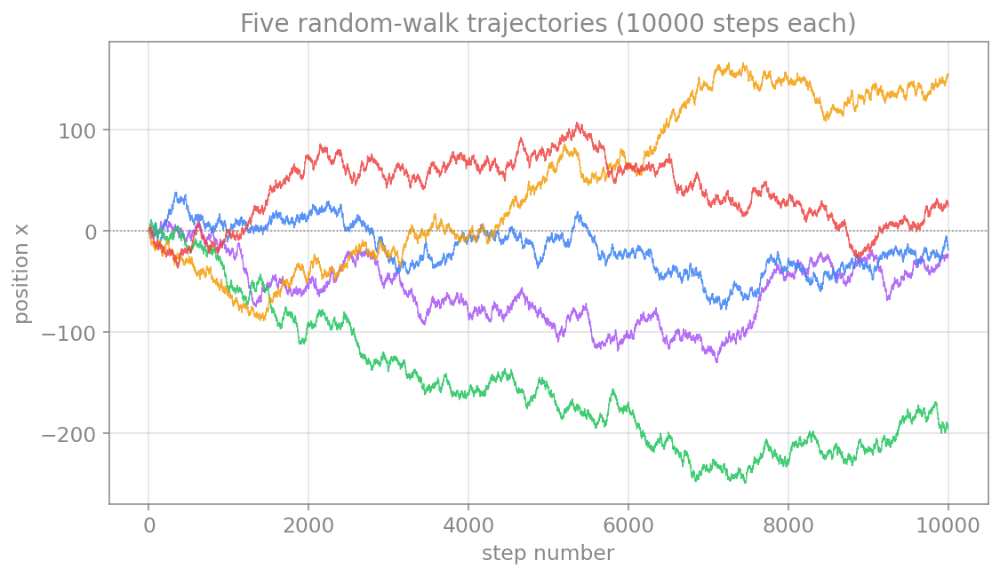
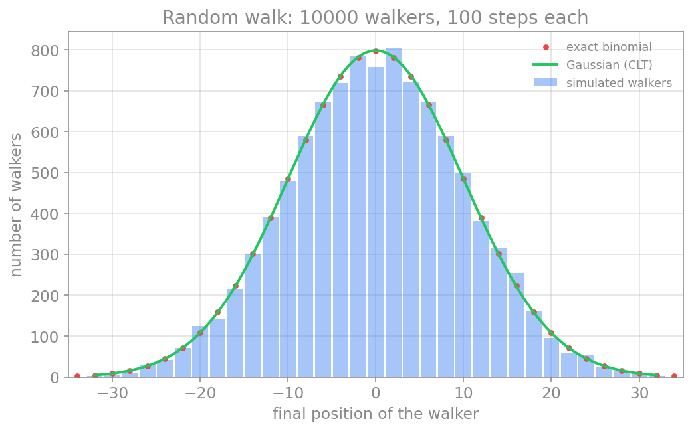

# حل عددی معادلات دیفرانسیل تصادفی

در فصلِ پیش، سامانه‌ها را **قطعی** فرض کردیم: شرطِ اولیه آینده را به‌طور یکتا تعیین می‌کرد. اما نورون‌ها در محیطی پرنوفه زندگی می‌کنند؛ بازشدنِ تصادفیِ کانال‌های یونی، بمبارانِ سیناپسیِ نامنظم و ورودی‌های پس‌زمینه همگی نوفه‌اند. برای مدل‌کردنِ این پدیده‌ها به **معادلهٔ دیفرانسیلِ تصادفی** (Stochastic Differential Equation، به‌اختصار SDE) و روشی برای حلِ عددیِ آن نیاز داریم. ساده‌ترین و پرکاربردترین چنین روشی، **اویلر–مارویاما** است که در این فصل آن را می‌سازیم و بر چند مثالِ نورونی به کار می‌بریم.

## گرم‌کردن: گشتِ تصادفی

پیش از آنکه به معادلات تصادفی بپردازیم، با ساده‌ترین فرایندِ تصادفی آغاز می‌کنیم: **گشتِ تصادفی** (random walk). یک ذره روی یک خط را در نظر بگیرید که از مبدأ آغاز می‌کند و در هر گام، با احتمالِ مساوی، یک واحد به راست یا چپ می‌رود. پس از $N$ گام، ذره کجاست؟ پاسخِ یک ذرهٔ منفرد تصادفی است، اما اگر **هزاران** ذره را هم‌زمان رها کنیم و **توزیعِ** مکانِ نهاییِ آن‌ها را رسم کنیم، یک الگوی منظم و آشنا پدید می‌آید.

این تصویرِ انتزاعی، تعبیرِ فیزیکیِ روشنی دارد. یک **ذرهٔ معلق در یک سیال** را در نظر بگیرید (مثلاً یک دانهٔ گردهٔ گیاهی در آب): مولکول‌های سیال پیوسته و از همه سو به آن برخورد می‌کنند، و هر برخورد آن را اندکی به این‌سو یا آن‌سو می‌راند. اگر تنها مؤلفهٔ یک‌بعدیِ این جابه‌جایی‌ها را دنبال کنیم، همان گشتِ تصادفیِ بالا را داریم؛ هر «گام» نتیجهٔ یک برخوردِ تصادفی است. این پدیده به **حرکتِ براونی** مشهور است و انیشتین در ۱۹۰۵ نشان داد که همین گشتِ تصادفیِ مولکولی، سرچشمهٔ **پخش** (diffusion) است. همین تصویر در علوم اعصاب نیز بازمی‌گردد: پخشِ یون‌ها در محلول، و نوفهٔ ناشی از بازوبسته‌شدنِ تصادفیِ کانال‌ها، هر دو ریشه در همین حرکتِ تصادفی دارند.

این مثال از دو جهت برای ما ارزشمند است. نخست، گشتِ تصادفی همان نسخهٔ **گسستهٔ** فرایندِ وینر است که در ادامه ستونِ نوفه در معادلات تصادفیِ ما خواهد بود؛ فرایندِ وینر، حدِ پیوستهٔ گشتِ تصادفی وقتی گام‌ها بی‌نهایت ریز شوند. دوم، و جالب‌تر، این مسئله یکی از معدود مثال‌هایی است که هم می‌توان آن را **عددی** شبیه‌سازی کرد و هم **تحلیلی** حل کرد، و دو نتیجه را با هم سنجید.

نخست چند مسیرِ منفرد را ببینیم. هر گردشگر از صفر آغاز می‌کند و گام‌به‌گام بالا و پایین می‌رود؛ مسیرها از هم می‌گریزند و هر یک سرنوشتِ متفاوتی دارد:

```python
import numpy as np
import matplotlib.pyplot as plt

def walk_trajectory(n_steps, rng):
    steps = rng.choice([-1, 1], size=n_steps)
    # start at 0, then accumulate the steps into a position over time
    return np.concatenate([[0], np.cumsum(steps)])

rng = np.random.default_rng(3)
N = 10000          # steps per walker
n_tracks = 5

for _ in range(n_tracks):
    trajectory = walk_trajectory(N, rng)
    plt.plot(np.arange(N + 1), trajectory, lw=0.7)
plt.axhline(0, color="gray", ls=":", lw=0.8)
plt.xlabel("step number")
plt.ylabel("position x")
plt.show()
```

<figure markdown="span">
  
  <figcaption>پنج مسیرِ گشتِ تصادفی، هرکدام با ۱۰۰۰۰ گام. همه از صفر آغاز می‌کنند، اما به‌مرورِ زمان از هم دور می‌شوند و هر مسیر سرنوشتِ متفاوتی پیدا می‌کند. پراکندگیِ این مسیرها با ریشهٔ دومِ شمارِ گام‌ها رشد می‌کند.</figcaption>
</figure>

هر مسیر به‌تنهایی نامنظم و غیرقابل‌پیش‌بینی است، اما وقتی هزاران مسیر را کنار هم بگذاریم، مکانِ نهاییِ آن‌ها الگوی منظمی می‌سازد. این الگو را هم تحلیلی و هم عددی به‌دست می‌آوریم.

**حلِ تحلیلی.** اگر مکانِ نهایی را $X$ بنامیم و شمارِ گام‌های به‌راست را $k$، آنگاه $X = 2k - N$. چون هر گام مستقل و با احتمالِ $1/2$ است، $k$ از توزیعِ دوجمله‌ای پیروی می‌کند و احتمالِ هر مکانِ نهایی دقیقاً چنین است:

$$
P(X = x) = \binom{N}{(x+N)/2}\Big/ 2^N.
$$

از سوی دیگر، طبقِ **قضیهٔ حدِ مرکزی**، مجموعِ $N$ گامِ مستقل برای $N$ بزرگ به یک توزیعِ نرمال میل می‌کند؛ با میانگینِ صفر و واریانسِ $N$ (یعنی انحرافِ معیارِ $\sqrt{N}$):

$$
X \sim \mathcal{N}(0, N).
$$

توجه کنید که انحرافِ معیار با $\sqrt{N}$ مقیاس می‌خورد، نه با $N$؛ همان ریشهٔ دومی که در سراسرِ این فصل بارها به آن بازخواهیم گشت.

**حلِ عددی.** کدِ زیر هزاران گردشگر را شبیه‌سازی می‌کند، توزیعِ مکانِ نهایی را به‌صورتِ هیستوگرام رسم می‌کند، و آن را با هر دو پاسخِ تحلیلی (دوجمله‌ای دقیق و تقریبِ گاوسی) مقایسه می‌کند:

```python
import numpy as np
import matplotlib.pyplot as plt
from math import comb, sqrt, pi

def simulate_walks(n_walkers, n_steps, rng):
    # each walker takes n_steps of +1 or -1 with equal probability
    steps = rng.choice([-1, 1], size=(n_walkers, n_steps))
    return np.sum(steps, axis=1)   # final position of each walker

rng = np.random.default_rng(0)
N = 100          # steps per walker
W = 10000        # number of walkers
final = simulate_walks(W, N, rng)
print(f"simulated mean = {final.mean():.2f} (expect 0)")
print(f"simulated variance = {final.var():.1f} (expect {N})")

# histogram of the simulated final positions
bins = np.arange(-N-1, N+2, 2)
centers = (bins[:-1] + bins[1:]) / 2
hist, _ = np.histogram(final, bins=bins)

# exact binomial distribution, scaled to the number of walkers
xs = np.arange(-N, N+1, 2)
binom_counts = np.array([comb(N, (x+N)//2) for x in xs]) / 2.0**N * W

# Gaussian approximation from the central limit theorem
xg = np.linspace(-3.5*sqrt(N), 3.5*sqrt(N), 400)
gauss = W * 2 * np.exp(-xg**2 / (2*N)) / sqrt(2*pi*N)

plt.bar(centers, hist, width=1.8, alpha=0.45, label="simulated walkers")
plt.plot(xs, binom_counts, "o", ms=3.5, label="exact binomial")
plt.plot(xg, gauss, "-", lw=2, label="Gaussian (CLT)")
plt.xlabel("final position of the walker")
plt.ylabel("number of walkers")
plt.legend()
plt.show()
```

<figure markdown="span">
  
  <figcaption>توزیعِ مکانِ نهاییِ ۱۰۰۰۰ گردشگرِ تصادفی، هرکدام پس از ۱۰۰ گام. هیستوگرامِ شبیه‌سازی (آبی)، توزیعِ دوجمله‌ایِ دقیق (نقاط قرمز) و تقریبِ گاوسیِ قضیهٔ حدِ مرکزی (سبز) تقریباً کاملاً بر هم منطبق‌اند. این، نمونه‌ای روشن از سازگاریِ نتیجهٔ عددی با پاسخِ تحلیلی است.</figcaption>
</figure>

نتیجهٔ شبیه‌سازی (واریانسِ نزدیک به $N$ و شکلِ زنگوله‌ای) دقیقاً با پیش‌بینیِ تحلیلی می‌خواند. این توافق، هم اعتمادِ ما به شبیه‌سازی را بالا می‌برد و هم نشان می‌دهد که چرا توزیعِ نرمال در دلِ نوفهٔ تصادفی این‌قدر فراگیر است. حال که شهودِ گسسته را ساختیم، به نسخهٔ پیوستهٔ آن، یعنی فرایندِ وینر، می‌پردازیم.

## فرایند وینر: سنگ‌بنای نوفه

نوفهٔ پایه در این چارچوب، **فرایند وینر** (یا حرکتِ براونی) $W(t)$ است. تنها ویژگیِ موردِ نیازِ ما این است که افزایش‌های آن در بازه‌های جدا از هم مستقل‌اند و توزیعِ نرمال با واریانسی برابرِ طولِ بازه دارند:

$$
\Delta W = W(t+\Delta t) - W(t) \sim \mathcal{N}(0, \Delta t).
$$

نکتهٔ کلیدی و سرنوشت‌ساز در همین‌جاست: انحرافِ معیارِ $\Delta W$ نه با $\Delta t$، بلکه با $\sqrt{\Delta t}$ متناسب است. همین ریشهٔ دوم است که حسابِ تصادفی را از حسابِ معمولی جدا می‌کند و، چنان‌که خواهیم دید، مرتبهٔ همگراییِ روش را نصف می‌کند.

## معادلهٔ دیفرانسیل تصادفی

یک SDE دو بخش دارد: یک جملهٔ **روند** (drift) که مانندِ یک ODE معمولی رفتارِ متوسط را می‌راند، و یک جملهٔ **پخش** (diffusion) که نوفه را وارد می‌کند:

$$
dX = a(X, t)\,dt + b(X, t)\,dW.
$$

جملهٔ نخست ($a\,dt$) همان روند است و جملهٔ دوم ($b\,dW$) پخش. در تفسیرِ ایتو (Itô)، که در اینجا به کار می‌بریم، جملهٔ پخش در آغازِ هر بازه ارزیابی می‌شود. این معادله را باید به‌صورتِ شکلِ انتگرالی فهمید، چون $W$ مشتق‌پذیر نیست؛ اما برای شبیه‌سازی، تنها به شکلِ گسسته‌شدهٔ آن نیاز داریم.

## روش اویلر–مارویاما

روشِ اویلر–مارویاما دقیقاً همان اویلرِ پیشروِ فصلِ پیش است، با یک افزوده: گامِ نوفه. هر بازه را گسسته می‌کنیم و افزایشِ وینر را با یک عددِ تصادفیِ نرمال می‌سازیم:

$$
X_{n+1} = X_n + a(X_n, t_n)\,\Delta t + b(X_n, t_n)\,\sqrt{\Delta t}\;\xi_n,
\qquad \xi_n \sim \mathcal{N}(0, 1).
$$

توجه کنید که جملهٔ نوفه در $\sqrt{\Delta t}$ ضرب می‌شود، نه در $\Delta t$؛ این مستقیماً از ویژگیِ فرایندِ وینر می‌آید و قلبِ تفاوتِ این روش با اویلرِ معمولی است. پیاده‌سازیِ آن چنین است:

```python
import numpy as np

def euler_maruyama(drift, diffusion, x0, T, dt, rng):
    n = int(T / dt)
    x = np.empty(n)
    x[0] = x0
    for i in range(n - 1):
        dW = rng.normal(0.0, np.sqrt(dt))      # Wiener increment ~ N(0, dt)
        x[i+1] = x[i] + drift(x[i]) * dt + diffusion(x[i]) * dW
    t = np.arange(n) * dt
    return t, x
```

## مثال: فرایند اورنشتاین–اولنبک

نمونهٔ کلاسیک، فرایندِ **اورنشتاین–اولنبک** (Ornstein–Uhlenbeck، به‌اختصار OU) است که یک سامانهٔ خطیِ بازگشت‌به‌میانگین را با نوفه توصیف می‌کند و در علوم اعصاب برای مدل‌کردنِ ولتاژِ زیرآستانه با ورودیِ پس‌زمینه به کار می‌رود:

$$
dX = -\theta\,X\,dt + \sigma\,dW.
$$

جملهٔ روندِ $-\theta X$ متغیر را به‌سمتِ صفر بازمی‌کشد و جملهٔ پخشِ $\sigma\,dW$ آن را پراکنده می‌کند. تعادلِ این دو، یک توزیعِ ایستا با انحرافِ معیارِ $\sigma/\sqrt{2\theta}$ می‌سازد. اگر چند مسیرِ نمونه را شبیه‌سازی کنیم، می‌بینیم که میانگین به‌صورت نمایی به صفر می‌رسد و پراکندگیِ مسیرها در همان نوارِ ایستا تثبیت می‌شود:

```python
import numpy as np
import matplotlib.pyplot as plt

def euler_maruyama(drift, diffusion, x0, T, dt, rng):
    n = int(T / dt)
    x = np.empty(n)
    x[0] = x0
    for i in range(n - 1):
        dW = rng.normal(0.0, np.sqrt(dt))
        x[i+1] = x[i] + drift(x[i]) * dt + diffusion(x[i]) * dW
    t = np.arange(n) * dt
    return t, x

# Ornstein-Uhlenbeck: drift pulls toward zero, diffusion is constant
theta = 1.0
sigma = 0.5

def ou_drift(x):
    return -theta * x

def ou_diffusion(x):
    return sigma

# simulate many sample paths sharing the same parameters
rng = np.random.default_rng(0)
T = 8.0
dt = 0.01
n_paths = 30
paths = []
for _ in range(n_paths):
    t, x = euler_maruyama(ou_drift, ou_diffusion, x0=2.0, T=T, dt=dt, rng=rng)
    paths.append(x)
paths = np.array(paths)
mean_path = np.mean(paths, axis=0)
band = sigma / np.sqrt(2 * theta)        # stationary standard deviation

# plot the paths, their mean, and the stationary band
for x in paths:
    plt.plot(t, x, color="tab:blue", lw=0.5, alpha=0.3)
plt.plot(t, mean_path, color="black", lw=2, label="empirical mean")
plt.axhline(band, color="red", ls="--", label="±σ/√(2θ)")
plt.axhline(-band, color="red", ls="--")
plt.xlabel("time t")
plt.ylabel("X")
plt.legend()
plt.show()
```

<figure markdown="span">
  
  <figcaption>چند مسیرِ نمونهٔ فرایند اورنشتاین–اولنبک با روش اویلر–مارویاما. میانگینِ تجربی (خاکستری) به‌صورت نمایی به صفر بازمی‌گردد و پراکندگیِ مسیرها در نوارِ ایستای ±σ/√(۲θ) (خط‌چینِ قرمز) تثبیت می‌شود.</figcaption>
</figure>

## مثال: نوسانگر هماهنگ با ورودی نوفه‌ای

روش به همان سادگی به سامانه‌های دوبعدی تعمیم می‌یابد. نوسانگرِ هماهنگ را در نظر بگیرید که یک جریانِ نوفه‌ای روی سرعتِ آن اثر می‌گذارد؛ نمونه‌ای ساده از یک سامانهٔ نوسانی که پیوسته تحتِ تأثیرِ نوفهٔ پس‌زمینه است:

$$
\begin{aligned}
dx &= v\,dt,\\
dv &= -\omega^2 x\,dt + \sigma\,dW.
\end{aligned}
$$

تنها معادلهٔ سرعت یک جملهٔ پخش دارد، چون نوفه روی نیرو (و نه مستقیماً روی مکان) وارد می‌شود.

برای رسیدن به شکلِ گسسته، باید معادله را روی یک گامِ زمانیِ $\Delta t$ انتگرال بگیریم. جملهٔ روند مانندِ اویلرِ معمولی به $\Delta t$ ضرب می‌شود، اما جملهٔ نوفه به انتگرالِ $dW$ روی همان بازه نیاز دارد. طبقِ ویژگیِ فرایندِ وینر، این انتگرال خودش یک افزایشِ وینر است، یعنی یک عددِ تصادفیِ نرمال با واریانسِ $\Delta t$. به‌بیانِ دیگر:

$$
\int_{t_n}^{t_n + \Delta t} dW = \Delta W \sim \mathcal{N}(0, \Delta t),
$$

و چون انحرافِ معیارِ آن $\sqrt{\Delta t}$ است، می‌توان آن را به‌صورتِ $\sqrt{\Delta t}\,\xi_n$ نوشت که در آن $\xi_n$ یک عددِ تصادفیِ کشیده‌شده از توزیعِ نرمالِ استانداردِ $\mathcal{N}(0, 1)$ است. با این جای‌گذاری، گام‌های گسستهٔ نوسانگر چنین می‌شوند:

$$
\begin{aligned}
v_{n+1} &= v_n - \omega^2 x_n\,\Delta t + \sigma\,\sqrt{\Delta t}\;\xi_n,\\
x_{n+1} &= x_n + v_{n+1}\,\Delta t.
\end{aligned}
$$

دقت کنید که جملهٔ نوفه در $\sqrt{\Delta t}$ ضرب می‌شود، نه در $\Delta t$. همچنین نکتهٔ ظریف این است که برای پایدارماندنِ دامنهٔ نوسانِ نسخهٔ قطعی، سرعت را **پیش از** مکان به‌روزرسانی می‌کنیم و سپس از سرعتِ تازه ($v_{n+1}$) برای مکان استفاده می‌کنیم؛ این همان ترتیبِ نیمه‌ضمنیِ (سیمپلکتیکِ) فصلِ پیش است که از انباشتِ مصنوعیِ انرژی در اویلر جلوگیری می‌کند.

با $\sigma=0$ نوسان کاملاً منظم و دامنه‌اش ثابت است (در صفحهٔ فاز یک دایرهٔ بسته). با افزایشِ $\sigma$، نوفه پیوسته نوسانگر را از مدارش بیرون می‌راند: نوسان نامنظم‌تر می‌شود و دایرهٔ صفحهٔ فاز به یک حلقهٔ پهن و پُرنوفه بدل می‌شود، اما از میان نمی‌رود.

```python
import numpy as np
import matplotlib.pyplot as plt

def sho_step(x, v, dt, omega, sigma, rng):
    dW = rng.normal(0.0, np.sqrt(dt))           # Wiener increment ~ N(0, dt)
    v_new = v + (-omega**2 * x) * dt + sigma * dW  # update velocity first (noise here)
    x_new = x + v_new * dt                          # semi-implicit: use the new velocity
    return x_new, v_new

omega = 2.0
T = 20.0
dt = 0.01
n = int(T / dt)
sigmas = [0.0, 0.1, 0.3, 0.6]

fig, axes = plt.subplots(len(sigmas), 2, figsize=(10, 9))
for row, sigma in enumerate(sigmas):
    rng = np.random.default_rng(5)
    xs = np.empty(n)
    vs = np.empty(n)
    xs[0], vs[0] = 1.0, 0.0
    times = np.arange(n) * dt
    for i in range(n - 1):
        xs[i+1], vs[i+1] = sho_step(xs[i], vs[i], dt, omega, sigma, rng)
    axes[row, 0].plot(times, xs, color="tab:blue", lw=0.7)
    axes[row, 0].set_ylabel(f"sigma={sigma}\n x")
    axes[row, 1].plot(xs, vs, color="tab:purple", lw=0.5, alpha=0.8)
    axes[row, 1].set_ylabel("v")
axes[0, 0].set_title("time series")
axes[0, 1].set_title("phase plane")
axes[-1, 0].set_xlabel("time t")
axes[-1, 1].set_xlabel("x")
plt.tight_layout()
plt.show()
```

<figure markdown="span">
  
  <figcaption>نوسانگر هماهنگ با توان‌های فزایندهٔ نوفه (σ = ۰، ۰٫۱، ۰٫۳، ۰٫۶). ستون چپ سری زمانی و ستون راست صفحهٔ فاز است. با σ=۰ مدار یک دایرهٔ بسته است؛ هرچه σ بزرگ‌تر شود، مدار به حلقه‌ای پهن‌تر و نامنظم‌تر تبدیل می‌شود.</figcaption>
</figure>

## مثال: مدل فیتزهیو–ناگومو با جریان نوفه‌ای

نمونهٔ مهم‌تر برای علوم اعصاب، افزودنِ نوفه به جریانِ ورودیِ یک نورونِ تحریک‌پذیر است. مدلِ فیتزهیو–ناگومو (که در فصلِ پیش دیدیم) را با یک جملهٔ نوفه روی معادلهٔ ولتاژ می‌نویسیم:

$$
\begin{aligned}
dv &= \Big(v - \tfrac{v^3}{3} - w + I\Big)\,dt + \sigma\,dW,\\
dw &= \varepsilon\,(v + a - b\,w)\,dt.
\end{aligned}
$$

جریانِ ورودیِ $I$ را زیرِ آستانهٔ شلیک انتخاب می‌کنیم؛ در نتیجه نسخهٔ قطعی روی نقطهٔ تعادلِ پایدار می‌ماند و کاملاً خاموش است. حال همان شبیه‌سازی را برای چند توانِ نوفه تکرار می‌کنیم. با $\sigma=0$ نورون ساکت است؛ اما همین‌که نوفه را بزرگ‌تر کنیم، تلنگرهای تصادفی نورون را از آستانه عبور می‌دهند و پتانسیل‌های عمل پدید می‌آیند، و هرچه توانِ نوفه بیشتر، شلیک‌ها پُرتکرارتر. این پدیده به **شلیکِ القاشده با نوفه** (noise-induced firing) مشهور است و نشان می‌دهد که نرخِ شلیک می‌تواند مستقیماً با شدتِ نوفه تنظیم شود.

```python
import numpy as np
import matplotlib.pyplot as plt

def fhn_step(v, w, dt, a, b, eps, I, sigma, rng):
    dW = rng.normal(0.0, np.sqrt(dt))                 # Wiener increment ~ N(0, dt)
    v_new = v + (v - v**3/3 - w + I) * dt + sigma * dW  # noisy input current
    w_new = w + eps * (v + a - b * w) * dt
    return v_new, w_new

def count_spikes(v):
    # count upward crossings of the threshold v = 1.0
    return int(np.sum((v[:-1] < 1.0) & (v[1:] >= 1.0)))

a, b, eps, I = 0.7, 0.8, 0.08, 0.25     # I is below the firing threshold
T = 400.0
dt = 0.01
n = int(T / dt)
sigmas = [0.0, 0.15, 0.3, 0.5]

fig, axes = plt.subplots(len(sigmas), 1, figsize=(9, 8), sharex=True)
for row, sigma in enumerate(sigmas):
    rng = np.random.default_rng(7)
    vs = np.empty(n)
    ws = np.empty(n)
    vs[0], ws[0] = -1.0, -0.5
    times = np.arange(n) * dt
    for i in range(n - 1):
        vs[i+1], ws[i+1] = fhn_step(vs[i], ws[i], dt, a, b, eps, I, sigma, rng)
    n_spikes = count_spikes(vs)
    axes[row].plot(times, vs, lw=0.7)
    if sigma == 0.0:
        axes[row].set_title(f"sigma = {sigma}  (deterministic: silent)", loc="left")
    else:
        axes[row].set_title(f"sigma = {sigma}  ->  {n_spikes} spikes", loc="left")
    axes[row].set_ylabel("v(t)")
axes[-1].set_xlabel("time t")
plt.tight_layout()
plt.show()
```

<figure markdown="span">
  
  <figcaption>مدل فیتزهیو–ناگومو با جریان زیرآستانه (I=۰٫۲۵) و توان‌های فزایندهٔ نوفه (σ = ۰، ۰٫۱۵، ۰٫۳، ۰٫۵). با σ=۰ نورون پس از یک شلیکِ آغازین خاموش می‌شود؛ با افزایش σ شمار پتانسیل‌های عملِ القاشده با نوفه به‌طور پیوسته بیشتر می‌شود (شمارِ شلیک‌ها در عنوانِ هر زیرنمودار آمده است).</figcaption>
</figure>

این مثال‌ها نشان می‌دهند که نوفه صرفاً «اخلال» نیست؛ شدتِ آن می‌تواند رفتارِ سامانه را به‌طور پیوسته تنظیم کند و گاه رفتارِ کیفیِ تازه‌ای (مانندِ شلیکِ یک نورونِ خاموش) بیافریند.

## همگرایی: قوی، ضعیف و بهای نوفه

در سامانه‌های تصادفی دو نوع همگرایی را از هم جدا می‌کنیم. **همگراییِ قوی** به دقتِ خودِ مسیر (به‌ازای همان تحققِ نوفه) می‌پردازد، حال‌آنکه **همگراییِ ضعیف** تنها دقتِ کمیت‌های میانگین مانندِ امید یا واریانس را می‌سنجد. روشِ اویلر–مارویاما مرتبهٔ همگراییِ **قویِ** $1/2$ و مرتبهٔ همگراییِ **ضعیفِ** $1$ دارد.

مرتبهٔ قویِ $1/2$ پیامدِ مستقیمِ همان $\sqrt{\Delta t}$ است و آن را می‌توان به‌روشنی دید. برای سنجشِ آن، از حرکتِ براونیِ هندسی استفاده می‌کنیم، یعنی معادلهٔ $dX = \mu X\,dt + \sigma X\,dW$ که جوابِ تحلیلیِ دقیقی دارد؛ پس می‌توانیم خطای مسیرِ عددی را نسبت به مسیرِ دقیق (با همان تحققِ نوفه) بسنجیم. اگر این خطا را بر حسبِ گام در مقیاسِ لگاریتمی رسم کنیم، شیبِ خط نزدیکِ $1/2$ است، یعنی نصفِ مرتبهٔ اویلرِ معمولی برای ODEها. به بیانِ دیگر، نوفه نیمی از مرتبهٔ دقت را می‌گیرد.

```python
import numpy as np
import matplotlib.pyplot as plt

# geometric Brownian motion has a known exact solution, so we can measure the
# strong error of Euler-Maruyama against the true path (same Brownian increments)
mu = 1.0
sigma = 1.5
X0 = 1.0
T = 1.0

def strong_error(dt, n_trials, rng):
    n = int(T / dt)
    errors = []
    for _ in range(n_trials):
        dW = rng.normal(0.0, np.sqrt(dt), n)
        W_total = np.sum(dW)
        x_exact = X0 * np.exp((mu - 0.5*sigma**2) * T + sigma * W_total)
        x = X0
        for k in range(n):
            x = x + mu * x * dt + sigma * x * dW[k]   # Euler-Maruyama step
        errors.append(abs(x - x_exact))
    return np.mean(errors)

rng = np.random.default_rng(42)
dts = np.array([0.008, 0.004, 0.002, 0.001])
errors = np.array([strong_error(dt, 800, rng) for dt in dts])
slope = np.polyfit(np.log(dts), np.log(errors), 1)[0]
print(f"estimated strong order = {slope:.2f}")

plt.loglog(dts, errors, "o-", label=f"strong error (slope ~ {slope:.2f})")
plt.loglog(dts, errors[0]*np.sqrt(dts/dts[0]), "--", label="slope 1/2 reference")
plt.xlabel("time step dt")
plt.ylabel("strong error")
plt.legend()
plt.show()
```

<figure markdown="span">
  
  <figcaption>همگراییِ قویِ روش اویلر–مارویاما برای حرکتِ براونیِ هندسی. خطای قوی با شیبی نزدیک به ۱/۲ کاهش می‌یابد؛ نصفِ مرتبهٔ اویلرِ پیشرو برای معادلات قطعی. این، بهای حضورِ نوفه است.</figcaption>
</figure>

## نکته‌ها و گام‌های بعدی

دو نکتهٔ تکمیلی ارزشِ یادآوری دارند. نخست، **تفسیرِ ایتو در برابرِ استراتونوویچ**: وقتی جملهٔ پخش به حالت بستگی دارد ($b$ تابعی از $X$)، انتخابِ نقطهٔ ارزیابیِ نوفه در نتیجه اثر می‌گذارد؛ ما تفسیرِ ایتو را به کار بردیم که با شکلِ اویلر–مارویاما سازگار است. دوم، روشِ **میلستین** (Milstein) با افزودنِ یک جملهٔ تصحیحی، مرتبهٔ همگراییِ قوی را به $1$ می‌رساند و گزینهٔ بعدی است اگر دقتِ مسیرها اهمیت داشته باشد.

این ابزار در بخش‌های بعدی بارها به کار می‌آید: از مدل‌های نورونِ نوفه‌ای و نسخهٔ تصادفیِ هاجکین–هاکسلی گرفته تا ورودیِ پس‌زمینهٔ تصادفی در شبکه‌های بزرگ که در بخشِ شبکه‌ها به آن می‌پردازیم.

---

برای مطالعهٔ بیشتر:

<div dir="ltr" markdown>

- Higham, D.J., 2001. An algorithmic introduction to numerical simulation of stochastic differential equations. SIAM Review 43(3), 525–546.
- Kloeden, P.E., Platen, E., 1992. Numerical Solution of Stochastic Differential Equations. Springer.
- Gardiner, C., 2009. Stochastic Methods, 4th ed. Springer.

</div>
