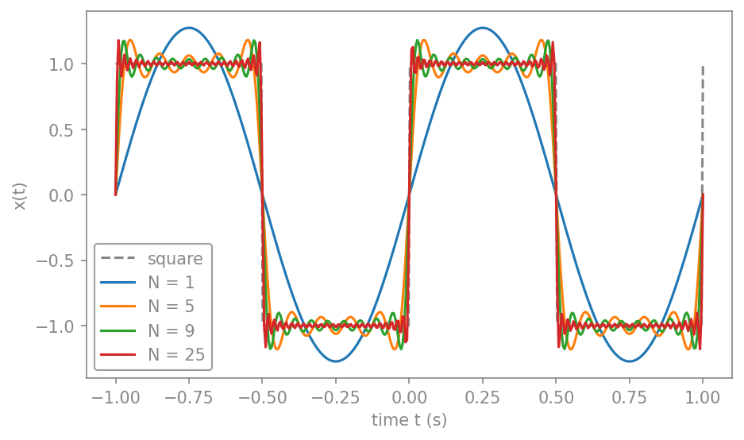
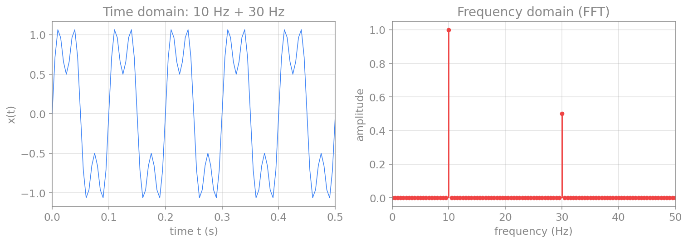
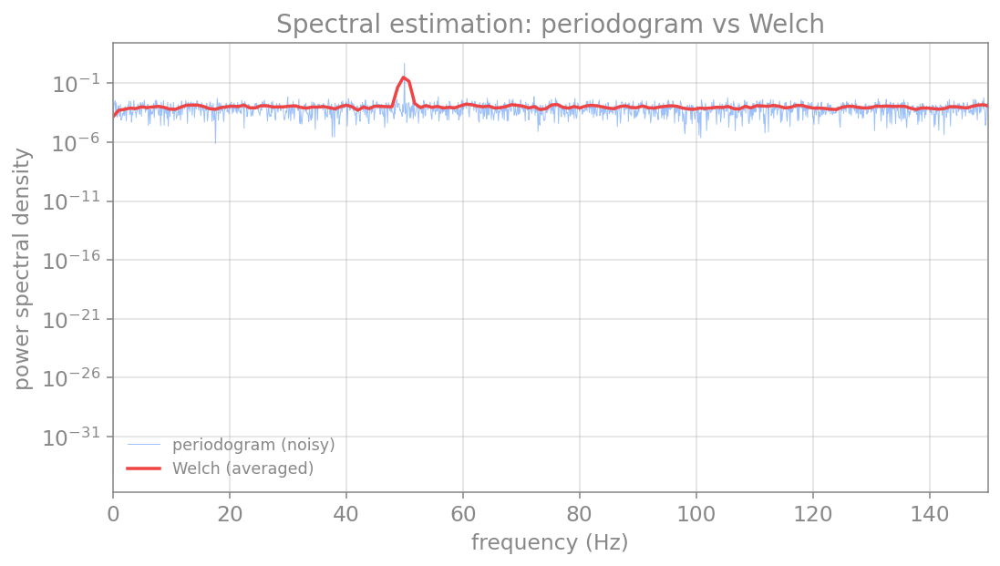

# پردازش سیگنال و تحلیل طیفی

سیگنال‌هایی که در علوم اعصاب اندازه می‌گیریم، مانندِ نوارِ مغزی (EEG)، پتانسیلِ میدانیِ محلی (LFP) یا ولتاژِ غشای یک نورون، همگی در **حوزهٔ زمان** ثبت می‌شوند: مقدارِ سیگنال بر حسبِ زمان. اما بسیاری از پدیده‌های جالب در مغز، **ریتمیک‌اند**: نوسان‌های آلفا، بتا، گاما و امواجِ آهسته، هر کدام در یک بازهٔ بسامدیِ مشخص رخ می‌دهند. برای دیدنِ این ریتم‌ها باید سیگنال را به **حوزهٔ بسامد** ببریم؛ یعنی بپرسیم «چه بسامدهایی و با چه شدتی در این سیگنال حضور دارند؟». این کار، موضوعِ **تحلیلِ طیفی** (spectral analysis) است.

این فصل ابزارهای این کار را، از پایه، می‌سازد: از سری فوریه و تبدیل فوریه (دیدگاهِ نظری و پیوسته)، تا نمونه‌برداری و تبدیلِ فوریهٔ گسسته (آنچه در عمل با داده‌های ثبت‌شده به کار می‌بریم)، و سرانجام روش‌های پیشرفته‌ترِ تخمینِ طیف، طیف‌نگار و تبدیلِ موجک که برای تحلیلِ سیگنال‌های واقعیِ مغزی ضروری‌اند.

## یادآوری: سیگنال‌های متناوب

ساده‌ترین سیگنالِ بسامدی، یک کسینوسِ منفرد است:

$$
x(t) = A\cos(2\pi f_0 t + \theta).
$$

این سیگنال با سه کمیت توصیف می‌شود: **دامنه** $A$ (مثلاً ولت)، **بسامد** $f_0$ (هرتز، یعنی شمارِ چرخه‌ها در ثانیه) و **فاز** $\theta$ (رادیان، که آغازِ نوسان را جابه‌جا می‌کند). بسامدِ زاویه‌ای $\omega_0 = 2\pi f_0$ و دوره (پریود) $T_0 = 1/f_0$ نیز از همین‌ها به‌دست می‌آیند.

یک سیگنالِ **متناوب** آن است که پس از یک دوره عیناً تکرار می‌شود:

$$
x(t + T_0) = x(t), \qquad \text{for all } t.
$$

کوچک‌ترین چنین $T_0$ را **دورهٔ بنیادی** می‌نامند. اگر هیچ $T_0$ای این شرط را برآورده نکند، سیگنال **نامتناوب** (aperiodic) است.

## سری فوریه

پرسشِ بنیادینِ فوریه این بود: آیا می‌توان **هر** سیگنالِ متناوب را به‌صورتِ مجموعی از کسینوس‌ها و سینوس‌های با بسامدهای مختلف نوشت؟ پاسخ مثبت است. هر سیگنالِ متناوبِ $x(t)$ با دورهٔ $T_0$ را می‌توان چنین بسط داد:

$$
x(t) = a_0 + \sum_{k=1}^{\infty} a_k \cos(k\omega_0 t) + \sum_{k=1}^{\infty} b_k \sin(k\omega_0 t),
\qquad \omega_0 = \frac{2\pi}{T_0}.
$$

این بسط، **سری فوریه** نام دارد. جمله‌های آن، سینوس‌ها و کسینوس‌هایی با بسامدهای $\omega_0, 2\omega_0, 3\omega_0, \dots$ هستند که به آن‌ها **هم‌نوا** (harmonics) می‌گویند: بسامدِ بنیادی و مضرب‌های صحیحِ آن.

ضرایبِ این سری را می‌توان با استفاده از خاصیتِ **تعامد** (orthogonality) سینوس‌ها و کسینوس‌ها به‌دست آورد (انتگرالِ حاصل‌ضربِ دو هم‌نوای متفاوت روی یک دوره صفر است). نتیجه چنین است:

$$
\begin{aligned}
a_0 &= \frac{1}{T_0}\int_{T_0} x(t)\,dt,\\
a_k &= \frac{2}{T_0}\int_{T_0} x(t)\cos(k\omega_0 t)\,dt,\\
b_k &= \frac{2}{T_0}\int_{T_0} x(t)\sin(k\omega_0 t)\,dt.
\end{aligned}
$$

ضریبِ $a_0$ همان **مقدارِ میانگینِ** سیگنال است (می‌توان آن را کسینوس با بسامدِ صفر دانست). ضرایبِ $a_k$ و $b_k$ سهمِ هر هم‌نوا را تعیین می‌کنند.

!!! note "مثال: موجِ مربعی"
    یک موجِ مربعی را در نظر بگیرید که در نیمهٔ نخستِ هر دوره برابرِ $+1$ و در نیمهٔ دوم برابرِ $-1$ است. این تابع فرد است، پس همهٔ ضرایبِ کسینوسی صفرند ($a_0 = 0$ و $a_k = 0$)، و ضرایبِ سینوسی چنین می‌شوند:

    $$
    b_k = \begin{cases} \dfrac{4}{k\pi}, & k \text{ odd},\\[4pt] 0, & k \text{ even}. \end{cases}
    $$

    پس موجِ مربعی تنها از هم‌نواهای فرد ساخته می‌شود (k فرد). هرچه جمله‌های بیشتری از سری را نگه داریم، تقریب به موجِ مربعیِ واقعی نزدیک‌تر می‌شود:

کدِ زیر این بنا را می‌سازد و نشان می‌دهد که با افزودنِ هم‌نواها، مجموع به موجِ مربعی نزدیک‌تر می‌شود:

```python
import numpy as np
import matplotlib.pyplot as plt

def square_wave_series(t, T0, n_terms):
    omega0 = 2*np.pi / T0
    x = np.zeros_like(t)
    for k in range(1, 2*n_terms, 2):     # odd harmonics only
        x = x + (4 / (k*np.pi)) * np.sin(k*omega0*t)
    return x

t = np.linspace(0, 2, 2000)
target = np.where((t % 1) < 0.5, 1.0, -1.0)   # the true square wave

plt.plot(t, target, "--", color="gray", label="square wave")
for n_terms in [1, 2, 5, 20]:
    plt.plot(t, square_wave_series(t, T0=1.0, n_terms=n_terms),
             label=f"{n_terms} terms")
plt.xlabel("time t")
plt.ylabel("x(t)")
plt.legend()
plt.show()
```

<figure markdown="span">
  
  <figcaption>ساختنِ یک موجِ مربعی از هم‌نواهای سینوسی. با یک جمله تنها یک سینوس داریم؛ با افزودنِ هم‌نواهای فردِ بیشتر (۲، ۵، ۲۰ جمله) مجموع به موجِ مربعیِ واقعی (خط‌چینِ خاکستری) نزدیک‌تر می‌شود. نوسان‌های کوچک نزدیکِ لبه‌ها، پدیدهٔ گیبس نام دارند.</figcaption>
</figure>

## سری فوریه مختلط

با کمکِ فرمولِ اویلر، $e^{j\omega t} = \cos(\omega t) + j\sin(\omega t)$، می‌توان سری فوریه را به شکلِ فشرده‌ترِ **مختلط** نوشت. سینوس و کسینوس را می‌توان به‌صورتِ ترکیبی از $e^{j k\omega_0 t}$ و $e^{-j k\omega_0 t}$ بیان کرد، و سری به این شکل درمی‌آید:

$$
x(t) = \sum_{k=-\infty}^{\infty} X_k\, e^{j k \omega_0 t},
\qquad
X_k = \frac{1}{T_0}\int_{T_0} x(t)\, e^{-j k\omega_0 t}\,dt.
$$

اینجا اندیسِ $k$ از منفی‌بی‌نهایت تا مثبت‌بی‌نهایت می‌رود و ضرایبِ $X_k$ مختلط‌اند: قدرِ مطلقِ آن‌ها دامنه و فازشان فازِ هر هم‌نوا را می‌دهد. این صورت، هم زیباتر است و هم پایهٔ تبدیلِ فوریه و تبدیلِ فوریهٔ گسسته‌ای است که در ادامه می‌سازیم.

## تبدیل فوریه

سری فوریه تنها برای سیگنال‌های **متناوب** کار می‌کند. اما بیشترِ سیگنال‌های واقعی متناوب نیستند. اگر دورهٔ $T_0$ را به‌سمتِ بی‌نهایت ببریم (یعنی سیگنال دیگر تکرار نشود)، فاصلهٔ میانِ هم‌نواها ($\omega_0 = 2\pi/T_0$) به صفر میل می‌کند و مجموعِ گسسته به یک **انتگرال** بدل می‌شود. نتیجه، **تبدیلِ فوریه** است:

$$
X(f) = \int_{-\infty}^{\infty} x(t)\, e^{-j 2\pi f t}\,dt,
\qquad
x(t) = \int_{-\infty}^{\infty} X(f)\, e^{j 2\pi f t}\,df.
$$

تابعِ $X(f)$، **طیفِ** سیگنال نام دارد و برای هر بسامدِ پیوستهٔ $f$، دامنه و فازِ آن مؤلفه را می‌دهد. تبدیلِ نخست، سیگنال را از حوزهٔ زمان به حوزهٔ بسامد می‌برد، و تبدیلِ دوم (تبدیلِ معکوس) آن را بازمی‌گرداند. این دو، دو روی یک سکه‌اند: همان اطلاعات، یک‌بار بر حسبِ زمان و یک‌بار بر حسبِ بسامد.

## نمونه‌برداری و قضیهٔ نایکوئیست

تا اینجا با سیگنال‌های **پیوسته** کار کردیم. اما رایانه تنها می‌تواند با **نمونه‌های گسسته** کار کند: مقادیرِ سیگنال در لحظه‌های مجزای $t = n\Delta t$، که در آن $\Delta t$ **گامِ نمونه‌برداری** و $f_s = 1/\Delta t$ **بسامدِ نمونه‌برداری** است. سیگنالِ گسسته را با $x[n]$ یا $x_n$ نشان می‌دهیم.

پرسشِ کلیدی این است: چند بار در ثانیه باید نمونه بگیریم تا سیگنال را درست بازنمایی کنیم؟ پاسخ را **قضیهٔ نمونه‌برداری** می‌دهد: اگر سیگنال هیچ مؤلفهٔ بسامدیِ بالاتر از $f_h$ نداشته باشد (یعنی **باندمحدود** باشد)، آنگاه نمونه‌برداری با بسامدی **بیشتر از** $2 f_h$ برای بازسازیِ کاملِ سیگنال کافی است. کمیتِ $2 f_h$ را **نرخِ نایکوئیست** و کمیتِ $f_s/2$ را **بسامدِ نایکوئیست** می‌نامند.

اگر این شرط را نقض کنیم، یعنی **خیلی آهسته** نمونه بگیریم، پدیدهٔ **هم‌نامی** (aliasing) رخ می‌دهد: مؤلفه‌های بسامدِ بالا به‌صورتِ مؤلفه‌های بسامدِ پایینِ جعلی ظاهر می‌شوند و سیگنالِ بازسازی‌شده نادرست است. نمونهٔ آشنای آن، چرخشِ ظاهراً وارونهٔ چرخِ خودرو در فیلم است (که چون دوربین خیلی آهسته فریم می‌گیرد، رخ می‌دهد).

```python
import numpy as np
import matplotlib.pyplot as plt

fc = 5.0                                  # signal frequency: 5 Hz
t_cont = np.linspace(0, 1, 2000)
x_cont = np.cos(2*np.pi*fc*t_cont)

fig, axes = plt.subplots(1, 2, figsize=(11, 4), sharey=True)
for ax, fs in zip(axes, [14.0, 7.0]):     # 14 Hz is fine, 7 Hz aliases
    ax.plot(t_cont, x_cont, color="gray", alpha=0.6, label="original 5 Hz")
    t_s = np.arange(0, 1 + 1e-9, 1/fs)
    x_s = np.cos(2*np.pi*fc*t_s)
    ax.plot(t_s, x_s, "o", color="red", label="samples")
    if fs < 2*fc:                          # below Nyquist: show the alias
        f_alias = abs(fc - fs)
        ax.plot(t_cont, np.cos(2*np.pi*f_alias*t_cont), "--",
                color="green", label=f"alias {f_alias:.0f} Hz")
    ax.set_xlabel("time t (s)")
    ax.set_title(f"fs = {fs:.0f} Hz")
    ax.legend(fontsize=8)
plt.tight_layout()
plt.show()
```

<figure markdown="span">
  
  <figcaption>هم‌نامی. چپ: نمونه‌برداری از یک سیگنالِ ۵ هرتزی با fₛ=۱۴ هرتز (بالاتر از نرخِ نایکوئیست) سیگنال را درست بازنمایی می‌کند. راست: با fₛ=۷ هرتز (پایین‌تر از نرخِ نایکوئیست) نمونه‌ها (نقاط قرمز) با یک سیگنالِ بسامدِ پایین‌ترِ جعلی (خط‌چینِ سبز) هم‌خوان می‌شوند؛ این همان هم‌نامی است.</figcaption>
</figure>

## تبدیل فوریه گسسته (DFT)

اکنون می‌خواهیم طیفِ یک سیگنالِ **نمونه‌برداری‌شده و با طولِ محدود** را با رایانه حساب کنیم. دو محدودیت داریم: سیگنال را تا ابد نمی‌توان اندازه گرفت (پس تنها $N$ نمونه داریم)، و رایانه به ورودی و خروجیِ گسسته نیاز دارد (پس طیف را هم تنها در بسامدهای گسسته حساب می‌کنیم). نتیجه، **تبدیلِ فوریهٔ گسسته** (Discrete Fourier Transform، به‌اختصار DFT) است:

$$
X_k = \sum_{n=0}^{N-1} x_n\, e^{-j\frac{2\pi}{N} k n},
\qquad
x_n = \frac{1}{N}\sum_{k=0}^{N-1} X_k\, e^{j\frac{2\pi}{N} k n},
$$

که در آن هر دو اندیسِ $n$ و $k$ از $0$ تا $N-1$ می‌روند. ($N$ نمونهٔ زمانی به $N$ نمونهٔ بسامدی نگاشته می‌شود.)

دو کمیتِ کلیدی، **تفکیکِ بسامدی** و بیشینه بسامد را تعیین می‌کنند. اگر $N$ نمونه با گامِ $\Delta t$ (یعنی مدتِ کلِ $T = N\Delta t$) داشته باشیم، تفکیکِ بسامدی $\Delta f$ و بازهٔ بسامد چنین‌اند:

$$
\Delta f = \frac{1}{T} = \frac{f_s}{N},
\qquad
f_s = \frac{1}{\Delta t}.
$$

کمیتِ $\Delta f$ تفکیکِ بسامدی است (کوچک‌ترین فاصلهٔ قابلِ‌تشخیص میانِ دو بسامد) و $f_s$ بیشینه بازهٔ بسامدی را معین می‌کند.

پس برای تفکیکِ بسامدیِ بهتر (یعنی $\Delta f$ کوچک‌تر) به مدتِ ثبتِ طولانی‌ترِ $T$ نیاز داریم. این یک بده‌بستانِ بنیادی است.

محاسبهٔ مستقیمِ DFT کند است (از مرتبهٔ $N^2$ عمل)، اما الگوریتمِ **تبدیلِ فوریهٔ سریع** (Fast Fourier Transform، به‌اختصار FFT) همان نتیجه را در مرتبهٔ $N\log N$ می‌دهد و در همهٔ کتابخانه‌های علمی پیاده‌سازی شده است. در پایتون از `numpy.fft` استفاده می‌کنیم. توجه کنید که `numpy` ضرایبِ $\Delta t$ را اعمال نمی‌کند؛ کاربر باید خودش بُعدِ زمان و بسامد را بازگرداند.

```python
import numpy as np
import matplotlib.pyplot as plt

# a signal made of two tones: 10 Hz and 30 Hz
fs = 200.0                                # sampling frequency
T = 2.0                                   # total duration
t = np.arange(0, T, 1/fs)
x = 1.0*np.sin(2*np.pi*10*t) + 0.5*np.sin(2*np.pi*30*t)

# FFT: use rfft for a real signal (returns only non-negative frequencies)
X = np.fft.rfft(x)
freqs = np.fft.rfftfreq(len(x), 1/fs)
amplitude = 2*np.abs(X) / len(x)          # restore amplitude scaling

fig, (ax1, ax2) = plt.subplots(1, 2, figsize=(11, 4))
ax1.plot(t, x, color="tab:blue")
ax1.set_xlabel("time t (s)"); ax1.set_ylabel("x(t)")
ax1.set_title("time domain"); ax1.set_xlim(0, 0.5)
ax2.stem(freqs, amplitude, basefmt=" ")
ax2.set_xlabel("frequency (Hz)"); ax2.set_ylabel("amplitude")
ax2.set_title("frequency domain (FFT)"); ax2.set_xlim(0, 50)
plt.tight_layout()
plt.show()
```

<figure markdown="span">
  
  <figcaption>یک سیگنال در حوزهٔ زمان (چپ) و طیفِ آن از FFT (راست). سیگنال از دو مؤلفهٔ ۱۰ و ۳۰ هرتزی ساخته شده؛ طیف دقیقاً دو قله در همین بسامدها نشان می‌دهد، با ارتفاع‌هایی متناسب با دامنهٔ هر مؤلفه (۱٫۰ و ۰٫۵).</figcaption>
</figure>

## تخمین طیف توان

برای سیگنال‌های واقعی که **نوفه** دارند (مانندِ EEG)، طیفِ خامِ FFT بسیار پرنوسان و نامنظم است. آنچه معمولاً می‌خواهیم، **چگالیِ طیفیِ توان** (Power Spectral Density، به‌اختصار PSD) است: اینکه توانِ سیگنال چگونه میانِ بسامدها پخش شده است. ساده‌ترین تخمین، **پریودوگرام** است (مجذورِ قدرِ مطلقِ FFT)، اما این تخمین واریانسِ بالایی دارد و با طولانی‌ترکردنِ سیگنال هموارتر نمی‌شود.

راهِ بهترِ متداول، روشِ **ولچ** (Welch) است: سیگنال را به چند قطعهٔ هم‌پوشان می‌شکنیم، پریودوگرامِ هر قطعه را حساب می‌کنیم، و میانگین می‌گیریم. این میانگین‌گیری واریانس را کاهش می‌دهد و طیفِ هموارتر و قابل‌اعتمادتری می‌دهد، به بهای اندکی کاهش در تفکیکِ بسامدی. هر دو روش در `scipy.signal` آماده‌اند:

```python
import numpy as np
import matplotlib.pyplot as plt
from scipy import signal as sig

# a 50 Hz signal buried in noise
np.random.seed(0)
fs = 500.0
t = np.arange(0, 10, 1/fs)
x = np.sin(2*np.pi*50*t) + 0.5*np.random.randn(len(t))

f_per, P_per = sig.periodogram(x, fs)              # raw periodogram
f_wel, P_wel = sig.welch(x, fs, nperseg=512)       # Welch's averaged method

plt.semilogy(f_per, P_per, color="tab:blue", alpha=0.5, label="periodogram")
plt.semilogy(f_wel, P_wel, color="tab:red", lw=2, label="Welch")
plt.xlabel("frequency (Hz)")
plt.ylabel("power spectral density")
plt.xlim(0, 150)
plt.legend()
plt.show()
```

<figure markdown="span">
  
  <figcaption>تخمینِ طیفِ توان برای یک سیگنالِ ۵۰ هرتزی در میانِ نوفه. پریودوگرامِ خام (آبی) بسیار پرنوسان است؛ روشِ ولچ (قرمز) با میانگین‌گیری روی چند قطعه، طیفِ هموارتری می‌دهد که قلهٔ ۵۰ هرتزی در آن به‌روشنی دیده می‌شود.</figcaption>
</figure>

این، در علوم اعصاب کاربردِ مستقیم دارد: وقتی می‌خواهیم بدانیم توانِ یک سیگنالِ EEG در باندِ آلفا (حدودِ ۸ تا ۱۲ هرتز) یا گاما (بالای ۳۰ هرتز) چقدر است، دقیقاً همین PSD را با روشِ ولچ تخمین می‌زنیم.

## طیف‌نگار: تحلیل زمان–بسامد

تبدیلِ فوریه یک فرضِ مهم دارد: محتوای بسامدیِ سیگنال در طولِ زمان **ثابت** است. اما بسیاری از سیگنال‌های واقعی **ناایستا** (non-stationary) هستند؛ محتوای بسامدیِ آن‌ها در زمان تغییر می‌کند. برای مثال، در یک تشنج صرعی، ریتمِ غالبِ مغز در طولِ زمان جابه‌جا می‌شود. تبدیلِ فوریهٔ کلِ سیگنال تنها میانگینِ این تغییرات را می‌دهد و نمی‌گوید **چه بسامدی در چه زمانی** حاضر بوده است.

راهِ حل، **طیف‌نگار** (spectrogram) است که بر پایهٔ **تبدیلِ فوریهٔ زمان‌کوتاه** (Short-Time Fourier Transform، به‌اختصار STFT) بنا شده است: سیگنال را به پنجره‌های زمانیِ کوتاهِ هم‌پوشان می‌شکنیم، FFT هر پنجره را حساب می‌کنیم، و نتیجه را به‌صورتِ یک نقشهٔ دوبعدیِ زمان–بسامد کنار هم می‌چینیم. تابعِ `scipy.signal.spectrogram` این کار را انجام می‌دهد:

```python
import numpy as np
import matplotlib.pyplot as plt
from scipy import signal as sig

# a chirp: a signal whose frequency rises over time
fs = 1000.0
t = np.arange(0, 5, 1/fs)
x = sig.chirp(t, f0=10, f1=120, t1=5, method="linear")

# compute the spectrogram (STFT)
f, t_spec, Sxx = sig.spectrogram(x, fs, nperseg=256, noverlap=200)

fig, (ax1, ax2) = plt.subplots(2, 1, figsize=(8, 6), height_ratios=[1, 2])
ax1.plot(t, x, color="tab:blue", lw=0.4)
ax1.set_xlim(0, 5); ax1.set_ylabel("x(t)")
ax1.set_title("chirp signal")
mesh = ax2.pcolormesh(t_spec, f, 10*np.log10(Sxx + 1e-12),
                      shading="gouraud", cmap="magma")
ax2.set_ylim(0, 150)
ax2.set_xlabel("time (s)"); ax2.set_ylabel("frequency (Hz)")
ax2.set_title("spectrogram")
fig.colorbar(mesh, ax=ax2, label="power (dB)")
plt.tight_layout()
plt.show()
```

<figure markdown="span">
  
  <figcaption>طیف‌نگارِ یک سیگنالِ «چرپ» که بسامدش با زمان از ۱۰ به ۱۲۰ هرتز افزایش می‌یابد. بالا: سیگنال در حوزهٔ زمان. پایین: نقشهٔ زمان–بسامد، که ستیغِ روشن، افزایشِ بسامد را در طولِ زمان به‌روشنی نشان می‌دهد. تبدیلِ فوریهٔ ساده هرگز نمی‌توانست این تغییرِ زمانی را آشکار کند.</figcaption>
</figure>

طیف‌نگار یک بده‌بستانِ بنیادی دارد: پنجرهٔ کوتاه‌تر، تفکیکِ زمانیِ بهتر اما تفکیکِ بسامدیِ بدتری می‌دهد، و برعکس. این، تجلیِ **اصلِ عدمِ‌قطعیت** در پردازشِ سیگنال است: نمی‌توان هم‌زمان زمان و بسامد را با دقتِ دلخواه دانست.

## تبدیل موجک

طیف‌نگار یک اندازهٔ پنجرهٔ **ثابت** برای همهٔ بسامدها به کار می‌برد. اما این برای سیگنال‌هایی که هم مؤلفه‌های آهسته و هم تندِ گذرا دارند، آرمانی نیست: پنجرهٔ مناسب برای دیدنِ یک نوسانِ آهسته، برای یک رویدادِ کوتاهِ تند بیش از حد بلند است. **تبدیلِ موجک** (wavelet transform) این مشکل را با استفاده از پنجره‌هایی که اندازه‌شان **با بسامد تطبیق می‌یابد** حل می‌کند: پنجره‌های بلند برای بسامدهای پایین (تفکیکِ بسامدیِ خوب) و پنجره‌های کوتاه برای بسامدهای بالا (تفکیکِ زمانیِ خوب).

ایدهٔ تبدیلِ موجکِ پیوسته این است که سیگنال را با نسخه‌های مقیاس‌خورده و جابه‌جاشدهٔ یک تابعِ پایه به نامِ **موجک** (wavelet) همبستگی می‌دهیم. پرکاربردترین موجک برای تحلیلِ زمان–بسامد، **موجکِ مورله** (Morlet) است: یک موجِ سینوسیِ مختلط که در یک پوشِ گاوسی محصور شده. پیاده‌سازیِ ساده‌ای از آن چنین است:

```python
import numpy as np
import matplotlib.pyplot as plt

def morlet_cwt(x, fs, freqs, w=6.0):
    # continuous wavelet transform with a Morlet wavelet
    dt = 1/fs
    n = len(x)
    cwt = np.zeros((len(freqs), n), dtype=complex)
    for i, f in enumerate(freqs):
        s = w / (2*np.pi*f)                          # scale for this frequency
        t_wav = np.arange(-3*s, 3*s, dt)
        wavelet = np.exp(2j*np.pi*f*t_wav) * np.exp(-t_wav**2 / (2*s**2))
        wavelet = wavelet - np.mean(wavelet)         # zero-mean correction
        cwt[i] = np.convolve(x, wavelet, mode="same") * dt
    return cwt

# a signal with two transient bursts at different frequencies and times
fs = 500.0
t = np.arange(0, 4, 1/fs)
x = np.sin(2*np.pi*20*t) * np.exp(-((t-1.0)**2)/(2*0.1**2))   # 20 Hz at t=1s
x = x + np.sin(2*np.pi*60*t) * np.exp(-((t-2.5)**2)/(2*0.15**2))  # 60 Hz at t=2.5s

freqs = np.linspace(5, 100, 100)
power = np.abs(morlet_cwt(x, fs, freqs))**2

fig, (ax1, ax2) = plt.subplots(2, 1, figsize=(8, 6), height_ratios=[1, 2])
ax1.plot(t, x, color="tab:green", lw=0.6)
ax1.set_xlim(0, 4); ax1.set_ylabel("x(t)")
ax1.set_title("two transient bursts")
mesh = ax2.pcolormesh(t, freqs, power, shading="gouraud", cmap="viridis")
ax2.set_xlabel("time (s)"); ax2.set_ylabel("frequency (Hz)")
ax2.set_title("wavelet transform (Morlet)")
fig.colorbar(mesh, ax=ax2, label="power")
plt.tight_layout()
plt.show()
```

<figure markdown="span">
  
  <figcaption>تبدیلِ موجکِ مورله برای سیگنالی با دو رویدادِ گذرا: یک نوسانِ ۲۰ هرتزی در t=۱ ثانیه و یک نوسانِ ۶۰ هرتزی در t=۲٫۵ ثانیه. تبدیلِ موجک هر دو رویداد را هم در زمان و هم در بسامد به‌خوبی مکان‌یابی می‌کند. توجه کنید که رویدادِ بسامدِ پایین‌تر در زمان پهن‌تر و رویدادِ بسامدِ بالاتر متمرکزتر است، که نتیجهٔ تطبیقِ اندازهٔ پنجره با بسامد است.</figcaption>
</figure>

تبدیلِ موجک در علوم اعصاب بسیار پرکاربرد است، به‌ویژه برای تحلیلِ نوسان‌های گذرای مغزی (مانندِ دوک‌های خواب یا انفجارهای گاما) که هم در زمان و هم در بسامد محدودند و با تبدیلِ فوریهٔ ساده به‌خوبی دیده نمی‌شوند.

## جمع‌بندی

در این فصل، ابزارهای تحلیلِ طیفی را از پایه ساختیم. **سری فوریه** نشان داد که هر سیگنالِ متناوب مجموعی از هم‌نواهای سینوسی است. **تبدیلِ فوریه** این ایده را به سیگنال‌های نامتناوب تعمیم داد. **نمونه‌برداری** و قضیهٔ **نایکوئیست** به ما گفتند چگونه سیگنالِ پیوسته را بدونِ هم‌نامی گسسته کنیم. **تبدیلِ فوریهٔ گسسته** (و پیاده‌سازیِ سریعِ آن، FFT) همان تحلیل را روی داده‌های واقعی ممکن کرد. سپس به ابزارهای عملی‌تر رسیدیم: **تخمینِ طیفِ توان** با روشِ ولچ برای سیگنال‌های نوفه‌ای، **طیف‌نگار** برای سیگنال‌های ناایستا، و **تبدیلِ موجک** برای رویدادهای گذرا با تطبیقِ زمان–بسامد.

این ابزارها هستهٔ تحلیلِ سیگنال‌های مغزی‌اند: از یافتنِ ریتمِ غالبِ یک EEG تا دنبال‌کردنِ تغییرِ بسامد در طولِ یک تشنج یا یک تکلیفِ شناختی.

---

برای مطالعهٔ بیشتر:

<div dir="ltr" markdown>

- Oppenheim, A.V., Schafer, R.W., 2009. Discrete-Time Signal Processing, 3rd ed. Pearson.
- Cohen, M.X., 2014. Analyzing Neural Time Series Data: Theory and Practice. MIT Press.
- Mallat, S., 2008. A Wavelet Tour of Signal Processing, 3rd ed. Academic Press.

</div>
