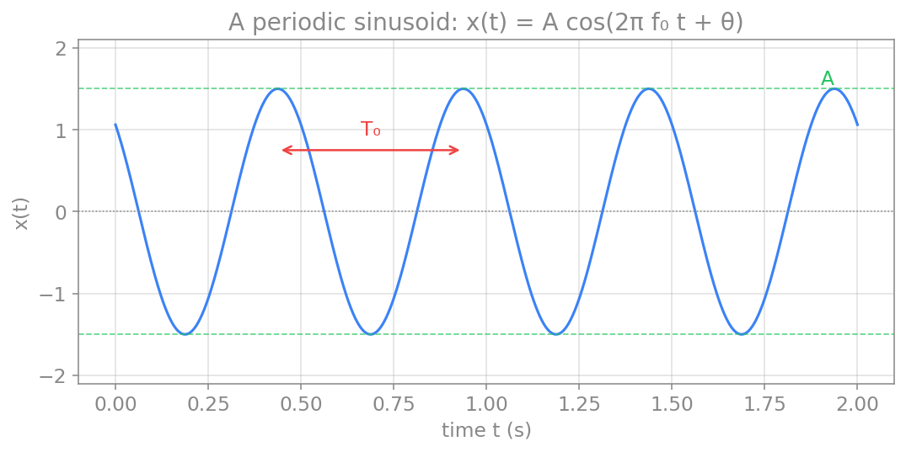
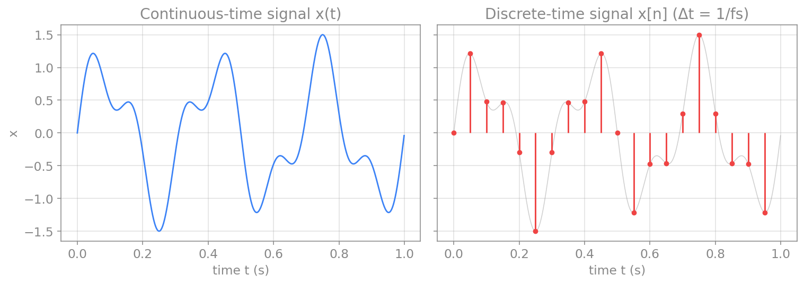
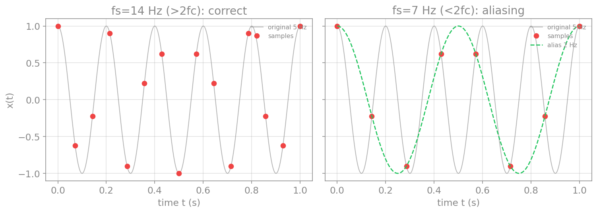

# مرور مفاهیم پایه

سیگنال‌هایی که در علوم اعصاب اندازه می‌گیریم، مانندِ نوارِ مغزی (EEG)، پتانسیلِ میدانیِ محلی (LFP) یا ولتاژِ غشای یک نورون، همگی در **حوزهٔ زمان** ثبت می‌شوند: مقدارِ سیگنال بر حسبِ زمان. پیش از آنکه به تحلیلِ این سیگنال‌ها بپردازیم، باید چند مفهومِ پایه را مرور کنیم: سیگنالِ متناوب چیست، چگونه آن را توصیف می‌کنیم، و چگونه یک سیگنالِ پیوسته را به نمونه‌های گسسته‌ای که رایانه می‌فهمد تبدیل می‌کنیم. این فصل، زمینهٔ همهٔ فصل‌های بعدیِ پردازشِ سیگنال است.

## سیگنال‌های متناوب

ساده‌ترین سیگنالِ بسامدی، یک کسینوسِ منفرد است:

$$
x(t) = A\cos(2\pi f_0 t + \theta).
$$

این سیگنال با سه کمیت توصیف می‌شود: **دامنه** $A$ (مثلاً ولت)، **بسامد** $f_0$ (هرتز، یعنی شمارِ چرخه‌ها در ثانیه) و **فاز** $\theta$ (رادیان، که آغازِ نوسان را جابه‌جا می‌کند). دو کمیتِ مرتبطِ دیگر نیز از همین‌ها به‌دست می‌آیند: **بسامدِ زاویه‌ای** $\omega_0 = 2\pi f_0$ (رادیان بر ثانیه) و **دوره** (پریود) $T_0 = 1/f_0$ (ثانیه)، که مدتِ یک چرخهٔ کامل است.

<figure markdown="span">
  
  <figcaption>یک سیگنالِ سینوسی با دامنهٔ A و دورهٔ T₀. دامنه بیشینهٔ نوسان را تعیین می‌کند و دوره مدتِ یک چرخهٔ کامل است؛ فاز θ آغازِ نوسان را جابه‌جا می‌کند.</figcaption>
</figure>

یک سیگنالِ **متناوب** آن است که پس از یک دوره عیناً تکرار می‌شود:

$$
x(t + T_0) = x(t), \qquad \text{for all } t.
$$

کوچک‌ترین چنین $T_0$ای را **دورهٔ بنیادی** می‌نامند. اگر هیچ $T_0$ای این شرط را برآورده نکند، سیگنال **نامتناوب** (aperiodic) است. بیشترِ سیگنال‌های واقعیِ مغزی نامتناوب‌اند، اما همان‌طور که در فصل‌های بعد خواهیم دید، می‌توان آن‌ها را به‌صورتِ ترکیبی از مؤلفه‌های متناوب تحلیل کرد.

!!! note "پیوند با دایرهٔ واحد و فرمول اویلر"
    کسینوس و سینوس را می‌توان حاصلِ حرکتِ یک نقطه روی دایره دانست که با بسامدِ زاویه‌ای $\omega_0$ می‌چرخد. اگر این دایره را در صفحهٔ مختلط در نظر بگیریم، فرمولِ اویلر این حرکت را به‌زیبایی توصیف می‌کند:

    $$
    e^{j\omega_0 t} = \cos(\omega_0 t) + j\sin(\omega_0 t).
    $$

    بخشِ حقیقیِ این عبارت کسینوس و بخشِ موهومیِ آن سینوس است. این نمایشِ مختلط، در فصلِ حوزهٔ بسامد ستونِ اصلیِ سری و تبدیلِ فوریه خواهد بود.

## سیگنال‌های پیوسته و گسسته

سیگنالی که با زمانِ پیوسته توصیف می‌شود، **سیگنالِ پیوسته‌زمان** نام دارد و آن را با $x(t)$ نشان می‌دهیم. اما رایانه نمی‌تواند با زمانِ پیوسته کار کند؛ تنها می‌تواند مقادیرِ سیگنال را در لحظه‌های مجزا نگه دارد. سیگنالی که تنها در لحظه‌های گسسته مقدار دارد، **سیگنالِ گسسته‌زمان** نام دارد و آن را با $x[n]$ یا $x_n$ نشان می‌دهیم (دنبالهٔ $x_0, x_1, x_2, \dots$).

فاصلهٔ زمانیِ میانِ این نمونه‌ها معمولاً ثابت است و آن را **گامِ نمونه‌برداری** $\Delta t$ می‌نامیم. پس نمونهٔ $n$اُم در زمانِ $t = n\Delta t$ گرفته می‌شود: $x_n = x(n\Delta t)$.

<figure markdown="span">
  
  <figcaption>یک سیگنالِ پیوسته (چپ) و نسخهٔ گسستهٔ آن (راست). سیگنالِ گسسته تنها در لحظه‌های مجزای t=nΔt مقدار دارد (نقاط قرمز)؛ میانِ این لحظه‌ها، سیگنالِ پیوستهٔ زمینه (خاکستری) دیده نمی‌شود.</figcaption>
</figure>

## نمونه‌برداری و قضیهٔ نایکوئیست

فرایندِ تبدیلِ یک سیگنالِ پیوسته به نمونه‌های گسسته، **نمونه‌برداری** (sampling) نام دارد. **بسامدِ نمونه‌برداری** $f_s = 1/\Delta t$ تعیین می‌کند که چند بار در ثانیه نمونه می‌گیریم.

پرسشِ کلیدی این است: چند بار در ثانیه باید نمونه بگیریم تا سیگنال را درست بازنمایی کنیم؟ پاسخ را **قضیهٔ نمونه‌برداری** می‌دهد: اگر سیگنال هیچ مؤلفهٔ بسامدیِ بالاتر از $f_h$ نداشته باشد (یعنی **باندمحدود** باشد)، آنگاه نمونه‌برداری با بسامدی **بیشتر از** $2 f_h$ برای بازسازیِ کاملِ سیگنال کافی است.

دو اصطلاحِ مرتبط را باید از هم جدا کرد:

- **نرخِ نایکوئیست** (Nyquist rate) برابرِ $2 f_h$ است و ویژگیِ **سیگنال** است (به بیشینه بسامدِ موجود در سیگنال بستگی دارد).
- **بسامدِ نایکوئیست** (Nyquist frequency) برابرِ $f_s/2$ است و ویژگیِ **سامانهٔ نمونه‌برداری** است (به اینکه چقدر سریع نمونه می‌گیریم بستگی دارد).

به بیانِ دیگر، برای جلوگیری از خطا، بسامدِ نمونه‌برداری باید چنان انتخاب شود که بسامدِ نایکوئیستِ آن از بیشینه بسامدِ سیگنال بالاتر باشد.

## هم‌نامی

اگر شرطِ نایکوئیست را نقض کنیم، یعنی **خیلی آهسته** نمونه بگیریم، پدیدهٔ **هم‌نامی** (aliasing) رخ می‌دهد: مؤلفه‌های بسامدِ بالا به‌صورتِ مؤلفه‌های بسامدِ پایینِ جعلی ظاهر می‌شوند و سیگنالِ بازسازی‌شده نادرست است. نمونهٔ آشنای آن، چرخشِ ظاهراً وارونهٔ چرخِ خودرو در فیلم است: چون دوربین با نرخی پایین‌تر از حرکتِ واقعیِ چرخ فریم می‌گیرد، چرخ در فیلم آهسته یا حتی وارونه به‌نظر می‌رسد. این، همان هم‌نامی است.

کدِ زیر این پدیده را نشان می‌دهد: یک سیگنالِ ۵ هرتزی را یک‌بار با بسامدِ کافی و یک‌بار با بسامدِ ناکافی نمونه‌برداری می‌کنیم:

```python
import numpy as np
import matplotlib.pyplot as plt

fc = 5.0                                  # signal frequency: 5 Hz
t_cont = np.linspace(0, 1, 2000)
x_cont = np.cos(2*np.pi*fc*t_cont)

fig, axes = plt.subplots(1, 2, figsize=(11, 4), sharey=True)
for ax, fs in zip(axes, [14.0, 7.0]):     # 14 Hz is fine, 7 Hz aliases
    ax.plot(t_cont, x_cont, color="gray", alpha=0.6, label="original 5 Hz")
    t_s = np.arange(0, 1 + 1e-9, 1/fs)
    x_s = np.cos(2*np.pi*fc*t_s)
    ax.plot(t_s, x_s, "o", color="red", label="samples")
    if fs < 2*fc:                          # below Nyquist: show the alias
        f_alias = abs(fc - fs)
        ax.plot(t_cont, np.cos(2*np.pi*f_alias*t_cont), "--",
                color="green", label=f"alias {f_alias:.0f} Hz")
    ax.set_xlabel("time t (s)")
    ax.set_title(f"fs = {fs:.0f} Hz")
    ax.legend(fontsize=8)
plt.tight_layout()
plt.show()
```

<figure markdown="span">
  
  <figcaption>هم‌نامی. چپ: نمونه‌برداری از یک سیگنالِ ۵ هرتزی با fₛ=۱۴ هرتز (بالاتر از نرخِ نایکوئیست) سیگنال را درست بازنمایی می‌کند. راست: با fₛ=۷ هرتز (پایین‌تر از نرخِ نایکوئیست) نمونه‌ها (نقاط قرمز) با یک سیگنالِ بسامدِ پایین‌ترِ جعلی (خط‌چینِ سبز) هم‌خوان می‌شوند؛ این همان هم‌نامی است.</figcaption>
</figure>

در عمل، برای جلوگیری از هم‌نامی، پیش از نمونه‌برداری سیگنال را از یک **صافیِ پایین‌گذرِ ضدِ هم‌نامی** (anti-aliasing filter) عبور می‌دهند تا مؤلفه‌های بسامدِ بالاتر از بسامدِ نایکوئیست حذف شوند. این، نمونه‌ای از کاربردِ صافی‌هاست که در فصلِ فیلترها به آن می‌پردازیم.

## جمع‌بندی

در این فصل، مفاهیمِ پایه را مرور کردیم: سیگنالِ متناوب با دامنه، بسامد و فاز توصیف می‌شود؛ سیگنالِ پیوسته را با نمونه‌برداری به سیگنالِ گسسته تبدیل می‌کنیم؛ و برای آنکه این تبدیل بدونِ خطا باشد، باید با نرخی بالاتر از نرخِ نایکوئیست نمونه بگیریم، وگرنه هم‌نامی رخ می‌دهد. با این پایه، در فصل‌های بعد به تحلیلِ سیگنال در حوزهٔ زمان (هم‌بستگی و کانولوشن)، حوزهٔ بسامد (تحلیلِ فوریه) و سپس صافی‌ها و تحلیلِ زمان–بسامد می‌پردازیم.
