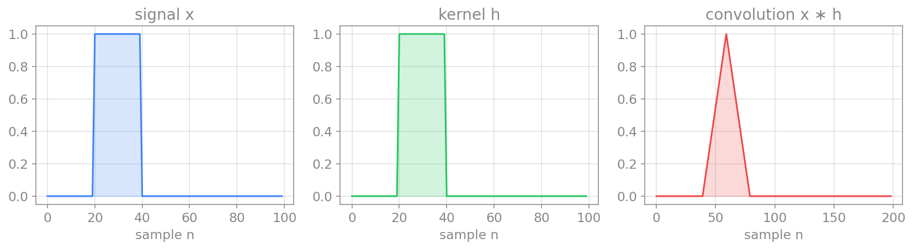
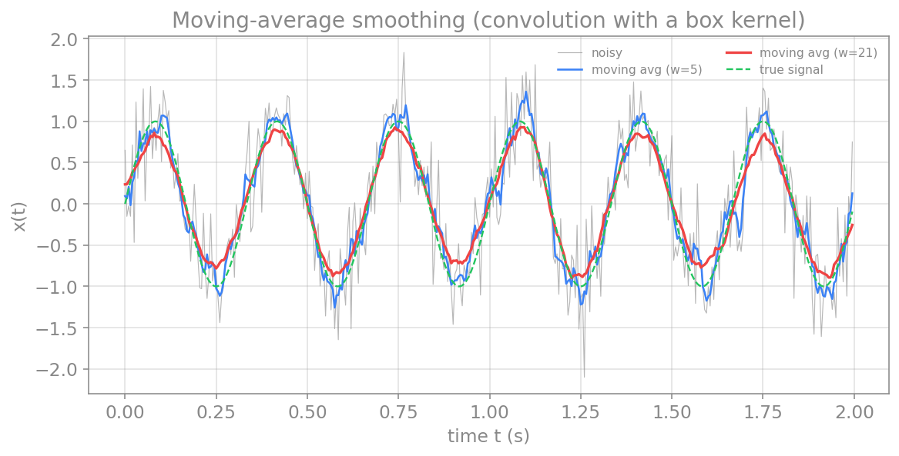
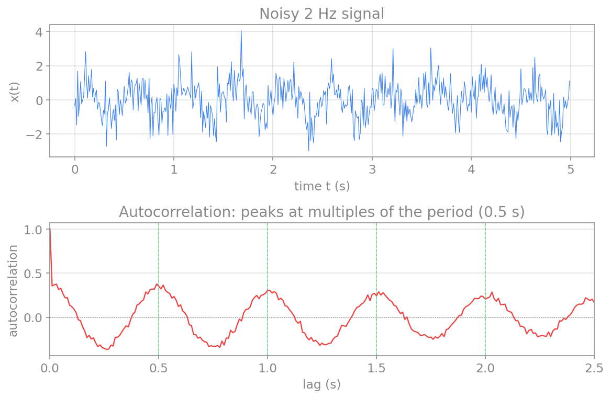

# پردازش سیگنال در حوزهٔ زمان

پیش از آنکه سیگنال را به حوزهٔ بسامد ببریم، بسیاری از کارهای مفید را می‌توان مستقیماً در **حوزهٔ زمان** انجام داد. در این فصل چند عملِ بنیادی را می‌سازیم: **کانولوشن** که قلبِ صافی‌کردن و هموارسازی است، **هم‌بستگی** که شباهتِ دو سیگنال را می‌سنجد، و **خودهم‌بستگی** که ریتمِ پنهان در یک سیگنالِ نوفه‌ای را آشکار می‌کند. این عمل‌ها هم به‌خودیِ‌خود مفیدند و هم پایهٔ مفهومیِ صافی‌ها و تحلیلِ طیفی‌اند.

## آماره‌های زمانی

ساده‌ترین توصیفِ یک سیگنال در حوزهٔ زمان، چند **آمارهٔ** پایه است: میانگین، که سطحِ کلیِ سیگنال را می‌دهد؛ واریانس و انحرافِ معیار، که میزانِ نوسان یا توانِ سیگنال را می‌سنجند؛ و کمینه و بیشینه. برای یک سیگنالِ گسستهٔ $x_n$ با $N$ نمونه:

$$
\bar{x} = \frac{1}{N}\sum_{n=0}^{N-1} x_n,
\qquad
\sigma^2 = \frac{1}{N}\sum_{n=0}^{N-1} (x_n - \bar{x})^2.
$$

این آماره‌ها در `numpy` آماده‌اند (`x.mean()`، `x.std()`، `x.var()`). اما آماره‌های لحظه‌ای کلِ ساختارِ زمانیِ سیگنال را نشان نمی‌دهند؛ برای آن به عمل‌هایی نیاز داریم که **رابطهٔ میانِ نمونه‌ها در زمان‌های مختلف** را در نظر بگیرند. نخستینِ این عمل‌ها، کانولوشن است.

## کانولوشن

**کانولوشن** (convolution) عملی است که یک سیگنال را با یک **هسته** (kernel) ترکیب می‌کند تا سیگنالِ تازه‌ای بسازد. در هر نقطه، هسته را روی سیگنال می‌لغزانیم، نقطه‌به‌نقطه ضرب می‌کنیم و حاصل را جمع می‌زنیم. برای دو سیگنالِ گسستهٔ $x$ و $h$:

$$
(x * h)[n] = \sum_{m=-\infty}^{\infty} x[m]\, h[n-m].
$$

شهودِ کانولوشن این است: هر نمونهٔ خروجی، میانگینی وزن‌دار از نمونه‌های همسایه است، که وزن‌ها را هسته تعیین می‌کند. اگر هسته یک «جعبه» (مقادیرِ برابر) باشد، خروجی میانگینِ ساده‌ای از همسایه‌هاست (هموارسازی). اگر هسته شکلِ دیگری داشته باشد، می‌توان لبه‌ها را برجسته کرد، نوفه را کاست، یا بسامدهای خاصی را تقویت یا تضعیف کرد. در فصلِ صافی‌ها خواهیم دید که هر صافیِ خطی در اصل یک کانولوشن است.

<figure markdown="span">
  
  <figcaption>کانولوشنِ دو سیگنالِ جعبه‌ای (چپ و میانه) یک سیگنالِ مثلثی می‌سازد (راست). این، نتیجهٔ لغزاندنِ یک جعبه روی دیگری و جمع‌زدنِ هم‌پوشانیِ آن‌ها در هر نقطه است.</figcaption>
</figure>

در پایتون، تابعِ `numpy.convolve` این عمل را انجام می‌دهد. آرگومانِ `mode="same"` خروجی‌ای هم‌اندازهٔ ورودی می‌دهد.

## هموارسازی با میانگین متحرک

یکی از پرکاربردترین کاربردهای کانولوشن، **هموارسازی** (smoothing) یک سیگنالِ نوفه‌ای است. ساده‌ترین صافیِ هموارساز، **میانگینِ متحرک** (moving average) است: هر نمونهٔ خروجی، میانگینِ $w$ نمونهٔ همسایه است. این، دقیقاً کانولوشنِ سیگنال با یک هستهٔ جعبه‌ای است که همهٔ مقادیرش برابرِ $1/w$ هستند.

```python
import numpy as np
import matplotlib.pyplot as plt

def moving_average(x, w):
    # smooth x by convolving with a box kernel of width w
    kernel = np.ones(w) / w
    return np.convolve(x, kernel, mode="same")

# a clean 3 Hz signal buried in noise
np.random.seed(1)
fs = 200.0
t = np.arange(0, 2, 1/fs)
clean = np.sin(2*np.pi*3*t)
noisy = clean + 0.4*np.random.randn(len(t))

smooth_5 = moving_average(noisy, 5)
smooth_21 = moving_average(noisy, 21)

plt.plot(t, noisy, color="gray", alpha=0.6, label="noisy")
plt.plot(t, smooth_5, label="moving avg (w=5)")
plt.plot(t, smooth_21, label="moving avg (w=21)")
plt.plot(t, clean, "--", label="true signal")
plt.xlabel("time t (s)")
plt.ylabel("x(t)")
plt.legend()
plt.show()
```

<figure markdown="span">
  
  <figcaption>هموارسازی با میانگینِ متحرک. پنجرهٔ کوچک‌تر (w=۵) نوفه را اندکی کم می‌کند اما هنوز پرنوسان است؛ پنجرهٔ بزرگ‌تر (w=۲۱) نوفه را بیشتر می‌کاهد و به سیگنالِ واقعی (خط‌چین) نزدیک‌تر می‌شود، اما اگر پنجره بیش از حد بزرگ شود، خودِ سیگنال را نیز هموار و کند می‌کند.</figcaption>
</figure>

نکتهٔ مهم، انتخابِ اندازهٔ پنجره است: پنجرهٔ بزرگ‌تر نوفهٔ بیشتری را حذف می‌کند، اما اگر بیش از حد بزرگ باشد، تغییرات واقعیِ سیگنال را نیز محو می‌کند. این، نمونه‌ای از بده‌بستانِ همیشگیِ میانِ کاهشِ نوفه و حفظِ جزئیات است.

## هم‌بستگی متقابل

**هم‌بستگیِ متقابل** (cross-correlation) شباهتِ دو سیگنال را به‌عنوانِ تابعی از جابه‌جاییِ زمانیِ میانِ آن‌ها می‌سنجد. شکلِ آن بسیار شبیهِ کانولوشن است، اما بدونِ وارونه‌کردنِ هسته:

$$
(x \star y)[k] = \sum_{n=-\infty}^{\infty} x[n]\, y[n+k].
$$

اینجا $k$ **تأخیر** (lag) نام دارد. اگر دو سیگنال در یک تأخیرِ خاص بسیار شبیه باشند، هم‌بستگیِ متقابل در آن تأخیر قله می‌زند. این، ابزارِ نیرومندی است: مثلاً برای یافتنِ تأخیرِ زمانیِ میانِ دو ثبتِ مغزی (آیا فعالیتِ یک ناحیه پیش از ناحیهٔ دیگر رخ می‌دهد؟)، یا برای یافتنِ یک الگوی مشخص در یک سیگنالِ بلند. در پایتون `numpy.correlate` این کار را انجام می‌دهد.

## خودهم‌بستگی

حالتِ خاص و بسیار مهمی از هم‌بستگیِ متقابل، **خودهم‌بستگی** (autocorrelation) است: هم‌بستگیِ یک سیگنال با **خودش** در تأخیرهای مختلف. خودهم‌بستگی نشان می‌دهد که سیگنال چقدر با نسخهٔ جابه‌جاشدهٔ خودش شبیه است، و به همین دلیل **ریتمِ پنهان** در یک سیگنالِ نوفه‌ای را آشکار می‌کند: اگر سیگنال دوره‌ای با دورهٔ $T$ داشته باشد، خودهم‌بستگی در تأخیرهای $T, 2T, 3T, \dots$ قله می‌زند.

این، یکی از زیباترین ابزارهای حوزهٔ زمان است. سیگنالی که به چشم کاملاً تصادفی به‌نظر می‌رسد، ممکن است ریتمِ پنهانی داشته باشد که تنها در خودهم‌بستگی دیده می‌شود:

```python
import numpy as np
import matplotlib.pyplot as plt

# a 2 Hz signal (period 0.5 s) buried in strong noise
np.random.seed(2)
fs = 100.0
t = np.arange(0, 5, 1/fs)
x = np.sin(2*np.pi*2*t) + 0.8*np.random.randn(len(t))

# autocorrelation (subtract the mean first, keep non-negative lags, normalize)
x_centered = x - x.mean()
acf = np.correlate(x_centered, x_centered, mode="full")
acf = acf[len(acf)//2:]
acf = acf / acf[0]
lags = np.arange(len(acf)) / fs

fig, (ax1, ax2) = plt.subplots(2, 1, figsize=(8.5, 5.6))
ax1.plot(t, x, color="tab:blue", lw=0.6)
ax1.set_xlabel("time t (s)"); ax1.set_ylabel("x(t)")
ax1.set_title("noisy 2 Hz signal")
ax2.plot(lags, acf, color="tab:red")
ax2.axhline(0, color="gray", ls=":", lw=0.7)
ax2.set_xlabel("lag (s)"); ax2.set_ylabel("autocorrelation")
ax2.set_xlim(0, 2.5)
ax2.set_title("autocorrelation reveals the hidden period")
plt.tight_layout()
plt.show()
```

<figure markdown="span">
  
  <figcaption>خودهم‌بستگیِ یک سیگنالِ ۲ هرتزیِ پنهان در نوفهٔ قوی. سیگنالِ بالا به چشم تقریباً تصادفی است، اما خودهم‌بستگیِ پایین در تأخیرهای ۰٫۵، ۱٫۰، ۱٫۵ و ۲٫۰ ثانیه (مضرب‌های دورهٔ ۰٫۵ ثانیه‌ای، خط‌چین‌های سبز) قله می‌زند و ریتمِ پنهان را آشکار می‌کند.</figcaption>
</figure>

!!! note "پیوند با حوزهٔ بسامد"
    میانِ خودهم‌بستگی و طیفِ توان یک پیوندِ ژرف وجود دارد: طبقِ **قضیهٔ وینر–خینچین** (Wiener-Khinchin)، تبدیلِ فوریهٔ تابعِ خودهم‌بستگی برابر با چگالیِ طیفیِ توانِ سیگنال است. پس همان اطلاعاتِ ریتمیک را می‌توان هم در حوزهٔ زمان (خودهم‌بستگی) و هم در حوزهٔ بسامد (طیفِ توان) دید. این، نمونهٔ دیگری از پیوندِ عمیقِ میانِ دو حوزه است.

## جمع‌بندی

در این فصل، ابزارهای پایهٔ حوزهٔ زمان را ساختیم. **کانولوشن** سیگنال را با یک هسته ترکیب می‌کند و قلبِ هموارسازی و صافی‌کردن است. **میانگینِ متحرک** ساده‌ترین کاربردِ آن برای کاهشِ نوفه است. **هم‌بستگیِ متقابل** شباهتِ دو سیگنال را در تأخیرهای مختلف می‌سنجد، و **خودهم‌بستگی** ریتمِ پنهان در یک سیگنال را آشکار می‌کند. در فصلِ بعد می‌بینیم که چگونه کانولوشن، با انتخابِ هوشمندانهٔ هسته، به ابزارِ نیرومندِ **صافی‌ها** بدل می‌شود.
