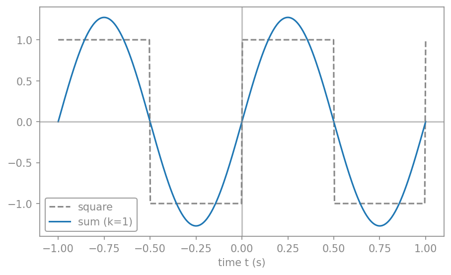
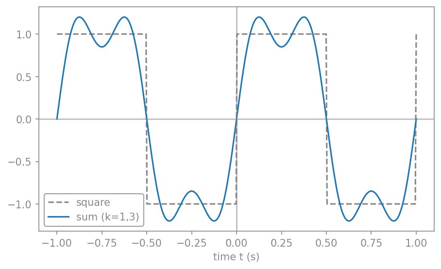
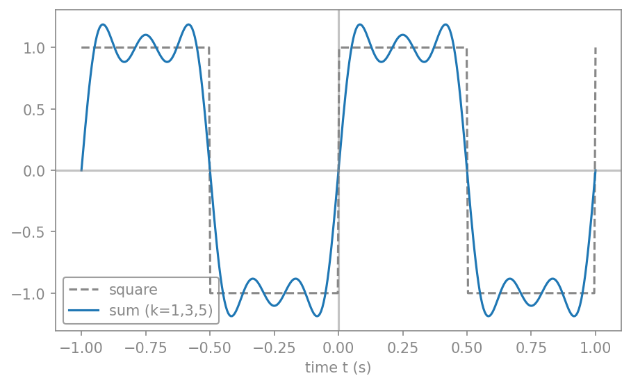
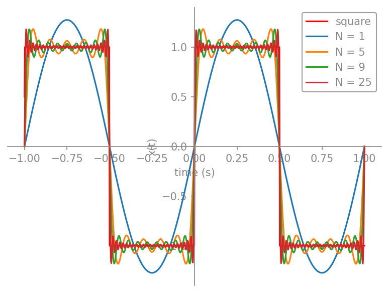
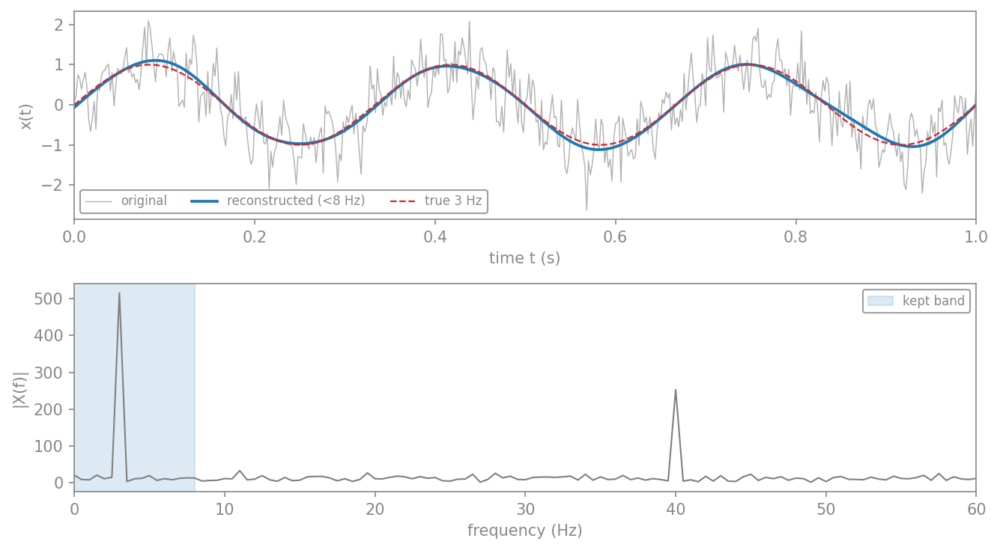
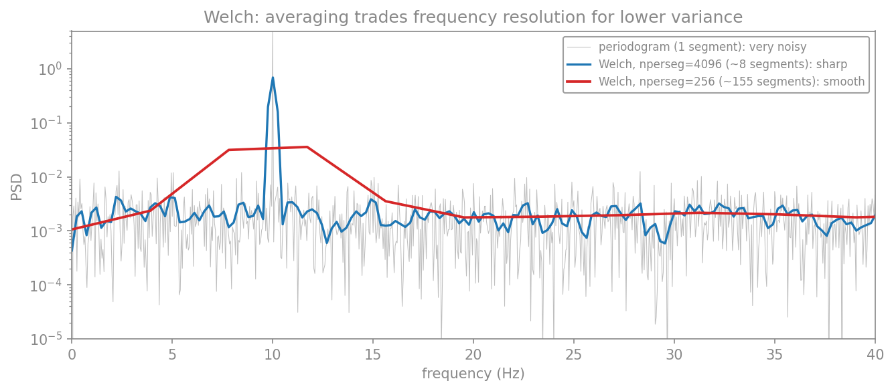

# پردازش سیگنال در حوزهٔ بسامد

در فصلِ مرورِ مفاهیم دیدیم که سیگنال‌ها را در حوزهٔ زمان ثبت می‌کنیم. اما بسیاری از پدیده‌های جالب در مغز **ریتمیک‌اند**: نوسان‌های آلفا، بتا، گاما و امواجِ آهسته، هر کدام در یک بازهٔ بسامدیِ مشخص رخ می‌دهند. برای دیدنِ این ریتم‌ها باید سیگنال را به **حوزهٔ بسامد** ببریم؛ یعنی بپرسیم «چه بسامدهایی و با چه شدتی در این سیگنال حضور دارند؟». این کار، موضوعِ **تحلیلِ طیفی** (spectral analysis) است.

این فصل ابزارهای این کار را از پایه می‌سازد: از سری فوریه و تبدیل فوریه (دیدگاهِ نظری و پیوسته)، تا تبدیلِ فوریهٔ گسسته (آنچه در عمل با داده‌های ثبت‌شده به کار می‌بریم)، و سرانجام تخمینِ طیفِ توان که برای سیگنال‌های نوفه‌ایِ واقعی ضروری است.

## سری فوریه

پرسشِ بنیادینِ فوریه این بود: آیا می‌توان **هر** سیگنالِ متناوب را به‌صورتِ مجموعی از کسینوس‌ها و سینوس‌های با بسامدهای مختلف نوشت؟ پاسخ مثبت است. هر سیگنالِ متناوبِ $x(t)$ با دورهٔ $T_0$ را می‌توان چنین بسط داد:

$$
x(t) = a_0 + \sum_{k=1}^{\infty} a_k \cos(k\omega_0 t) + \sum_{k=1}^{\infty} b_k \sin(k\omega_0 t),
\qquad \omega_0 = \frac{2\pi}{T_0}.
$$

این بسط، **سری فوریه** نام دارد. جمله‌های آن، سینوس‌ها و کسینوس‌هایی با بسامدهای $\omega_0, 2\omega_0, 3\omega_0, \dots$ هستند که به آن‌ها **هم‌نوا** (harmonics) می‌گویند: بسامدِ بنیادی و مضرب‌های صحیحِ آن.

!!! note "گوشه‌ای از تاریخ: ژوزف فوریه"
    ژان-باتیست ژوزف فوریه (۱۷۶۸–۱۸۳۰)، ریاضی‌دان و فیزیک‌دانِ فرانسوی، در لشکرکشیِ ناپلئون به مصر همراه بود و پس از بازگشت، فرماندارِ ناحیهٔ ایزر شد. او در همان سال‌ها، در کنارِ کارهای اداری، بر توصیفِ ریاضیِ **انتقالِ گرما** کار می‌کرد. در سالِ ۱۸۲۲، در اثرِ مهمش دربارهٔ جریانِ گرما، این ادعای جسورانه را مطرح کرد که **هر** تابع، پیوسته یا ناپیوسته، را می‌توان به‌صورتِ مجموعی از سینوس‌های مضربِ یک متغیر بسط داد. این ادعا به‌طورِ کامل درست نبود، اما این بینش که برخی توابعِ ناپیوسته حاصلِ جمعِ یک سری بی‌نهایت‌اند، یک جهش بود. سری و تبدیلِ فوریه به افتخارِ او نام گرفته‌اند.

ضرایبِ این سری را می‌توان با استفاده از خاصیتِ **تعامد** (orthogonality) سینوس‌ها و کسینوس‌ها به‌دست آورد (انتگرالِ حاصل‌ضربِ دو هم‌نوای متفاوت روی یک دوره صفر است). نتیجه چنین است:

$$
\begin{aligned}
a_0 &= \frac{1}{T_0}\int_{T_0} x(t)\,dt,\\
a_k &= \frac{2}{T_0}\int_{T_0} x(t)\cos(k\omega_0 t)\,dt,\\
b_k &= \frac{2}{T_0}\int_{T_0} x(t)\sin(k\omega_0 t)\,dt.
\end{aligned}
$$

ضریبِ $a_0$ همان **مقدارِ میانگینِ** سیگنال است (می‌توان آن را کسینوس با بسامدِ صفر دانست). ضرایبِ $a_k$ و $b_k$ سهمِ هر هم‌نوا را تعیین می‌کنند.

این روابطِ تعامد را می‌توان صریح‌تر نوشت؛ همین‌ها سنگِ‌بنای استخراجِ ضرایب‌اند (انتگرال‌ها بر یک دوره گرفته می‌شوند):

$$
\begin{aligned}
\int_{T_0}\cos(k\omega_0 t)\cos(m\omega_0 t)\,dt
&= \begin{cases}0, & k\neq m,\\ T_0/2, & k=m\neq 0,\end{cases}\\[4pt]
\int_{T_0}\sin(k\omega_0 t)\sin(m\omega_0 t)\,dt
&= \begin{cases}0, & k\neq m,\\ T_0/2, & k=m\neq 0,\end{cases}\\[4pt]
\int_{T_0}\sin(k\omega_0 t)\cos(m\omega_0 t)\,dt &= 0, \qquad \text{for all } k,m.
\end{aligned}
$$

??? note "اثباتِ ضرایب (اختیاری)"
    **ضریبِ $a_0$.** هر دو طرفِ سری را بر یک دوره انتگرال می‌گیریم. انتگرالِ هر سینوس یا کسینوسِ هم‌نوا بر یک دوره صفر است (مساحتِ بالا و پایینِ محورِ زمان برابر است)، پس تنها جملهٔ $a_0$ می‌ماند:

    $$
    \int_{T_0} x(t)\,dt = a_0 T_0
    \quad\Longrightarrow\quad
    a_0 = \frac{1}{T_0}\int_{T_0} x(t)\,dt.
    $$

    پس $a_0$ همان **میانگینِ** سیگنال است (کسینوس با بسامدِ صفر).

    **ضرایبِ $a_k$.** هر دو طرف را در $\cos(m\omega_0 t)$ ضرب و بر یک دوره انتگرال می‌گیریم. به‌کمکِ روابطِ تعامد، همهٔ جمله‌های سینوسی صفر می‌شوند و از جمله‌های کسینوسی تنها جملهٔ $k=m$ باقی می‌ماند:

    $$
    \int_{T_0} x(t)\cos(m\omega_0 t)\,dt = \frac{a_m T_0}{2}
    \quad\Longrightarrow\quad
    a_k = \frac{2}{T_0}\int_{T_0} x(t)\cos(k\omega_0 t)\,dt.
    $$

    **ضرایبِ $b_k$.** به‌همین‌سان، با ضرب در $\sin(m\omega_0 t)$ و انتگرال‌گیری:

    $$
    b_k = \frac{2}{T_0}\int_{T_0} x(t)\sin(k\omega_0 t)\,dt.
    $$

    این اثبات تنها برای بینشِ بیشتر آمده و حفظِ آن لازم نیست؛ آنچه می‌ماند، خودِ سه فرمولِ ضرایب است.

### مثال: ساختِ موجِ مربعی

موجِ مربعیِ ۱ هرتزی را در نظر بگیرید که در نیمهٔ نخستِ هر دوره برابرِ $+1$ و در نیمهٔ دوم برابرِ $-1$ است. این تابع فرد است، پس همهٔ ضرایبِ کسینوسی صفرند ($a_0 = 0$ و $a_k = 0$) و تنها ضرایبِ سینوسی می‌مانند:

$$
b_k = \begin{cases} \dfrac{4}{k\pi}, & k \text{ odd},\\[4pt] 0, & k \text{ even}. \end{cases}
$$

پس موجِ مربعی تنها از هم‌نواهای فرد ساخته می‌شود، و سری فوریهٔ آن چنین است (با $\omega_0 = 2\pi$ برای بسامدِ ۱ هرتز):

$$
x(t) = \frac{4}{\pi}\!\left[\sin(\omega_0 t) + \frac{\sin(3\omega_0 t)}{3} + \frac{\sin(5\omega_0 t)}{5} + \cdots + \frac{\sin(N\omega_0 t)}{N}\right],
\qquad N \text{ odd}.
$$

اکنون می‌خواهیم به‌صورتِ عددی ببینیم که این مجموع چگونه با افزودنِ هم‌نواها به موجِ مربعی نزدیک می‌شود. نخست هم‌نواها را یکی‌یکی می‌افزاییم تا شکل‌گیریِ تدریجیِ موج را ببینیم.

**گامِ نخست: هم‌نوای بنیادی.** نخست تنها هم‌نوای بنیادی ($k=1$)، یعنی یک سینوسِ تنها، را رسم می‌کنیم و با موجِ مربعی می‌سنجیم.

```python
import numpy as np
import matplotlib.pyplot as plt
from scipy.signal import square

T0 = 1.0                                   # period 1 s  →  1 Hz square wave
omega0 = 2*np.pi / T0
t = np.linspace(-T0, T0, 400)
true_sq = square(2*np.pi*t)                # the true (amplitude-1) square wave

x1 = (4/np.pi) * np.sin(omega0*t)          # fundamental: k = 1
plt.plot(t, true_sq, "--", color="gray", label="square")
plt.plot(t, x1, "b-", label="sum (k=1)")
plt.axhline(0, color="k", alpha=0.4)
plt.axvline(0, color="k", alpha=0.4)
plt.xlabel("time t (s)")
plt.legend()
plt.show()
```

<figure markdown="span">
  
  <figcaption>تنها هم‌نوای بنیادی (k=۱): یک سینوسِ ساده که هنوز فاصلهٔ زیادی با موجِ مربعیِ واقعی (خط‌چینِ خاکستری) دارد.</figcaption>
</figure>

**گامِ دوم: افزودنِ هم‌نوای سوم.** اکنون هم‌نوای سوم ($k=3$) را می‌افزاییم.

```python
x3 = (4/(3*np.pi)) * np.sin(3*omega0*t)    # third harmonic
plt.plot(t, true_sq, "--", color="gray", label="square")
plt.plot(t, x1 + x3, "b-", label="sum (k=1,3)")
plt.axhline(0, color="k", alpha=0.4)
plt.axvline(0, color="k", alpha=0.4)
plt.xlabel("time t (s)")
plt.legend()
plt.show()
```

<figure markdown="span">
  
  <figcaption>افزودنِ هم‌نوای سوم (k=۱،۳): مجموع شروع به مسطح‌شدن در میانهٔ هر نیم‌دوره می‌کند و به شکلِ مربعی نزدیک‌تر می‌شود.</figcaption>
</figure>

**گامِ سوم: افزودنِ هم‌نوای پنجم.** سرانجام هم‌نوای پنجم ($k=5$) را نیز می‌افزاییم؛ شکلِ مربعی روشن‌تر پدیدار می‌شود.

```python
x5 = (4/(5*np.pi)) * np.sin(5*omega0*t)    # fifth harmonic
plt.plot(t, true_sq, "--", color="gray", label="square")
plt.plot(t, x1 + x3 + x5, "b-", label="sum (k=1,3,5)")
plt.axhline(0, color="k", alpha=0.4)
plt.axvline(0, color="k", alpha=0.4)
plt.xlabel("time t (s)")
plt.legend()
plt.show()
```

<figure markdown="span">
  
  <figcaption>افزودنِ هم‌نوای پنجم (k=۱،۳،۵): با هر هم‌نوای فردِ تازه، مجموع (آبی) به موجِ مربعیِ واقعی (خط‌چینِ خاکستری) شبیه‌تر می‌شود.</figcaption>
</figure>

**گامِ چهارم: تابعی برای جمعِ N جمله.** برای دیدنِ اثرِ شمارِ بیشترِ جمله‌ها، تابعی می‌نویسیم که N هم‌نوای فردِ نخست را جمع می‌زند، و آن را برای $N = 1, 5, 9, 25$ رسم می‌کنیم.

```python
def square_series(t, n_terms):
    """sum of the first n_terms odd harmonics (k = 1, 3, 5, ...)"""
    x = np.zeros_like(t)
    for k in range(1, 2*n_terms, 2):
        x += (4/(k*np.pi)) * np.sin(k*omega0*t)
    return x

plt.plot(t, true_sq, "--", color="gray", label="square")
for n_terms in (1, 5, 9, 25):
    plt.plot(t, square_series(t, n_terms), label=f"N = {n_terms}")
plt.xlabel("time t (s)")
plt.ylabel("x(t)")
plt.legend()
plt.show()
```

<figure markdown="span">
  
  <figcaption>هم‌گراییِ سری فوریهٔ موجِ مربعی. هرچه شمارِ جمله‌ها (N) بیشتر شود، مجموع به موجِ مربعیِ واقعی (خط‌چینِ خاکستری) نزدیک‌تر می‌شود؛ اما نوسان‌های کوچکِ پایدار نزدیکِ لبه‌ها هرگز ناپدید نمی‌شوند—این، پدیدهٔ گیبس است.</figcaption>
</figure>

**گامِ پنجم: محاسبهٔ نمادین با SymPy.** ضرایبِ سری فوریه را لازم نیست همیشه با دست به‌دست آوریم؛ کتابخانهٔ نمادینِ `sympy` تابعِ `fourier_series` را دارد که همین کار را به‌صورتِ تحلیلی انجام می‌دهد. اگر موجِ مربعی را با توابعِ پله‌ای (هِویساید) بسازیم و سری فوریه‌اش را بخواهیم، خودِ همان ضرایبِ $4/(k\pi)$ پدیدار می‌شوند:

```python
import sympy as sym

x = sym.symbols('x')
# a 1 Hz square wave on [-1, 1] built from Heaviside steps (+1 then −1 each half period)
f = (sym.Heaviside(x+1) - 2*sym.Heaviside(x+sym.Rational(1, 2))
     + 2*sym.Heaviside(x) - 2*sym.Heaviside(x-sym.Rational(1, 2)))

s = sym.fourier_series(f, (x, 0, 1))       # Fourier series over one period
print(s.truncate(5))                        # first 5 non-zero terms

p = sym.plot(f, s.truncate(1), s.truncate(5), s.truncate(9), s.truncate(25),
             (x, -1, 1), show=False, legend=True, xlabel="time (s)", ylabel="x(t)")
p[0].line_color = "red"
p[0].label = "square"
p[1].label = "N = 1"
p[2].label = "N = 5"
p[3].label = "N = 9"
p[4].label = "N = 25"
p.show()
```

خروجیِ `print` دقیقاً همان سری است که با دست به‌دست آوردیم:

$$
\frac{4\sin(2\pi x)}{\pi} + \frac{4\sin(6\pi x)}{3\pi} + \frac{4\sin(10\pi x)}{5\pi} + \frac{4\sin(14\pi x)}{7\pi} + \frac{4\sin(18\pi x)}{9\pi} + \cdots
$$

<figure markdown="span">
  
  <figcaption>همان ساخت، این‌بار با محاسبهٔ نمادینِ SymPy. تابعِ fourier_series ضرایب را به‌صورتِ تحلیلی می‌یابد و تقریب‌های N=۱، ۵، ۹ و ۲۵ را نشان می‌دهد که به موجِ مربعی (قرمز) هم‌گرا می‌شوند.</figcaption>
</figure>

!!! note "پدیدهٔ گیبس"
    در نمودارهای بالا، نزدیکِ لبه‌های تیزِ موجِ مربعی یک «پرش» یا فراجهشِ کوچک دیده می‌شود که با افزودنِ جمله‌های بیشتر باریک‌تر می‌شود اما **ارتفاعش کاهش نمی‌یابد** (حدودِ ۹٪ بالاتر از پرش باقی می‌ماند). این، **پدیدهٔ گیبس** (Gibbs phenomenon) است و ویژگیِ ذاتیِ تقریبِ یک ناپیوستگی با سری فوریه است: سری در نقطهٔ ناپیوستگی به میانگینِ دو مقدار هم‌گرا می‌شود، نه به خودِ پرش.

**نتیجه.** هرچه شمارِ هم‌نواها بیشتر شود، مجموع بیشتر شبیهِ موجِ مربعی می‌شود. پس یک موجِ مربعی—با همهٔ لبه‌های تیزش—را می‌توان از جمعِ هم‌نواهای سینوسیِ هموار ساخت. همین ایده است که در ادامه، با تبدیلِ فوریه، به سیگنال‌های نامتناوب نیز تعمیم می‌یابد.

## تمرین‌ها

!!! question "تمرینِ ۱ — سری فوریهٔ موجِ مربعی"
    موجِ مربعیِ متناوب با دورهٔ $T_0$ را در نظر بگیرید:

    $$
    x(t) =
    \begin{cases}
    +1, & 0 \le t < \tfrac{T_0}{2},\\[2pt]
    -1, & \tfrac{T_0}{2} \le t < T_0.
    \end{cases}
    $$

    عبارت‌های ضرایبِ $a_0$، $a_k$ و $b_k$ (با $k\in\mathbb{N}^+$) از سری فوریهٔ حقیقیِ این سیگنال را به‌دست آورید و سپس عبارتِ کاملِ سری را بنویسید.

    *راهنما: نخست یک طرحِ سرانگشتی از $x(t)$ بکشید. تقارنِ تابع را بررسی کنید (زوج است یا فرد؟). در جایی از محاسبه، رابطهٔ $\omega_0 = 2\pi/T_0$ به کارتان می‌آید.*

    ??? success "راهِ‌حل"
        **میانگین.** سطحِ مثبت و منفیِ موج برابرند، پس میانگین صفر است: $a_0 = 0$.

        **ضرایبِ کسینوسی.** موجِ مربعی (با این تعریف) تابعی **فرد** است ($x(-t) = -x(t)$). از آنجا که کسینوس تابعی زوج است، انتگرالِ $x(t)\cos(k\omega_0 t)$ بر یک دورهٔ متقارن صفر می‌شود: $a_k = 0$ برای همهٔ $k$.

        **ضرایبِ سینوسی.** تنها سینوس‌ها می‌مانند. با محاسبهٔ انتگرال روی دو نیمهٔ دوره:

        $$
        b_k = \frac{2}{T_0}\!\left[\int_0^{T_0/2}\!\sin(k\omega_0 t)\,dt - \int_{T_0/2}^{T_0}\!\sin(k\omega_0 t)\,dt\right]
        = -\frac{2}{k\pi}\big[(-1)^k - 1\big].
        $$

        برای $k$ زوج عبارتِ $(-1)^k-1$ صفر است، و برای $k$ فرد برابرِ $-2$:

        $$
        b_k =
        \begin{cases}
        \dfrac{4}{k\pi}, & k \text{ odd},\\[6pt]
        0, & k \text{ even}.
        \end{cases}
        $$

        **سری کامل.** پس موجِ مربعی تنها از هم‌نواهای فرد ساخته می‌شود:

        $$
        x(t) = \frac{4}{\pi}\sum_{\substack{k=1\\k\ \text{odd}}}^{\infty}\frac{1}{k}\sin(k\omega_0 t)
        = \frac{4}{\pi}\!\left[\sin(\omega_0 t) + \tfrac{1}{3}\sin(3\omega_0 t) + \tfrac{1}{5}\sin(5\omega_0 t) + \cdots\right].
        $$

        (بالاتر در همین بخش، ساختِ عددیِ همین سری و هم‌گراییِ آن به موجِ مربعی—همراه با پدیدهٔ گیبس—را با کد دیدیم.)

!!! question "تمرینِ ۲ — تقارن و حذفِ ضرایب"
    بدونِ محاسبهٔ هیچ انتگرالی، توضیح دهید که برای هر یک از حالت‌های زیر کدام دسته از ضرایب لزوماً صفرند:

    ۱. سیگنالِ $x(t)$ تابعی **زوج** باشد ($x(-t) = x(t)$).
    ۲. سیگنالِ $x(t)$ تابعی **فرد** باشد ($x(-t) = -x(t)$).

    ??? success "راهِ‌حل"
        **حالتِ زوج.** کسینوس زوج و سینوس فرد است؛ حاصل‌ضربِ تابعِ زوجِ $x(t)$ در سینوسِ فرد، تابعی فرد است و انتگرالش بر بازهٔ متقارن صفر می‌شود. پس همهٔ $b_k = 0$ و سیگنال تنها از **کسینوس‌ها** (و $a_0$) ساخته می‌شود.

        **حالتِ فرد.** برعکس: حاصل‌ضربِ $x(t)$ فرد در کسینوسِ زوج، فرد است؛ پس $a_0 = 0$ و همهٔ $a_k = 0$، و سیگنال تنها از **سینوس‌ها** ساخته می‌شود. موجِ مربعیِ تمرینِ ۱ نمونه‌ای از همین حالت است.

        این تقارن، یک میان‌بُرِ نیرومند است: پیش از هر محاسبه‌ای، نیمی از ضرایب را می‌توان با یک نگاه به تقارنِ سیگنال صفر گذاشت.

!!! question "تمرینِ ۳ — فاز و تأخیرِ زمانی"
    سیگنالِ $x(t) = A\cos(2\pi f_0 t + \theta)$ را با $f_0 = 10$ هرتز و $\theta = \pi/2$ در نظر بگیرید. تأخیرِ زمانیِ $\theta_t$ ناشی از این فاز را بیابید. اگر بسامد به $f_0 = 40$ هرتز افزایش یابد (و فاز ثابت بماند)، تأخیرِ زمانی چه می‌شود؟

    ??? success "راهِ‌حل"
        از رابطهٔ $\theta_t = \theta/(2\pi f_0)$:

        $$
        \theta_t = \frac{\pi/2}{2\pi \cdot 10} = \frac{1}{40} = 0{.}025\ \text{s} = 25\ \text{ms}.
        $$

        برای $f_0 = 40$ هرتز:

        $$
        \theta_t = \frac{\pi/2}{2\pi \cdot 40} = \frac{1}{160} = 0{.}00625\ \text{s} = 6{.}25\ \text{ms}.
        $$

        پس فازِ یکسان در بسامدِ بالاتر، تأخیرِ زمانیِ کوچک‌تری می‌سازد—نکته‌ای که هنگامِ مقایسهٔ تأخیرِ میانِ باندهای بسامدیِ مختلفِ مغزی باید به آن توجه کرد.

## سری فوریه مختلط

با کمکِ فرمولِ اویلر، $e^{j\omega t} = \cos(\omega t) + j\sin(\omega t)$، می‌توان سری فوریه را به شکلِ فشرده‌ترِ **مختلط** نوشت. سینوس و کسینوس را می‌توان به‌صورتِ ترکیبی از $e^{j k\omega_0 t}$ و $e^{-j k\omega_0 t}$ بیان کرد، و سری به این شکل درمی‌آید:

$$
x(t) = \sum_{k=-\infty}^{\infty} X_k\, e^{j k \omega_0 t},
\qquad
X_k = \frac{1}{T_0}\int_{T_0} x(t)\, e^{-j k\omega_0 t}\,dt.
$$

اینجا اندیسِ $k$ از منفی‌بی‌نهایت تا مثبت‌بی‌نهایت می‌رود و ضرایبِ $X_k$ مختلط‌اند: قدرِ مطلقِ آن‌ها دامنه و فازشان فازِ هر هم‌نوا را می‌دهد. این صورت، هم زیباتر است و هم پایهٔ تبدیلِ فوریه و تبدیلِ فوریهٔ گسسته‌ای است که در ادامه می‌سازیم.

## تبدیل فوریه

سری فوریه تنها برای سیگنال‌های **متناوب** کار می‌کند. اما بیشترِ سیگنال‌های واقعی متناوب نیستند. اگر دورهٔ $T_0$ را به‌سمتِ بی‌نهایت ببریم (یعنی سیگنال دیگر تکرار نشود)، فاصلهٔ میانِ هم‌نواها ($\omega_0 = 2\pi/T_0$) به صفر میل می‌کند و مجموعِ گسسته به یک **انتگرال** بدل می‌شود. نتیجه، **تبدیلِ فوریه** است:

$$
X(f) = \int_{-\infty}^{\infty} x(t)\, e^{-j 2\pi f t}\,dt,
\qquad
x(t) = \int_{-\infty}^{\infty} X(f)\, e^{j 2\pi f t}\,df.
$$

تابعِ $X(f)$، **طیفِ** سیگنال نام دارد و برای هر بسامدِ پیوستهٔ $f$، دامنه و فازِ آن مؤلفه را می‌دهد. تبدیلِ نخست، سیگنال را از حوزهٔ زمان به حوزهٔ بسامد می‌برد، و تبدیلِ دوم (تبدیلِ معکوس) آن را بازمی‌گرداند. این دو، دو روی یک سکه‌اند: همان اطلاعات، یک‌بار بر حسبِ زمان و یک‌بار بر حسبِ بسامد.

## نمونه‌برداری و قضیهٔ نایکوئیست

تا اینجا با سیگنال‌های **پیوسته** کار کردیم. اما رایانه تنها می‌تواند با **نمونه‌های گسسته** کار کند: مقادیرِ سیگنال در لحظه‌های مجزای $t = n\Delta t$، که در آن $\Delta t$ **گامِ نمونه‌برداری** و $f_s = 1/\Delta t$ **بسامدِ نمونه‌برداری** است. سیگنالِ گسسته را با $x[n]$ یا $x_n$ نشان می‌دهیم.

پرسشِ کلیدی این است: چند بار در ثانیه باید نمونه بگیریم تا سیگنال را درست بازنمایی کنیم؟ پاسخ را **قضیهٔ نمونه‌برداری** می‌دهد: اگر سیگنال هیچ مؤلفهٔ بسامدیِ بالاتر از $f_h$ نداشته باشد (یعنی **باندمحدود** باشد)، آنگاه نمونه‌برداری با بسامدی **بیشتر از** $2 f_h$ برای بازسازیِ کاملِ سیگنال کافی است. کمیتِ $2 f_h$ را **نرخِ نایکوئیست** و کمیتِ $f_s/2$ را **بسامدِ نایکوئیست** می‌نامند.

اگر این شرط را نقض کنیم، یعنی **خیلی آهسته** نمونه بگیریم، پدیدهٔ **هم‌نامی** (aliasing) رخ می‌دهد: مؤلفه‌های بسامدِ بالا به‌صورتِ مؤلفه‌های بسامدِ پایینِ جعلی ظاهر می‌شوند و سیگنالِ بازسازی‌شده نادرست است. نمونهٔ آشنای آن، چرخشِ ظاهراً وارونهٔ چرخِ خودرو در فیلم است (که چون دوربین خیلی آهسته فریم می‌گیرد، رخ می‌دهد).

```python
import numpy as np
import matplotlib.pyplot as plt

fc = 5.0                                  # signal frequency: 5 Hz
t_cont = np.linspace(0, 1, 2000)
x_cont = np.cos(2*np.pi*fc*t_cont)

fig, axes = plt.subplots(1, 2, figsize=(11, 4), sharey=True)
for ax, fs in zip(axes, [14.0, 7.0]):     # 14 Hz is fine, 7 Hz aliases
    ax.plot(t_cont, x_cont, color="gray", alpha=0.6, label="original 5 Hz")
    t_s = np.arange(0, 1 + 1e-9, 1/fs)
    x_s = np.cos(2*np.pi*fc*t_s)
    ax.plot(t_s, x_s, "o", color="red", label="samples")
    if fs < 2*fc:                          # below Nyquist: show the alias
        f_alias = abs(fc - fs)
        ax.plot(t_cont, np.cos(2*np.pi*f_alias*t_cont), "--",
                color="green", label=f"alias {f_alias:.0f} Hz")
    ax.set_xlabel("time t (s)")
    ax.set_title(f"fs = {fs:.0f} Hz")
    ax.legend(fontsize=8)
plt.tight_layout()
plt.show()
```

<figure markdown="span">
  
  <figcaption>هم‌نامی. چپ: نمونه‌برداری از یک سیگنالِ ۵ هرتزی با fₛ=۱۴ هرتز (بالاتر از نرخِ نایکوئیست) سیگنال را درست بازنمایی می‌کند. راست: با fₛ=۷ هرتز (پایین‌تر از نرخِ نایکوئیست) نمونه‌ها (نقاط قرمز) با یک سیگنالِ بسامدِ پایین‌ترِ جعلی (خط‌چینِ سبز) هم‌خوان می‌شوند؛ این همان هم‌نامی است.</figcaption>
</figure>

## تبدیل فوریه گسسته (DFT)

اکنون می‌خواهیم طیفِ یک سیگنالِ **نمونه‌برداری‌شده و با طولِ محدود** را با رایانه حساب کنیم. دو محدودیت داریم: سیگنال را تا ابد نمی‌توان اندازه گرفت (پس تنها $N$ نمونه داریم)، و رایانه به ورودی و خروجیِ گسسته نیاز دارد (پس طیف را هم تنها در بسامدهای گسسته حساب می‌کنیم). نتیجه، **تبدیلِ فوریهٔ گسسته** (Discrete Fourier Transform، به‌اختصار DFT) است:

$$
X_k = \sum_{n=0}^{N-1} x_n\, e^{-j\frac{2\pi}{N} k n},
\qquad
x_n = \frac{1}{N}\sum_{k=0}^{N-1} X_k\, e^{j\frac{2\pi}{N} k n},
$$

که در آن هر دو اندیسِ $n$ و $k$ از $0$ تا $N-1$ می‌روند. ($N$ نمونهٔ زمانی به $N$ نمونهٔ بسامدی نگاشته می‌شود.)

دو کمیتِ کلیدی، **تفکیکِ بسامدی** و بیشینه بسامد را تعیین می‌کنند. اگر $N$ نمونه با گامِ $\Delta t$ (یعنی مدتِ کلِ $T = N\Delta t$) داشته باشیم، تفکیکِ بسامدی $\Delta f$ و بازهٔ بسامد چنین‌اند:

$$
\Delta f = \frac{1}{T} = \frac{f_s}{N},
\qquad
f_s = \frac{1}{\Delta t}.
$$

کمیتِ $\Delta f$ تفکیکِ بسامدی است (کوچک‌ترین فاصلهٔ قابلِ‌تشخیص میانِ دو بسامد) و $f_s$ بیشینه بازهٔ بسامدی را معین می‌کند.

پس برای تفکیکِ بسامدیِ بهتر (یعنی $\Delta f$ کوچک‌تر) به مدتِ ثبتِ طولانی‌ترِ $T$ نیاز داریم. این یک بده‌بستانِ بنیادی است.

محاسبهٔ مستقیمِ DFT کند است (از مرتبهٔ $N^2$ عمل)، اما الگوریتمِ **تبدیلِ فوریهٔ سریع** (Fast Fourier Transform، به‌اختصار FFT) همان نتیجه را در مرتبهٔ $N\log N$ می‌دهد و در همهٔ کتابخانه‌های علمی پیاده‌سازی شده است. در پایتون از `numpy.fft` استفاده می‌کنیم. توجه کنید که `numpy` ضرایبِ $\Delta t$ را اعمال نمی‌کند؛ کاربر باید خودش بُعدِ زمان و بسامد را بازگرداند.

```python
import numpy as np
import matplotlib.pyplot as plt

# a signal made of two tones: 10 Hz and 30 Hz
fs = 200.0                                # sampling frequency
T = 2.0                                   # total duration
t = np.arange(0, T, 1/fs)
x = 1.0*np.sin(2*np.pi*10*t) + 0.5*np.sin(2*np.pi*30*t)

# FFT: use rfft for a real signal (returns only non-negative frequencies)
X = np.fft.rfft(x)
freqs = np.fft.rfftfreq(len(x), 1/fs)
amplitude = 2*np.abs(X) / len(x)          # restore amplitude scaling

fig, (ax1, ax2) = plt.subplots(1, 2, figsize=(11, 4))
ax1.plot(t, x, color="tab:blue")
ax1.set_xlabel("time t (s)"); ax1.set_ylabel("x(t)")
ax1.set_title("time domain"); ax1.set_xlim(0, 0.5)
ax2.stem(freqs, amplitude, basefmt=" ")
ax2.set_xlabel("frequency (Hz)"); ax2.set_ylabel("amplitude")
ax2.set_title("frequency domain (FFT)"); ax2.set_xlim(0, 50)
plt.tight_layout()
plt.show()
```

<figure markdown="span">
  
  <figcaption>یک سیگنال در حوزهٔ زمان (چپ) و طیفِ آن از FFT (راست). سیگنال از دو مؤلفهٔ ۱۰ و ۳۰ هرتزی ساخته شده؛ طیف دقیقاً دو قله در همین بسامدها نشان می‌دهد، با ارتفاع‌هایی متناسب با دامنهٔ هر مؤلفه (۱٫۰ و ۰٫۵).</figcaption>
</figure>

### فیلتر کردن در حوزهٔ بسامد

تا اینجا از FFT برای **تحلیلِ** سیگنال بهره بردیم. اما همان ابزار به ما اجازه می‌دهد سیگنال را **دستکاری** هم بکنیم. ایده ساده است: سیگنال را به حوزهٔ بسامد می‌بریم (FFT)، ضرایبِ مربوط به بسامدهای ناخواسته را **صفر** می‌کنیم، و سپس با **تبدیلِ فوریهٔ وارون** (inverse FFT) به حوزهٔ زمان بازمی‌گردیم. این، در اصل نوعی فیلتر کردن است که مستقیماً روی طیف انجام می‌شود.

تبدیلِ وارون با `np.fft.irfft` انجام می‌شود و دقیقاً عملِ معکوسِ `rfft` است. در مثالِ زیر یک ریتمِ آهستهٔ ۳ هرتزی را که زیرِ یک مؤلفهٔ ۴۰ هرتزی و نوفه پنهان شده، تنها با نگه‌داشتنِ بسامدهای پایین بازمی‌یابیم:

```python
import numpy as np
import matplotlib.pyplot as plt

rng = np.random.default_rng(0)
fs = 500.0
t = np.arange(0, 2, 1/fs)
N = len(t)
slow = np.sin(2*np.pi*3*t)
x = slow + 0.5*np.sin(2*np.pi*40*t) + 0.4*rng.standard_normal(N)

X = np.fft.rfft(x)                     # to the frequency domain
freqs = np.fft.rfftfreq(N, 1/fs)
X_filtered = X.copy()
X_filtered[freqs > 8] = 0              # zero out everything above 8 Hz
recon = np.fft.irfft(X_filtered, n=N)  # inverse FFT: back to the time domain

fig, (ax1, ax2) = plt.subplots(2, 1, figsize=(9, 5))
ax1.plot(t, x, color="gray", alpha=0.6, lw=0.7, label="original")
ax1.plot(t, recon, color="tab:blue", lw=1.8, label="reconstructed (<8 Hz)")
ax1.plot(t, slow, "--", color="tab:red", lw=1.1, label="true 3 Hz")
ax1.set_xlim(0, 1); ax1.set_xlabel("time t (s)"); ax1.set_ylabel("x(t)"); ax1.legend()
ax2.plot(freqs, np.abs(X), color="gray", lw=1)
ax2.axvspan(0, 8, color="tab:blue", alpha=0.15, label="kept band")
ax2.set_xlim(0, 60); ax2.set_xlabel("frequency (Hz)"); ax2.set_ylabel("|X(f)|"); ax2.legend()
plt.tight_layout()
plt.show()
```

<figure markdown="span">
  
  <figcaption>فیلتر کردن در حوزهٔ بسامد. بالا: سیگنالِ آلوده (خاکستری)، و بازساختهٔ آن پس از نگه‌داشتنِ تنها بسامدهای زیرِ ۸ هرتز (آبی)، که تقریباً منطبق بر ریتمِ واقعیِ ۳ هرتزی (خط‌چینِ قرمز) است. پایین: طیفِ |X(f)|؛ ناحیهٔ آبی بسامدهای نگه‌داشته‌شده را نشان می‌دهد و قلهٔ ۴۰ هرتزی بیرونِ آن حذف می‌شود.</figcaption>
</figure>

این همان نتیجهٔ صافیِ پایین‌گذر است، اما این‌بار با **ویرایشِ مستقیمِ طیف**. پیوندِ آن با صافی‌های حوزهٔ زمان، همان **قضیهٔ کانولوشن** است: صفر کردنِ ضرایبِ طیف، هم‌ارزِ ضربِ طیف در یک «ماسکِ» مستطیلی است، که در حوزهٔ زمان معادلِ کانولوشن با یک هسته است.

!!! warning "برشِ تند و پدیدهٔ گیبس"
    صفرکردنِ ناگهانیِ ضرایب (یک برشِ مستطیلیِ تند در طیف) می‌تواند در سیگنالِ بازسازی‌شده **نوسان‌های جانبی** ایجاد کند—همان پدیدهٔ **گیبس** که در ساختِ موجِ مربعی دیدیم، این‌بار وارونه. به همین دلیل، در عمل صافی‌ها به‌جای برشِ تند، گذارِ تدریجی دارند (همان ناحیهٔ گذار در فصلِ صافی‌ها).

## تخمین طیف توان

برای سیگنال‌های واقعی که **نوفه** دارند (مانندِ EEG)، طیفِ خامِ FFT بسیار پرنوسان و نامنظم است. آنچه معمولاً می‌خواهیم، **چگالیِ طیفیِ توان** (Power Spectral Density، به‌اختصار PSD) است: اینکه توانِ سیگنال چگونه میانِ بسامدها پخش شده است. ساده‌ترین تخمین، **پریودوگرام** است (مجذورِ قدرِ مطلقِ FFT). مشکلِ بنیادیِ آن این است: هر بینِ پریودوگرام تقریباً از توزیعِ **خی‌دو با ۲ درجهٔ آزادی** پیروی می‌کند، پس خطای نسبیِ آن حدودِ ۱۰۰٪ است—و مهم‌تر، این خطا با **طولانی‌ترکردنِ سیگنال کم نمی‌شود**. سیگنالِ بلندتر تنها بینِ‌های بسامدیِ بیشتری می‌دهد که هر کدام به‌همان اندازه پرنوسان‌اند؛ پس پریودوگرام یک تخمین‌گرِ **ناسازگار** (inconsistent) است.

راهِ حلِ متداول، روشِ **ولچ** (Welch) است: سیگنال را به چند قطعهٔ **هم‌پوشان** می‌شکنیم، هر قطعه را در یک **پنجره** ضرب می‌کنیم (برای کاهشِ نشتِ طیفی)، پریودوگرامِ هر قطعه را حساب می‌کنیم، و سرانجام آن‌ها را **میانگین** می‌گیریم. میانگین‌گیری روی $K$ قطعه، درجاتِ آزادی را به حدودِ $2K$ می‌رساند و واریانسِ تخمین را تقریباً $1/K$ برابر می‌کند—طیفی به‌مراتب هموارتر و قابل‌اعتمادتر. بهای این کار، تفکیکِ بسامدیِ درشت‌تر است (چون هر قطعه کوتاه‌تر از کلِ سیگنال است). هر دو روش در `scipy.signal` آماده‌اند:

```python
import numpy as np
import matplotlib.pyplot as plt
from scipy import signal as sig

# a 50 Hz signal buried in noise
np.random.seed(0)
fs = 500.0
t = np.arange(0, 10, 1/fs)
x = np.sin(2*np.pi*50*t) + 0.5*np.random.randn(len(t))

f_per, P_per = sig.periodogram(x, fs)              # raw periodogram
f_wel, P_wel = sig.welch(x, fs, nperseg=512)       # Welch's averaged method

plt.semilogy(f_per, P_per, color="tab:blue", alpha=0.5, label="periodogram")
plt.semilogy(f_wel, P_wel, color="tab:red", lw=2, label="Welch")
plt.xlabel("frequency (Hz)")
plt.ylabel("power spectral density")
plt.xlim(0, 150)
plt.legend()
plt.show()
```

<figure markdown="span">
  
  <figcaption>تخمینِ طیفِ توان برای یک سیگنالِ ۵۰ هرتزی در میانِ نوفه. پریودوگرامِ خام (آبی) بسیار پرنوسان است؛ روشِ ولچ (قرمز) با میانگین‌گیری روی چند قطعه، طیفِ هموارتری می‌دهد که قلهٔ ۵۰ هرتزی در آن به‌روشنی دیده می‌شود.</figcaption>
</figure>

### پارامترهای کلیدیِ روشِ ولچ

رفتارِ `scipy.signal.welch` را چند پارامتر تعیین می‌کنند، و شناختِ آن‌ها برای تخمینِ درستِ طیف ضروری است:

- **`nperseg`** (طولِ هر قطعه): مهم‌ترین دکمه. هم تفکیکِ بسامدی را تعیین می‌کند ($\Delta f = f_s/\texttt{nperseg}$) و هم—با ثابت‌بودنِ طولِ کلِ سیگنال—تعدادِ قطعه‌ها را. قطعهٔ بلندتر یعنی تفکیکِ بسامدیِ بهتر، اما قطعه‌های کمتر و در نتیجه میانگین‌گیریِ کمتر (واریانسِ بیشتر).
- **`noverlap`** (هم‌پوشانی؛ پیش‌فرض `nperseg//2`، یعنی ۵۰٪): چون پنجره لبه‌های هر قطعه را تضعیف می‌کند، آن نمونه‌ها کم‌اثر می‌شوند؛ هم‌پوشانی این اطلاعات را بازمی‌گرداند و تعدادِ قطعه‌های مؤثر را بالا می‌برد. هم‌پوشانیِ ۵۰٪ با پنجرهٔ هَن (Hann) تقریباً بهینه است.
- **`window`** (پنجره؛ پیش‌فرض `'hann'`): هر قطعه پیش از FFT در این پنجره ضرب می‌شود تا **نشتِ طیفی** (spectral leakage) کاهش یابد.
- **`scaling`**: مقدارِ `'density'` چگالیِ طیفیِ توان (واحد²/هرتز) و `'spectrum'` طیفِ توان (واحد²) می‌دهد. برای مقایسهٔ توان میانِ باندها معمولاً `'density'` به کار می‌رود.
- **`detrend`** (پیش‌فرض `'constant'`): میانگین (یا روندِ خطی) هر قطعه را پیش از محاسبه حذف می‌کند تا مؤلفهٔ DC، طیف را آلوده نکند.
- **`average`**: مقدارِ `'mean'` (پیش‌فرض) یا `'median'`. میانگینِ **میانه** در برابرِ ناهنجاری‌ها و رویدادهای گذرا مقاوم است و برای داده‌های عصبیِ آلوده به آرتیفکت بسیار سودمند است.

بده‌بستانِ بنیادیِ ولچ در همین `nperseg` نهفته است: قطعه‌های کوتاه‌تر، قطعه‌های بیشتر و در نتیجه میانگین‌گیریِ بیشتر و طیفِ هموارتری (واریانسِ کمتر) می‌دهند، اما تفکیکِ بسامدیِ درشت‌تر؛ و قطعه‌های بلندتر، عکسِ این. این، همان بده‌بستانِ تفکیک–واریانس است:

```python
from scipy.signal import periodogram, welch

f0, P0 = periodogram(x, fs)                 # 1 segment: very noisy
f1, P1 = welch(x, fs, nperseg=4096)         # few long segments: sharp peak
f2, P2 = welch(x, fs, nperseg=256)          # many short segments: smooth
```

<figure markdown="span">
  
  <figcaption>بده‌بستانِ تفکیک–واریانس در روشِ ولچ، برای یک نوسانِ ۱۰ هرتزی در نوفهٔ سفید. پریودوگرامِ خام (خاکستری) بسیار پرنوسان است. قطعه‌های بلند (`nperseg=4096`، آبی) قلهٔ ۱۰ هرتزی را تیز نگه می‌دارند اما کفِ نوفه هنوز پرنوسان است. قطعه‌های کوتاه (`nperseg=256`، قرمز) کفِ بسیار همواری می‌دهند اما قله را پهن و کوتاه می‌کنند—چون تفکیکِ بسامدی ($\Delta f \approx 3.9$ هرتز) از پهنای قله درشت‌تر است.</figcaption>
</figure>

در علوم اعصاب این موضوع کاربردِ مستقیم دارد: وقتی می‌خواهیم بدانیم توانِ یک سیگنالِ EEG در باندِ آلفا (حدودِ ۸ تا ۱۲ هرتز) یا گاما (بالای ۳۰ هرتز) چقدر است، دقیقاً همین PSD را با روشِ ولچ تخمین می‌زنیم. در عمل، `nperseg` را چنان برمی‌گزینیم که تفکیکِ بسامدی برای جداکردنِ باندهای موردِ نظر کافی باشد (همان بحثِ تفکیکِ بسامدی)، و برای داده‌های آلوده به آرتیفکت، `average='median'` را به کار می‌بریم تا چند قطعهٔ خراب کلِ تخمین را منحرف نکنند.

## جمع‌بندی

در این فصل، تحلیلِ سیگنال در حوزهٔ بسامد را ساختیم. **سری فوریه** نشان داد که هر سیگنالِ متناوب مجموعی از هم‌نواهای سینوسی است، و **سری فوریهٔ مختلط** آن را به شکلِ فشرده‌تری نوشت. **تبدیلِ فوریه** این ایده را به سیگنال‌های نامتناوب تعمیم داد. **تبدیلِ فوریهٔ گسسته** (و پیاده‌سازیِ سریعِ آن، FFT) همان تحلیل را روی داده‌های واقعیِ نمونه‌برداری‌شده ممکن کرد. و سرانجام، **تخمینِ طیفِ توان** با روشِ ولچ به ما اجازه داد طیفِ سیگنال‌های نوفه‌ای مانندِ EEG را به‌صورتِ قابل‌اعتماد به‌دست آوریم.

این ابزارها یک فرضِ مهم دارند: محتوای بسامدیِ سیگنال در طولِ زمان ثابت است. در فصلِ تحلیلِ زمان–بسامد خواهیم دید که برای سیگنال‌های ناایستا (که محتوای بسامدیشان در زمان تغییر می‌کند) به ابزارهای دیگری مانندِ طیف‌نگار و تبدیلِ موجک نیاز داریم.

---

برای مطالعهٔ بیشتر:

<div dir="ltr" markdown>

- Oppenheim, A.V., Schafer, R.W., 2009. Discrete-Time Signal Processing, 3rd ed. Pearson.
- Cohen, M.X., 2014. Analyzing Neural Time Series Data: Theory and Practice. MIT Press.

</div>
