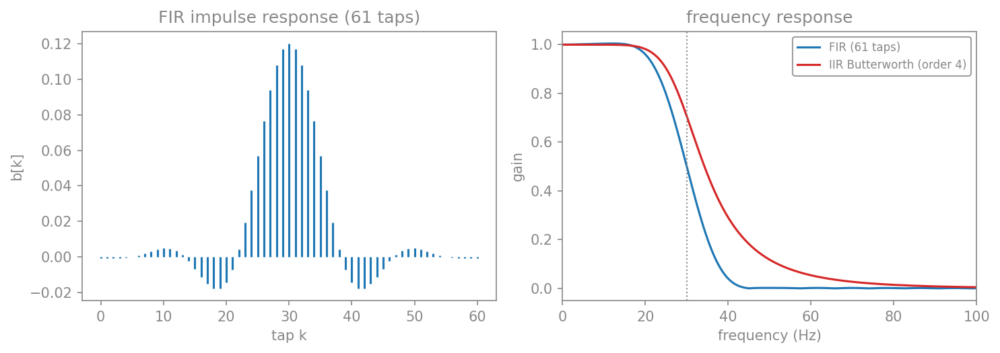
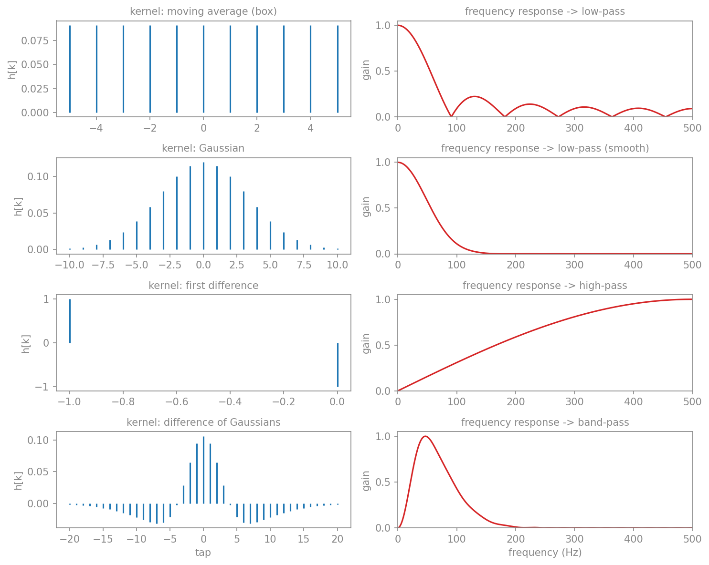
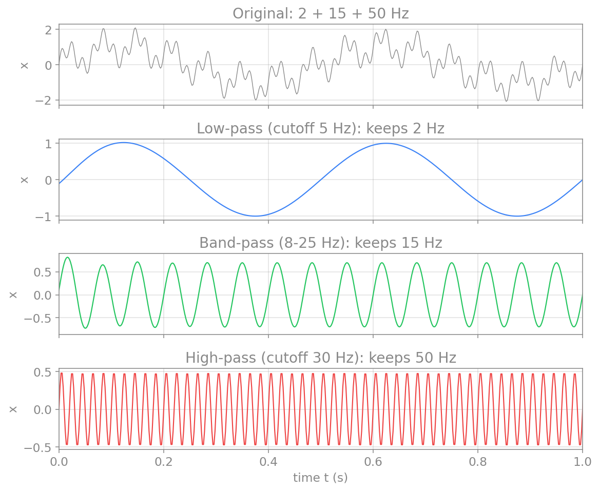
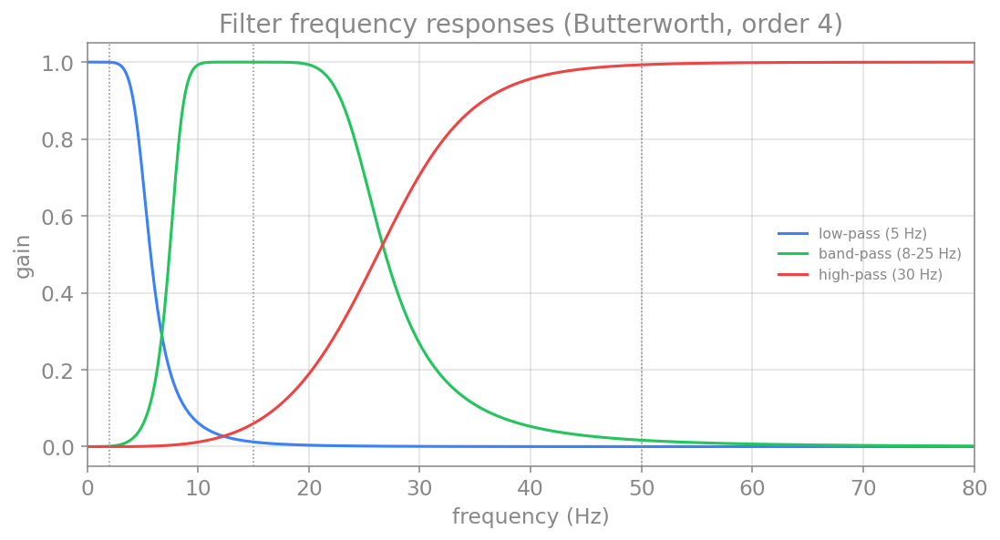
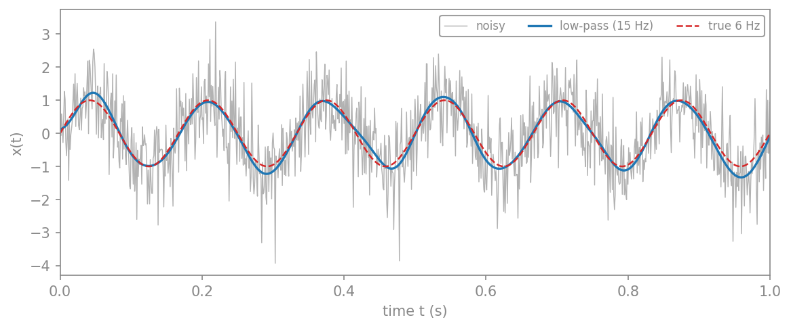
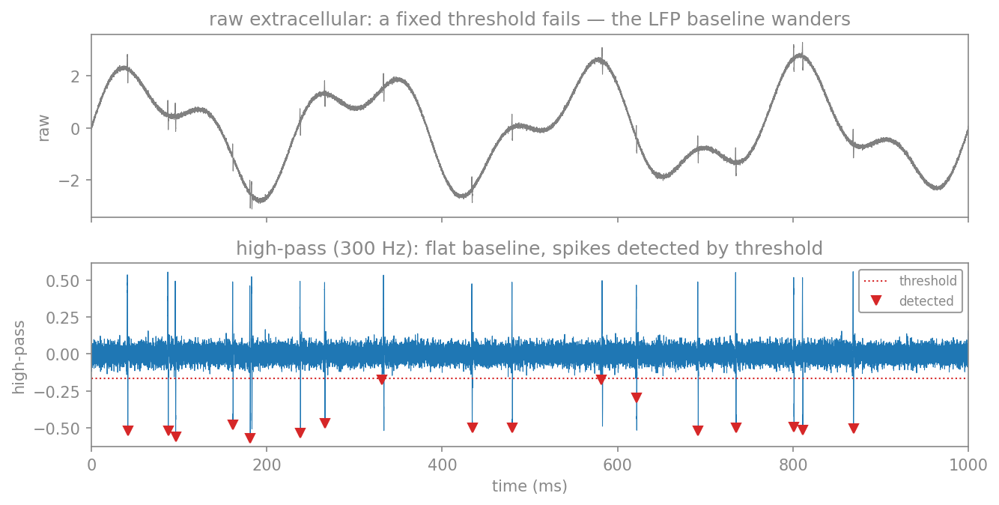
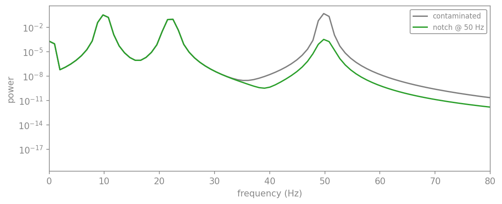

# صافی‌ها

در فصلِ حوزهٔ زمان دیدیم که کانولوشن می‌تواند سیگنال را هموار کند. این، نمونه‌ای ساده از یک **صافی** (filter) بود. به‌طورِ کلی، صافی ابزاری است که برخی بسامدها را از سیگنال عبور می‌دهد و برخی دیگر را تضعیف یا حذف می‌کند. صافی‌ها در علوم اعصاب نقشِ مرکزی دارند: برای حذفِ نوفهٔ خطِ برق (۵۰ یا ۶۰ هرتز)، برای جداکردنِ باندهای مغزی (آلفا، بتا، گاما)، و برای حذفِ روندِ آهستهٔ پس‌زمینه از ثبت‌ها.

## انواع صافی

بر پایهٔ اینکه کدام بسامدها را عبور می‌دهند، صافی‌ها را به چند دسته تقسیم می‌کنیم:

- **صافیِ پایین‌گذر** (low-pass): بسامدهای پایین‌تر از یک بسامدِ مرزی (cutoff) را عبور می‌دهد و بسامدهای بالا را تضعیف می‌کند. برای هموارسازی و حذفِ نوفهٔ پربسامد به کار می‌رود.
- **صافیِ بالاگذر** (high-pass): برعکس، بسامدهای بالا را عبور می‌دهد و بسامدهای پایین (مثلاً روندِ آهسته) را حذف می‌کند.
- **صافیِ میان‌گذر** (band-pass): تنها بسامدهای میانِ دو مرز را عبور می‌دهد. برای جداکردنِ یک باندِ بسامدیِ خاص (مثلاً باندِ آلفا) آرمانی است.
- **صافیِ میان‌نگذر** (band-stop یا notch): برعکسِ میان‌گذر، تنها یک باندِ باریک را حذف می‌کند. کاربردِ کلاسیکِ آن، حذفِ نوفهٔ ۵۰ هرتزیِ خطِ برق است.

## پاسخ بسامدی

رفتارِ یک صافی را با **پاسخِ بسامدیِ** آن توصیف می‌کنیم: نموداری که نشان می‌دهد صافی به هر بسامد چه **بهره‌ای** (gain) می‌دهد. بهرهٔ نزدیک به ۱ یعنی آن بسامد تقریباً دست‌نخورده عبور می‌کند، و بهرهٔ نزدیک به ۰ یعنی آن بسامد حذف می‌شود. ناحیه‌ای که صافی عبور می‌دهد **باندِ عبور** (passband) و ناحیه‌ای که حذف می‌کند **باندِ توقف** (stopband) نام دارد.

در عمل، گذار از باندِ عبور به باندِ توقف هرگز کاملاً تند نیست؛ همیشه یک ناحیهٔ گذارِ تدریجی وجود دارد. **مرتبهٔ** صافی تعیین می‌کند که این گذار چقدر تند است: مرتبهٔ بالاتر، گذارِ تندتر، اما به بهای پیچیدگیِ بیشتر و احتمالِ ناپایداری.

## صافی‌های FIR و IIR

پیش از آنکه به ساختِ صافی‌ها بپردازیم، باید بدانیم هر صافیِ خطی به یکی از دو خانوادهٔ بنیادی تعلق دارد. کلیدِ تمایز، **پاسخِ ضربه‌ای** (impulse response) است: خروجیِ صافی وقتی ورودی یک ضربهٔ تنها $(1, 0, 0, \dots)$ باشد. پاسخِ ضربه‌ای، اثرِ انگشتِ صافی است؛ هر صافیِ خطی با کانوالوکردنِ ورودی با پاسخِ ضربه‌ایِ خود کار می‌کند.

**صافیِ FIR** (پاسخِ ضربه‌ایِ متناهی، Finite Impulse Response): پاسخِ ضربه‌ای طولِ متناهی دارد. خروجی تنها ترکیبی خطی از مقادیرِ گذشته و حالِ **ورودی** است:

$$
y_n = \sum_{k=0}^{N} b_k\, x_{n-k}.
$$

این دقیقاً همان **کانولوشن**ی است که در فصلِ حوزهٔ زمان دیدیم: ضرایبِ $b_k$ همان هستهٔ کانولوشن (پاسخِ ضربه‌ای) هستند. **میانگینِ متحرک**ی که در آن فصل ساختیم، ساده‌ترین صافیِ FIR است (هسته‌ای جعبه‌ای).

**صافیِ IIR** (پاسخِ ضربه‌ایِ نامتناهی، Infinite Impulse Response): پاسخِ ضربه‌ای طولِ نامتناهی دارد و با یک **معادلهٔ تفاضلی** توصیف می‌شود که علاوه بر ورودی، به مقادیرِ گذشتهٔ **خروجی** نیز وابسته است (جملهٔ **بازخورد**):

$$
y_n = \frac{1}{a_0}\left( \sum_{k=0}^{N} b_k\, x_{n-k} - \sum_{l=1}^{M} a_l\, y_{n-l} \right).
$$

همین بازخورد است که IIR را نیرومند (با ضرایبِ کم، گذارِ تند) اما در عوض پیچیده‌تر و مستعدِ ناپایداری می‌کند. وقتی در ادامه `scipy.signal.butter` را فرامی‌خوانیم، همین دو دستهٔ ضرایب—$b$ (پیش‌خور) و $a$ (بازخورد)—را برمی‌گرداند، و `filtfilt` آن‌ها را با همین معادلهٔ تفاضلی اعمال می‌کند.

برای دیدنِ تفاوت، یک صافیِ پایین‌گذرِ FIR (با تابعِ `firwin`) و یک صافیِ پایین‌گذرِ IIR باترورث را با مرزِ یکسانِ ۳۰ هرتز می‌سازیم و مقایسه می‌کنیم:

```python
import numpy as np
import matplotlib.pyplot as plt
from scipy import signal as sig

fs = 500.0
fc = 30.0
b_fir = sig.firwin(61, fc, fs=fs)            # FIR: 61 taps = the impulse response
b_iir, a_iir = sig.butter(4, fc, fs=fs)      # IIR: Butterworth, order 4

w1, h1 = sig.freqz(b_fir, [1], fs=fs, worN=2000)
w2, h2 = sig.freqz(b_iir, a_iir, fs=fs, worN=2000)

fig, (ax1, ax2) = plt.subplots(1, 2, figsize=(10, 3.6))
ax1.stem(np.arange(len(b_fir)), b_fir, linefmt="tab:blue", markerfmt=" ", basefmt=" ")
ax1.set_title("FIR impulse response (61 taps)")
ax1.set_xlabel("tap k"); ax1.set_ylabel("b[k]")
ax2.plot(w1, np.abs(h1), color="tab:blue", label="FIR (61 taps)")
ax2.plot(w2, np.abs(h2), color="tab:red", label="IIR Butterworth (order 4)")
ax2.axvline(fc, color="gray", ls=":", lw=1)
ax2.set_xlim(0, 100); ax2.set_xlabel("frequency (Hz)"); ax2.set_ylabel("gain")
ax2.set_title("frequency response"); ax2.legend()
plt.tight_layout()
plt.show()
```

<figure markdown="span">
  
  <figcaption>چپ: پاسخِ ضربه‌ایِ یک صافیِ FIR با ۶۱ ضریب—این همان هستهٔ کانولوشن است. راست: پاسخِ بسامدیِ صافیِ FIR (آبی) و صافیِ IIR باترورث (قرمز)، هر دو پایین‌گذر با مرزِ ۳۰ هرتز. صافیِ IIR با تنها ۵ ضریبِ $b$ و ۵ ضریبِ $a$ به پاسخی مشابهِ صافیِ FIR با ۶۱ ضریب می‌رسد—این، کاراییِ IIR است؛ اما به بهای جملهٔ بازخورد.</figcaption>
</figure>

!!! note "کدام را برگزینیم؟"
    صافیِ **FIR** همیشه پایدار است و می‌تواند فازِ خطی داشته باشد (تأخیرِ یکسان برای همهٔ بسامدها)، اما برای گذارِ تند به ضرایبِ بسیار زیاد نیاز دارد. صافیِ **IIR** با ضرایبِ بسیار کمتر به گذارِ تند می‌رسد، اما فازش خطی نیست و می‌تواند ناپایدار شود. در علوم اعصاب، وقتی زمان‌بندیِ دقیق مهم است، فازِ خطیِ FIR ارزشمند است؛ وقتی کارایی مهم است، IIR (مانندِ باترورث) رایج‌تر است.

## کانولوشن و صافی: دو روی یک سکه

در فصلِ حوزهٔ زمان، **کانولوشن** و **میانگینِ متحرک** را ساختیم؛ در این فصل از **صافی‌های پایین‌گذر، بالاگذر و میان‌گذر** سخن می‌گوییم. آیا این‌ها دو چیزِ متفاوت‌اند؟ پاسخ، که در بخشِ پیش هم به آن اشاره شد، این است: **نه**—این‌ها دو نگاه به یک عملِ واحدند.

**شباهت.** هر صافیِ خطی، در دلِ خود یک **کانولوشن** با پاسخِ ضربه‌ای (هسته) است، و برعکس، هر کانولوشن با یک هستهٔ ثابت، یک صافیِ خطی است. پس «میانگینِ متحرک» و «صافیِ پایین‌گذر» می‌توانند یک چیز باشند.

**تفاوت—در واژگان، نه در ماهیت.** آنچه فرق می‌کند، زاویهٔ نگاه است:

- وقتی صافی را با **هسته‌اش** نام می‌بریم—«صافیِ میانگینِ متحرک»، «صافیِ گاوسی»—داریم آن را از منظرِ **حوزهٔ زمان** توصیف می‌کنیم: با چه چیزی کانوالو می‌کنیم.
- وقتی آن را «**پایین‌گذر**»، «**بالاگذر**» یا «**میان‌گذر**» می‌نامیم، داریم آن را از منظرِ **حوزهٔ بسامد** توصیف می‌کنیم: کدام بسامدها را عبور می‌دهد.

پلِ میانِ این دو نگاه، **قضیهٔ کانولوشن** است: تبدیلِ فوریهٔ هسته، همان **پاسخِ بسامدیِ** صافی است. پس **شکلِ هسته** در حوزهٔ زمان، **نوعِ صافی** را در حوزهٔ بسامد تعیین می‌کند. بیایید چند هسته را کنارِ پاسخِ بسامدیِ آن‌ها ببینیم:

```python
import numpy as np
import matplotlib.pyplot as plt

fs = 1000.0
def freq_response(kernel, nfft=4096):
    H = np.fft.rfft(kernel, nfft)
    f = np.fft.rfftfreq(nfft, 1/fs)
    mag = np.abs(H)
    return f, mag/mag.max()

box = np.ones(11)/11                                  # moving average
xg = np.linspace(-3, 3, 21); g = np.exp(-xg**2/2); gauss = g/g.sum()   # Gaussian
diff = np.array([1.0, -1.0])                          # first difference
xx = np.linspace(-4, 4, 41)
gn = np.exp(-xx**2/(2*0.5**2)); gn /= gn.sum()
gw = np.exp(-xx**2/(2*1.5**2)); gw /= gw.sum()
dog = gn - gw                                         # difference of Gaussians

rows = [("moving average (box)", "low-pass", box),
        ("Gaussian", "low-pass (smooth)", gauss),
        ("first difference", "high-pass", diff),
        ("difference of Gaussians", "band-pass", dog)]

fig, axes = plt.subplots(4, 2, figsize=(10, 8))
for r, (name, ftype, k) in enumerate(rows):
    axes[r, 0].stem(np.arange(len(k))-len(k)//2, k, linefmt="tab:blue",
                    markerfmt=" ", basefmt=" ")
    axes[r, 0].set_title(f"kernel: {name}", fontsize=10); axes[r, 0].set_ylabel("h[k]")
    f, H = freq_response(k)
    axes[r, 1].plot(f, H, color="tab:red"); axes[r, 1].set_xlim(0, fs/2)
    axes[r, 1].set_title(f"frequency response -> {ftype}", fontsize=10)
    axes[r, 1].set_ylabel("gain")
plt.tight_layout()
plt.show()
```

<figure markdown="span">
  
  <figcaption>هر هسته (چپ) یک صافی است، و پاسخِ بسامدیِ آن (راست) نوعش را آشکار می‌کند. هستهٔ جعبه‌ای (میانگینِ متحرک) و گاوسی پایین‌گذرند؛ توجه کنید که جعبه‌ای موج‌های جانبی دارد اما گاوسی هموار است. هستهٔ تفاضلِ نخست بالاگذر است (بهره با بسامد بالا می‌رود)، و تفاضلِ دو گاوسی (DoG) میان‌گذر است (بهره در DC و در بسامدِ بالا صفر و در میانه بیشینه است).</figcaption>
</figure>

این تصویر همهٔ مفاهیم را به هم گره می‌زند: هستهٔ **جعبه‌ای** که در فصلِ پیش برای هموارسازی به کار بردیم، یک صافیِ **پایین‌گذر** بوده است—و موج‌های جانبیِ آن (همان سینوسی‌شکلِ ناشی از لبه‌های تیزِ جعبه) دلیلِ آن است که هستهٔ **گاوسی** برای هموارسازی بهتر است. هستهٔ **تفاضلی** (که تغییراتِ تند را برجسته می‌کند) یک صافیِ **بالاگذر** است، و **تفاضلِ دو گاوسی** یک صافیِ **میان‌گذر**.

!!! note "کجا این هم‌ارزی می‌شکند؟"
    گزارهٔ «صافی = کانولوشن با یک هستهٔ متناهی» دقیقاً برای صافی‌های **FIR** برقرار است. برای صافی‌های **IIR** (مانندِ باترورث در بخشِ بعد)، پاسخِ ضربه‌ای **نامتناهی** است؛ نمی‌توان با یک هستهٔ متناهی کانوالو کرد، و به‌جای آن از معادلهٔ تفاضلیِ بازگشتی استفاده می‌کنیم. پس دقیق‌ترین بیان این است: **هر صافیِ خطی کانولوشن با پاسخِ ضربه‌ایِ خود است**—که برای FIR متناهی و مستقیماً قابل‌استفاده، و برای IIR نامتناهی است.

## صافی‌های باترورث در scipy

یکی از پرکاربردترین خانواده‌های صافی، **باترورث** (Butterworth) است که در باندِ عبور پاسخی بسیار هموار (بدونِ موج) دارد. کتابخانهٔ `scipy.signal` ساختنِ این صافی‌ها را ساده می‌کند. تابعِ `butter` ضرایبِ صافی را می‌سازد و `filtfilt` آن را بر سیگنال اعمال می‌کند (دوبار، یک‌بار رو به جلو و یک‌بار رو به عقب، تا فاز جابه‌جا نشود).

```python
import numpy as np
import matplotlib.pyplot as plt
from scipy import signal as sig

def butter_filter(x, fs, cutoff, btype, order=4):
    # design a Butterworth filter and apply it with zero phase shift
    b, a = sig.butter(order, cutoff, btype=btype, fs=fs)
    return sig.filtfilt(b, a, x)

# a signal with three components: 2 Hz, 15 Hz and 50 Hz
fs = 500.0
t = np.arange(0, 2, 1/fs)
x = (np.sin(2*np.pi*2*t)
     + 0.7*np.sin(2*np.pi*15*t)
     + 0.5*np.sin(2*np.pi*50*t))

low = butter_filter(x, fs, 5, "low")            # keeps the 2 Hz component
band = butter_filter(x, fs, [8, 25], "band")    # keeps the 15 Hz component
high = butter_filter(x, fs, 30, "high")         # keeps the 50 Hz component

fig, axes = plt.subplots(4, 1, figsize=(8.5, 7), sharex=True)
axes[0].plot(t, x, color="gray"); axes[0].set_title("original: 2 + 15 + 50 Hz")
axes[1].plot(t, low, color="tab:blue"); axes[1].set_title("low-pass: keeps 2 Hz")
axes[2].plot(t, band, color="tab:green"); axes[2].set_title("band-pass: keeps 15 Hz")
axes[3].plot(t, high, color="tab:red"); axes[3].set_title("high-pass: keeps 50 Hz")
axes[3].set_xlabel("time t (s)"); axes[3].set_xlim(0, 1)
plt.tight_layout()
plt.show()
```

<figure markdown="span">
  
  <figcaption>اعمالِ سه صافی بر سیگنالی که از سه مؤلفهٔ ۲، ۱۵ و ۵۰ هرتزی ساخته شده. صافیِ پایین‌گذر تنها مؤلفهٔ آهستهٔ ۲ هرتزی، صافیِ میان‌گذر تنها مؤلفهٔ ۱۵ هرتزی، و صافیِ بالاگذر تنها مؤلفهٔ تندِ ۵۰ هرتزی را نگه می‌دارد.</figcaption>
</figure>

می‌توان پاسخِ بسامدیِ این صافی‌ها را نیز مستقیماً رسم کرد تا ببینیم هر کدام چه بسامدهایی را عبور می‌دهند. تابعِ `freqz` پاسخِ بسامدی را می‌دهد:

```python
import numpy as np
import matplotlib.pyplot as plt
from scipy import signal as sig

fs = 500.0
designs = [(5, "low", "low-pass (5 Hz)"),
           ([8, 25], "band", "band-pass (8-25 Hz)"),
           (30, "high", "high-pass (30 Hz)")]

for cutoff, btype, label in designs:
    b, a = sig.butter(4, cutoff, btype=btype, fs=fs)
    w, h = sig.freqz(b, a, fs=fs, worN=2000)
    plt.plot(w, np.abs(h), label=label)

plt.xlim(0, 80)
plt.xlabel("frequency (Hz)")
plt.ylabel("gain")
plt.legend()
plt.show()
```

<figure markdown="span">
  
  <figcaption>پاسخِ بسامدیِ سه صافیِ باترورثِ مرتبهٔ چهار. صافیِ پایین‌گذر (آبی) به بسامدهای پایین بهرهٔ نزدیک به ۱ و به بسامدهای بالا بهرهٔ نزدیک به ۰ می‌دهد؛ میان‌گذر (سبز) تنها باندِ میانی و بالاگذر (قرمز) تنها بسامدهای بالا را عبور می‌دهد. توجه کنید که گذار از باندِ عبور به توقف تدریجی است، نه ناگهانی.</figcaption>
</figure>

!!! tip "صافی‌کردن، یک کانولوشن است"
    هر صافیِ خطی، در دلِ خود یک **کانولوشن** است (فصلِ حوزهٔ زمان): سیگنال را با پاسخِ ضربه‌ایِ صافی کانوالو می‌کنیم. به‌طورِ هم‌ارز، در حوزهٔ بسامد، صافی‌کردن یعنی **ضربِ** طیفِ سیگنال در پاسخِ بسامدیِ صافی. این، نمونهٔ دیگری از قضیهٔ کانولوشن است: کانولوشن در حوزهٔ زمان، با ضرب در حوزهٔ بسامد هم‌ارز است.

!!! warning "هشدار: فاز و پیچش"
    اعمالِ صافی می‌تواند **فازِ** سیگنال را جابه‌جا کند، یعنی رویدادها را در زمان حرکت دهد. برای تحلیل‌هایی که زمان‌بندیِ دقیق مهم است (مانندِ پتانسیل‌های وابسته به رویداد در EEG)، از صافیِ **بدونِ‌فاز** مانندِ `filtfilt` استفاده می‌کنیم که سیگنال را دوبار (جلو و عقب) صافی می‌کند تا جابه‌جاییِ فاز خنثی شود. همچنین، صافیِ با مرتبهٔ بسیار بالا ممکن است ناپایدار شود یا در لبه‌های سیگنال پیچش (artifact) ایجاد کند.

## کاربردهای عملی

تا اینجا صافی‌ها را روی سیگنال‌های مصنوعی آزمودیم. حال سه کاربردِ واقعی در پردازشِ داده‌های مغزی را می‌بینیم که هر روز در آزمایشگاه به کار می‌روند. در هر سه از همان تابعِ `butter_filter` که بالاتر تعریف کردیم استفاده می‌کنیم.

### صافیِ پایین‌گذر برای حذفِ نوفه

پرکاربردترین کاربردِ صافیِ پایین‌گذر، **حذفِ نوفه** است. فرض کنید یک ریتمِ آهستهٔ مغزی (مثلاً ریتمِ تتای ۶ هرتزی) را ثبت کرده‌ایم، اما ثبت با نوفهٔ پربسامدِ فراوانی آلوده است. چون سیگنالِ موردِ علاقهٔ ما آهسته و نوفه تند است، یک صافیِ پایین‌گذر می‌تواند نوفه را بزداید و ریتم را آشکار کند:

```python
import numpy as np
import matplotlib.pyplot as plt

rng = np.random.default_rng(0)
fs = 1000.0
t = np.arange(0, 2, 1/fs)
clean = np.sin(2*np.pi*6*t)                      # a 6 Hz rhythm (theta-like)
noisy = clean + 0.8*rng.standard_normal(len(t))  # heavy broadband noise

denoised = butter_filter(noisy, fs, 15, "low")   # low-pass at 15 Hz

plt.plot(t, noisy, color="gray", alpha=0.6, lw=0.7, label="noisy")
plt.plot(t, denoised, color="tab:blue", lw=1.6, label="low-pass (15 Hz)")
plt.plot(t, clean, "--", color="tab:red", lw=1.2, label="true 6 Hz")
plt.xlim(0, 1); plt.xlabel("time t (s)"); plt.ylabel("x(t)")
plt.legend()
plt.show()
```

<figure markdown="span">
  
  <figcaption>حذفِ نوفه با صافیِ پایین‌گذر. سیگنالِ نوفه‌ای (خاکستری) چنان آلوده است که ریتمِ زیرین به‌سختی دیده می‌شود؛ صافیِ پایین‌گذرِ ۱۵ هرتزی (آبی) نوفهٔ پربسامد را حذف می‌کند و خروجی تقریباً منطبق بر ریتمِ واقعیِ ۶ هرتزی (خط‌چینِ قرمز) است.</figcaption>
</figure>

نکتهٔ کلیدی، انتخابِ بسامدِ مرزی است: باید به‌قدری بالا باشد که سیگنالِ موردِ نظر (۶ هرتز) را دست‌نخورده عبور دهد، و به‌قدری پایین که نوفهٔ پربسامد را حذف کند. مرزِ ۱۵ هرتز این بده‌بستان را خوب برآورده می‌کند.

### صافیِ بالاگذر برای یافتنِ اسپایک‌ها

یکی از زیباترین کاربردهای صافیِ بالاگذر، **جداکردنِ اسپایک‌ها** (پتانسیل‌های عمل) در ثبت‌های خارج‌سلولی است. یک الکترودِ خارج‌سلولی هم‌زمان دو چیز را ثبت می‌کند: **پتانسیلِ میدانیِ محلی** (LFP) که آهسته و بزرگ‌دامنه است، و **اسپایک‌ها** که تند (پهنای حدودِ ۱ میلی‌ثانیه) و کوچک‌دامنه‌اند. در سیگنالِ خام، خطِ پایه با نوسانِ آهستهٔ LFP بالا و پایین می‌رود، و به همین دلیل نمی‌توان با یک آستانهٔ ثابت اسپایک‌ها را یافت. اگر سیگنال را از یک صافیِ بالاگذر (معمولاً با مرزِ ۳۰۰ هرتز) بگذرانیم، LFP حذف می‌شود، خطِ پایه صاف می‌شود، و اسپایک‌ها به‌روشنی بیرون می‌زنند؛ آنگاه یک آستانهٔ ساده آن‌ها را آشکار می‌کند:

```python
import numpy as np
import matplotlib.pyplot as plt

fs = 30000.0                                     # 30 kHz, typical extracellular rate
t = np.arange(0, 1.0, 1/fs)
rng = np.random.default_rng(3)

# slow LFP (large, low-frequency) + brief spikes + noise
lfp = 1.8*np.sin(2*np.pi*4*t) + 1.0*np.sin(2*np.pi*9*t)
w = int(0.0015*fs); tt = np.linspace(-1, 1, w)
wav = -np.exp(-(tt*2.2)**2)*tt*3.0; wav = wav/np.max(np.abs(wav))   # ~1.5 ms spike shape
spikes = np.zeros_like(t)
spk_idx = np.sort(rng.choice(np.arange(w, len(t)-w), size=18, replace=False))
for s in spk_idx:
    spikes[s:s+w] += 0.5*wav
raw = lfp + spikes + 0.04*rng.standard_normal(len(t))

hp = butter_filter(raw, fs, 300, "high")         # high-pass isolates the spikes

# robust threshold (median absolute deviation) and refractory detection
sigma = np.median(np.abs(hp)) / 0.6745
thr = -4*sigma
refractory = int(0.002*fs)                        # 2 ms dead time
below = hp < thr
candidates = np.where((~below[:-1]) & (below[1:]))[0]
detected = []; last = -refractory
for c in candidates:
    if c - last > refractory:
        w1 = min(c + int(0.001*fs), len(hp))
        detected.append(c + int(np.argmin(hp[c:w1])))   # locate the spike peak
        last = c
detected = np.array(detected)

fig, (a1, a2) = plt.subplots(2, 1, figsize=(9, 4.6), sharex=True)
a1.plot(t*1000, raw, color="gray", lw=0.5); a1.set_ylabel("raw")
a1.set_title("raw: a fixed threshold fails — the LFP baseline wanders")
a2.plot(t*1000, hp, color="tab:blue", lw=0.5)
a2.axhline(thr, color="tab:red", ls=":", lw=1, label="threshold")
a2.plot(detected/fs*1000, hp[detected], "v", color="tab:red", ms=6, label="detected")
a2.set_ylabel("high-pass"); a2.set_xlabel("time (ms)")
a2.set_title("high-pass (300 Hz): flat baseline, spikes detected")
a2.legend(); a2.set_xlim(0, 1000)
plt.tight_layout()
plt.show()
```

<figure markdown="span">
  
  <figcaption>یافتنِ اسپایک با صافیِ بالاگذر. بالا: سیگنالِ خام، که نوسانِ آهستهٔ LFP خطِ پایه را جابه‌جا می‌کند و اسپایک‌ها در آن گم‌اند—یک آستانهٔ ثابت اینجا کار نمی‌کند. پایین: پس از صافیِ بالاگذرِ ۳۰۰ هرتزی، LFP حذف شده، خطِ پایه صاف است و اسپایک‌ها (فروافت‌های تند) با یک آستانهٔ ساده (خط‌چینِ قرمز) آشکار می‌شوند. مثلث‌های قرمز اسپایک‌های یافته‌شده‌اند.</figcaption>
</figure>

!!! tip "آستانهٔ مقاوم"
    برای تعیینِ آستانه، به‌جای انحرافِ معیار از یک برآوردِ **مقاوم** بهره می‌بریم: $\sigma \approx \text{median}(|x|)/0.6745$. این برآورد، برخلافِ انحرافِ معیار، تحتِ تأثیرِ خودِ اسپایک‌ها (که مقادیرِ پرت‌اند) قرار نمی‌گیرد و در عملِ مرتب‌سازیِ اسپایک (spike sorting) استانداردی رایج است. «زمانِ مرده» (refractory) نیز تضمین می‌کند هر اسپایک تنها یک‌بار شمرده شود.

### صافیِ میان‌نگذر برای حذفِ نوفهٔ خطِ برق

نوفهٔ ۵۰ هرتزیِ خطِ برق (۶۰ هرتز در برخی کشورها) آفتِ همیشگیِ ثبت‌های الکتروفیزیولوژیک است. چون این نوفه در یک بسامدِ باریکِ مشخص است، یک صافیِ **میان‌نگذر** (notch) آرمانی‌ترین ابزار برای حذفِ آن است: تنها همان باندِ باریک را حذف می‌کند و بقیهٔ سیگنال را دست‌نخورده می‌گذارد. تابعِ `scipy.signal.iirnotch` این صافی را می‌سازد:

```python
import numpy as np
import matplotlib.pyplot as plt
from scipy import signal as sig

fs = 1000.0
t = np.arange(0, 3, 1/fs)
brain = np.sin(2*np.pi*10*t) + 0.6*np.sin(2*np.pi*22*t)   # 10 + 22 Hz rhythms
line = 1.2*np.sin(2*np.pi*50*t)                            # 50 Hz mains noise
contaminated = brain + line

b, a = sig.iirnotch(50, Q=30, fs=fs)             # notch at 50 Hz
cleaned = sig.filtfilt(b, a, contaminated)

f1, P1 = sig.welch(contaminated, fs=fs, nperseg=1024)
f2, P2 = sig.welch(cleaned, fs=fs, nperseg=1024)
plt.semilogy(f1, P1, color="gray", label="contaminated")
plt.semilogy(f2, P2, color="tab:green", label="notch @ 50 Hz")
plt.xlim(0, 80); plt.xlabel("frequency (Hz)"); plt.ylabel("power")
plt.legend()
plt.show()
```

<figure markdown="span">
  
  <figcaption>حذفِ نوفهٔ خطِ برق با صافیِ میان‌نگذر. طیفِ توانِ سیگنالِ آلوده (خاکستری) یک قلهٔ بلند در ۵۰ هرتز دارد. صافیِ میان‌نگذر (سبز) این قله را چند مرتبه‌ٔ بزرگی پایین می‌آورد، در حالی‌که قله‌های ریتم‌های مغزی در ۱۰ و ۲۲ هرتز تقریباً دست‌نخورده می‌مانند.</figcaption>
</figure>

## جمع‌بندی

در این فصل، صافی‌ها را ساختیم: ابزارهایی که بسامدهای خاصی را عبور می‌دهند و بقیه را حذف می‌کنند. صافی‌های **پایین‌گذر، بالاگذر، میان‌گذر و میان‌نگذر** هر کدام کاربردِ خاصِ خود را دارند، از حذفِ نوفهٔ خطِ برق تا جداکردنِ باندهای مغزی. دیدیم که هر صافی با **پاسخِ بسامدیِ** خود توصیف می‌شود، و چگونه با `scipy.signal` صافی‌های باترورث را طراحی و اعمال کنیم. و سرانجام دیدیم که صافی‌کردن در اصل همان کانولوشنِ فصلِ پیش است، که در حوزهٔ بسامد به ضربِ ساده بدل می‌شود. در فصلِ بعد، به تحلیلِ زمان–بسامد می‌پردازیم، جایی که هم زمان و هم بسامد را هم‌زمان دنبال می‌کنیم.
