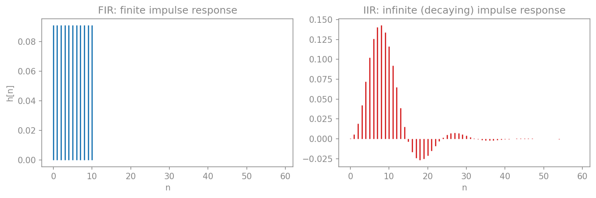
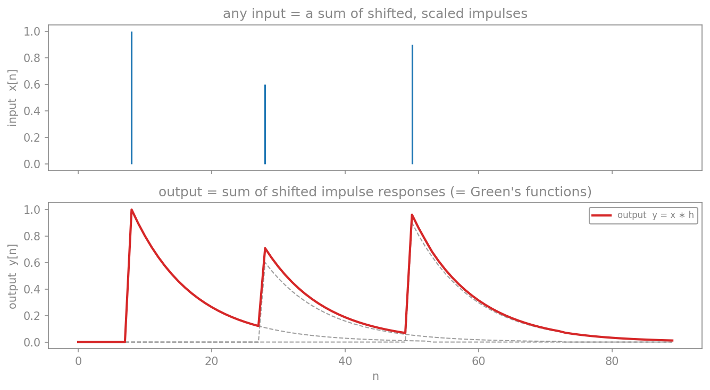
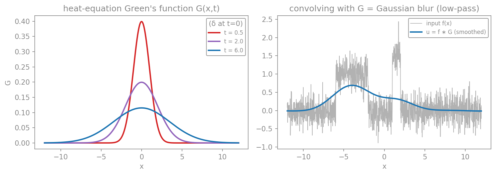

# فیلترها

در فصلِ حوزهٔ زمان دیدیم که کانولوشن می‌تواند سیگنال را هموار کند. این، نمونه‌ای ساده از یک **فیلتر** (filter) بود. به‌طورِ کلی، فیلتر ابزاری است که برخی بسامدها را از سیگنال عبور می‌دهد و برخی دیگر را تضعیف یا حذف می‌کند. فیلترها در علوم اعصاب نقشِ مرکزی دارند: برای حذفِ نوفهٔ خطِ برق (۵۰ یا ۶۰ هرتز)، برای جداکردنِ باندهای مغزی (آلفا، بتا، گاما)، و برای حذفِ روندِ آهستهٔ پس‌زمینه از ثبت‌ها.

## انواع فیلتر

بر پایهٔ اینکه کدام بسامدها را عبور می‌دهند، فیلترها را به چند دسته تقسیم می‌کنیم:

- **فیلترِ پایین‌گذر** (low-pass): بسامدهای پایین‌تر از یک بسامدِ مرزی (cutoff) را عبور می‌دهد و بسامدهای بالا را تضعیف می‌کند. برای هموارسازی و حذفِ نوفهٔ پربسامد به کار می‌رود.
- **فیلترِ بالاگذر** (high-pass): برعکس، بسامدهای بالا را عبور می‌دهد و بسامدهای پایین (مثلاً روندِ آهسته) را حذف می‌کند.
- **فیلترِ میان‌گذر** (band-pass): تنها بسامدهای میانِ دو مرز را عبور می‌دهد. برای جداکردنِ یک باندِ بسامدیِ خاص (مثلاً باندِ آلفا) آرمانی است.
- **فیلترِ میان‌نگذر** (band-stop یا notch): برعکسِ میان‌گذر، تنها یک باندِ باریک را حذف می‌کند. کاربردِ کلاسیکِ آن، حذفِ نوفهٔ ۵۰ هرتزیِ خطِ برق است.

## پاسخ بسامدی

رفتارِ یک فیلتر را با **پاسخِ بسامدیِ** آن توصیف می‌کنیم: نموداری که نشان می‌دهد فیلتر به هر بسامد چه **بهره‌ای** (gain) می‌دهد. بهرهٔ نزدیک به ۱ یعنی آن بسامد تقریباً دست‌نخورده عبور می‌کند، و بهرهٔ نزدیک به ۰ یعنی آن بسامد حذف می‌شود. ناحیه‌ای که فیلتر عبور می‌دهد **باندِ عبور** (passband) و ناحیه‌ای که حذف می‌کند **باندِ توقف** (stopband) نام دارد.

در عمل، گذار از باندِ عبور به باندِ توقف هرگز کاملاً تند نیست؛ همیشه یک ناحیهٔ گذارِ تدریجی وجود دارد. **مرتبهٔ** فیلتر تعیین می‌کند که این گذار چقدر تند است: مرتبهٔ بالاتر، گذارِ تندتر، اما به بهای پیچیدگیِ بیشتر و احتمالِ ناپایداری.

## فیلترهای FIR و IIR

پیش از آنکه به ساختِ فیلترها بپردازیم، باید بدانیم هر فیلترِ خطی به یکی از دو خانوادهٔ بنیادی تعلق دارد. کلیدِ تمایز، **پاسخِ ضربه‌ای** (impulse response) است: خروجیِ فیلتر وقتی ورودی یک ضربهٔ تنها $(1, 0, 0, \dots)$ باشد. پاسخِ ضربه‌ای، اثرِ انگشتِ فیلتر است؛ هر فیلترِ خطی با کانوالوکردنِ ورودی با پاسخِ ضربه‌ایِ خود کار می‌کند.

??? note "پاسخِ ضربه‌ای چیست و چرا همه‌چیز را تعیین می‌کند؟"
    **ضربه** (impulse) ساده‌ترین سیگنالِ ممکن است: تنها در لحظهٔ صفر مقدارِ ۱ دارد و در بقیهٔ جاها صفر است، یعنی $\delta[n] = (1, 0, 0, 0, \dots)$. در زمانِ گسسته به آن **واحدِ ضربه** یا **دلتای کرونکر** (Kronecker delta) می‌گویند؛ همتای پیوسته‌اش **دلتای دیراک** (Dirac delta) $\delta(t)$ است—که به‌جای یک دنباله، یک تابعِ تعمیم‌یافته با پهنای صفر و سطحِ زیرِ منحنیِ واحد است. **پاسخِ ضربه‌ای** $h[n]$، خروجیِ فیلتر در پاسخ به همین ورودیِ ضربه است.

    چرا این یک سیگنالِ کوچک، کلِ رفتارِ فیلتر را تعیین می‌کند؟ نکته اینجاست که **هر** سیگنال را می‌توان به‌صورتِ مجموعی از ضربه‌های جابه‌جاشده و مقیاس‌خورده نوشت:

    $$
    x[n] = \sum_{k} x[k]\, \delta[n-k].
    $$

    حال اگر فیلتر **خطی و ناوردا به انتقال** (LTI) باشد، دو خاصیت داریم: پاسخ به مجموع، مجموعِ پاسخ‌هاست (خطی‌بودن)، و پاسخ به ضربهٔ جابه‌جاشده، همان پاسخِ ضربه‌ایِ جابه‌جاشده است (ناوردایی به انتقال). با ترکیبِ این دو، خروجی برای هر ورودی چنین می‌شود:

    $$
    y[n] = \sum_{k} x[k]\, h[n-k] = (x * h)[n].
    $$

    یعنی **دانستنِ $h$ به‌تنهایی، خروجی را برای هر ورودیِ ممکن می‌دهد**—و آن عمل، دقیقاً همان **کانولوشن** است. به همین دلیل $h$ را «اثرِ انگشتِ» فیلتر می‌نامیم: همان هستهٔ کانولوشن است، و تبدیلِ فوریه‌اش همان **پاسخِ بسامدیِ** فیلتر.

    تفاوتِ FIR و IIR هم در همین‌جا ریشه دارد: در فیلترِ **FIR** پاسخِ ضربه‌ای پس از چند نمونه دقیقاً صفر می‌شود (**متناهی**)، اما در فیلترِ **IIR** به‌خاطرِ بازخورد، تا بی‌نهایت ادامه می‌یابد و تنها به‌تدریج میرا می‌شود (**نامتناهی**):

    ```python
    import numpy as np
    from scipy import signal as sig

    impulse = np.zeros(60); impulse[0] = 1.0      # the impulse (1, 0, 0, ...)
    h_fir = sig.lfilter(np.ones(11)/11, [1], impulse)   # FIR: finite
    b, a = sig.butter(4, 0.12)
    h_iir = sig.lfilter(b, a, impulse)                   # IIR: infinite (decaying)
    ```

    <figure markdown="span">
      
      <figcaption>پاسخِ ضربه‌ای به‌ازای یک ورودیِ ضربه. چپ: فیلترِ FIR (هستهٔ جعبه‌ای) که پس از ۱۱ نمونه دقیقاً صفر می‌شود—پاسخِ ضربه‌ایِ متناهی. راست: فیلترِ IIR (باترورث) که یک نوسانِ میرا است و هرگز کاملاً صفر نمی‌شود—پاسخِ ضربه‌ایِ نامتناهی. همین، دلیلِ نام‌گذاریِ FIR و IIR است.</figcaption>
    </figure>

??? note "پاسخِ ضربه‌ای و تابعِ گرین (Green's function)"
    فیلتر کردن، کانولوشن و تابعِ گرین سه مفهومِ عمیقاً درهم‌تنیده‌اند. در واقع، **تابعِ گرین، شالودهٔ ریاضیِ همان چیزی است که هنگامِ فیلتر کردن آن را پاسخِ ضربه‌ای می‌نامیم.** برای دیدنِ پیوند، سه نقش را از هم جدا کنیم:

    - **هسته/کرنل (چگونه):** در پردازشِ سیگنال و تصویر، کانولوشن با یک هستهٔ کوچک مقادیرِ همسایه را با هم می‌آمیزد—مثلاً لغزاندنِ یک ماتریسِ $3\times3$ روی پیکسل‌ها برای تار کردن یا آشکارسازیِ لبه.
    - **تابعِ گرین (چرا):** در فیزیک و مهندسی، تابعِ گرین همان هستهٔ پاسخِ ضربه‌ایِ یک معادلهٔ دیفرانسیلِ خطی است؛ توصیف می‌کند که سامانه به یک «ضربهٔ» کامل (یک تلنگرِ نقطه‌ای، یک جهشِ کوتاهِ ولتاژ، یا یک بارِ نقطه‌ای) چگونه پاسخ می‌دهد.
    - **کانولوشن (پیوند):** چون سامانه خطی است، هر ورودیِ پیچیده را می‌توان مجموعی از این ضربه‌های ریز دانست؛ با کانوالوکردنِ تابعِ گرین روی ورودی، خروجیِ نهایی (فیلتر‌شده) به‌دست می‌آید.

    **پیوندِ ریاضی.** فرض کنید می‌خواهیم یک معادلهٔ دیفرانسیلِ خطی $L\,u(x) = f(x)$ را حل کنیم، که در آن $L$ یک عملگرِ دیفرانسیلی، $f$ ورودی (جملهٔ وادارنده) و $u$ خروجی است. تابعِ گرین $G(x, y)$ پاسخِ سامانه به یک چشمهٔ **دلتای دیراک** است:

    $$
    L\, G(x, y) = \delta(x - y),
    $$

    و آن‌گاه با اصلِ **برهم‌نهی**، پاسخ به هر ورودیِ دلخواه از یک انتگرالِ کانولوشن به‌دست می‌آید:

    $$
    u(x) = \int G(x, y)\, f(y)\, dy.
    $$

    اگر سامانه **ناوردا به انتقال** (LTI) باشد، $G(x,y) = h(x-y)$ و این انتگرال دقیقاً همان کانولوشنِ $u = f * h$ می‌شود—همان معادلهٔ $y = x * h$ که بالاتر دیدیم. پس **تابعِ گرینِ معادلهٔ حاکم، همان پاسخِ ضربه‌ایِ سامانه است.** دلیلش هم همان است که پاسخِ ضربه‌ای کلِ فیلتر را تعیین می‌کرد: هر ورودی مجموعی از ضربه‌های جابه‌جاشده است، و خروجی مجموعِ پاسخ‌های ضربه‌ایِ (تابع‌های گرینِ) جابه‌جاشده—که تعریفِ کانولوشن است:

    <figure markdown="span">
      
      <figcaption>اصلِ برهم‌نهی. بالا: یک ورودی به‌صورتِ مجموعی از سه ضربهٔ مقیاس‌خورده. پایین: خروجی برابرِ مجموعِ سه نسخهٔ جابه‌جاشده و مقیاس‌خوردهٔ پاسخِ ضربه‌ای (همان تابعِ گرین) است؛ خط‌چین‌های خاکستری سهمِ هر ضربه و خطِ قرمز مجموعِ آن‌ها (یعنی $y = x * h$) است.</figcaption>
    </figure>

    **یک مثالِ کلاسیک: معادلهٔ گرما = تاریِ گاوسی.** میلهٔ فلزیِ بی‌نهایت‌بلندی را در نظر بگیرید که دمایش از معادلهٔ گرما پیروی می‌کند، $\frac{\partial u}{\partial t} = k \frac{\partial^2 u}{\partial x^2}$. تابعِ گرینِ آن—پاسخ به یک چشمهٔ گرمای نقطه‌ای در مبدأ—یک **گاوسی** است که با زمان پهن‌تر می‌شود:

    $$
    G(x, t) = \frac{1}{\sqrt{4\pi k t}}\, e^{-x^2/(4kt)}.
    $$

    در یک زمانِ ثابت $t$، این دقیقاً فرمولِ یک **فیلترِ گاوسی** است (با $\sigma^2 = 2kt$)—همان هستهٔ گاوسیِ پایین‌گذری که در گالریِ هسته‌ها دیدیم. به‌بیانِ دیگر، **پخشِ گرما برای مدتِ $t$، عیناً معادلِ تار کردنِ گاوسیِ (هموارسازیِ) پروفایلِ اولیه است**: نرم‌افزار وقتی روی یک تصویر «تاریِ گاوسی» اعمال می‌کند، در واقع دارد حساب می‌کند که گرما در یک لحظهٔ کوتاه چگونه میانِ پیکسل‌ها پخش می‌شود.

    <figure markdown="span">
      
      <figcaption>چپ: پاسخِ معادلهٔ گرما به یک چشمهٔ نقطه‌ای، یک تابعِ گاوسی است که با گذرِ زمان پهن‌تر و مسطح‌تر می‌شود (همان تابعِ گرین). راست: کانولوشنِ یک سیگنالِ دلخواه با همان تابعِ گاوسی، آن را هموار می‌کند—همان کاری که یک فیلترِ پایین‌گذر (تاریِ گاوسی) انجام می‌دهد.</figcaption>
    </figure>

    **میان‌بُرِ حوزهٔ بسامد.** طبقِ **قضیهٔ کانولوشن**، کانولوشن در حوزهٔ مکان/زمان برابرِ ضربِ نقطه‌به‌نقطه در حوزهٔ بسامد است: $\mathcal{F}\{f * G\} = \mathcal{F}\{f\}\cdot\mathcal{F}\{G\}$. تبدیلِ فوریهٔ یک گاوسی، باز هم یک گاوسی است ($\propto e^{-\omega^2\sigma^2/2}$) که با بالا رفتنِ بسامد به‌سرعت به صفر می‌رود—پس بسامدهای بالا حذف و بسامدهای پایین عبور می‌کنند: یک **فیلترِ پایین‌گذر**. به همین دلیل، در عمل کانولوشن را اغلب با $\text{InverseFFT}\big(\text{FFT}(f)\times \text{FFT}(G)\big)$ محاسبه می‌کنند، که همان فیلتر کردن در حوزهٔ بسامد است.

    **پیوند با هوشِ مصنوعی.** همین ایده در یادگیریِ ماشین هم سر برمی‌آورد. یک لایهٔ **شبکهٔ عصبیِ پیچشی** (CNN) چیزی جز کانولوشن با هسته‌های آموخته‌شده نیست؛ وقتی CNN برای پیش‌بینیِ رفتارِ یک سامانهٔ فیزیکی آموزش می‌بیند، وزن‌های هسته‌هایش عملاً به تابعِ گرینِ آن سامانه میل می‌کنند. فراتر از آن، **عملگرهای عصبیِ فوریه** (Fourier Neural Operators، FNO) معادلاتِ دیفرانسیل را با همان دستورِ بالا حل می‌کنند: ورودی را به حوزهٔ بسامد می‌برند، در یک کرنلِ آموخته‌شده (تابعِ گرینِ بسامدی) ضرب می‌کنند، و با FFT وارون بازمی‌گردانند—یعنی قوانینِ فیزیک را به یک مسئلهٔ فیلتر کردنِ داده‌محور تبدیل می‌کنند.

    دو نکتهٔ تکمیلی: **علّیت** (causality) به تابعِ گرینِ **پسین** (retarded، یعنی $G = 0$ برای $t < t'$) متناظر است، که همان پاسخِ ضربه‌ایِ علّی است ($h[n] = 0$ برای $n < 0$). و به‌بیانِ جبرِ خطی، این کانولوشنِ گسسته معادلِ ضرب در یک ماتریسِ نواریِ **توپلیتس** (Toeplitz) است. پس پاسخِ ضربه‌ای، تابعِ گرین، و هستهٔ کانولوشن، سه نامِ یک ایده‌اند.

**فیلترِ FIR** (پاسخِ ضربه‌ایِ متناهی، Finite Impulse Response): پاسخِ ضربه‌ای طولِ متناهی دارد. خروجی تنها ترکیبی خطی از مقادیرِ گذشته و حالِ **ورودی** است:

$$
y_n = \sum_{k=0}^{N} b_k\, x_{n-k}.
$$

این دقیقاً همان **کانولوشن**ی است که در فصلِ حوزهٔ زمان دیدیم: ضرایبِ $b_k$ همان هستهٔ کانولوشن (پاسخِ ضربه‌ای) هستند. **میانگینِ متحرک**ی که در آن فصل ساختیم، ساده‌ترین فیلترِ FIR است (هسته‌ای جعبه‌ای).

**فیلترِ IIR** (پاسخِ ضربه‌ایِ نامتناهی، Infinite Impulse Response): پاسخِ ضربه‌ای طولِ نامتناهی دارد و با یک **معادلهٔ تفاضلی** توصیف می‌شود که علاوه بر ورودی، به مقادیرِ گذشتهٔ **خروجی** نیز وابسته است (جملهٔ **بازخورد**):

$$
y_n = \frac{1}{a_0}\left( \sum_{k=0}^{N} b_k\, x_{n-k} - \sum_{l=1}^{M} a_l\, y_{n-l} \right).
$$

همین بازخورد است که IIR را نیرومند (با ضرایبِ کم، گذارِ تند) اما در عوض پیچیده‌تر و مستعدِ ناپایداری می‌کند. وقتی در ادامه `scipy.signal.butter` را فرامی‌خوانیم، همین دو دستهٔ ضرایب—$b$ (پیش‌خور) و $a$ (بازخورد)—را برمی‌گرداند، و `filtfilt` آن‌ها را با همین معادلهٔ تفاضلی اعمال می‌کند.

برای دیدنِ تفاوت، یک فیلترِ پایین‌گذرِ FIR (با تابعِ `firwin`) و یک فیلترِ پایین‌گذرِ IIR باترورث را با مرزِ یکسانِ ۳۰ هرتز می‌سازیم و مقایسه می‌کنیم:

```python
import numpy as np
import matplotlib.pyplot as plt
from scipy import signal as sig

fs = 500.0
fc = 30.0
b_fir = sig.firwin(61, fc, fs=fs)            # FIR: 61 taps = the impulse response
b_iir, a_iir = sig.butter(4, fc, fs=fs)      # IIR: Butterworth, order 4

w1, h1 = sig.freqz(b_fir, [1], fs=fs, worN=2000)
w2, h2 = sig.freqz(b_iir, a_iir, fs=fs, worN=2000)

fig, (ax1, ax2) = plt.subplots(1, 2, figsize=(10, 3.6))
ax1.stem(np.arange(len(b_fir)), b_fir, linefmt="tab:blue", markerfmt=" ", basefmt=" ")
ax1.set_title("FIR impulse response (61 taps)")
ax1.set_xlabel("tap k"); ax1.set_ylabel("b[k]")
ax2.plot(w1, np.abs(h1), color="tab:blue", label="FIR (61 taps)")
ax2.plot(w2, np.abs(h2), color="tab:red", label="IIR Butterworth (order 4)")
ax2.axvline(fc, color="gray", ls=":", lw=1)
ax2.set_xlim(0, 100); ax2.set_xlabel("frequency (Hz)"); ax2.set_ylabel("gain")
ax2.set_title("frequency response"); ax2.legend()
plt.tight_layout()
plt.show()
```

<figure markdown="span">
  
  <figcaption>چپ: پاسخِ ضربه‌ایِ یک فیلترِ FIR با ۶۱ ضریب—این همان هستهٔ کانولوشن است. راست: پاسخِ بسامدیِ فیلترِ FIR (آبی) و فیلترِ IIR باترورث (قرمز)، هر دو پایین‌گذر با مرزِ ۳۰ هرتز. فیلترِ IIR با تنها ۵ ضریبِ $b$ و ۵ ضریبِ $a$ به پاسخی مشابهِ فیلترِ FIR با ۶۱ ضریب می‌رسد—این، کاراییِ IIR است؛ اما به بهای جملهٔ بازخورد.</figcaption>
</figure>

!!! note "کدام را برگزینیم؟"
    فیلترِ **FIR** همیشه پایدار است و می‌تواند فازِ خطی داشته باشد (تأخیرِ یکسان برای همهٔ بسامدها)، اما برای گذارِ تند به ضرایبِ بسیار زیاد نیاز دارد. فیلترِ **IIR** با ضرایبِ بسیار کمتر به گذارِ تند می‌رسد، اما فازش خطی نیست و می‌تواند ناپایدار شود. در علوم اعصاب، وقتی زمان‌بندیِ دقیق مهم است، فازِ خطیِ FIR ارزشمند است؛ وقتی کارایی مهم است، IIR (مانندِ باترورث) رایج‌تر است.

## کانولوشن و فیلتر: دو روی یک سکه

در فصلِ حوزهٔ زمان، **کانولوشن** و **میانگینِ متحرک** را ساختیم؛ در این فصل از **فیلترهای پایین‌گذر، بالاگذر و میان‌گذر** سخن می‌گوییم. آیا این‌ها دو چیزِ متفاوت‌اند؟ پاسخ، که در بخشِ پیش هم به آن اشاره شد، این است: **نه**—این‌ها دو نگاه به یک عملِ واحدند.

**شباهت.** هر فیلترِ خطی، در دلِ خود یک **کانولوشن** با پاسخِ ضربه‌ای (هسته) است، و برعکس، هر کانولوشن با یک هستهٔ ثابت، یک فیلترِ خطی است. پس «میانگینِ متحرک» و «فیلترِ پایین‌گذر» می‌توانند یک چیز باشند.

**تفاوت—در واژگان، نه در ماهیت.** آنچه فرق می‌کند، زاویهٔ نگاه است:

- وقتی فیلتر را با **هسته‌اش** نام می‌بریم—«فیلترِ میانگینِ متحرک»، «فیلترِ گاوسی»—داریم آن را از منظرِ **حوزهٔ زمان** توصیف می‌کنیم: با چه چیزی کانوالو می‌کنیم.
- وقتی آن را «**پایین‌گذر**»، «**بالاگذر**» یا «**میان‌گذر**» می‌نامیم، داریم آن را از منظرِ **حوزهٔ بسامد** توصیف می‌کنیم: کدام بسامدها را عبور می‌دهد.

پلِ میانِ این دو نگاه، **قضیهٔ کانولوشن** است: تبدیلِ فوریهٔ هسته، همان **پاسخِ بسامدیِ** فیلتر است. پس **شکلِ هسته** در حوزهٔ زمان، **نوعِ فیلتر** را در حوزهٔ بسامد تعیین می‌کند. بیایید چند هسته را کنارِ پاسخِ بسامدیِ آن‌ها ببینیم:

```python
import numpy as np
import matplotlib.pyplot as plt

fs = 1000.0
def freq_response(kernel, nfft=4096):
    H = np.fft.rfft(kernel, nfft)
    f = np.fft.rfftfreq(nfft, 1/fs)
    mag = np.abs(H)
    return f, mag/mag.max()

box = np.ones(11)/11                                  # moving average
xg = np.linspace(-3, 3, 21); g = np.exp(-xg**2/2); gauss = g/g.sum()   # Gaussian
diff = np.array([1.0, -1.0])                          # first difference
xx = np.linspace(-4, 4, 41)
gn = np.exp(-xx**2/(2*0.5**2)); gn /= gn.sum()
gw = np.exp(-xx**2/(2*1.5**2)); gw /= gw.sum()
dog = gn - gw                                         # difference of Gaussians

rows = [("moving average (box)", "low-pass", box),
        ("Gaussian", "low-pass (smooth)", gauss),
        ("first difference", "high-pass", diff),
        ("difference of Gaussians", "band-pass", dog)]

fig, axes = plt.subplots(4, 2, figsize=(10, 8))
for r, (name, ftype, k) in enumerate(rows):
    axes[r, 0].stem(np.arange(len(k))-len(k)//2, k, linefmt="tab:blue",
                    markerfmt=" ", basefmt=" ")
    axes[r, 0].set_title(f"kernel: {name}", fontsize=10); axes[r, 0].set_ylabel("h[k]")
    f, H = freq_response(k)
    axes[r, 1].plot(f, H, color="tab:red"); axes[r, 1].set_xlim(0, fs/2)
    axes[r, 1].set_title(f"frequency response -> {ftype}", fontsize=10)
    axes[r, 1].set_ylabel("gain")
plt.tight_layout()
plt.show()
```

<figure markdown="span">
  
  <figcaption>هر هسته (چپ) یک فیلتر است، و پاسخِ بسامدیِ آن (راست) نوعش را آشکار می‌کند. هستهٔ جعبه‌ای (میانگینِ متحرک) و گاوسی پایین‌گذرند؛ توجه کنید که جعبه‌ای موج‌های جانبی دارد اما گاوسی هموار است. هستهٔ تفاضلِ نخست بالاگذر است (بهره با بسامد بالا می‌رود)، و تفاضلِ دو گاوسی (DoG) میان‌گذر است (بهره در DC و در بسامدِ بالا صفر و در میانه بیشینه است).</figcaption>
</figure>

این تصویر همهٔ مفاهیم را به هم گره می‌زند: هستهٔ **جعبه‌ای** که در فصلِ پیش برای هموارسازی به کار بردیم، یک فیلترِ **پایین‌گذر** بوده است—و موج‌های جانبیِ آن (همان سینوسی‌شکلِ ناشی از لبه‌های تیزِ جعبه) دلیلِ آن است که هستهٔ **گاوسی** برای هموارسازی بهتر است. هستهٔ **تفاضلی** (که تغییراتِ تند را برجسته می‌کند) یک فیلترِ **بالاگذر** است، و **تفاضلِ دو گاوسی** یک فیلترِ **میان‌گذر**.

!!! note "کجا این هم‌ارزی می‌شکند؟"
    گزارهٔ «فیلتر = کانولوشن با یک هستهٔ متناهی» دقیقاً برای فیلترهای **FIR** برقرار است. برای فیلترهای **IIR** (مانندِ باترورث در بخشِ بعد)، پاسخِ ضربه‌ای **نامتناهی** است؛ نمی‌توان با یک هستهٔ متناهی کانوالو کرد، و به‌جای آن از معادلهٔ تفاضلیِ بازگشتی استفاده می‌کنیم. پس دقیق‌ترین بیان این است: **هر فیلترِ خطی کانولوشن با پاسخِ ضربه‌ایِ خود است**—که برای FIR متناهی و مستقیماً قابل‌استفاده، و برای IIR نامتناهی است.

??? note "پیوند با مدل‌های سری‌های زمانی: ARIMA و SARIMA"
    همین آجرهای سازنده، در آمارِ سری‌های زمانی نیز—با نام‌هایی دیگر—دوباره ظاهر می‌شوند. مدل‌های **ARIMA** برای **مدل‌سازی و پیش‌بینیِ** یک سری به کار می‌روند (نه برای فیلتر کردنِ آن)، اما ماشینِ ریاضیِ پشتشان همان است:

    - **AR** (خودبازگشتی، autoregressive): $y_n = \sum_{i=1}^{p} \varphi_i\, y_{n-i} + \varepsilon_n$. این دقیقاً همان **جملهٔ بازخوردیِ** یک فیلترِ IIR است (وابستگی به مقادیرِ گذشتهٔ خروجی)، اما این‌بار با ورودیِ **نوفهٔ سفید** $\varepsilon_n$. به بیانِ دیگر، یک فرایندِ AR، خروجیِ یک فیلترِ IIR است که با نوفه رانده می‌شود.
    - **MA** (میانگینِ متحرک—اما نه آن میانگینِ متحرک!): در ARIMA، $y_n = \varepsilon_n + \sum_{i=1}^{q} \theta_i\, \varepsilon_{n-i}$، یعنی ترکیبی وزن‌دار از **خطاهای** گذشته، نه میانگینی از خودِ سیگنال. این یک ساختارِ **پیش‌خور** (FIR) روی نوفه است و با فیلترِ هموارسازِ «میانگینِ متحرک»ی که در این فصل ساختیم **متفاوت** است؛ تنها هم‌نام‌اند.
    - **ARMA** = ترکیبِ هر دو = همان معادلهٔ تفاضلیِ کاملِ یک فیلتر (هم قطب‌ها، هم صفرها)، که با نوفه رانده می‌شود.
    - **I** (انباشته، integrated): ARIMA پیش از مدل‌سازی، سری را $d$ بار **تفاضل** می‌گیرد تا روندِ ناایستا حذف شود. تفاضلِ نخست ($y_n - y_{n-1}$) دقیقاً همان هستهٔ **بالاگذرِ** $[1, -1]$ است که در گالریِ بالا دیدیم: حذفِ روند، نوعی فیلتر کردنِ بالاگذر است.
    - **SARIMA**: نسخهٔ **فصلیِ** ARIMA که جمله‌ها و تفاضل‌گیری را در یک دورهٔ فصلیِ $s$ نیز می‌افزاید. تفاضلِ فصلی ($y_n - y_{n-s}$) یک فیلترِ **شانه‌ای** (comb) است که چرخهٔ فصلی و هم‌نواهایش را حذف می‌کند.

    تفاوتِ اصلی در **هدف** است، نه در ابزار: فیلترها معمولاً برای **پاک‌سازی و استخراج** به کار می‌روند، و ARIMA/SARIMA برای **مدل‌سازی و پیش‌بینی**. تعیینِ مرتبه‌های این مدل‌ها (با کمکِ خودهم‌بستگی و خودهم‌بستگیِ جزئی) و مفهومِ ایستایی، موضوعِ فصلِ تحلیلِ سری‌های زمانی است.

## فیلترهای باترورث در scipy

یکی از پرکاربردترین خانواده‌های فیلتر، **باترورث** (Butterworth) است که در باندِ عبور پاسخی بسیار هموار (بدونِ موج) دارد. کتابخانهٔ `scipy.signal` ساختنِ این فیلترها را ساده می‌کند. تابعِ `butter` ضرایبِ فیلتر را می‌سازد و `filtfilt` آن را بر سیگنال اعمال می‌کند (دوبار، یک‌بار رو به جلو و یک‌بار رو به عقب، تا فاز جابه‌جا نشود).

```python
import numpy as np
import matplotlib.pyplot as plt
from scipy import signal as sig

def butter_filter(x, fs, cutoff, btype, order=4):
    # design a Butterworth filter and apply it with zero phase shift
    b, a = sig.butter(order, cutoff, btype=btype, fs=fs)
    return sig.filtfilt(b, a, x)

# a signal with three components: 2 Hz, 15 Hz and 50 Hz
fs = 500.0
t = np.arange(0, 2, 1/fs)
x = (np.sin(2*np.pi*2*t)
     + 0.7*np.sin(2*np.pi*15*t)
     + 0.5*np.sin(2*np.pi*50*t))

low = butter_filter(x, fs, 5, "low")            # keeps the 2 Hz component
band = butter_filter(x, fs, [8, 25], "band")    # keeps the 15 Hz component
high = butter_filter(x, fs, 30, "high")         # keeps the 50 Hz component

fig, axes = plt.subplots(4, 1, figsize=(8.5, 7), sharex=True)
axes[0].plot(t, x, color="gray"); axes[0].set_title("original: 2 + 15 + 50 Hz")
axes[1].plot(t, low, color="tab:blue"); axes[1].set_title("low-pass: keeps 2 Hz")
axes[2].plot(t, band, color="tab:green"); axes[2].set_title("band-pass: keeps 15 Hz")
axes[3].plot(t, high, color="tab:red"); axes[3].set_title("high-pass: keeps 50 Hz")
axes[3].set_xlabel("time t (s)"); axes[3].set_xlim(0, 1)
plt.tight_layout()
plt.show()
```

<figure markdown="span">
  
  <figcaption>اعمالِ سه فیلتر بر سیگنالی که از سه مؤلفهٔ ۲، ۱۵ و ۵۰ هرتزی ساخته شده. فیلترِ پایین‌گذر تنها مؤلفهٔ آهستهٔ ۲ هرتزی، فیلترِ میان‌گذر تنها مؤلفهٔ ۱۵ هرتزی، و فیلترِ بالاگذر تنها مؤلفهٔ تندِ ۵۰ هرتزی را نگه می‌دارد.</figcaption>
</figure>

می‌توان پاسخِ بسامدیِ این فیلترها را نیز مستقیماً رسم کرد تا ببینیم هر کدام چه بسامدهایی را عبور می‌دهند. تابعِ `freqz` پاسخِ بسامدی را می‌دهد:

```python
import numpy as np
import matplotlib.pyplot as plt
from scipy import signal as sig

fs = 500.0
designs = [(5, "low", "low-pass (5 Hz)"),
           ([8, 25], "band", "band-pass (8-25 Hz)"),
           (30, "high", "high-pass (30 Hz)")]

for cutoff, btype, label in designs:
    b, a = sig.butter(4, cutoff, btype=btype, fs=fs)
    w, h = sig.freqz(b, a, fs=fs, worN=2000)
    plt.plot(w, np.abs(h), label=label)

plt.xlim(0, 80)
plt.xlabel("frequency (Hz)")
plt.ylabel("gain")
plt.legend()
plt.show()
```

<figure markdown="span">
  
  <figcaption>پاسخِ بسامدیِ سه فیلترِ باترورثِ مرتبهٔ چهار. فیلترِ پایین‌گذر (آبی) به بسامدهای پایین بهرهٔ نزدیک به ۱ و به بسامدهای بالا بهرهٔ نزدیک به ۰ می‌دهد؛ میان‌گذر (سبز) تنها باندِ میانی و بالاگذر (قرمز) تنها بسامدهای بالا را عبور می‌دهد. توجه کنید که گذار از باندِ عبور به توقف تدریجی است، نه ناگهانی.</figcaption>
</figure>

!!! tip "فیلتر کردن، یک کانولوشن است"
    هر فیلترِ خطی، در دلِ خود یک **کانولوشن** است (فصلِ حوزهٔ زمان): سیگنال را با پاسخِ ضربه‌ایِ فیلتر کانوالو می‌کنیم. به‌طورِ هم‌ارز، در حوزهٔ بسامد، فیلتر کردن یعنی **ضربِ** طیفِ سیگنال در پاسخِ بسامدیِ فیلتر. این، نمونهٔ دیگری از قضیهٔ کانولوشن است: کانولوشن در حوزهٔ زمان، با ضرب در حوزهٔ بسامد هم‌ارز است.

!!! warning "هشدار: فاز و پیچش"
    اعمالِ فیلتر می‌تواند **فازِ** سیگنال را جابه‌جا کند، یعنی رویدادها را در زمان حرکت دهد. برای تحلیل‌هایی که زمان‌بندیِ دقیق مهم است (مانندِ پتانسیل‌های وابسته به رویداد در EEG)، از فیلترِ **بدونِ‌فاز** مانندِ `filtfilt` استفاده می‌کنیم که سیگنال را دوبار (جلو و عقب) فیلتر می‌کند تا جابه‌جاییِ فاز خنثی شود. همچنین، فیلترِ با مرتبهٔ بسیار بالا ممکن است ناپایدار شود یا در لبه‌های سیگنال پیچش (artifact) ایجاد کند.

## کاربردهای عملی

تا اینجا فیلترها را روی سیگنال‌های مصنوعی آزمودیم. حال سه کاربردِ واقعی در پردازشِ داده‌های مغزی را می‌بینیم که هر روز در آزمایشگاه به کار می‌روند. در هر سه از همان تابعِ `butter_filter` که بالاتر تعریف کردیم استفاده می‌کنیم.

### فیلترِ پایین‌گذر برای حذفِ نوفه

پرکاربردترین کاربردِ فیلترِ پایین‌گذر، **حذفِ نوفه** است. فرض کنید یک ریتمِ آهستهٔ مغزی (مثلاً ریتمِ تتای ۶ هرتزی) را ثبت کرده‌ایم، اما ثبت با نوفهٔ پربسامدِ فراوانی آلوده است. چون سیگنالِ موردِ علاقهٔ ما آهسته و نوفه تند است، یک فیلترِ پایین‌گذر می‌تواند نوفه را بزداید و ریتم را آشکار کند:

```python
import numpy as np
import matplotlib.pyplot as plt

rng = np.random.default_rng(0)
fs = 1000.0
t = np.arange(0, 2, 1/fs)
clean = np.sin(2*np.pi*6*t)                      # a 6 Hz rhythm (theta-like)
noisy = clean + 0.8*rng.standard_normal(len(t))  # heavy broadband noise

denoised = butter_filter(noisy, fs, 15, "low")   # low-pass at 15 Hz

plt.plot(t, noisy, color="gray", alpha=0.6, lw=0.7, label="noisy")
plt.plot(t, denoised, color="tab:blue", lw=1.6, label="low-pass (15 Hz)")
plt.plot(t, clean, "--", color="tab:red", lw=1.2, label="true 6 Hz")
plt.xlim(0, 1); plt.xlabel("time t (s)"); plt.ylabel("x(t)")
plt.legend()
plt.show()
```

<figure markdown="span">
  
  <figcaption>حذفِ نوفه با فیلترِ پایین‌گذر. سیگنالِ نوفه‌ای (خاکستری) چنان آلوده است که ریتمِ زیرین به‌سختی دیده می‌شود؛ فیلترِ پایین‌گذرِ ۱۵ هرتزی (آبی) نوفهٔ پربسامد را حذف می‌کند و خروجی تقریباً منطبق بر ریتمِ واقعیِ ۶ هرتزی (خط‌چینِ قرمز) است.</figcaption>
</figure>

نکتهٔ کلیدی، انتخابِ بسامدِ مرزی است: باید به‌قدری بالا باشد که سیگنالِ موردِ نظر (۶ هرتز) را دست‌نخورده عبور دهد، و به‌قدری پایین که نوفهٔ پربسامد را حذف کند. مرزِ ۱۵ هرتز این بده‌بستان را خوب برآورده می‌کند.

### فیلترِ بالاگذر برای یافتنِ اسپایک‌ها

یکی از زیباترین کاربردهای فیلترِ بالاگذر، **جداکردنِ اسپایک‌ها** (پتانسیل‌های عمل) در ثبت‌های خارج‌سلولی است. یک الکترودِ خارج‌سلولی هم‌زمان دو چیز را ثبت می‌کند: **پتانسیلِ میدانیِ محلی** (LFP) که آهسته و بزرگ‌دامنه است، و **اسپایک‌ها** که تند (پهنای حدودِ ۱ میلی‌ثانیه) و کوچک‌دامنه‌اند. در سیگنالِ خام، خطِ پایه با نوسانِ آهستهٔ LFP بالا و پایین می‌رود، و به همین دلیل نمی‌توان با یک آستانهٔ ثابت اسپایک‌ها را یافت. اگر سیگنال را از یک فیلترِ بالاگذر (معمولاً با مرزِ ۳۰۰ هرتز) بگذرانیم، LFP حذف می‌شود، خطِ پایه صاف می‌شود، و اسپایک‌ها به‌روشنی بیرون می‌زنند؛ آنگاه یک آستانهٔ ساده آن‌ها را آشکار می‌کند:

```python
import numpy as np
import matplotlib.pyplot as plt

fs = 30000.0                                     # 30 kHz, typical extracellular rate
t = np.arange(0, 1.0, 1/fs)
rng = np.random.default_rng(3)

# slow LFP (large, low-frequency) + brief spikes + noise
lfp = 1.8*np.sin(2*np.pi*4*t) + 1.0*np.sin(2*np.pi*9*t)
w = int(0.0015*fs); tt = np.linspace(-1, 1, w)
wav = -np.exp(-(tt*2.2)**2)*tt*3.0; wav = wav/np.max(np.abs(wav))   # ~1.5 ms spike shape
spikes = np.zeros_like(t)
spk_idx = np.sort(rng.choice(np.arange(w, len(t)-w), size=18, replace=False))
for s in spk_idx:
    spikes[s:s+w] += 0.5*wav
raw = lfp + spikes + 0.04*rng.standard_normal(len(t))

hp = butter_filter(raw, fs, 300, "high")         # high-pass isolates the spikes

# robust threshold (median absolute deviation) and refractory detection
sigma = np.median(np.abs(hp)) / 0.6745
thr = -4*sigma
refractory = int(0.002*fs)                        # 2 ms dead time
below = hp < thr
candidates = np.where((~below[:-1]) & (below[1:]))[0]
detected = []; last = -refractory
for c in candidates:
    if c - last > refractory:
        w1 = min(c + int(0.001*fs), len(hp))
        detected.append(c + int(np.argmin(hp[c:w1])))   # locate the spike peak
        last = c
detected = np.array(detected)

fig, (a1, a2) = plt.subplots(2, 1, figsize=(9, 4.6), sharex=True)
a1.plot(t*1000, raw, color="gray", lw=0.5); a1.set_ylabel("raw")
a1.set_title("raw: a fixed threshold fails — the LFP baseline wanders")
a2.plot(t*1000, hp, color="tab:blue", lw=0.5)
a2.axhline(thr, color="tab:red", ls=":", lw=1, label="threshold")
a2.plot(detected/fs*1000, hp[detected], "v", color="tab:red", ms=6, label="detected")
a2.set_ylabel("high-pass"); a2.set_xlabel("time (ms)")
a2.set_title("high-pass (300 Hz): flat baseline, spikes detected")
a2.legend(); a2.set_xlim(0, 1000)
plt.tight_layout()
plt.show()
```

<figure markdown="span">
  
  <figcaption>یافتنِ اسپایک با فیلترِ بالاگذر. بالا: سیگنالِ خام، که نوسانِ آهستهٔ LFP خطِ پایه را جابه‌جا می‌کند و اسپایک‌ها در آن گم‌اند—یک آستانهٔ ثابت اینجا کار نمی‌کند. پایین: پس از فیلترِ بالاگذرِ ۳۰۰ هرتزی، LFP حذف شده، خطِ پایه صاف است و اسپایک‌ها (فروافت‌های تند) با یک آستانهٔ ساده (خط‌چینِ قرمز) آشکار می‌شوند. مثلث‌های قرمز اسپایک‌های یافته‌شده‌اند.</figcaption>
</figure>

!!! tip "آستانهٔ مقاوم"
    برای تعیینِ آستانه، به‌جای انحرافِ معیار از یک برآوردِ **مقاوم** بهره می‌بریم: $\sigma \approx \text{median}(|x|)/0.6745$. این برآورد، برخلافِ انحرافِ معیار، تحتِ تأثیرِ خودِ اسپایک‌ها (که مقادیرِ پرت‌اند) قرار نمی‌گیرد و در عملِ مرتب‌سازیِ اسپایک (spike sorting) استانداردی رایج است. «زمانِ مرده» (refractory) نیز تضمین می‌کند هر اسپایک تنها یک‌بار شمرده شود.

### فیلترِ میان‌نگذر برای حذفِ نوفهٔ خطِ برق

نوفهٔ ۵۰ هرتزیِ خطِ برق (۶۰ هرتز در برخی کشورها) آفتِ همیشگیِ ثبت‌های الکتروفیزیولوژیک است. چون این نوفه در یک بسامدِ باریکِ مشخص است، یک فیلترِ **میان‌نگذر** (notch) آرمانی‌ترین ابزار برای حذفِ آن است: تنها همان باندِ باریک را حذف می‌کند و بقیهٔ سیگنال را دست‌نخورده می‌گذارد. تابعِ `scipy.signal.iirnotch` این فیلتر را می‌سازد:

```python
import numpy as np
import matplotlib.pyplot as plt
from scipy import signal as sig

fs = 1000.0
t = np.arange(0, 3, 1/fs)
brain = np.sin(2*np.pi*10*t) + 0.6*np.sin(2*np.pi*22*t)   # 10 + 22 Hz rhythms
line = 1.2*np.sin(2*np.pi*50*t)                            # 50 Hz mains noise
contaminated = brain + line

b, a = sig.iirnotch(50, Q=30, fs=fs)             # notch at 50 Hz
cleaned = sig.filtfilt(b, a, contaminated)

f1, P1 = sig.welch(contaminated, fs=fs, nperseg=1024)
f2, P2 = sig.welch(cleaned, fs=fs, nperseg=1024)
plt.semilogy(f1, P1, color="gray", label="contaminated")
plt.semilogy(f2, P2, color="tab:green", label="notch @ 50 Hz")
plt.xlim(0, 80); plt.xlabel("frequency (Hz)"); plt.ylabel("power")
plt.legend()
plt.show()
```

<figure markdown="span">
  
  <figcaption>حذفِ نوفهٔ خطِ برق با فیلترِ میان‌نگذر. طیفِ توانِ سیگنالِ آلوده (خاکستری) یک قلهٔ بلند در ۵۰ هرتز دارد. فیلترِ میان‌نگذر (سبز) این قله را چند مرتبه‌ٔ بزرگی پایین می‌آورد، در حالی‌که قله‌های ریتم‌های مغزی در ۱۰ و ۲۲ هرتز تقریباً دست‌نخورده می‌مانند.</figcaption>
</figure>

## جمع‌بندی

در این فصل، فیلترها را ساختیم: ابزارهایی که بسامدهای خاصی را عبور می‌دهند و بقیه را حذف می‌کنند. فیلترهای **پایین‌گذر، بالاگذر، میان‌گذر و میان‌نگذر** هر کدام کاربردِ خاصِ خود را دارند، از حذفِ نوفهٔ خطِ برق تا جداکردنِ باندهای مغزی. دیدیم که هر فیلتر با **پاسخِ بسامدیِ** خود توصیف می‌شود، و چگونه با `scipy.signal` فیلترهای باترورث را طراحی و اعمال کنیم. و سرانجام دیدیم که فیلتر کردن در اصل همان کانولوشنِ فصلِ پیش است، که در حوزهٔ بسامد به ضربِ ساده بدل می‌شود. در فصلِ بعد، به تحلیلِ زمان–بسامد می‌پردازیم، جایی که هم زمان و هم بسامد را هم‌زمان دنبال می‌کنیم.
