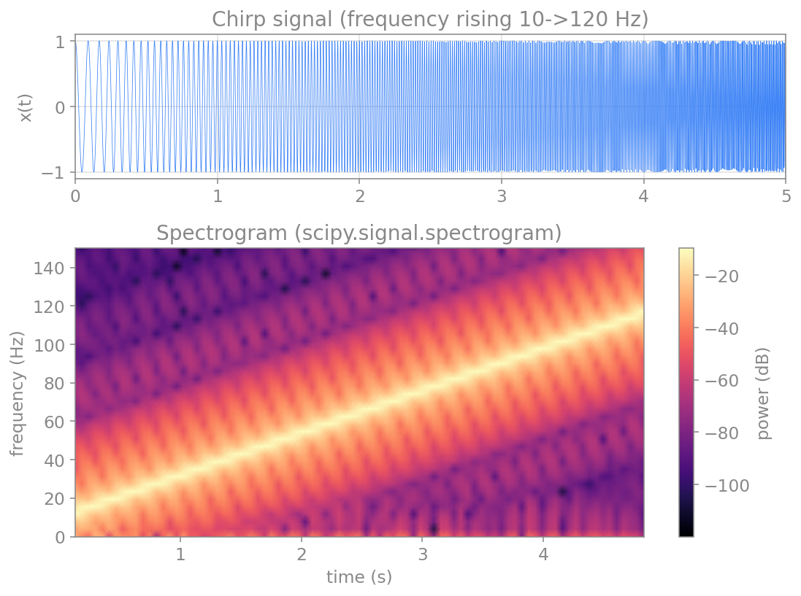
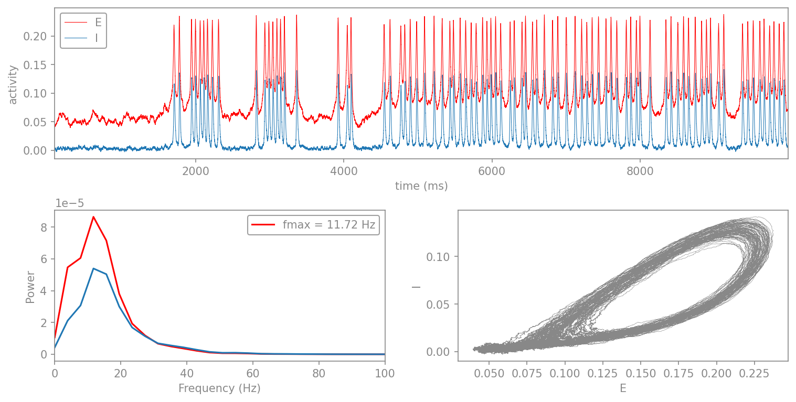
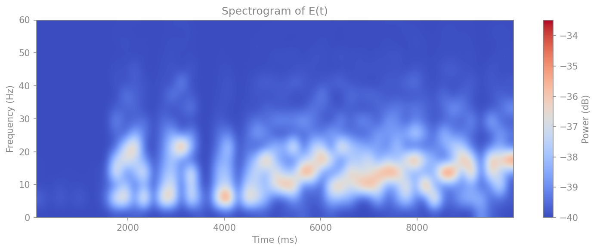
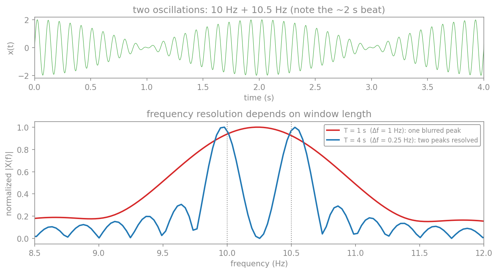
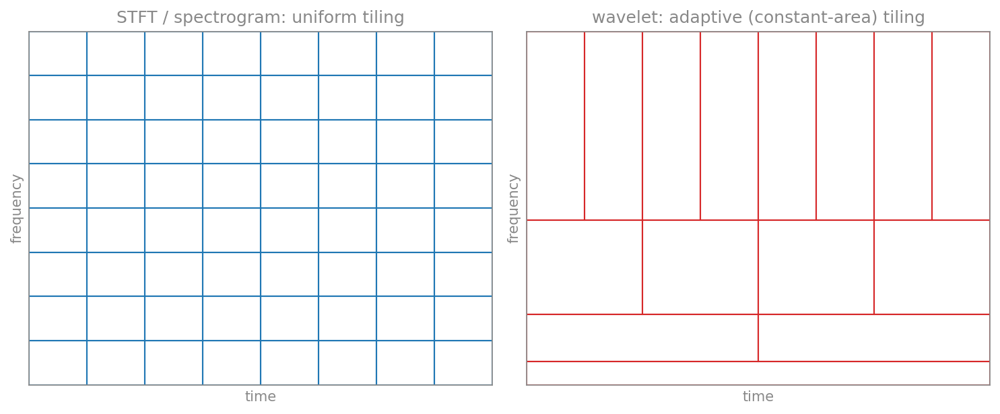
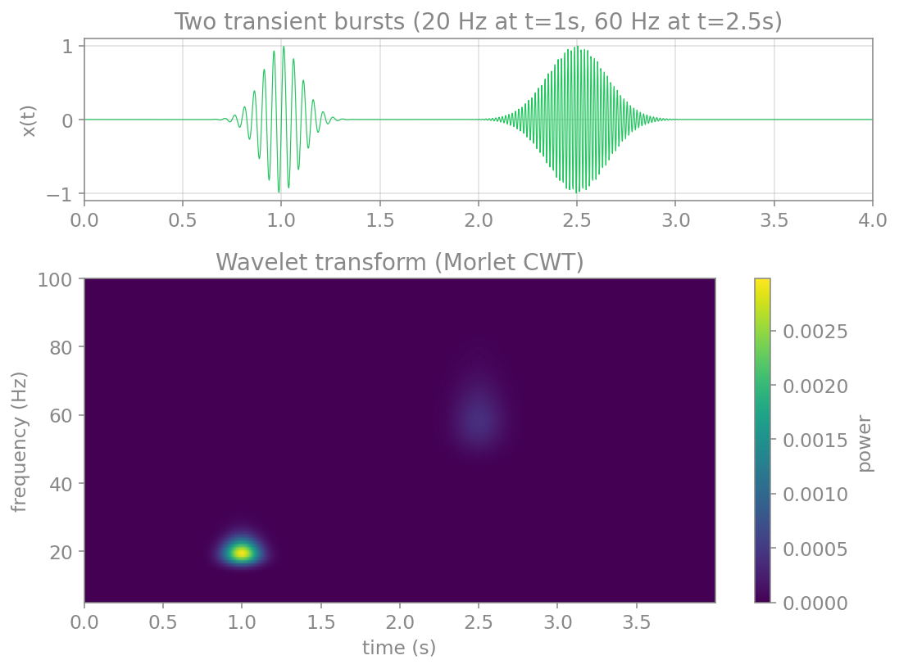

# تحلیل زمان–بسامد

تبدیلِ فوریه که در فصلِ حوزهٔ بسامد ساختیم، یک فرضِ مهم دارد: محتوای بسامدیِ سیگنال در طولِ زمان **ثابت** است. اما بسیاری از سیگنال‌های واقعی **ناایستا** (non-stationary) هستند؛ محتوای بسامدیِ آن‌ها در زمان تغییر می‌کند. برای مثال، در یک تشنج صرعی، ریتمِ غالبِ مغز در طولِ زمان جابه‌جا می‌شود؛ یا در یک تکلیفِ شناختی، انفجارهای کوتاهِ گاما در لحظه‌های خاصی رخ می‌دهند. تبدیلِ فوریهٔ کلِ سیگنال تنها میانگینِ این تغییرات را می‌دهد و نمی‌گوید **چه بسامدی در چه زمانی** حاضر بوده است.

برای پاسخ به این پرسش، به ابزارهایی نیاز داریم که هم‌زمان زمان و بسامد را نشان دهند. در این فصل سه ابزار را می‌سازیم: تبدیلِ فوریهٔ پنجره‌ای، طیف‌نگار و تبدیلِ موجک.

## تبدیل فوریهٔ پنجره‌ای

ساده‌ترین ایده برای دنبال‌کردنِ تغییرِ بسامد در زمان این است: به‌جای آنکه تبدیلِ فوریه را روی کلِ سیگنال بگیریم، آن را روی **پنجره‌های زمانیِ کوتاه** بگیریم. سیگنال را به قطعه‌های کوتاهِ (احتمالاً هم‌پوشان) می‌شکنیم، تبدیلِ فوریهٔ هر قطعه را جداگانه حساب می‌کنیم، و چون هر قطعه به یک بازهٔ زمانیِ مشخص تعلق دارد، می‌فهمیم که هر بسامد در چه زمانی حاضر بوده است. این روش، **تبدیلِ فوریهٔ زمان‌کوتاه** (Short-Time Fourier Transform، به‌اختصار STFT) یا تبدیلِ فوریهٔ پنجره‌ای نام دارد.

به‌بیانِ ریاضی، در هر زمانِ مرکزیِ $\tau$، سیگنال را در یک تابعِ پنجرهٔ $w(t-\tau)$ ضرب می‌کنیم (که تنها در همسایگیِ $\tau$ ناصفر است) و سپس تبدیلِ فوریه می‌گیریم:

$$
\text{STFT}(\tau, f) = \int_{-\infty}^{\infty} x(t)\, w(t-\tau)\, e^{-j2\pi f t}\, dt.
$$

نتیجه، تابعی دوبعدی از زمان و بسامد است. نمایشِ توانِ این تابع به‌صورتِ یک نقشهٔ رنگی، همان **طیف‌نگار** است.

## طیف‌نگار

تبدیلِ فوریه یک فرضِ مهم دارد: محتوای بسامدیِ سیگنال در طولِ زمان **ثابت** است. اما بسیاری از سیگنال‌های واقعی **ناایستا** (non-stationary) هستند؛ محتوای بسامدیِ آن‌ها در زمان تغییر می‌کند. برای مثال، در یک تشنج صرعی، ریتمِ غالبِ مغز در طولِ زمان جابه‌جا می‌شود. تبدیلِ فوریهٔ کلِ سیگنال تنها میانگینِ این تغییرات را می‌دهد و نمی‌گوید **چه بسامدی در چه زمانی** حاضر بوده است.

راهِ حل، **طیف‌نگار** (spectrogram) است که بر پایهٔ **تبدیلِ فوریهٔ زمان‌کوتاه** (Short-Time Fourier Transform، به‌اختصار STFT) بنا شده است: سیگنال را به پنجره‌های زمانیِ کوتاهِ هم‌پوشان می‌شکنیم، FFT هر پنجره را حساب می‌کنیم، و نتیجه را به‌صورتِ یک نقشهٔ دوبعدیِ زمان–بسامد کنار هم می‌چینیم. تابعِ `scipy.signal.spectrogram` این کار را انجام می‌دهد:

```python
import numpy as np
import matplotlib.pyplot as plt
from scipy import signal as sig

# a chirp: a signal whose frequency rises over time
fs = 1000.0
t = np.arange(0, 5, 1/fs)
x = sig.chirp(t, f0=10, f1=120, t1=5, method="linear")

# compute the spectrogram (STFT)
f, t_spec, Sxx = sig.spectrogram(x, fs, nperseg=256, noverlap=200)

fig, (ax1, ax2) = plt.subplots(2, 1, figsize=(8, 6), height_ratios=[1, 2])
ax1.plot(t, x, color="tab:blue", lw=0.4)
ax1.set_xlim(0, 5); ax1.set_ylabel("x(t)")
ax1.set_title("chirp signal")
mesh = ax2.pcolormesh(t_spec, f, 10*np.log10(Sxx + 1e-12),
                      shading="gouraud", cmap="magma")
ax2.set_ylim(0, 150)
ax2.set_xlabel("time (s)"); ax2.set_ylabel("frequency (Hz)")
ax2.set_title("spectrogram")
fig.colorbar(mesh, ax=ax2, label="power (dB)")
plt.tight_layout()
plt.show()
```

<figure markdown="span">
  
  <figcaption>طیف‌نگارِ یک سیگنالِ «چرپ» که بسامدش با زمان از ۱۰ به ۱۲۰ هرتز افزایش می‌یابد. بالا: سیگنال در حوزهٔ زمان. پایین: نقشهٔ زمان–بسامد، که ستیغِ روشن، افزایشِ بسامد را در طولِ زمان به‌روشنی نشان می‌دهد. تبدیلِ فوریهٔ ساده هرگز نمی‌توانست این تغییرِ زمانی را آشکار کند.</figcaption>
</figure>

طیف‌نگار یک بده‌بستانِ بنیادی دارد: پنجرهٔ کوتاه‌تر، تفکیکِ زمانیِ بهتر اما تفکیکِ بسامدیِ بدتری می‌دهد، و برعکس. این، تجلیِ **اصلِ عدمِ‌قطعیت** در پردازشِ سیگنال است: نمی‌توان هم‌زمان زمان و بسامد را با دقتِ دلخواه دانست.

### مثالِ نوروساینسی: نوسان‌های ویلسون–کوون

سیگنالِ «چرپ» بالا مصنوعی بود؛ حال یک نمونهٔ واقعی‌ترِ نوروساینسی را ببینیم. **مدلِ ویلسون–کوون** (Wilson–Cowan) دینامیکِ دو جمعیتِ نورونیِ **تحریکی** ($E$) و **مهاری** ($I$) را توصیف می‌کند که به‌صورتِ یک حلقهٔ بازخوردی به هم جفت شده‌اند. اینجا مدل را در رژیمی نزدیک به **انشعابِ هاپف** (Hopf bifurcation) تنظیم می‌کنیم: حالتِ سکونِ سامانه پایدار اما **تحریک‌پذیر** است، یعنی درست زیرِ آستانهٔ نوسانِ خودبه‌خودی قرار دارد. در این رژیم، نوفهٔ کوچک هرازگاهی سامانه را به یک **انفجارِ** کوتاهِ نوسانی (burst) می‌اندازد که چند چرخه می‌نوسد و سپس فرومی‌نشیند—ریتم‌هایی که **پدیدار و ناپدید** می‌شوند، درست مانندِ بسیاری از نوسان‌های گذرای مغزی. حاصل، سیگنالی به‌شدت **ناایستا** است که محتوای بسامدیش در طولِ زمان می‌آید و می‌رود؛ نمونهٔ آرمانی برای طیف‌نگار.

برای شبیه‌سازی از بستهٔ **vbi** (Virtual Brain Inference) بهره می‌گیریم که پیاده‌سازیِ کارآمدی (مبتنی بر numba) از مدلِ ویلسون–کوون دارد و معادلهٔ تصادفی را با روشِ **هیون** (Heun) انتگرال می‌گیرد. این پیاده‌سازی از فرمِ کاملِ ویلسون–کوون با جملهٔ **تابیدگی** (refractoriness) بهره می‌برد. نخست بسته را نصب می‌کنیم:

```python
pip install vbi
```

سپس مدل را وارد می‌کنیم و پارامترها را تعیین می‌کنیم. در پارامترهای زیر، چون جفت‌شدگیِ سراسری صفر است ($g_e=0$)، ماتریسِ `weights` بی‌اثر می‌ماند و عملاً یک **گرهِ تنها** داریم؛ راندهٔ تحریکی $P=1.02$ درست **زیرِ آستانهٔ نوسان** قرار دارد (در این مدل، نوسانِ خودبه‌خودی نزدیکِ $P \approx 1.05$ آغاز می‌شود)، و نوفهٔ کوچک ($\text{noise\_amp}=0.0009$) انفجارها را برمی‌انگیزد. سپس مدل را اجرا می‌کنیم، طیفِ توان را با روشِ **ولچ** می‌گیریم، و سه نما را کنار هم می‌گذاریم: سریِ زمانیِ $E$ و $I$، طیفِ توان، و نمودارِ فازیِ $E$ بر حسبِ $I$.

```python
import numpy as np
import matplotlib.pyplot as plt
from scipy.signal import welch
from vbi.models.numba.wilson_cowan import WC_sde

par = {
    "g_e": 0.0, "seed": 42, "dt": 0.05, "t_end": 10000.0, "t_cut": 101.0,
    "noise_amp": 0.0009,                           # small noise that triggers the bursts
    "decimate": 1, "P": 1.02, "RECORD_EI": "EI",   # P just below the oscillation onset
    "weights": np.array([[0, 1], [1, 0]], dtype=np.float32),
}

sim = WC_sde(par)
sol = sim.run()
t, E, I = sol["t"], sol["E"], sol["I"]

fs = 1/(par["dt"]*par["decimate"]) * 1000      # sampling frequency in Hz
f, P_E = welch(E[:, 0], fs=fs, nperseg=5*1024)
_, P_I = welch(I[:, 0], fs=fs, nperseg=5*1024)
f_max = f[np.argmax(P_E)]                       # dominant frequency of E

fig = plt.figure(constrained_layout=True, figsize=(10, 5))
ax = fig.subplot_mosaic("AA\nBC")
ax['A'].plot(t, E[:, 0], label="E", color="red", lw=0.5)        # vbi returns t in ms
ax['A'].plot(t, I[:, 0], label="I", color="tab:blue", lw=0.5)
ax['A'].set_xlim(0, 10000); ax['A'].set_xlabel("time (ms)")
ax['A'].set_ylabel("activity"); ax['A'].legend()
ax['B'].plot(f, P_E, color="red", lw=1)
ax['B'].plot(f, P_I, color="tab:blue", lw=1)
ax['B'].set_xlim(0, 100); ax['B'].set_xlabel("Frequency (Hz)")
ax['B'].set_ylabel("Power"); ax['B'].legend([f"fmax = {f_max:.2f} Hz"])
ax['C'].plot(E[:, 0], I[:, 0], lw=0.4)
ax['C'].set_xlabel("E"); ax['C'].set_ylabel("I")
plt.show()
```

<figure markdown="span">
  
  <figcaption>برآیندِ شبیه‌سازیِ ویلسون–کوون در رژیمِ تحریک‌پذیر. بالا: سریِ زمانیِ جمعیتِ تحریکی (قرمز) و مهاری (آبی)؛ انفجارهای کوتاهِ نوسانی که هرازگاهی پدیدار و سپس ناپدید می‌شوند، روی یک خطِ پایهٔ نوسانیِ کم‌دامنه. پایین‌چپ: طیفِ توان، با قلهٔ اصلی نزدیکِ ۱۲ هرتز. پایین‌راست: نمودارِ فازیِ E بر حسبِ I که یک کانونِ مارپیچیِ نوفه‌ای (noisy spiral focus) را نشان می‌دهد—سامانه گردِ یک نقطهٔ سکونِ پایدار می‌چرخد و نوفه آن را به گردش‌های بزرگ‌ترِ گذرا می‌اندازد.</figcaption>
</figure>

سریِ زمانی الگوی این رژیم را به‌خوبی نشان می‌دهد: خطِ پایه‌ای آرام که هرازگاهی یک انفجارِ نوسانیِ کوتاه روی آن پدیدار می‌شود و پس از چند چرخه فرومی‌نشیند. هر انفجار حولِ بسامدِ ذاتیِ سامانه (نزدیکِ ۱۲ هرتز) می‌نوسد، اما چون پراکنده و گذراست، سیگنال در کل ناایستاست. اکنون طیف‌نگارِ $E(t)$ را می‌کشیم تا ببینیم این انفجارها در نقشهٔ زمان–بسامد چگونه ظاهر می‌شوند. تابعِ زیر طیف‌نگار را با `scipy.signal.spectrogram` محاسبه و با `imshow` رسم می‌کند:

!!! note "نقشِ پارامترِ P: انشعابِ هاپف"
    پارامترِ $P$ (راندهٔ تحریکی) رژیمِ سامانه را تعیین می‌کند. زیرِ یک مقدارِ بحرانی، حالتِ سکون پایدار است و سامانه تنها با تلنگرِ نوفه به انفجارهای گذرا می‌رود (همین رژیمِ این مثال، با $P=1.28$). اگر $P$ را اندکی بالاتر ببرید، سامانه از انشعابِ **هاپف** می‌گذرد و به نوسانِ **پایدار و پیوسته** (چرخهٔ حدی) می‌رسد؛ آن‌گاه طیف‌نگار به‌جای لکه‌های پراکنده، یک باندِ ممتد نشان می‌دهد. تغییرِ این تنها یک پارامتر، گذار از «ریتمِ گذرا» به «ریتمِ پایدار» را آشکار می‌کند.

```python
import numpy as np
import matplotlib.pyplot as plt
from scipy.signal import spectrogram

def plot_spectrogram(E_dev, time_ms, fs, cmap="coolwarm"):
    """Compute and plot the spectrogram of a signal (time_ms in milliseconds)."""
    nperseg = 5 * 1024
    noverlap = nperseg // 4
    if nperseg > len(E_dev):                    # guard for short signals
        nperseg = len(E_dev) // 2
        noverlap = nperseg // 2

    f_spec, t_spec, Sxx = spectrogram(
        E_dev, fs=fs, nperseg=nperseg, noverlap=noverlap,
        scaling="density", mode="psd")

    Pxx_db = 10 * np.log10(Sxx + 1e-4)          # to dB, with offset to avoid log(0)

    plt.figure(figsize=(10, 4))
    plt.imshow(
        Pxx_db, aspect="auto", origin="lower",
        extent=[time_ms[0], time_ms[-1], f_spec[0], f_spec[-1]],
        cmap=cmap, interpolation="bicubic")
    plt.ylabel("Frequency (Hz)")
    plt.xlabel("Time (ms)")
    plt.title("Spectrogram of E(t)")
    plt.colorbar(label="Power (dB)")
    plt.ylim(0, 60)
    plt.tight_layout()
    plt.show()

plot_spectrogram(E[:, 0], t, fs)
```

<figure markdown="span">
  
  <figcaption>طیف‌نگارِ فعالیتِ جمعیتِ تحریکیِ E(t) در رژیمِ تحریک‌پذیر. به‌جای یک باندِ ممتد، لکه‌های پراکندهٔ توان نزدیکِ ۱۰ تا ۲۰ هرتز دیده می‌شوند که **پدیدار و ناپدید** می‌شوند—هر لکه متناظرِ یک انفجارِ نوسانیِ گذراست. این، دقیقاً همان نوع تصویری است که یک تبدیلِ فوریهٔ ساده از کلِ سیگنال هرگز نمی‌توانست بدهد.</figcaption>
</figure>

!!! note "چرا اینجا طیف‌نگار؟"
    اگر تنها یک تبدیلِ فوریه از کلِ سیگنالِ ویلسون–کوون می‌گرفتیم، یک طیفِ توانِ ثابت می‌دیدیم و از تغییراتِ زمانیِ شدت بی‌خبر می‌ماندیم. طیف‌نگار همین تغییراتِ زمان–بسامد را آشکار می‌کند—و دقیقاً همین نگاه است که برای ریتم‌های مغزیِ واقعی، که نه کاملاً ایستا و نه تک‌بسامدی‌اند، ضروری می‌شود. (برای زیباییِ بیشتر در حالتِ تاریک، می‌توانید نقشهٔ رنگِ `magma` یا `viridis` را جایگزینِ `coolwarm` کنید.)

## تفکیکِ بسامدی: بسامدِ یک نوسان را چقدر دقیق می‌توان دانست؟

در بسیاری از مطالعاتِ نوسان‌های مغزی، می‌خواهیم بسامدِ **دقیقِ** یک نوسان را بدانیم: قلهٔ آلفای این فرد در ۹٫۵ هرتز است یا ۱۰٫۵ هرتز؟ آیا این یک ریتمِ تنهاست یا دو ریتمِ نزدیک به هم؟ آنچه این دقت را محدود می‌کند، **تفکیکِ بسامدیِ** (frequency resolution) تحلیل است.

برای یک FFT روی $N$ نمونه با بسامدِ نمونه‌برداریِ $f_s$ (یعنی طولِ زمانیِ $T = N/f_s$)، تفکیکِ بسامدی برابر است با:

$$
\Delta f = \frac{f_s}{N} = \frac{1}{T}.
$$

یعنی **تفکیکِ بسامدی برابرِ یک‌تقسیم‌بر طولِ مشاهده است.** دو مؤلفهٔ بسامدی که فاصله‌شان از $\Delta f$ کمتر باشد، در یک قله ادغام می‌شوند و قابلِ تفکیک نیستند. این، **معیارِ ریلی** (Rayleigh criterion) است: برای جداکردنِ دو نوسان که $\delta f$ از هم فاصله دارند، به پنجره‌ای دستِ‌کم به طولِ $T \approx 1/\delta f$ نیاز داریم.

بیایید این را با دو نوسانِ نزدیک به هم—۱۰ و ۱۰٫۵ هرتز—ببینیم. فاصلهٔ آن‌ها $\delta f = 0.5$ هرتز است، پس برای تفکیکشان به $T \ge 1/0.5 = 2$ ثانیه نیاز داریم:

```python
import numpy as np

fs = 500.0
t = np.arange(0, 8, 1/fs)
x = np.sin(2*np.pi*10.0*t) + np.sin(2*np.pi*10.5*t)   # 10 Hz + 10.5 Hz

for T in (1.0, 4.0):
    seg = x[:int(T*fs)]
    df = fs/len(seg)                 # frequency resolution = fs/N = 1/T
    print(f"T = {T} s  ->  df = {df:.2f} Hz")
# T = 1 s -> df = 1.00 Hz  (10 and 10.5 Hz merge into one peak)
# T = 4 s -> df = 0.25 Hz  (two peaks clearly resolved)
```

<figure markdown="span">
  
  <figcaption>تفکیکِ بسامدی به طولِ پنجره بستگی دارد. بالا: سیگنالی از دو نوسانِ ۱۰ و ۱۰٫۵ هرتزی (زنشِ ~۲ ثانیه‌ایِ ناشی از فاصلهٔ ۰٫۵ هرتزی دیده می‌شود). پایین: با پنجرهٔ ۱ ثانیه‌ای ($\Delta f = 1$ هرتز، قرمز) دو نوسان در یک قلهٔ پهن می‌آمیزند؛ با پنجرهٔ ۴ ثانیه‌ای ($\Delta f = 0.25$ هرتز، آبی) دو قله به‌روشنی از هم جدا می‌شوند (خط‌چین‌ها روی ۱۰ و ۱۰٫۵ هرتز).</figcaption>
</figure>

این موضوع در عمل بسیار مهم است. برای نمونه، **بسامدِ آلفای فردی** (individual alpha frequency) از فردی به فردِ دیگر فرق می‌کند (تقریباً ۸ تا ۱۳ هرتز) و خود یک نشانگرِ مهم است؛ برای تعیینِ آن با دقتِ ۰٫۲۵ هرتز، به ثبتی دستِ‌کم ۴ ثانیه‌ای نیاز داریم. همین‌طور برای تشخیصِ اینکه یک قلهٔ پهن واقعاً یک ریتم است یا دو ریتمِ نزدیک، طولِ کافیِ ثبت تعیین‌کننده است.

!!! warning "صفرپرکردن، تفکیک نمی‌آورد"
    یک سوءتفاهمِ رایج: **صفرپرکردنِ** (zero-padding) سیگنال پیش از FFT، طیف را هموارتر و پرنقطه‌تر نشان می‌دهد، اما تفکیکِ **واقعی** را بهبود نمی‌دهد—تنها میانِ همان قله‌های موجود درون‌یابی می‌کند. تفکیکِ بسامدیِ واقعی فقط با طولانی‌ترکردنِ ثبت ($T$ بزرگ‌تر) بیشتر می‌شود، نه با افزودنِ صفر.

اما اینجا یک تنش پنهان است. پنجرهٔ بلند تفکیکِ بسامدیِ خوبی می‌دهد، اما در عوض فرض می‌کند بسامدِ نوسان در سراسرِ آن پنجره **ثابت** است. اگر بسامد در طولِ زمان جابه‌جا شود (که ریتم‌های مغزی چنین می‌کنند)، پنجرهٔ بلند آن را محو می‌کند. پس نمی‌توان هم‌زمان هم بسامد را دقیق دانست و هم آن را در زمان دقیق مکان‌یابی کرد—و این، دقیقاً همان **اصلِ عدمِ‌قطعیتی** است که در بخشِ بعد به آن می‌پردازیم.

## اصلِ عدمِ‌قطعیت: از گابور تا هایزنبرگ

در طیف‌نگار به یک بده‌بستان برخوردیم: پنجرهٔ کوتاه‌تر، تفکیکِ زمانیِ بهتر اما تفکیکِ بسامدیِ بدتر می‌دهد. این، ضعفِ روشِ ما نیست؛ یک **قضیهٔ بنیادی** است—و جالب آنکه عیناً همان **اصلِ عدمِ‌قطعیتِ هایزنبرگ** در مکانیکِ کوانتومی است. این بخش این پیوند را می‌کاود؛ برای فهمِ بقیهٔ فصل ضروری نیست، اما تصویری ژرف‌تر از چراییِ این بده‌بستان به دست می‌دهد.

### حاصل‌ضربِ زمان–پهنای‌باند

برای هر سیگنال، گستردگیِ زمانیِ $\Delta t$ و گستردگیِ بسامدیِ $\Delta f$ را به‌صورتِ انحرافِ معیارِ توزیع‌های انرژیِ $|x(t)|^2$ و $|X(f)|^2$ تعریف کنیم. آن‌گاه برای **هر** سیگنالی:

$$
\Delta t \cdot \Delta f \ge \frac{1}{4\pi},
$$

یا بر حسبِ بسامدِ زاویه‌ای ($\omega = 2\pi f$): $\Delta t \cdot \Delta\omega \ge \tfrac{1}{2}$. این **حدِ گابور** (Gabor limit) است. هیچ پنجره، هیچ تبدیل و هیچ ترفندی نمی‌تواند از آن فراتر رود: اگر سیگنالی را در زمان فشرده کنید، ناگزیر در بسامد پهن می‌شود.

### چرا این همان اصلِ هایزنبرگ است

در مکانیکِ کوانتومی، تابعِ موجِ یک ذره در مکان، $\psi(x)$، و در تکانه، $\tilde{\psi}(p)$، با یک **تبدیلِ فوریه** به هم مربوط‌اند (با $p = \hbar k$). یعنی مکان و تکانه دقیقاً مانندِ زمان و بسامد، دو متغیرِ **مزدوجِ فوریه‌ای** (Fourier-conjugate) هستند. همان نابرابریِ بالا، با جای‌گذاریِ $\omega \to p/\hbar$، به این تبدیل می‌شود:

$$
\Delta x \cdot \Delta p \ge \frac{\hbar}{2},
$$

که همان اصلِ عدمِ‌قطعیتِ هایزنبرگ است. این دو، **یک قضیهٔ ریاضیِ واحد**اند؛ تنها تفسیرِ فیزیکی (و ثابتِ $\hbar$) فرق می‌کند. هر دو از نابرابریِ **کوشی–شوارتس** برای دو عملگرِ ناجابه‌جاشونده—«ضرب در $t$» و «مشتق‌گیری»—سرچشمه می‌گیرند، که جابه‌جاگرشان همانندِ رابطهٔ بنیادیِ $[\hat{x}, \hat{p}] = i\hbar$ است.

### کمینهٔ عدمِ‌قطعیت: اتمِ گابور و حالتِ همدوس

کدام سیگنال به کمینهٔ این حاصل‌ضرب (تساوی) می‌رسد؟ **گاوسی**. یک سینوسیِ پوشیده در پوشِ گاوسی—که آن را **اتمِ گابور** (Gabor atom) می‌نامند—دقیقاً به $\Delta t \cdot \Delta f = \tfrac{1}{4\pi}$ می‌رسد: فشرده‌ترین ردپای ممکن در صفحهٔ زمان–بسامد. در مکانیکِ کوانتومی، همین بسته‌موج‌های کمینه‌عدم‌قطعیت، همان **حالت‌های همدوس** (coherent states) هستند (حالتِ پایهٔ نوسانگرِ هماهنگ و جابه‌جایی‌هایش). همین، دلیلِ ژرفِ آن است که چرا پنجرهٔ گاوسی—و **موجکِ مورله**، که یک سینوسیِ پوشیده در گاوسی است—بهترین گزینه برای تحلیلِ زمان–بسامد است: درست روی کفِ عدمِ‌قطعیت می‌نشیند.

### صفحهٔ زمان–بسامد همان فضای فاز است

صفحهٔ زمان–بسامد را یک **فضای فاز** (phase space) بدانید. هر «اتمِ» تحلیل، کاشی‌ای از این صفحه را با مساحتِ دستِ‌کم $\tfrac{1}{4\pi}$ اشغال می‌کند؛ می‌توان شکلِ کاشی را تغییر داد، اما هرگز نمی‌توان مساحتش را از این کف کمتر کرد. این، کلِ فصل را در یک تصویر یکپارچه می‌کند:

<figure markdown="span">
  
  <figcaption>کاشی‌کاریِ فضای فازِ زمان–بسامد. چپ: STFT/طیف‌نگار کاشی‌های **یکنواخت** به کار می‌برد—$\Delta t$ و $\Delta f$ همه‌جا یکسان. راست: تبدیلِ موجک کاشی‌های **تطبیقی** دارد—در بسامدِ بالا باریک و بلند (تفکیکِ زمانیِ خوب) و در بسامدِ پایین پهن و کوتاه (تفکیکِ بسامدیِ خوب)—اما مساحتِ همهٔ کاشی‌ها برابر است.</figcaption>
</figure>

پس طیف‌نگار و تبدیلِ موجک، دو راهِ کاشی‌کاریِ یک فضای فازِ واحد، زیرِ یک قیدِ واحدند؛ تفاوتشان تنها در این است که بودجهٔ ثابتِ عدمِ‌قطعیت را **چگونه خرج می‌کنند**. این، انگیزهٔ مستقیمِ تبدیلِ موجک است که در بخشِ بعد می‌سازیم.

## تبدیل موجک

طیف‌نگار یک اندازهٔ پنجرهٔ **ثابت** برای همهٔ بسامدها به کار می‌برد. اما این برای سیگنال‌هایی که هم مؤلفه‌های آهسته و هم تندِ گذرا دارند، آرمانی نیست: پنجرهٔ مناسب برای دیدنِ یک نوسانِ آهسته، برای یک رویدادِ کوتاهِ تند بیش از حد بلند است. **تبدیلِ موجک** (wavelet transform) این مشکل را با استفاده از پنجره‌هایی که اندازه‌شان **با بسامد تطبیق می‌یابد** حل می‌کند: پنجره‌های بلند برای بسامدهای پایین (تفکیکِ بسامدیِ خوب) و پنجره‌های کوتاه برای بسامدهای بالا (تفکیکِ زمانیِ خوب).

ایدهٔ تبدیلِ موجکِ پیوسته این است که سیگنال را با نسخه‌های مقیاس‌خورده و جابه‌جاشدهٔ یک تابعِ پایه به نامِ **موجک** (wavelet) همبستگی می‌دهیم. پرکاربردترین موجک برای تحلیلِ زمان–بسامد، **موجکِ مورله** (Morlet) است: یک موجِ سینوسیِ مختلط که در یک پوشِ گاوسی محصور شده. پیاده‌سازیِ ساده‌ای از آن چنین است:

```python
import numpy as np
import matplotlib.pyplot as plt

def morlet_cwt(x, fs, freqs, w=6.0):
    # continuous wavelet transform with a Morlet wavelet
    dt = 1/fs
    n = len(x)
    cwt = np.zeros((len(freqs), n), dtype=complex)
    for i, f in enumerate(freqs):
        s = w / (2*np.pi*f)                          # scale for this frequency
        t_wav = np.arange(-3*s, 3*s, dt)
        wavelet = np.exp(2j*np.pi*f*t_wav) * np.exp(-t_wav**2 / (2*s**2))
        wavelet = wavelet - np.mean(wavelet)         # zero-mean correction
        cwt[i] = np.convolve(x, wavelet, mode="same") * dt
    return cwt

# a signal with two transient bursts at different frequencies and times
fs = 500.0
t = np.arange(0, 4, 1/fs)
x = np.sin(2*np.pi*20*t) * np.exp(-((t-1.0)**2)/(2*0.1**2))   # 20 Hz at t=1s
x = x + np.sin(2*np.pi*60*t) * np.exp(-((t-2.5)**2)/(2*0.15**2))  # 60 Hz at t=2.5s

freqs = np.linspace(5, 100, 100)
power = np.abs(morlet_cwt(x, fs, freqs))**2

fig, (ax1, ax2) = plt.subplots(2, 1, figsize=(8, 6), height_ratios=[1, 2])
ax1.plot(t, x, color="tab:green", lw=0.6)
ax1.set_xlim(0, 4); ax1.set_ylabel("x(t)")
ax1.set_title("two transient bursts")
mesh = ax2.pcolormesh(t, freqs, power, shading="gouraud", cmap="viridis")
ax2.set_xlabel("time (s)"); ax2.set_ylabel("frequency (Hz)")
ax2.set_title("wavelet transform (Morlet)")
fig.colorbar(mesh, ax=ax2, label="power")
plt.tight_layout()
plt.show()
```

<figure markdown="span">
  
  <figcaption>تبدیلِ موجکِ مورله برای سیگنالی با دو رویدادِ گذرا: یک نوسانِ ۲۰ هرتزی در t=۱ ثانیه و یک نوسانِ ۶۰ هرتزی در t=۲٫۵ ثانیه. تبدیلِ موجک هر دو رویداد را هم در زمان و هم در بسامد به‌خوبی مکان‌یابی می‌کند. توجه کنید که رویدادِ بسامدِ پایین‌تر در زمان پهن‌تر و رویدادِ بسامدِ بالاتر متمرکزتر است، که نتیجهٔ تطبیقِ اندازهٔ پنجره با بسامد است.</figcaption>
</figure>

تبدیلِ موجک در علوم اعصاب بسیار پرکاربرد است، به‌ویژه برای تحلیلِ نوسان‌های گذرای مغزی (مانندِ دوک‌های خواب یا انفجارهای گاما) که هم در زمان و هم در بسامد محدودند و با تبدیلِ فوریهٔ ساده به‌خوبی دیده نمی‌شوند.


## جمع‌بندی

در این فصل، سه ابزار برای تحلیلِ سیگنال‌های ناایستا ساختیم. **تبدیلِ فوریهٔ پنجره‌ای** ایدهٔ پایه را داد: فوریه را روی پنجره‌های کوتاه بگیریم تا تغییرِ بسامد در زمان دیده شود. **طیف‌نگار** این ایده را به یک نقشهٔ زمان–بسامد تبدیل کرد، اما با یک بده‌بستانِ ثابت میانِ تفکیکِ زمانی و بسامدی. **تبدیلِ موجک** این بده‌بستان را با پنجره‌هایی که اندازه‌شان با بسامد تطبیق می‌یابد بهبود داد، و برای رویدادهای گذرای مغزی (مانندِ دوک‌های خواب یا انفجارهای گاما) ابزارِ آرمانی است.

با این فصل، جعبه‌ابزارِ پردازشِ سیگنال کامل می‌شود: از مفاهیمِ پایه و نمونه‌برداری، تحلیلِ حوزهٔ زمان، تحلیلِ حوزهٔ بسامد، صافی‌ها، تا تحلیلِ زمان–بسامد.

---

برای مطالعهٔ بیشتر:

<div dir="ltr" markdown>

- Cohen, M.X., 2014. Analyzing Neural Time Series Data: Theory and Practice. MIT Press.
- Mallat, S., 2008. A Wavelet Tour of Signal Processing, 3rd ed. Academic Press.
- Wilson, H.R., Cowan, J.D., 1972. Excitatory and inhibitory interactions in localized populations of model neurons. Biophysical Journal 12(1), 1–24.
- Ziaeemehr, A., et al., 2025. Virtual Brain Inference (VBI): a flexible and integrative toolkit for efficient probabilistic inference on virtual brain models. eLife. Package: <https://github.com/ins-amu/vbi>

</div>
