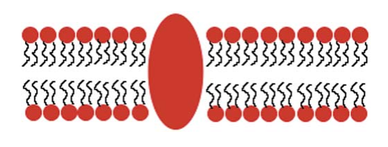
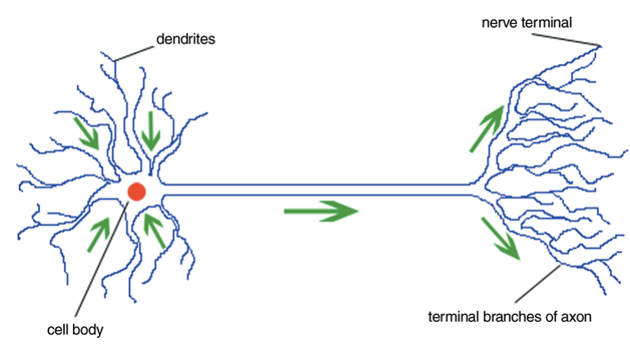
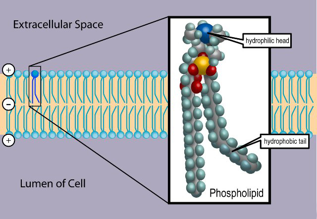

================================================================================
docs/ch01.md
================================================================================
---
description: غشای تحریک‌پذیر نورون — ساختار سلول، کانال‌های یونی، پتانسیل استراحت، معادلهٔ نرنست و معادلهٔ گلدمن، با استخراج گام‌به‌گام.
---

# غشای تحریک‌پذیر

این فصل برای معرفی رسمی و کتابی نظریهٔ عمومی علوم اعصاب نیست، بلکه
یک مقدمهٔ کوتاه دربارهٔ نورون‌هاست که متناسب با فصل‌های بعدی نوشته شده است. فصل‌های بعدی با
مدل‌های مختلف ریاضی که برای توصیف فعالیت‌های عصبی به‌کار برده می‌شوند سر و کار دارند. از آنجا که نورون‌ها
سلول هستند، با معرفی مختصری از سلول‌ها شروع می‌کنیم و پس از آن مدل‌های ریاضی استاندارد انتقال
سیگنال توسط نورون‌ها را معرفی خواهیم کرد.

## ساختار سلول

سلول‌ها واحدهای بنیادین حیات هستند. یک سلول از محلول آبی غلیظی از مواد شیمیایی تشکیل شده است و قادر است خود را با رشد و تقسیم تکثیر کند.
ساده‌ترین شکل حیات تک‌سلولی است، مانند مخمر، آمیب یا یک باکتری. سلول‌هایی که هسته دارند یوکاریوت و سلول‌هایی که هسته ندارند پروکاریوت نامیده می‌شوند. باکتری‌ها پروکاریوت هستند، در حالی که مخمر و آمیب یوکاریوت‌اند. حیوانات موجوداتی چندسلولی با سلول‌های یوکاریوتی هستند. قطر یک سلول نوعی در حدود ۵ تا ۲۰ میکرومتر است (یک میکرومتر برابر است با یک‌میلیونیم متر)، اما یک تخمک ممکن است به اندازهٔ یک میلی‌متر قطر داشته باشد. تخمین زده می‌شود که بدن انسان حدود ۳۰ تریلیون سلول داشته باشد. در یک دسته‌بندی، سلول‌ها بر اساس وظایفی که در بدن دارند مشخص می‌شوند که بسیار متنوع‌اند. با این حال، همهٔ سلول‌های یوکاریوت ساختار اساسی شبیه به هم دارند. همهٔ آن‌ها از یک هسته، اندامک‌ها و مولکول‌های متنوع و یک غشای پلاسمایی تشکیل شده‌اند (گلبول قرمز یک استثناست، زیرا هسته ندارد).

<figure markdown="span">
  
  <figcaption>یک سلول با هسته و تعدادی اندامک</figcaption>
</figure>

DNA،
کد ژنتیکی سلول، از دو رشتهٔ زنجیرهٔ پلیمری با پیکربندی مارپیچ دوگانه، با واحدهای نوکلئوتیدی مکرر
A، C، G و T
تشکیل شده است. هر
A
در یک رشته توسط یک پیوند هیدروژنی به
T
در رشتهٔ
دیگر متصل می‌شود و به‌طور مشابه هر
C
به
G
پیوند
هیدروژنی دارد.
DNA
در کروموزوم‌های هسته بسته‌بندی شده است.
غشای پلاسمایی سلول از یک دولایهٔ لیپیدی تشکیل شده است که در جاهای مختلف آن پروتئین‌هایی قرار گرفته‌اند.

<figure markdown="span">
  
  <figcaption>دو لایهٔ لیپیدی تشکیل‌دهندهٔ غشای سلول</figcaption>
</figure>

سیتوپلاسم بخشی از سلول است که در خارج از هسته و در داخل غشای سلول قرار دارد. هر اندامک یک ساختار مجزا در سیتوپلاسم است که برای انجام یک عملکرد خاص تخصص یافته است. میتوکندری اندامکی غشادار است که از اکسیژن برای تولید انرژی استفاده می‌کند؛ انرژی‌ای که سلول برای انجام وظایف مختلف خود به آن نیاز دارد. شبکهٔ آندوپلاسمی
(ER)
یکی دیگر از اندامک‌های محدود به غشاست که در آن لیپیدها ساخته می‌شوند و پروتئین‌های متصل به غشا تولید می‌شوند. سیتوپلاسم حاوی تعدادی اندامک میتوکندری و
ER
و همچنین اندامک‌های دیگری مانند لیزوزوم است که هضم درون‌سلولی در آن‌ها رخ می‌دهد. ساختارهای دیگری که از پروتئین‌ها تشکیل شده‌اند را می‌توان در سلول یافت، مانند رشته‌های مختلفی که برخی از آن‌ها وظیفهٔ تقویت مکانیکی سلول (اسکلت سلولی یا سیتواسکلتون) را بر عهده دارند. سلول همچنین حاوی مولکول‌های اسید آمینه، که واحدهای سازندهٔ پروتئین‌ها هستند، و بسیاری از مولکول‌های دیگر است.

## سلول‌های عصبی

در بدن انسان سلول‌های متنوعی وجود دارند. این سلول‌ها شامل (۱) انواع سلول‌های ماهیچه‌ای، (۲) انواع سلول‌های حسی نظیر سلول‌های میله‌ای شبکیه و سلول‌های مویی گوش داخلی، (۳) گلبول‌های قرمز و انواع گلبول‌های سفید و (۴) سلول‌های عصبی یا همان نورون‌ها هستند.
وظیفهٔ بنیادی نورون‌ها دریافت، هدایت و انتقال سیگنال است. نورون‌ها سیگنال‌هایی را از اندام‌های حسی به سمت داخل، به سیستم عصبی مرکزی[^1] که شامل مغز و نخاع است، منتقل می‌کنند. در سیستم عصبی مرکزی، سیگنال‌ها توسط مجموعه‌ای از نورون‌ها و مدارهای نورونی تجزیه، تحلیل و تفسیر می‌شوند؛ سپس سیستم نورونی پاسخی به این ورودی تولید می‌کند و پاسخ مجدداً توسط نورون‌ها به سمت بیرون، برای اقدام، به سلول‌های عضلانی و غدد ارسال می‌شود.

نورون‌ها اشکال و اندازه‌های مختلفی دارند، اما همهٔ آن‌ها دارای برخی ویژگی‌های مشترک هستند. یک نورون نوعی از چهار بخش تشکیل شده است: جسم سلولی یا سوما، دندریت‌ها، اکسون، و ترمینال‌های عصبی یا پایانه‌های پیش‌سیناپسی.

<figure markdown="span">
  
  <figcaption>یک سلول عصبی؛ جهت فلش‌ها جهت هدایت سیگنال را نشان می‌دهد.</figcaption>
</figure>

## ساختار فسفولیپیدی

فسفولیپید نوعی از لیپیدهاست که از یک مولکول گلیسرول، دو مولکول اسید چرب و یک مولکول فسفات تشکیل شده است. فسفولیپیدها یک سر آب‌دوست و دو دم آب‌گریز دارند. همین خاصیت دوگانه باعث می‌شود که در محیط آبی به‌طور خودبه‌خود به شکل یک دولایه سامان یابند: سرهای آب‌دوست رو به محلول آبی درون و بیرون سلول و دم‌های آب‌گریز رو به یکدیگر در میانهٔ غشا. این دولایه برای یون‌ها و مولکول‌های آب‌دوست تقریباً نفوذناپذیر است و همین، پایهٔ جداسازی الکتریکی درون سلول از بیرون آن را فراهم می‌کند.

<figure markdown="span">
  
  <figcaption>دو لایهٔ فسفولیپیدی</figcaption>
</figure>

<figure markdown="span">
  
  <figcaption>دو لایهٔ فسفولیپیدی با مؤلفه‌های مختلف</figcaption>
</figure>

## کانال‌های یونی

کانال یونی گروهی از پروتئین‌های تراغشایی غشای سلول هستند که معمولاً نسبت به بعضی یون‌ها مثل سدیم، پتاسیم، کلسیم و کلر بسیار گزینشی رفتار می‌کنند. چون دولایهٔ لیپیدی به‌تنهایی نسبت به یون‌ها نفوذناپذیر است، این کانال‌ها تنها مسیرهای عبور سریع یون از عرض غشا را فراهم می‌کنند. عبور یون از یک کانال باز یک فرایند غیرفعال است: یون‌ها در جهت شیب الکتروشیمیایی خود حرکت می‌کنند و هیچ انرژی متابولیکی مستقیماً مصرف نمی‌شود.

<figure markdown="span">
  
  <figcaption>نمایی از یک کانال یونی در غشای سلول</figcaption>
</figure>

### باز و بسته شدن کانال‌های یونی

بسیاری از کانال‌های یونی می‌توانند میان دو حالت «باز» و «بسته» جابه‌جا شوند؛ به این فرایند دریچه‌گذاری یا گِیتینگ (gating) گفته می‌شود. در حالت بسته، بخشی از زنجیرهٔ پروتئینی مانند دروازه‌ای مسیر عبور یون را می‌بندد، و یک محرک مشخص باعث تغییر شکل (تغییر کنفورماسیون) پروتئین و باز شدن مسیر می‌شود. کانال‌ها را بر اساس نوع محرکی که آن‌ها را باز یا بسته می‌کند دسته‌بندی می‌کنند:

* **کانال‌های وابسته به ولتاژ:** باز و بسته شدن آن‌ها به اختلاف پتانسیل دو سوی غشا بستگی دارد. این کانال‌ها در تولید و انتشار پتانسیل عمل نقش کلیدی دارند و در فصل‌های بعد، در مدل هاجکین–هاکسلی، با جزئیات بررسی خواهند شد.
* **کانال‌های وابسته به لیگاند:** با اتصال یک مولکول خاص (لیگاند) مانند یک ناقل عصبی به جایگاه گیرنده روی کانال باز می‌شوند. این کانال‌ها پایهٔ انتقال سیناپسی شیمیایی هستند.
* **کانال‌های مکانیکی:** با کشش یا فشار مکانیکی غشا باز می‌شوند و در حس لامسه، شنوایی و تعادل دخیل‌اند.

علاوه بر این کانال‌های دریچه‌دار، دسته‌ای از کانال‌ها به نام **کانال‌های نشتی** وجود دارند که عملاً همیشه باز هستند و عبور پیوستهٔ مقدار کمی یون (به‌ویژه پتاسیم) را در حالت استراحت ممکن می‌سازند. همان‌طور که خواهیم دید، این کانال‌های نشتی نقش تعیین‌کننده‌ای در شکل‌گیری پتانسیل استراحت دارند.

### گزینش یون‌ها

ویژگی برجستهٔ بسیاری از کانال‌های یونی، گزینش‌گری بالای آن‌هاست: یک کانال پتاسیمی می‌تواند یون پتاسیم ($\text{K}^+$) را با سرعت بسیار بالا عبور دهد، اما عبور یون سدیم ($\text{Na}^+$) را تا حدود هزار برابر بیشتر سد می‌کند، با آنکه سدیم کوچک‌تر است. این رفتار در نگاه اول متناقض به نظر می‌رسد و توضیح آن در ساختار بخشی از کانال به نام **فیلتر گزینشگر** نهفته است.

هر یون در محلول آبی با پوسته‌ای از مولکول‌های آب احاطه شده است (هیدراته شده است). برای عبور از فیلتر گزینشگر، یون باید این پوستهٔ آبی را از دست بدهد، که خود مستلزم صرف انرژی است. در فیلتر کانال پتاسیمی، اتم‌های اکسیژن کربونیلِ زنجیرهٔ پروتئینی طوری آرایش یافته‌اند که فاصله‌شان دقیقاً با اندازهٔ یون پتاسیمِ بدون آب جور است؛ بنابراین این اکسیژن‌ها جای مولکول‌های آب را می‌گیرند و هزینهٔ آب‌زدایی پتاسیم را جبران می‌کنند. یون سدیم کوچک‌تر است و در همان آرایش نمی‌تواند به‌خوبی با اکسیژن‌ها تماس برقرار کند، در نتیجه هزینهٔ آب‌زدایی آن جبران نمی‌شود و عبورش پرهزینه و کند می‌ماند. به این ترتیب گزینش‌گری نه صرفاً بر پایهٔ اندازهٔ منفذ، بلکه بر پایهٔ توازن دقیق میان انرژی آب‌زدایی و برهم‌کنش یون با دیوارهٔ فیلتر استوار است.

## ترکیب یونی داخل و خارج سلول

غلظت یون‌ها در دو سوی غشای سلول یکسان نیست؛ این تفاوت غلظت، که شیب غلظتی نامیده می‌شود، نیروی محرکهٔ اصلی همهٔ پدیده‌های الکتریکی نورون است. به‌طور کلی غلظت پتاسیم در درون سلول بسیار بیشتر از بیرون، و غلظت سدیم، کلر و کلسیم در بیرون بسیار بیشتر از درون است. این عدم تعادل توسط پمپ‌های فعال غشا، به‌ویژه پمپ سدیم–پتاسیم، که با مصرف انرژی یون‌ها را خلاف شیب غلظتی‌شان جابه‌جا می‌کند، برقرار و نگه‌داشته می‌شود.

جدول زیر مقادیر نمونه‌وار غلظت یون‌های اصلی را در یک نورون پستانداران (برحسب میلی‌مولار) نشان می‌دهد. این اعداد تقریبی‌اند و میان منابع و میان سلول‌های مختلف اندکی متفاوت‌اند:

| یون | غلظت بیرون سلول (mM) | غلظت درون سلول (mM) | ظرفیت ($z$) |
|---|---|---|---|
| پتاسیم $\text{K}^+$ | ۴ | ۱۴۰ | ‎+۱ |
| سدیم $\text{Na}^+$ | ۱۴۵ | ۱۲ | ‎+۱ |
| کلر $\text{Cl}^-$ | ۱۲۰ | ۴ | ‎−۱ |
| کلسیم $\text{Ca}^{2+}$ | ۱٫۸ | ۱۰⁻⁴ | ‎+۲ |

نکتهٔ شایان توجه دربارهٔ کلسیم آن است که غلظت آزاد آن در درون سلول بسیار ناچیز (در حدّ ۱۰⁻⁴ میلی‌مولار) است؛ همین شیب غلظتی بسیار بزرگ باعث می‌شود که ورود اندکی کلسیم به سلول بتواند به‌عنوان یک پیام درون‌سلولی عمل کند.

## پتانسیل استراحت

اگر دو الکترود را، یکی درون و دیگری بیرون یک نورون که فعالیتی ندارد قرار دهیم، اختلاف پتانسیلی پایدار در حدود ۶۵- تا ۷۰- میلی‌ولت اندازه می‌گیریم؛ یعنی درون سلول نسبت به بیرون منفی است. این اختلاف پتانسیل پایدار را **پتانسیل استراحت** می‌نامیم. قرارداد رایج آن است که پتانسیل غشا را به‌صورت اختلاف پتانسیل درون منهای بیرون تعریف کنیم:

$$
V_m = \phi_{\text{in}} - \phi_{\text{out}}
$$

پرسش این است که چنین اختلاف پتانسیلی از کجا می‌آید. پاسخ، ترکیبی از دو عامل است: شیب غلظتی یون‌ها و نفوذپذیری گزینشی غشا نسبت به آن‌ها. در حالت استراحت، غشا عمدتاً نسبت به پتاسیم نفوذپذیر است (چون کانال‌های نشتی پتاسیمی باز هستند). پتاسیم در جهت شیب غلظتی خود از درون به بیرون نشت می‌کند و چون بار مثبت با خود می‌برد، درون سلول را اندک‌اندک منفی‌تر می‌کند. این منفی‌شدن، خود نیرویی الکتریکی پدید می‌آورد که پتاسیمِ مثبت را به درون بازمی‌گرداند. در نقطه‌ای که این دو نیرو — کشش غلظتی به بیرون و کشش الکتریکی به درون — یکدیگر را خنثی کنند، شار خالص پتاسیم صفر می‌شود و پتانسیل به تعادل می‌رسد. این پتانسیلِ تعادل برای هر یون را می‌توان به‌دقت با **معادلهٔ نرنست** محاسبه کرد.

دو نکتهٔ تکمیلی: نخست آنکه غشا کاملاً نسبت به سدیم نفوذناپذیر نیست؛ نشت اندک سدیم به درون باعث می‌شود پتانسیل استراحت کمی مثبت‌تر از پتانسیل تعادل پتاسیم باشد. دوم آنکه نشت پیوستهٔ پتاسیم به بیرون و سدیم به درون در درازمدت شیب غلظتی را از بین می‌برد؛ پمپ سدیم–پتاسیم با مصرف ATP و جابه‌جایی سه یون سدیم به بیرون در ازای دو یون پتاسیم به درون، این شیب‌ها را پیوسته بازسازی می‌کند و پایداری پتانسیل استراحت را تضمین می‌نماید.

## معادلهٔ نرنست

معادلهٔ نرنست پتانسیلِ تعادلِ یک یون منفرد را، یعنی پتانسیل غشایی که در آن شار خالصِ آن یون صفر می‌شود، بر حسب نسبت غلظت‌های دو سوی غشا می‌دهد. برای یون $X$ با ظرفیت $z$:

$$
E_X = \frac{RT}{zF}\,\ln\frac{[X]_{\text{out}}}{[X]_{\text{in}}}
$$

در این رابطه $R$ ثابت جهانی گازها ($8.314\ \mathrm{J\,K^{-1}\,mol^{-1}}$)، $T$ دمای مطلق بر حسب کلوین، $F$ ثابت فارادی ($96485\ \mathrm{C\,mol^{-1}}$) و $z$ ظرفیت (بار) یون است. $E_X$ را پتانسیل نرنست یا پتانسیل تعادل یون $X$ می‌نامند.

### اشتقاق معادلهٔ نرنست

دو نیرو بر یک یون در عرض غشا وارد می‌شوند: نیروی انتشار، که یون را از غلظت زیاد به سمت غلظت کم می‌راند، و نیروی الکتریکی، که ناشی از میدان الکتریکیِ حاصل از اختلاف پتانسیل غشاست. شار مولیِ یون $X$ از مجموع این دو سهم به‌دست می‌آید؛ این همان معادلهٔ نرنست–پلانک است:

$$
J = -D\left(\frac{dc}{dx} + \frac{zF}{RT}\,c\,\frac{d\phi}{dx}\right)
$$

که در آن $c$ غلظت یون، $D$ ضریب انتشار، $\phi$ پتانسیل الکتریکی و $x$ مختصات عرض غشاست. جملهٔ نخست، انتشار (قانون فیک) و جملهٔ دوم، رانش الکتریکی است که در آن از رابطهٔ اینشتین میان تحرک‌پذیری و ضریب انتشار استفاده شده است.

در حالت تعادل، شار خالص یون صفر است، یعنی $J = 0$. پس:

$$
\frac{dc}{dx} = -\frac{zF}{RT}\,c\,\frac{d\phi}{dx}
$$

با تقسیم دو طرف بر $c$ و جداسازی متغیرها:

$$
\frac{1}{c}\,dc = -\frac{zF}{RT}\,d\phi
$$

اکنون از درون سلول تا بیرون آن انتگرال می‌گیریم:

$$
\int_{\text{in}}^{\text{out}}\frac{dc}{c} = -\frac{zF}{RT}\int_{\text{in}}^{\text{out}} d\phi
$$

که نتیجه می‌دهد:

$$
\ln\frac{c_{\text{out}}}{c_{\text{in}}} = -\frac{zF}{RT}\left(\phi_{\text{out}} - \phi_{\text{in}}\right) = \frac{zF}{RT}\left(\phi_{\text{in}} - \phi_{\text{out}}\right)
$$

با توجه به اینکه در تعادل $\phi_{\text{in}} - \phi_{\text{out}} = E_X$ است، با مرتب‌کردن رابطهٔ بالا به معادلهٔ نرنست می‌رسیم:

$$
E_X = \frac{RT}{zF}\,\ln\frac{[X]_{\text{out}}}{[X]_{\text{in}}}
$$

در دمای بدن ($T = 310\ \mathrm{K}$) و با تبدیل لگاریتم طبیعی به لگاریتم در پایهٔ ۱۰ (ضرب در $\ln 10 \approx 2.303$)، ضریب $\frac{RT}{F}\ln 10$ تقریباً برابر ۶۱٫۵ میلی‌ولت می‌شود. بنابراین یک شکل کاربردی و پرکاربردِ معادله چنین است:

$$
E_X \approx \frac{61.5}{z}\,\log_{10}\frac{[X]_{\text{out}}}{[X]_{\text{in}}}\quad(\text{mV})
$$

با جای‌گذاری مقادیر جدول غلظت در این رابطه، پتانسیل تعادل یون‌های اصلی به‌دست می‌آید:

| یون | پتانسیل تعادل $E_X$ |
|---|---|
| پتاسیم $\text{K}^+$ | حدود ۹۵− میلی‌ولت |
| سدیم $\text{Na}^+$ | حدود ۶۷+ میلی‌ولت |
| کلر $\text{Cl}^-$ | حدود ۹۱− میلی‌ولت |
| کلسیم $\text{Ca}^{2+}$ | حدود ۱۳۱+ میلی‌ولت |

دیده می‌شود که پتانسیل استراحت نوعی (حدود ۷۰− میلی‌ولت) بسیار به پتانسیل تعادل پتاسیم نزدیک است؛ و این دقیقاً همان چیزی است که از غلبهٔ نفوذپذیری پتاسیم در حالت استراحت انتظار داریم.

## معادلهٔ گلدمن

معادلهٔ نرنست تنها برای یک یون منفرد و در حالت تعادل آن یون معتبر است. اما غشای واقعی هم‌زمان نسبت به چند یون نفوذپذیر است و پتانسیل استراحت، حاصل سهم همهٔ آن‌هاست. **معادلهٔ گلدمن–هاجکین–کاتز** (که اغلب به‌اختصار معادلهٔ گلدمن نامیده می‌شود) پتانسیل غشا را در حالتی که شار خالصِ کلِ بارها صفر است، بر حسب غلظت و نفوذپذیری هر یون می‌دهد. برای سه یون اصلیِ سدیم، پتاسیم و کلر:

$$
V_m = \frac{RT}{F}\,\ln\frac{P_{\text{K}}[\text{K}^+]_{\text{out}} + P_{\text{Na}}[\text{Na}^+]_{\text{out}} + P_{\text{Cl}}[\text{Cl}^-]_{\text{in}}}{P_{\text{K}}[\text{K}^+]_{\text{in}} + P_{\text{Na}}[\text{Na}^+]_{\text{in}} + P_{\text{Cl}}[\text{Cl}^-]_{\text{out}}}
$$

که در آن $P_{\text{K}}$، $P_{\text{Na}}$ و $P_{\text{Cl}}$ نفوذپذیری نسبی غشا نسبت به هر یون هستند. توجه کنید که جای غلظت‌های درون و بیرونِ کلر نسبت به یون‌های مثبت جابه‌جا شده است؛ این جابه‌جایی به دلیل بار منفی کلر ($z = -1$) است.

نکات کلیدی دربارهٔ این معادله:

* اگر غشا تنها نسبت به یک یون نفوذپذیر باشد (مثلاً $P_{\text{Na}} = P_{\text{Cl}} = 0$)، معادلهٔ گلدمن دقیقاً به معادلهٔ نرنستِ همان یون فرومی‌کاهد. به این معنا، معادلهٔ گلدمن تعمیمِ معادلهٔ نرنست برای چند یون است.
* وزن هر یون در تعیین پتانسیل غشا با نفوذپذیری آن یون متناسب است. در حالت استراحت، چون $P_{\text{K}}$ بسیار بزرگ‌تر از $P_{\text{Na}}$ است (نسبت نوعیِ $P_{\text{K}} : P_{\text{Na}} : P_{\text{Cl}}$ در حدود $1 : 0.04 : 0.45$ است)، پتانسیل غشا به پتانسیل تعادل پتاسیم نزدیک می‌ماند و مقداری در حدود ۷۰− میلی‌ولت به‌دست می‌آید.
* بر خلاف معادلهٔ نرنست، معادلهٔ گلدمن یک پتانسیلِ تعادلِ ترمودینامیکی را توصیف نمی‌کند، بلکه یک حالت پایای دینامیکی است که در آن جمع جبری جریان‌ها صفر است؛ پمپ‌های فعال غشا انرژی لازم برای حفظ این حالت پایا را تأمین می‌کنند.

تغییر ناگهانی نفوذپذیری‌ها — برای مثال افزایش شدید $P_{\text{Na}}$ هنگام باز شدن کانال‌های سدیمی وابسته به ولتاژ — باعث می‌شود وزن سدیم در معادلهٔ گلدمن غالب شود و پتانسیل غشا به سرعت به سمت $E_{\text{Na}}$ مثبت میل کند. همین جابه‌جایی سریع وزن یون‌ها، شالودهٔ پتانسیل عمل است که در فصل بعد و در قالب مدل هاجکین–هاکسلی به آن خواهیم پرداخت.

---

[^1]: CNS