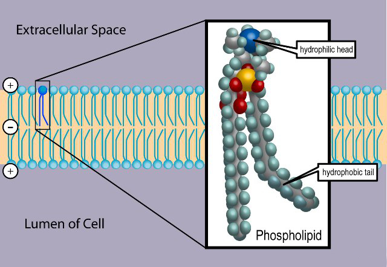

# غشای تحریک‌پذیر

این فصل برای معرفی رسمی و کتابی نظریه عمومی علوم اعصاب نیست بلکه
 یک مقدمه کوتاه در مورد نورون‌ها است که متناسب با فصل‌های بعدی نوشته شده است. فصل‌های بعدی با 
 مدل‌های مختلف ریاضی که برای توصیف فعالیت‌های عصبی بکار برده می‌شود سرو کار دارد. از آنجایی که نورون ها
  سلول هستند، با معرفی مختصری از سلول ها شروع می کنیم و بعد از آن مدل‌های ریاضی استاندارد انتقال 
 سیگنال توسط نورون‌ها را معرفی خواهیم کرد.

## ساختار سلول
سلول‌ها واحدهای بنیادین حیات هستند. یک سلول از محلول آبی غلیظی از مواد شیمیایی تشکیل شده است و قادر است خود را با رشد و تقسیم تکثیر کند.
(
شاید بد نباشه همینجا جدول مقایسه غلطت یون های داخل و خارج سلول رو بذاریم
)
ساده ترین شکل حیات تک سلولی است، مانند مخمر، آمیب یا یک باکتری. سلول‌هایی که هسته دارند یوکاریوت و سلول‌هایی که هسته ندارند پروکاریوت نامیده می‌شوند. باکتری‌ها پروکاریوت هستند در حالی که مخمر و آمیب یوکاریوت هستند. حیوانات موجوداتی چند سلولی با سلول های یوکاریوتی هستند. قطر یک سلول نوعی در حدود ۵-۲۰ میکرومتر است (یک میکرومتر برابر است با یک میلیونیم متر)، اما یک تخمک ممکن است به اندازه یک میلی متر قطر داشته باشد. تخمین زده میشود که بدن انسان حدود حدود ۳۰ تریلیون سلول داشته باشد. در یک دسته بندی سلول ها بر اساس وظایفی که در بدن دارند مشخص می‌شوند که بسیار متنوع هستند. با این حال، همه سلول‌های یوکاریوت ساختار اساسی شبیه به هم دارند. همه آن‌ها از یک هسته، اندامک‌ها و مولکول‌های متنوع و یک غشای پلاسمایی تشکیل شده اند (گلبول قرمز یک استثناست زیرا هسته ندارد).

<figure markdown>
  
  <figcaption>
    یک سلول با هسته و تعدادی اندامک
  </figcaption>
</figure>

DNA،
 کد ژنتیکی سلول، از دو رشته زنجیره پلیمری با پیکربندی مارپیچ دوگانه، با واحدهای نوکلئوتیدی مکرر 
 A، C، G و T
  تشکیل شده است. هر 
  A 
  در یک رشته توسط یک پیوند هیدروژنی به
  T
   در رشته
   دیگر متصل می‌شود و به طور مشابه هر 
   C
    به 
    G
     پیوند
    هیدروژنی دارد.
     DNA
      در کروموزوم‌های هسته بسته بندی شده است.
غشای پلاسمایی سلول از یک دولایه لیپیدی تشکیل شده است که در جاهای مختلف آن پروتئین‌هایی فرار گرفته اند.

<figure markdown>
  
  <figcaption>دو لایه لیپیدی تشکیل دهنده غشا سلول</figcaption>
</figure>

سیتوپلاسم بخشی از سلول است که در خارج از هسته و در داخل غشای سلول قرار دارد. هر اندامک یک ساختار مجزا در سیتوپلاسم است که برای انجام یک عملکرد خاص تخصص دارد. میتوکندری یک اندامک جدا شده از غشاء است که از اکسیژن برای تولید انرژی استفاده می‌کند؛ انرژی که سلول برای انجام وظایف مختلف خود به آن نیاز دارد. شبکه آندوپلاسمی
 (ER) 
 یکی دیگر از اندامک‌های محدود به غشاء است که در آن لیپیدها ترشح می شوند و پروتئین‌های متصل به غشاء ساخته می‌شوند. سیتوپلاسم حاوی تعدادی اندامک میتوکندری و 
 ER
  و همچنین اندامک‌های دیگر مانند لیزوزوم است که هضم درون سلولی در آنها رخ می‌دهد. ساختارهای دیگری که از پروتئین‌ها تشکیل شده‌اند را می‌توان در سلول یافت، مانند رشته‌های مختلفی که برخی از آن‌ها وظیفه تقویت مکانیکی سلول را دارند. سلول همچنین حاوی مولکول‌های اسید آمینه، که واحد‌های سازنده پروتئین‌ها هستند، و بسیاری از مولکول های دیگر است. 

سیتواسکلتون

معادله نرنست

## سلول‌های عصبی
در بدن انسان سلول‌های متنوعی وجود دارند. این سلول‌ها شامل (۱) انواع سلول‌های ماهیچه ‌ای (۲) انواع سلول‌های حسی  نظیر سلول‌های میله‌ای شبکیه و سلولهای مویی گوش داخلی (۳) گلبول‌های قرمر و انواع گلبول‌های سفید و (۴) سلول‌های عصبی یا همان نورون‌ها.
وظیفه بنیادی نورون‌ها دریافت، هدایت و انتقال سیگنال است. نورون‌ها سیگنال‌هایی را از اندام‌های حسی به سمت داخل، به سیستم عصبی مرکزی 
[^1]
 که شامل مغز و نخاع است، منتقل می‌کنند. در سیستم عصبی مرکزی  سیگنال‌ها توسط مجموعه‌ای از نورون‌ها و مدارهای نورونی تجزیه و تحلیل و تفسیر می‌شوند سپس سیستم نورونی پاسخی به این ورودی تولید می‌کند و پاسخ مجدداً توسط نورون‌ها به سمت بیرون برای اقدام به سلول های عضلانی و غدد ارسال می‌شود. 

نورون ها اشکال و اندازه‌های مختلفی دارند، اما همه آن‌ها دارای برخی ویژگی های مشترک هستند. یک نورون نوعی از چهار بخش تشکیل شده است: جسم سلولی یا سوما، دندریت‌ها، اکسون، ترمینال‌های هصبی یا پایانه‌های پیش سیناپسی.
<figure markdown>
  
  <figcaption>
    یک سلول عصبی، جهت فلش‌ها جهت هدایت سیگنال را نشان می‌دهند.
  </figcaption>
</figure>

## ساختار فسفولیپیدی
 فسفولیپید نوعی از لیپیدهاست که از یک مولکول گلیسرول، دو مولکول اسید چرب و یک مولکول فسفات تشکیل شده‌است. فسفولیپیدها یک سر آبدوست و دو دم آب گریز دارند.

## کانال‌های یونی
کانال یونی گروهی از پروتئین تراپوسته‌ای غشای سلول هستند که معمولاً نسبت به بعضی یون‌ها مثل سدیم , پتاسیم, کلسیم, کلر بسیار گزینشی رفتار می‌کنند.

### باز و بسته شدن کانال‌های یونی

### گزینش یون‌ها

## ترکیب یونی داخل و خارج سلول
تفاوت ترکیب یونی در سلول‌های مختلف

[^1]: CNS