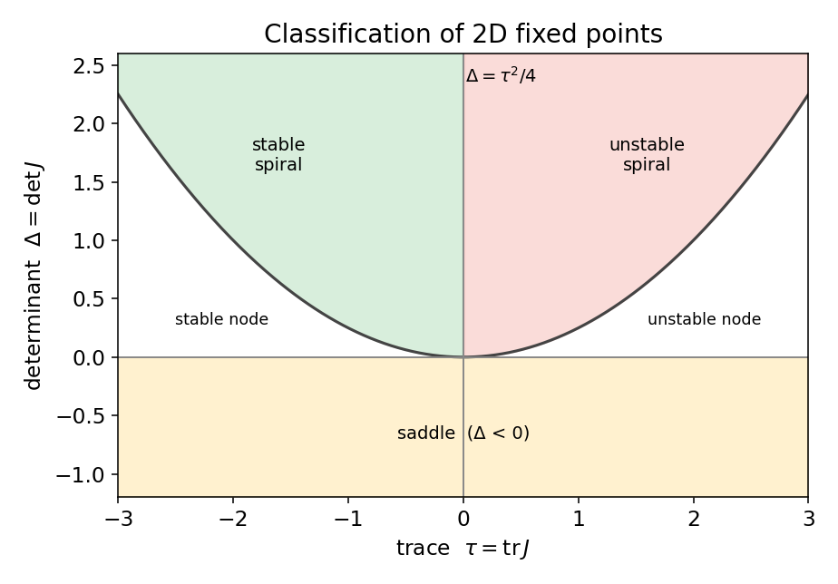
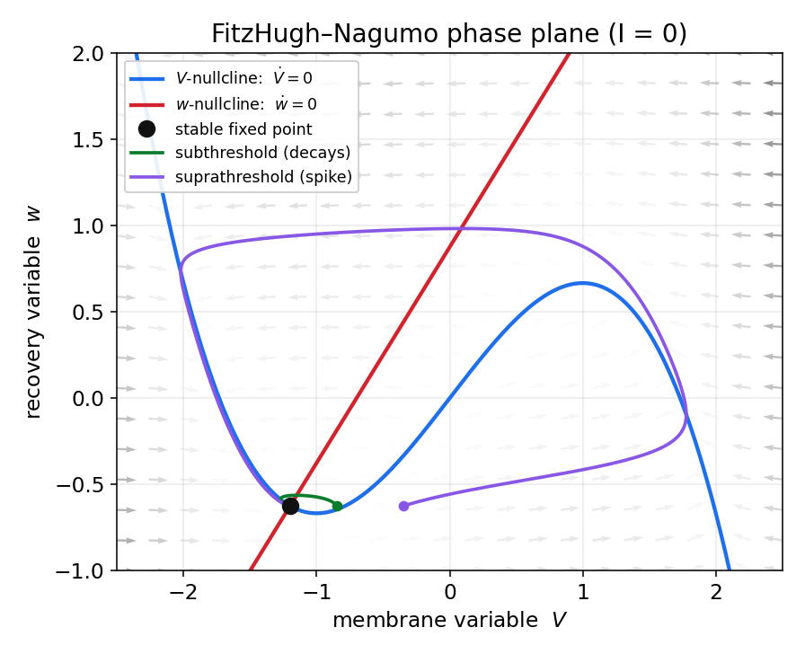
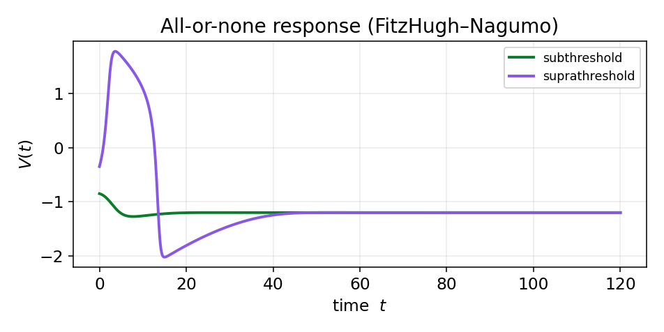
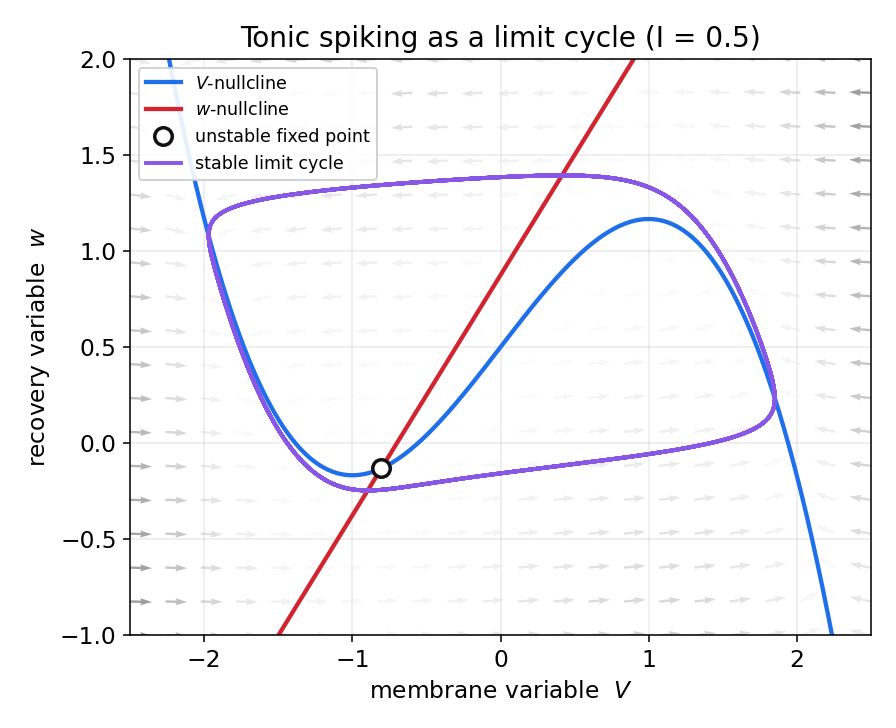
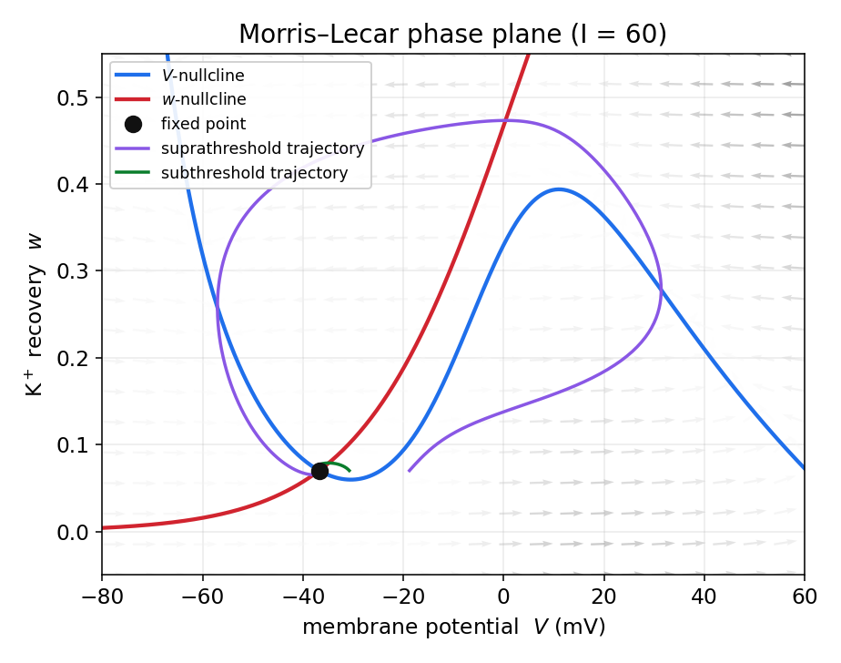

================================================================================
docs/ch02.md
================================================================================
---
description: سیستم‌های دینامیکی در علوم اعصاب — نقاط ثابت، پایداری، صفحهٔ فاز، نول‌کلاین و دوشاخه‌شدن، با مدل‌های فیتزهیو–ناگومو و موریس–لِکار.
---

# سیستم‌های دینامیکی در علوم اعصاب

در فصل پیش دیدیم که پتانسیل غشای نورون از برهم‌کنش جریان‌های یونی پدید می‌آید و در زمان تغییر می‌کند. برای آن‌که این تغییرات را نه به‌زبان کیفی، بلکه به‌زبان ریاضی توصیف و پیش‌بینی کنیم، به چارچوبی نیاز داریم که «تحول یک سامانه در گذر زمان» را مدل کند. آن چارچوب، **نظریهٔ سیستم‌های دینامیکی** است.

این فصل، زبانِ ریاضیِ همهٔ فصل‌های بعد است؛ بنابراین می‌کوشیم آن را محکم و خودبسنده بسازیم. نخست ابزارهای پایه را معرفی می‌کنیم — نقاط ثابت، پایداری، صفحهٔ فاز، نول‌کلاین‌ها و دوشاخه‌شدن — و سپس همین ابزارها را روی دو مدل واقعیِ نورون به کار می‌بندیم: مدل فیتزهیو–ناگومو و مدل موریس–لِکار. در هر دو مورد معادله‌ها را استخراج می‌کنیم، صفحهٔ فاز را رسم می‌کنیم و نشان می‌دهیم تحریک‌پذیری نورون چگونه از هندسهٔ سامانه بیرون می‌آید.

## سیستم دینامیکی چیست؟

یک **سیستم دینامیکی** از دو جزء ساخته می‌شود: متغیرهایی که «حالت» سامانه را مشخص می‌کنند و یک «قانون تحول» که می‌گوید حالت چگونه در زمان تغییر می‌کند. اگر حالِ حاضرِ سامانه آیندهٔ آن را به‌طور یکتا تعیین کند، سامانه را **تعیین‌پذیر** می‌نامیم. نکتهٔ مهمی که در این فصل بارها به آن بازخواهیم گشت این است که تعیین‌پذیری به‌معنای پیش‌بینی‌پذیریِ بلندمدت نیست.

در سامانه‌های **زمان‌پیوسته** قانون تحول یک دستگاه معادلهٔ دیفرانسیل است؛ غشای نورون از این دسته است و تمرکز ما بر همین گونه خواهد بود. در سامانه‌های **زمان‌گسسته**، قانون تحول یک نگاشت تکرارشونده مانند $x_{n+1}=g(x_n)$ است.

## فضای حالت و میدان برداری

حالت سامانه را با بردار $\mathbf{x}=(x_1,\dots,x_m)$ نشان می‌دهیم و فضای همهٔ حالت‌های ممکن را **فضای فاز** می‌نامیم. قانون تحولِ یک سامانهٔ زمان‌پیوستهٔ خودگردان به‌صورت زیر است:

$$
\dot{\mathbf{x}} = \mathbf{f}(\mathbf{x}),
\qquad \dot{x}_i = f_i(x_1,\dots,x_m).
$$

تابع $\mathbf{f}$ به هر نقطه از فضای فاز یک بردار نسبت می‌دهد و یک **میدان برداری** می‌سازد که جهت و سرعت حرکت سامانه را در آن نقطه نشان می‌دهد. واژهٔ «خودگردان» به این معناست که $\mathbf{f}$ صریحاً به زمان وابسته نیست. حل معادله از یک شرط اولیه، منحنی‌ای در فضای فاز می‌سازد که آن را **منحنی فاز** یا مدار می‌نامیم. قضیهٔ وجود و یکتایی تضمین می‌کند که از هر نقطه تنها یک مدار می‌گذرد، پس **منحنی‌های فاز یکدیگر را قطع نمی‌کنند**. مجموعهٔ این منحنی‌ها، **پرترهٔ فاز** را می‌سازد؛ نقشه‌ای که سرنوشت کیفیِ همهٔ حالت‌های ممکن را، بدون حل صریح معادله، نشان می‌دهد.

## نقاط ثابت و پایداری

نقطه‌ای که در آن میدان برداری صفر شود، $\mathbf{f}(\mathbf{x}^*)=\mathbf{0}$، یک **نقطهٔ ثابت** (نقطهٔ تعادل) است. سامانه اگر دقیقاً در آن قرار گیرد برای همیشه می‌ماند. در علوم اعصاب، **حالت استراحت** نورون چیزی جز یک نقطهٔ ثابتِ پویایی غشا نیست. اما پرسش تعیین‌کننده پایداری است: یک نقطهٔ ثابت **پایدار** است اگر هر اختلال کوچک میرا شود و سامانه بازگردد، و **ناپایدار** است اگر اختلال کوچک رشد کند.

در ساده‌ترین حالت، سامانهٔ تک‌بعدی $\dot{x}=f(x)$، معیار پایداری به مشتق فرومی‌کاهد: نقطهٔ ثابت $x^*$ پایدار است اگر $f'(x^*)<0$ و ناپایدار است اگر $f'(x^*)>0$.

### خطی‌سازی و ماتریس ژاکوبین

برای سامانه‌های چندبعدی، رفتار را در همسایگیِ نقطهٔ ثابت **خطی‌سازی** می‌کنیم. با تعریف انحراف کوچک $\delta\mathbf{x}=\mathbf{x}-\mathbf{x}^*$ و بسط تیلور تا مرتبهٔ اول:

$$
\dot{\delta\mathbf{x}} \approx J(\mathbf{x}^*)\,\delta\mathbf{x},
\qquad J_{ij}=\frac{\partial f_i}{\partial x_j}\bigg|_{\mathbf{x}^*}.
$$

ماتریس $J$ همان **ژاکوبینِ** میدان برداری است و سرنوشت اختلال را **مقادیر ویژهٔ** آن تعیین می‌کنند. اگر بخش حقیقیِ همهٔ مقادیر ویژه منفی باشد، تعادل پایدار است؛ اگر دستِ‌کم یکی بخش حقیقیِ مثبت داشته باشد، ناپایدار است. مقادیر ویژهٔ مختلط به نوسانِ میرا یا فزاینده پیرامون تعادل می‌انجامند.

## صفحهٔ فاز و نول‌کلاین‌ها

بیشتر مدل‌های کاربردیِ نورون را می‌توان به دو متغیر فروکاست؛ یکی شبیه ولتاژ غشا و دیگری یک متغیر «بازیابی» کندتر. در این حالت فضای فاز یک صفحه است و ابزار اصلیِ تحلیل، **نول‌کلاین** است.

نول‌کلاین‌ها خط‌ها (یا منحنی‌هایی) هستند که در آن‌ها آهنگ تغییرِ یکی از متغیرها صفر می‌شود. برای سامانهٔ دوبعدیِ $\dot V=f(V,w)$ و $\dot w=g(V,w)$، نول‌کلاینِ $V$ مجموعهٔ نقاطی است که $\dot V=0$ و نول‌کلاینِ $w$ مجموعهٔ نقاطی که $\dot w=0$. روی نول‌کلاینِ $V$ بردار جریان قائم است (فقط $w$ تغییر می‌کند) و روی نول‌کلاینِ $w$ بردار افقی است (فقط $V$ تغییر می‌کند). **محل تقاطع دو نول‌کلاین دقیقاً نقطهٔ ثابت سامانه است**، چون در آنجا هر دو آهنگ صفر می‌شوند. نول‌کلاین‌ها صفحه را به نواحی‌ای تقسیم می‌کنند که در هر یک، جهتِ کلیِ جریان معلوم است؛ همین، ترسیم کیفیِ پرترهٔ فاز را ممکن می‌سازد.

### رده‌بندی نقاط ثابت دوبعدی

برای یک سامانهٔ دوبعدی، رفتار نزدیکِ نقطهٔ ثابت را تنها دو کمیتِ ماتریس ژاکوبین تعیین می‌کنند: رد (مجموع عناصر قطری) $\tau=\operatorname{tr}J$ و دترمینان $\Delta=\det J$. مقادیر ویژه از رابطهٔ $\lambda=\tfrac{1}{2}\big(\tau\pm\sqrt{\tau^2-4\Delta}\big)$ به‌دست می‌آیند، و از روی علامتِ $\tau$ و $\Delta$ می‌توان نوع نقطهٔ ثابت را خواند: اگر $\Delta<0$ نقطه **زینی** است؛ اگر $\Delta>0$ و $\tau<0$ پایدار (گره یا کانون) و اگر $\tau>0$ ناپایدار است؛ سهمیِ $\Delta=\tau^2/4$ مرز میان گره (مقادیر ویژهٔ حقیقی) و کانونِ مارپیچی (مقادیر ویژهٔ مختلط) است.

<figure markdown="span">
  
  <figcaption>رده‌بندی نقاط ثابت یک سامانهٔ دوبعدی بر حسب رد و دترمینان ماتریس ژاکوبین</figcaption>
</figure>

نقطهٔ زینی نقشی محوری در تحریک‌پذیری دارد: شاخهٔ جذب‌کنندهٔ آن مرزی به نام **جداساز** می‌سازد که آستانهٔ شلیک را تعیین می‌کند.

## دوشاخه‌شدن

رفتار نورون به پارامترهایی مانند جریان ورودی بستگی دارد و این پارامترها می‌توانند تغییر کنند. **دوشاخه‌شدن** تغییرِ کیفیِ ناگهانیِ پرترهٔ فاز است که با تغییر آرامِ یک پارامتر رخ می‌دهد. دو سناریوی پرتکرار در نورون‌ها:

* **دوشاخه‌شدن زین–گره:** یک نقطهٔ ثابتِ پایدار و یک زینی به هم می‌رسند و نابود می‌شوند. اگر این رویداد روی یک مدار رخ دهد (دوشاخه‌شدنِ زین–گره روی دایره، SNIC)، شلیک می‌تواند با فرکانسِ نزدیک به صفر آغاز شود؛ این مشخصهٔ **تحریک‌پذیری نوع یک** است.
* **دوشاخه‌شدن هوپف:** یک نقطهٔ ثابتِ پایدار با عبور یک جفت مقدار ویژهٔ مختلط از محور موهومی، پایداری خود را از دست می‌دهد و یک چرخهٔ حدی متولد می‌شود. شلیک در اینجا با فرکانسی غیرصفر و ناگهانی آغاز می‌شود؛ مشخصهٔ **تحریک‌پذیری نوع دو**.

شروعِ شلیک نورون با افزایش جریان ورودی، در زبان دقیق همین دوشاخه‌شدن است؛ جریانی که در آن شلیک آغاز می‌شود، **جریان رئوبیس** نامیده می‌شود.

## مدل فیتزهیو–ناگومو

مدل کامل هاجکین–هاکسلی چهاربعدی است و تحلیل هندسیِ مستقیم آن دشوار است. مدل **فیتزهیو–ناگومو** (FHN) یک فروکاستِ دوبعدی است که جوهرِ تحریک‌پذیری را با کمترین تعداد متغیر نگه می‌دارد. ایدهٔ آن چنین است: ولتاژ غشا متغیری «سریع» با یک بازخوردِ مثبتِ خودبازتولیدکننده است (که با یک جملهٔ غیرخطیِ مکعبی مدل می‌شود)، و فرایندهای بازیابیِ کندتر (مانند غیرفعال‌شدنِ سدیم و فعال‌شدنِ پتاسیم در HH) در یک متغیرِ «کند» به نام $w$ ادغام می‌شوند.

### معادله‌ها و انگیزهٔ زیستی

مدل به‌صورت زیر نوشته می‌شود:

$$
\dot V = V - \frac{V^3}{3} - w + I,
\qquad
\dot w = \varepsilon\,(V + a - b\,w),
$$

که در آن $V$ متغیرِ شبه‌ولتاژ، $w$ متغیر بازیابی، $I$ جریان ورودی و $0<\varepsilon\ll 1$ است؛ کوچک‌بودنِ $\varepsilon$ یعنی $w$ بسیار کندتر از $V$ تغییر می‌کند. مقادیر کلاسیک عبارت‌اند از $a=0.7$، $b=0.8$ و $\varepsilon=0.08$. جملهٔ مکعبیِ $-V^3/3$ همان بازخوردِ بازتولیدکننده‌ای است که برخاستِ سریعِ پتانسیل عمل را ممکن می‌سازد.

### نول‌کلاین‌ها و صفحهٔ فاز

با صفرقراردادنِ آهنگ‌ها، نول‌کلاین‌ها به‌دست می‌آیند. نول‌کلاینِ $V$ یک منحنیِ مکعبیِ $N$-شکل است و نول‌کلاینِ $w$ یک خط راست:

$$
\dot V=0:\quad w = V - \frac{V^3}{3} + I,
\qquad
\dot w=0:\quad w = \frac{V+a}{b}.
$$

تقاطعِ این دو، نقطهٔ ثابتِ سامانه است. برای جریانِ کوچک، تقاطع روی شاخهٔ چپِ منحنیِ مکعبی می‌افتد و نقطهٔ ثابت پایدار است؛ این همان حالتِ استراحت است.

<figure markdown="span">
  
  <figcaption>صفحهٔ فاز مدل فیتزهیو–ناگومو با I=۰. مسیر سبز یک اختلال زیرآستانه است که مستقیم به تعادل بازمی‌گردد؛ مسیر بنفش یک اختلال فراآستانه است که پیش از بازگشت، یک گردشِ بزرگ (پتانسیل عمل) می‌زند.</figcaption>
</figure>

### تحریک‌پذیری: پاسخ همه‌یا‌هیچ

شکل بالا کلِ پدیدهٔ تحریک‌پذیری را نشان می‌دهد. اگر اختلالِ ورودی کوچک باشد، نقطهٔ حالت کمی از تعادل دور می‌شود و چون هنوز در سمت چپِ شاخهٔ میانیِ منحنیِ مکعبی است، مستقیماً به تعادل بازمی‌گردد (مسیر سبز). اما اگر اختلال به‌قدر کافی بزرگ باشد و نقطهٔ حالت را از شاخهٔ میانی (که نقشِ آستانه را بازی می‌کند) عبور دهد، جریانِ سریعِ افقی آن را به شاخهٔ راستِ منحنی (حالتِ دپلاریزه) پرتاب می‌کند؛ سپس متغیرِ کندِ $w$ سامانه را بالا و سرانجام به شاخهٔ چپ بازمی‌گرداند. حاصل، یک گردشِ بزرگ در صفحهٔ فاز است: یک پتانسیل عمل (مسیر بنفش). میان این دو پاسخ، حالتِ میانی وجود ندارد؛ این همان خاصیتِ **همه‌یا‌هیچ** است.

<figure markdown="span">
  
  <figcaption>پاسخ همه‌یا‌هیچ در حوزهٔ زمان: اختلال زیرآستانه تنها افتی کوچک می‌سازد، اما اختلال فراآستانه یک پتانسیل عملِ کامل تولید می‌کند.</figcaption>
</figure>

### شلیک تونیک و چرخهٔ حدی

اگر جریانِ ورودی را به‌طور پیوسته افزایش دهیم، منحنیِ مکعبی بالا می‌رود و نقطهٔ تقاطع به‌سمتِ شاخهٔ میانی جابه‌جا می‌شود. آنجا نقطهٔ ثابت از راهِ یک دوشاخه‌شدنِ هوپف پایداری خود را از دست می‌دهد و یک **چرخهٔ حدیِ پایدار** متولد می‌شود. سامانه دیگر آرام نمی‌گیرد، بلکه پیوسته روی این مدارِ بسته می‌چرخد: نورون به **شلیک تونیک** (منظم و پیاپی) می‌افتد.

<figure markdown="span">
  
  <figcaption>با جریان ورودیِ پایدار (I=۰٫۵)، نقطهٔ ثابت ناپایدار می‌شود و یک چرخهٔ حدیِ پایدار پدید می‌آید؛ این چرخه، شلیک تونیک نورون است.</figcaption>
</figure>

## مدل موریس–لِکار

برخلاف فیتزهیو–ناگومو که انتزاعی و کیفی است، مدل **موریس–لِکار** (ML) یک مدلِ زیست‌فیزیکیِ واقعی است که نخست برای فیبر ماهیچهٔ کشتی‌چسب (barnacle) ارائه شد. این مدل، با حفظِ معنای زیستیِ پارامترها، همچنان دوبعدی و در نتیجه قابل‌تحلیل در صفحهٔ فاز است؛ به همین دلیل پلِ خوبی میان مدل انتزاعیِ FHN و مدل کاملِ هاجکین–هاکسلی است.

### استخراج زیست‌فیزیکی معادله‌ها

نقطهٔ شروع، همان قانون پایستگیِ بار روی غشاست: جریانِ خازنیِ غشا برابر است با جریانِ تزریقی منهای مجموع جریان‌های یونی. در مدل ML سه جریان در نظر گرفته می‌شود: جریانِ کلسیمِ تحریکی، جریانِ پتاسیمِ بازدارنده و یک جریانِ نشتی. هر جریان از قانونِ اهمِ یونی پیروی می‌کند، یعنی متناسب با اختلافِ ولتاژ از پتانسیل تعادلِ همان یون (که در فصل اول با معادلهٔ نرنست به‌دست آوردیم) است:

$$
C\frac{dV}{dt} = I - g_L\,(V-E_L) - g_{\mathrm{Ca}}\,m_\infty(V)\,(V-E_{\mathrm{Ca}}) - g_K\,w\,(V-E_K).
$$

نکتهٔ کلیدیِ فروکاستِ بُعد اینجاست: فعال‌شدنِ کانال کلسیم بسیار سریع است، چنان‌که می‌توان فرض کرد در هر لحظه به مقدار تعادلیِ خود می‌رسد؛ پس به‌جای یک متغیرِ دینامیکی برای آن، تابعِ ایستای $m_\infty(V)$ را می‌نشانیم. تنها متغیرِ دروازه‌ایِ دینامیکی، کسرِ بازبودنِ کانال پتاسیم $w$ است که با آهنگی متناهی به مقدار تعادلیِ خود نزدیک می‌شود:

$$
\frac{dw}{dt} = \phi\,\frac{w_\infty(V) - w}{\tau_w(V)}.
$$

توابعِ فعال‌سازی به‌صورتِ سیگموییدیِ زیر مدل می‌شوند و $\phi$ یک ضریبِ مقیاسِ زمانی است:

$$
m_\infty(V)=\tfrac{1}{2}\!\left[1+\tanh\!\frac{V-V_1}{V_2}\right],\quad
w_\infty(V)=\tfrac{1}{2}\!\left[1+\tanh\!\frac{V-V_3}{V_4}\right],\quad
\tau_w(V)=\frac{1}{\cosh\!\frac{V-V_3}{2V_4}}.
$$

مجموعهٔ پارامترهای به‌کاررفته در شکلِ زیر (که به دوشاخه‌شدنِ هوپف و تحریک‌پذیریِ نوع دو می‌انجامد) چنین است: $C=20$، $g_L=2$، $g_{\mathrm{Ca}}=4.4$، $g_K=8$، $E_L=-60$، $E_{\mathrm{Ca}}=120$، $E_K=-84$ (بر حسب میلی‌ولت)، $V_1=-1.2$، $V_2=18$، $V_3=2$، $V_4=30$ و $\phi=0.04$.

### نول‌کلاین‌ها و صفحهٔ فاز

نول‌کلاین‌ها را مانند پیش با صفرقراردادنِ آهنگ‌ها می‌یابیم. نول‌کلاینِ $V$ یک منحنیِ $N$-شکل و نول‌کلاینِ $w$ همان سیگمویید است:

$$
\dot V=0:\;\; w=\frac{I - g_L(V-E_L) - g_{\mathrm{Ca}}\,m_\infty(V)(V-E_{\mathrm{Ca}})}{g_K\,(V-E_K)},
\qquad
\dot w=0:\;\; w=w_\infty(V).
$$

<figure markdown="span">
  
  <figcaption>صفحهٔ فاز مدل موریس–لِکار. نول‌کلاینِ N-شکلِ ولتاژ و نول‌کلاینِ سیگموییدیِ بازیابی در نقطهٔ ثابت تقاطع می‌کنند؛ مسیر بنفش یک پتانسیل عمل کامل و مسیر سبز یک پاسخ زیرآستانه را نشان می‌دهد.</figcaption>
</figure>

ساختارِ هندسی همانی است که در FHN دیدیم: یک نول‌کلاینِ $N$-شکل برای ولتاژ، یک نول‌کلاینِ یکنوای بازیابی، و تحریک‌پذیری‌ای که از شکلِ این دو منحنی و محلِ تقاطعشان برمی‌خیزد. تفاوت در آن است که اینجا محورها و پارامترها معنای زیست‌فیزیکیِ مستقیم دارند: $V$ بر حسب میلی‌ولت و $w$ کسرِ بازبودنِ کانال پتاسیم است.

### تحریک‌پذیری و انواع آن

زیباییِ مدل موریس–لِکار در آن است که با تغییرِ پارامترها هر دو نوعِ تحریک‌پذیری را بازتولید می‌کند. با مجموعهٔ پارامترهای بالا، از دستِ‌رفتنِ پایداریِ نقطهٔ ثابت از راهِ **دوشاخه‌شدنِ هوپف** رخ می‌دهد و نورون از نوع دو است: شلیک با فرکانسی غیرصفر آغاز می‌شود. با مجموعهٔ دیگری از پارامترها (برای مثال $V_3=12$، $V_4=17.4$، $\phi=0.0667$ و $g_{\mathrm{Ca}}=4$)، دوشاخه‌شدن از نوعِ **زین–گره روی دایره (SNIC)** خواهد بود و نورون از نوع یک می‌شود: فرکانسِ شلیک می‌تواند از نزدیکِ صفر آغاز شود و به‌نرمی با جریان زیاد شود. همین تفاوتِ ظریف در هندسهٔ دوشاخه‌شدن، تعیین می‌کند که نورون به محرک‌ها چگونه پاسخ دهد — موضوعی که پیامدهای مهمی در رمزگذاریِ عصبی دارد.

## جمع‌بندی

در این فصل زبانِ مشترکِ همهٔ مدل‌های بعدی را ساختیم. آموختیم که حالتِ یک نورون نقطه‌ای در فضای فاز است، حالتِ استراحت یک نقطهٔ ثابتِ پایدار، آستانهٔ شلیک یک جداساز یا یک دوشاخه‌شدن، پتانسیل عمل یک گردشِ بزرگ در فضای فاز و شلیکِ تونیک یک چرخهٔ حدیِ پایدار است. دو مدلِ فیتزهیو–ناگومو و موریس–لِکار نشان دادند که چگونه این مفاهیمِ انتزاعی، تحریک‌پذیریِ واقعیِ نورون را توضیح می‌دهند. در گامِ بعد، مدل کاملِ هاجکین–هاکسلی را — که این هر دو از آن برمی‌خیزند — با همین ابزارها بررسی خواهیم کرد.

---
برای مطالعهٔ بیشتر:

- Izhikevich, E.M., 2007. Dynamical systems in neuroscience. MIT press.
- Strogatz, S.H., 2024. Nonlinear dynamics and chaos: with applications to physics, biology, chemistry, and engineering. Chapman and Hall/CRC.

