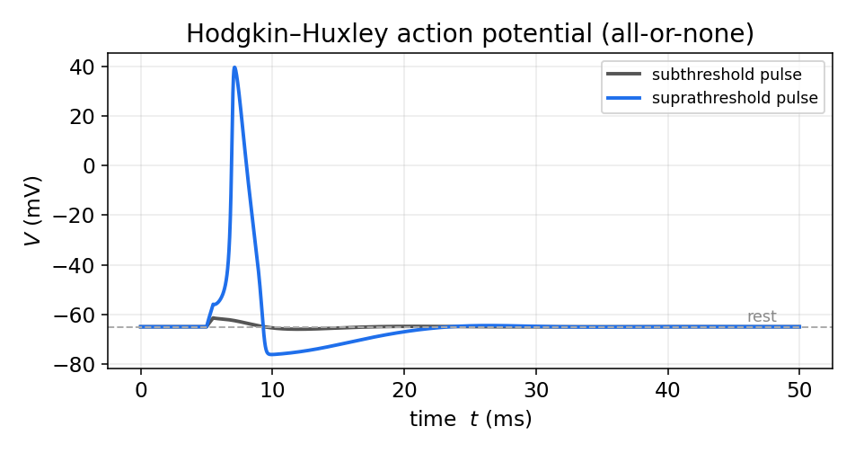
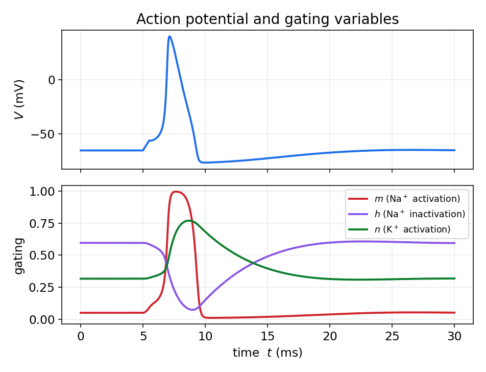
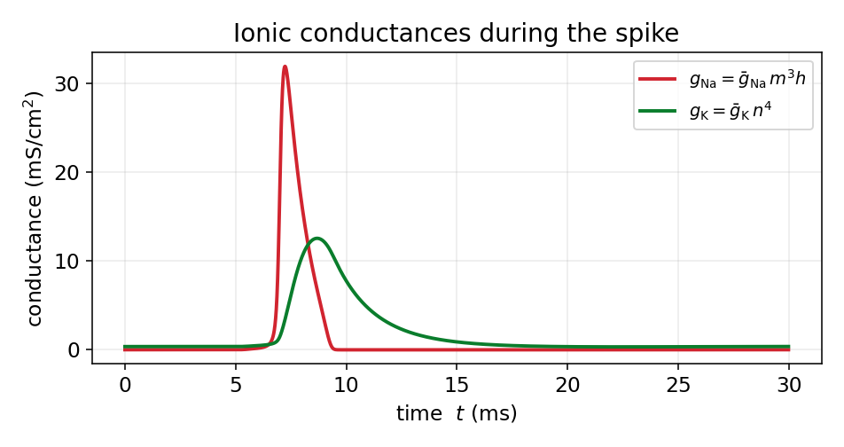
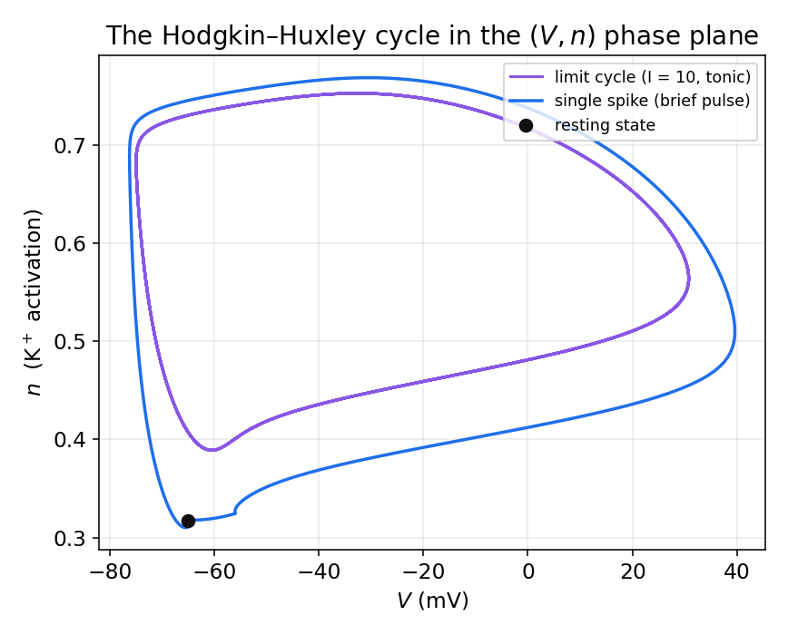
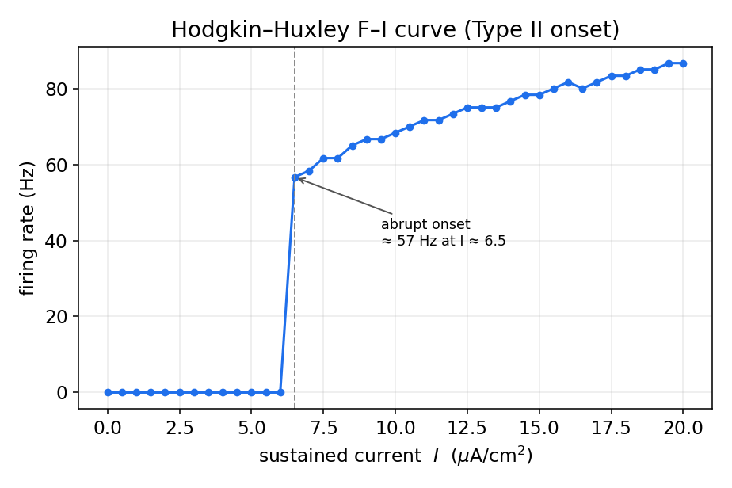

# مدل هاجکین-هاکسلی

در فصل اول دیدیم که غشای نورون یون‌ها را جدا نگه می‌دارد و یک پتانسیل استراحت می‌سازد، و در فصل دوم زبانِ سیستم‌های دینامیکی را آموختیم. اکنون این دو را به هم می‌رسانیم. مدل **هاجکین–هاکسلی** (HH) که در سال ۱۹۵۲ بر پایهٔ آزمایش‌های روی آکسونِ غول‌پیکرِ ماهی مرکب ارائه شد و جایزهٔ نوبل را برای صاحبانش به ارمغان آورد، نخستین توصیفِ کمّی و موفق از پتانسیل عمل است. این فصل جایی است که پیوندِ میان فیزیک و علوم اعصاب عینی و ملموس می‌شود: از قانون پایستگیِ بار و مفهومِ خازن آغاز می‌کنیم، به یک دستگاهِ چهار معادله‌ایِ دیفرانسیل می‌رسیم، و سپس با چند خط کدِ پایتون — که خودمان انتگرال‌گیری اویلر را در آن می‌نویسیم — یک پتانسیل عملِ واقعی می‌سازیم.

## غشا به‌مثابهٔ یک مدار الکتریکی

غشای لیپیدی، که در فصل اول دیدیم نسبت به یون‌ها نفوذناپذیر است، دو صفحهٔ رسانا (محلولِ یونیِ درون و بیرون) را با یک لایهٔ عایق از هم جدا می‌کند؛ این دقیقاً تعریفِ یک **خازن** است. اگر بارِ انباشته بر دو سوی غشا را $Q$ و اختلاف پتانسیل را $V$ بنامیم، رابطهٔ خازن می‌گوید:

$$
Q = C_m\,V,
$$

که در آن $C_m$ ظرفیت خازنیِ غشاست (برای غشای زیستی نوعاً نزدیک به $1\ \mu\mathrm{F/cm^2}$). جریانی که بارِ خازن را تغییر می‌دهد، **جریان خازنی** است؛ با مشتق‌گیری از رابطهٔ بالا:

$$
I_C = \frac{dQ}{dt} = C_m\,\frac{dV}{dt}.
$$

از سوی دیگر، کانال‌های یونی مسیرهایی رسانا در دلِ همین عایق فراهم می‌کنند. پس مدارِ معادلِ غشا یک خازن است که به‌موازاتِ آن، برای هر گونه یون، یک شاخهٔ رسانا قرار دارد. هر شاخه از یک رسانایی و یک منبعِ ولتاژ (باتری) ساخته شده است؛ این باتری همان پتانسیل تعادلِ نرنستِ آن یون است که در فصل اول به‌دست آوردیم.

## معادلهٔ پایهٔ غشا

قانون پایستگیِ بار (قانون جریانِ کیرشهف) می‌گوید مجموعِ جریان‌هایی که به گرهٔ درونِ سلول وارد و خارج می‌شوند صفر است. اگر جریانِ تزریقیِ خارجی را $I$ بگیریم، این جریان یا بارِ خازن را تغییر می‌دهد یا از راهِ کانال‌ها به‌صورتِ جریانِ یونی عبور می‌کند:

$$
I = I_C + I_{\text{ion}} = C_m\,\frac{dV}{dt} + I_{\text{ion}}.
$$

با مرتب‌کردن، معادلهٔ بنیادیِ تحولِ ولتاژ غشا به‌دست می‌آید:

$$
C_m\,\frac{dV}{dt} = I - I_{\text{ion}}.
$$

همهٔ کارِ باقی‌مانده این است که بفهمیم $I_{\text{ion}}$ چیست. این همان نقطه‌ای است که نبوغِ هاجکین و هاکسلی آشکار می‌شود.

## جریان‌های وابسته به رسانایی

هر جریانِ یونی از یک قانونِ اهمِ ساده پیروی می‌کند: جریان متناسب است با رسانایی، ضرب در نیرویِ محرکهٔ الکتریکی. نیرویِ محرکه، فاصلهٔ ولتاژ غشا از پتانسیل تعادلِ همان یون است:

$$
I_{\text{ion}} = g_{\text{ion}}\,(V - E_{\text{ion}}).
$$

این رابطه با شهودِ فصل اول سازگار است: وقتی $V = E_{\text{ion}}$ باشد، جریانِ خالصِ آن یون صفر است — دقیقاً همان پتانسیل تعادلی که از معادلهٔ نرنست آمد. هرچه ولتاژ از تعادل دورتر باشد، نیرویِ محرکه و در نتیجه جریان بزرگ‌تر است.

در مدل HH سه جریان در نظر گرفته می‌شود: سدیم، پتاسیم و یک جریانِ نشتیِ جمع‌بندی‌شده (که عمدتاً کلر و سایر یون‌هاست). پس:

$$
I_{\text{ion}} = g_{\mathrm{Na}}\,(V-E_{\mathrm{Na}}) + g_{\mathrm{K}}\,(V-E_{\mathrm{K}}) + g_L\,(V-E_L).
$$

اگر رسانایی‌ها ثابت بودند، این تنها یک مدارِ خطیِ ساده بود و هرگز پتانسیل عمل تولید نمی‌شد. کشفِ کلیدیِ هاجکین و هاکسلی این بود که **رسانایی‌های سدیم و پتاسیم ثابت نیستند؛ آن‌ها به ولتاژ و به زمان وابسته‌اند.**

## رسانایی‌های متغیر و متغیرهای دروازه‌ای

هاجکین و هاکسلی برای توصیفِ وابستگیِ رسانایی به ولتاژ، مفهومِ **متغیر دروازه‌ای** را معرفی کردند. تصور کنید هر کانال از چند «دروازه» ساخته شده است و تنها وقتی همهٔ دروازه‌ها باز باشند، کانال جریان عبور می‌دهد. اگر $x$ احتمالِ بازبودنِ یک دروازهٔ منفرد باشد، و این دروازه میان دو حالتِ باز و بسته با آهنگ‌های وابسته به ولتاژ جابه‌جا شود، داریم:

$$
\frac{dx}{dt} = \alpha_x(V)\,(1-x) - \beta_x(V)\,x,
$$

که در آن $\alpha_x(V)$ آهنگِ گذار از بسته به باز و $\beta_x(V)$ آهنگِ گذارِ معکوس است. این معادلهٔ خطیِ مرتبهٔ اول را می‌توان به شکلِ گویاتری بازنوشت. اگر تعریف کنیم

$$
x_\infty(V) = \frac{\alpha_x(V)}{\alpha_x(V)+\beta_x(V)},
\qquad
\tau_x(V) = \frac{1}{\alpha_x(V)+\beta_x(V)},
$$

آنگاه معادله به‌صورتِ زیر درمی‌آید:

$$
\frac{dx}{dt} = \frac{x_\infty(V) - x}{\tau_x(V)}.
$$

این فرم تفسیرِ روشنی دارد: متغیرِ دروازه‌ای با ثابت‌زمانیِ $\tau_x(V)$ به‌سمتِ مقدارِ تعادلیِ $x_\infty(V)$ میل می‌کند، و هر دوِ این کمیت‌ها به ولتاژ بستگی دارند.

هاجکین و هاکسلی با برازشِ داده‌های تجربی دریافتند که رسانایی‌ها به توان‌هایی از متغیرهای دروازه‌ای وابسته‌اند. کانال پتاسیم با چهار دروازهٔ فعال‌سازِ همسان ($n$) مدل می‌شود و کانال سدیم با سه دروازهٔ فعال‌ساز ($m$) و یک دروازهٔ غیرفعال‌ساز ($h$). اگر دروازه‌ها مستقل باشند، احتمالِ بازبودنِ همهٔ آن‌ها حاصل‌ضربِ احتمال‌هاست؛ از این‌رو:

$$
g_{\mathrm{Na}} = \bar g_{\mathrm{Na}}\,m^3 h,
\qquad
g_{\mathrm{K}} = \bar g_{\mathrm{K}}\,n^4,
$$

که در آن $\bar g_{\mathrm{Na}}$ و $\bar g_{\mathrm{K}}$ بیشینهٔ رسانایی هستند. متغیر $m$ سریع است و با دپلاریزه‌شدن به‌سرعت بالا می‌رود (فعال‌سازیِ سدیم)، $h$ کند است و با دپلاریزه‌شدن پایین می‌آید (غیرفعال‌سازیِ سدیم)، و $n$ نیز کند است و دپلاریزه‌شدن آن را بالا می‌برد (فعال‌سازیِ پتاسیم). همین جدا بودنِ مقیاس‌های زمانی، چنان‌که خواهیم دید، رازِ شکل‌گیریِ پتانسیل عمل است.

## معادله‌های کامل هاجکین-هاکسلی

با کنار هم گذاشتنِ همهٔ اجزا، مدلِ کامل یک دستگاهِ چهار معادله‌ایِ دیفرانسیلِ معمولی است؛ یک معادله برای ولتاژ و سه معادله برای متغیرهای دروازه‌ای:

$$
\begin{aligned}
C_m\frac{dV}{dt} &= I - \bar g_{\mathrm{Na}}\,m^3 h\,(V-E_{\mathrm{Na}}) - \bar g_{\mathrm{K}}\,n^4\,(V-E_{\mathrm{K}}) - g_L\,(V-E_L),\\[4pt]
\frac{dm}{dt} &= \alpha_m(V)(1-m) - \beta_m(V)\,m,\\[2pt]
\frac{dh}{dt} &= \alpha_h(V)(1-h) - \beta_h(V)\,h,\\[2pt]
\frac{dn}{dt} &= \alpha_n(V)(1-n) - \beta_n(V)\,n.
\end{aligned}
$$

مقادیرِ استانداردِ پارامترها برای آکسونِ ماهی مرکب (در قراردادِ امروزی، با ولتاژ بر حسب میلی‌ولت و پتانسیل استراحتِ نزدیک به $-65$ میلی‌ولت) چنین‌اند:

| پارامتر | مقدار | پارامتر | مقدار |
|---|---|---|---|
| $C_m$ | ۱ µF/cm² | $E_{\mathrm{Na}}$ | ۵۰ mV |
| $\bar g_{\mathrm{Na}}$ | ۱۲۰ mS/cm² | $E_{\mathrm{K}}$ | ۷۷− mV |
| $\bar g_{\mathrm{K}}$ | ۳۶ mS/cm² | $E_L$ | ۵۴٫۴− mV |
| $g_L$ | ۰٫۳ mS/cm² | | |

و توابعِ آهنگ، که هاجکین و هاکسلی بر داده‌ها برازش دادند، عبارت‌اند از:

$$
\begin{aligned}
\alpha_m &= \frac{0.1\,(V+40)}{1-e^{-(V+40)/10}}, & \beta_m &= 4\,e^{-(V+65)/18},\\[4pt]
\alpha_h &= 0.07\,e^{-(V+65)/20}, & \beta_h &= \frac{1}{1+e^{-(V+35)/10}},\\[4pt]
\alpha_n &= \frac{0.01\,(V+55)}{1-e^{-(V+55)/10}}, & \beta_n &= 0.125\,e^{-(V+65)/80}.
\end{aligned}
$$

## شبیه‌سازی عددی: انتگرال‌گیری اویلر از صفر

این دستگاه جوابِ تحلیلیِ بسته ندارد، پس آن را عددی حل می‌کنیم. ساده‌ترین روش، **روش اویلرِ پیشرو** است. ایدهٔ آن مستقیماً از تعریفِ مشتق می‌آید: اگر $\dot y = f(y)$ باشد، برای گامِ زمانیِ کوچکِ $\Delta t$ تقریب می‌زنیم

$$
y(t+\Delta t) \approx y(t) + \Delta t\,f\big(y(t)\big).
$$

یعنی از حالتِ کنونی، با شیبِ کنونی، یک گامِ کوچک به جلو برمی‌داریم. در ادامه این روش را برای مدل HH از صفر در پایتون پیاده می‌کنیم؛ تنها چیزی که به آن نیاز داریم آرایه‌ها برای ذخیرهٔ نتایج و یک حلقهٔ ساده است. حلقهٔ انتگرال‌گیری را خودمان می‌نویسیم.

نخست پارامترها و توابعِ آهنگ را تعریف می‌کنیم:

```python
import numpy as np
import matplotlib.pyplot as plt

# membrane parameters (units: mV, ms, uF/cm^2, mS/cm^2)
Cm = 1.0
gNa, gK, gL = 120.0, 36.0, 0.3
ENa, EK, EL = 50.0, -77.0, -54.387

# alpha/beta rate functions for each gating variable
def alpha_m(V): return 0.1*(V+40)/(1 - np.exp(-(V+40)/10))
def beta_m(V):  return 4.0*np.exp(-(V+65)/18)
def alpha_h(V): return 0.07*np.exp(-(V+65)/20)
def beta_h(V):  return 1.0/(1 + np.exp(-(V+35)/10))
def alpha_n(V): return 0.01*(V+55)/(1 - np.exp(-(V+55)/10))
def beta_n(V):  return 0.125*np.exp(-(V+65)/80)
```

توابعِ $\alpha_m$ و $\alpha_n$ در نقاطِ $V=-40$ و $V=-55$ صورت و مخرجِ صفر دارند (یک ناپیوستگیِ برداشتنی)؛ مقدارِ حدیِ آن‌ها به‌ترتیب $1$ و $0.1$ است. در عمل، چون ولتاژ به‌ندرت دقیقاً بر این مقادیر می‌افتد، مشکلی پیش نمی‌آید؛ اما برای استواری می‌توان این حالت‌ها را جداگانه مدیریت کرد.

سپس شرایط اولیه را برابرِ مقادیرِ تعادلیِ متغیرهای دروازه‌ای در پتانسیل استراحت می‌گیریم:

```python
def steady(a, b): return a / (a + b)   # steady-state value x_inf

V0 = -65.0
m0 = steady(alpha_m(V0), beta_m(V0))
h0 = steady(alpha_h(V0), beta_h(V0))
n0 = steady(alpha_n(V0), beta_n(V0))
```

اکنون قلبِ کار: حلقهٔ اویلر. آرایه‌ها را می‌سازیم، یک جریانِ تزریقیِ کوتاه تعریف می‌کنیم و در هر گام، چهار معادله را هم‌زمان به‌روزرسانی می‌کنیم:

```python
T, dt = 50.0, 0.01           # total time and time step (ms)
steps = int(T/dt)
t = np.arange(steps)*dt

V = np.zeros(steps); m = np.zeros(steps)
h = np.zeros(steps); n = np.zeros(steps)
V[0], m[0], h[0], n[0] = V0, m0, h0, n0

# injected current: a brief suprathreshold pulse
def I_ext(tt):
    return 20.0 if (5.0 <= tt < 5.5) else 0.0

for i in range(steps - 1):
    v = V[i]
    # ionic currents at the current step
    INa = gNa * m[i]**3 * h[i] * (v - ENa)
    IK  = gK  * n[i]**4        * (v - EK)
    IL  = gL                   * (v - EL)
    # Euler step for voltage
    V[i+1] = v + dt * (I_ext(t[i]) - INa - IK - IL) / Cm
    # Euler step for gating variables
    m[i+1] = m[i] + dt * (alpha_m(v)*(1-m[i]) - beta_m(v)*m[i])
    h[i+1] = h[i] + dt * (alpha_h(v)*(1-h[i]) - beta_h(v)*h[i])
    n[i+1] = n[i] + dt * (alpha_n(v)*(1-n[i]) - beta_n(v)*n[i])

plt.plot(t, V); plt.xlabel("t (ms)"); plt.ylabel("V (mV)"); plt.show()
```

همین چند خط، کلِ مدلِ هاجکین–هاکسلی است. گامِ زمانیِ کوچک (اینجا $0.01$ میلی‌ثانیه) برای پایداریِ روشِ اویلر ضروری است؛ اگر آن را خیلی بزرگ بگیرید، جوابْ واگرا و بی‌معنا می‌شود — تجربه‌اش کنید.

## نتایج: پتانسیل عمل

اگر این کد را با یک پالسِ فراآستانه و یک پالسِ زیرآستانه اجرا کنیم، مشخصهٔ بنیادیِ نورون آشکار می‌شود: پاسخِ **همه‌یا‌هیچ**. پالسِ کوچک تنها افتی گذرا می‌سازد و میرا می‌شود، اما پالسِ به‌قدرِ کافی بزرگ یک پتانسیل عملِ کامل را برمی‌انگیزد که شکل و دامنهٔ آن مستقل از شدتِ محرک است.

<figure markdown="span">
  
  <figcaption>پتانسیل عمل همه‌یا‌هیچ در مدل هاجکین–هاکسلی؛ پالس زیرآستانه میرا می‌شود اما پالس فراآستانه یک اسپایک کامل تولید می‌کند که به اوجِ حدود ۴۰+ میلی‌ولت می‌رسد و سپس با یک فروجهشِ گذرا به استراحت بازمی‌گردد.</figcaption>
</figure>

## سازوکار: متغیرهای دروازه‌ای و رسانایی‌ها در طول اسپایک

چرا اسپایک این شکل را دارد؟ پاسخ در رقصِ هماهنگِ متغیرهای دروازه‌ای نهفته است. با دپلاریزه‌شدنِ غشا، متغیرِ سریعِ $m$ به‌سرعت بالا می‌رود و کانال‌های سدیم باز می‌شوند؛ هجومِ سدیم به درون، غشا را بازهم دپلاریزه‌تر می‌کند و این یک **بازخوردِ مثبت** است که برخاستِ تندِ اسپایک را رقم می‌زند. اما دو فرایندِ کندتر در راه‌اند: غیرفعال‌سازیِ سدیم ($h$ پایین می‌آید) جریانِ سدیم را قطع می‌کند، و فعال‌سازیِ پتاسیم ($n$ بالا می‌رود) جریانِ روبه‌بیرونِ پتاسیم را برقرار می‌کند. این دو با هم غشا را دوباره رپلاریزه می‌کنند و حتی تا زیرِ پتانسیل استراحت می‌برند (فروجهش).

<figure markdown="span">
  
  <figcaption>تحول متغیرهای دروازه‌ای در طول پتانسیل عمل. متغیر سریعِ m پیش از همه بالا می‌رود؛ سپس h فرومی‌افتد (غیرفعال‌سازی سدیم) و n به‌آرامی بالا می‌رود (فعال‌سازی پتاسیم).</figcaption>
</figure>

اثرِ این متغیرها بر رسانایی‌ها مستقیماً دیده می‌شود: نخست یک افزایشِ تند و گذرا در رسانایی سدیم رخ می‌دهد و بلافاصله پس از آن، افزایشی کندتر و پایدارتر در رسانایی پتاسیم. همین ترتیبِ زمانی است که شکلِ اسپایک را تعیین می‌کند.

<figure markdown="span">
  
  <figcaption>رسانایی‌های یونی در طول اسپایک: افزایش سریع و گذرای سدیم، و سپس افزایش کندتر و دیرپاتر پتاسیم.</figcaption>
</figure>

## چرخهٔ هاجکین-هاکسلی در صفحهٔ فاز

اکنون به ابزارِ فصل دوم بازمی‌گردیم. هرچند فضای فازِ کاملِ HH چهاربعدی است، می‌توانیم مسیرِ حرکت را روی صفحهٔ $(V, n)$ تصویر کنیم تا ساختارِ هندسیِ آن را ببینیم. در این تصویر، یک پتانسیل عملِ منفرد یک **گردشِ بزرگ** است که از حالتِ استراحت آغاز می‌شود و به آن بازمی‌گردد — درست همان «گردشِ بزرگ در فضای فاز» که در مدل‌های فیتزهیو–ناگومو و موریس–لِکار دیدیم. و اگر به‌جای پالسِ کوتاه، جریانی پایدار تزریق کنیم، سامانه روی یک **چرخهٔ حدیِ پایدار** می‌افتد و به شلیکِ تونیک می‌پردازد.

<figure markdown="span">
  
  <figcaption>چرخهٔ هاجکین–هاکسلی در صفحهٔ (V, n). مسیرِ یک اسپایکِ منفرد (آبی) از حالت استراحت یک حلقهٔ بزرگ می‌زند و بازمی‌گردد؛ تحت جریانِ پایدار، سامانه روی یک چرخهٔ حدیِ پایدار (بنفش) می‌چرخد که همان شلیک تونیک است.</figcaption>
</figure>

این تصویر، پلِ مفهومیِ میانِ سه فصل است: مدلِ زیست‌فیزیکیِ کاملِ HH همان رفتارِ کیفی‌ای را نشان می‌دهد که مدل‌های ساده‌شدهٔ دوبعدیِ فصل دوم پیش‌بینی می‌کردند. در واقع، مدل‌های فیتزهیو–ناگومو و موریس–لِکار را می‌توان به‌عنوانِ فروکاستِ همین مدلِ HH فهمید: متغیرِ سریعِ $m$ را با مقدارِ تعادلیِ آن جایگزین و متغیرهای کندِ $h$ و $n$ را در یک متغیرِ بازیابی ادغام می‌کنیم.

## منحنی F–I و تحریک‌پذیری نوع دو

تا اینجا پاسخِ مدل را به یک پالسِ کوتاه دیدیم. اگر به‌جای آن، جریانی **پایدار** با شدت‌های مختلف تزریق کنیم و نرخِ شلیکِ پایا را اندازه بگیریم، منحنیِ F–I به‌دست می‌آید — همان ابزاری که در فصل بعد برای مقایسهٔ مدل‌های ساده‌شده به‌کار خواهیم برد. برای این کار کافی است شبیه‌سازی را برای هر جریان به‌اندازهٔ کافی طولانی اجرا کنیم، گذرای آغازین را کنار بگذاریم و تعدادِ اسپایک‌ها را در واحدِ زمان بشماریم.

<figure markdown="span">
  
  <figcaption>منحنی F–I مدل هاجکین–هاکسلی. زیرِ جریانِ رئوبیس (حدود ۶٫۵ میکروآمپر بر سانتی‌متر مربع) نورون خاموش است؛ سپس شلیک به‌طور ناگهانی و با فرکانسی غیرصفر (حدود ۵۷ هرتز) آغاز می‌شود.</figcaption>
</figure>

نکتهٔ کلیدی، شکلِ **شروعِ** این منحنی است: نرخِ شلیک از صفر به یک مقدارِ متناهی **می‌جهد** و هرگز فرکانس‌های دلخواه پایین را تجربه نمی‌کند. این همان امضای **تحریک‌پذیریِ نوع دو** است که در فصل دوم با دوشاخه‌شدنِ هوپف پیوند خورد: نقطهٔ تعادلِ پایدار با عبورِ یک جفت مقدار ویژهٔ مختلط از محور موهومی، ناگهان جای خود را به یک چرخهٔ حدی با دامنه و فرکانسِ غیرصفر می‌دهد. در فصل بعد خواهیم دید که مدل‌های ساده‌شده می‌توانند هر دو نوعِ تحریک‌پذیری را بازتولید کنند؛ برای نمونه، شروعِ ناگهانیِ LIF نیز از همین نوع است، حال‌آن‌که منحنیِ ریشه‌دومیِ QIF نمونه‌ای از تحریک‌پذیریِ نوع یک است.

## جمع‌بندی

مدل هاجکین–هاکسلی نشان می‌دهد که چگونه از سه مؤلفهٔ فیزیکی — ظرفیت خازنیِ غشا، جریان‌های یونیِ اهمی، و رسانایی‌های وابسته به ولتاژ — یک پدیدهٔ پیچیده مانندِ پتانسیل عمل به‌طور کامل و کمّی پدید می‌آید. این مدل از نظرِ زیست‌فیزیکی غنی است، اما همین غنا آن را از نظرِ تحلیلی کدر می‌کند: چهار معادلهٔ غیرخطیِ درهم‌تنیده را نمی‌توان به‌سادگی روی کاغذ تحلیل کرد. در فصل بعد می‌بینیم که چگونه با چشم‌پوشی از جزئیات و حفظِ جوهرِ رفتار، به مدل‌های ساده‌شده‌ای مانند LIF، EIF و AdEx می‌رسیم که هم سریع‌اند و هم تحلیل‌پذیر.


---

برای مطالعهٔ بیشتر:

<div dir="ltr" markdown>
- Gerstner, W., Kistler, W.M., Naud, R., Paninski, L., 2014. Neuronal Dynamics. Cambridge University Press.
- Izhikevich, E.M., 2003. Simple model of spiking neurons. IEEE Transactions on Neural Networks 14(6), 1569–1572.
- Dayan, P. and Abbott, L.F., 2005. Theoretical neuroscience: computational and mathematical modeling of neural systems. MIT press.
- Hodgkin, A.L. and Huxley, A.F., 1952. A quantitative description of membrane current and its application to conduction and excitation in nerve. The Journal of physiology, 117(4), p.500.
</div>
