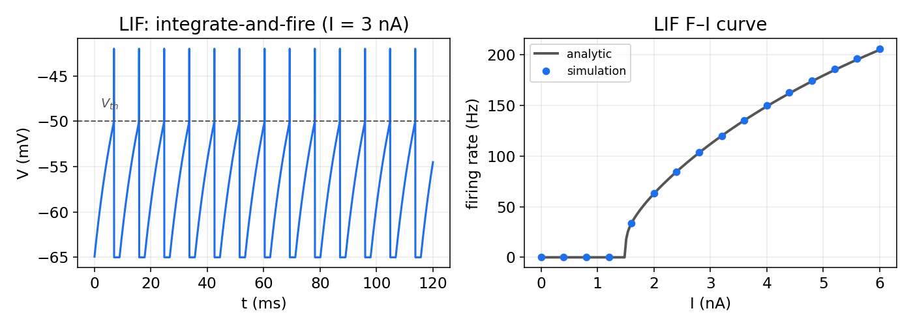
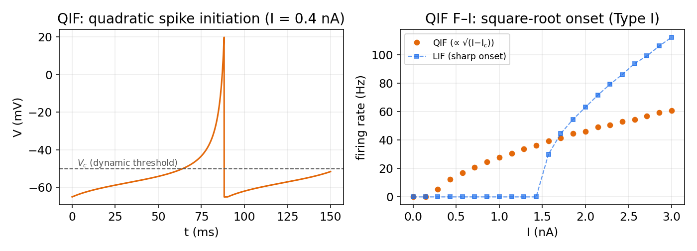
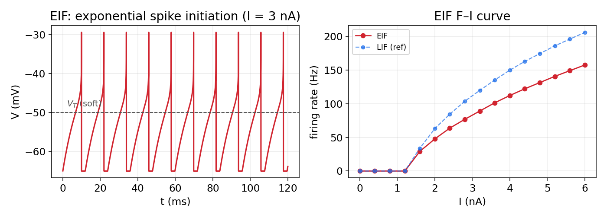
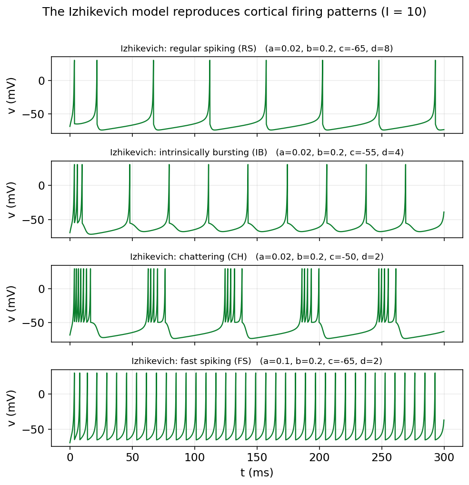
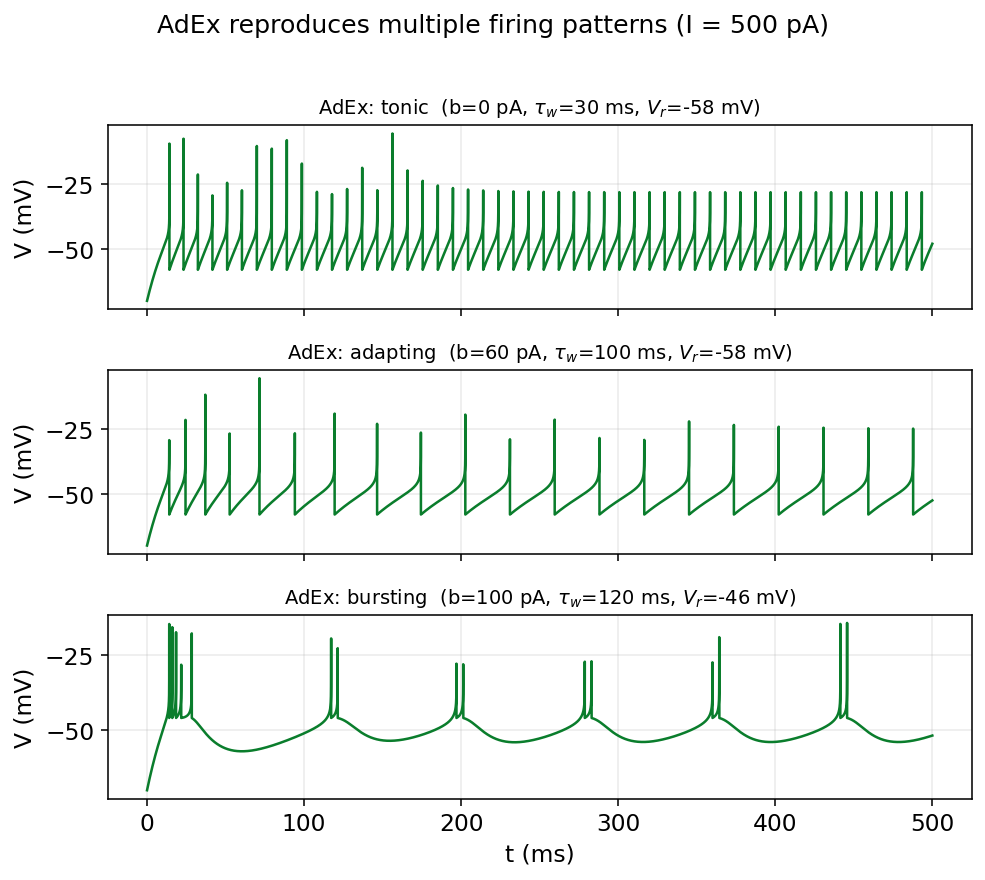
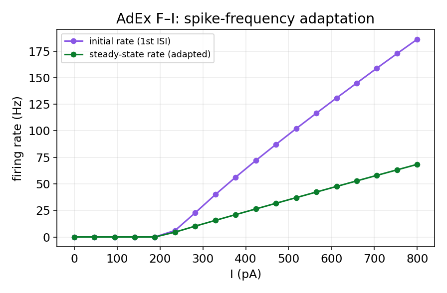

# مدل‌های ساده‌شده: LIF، QIF، EIF، ایژیکویچ و AdEx

مدل هاجکین–هاکسلیِ فصل پیش از نظر زیست‌فیزیکی غنی است، اما همین غنا بهایی دارد: چهار معادلهٔ غیرخطیِ درهم‌تنیده را نه می‌توان روی کاغذ تحلیل کرد و نه در یک شبکهٔ بزرگ از هزاران نورون به‌صرفه شبیه‌سازی کرد. اگر هدفِ ما فهمِ دینامیکِ یک شبکه باشد، نه جزئیاتِ شکلِ یک اسپایک، می‌توانیم معامله‌ای انجام دهیم: بخشی از جزئیاتِ زیستی را فدا کنیم تا مدلی به‌دست آوریم که هم سریع و هم تحلیل‌پذیر باشد. خانوادهٔ مدل‌های **انتگرال‌گیر-و-شلیک** (integrate-and-fire) دقیقاً همین معامله است.

این فصل دو خانواده از این مدل‌ها را معرفی می‌کند. نخست، سه مدلِ **تک‌متغیره**: مدلِ خطیِ **LIF**، مدلِ درجه‌دومِ **QIF** و مدلِ نماییِ **EIF**. سپس دو مدلِ **دومتغیرهٔ سازگارشونده**: مدلِ درجه‌دومِ **ایژیکویچ** و مدلِ نماییِ **AdEx**. این چیدمان یک تقارنِ زیبا دارد: در هر خانواده یک عضو با غیرخطینگیِ درجه‌دوم و یک عضو با غیرخطینگیِ نمایی داریم. برای هر مدل، شبیه‌سازی را از صفر در پایتون می‌نویسیم، منحنیِ **F–I** (نرخِ شلیک بر حسبِ جریان) را رسم می‌کنیم و می‌بینیم هر مدل چه چیزی را می‌تواند و چه چیزی را نمی‌تواند بازتولید کند.

## انگیزهٔ ساده‌سازی: از HH به انتگرال‌گیر-و-شلیک

نگاهی دوباره به اسپایکِ هاجکین–هاکسلی بیندازیم. زیرِ آستانه، غشا تقریباً مانندِ یک مدارِ خطیِ ساده (خازن به‌موازاتِ یک رسانایی) رفتار می‌کند: ولتاژ، جریانِ ورودی را «انباشت» می‌کند. تنها وقتی ولتاژ به آستانه می‌رسد، سازوکارِ سریع و غیرخطیِ سدیم فعال می‌شود و اسپایک را می‌سازد. اما این اسپایک از دیدِ شبکه، رویدادی کلیشه‌ای و همه‌یا‌هیچ است؛ شکلِ دقیقِ آن اطلاعاتِ چندانی حمل نمی‌کند.

این مشاهده، ایدهٔ ساده‌سازی را به‌دست می‌دهد: **زیرِ آستانه را نگه می‌داریم، اما خودِ اسپایک را با یک رویدادِ لحظه‌ای جایگزین می‌کنیم.** به‌جای حلِ معادله‌های سدیم و پتاسیم، یک «آستانه» تعریف می‌کنیم: هرگاه ولتاژ به آن برسد، می‌گوییم یک اسپایک رخ داده، ولتاژ را به مقدارِ بازنشانی برمی‌گردانیم و کار را ادامه می‌دهیم. تفاوتِ مدل‌های این خانواده در آن است که زیرِ آستانه را چقدر دقیق توصیف می‌کنند.

در همین‌جا باید به یک تمایزِ مهم اشاره کرد. مدل‌های ساده‌شده دو خانوادهٔ کاملاً متفاوت دارند. خانوادهٔ نخست — مانند فیتزهیو–ناگومو و موریس–لِکار در فصل دوم — همچنان اسپایک را به‌صورتِ یک مسیرِ پیوسته در فضای فاز تولید می‌کنند و آستانه و بازنشانیِ صریح ندارند؛ آن‌ها بُعد را کم می‌کنند، نه خودِ اسپایک را. خانوادهٔ دوم، که موضوعِ این فصل است، درست برعکس عمل می‌کند: سازوکارِ پیوستهٔ اسپایک را حذف و آن را با یک قاعدهٔ آستانه-و-بازنشانی جایگزین می‌کند. به همین دلیل آن مدل‌ها را در فصلِ سیستم‌های دینامیکی و با ابزارِ نول‌کلاین و صفحهٔ فاز بررسی کردیم، و این مدل‌ها را اینجا.

## مدل LIF

ساده‌ترین عضوِ خانواده، مدلِ **انتگرال‌گیر-و-شلیکِ نشتی** (Leaky Integrate-and-Fire) است. زیرِ آستانه، غشا همان مدارِ خطیِ RC است که در فصل سوم دیدیم:

$$
\tau_m\,\frac{dV}{dt} = -\big(V - E_L\big) + R\,I,
$$

که در آن $\tau_m = R\,C_m$ ثابت‌زمانیِ غشا، $E_L$ پتانسیل استراحت، $R$ مقاومتِ غشا و $I$ جریانِ ورودی است. جملهٔ $-(V-E_L)$ همان «نشتی» است که ولتاژ را پیوسته به‌سمتِ استراحت بازمی‌کشد. این معادله به‌تنهایی هرگز اسپایک تولید نمی‌کند؛ اسپایک را با یک **قاعدهٔ آستانه و بازنشانی** به‌صورتِ دستی اضافه می‌کنیم:

$$
\text{if } V(t) \ge V_{th} \;\Rightarrow\; \text{spike, then } V \to V_{reset}.
$$

افزون بر این، اغلب یک **دورهٔ تَقاوُم** به مدتِ $t_{ref}$ در نظر می‌گیریم که در آن ولتاژ پس از اسپایک ثابت می‌ماند.

### پیاده‌سازی از صفر

```python
import numpy as np
import matplotlib.pyplot as plt

# parameters (mV, ms, R in MOhm, I in nA)
tau_m, EL, Vth, Vreset, tref, R = 10.0, -65.0, -50.0, -65.0, 2.0, 10.0

def lif_run(I, T=200.0, dt=0.025):
    n = int(T/dt); tt = np.arange(n)*dt
    V = EL; t_last = -1e9; spikes = []; trace = np.empty(n)
    for i in range(n):
        if (tt[i] - t_last) < tref:        # during refractory period
            V = Vreset
        else:
            V += dt*(-(V - EL) + R*I)/tau_m   # Euler step
            if V >= Vth:                    # spike
                spikes.append(tt[i]); V = Vreset; t_last = tt[i]
        trace[i] = V
    return tt, trace, np.array(spikes)
```

### نتایج و منحنی F–I

زیبایی LIF آن است که منحنیِ F–I آن را می‌توان دقیقاً روی کاغذ به‌دست آورد:

$$
f(I) = \left[\, t_{ref} + \tau_m\,\ln\frac{E_L + R\,I - V_{reset}}{E_L + R\,I - V_{th}} \,\right]^{-1},
$$

که تنها وقتی $E_L + R\,I > V_{th}$ باشد معتبر است؛ یعنی جریان باید از یک مقدارِ **رئوبیس** بگذرد تا شلیک آغاز شود.

<figure markdown="span">
  
  <figcaption>چپ: ولتاژ مدل LIF تحت جریان ثابت؛ انباشتِ خطی تا آستانه و سپس بازنشانی. راست: منحنی F–I؛ نقاطِ شبیه‌سازی دقیقاً روی منحنیِ تحلیلی می‌نشینند. شروعِ شلیک در رئوبیس ناگهانی است.</figcaption>
</figure>

کاستیِ اصلیِ LIF آستانهٔ سختِ آن است: نورونِ واقعی آستانه‌ای دقیق و ثابت ندارد، بلکه آستانه از خودِ دینامیک بیرون می‌آید. دو مدلِ بعدی همین نکته را اصلاح می‌کنند.

## مدل QIF

مدلِ **انتگرال‌گیر-و-شلیکِ درجه‌دوم** (Quadratic Integrate-and-Fire) ساده‌ترین مدلی است که در آن آستانه نه دستی، بلکه **پویا** و برخاسته از خودِ معادله است:

$$
\tau_m\,\frac{dV}{dt} = a_0\,\big(V - E_L\big)\big(V - V_c\big) + R\,I.
$$

برای جریانِ کوچک، سمتِ راست دو ریشه دارد: یک نقطهٔ ثابتِ پایدار نزدیکِ $E_L$ (حالتِ استراحت) و یک نقطهٔ ثابتِ ناپایدار در $V_c$ که نقشِ آستانه را بازی می‌کند. این دقیقاً همان تصویرِ فصل دوم است. با افزایشِ جریان، این دو نقطه به هم نزدیک می‌شوند، در یک **دوشاخه‌شدنِ زین–گره** به‌هم می‌رسند و ناپدید می‌شوند؛ آنگاه دیگر نقطهٔ تعادلی نیست و نورون پیوسته شلیک می‌کند. اگر این رویداد روی یک مدار رخ دهد (دوشاخه‌شدنِ زین–گره روی دایره، SNIC)، نتیجه **تحریک‌پذیریِ نوع یک** است.

اهمیتِ نظریِ QIF از همین‌جا می‌آید: نزدیکِ یک دوشاخه‌شدنِ زین–گره، **هر** نورونِ نوع یک، فارغ از جزئیاتِ زیستی‌اش، به فرمِ بهنجارِ زیر فروکاسته می‌شود:

$$
\frac{dv}{dt} = v^2 + I,
$$

که با تغییرِ متغیرِ $v=\tan(\theta/2)$ به **نورونِ تتا** تبدیل می‌شود. به‌همین دلیل QIF، با وجودِ سادگی، اسبِ کاریِ مطالعاتِ تحلیلی است: بسیاری از فروکاست‌های دقیقِ میدانِ میانگین — که جمعیتی از نورون‌ها را به چند معادلهٔ نرخِ آتش تبدیل می‌کنند — بر پایهٔ همین مدل بنا شده‌اند. در بخش سوم، هنگامِ استخراجِ معادله‌های نرخِ آتش و مدلِ ویلسون–کوان، دوباره به QIF بازخواهیم گشت.

در واقع QIF پلی میان دو خانوادهٔ مدل‌هاست. از یک سو، یک مدلِ انتگرال‌گیر-و-شلیک است و آستانه و بازنشانی دارد؛ از سوی دیگر، همان فرمِ بهنجارِ دوشاخه‌شدنِ زین–گره روی دایره (SNIC) است که می‌توان آن را مستقیماً از دینامیکِ پیوستهٔ مدلِ موریس–لِکار استخراج کرد. به بیانِ دقیق، QIF همان چیزی است که یک مدلِ رساناییِ نوع یک، وقتی در همسایگیِ آستانه فروکاسته شود، به آن تبدیل می‌گردد — و همین، دلیلِ جایگاهِ ویژهٔ آن در تحلیل است. این، موریس–لِکارِ فصلِ دوم را مستقیماً به QIFِ این فصل پیوند می‌زند.

```python
a0, Vc, Vpeak = 0.04, -50.0, 20.0   # coefficient, dynamic threshold, peak

def qif_run(I, T=200.0, dt=0.01):
    n = int(T/dt); tt = np.arange(n)*dt
    V = EL; t_last = -1e9; spikes = []; trace = np.empty(n)
    for i in range(n):
        if (tt[i] - t_last) < tref:
            V = Vreset
        else:
            V += dt*(a0*(V - EL)*(V - Vc) + R*I)/tau_m
            if V >= Vpeak:
                spikes.append(tt[i]); V = Vreset; t_last = tt[i]
        trace[i] = min(V, Vpeak)
    return tt, trace, np.array(spikes)
```

منحنیِ F–I امضای روشنِ تحریک‌پذیریِ نوع یک را دارد: نرخِ شلیک متناسب با $\sqrt{I - I_c}$ از صفر آغاز می‌شود؛ یعنی نورون می‌تواند با فرکانس‌هایِ به‌دلخواه پایین شلیک کند — برخلافِ LIF که شروعی ناگهانی دارد.

<figure markdown="span">
  
  <figcaption>چپ: ولتاژ مدل QIF؛ نزدیکِ آستانهٔ پویا حرکت کند است و سپس اسپایک به‌صورت درجه‌دوم تند می‌شود. راست: منحنی F–I با شروعِ ریشه‌دومی (نوع یک، فرکانس از صفر آغاز می‌شود)، در مقابلِ شروعِ ناگهانیِ LIF.</figcaption>
</figure>

## مدل EIF

عضوِ سومِ خانوادهٔ تک‌متغیره، مدلِ **انتگرال‌گیر-و-شلیکِ نمایی** (Exponential Integrate-and-Fire) است که نزدیک‌ترین تقریب به شکلِ واقعیِ آغازِ اسپایک را می‌دهد. سازوکارِ سریعِ فعال‌سازیِ سدیمِ فصل سوم را با یک جملهٔ **نمایی** جایگزین می‌کنیم:

$$
\tau_m\,\frac{dV}{dt} = -\big(V - E_L\big) + \Delta_T\,\exp\!\left(\frac{V - V_T}{\Delta_T}\right) + R\,I,
$$

که در آن $V_T$ آستانهٔ نرم و $\Delta_T$ پارامترِ تیزیِ آن است. وقتی $V$ به‌قدرِ کافی زیرِ $V_T$ است، جملهٔ نمایی ناچیز است و معادله مانندِ LIF رفتار می‌کند؛ اما همین‌که $V$ به $V_T$ نزدیک می‌شود، جملهٔ نمایی منفجر می‌شود و برخاستِ تندِ اسپایک را می‌سازد. وقتی $V$ از یک اوجِ قراردادی گذشت، اسپایک ثبت و $V$ به $V_{reset}$ بازنشانی می‌شود.

```python
VT, DT, Vpeak = -50.0, 2.0, 0.0   # soft threshold, sharpness, peak

def eif_run(I, T=200.0, dt=0.01):
    n = int(T/dt); tt = np.arange(n)*dt
    V = EL; t_last = -1e9; spikes = []; trace = np.empty(n)
    for i in range(n):
        if (tt[i] - t_last) < tref:
            V = Vreset
        else:
            V += dt*(-(V - EL) + DT*np.exp((V - VT)/DT) + R*I)/tau_m
            if V >= Vpeak:
                spikes.append(tt[i]); V = Vreset; t_last = tt[i]
        trace[i] = min(V, Vpeak)
    return tt, trace, np.array(spikes)
```

<figure markdown="span">
  
  <figcaption>چپ: ولتاژ مدل EIF؛ نزدیکِ آستانهٔ نرمِ V_T جملهٔ نمایی یک برخاستِ تندِ خودشتاب‌دهنده می‌سازد. راست: منحنی F–I؛ شروعِ شلیک نسبت به LIF نرم‌تر است.</figcaption>
</figure>

EIF بهترین برازش به شکلِ واقعیِ آغازِ اسپایکِ نورون‌های قشری را می‌دهد و به‌همین دلیل در مدل‌سازیِ داده‌محور بسیار به‌کار می‌رود. اما مانندِ LIF و QIF، تنها یک متغیر دارد و فاقدِ **سازگاری** است؛ یعنی نمی‌تواند کاهشِ تدریجیِ نرخِ شلیک یا الگوهای انفجاری را بازتولید کند. برای این کار به یک متغیرِ دومِ کند نیاز داریم.

## مدل‌های دومتغیرهٔ سازگارشونده

افزودنِ یک متغیرِ دومِ کند — جریانِ **سازگاری** — مدل را دوبعدی می‌کند و توانِ توصیفیِ آن را به‌شدت بالا می‌برد. دو مدلِ مهمِ این دسته از یک ساختار پیروی می‌کنند: یک معادلهٔ ولتاژ با یک جملهٔ غیرخطیِ تولیدِ اسپایک، و یک معادلهٔ کند برای متغیرِ سازگاری. تفاوتشان در شکلِ آن جملهٔ غیرخطی است: درجه‌دوم در مدلِ ایژیکویچ، و نمایی در مدلِ AdEx.

### مدل ایژیکویچ

مدلِ **ایژیکویچ** (۲۰۰۳) با یک جملهٔ درجه‌دوم برای ولتاژ و یک متغیرِ بازیابیِ $u$ نوشته می‌شود:

$$
\begin{aligned}
\frac{dv}{dt} &= 0.04\,v^2 + 5\,v + 140 - u + I,\\[3pt]
\frac{du}{dt} &= a\,(b\,v - u),
\end{aligned}
\qquad
\text{if } v \ge 30 \;\Rightarrow\; v \to c,\; u \to u + d.
$$

جملهٔ درجه‌دوم همان سازوکارِ تولیدِ اسپایکِ QIF است و متغیرِ $u$ نقشِ بازیابی/سازگاری را بازی می‌کند. شگفتیِ این مدل آن است که تنها با چهار پارامترِ $a,b,c,d$ و با هزینهٔ محاسباتیِ بسیار اندک، می‌تواند تقریباً همهٔ الگوهای شناخته‌شدهٔ شلیکِ نورون‌های قشری را بازتولید کند. به همین دلیل برای شبیه‌سازیِ شبکه‌های بسیار بزرگ بسیار محبوب است.

```python
def izh_run(I, a, b, c, d, T=300.0, dt=0.1):
    n = int(T/dt); tt = np.arange(n)*dt
    v = -70.0; u = b*v; trace = np.empty(n)
    for i in range(n):
        v += dt*(0.04*v*v + 5*v + 140 - u + I)
        u += dt*(a*(b*v - u))
        if v >= 30:                       # spike and double reset
            trace[i] = 30; v = c; u += d
        else:
            trace[i] = v
    return tt, trace
```

<figure markdown="span">
  
  <figcaption>مدل ایژیکویچ تنها با تغییر چهار پارامتر، الگوهای متنوع شلیکِ قشری را بازتولید می‌کند: شلیک منظم (RS)، انفجاریِ ذاتی (IB)، پرحرف (CH) و شلیک سریع (FS).</figcaption>
</figure>

### مدل AdEx

مدلِ **انتگرال‌گیر-و-شلیکِ نماییِ سازگارشونده** (Adaptive Exponential) همان ساختارِ دوبعدی را دارد، اما جملهٔ تولیدِ اسپایک نمایی (مانندِ EIF) است و پارامترهایش معنای زیست‌فیزیکیِ مستقیم دارند:

$$
\begin{aligned}
C\,\frac{dV}{dt} &= -g_L\big(V - E_L\big) + g_L\,\Delta_T\,\exp\!\left(\frac{V - V_T}{\Delta_T}\right) - w + I,\\[4pt]
\tau_w\,\frac{dw}{dt} &= a\,\big(V - E_L\big) - w,
\end{aligned}
\qquad
\text{if } V \ge V_{peak} \;\Rightarrow\; V \to V_{reset},\; w \to w + b.
$$

دو پارامترِ سازگاری معنای روشنی دارند: $a$ جفت‌شدگیِ زیرآستانه و $b$ پرشِ متغیرِ سازگاری در هر اسپایک است. همین جملهٔ $-w$ است که پس از هر اسپایک نورون را اندکی مهار می‌کند و **سازگاریِ فرکانسِ شلیک** پدید می‌آورد.

```python
# parameters (pF, nS, mV, pA, ms)
C_, gL, EL2, VT2, DT2, Vpk = 200.0, 10.0, -70.0, -50.0, 2.0, 0.0

def adex_run(I, a, b, tw, Vr, T=500.0, dt=0.01):
    n = int(T/dt); tt = np.arange(n)*dt
    V = EL2; w = 0.0; spikes = []; trace = np.empty(n)
    for i in range(n):
        dV = (-gL*(V - EL2) + gL*DT2*np.exp((V - VT2)/DT2) - w + I)/C_
        dw = (a*(V - EL2) - w)/tw
        V += dt*dV; w += dt*dw
        if V >= Vpk:                       # spike: double reset
            spikes.append(tt[i]); V = Vr; w += b
        trace[i] = min(V, Vpk)
    return tt, trace, np.array(spikes)
```

<figure markdown="span">
  
  <figcaption>مدل AdEx نیز با تغییر چند پارامتر الگوهای مختلف شلیک را بازتولید می‌کند: تونیک، سازگارشونده (فاصلهٔ اسپایک‌ها زیاد می‌شود) و انفجاری.</figcaption>
</figure>

اثرِ سازگاری در منحنیِ F–I به‌روشنی دیده می‌شود. اگر نرخِ شلیک را در آغاز و در حالتِ پایا جداگانه رسم کنیم، نورون در آغاز تند شلیک می‌کند و سپس آرام می‌گیرد:

<figure markdown="span">
  
  <figcaption>منحنی F–I مدل AdEx؛ نرخِ اولیه به‌مراتب بالاتر از نرخِ پایا (سازگارشده) است. همین فاصله، کمّی‌سازیِ سازگاریِ فرکانسِ شلیک است.</figcaption>
</figure>

مدلِ ایژیکویچ و AdEx بسیار به هم نزدیک‌اند؛ هر دو دوبعدی و سازگارشونده‌اند و هر دو طیفی از الگوها را بازتولید می‌کنند. تفاوتِ عملی این است که پارامترهای ایژیکویچ انتزاعی و برای کارایی بهینه‌اند، حال‌آن‌که پارامترهای AdEx (ظرفیت، رسانایی، آستانه) مستقیماً به کمیت‌های زیست‌فیزیکیِ قابل‌اندازه‌گیری گره خورده‌اند.

## مقایسهٔ مدل‌ها

جدول زیر هر پنج مدل را کنار هم می‌گذارد. هر سطر، یک معامله میان سادگی، واقع‌گرایی و تحلیل‌پذیری را نشان می‌دهد:

| ویژگی | LIF | QIF | EIF | ایژیکویچ | AdEx |
|---|---|---|---|---|---|
| بُعد | ۱ | ۱ | ۱ | ۲ | ۲ |
| غیرخطینگی | خطی | درجه‌دوم | نمایی | درجه‌دوم | نمایی |
| آستانه | سخت | پویا | نرم | پویا | نرم |
| سازگاری | ندارد | ندارد | ندارد | دارد | دارد |
| الگوهای شلیک | تونیک | تونیک (نوع I) | تونیک | متنوع | متنوع |
| تحلیل‌پذیری | F–I بستهٔ صریح | فرمِ بهنجارِ نوع I | متوسط | کم | متوسط |
| هزینهٔ محاسباتی | بسیار کم | بسیار کم | کم | بسیار کم | کم |
| کاربردِ شاخص | شبکه‌های بزرگ و نظریه | مطالعاتِ تحلیلی و میدانِ میانگین | برازش به داده | شبیه‌سازیِ بزرگ‌مقیاس | مدلِ ALN در neurolib |

انتخابِ مدل به پرسشِ پژوهشی بستگی دارد: برای نظریه‌پردازیِ تحلیلیِ شبکه، LIF یا QIF؛ برای فروکاستِ دقیقِ جمعیت به نرخِ آتش، QIF؛ برای برازشِ واقع‌گرایانه به داده، EIF؛ و برای الگوهای متنوعِ شلیک، ایژیکویچ یا AdEx.

## پیوند با بخش‌های بعد

این فصل دو نخِ پیونددهنده به بخش‌های بعد دارد. نخست، مدلِ AdEx همان نورونی است که در قلبِ مدلِ جمعیتیِ **ALN** در کتابخانهٔ `neurolib` قرار دارد؛ در بخش سوم می‌بینیم چگونه از جمعیتی از نورون‌های AdEx به مدل‌سازیِ مغزِ کامل می‌رسیم. دوم، مدلِ QIF به‌دلیلِ تحلیل‌پذیریِ کم‌نظیرش، نقطهٔ آغازِ استخراجِ معادله‌های نرخِ آتش و مدلِ ویلسون–کوان خواهد بود. به این ترتیب، مدل‌هایی که در این فصل از صفر ساختیم، تا مدل‌سازیِ مغزِ کامل و نظریهٔ جمعیتی ادامه می‌یابند.

## جمع‌بندی

در این فصل دیدیم که چگونه با حذفِ سازوکارِ پرهزینهٔ اسپایک و حفظِ دینامیکِ زیرآستانه، می‌توان از مدلِ غنیِ هاجکین–هاکسلی به مدل‌هایی سبک و تحلیل‌پذیر رسید. خانوادهٔ تک‌متغیره (LIF، QIF، EIF) از خطی به درجه‌دوم و نمایی پیش رفت و هر گام آستانه را واقع‌گرایانه‌تر کرد؛ و خانوادهٔ دومتغیرهٔ سازگارشونده (ایژیکویچ، AdEx) با افزودنِ یک متغیرِ کند، طیفی از رفتارهای واقعیِ نورون را بازتولید کرد. در بخش بعد، از این نورون‌های منفرد فراتر می‌رویم و می‌پرسیم وقتی هزاران تا از آن‌ها را به هم می‌بندیم، چه رفتارهای جمعی تازه‌ای پدید می‌آید.

---

برای مطالعهٔ بیشتر:

<div dir="ltr" markdown>

- Gerstner, W., Kistler, W.M., Naud, R., Paninski, L., 2014. Neuronal Dynamics. Cambridge University Press.
- Izhikevich, E.M., 2003. Simple model of spiking neurons. IEEE Transactions on Neural Networks 14(6), 1569–1572.
- Brette, R., Gerstner, W., 2005. Adaptive exponential integrate-and-fire model as an effective description of neuronal activity. Journal of Neurophysiology 94(5), 3637–3642.
- Ermentrout, G.B., Kopell, N., 1986. Parabolic bursting in an excitable system coupled with a slow oscillation. SIAM Journal on Applied Mathematics 46(2), 233–253.

</div>