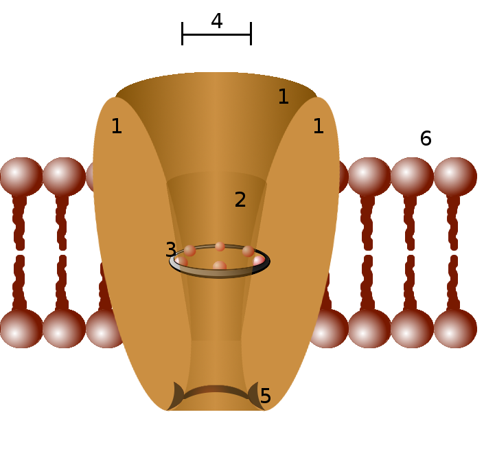
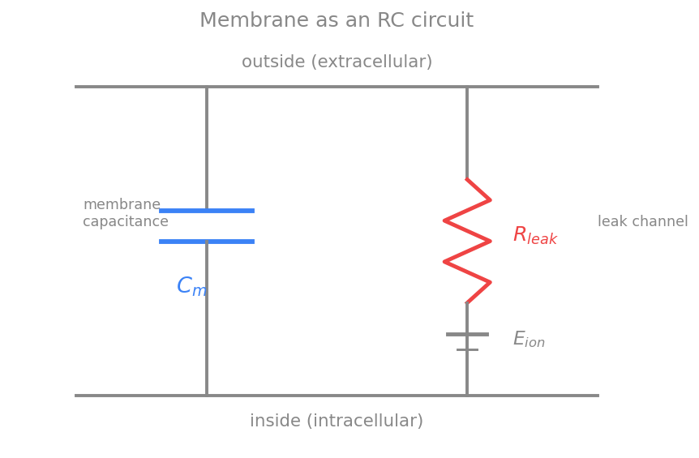
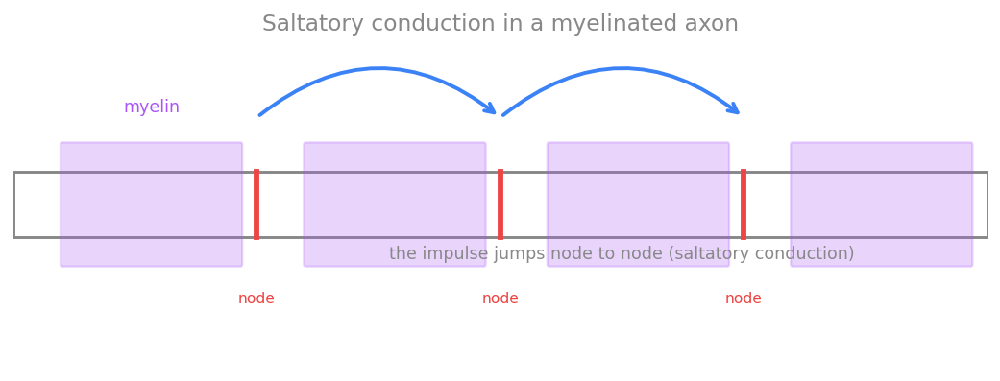

# غشای تحریک‌پذیر

این فصل برای معرفی رسمی و کتابی نظریهٔ عمومی علوم اعصاب نیست، بلکه
یک مقدمهٔ کوتاه دربارهٔ نورون‌هاست که متناسب با فصل‌های بعدی نوشته شده است. فصل‌های بعدی با
مدل‌های مختلف ریاضی که برای توصیف فعالیت‌های عصبی به‌کار برده می‌شوند سر و کار دارند. از آنجا که نورون‌ها
سلول هستند، با معرفی مختصری از سلول‌ها شروع می‌کنیم و پس از آن مدل‌های ریاضی استاندارد انتقال
سیگنال توسط نورون‌ها را معرفی خواهیم کرد.

این فصل، نخستین فصل از بخشِ **بیوفیزیک نورون** است و نقشِ سنگِ‌بنای مفهومی را دارد: در اینجا پدیده‌ها را
بیشتر به‌صورتِ کیفی و شهودی معرفی می‌کنیم، و در فصل‌های بعدیِ همین بخش، هر یک از آن‌ها را به‌صورتِ
**کمّی و محاسباتی** — با معادله و کدِ پایتون — بازخواهیم ساخت.

!!! note "در این فصل چه می‌آموزید"
    - ساختارِ سلول و نورون، غشای فسفولیپیدی و کانال‌های یونی را می‌شناسید.
    - می‌فهمید پتانسیل استراحت از کجا می‌آید و چگونه **معادلهٔ نرنست** پتانسیل تعادلِ یک یون و **معادلهٔ گلدمن** پتانسیل غشا را با حضورِ چند یون تعیین می‌کند.
    - غشا را به‌صورتِ یک **مدار الکتریکیِ ساده** (خازن به‌موازاتِ مقاومت و باتری) می‌بینید — تصویری که استخوان‌بندیِ همهٔ مدل‌های بعدی است.
    - سازوکارِ کیفیِ **پتانسیل عمل**، انتشار آن، هدایتِ جهشی و روش‌های تجربیِ اندازه‌گیری را درک می‌کنید.

!!! tip "نقشهٔ راهِ بخشِ بیوفیزیک نورون"
    آنچه در این فصل به‌صورتِ کیفی می‌بینید، در فصل‌های بعدیِ همین بخش کمّی می‌شود:

    - پتانسیل استراحت، نرنست و گلدمن و مدارِ RC غشا $\rightarrow$ [پتانسیل غشا: نگاهی محاسباتی](ch-biophys-02-membrane-potential.md)
    - کانال‌های یونی و باز و بسته‌شدنِ آن‌ها $\rightarrow$ [کانال‌های یونی و دریچه‌گذاری](ch-biophys-03-channels-gating.md)
    - گسترشِ فضاییِ سیگنال در دندریت و آکسون $\rightarrow$ [نظریهٔ کابل و دندریت‌ها](ch-biophys-04-cable-dendrites.md)
    - ارتباطِ میان نورون‌ها $\rightarrow$ [سیناپس‌ها و انتقال سیناپسی](ch-biophys-05-synapses.md)

    و در ادامهٔ کتاب، پتانسیل عمل به‌صورتِ کامل و کمّی در فصلِ [مدل هاجکین–هاکسلی](../ch03.md) بازساخته می‌شود.

## ساختار سلول

سلول‌ها واحدهای بنیادین حیات هستند. یک سلول از محلول آبی غلیظی از مواد شیمیایی تشکیل شده است و قادر است خود را با رشد و تقسیم تکثیر کند.
ساده‌ترین شکل حیات تک‌سلولی است، مانند مخمر، آمیب یا یک باکتری. سلول‌هایی که هسته دارند یوکاریوت و سلول‌هایی که هسته ندارند پروکاریوت نامیده می‌شوند. باکتری‌ها پروکاریوت هستند، در حالی که مخمر و آمیب یوکاریوت‌اند. حیوانات موجوداتی چندسلولی با سلول‌های یوکاریوتی هستند. قطر یک سلول نوعی در حدود ۵ تا ۲۰ میکرومتر است (یک میکرومتر برابر است با یک‌میلیونیم متر)، اما یک تخمک ممکن است به اندازهٔ یک میلی‌متر قطر داشته باشد. تخمین زده می‌شود که بدن انسان حدود ۳۰ تریلیون سلول داشته باشد. در یک دسته‌بندی، سلول‌ها بر اساس وظایفی که در بدن دارند مشخص می‌شوند که بسیار متنوع‌اند. با این حال، همهٔ سلول‌های یوکاریوت ساختار اساسی شبیه به هم دارند. همهٔ آن‌ها از یک هسته، اندامک‌ها و مولکول‌های متنوع و یک غشای پلاسمایی تشکیل شده‌اند (گلبول قرمز یک استثناست، زیرا هسته ندارد).

<figure markdown="span">
  
  <figcaption>یک سلول با هسته و تعدادی اندامک</figcaption>
</figure>

DNA،
کد ژنتیکی سلول، از دو رشتهٔ زنجیرهٔ پلیمری با پیکربندی مارپیچ دوگانه، با واحدهای نوکلئوتیدی مکرر
A، C، G و T
تشکیل شده است. هر
A
در یک رشته توسط یک پیوند هیدروژنی به
T
در رشتهٔ
دیگر متصل می‌شود و به‌طور مشابه هر
C
به
G
پیوند
هیدروژنی دارد.
DNA
در کروموزوم‌های هسته بسته‌بندی شده است.
غشای پلاسمایی سلول از یک دولایهٔ لیپیدی تشکیل شده است که در جاهای مختلف آن پروتئین‌هایی قرار گرفته‌اند.

<figure markdown="span">
  
  <figcaption>دو لایهٔ لیپیدی تشکیل‌دهندهٔ غشای سلول</figcaption>
</figure>

سیتوپلاسم بخشی از سلول است که در خارج از هسته و در داخل غشای سلول قرار دارد. هر اندامک یک ساختار مجزا در سیتوپلاسم است که برای انجام یک عملکرد خاص تخصص یافته است. میتوکندری اندامکی غشادار است که از اکسیژن برای تولید انرژی استفاده می‌کند؛ انرژی‌ای که سلول برای انجام وظایف مختلف خود به آن نیاز دارد. شبکهٔ آندوپلاسمی
(ER)
یکی دیگر از اندامک‌های محدود به غشاست که در آن لیپیدها ساخته می‌شوند و پروتئین‌های متصل به غشا تولید می‌شوند. سیتوپلاسم حاوی تعدادی اندامک میتوکندری و
ER
و همچنین اندامک‌های دیگری مانند لیزوزوم است که هضم درون‌سلولی در آن‌ها رخ می‌دهد. ساختارهای دیگری که از پروتئین‌ها تشکیل شده‌اند را می‌توان در سلول یافت، مانند رشته‌های مختلفی که برخی از آن‌ها وظیفهٔ تقویت مکانیکی سلول (اسکلت سلولی یا سیتواسکلتون) را بر عهده دارند. سلول همچنین حاوی مولکول‌های اسید آمینه، که واحدهای سازندهٔ پروتئین‌ها هستند، و بسیاری از مولکول‌های دیگر است.

## سلول‌های عصبی

در بدن انسان سلول‌های متنوعی وجود دارند. این سلول‌ها شامل (۱) انواع سلول‌های ماهیچه‌ای، (۲) انواع سلول‌های حسی نظیر سلول‌های میله‌ای شبکیه و سلول‌های مویی گوش داخلی، (۳) گلبول‌های قرمز و انواع گلبول‌های سفید و (۴) سلول‌های عصبی یا همان نورون‌ها هستند.
وظیفهٔ بنیادی نورون‌ها دریافت، هدایت و انتقال سیگنال است. نورون‌ها سیگنال‌هایی را از اندام‌های حسی به سمت داخل، به سیستم عصبی مرکزی[^1] که شامل مغز و نخاع است، منتقل می‌کنند. در سیستم عصبی مرکزی، سیگنال‌ها توسط مجموعه‌ای از نورون‌ها و مدارهای نورونی تجزیه، تحلیل و تفسیر می‌شوند؛ سپس سیستم نورونی پاسخی به این ورودی تولید می‌کند و پاسخ مجدداً توسط نورون‌ها به سمت بیرون، برای اقدام، به سلول‌های عضلانی و غدد ارسال می‌شود.

نورون‌ها اشکال و اندازه‌های مختلفی دارند، اما همهٔ آن‌ها دارای برخی ویژگی‌های مشترک هستند. یک نورون نوعی از چهار بخش تشکیل شده است: جسم سلولی یا سوما، دندریت‌ها، اکسون، و ترمینال‌های عصبی یا پایانه‌های پیش‌سیناپسی.

<figure markdown="span">
  
  <figcaption>یک سلول عصبی؛ جهت فلش‌ها جهت هدایت سیگنال را نشان می‌دهد.</figcaption>
</figure>

## ساختار فسفولیپیدی

فسفولیپید نوعی از لیپیدهاست که از یک مولکول گلیسرول، دو مولکول اسید چرب و یک مولکول فسفات تشکیل شده است. فسفولیپیدها یک سر آب‌دوست و دو دم آب‌گریز دارند. همین خاصیت دوگانه باعث می‌شود که در محیط آبی به‌طور خودبه‌خود به شکل یک دولایه سامان یابند: سرهای آب‌دوست رو به محلول آبی درون و بیرون سلول و دم‌های آب‌گریز رو به یکدیگر در میانهٔ غشا. این دولایه برای یون‌ها و مولکول‌های آب‌دوست تقریباً نفوذناپذیر است و همین، پایهٔ جداسازی الکتریکی درون سلول از بیرون آن را فراهم می‌کند.

<figure markdown="span">
  
  <figcaption>دو لایهٔ فسفولیپیدی</figcaption>
</figure>

<figure markdown="span">
  
  <figcaption>دو لایهٔ فسفولیپیدی با مؤلفه‌های مختلف</figcaption>
</figure>

## کانال‌های یونی

کانال یونی گروهی از پروتئین‌های تراغشایی غشای سلول هستند که معمولاً نسبت به بعضی یون‌ها مثل سدیم، پتاسیم، کلسیم و کلر بسیار گزینشی رفتار می‌کنند. چون دولایهٔ لیپیدی به‌تنهایی نسبت به یون‌ها نفوذناپذیر است، این کانال‌ها تنها مسیرهای عبور سریع یون از عرض غشا را فراهم می‌کنند. عبور یون از یک کانال باز یک فرایند غیرفعال است: یون‌ها در جهت شیب الکتروشیمیایی خود حرکت می‌کنند و هیچ انرژی متابولیکی مستقیماً مصرف نمی‌شود.

<figure markdown="span">
  
  <figcaption>نمایی از یک کانال یونی در غشای سلول</figcaption>
</figure>

### باز و بسته شدن کانال‌های یونی

بسیاری از کانال‌های یونی می‌توانند میان دو حالت «باز» و «بسته» جابه‌جا شوند؛ به این فرایند دریچه‌گذاری یا گِیتینگ (gating) گفته می‌شود. در حالت بسته، بخشی از زنجیرهٔ پروتئینی مانند دروازه‌ای مسیر عبور یون را می‌بندد، و یک محرک مشخص باعث تغییر شکل (تغییر کنفورماسیون) پروتئین و باز شدن مسیر می‌شود. کانال‌ها را بر اساس نوع محرکی که آن‌ها را باز یا بسته می‌کند دسته‌بندی می‌کنند:

* **کانال‌های وابسته به ولتاژ:** باز و بسته شدن آن‌ها به اختلاف پتانسیل دو سوی غشا بستگی دارد. این کانال‌ها در تولید و انتشار پتانسیل عمل نقش کلیدی دارند و در فصل‌های بعد، در مدل هاجکین–هاکسلی، با جزئیات بررسی خواهند شد.
* **کانال‌های وابسته به لیگاند:** با اتصال یک مولکول خاص (لیگاند) مانند یک ناقل عصبی به جایگاه گیرنده روی کانال باز می‌شوند. این کانال‌ها پایهٔ انتقال سیناپسی شیمیایی هستند.
* **کانال‌های مکانیکی:** با کشش یا فشار مکانیکی غشا باز می‌شوند و در حس لامسه، شنوایی و تعادل دخیل‌اند.

علاوه بر این کانال‌های دریچه‌دار، دسته‌ای از کانال‌ها به نام **کانال‌های نشتی** وجود دارند که عملاً همیشه باز هستند و عبور پیوستهٔ مقدار کمی یون (به‌ویژه پتاسیم) را در حالت استراحت ممکن می‌سازند. همان‌طور که خواهیم دید، این کانال‌های نشتی نقش تعیین‌کننده‌ای در شکل‌گیری پتانسیل استراحت دارند.

!!! note "به‌زودی: دریچه‌گذاری به‌صورتِ کمّی"
    در فصلِ [کانال‌های یونی و دریچه‌گذاری](ch-biophys-03-channels-gating.md) همین «باز و بسته‌شدن» را با یک **متغیر دروازه‌ای** و معادلهٔ آهنگِ آن مدل می‌کنیم، منحنیِ فعال‌سازیِ بولتزمان را رسم می‌کنیم، و می‌بینیم چگونه رفتارِ تصادفیِ تک‌کانال‌ها در حدِ تعدادِ زیاد به یک رسانایی هموارِ قطعی می‌رسد.

### گزینش یون‌ها

ویژگی برجستهٔ بسیاری از کانال‌های یونی، گزینش‌گری بالای آن‌هاست: یک کانال پتاسیمی می‌تواند یون پتاسیم ($\text{K}^+$) را با سرعت بسیار بالا عبور دهد، اما عبور یون سدیم ($\text{Na}^+$) را تا حدود هزار برابر بیشتر سد می‌کند، با آنکه سدیم کوچک‌تر است. این رفتار در نگاه اول متناقض به نظر می‌رسد و توضیح آن در ساختار بخشی از کانال به نام **فیلتر گزینشگر** نهفته است.

هر یون در محلول آبی با پوسته‌ای از مولکول‌های آب احاطه شده است (هیدراته شده است). برای عبور از فیلتر گزینشگر، یون باید این پوستهٔ آبی را از دست بدهد، که خود مستلزم صرف انرژی است. در فیلتر کانال پتاسیمی، اتم‌های اکسیژن کربونیلِ زنجیرهٔ پروتئینی طوری آرایش یافته‌اند که فاصله‌شان دقیقاً با اندازهٔ یون پتاسیمِ بدون آب جور است؛ بنابراین این اکسیژن‌ها جای مولکول‌های آب را می‌گیرند و هزینهٔ آب‌زدایی پتاسیم را جبران می‌کنند. یون سدیم کوچک‌تر است و در همان آرایش نمی‌تواند به‌خوبی با اکسیژن‌ها تماس برقرار کند، در نتیجه هزینهٔ آب‌زدایی آن جبران نمی‌شود و عبورش پرهزینه و کند می‌ماند. به این ترتیب گزینش‌گری نه صرفاً بر پایهٔ اندازهٔ منفذ، بلکه بر پایهٔ توازن دقیق میان انرژی آب‌زدایی و برهم‌کنش یون با دیوارهٔ فیلتر استوار است.

## ترکیب یونی داخل و خارج سلول

غلظت یون‌ها در دو سوی غشای سلول یکسان نیست؛ این تفاوت غلظت، که شیب غلظتی نامیده می‌شود، نیروی محرکهٔ اصلی همهٔ پدیده‌های الکتریکی نورون است. به‌طور کلی غلظت پتاسیم در درون سلول بسیار بیشتر از بیرون، و غلظت سدیم، کلر و کلسیم در بیرون بسیار بیشتر از درون است. این عدم تعادل توسط پمپ‌های فعال غشا، به‌ویژه پمپ سدیم–پتاسیم، که با مصرف انرژی یون‌ها را خلاف شیب غلظتی‌شان جابه‌جا می‌کند، برقرار و نگه‌داشته می‌شود.

جدول زیر مقادیر نمونه‌وار غلظت یون‌های اصلی را در یک نورون پستانداران (برحسب میلی‌مولار) نشان می‌دهد. این اعداد تقریبی‌اند و میان منابع و میان سلول‌های مختلف اندکی متفاوت‌اند:

| یون | غلظت بیرون سلول (mM) | غلظت درون سلول (mM) | ظرفیت ($z$) |
|---|---|---|---|
| پتاسیم $\text{K}^+$ | ۴ | ۱۴۰ | ‎+۱ |
| سدیم $\text{Na}^+$ | ۱۴۵ | ۱۲ | ‎+۱ |
| کلر $\text{Cl}^-$ | ۱۲۰ | ۴ | ‎−۱ |
| کلسیم $\text{Ca}^{2+}$ | ۱٫۸ | ۱۰⁻⁴ | ‎+۲ |

نکتهٔ شایان توجه دربارهٔ کلسیم آن است که غلظت آزاد آن در درون سلول بسیار ناچیز (در حدّ ۱۰⁻⁴ میلی‌مولار) است؛ همین شیب غلظتی بسیار بزرگ باعث می‌شود که ورود اندکی کلسیم به سلول بتواند به‌عنوان یک پیام درون‌سلولی عمل کند.

## پتانسیل استراحت

اگر دو الکترود را، یکی درون و دیگری بیرون یک نورون که فعالیتی ندارد قرار دهیم، اختلاف پتانسیلی پایدار در حدود ۶۵- تا ۷۰- میلی‌ولت اندازه می‌گیریم؛ یعنی درون سلول نسبت به بیرون منفی است. این اختلاف پتانسیل پایدار را **پتانسیل استراحت** می‌نامیم. قرارداد رایج آن است که پتانسیل غشا را به‌صورت اختلاف پتانسیل درون منهای بیرون تعریف کنیم:

$$
V_m = \phi_{\text{in}} - \phi_{\text{out}}
$$

پرسش این است که چنین اختلاف پتانسیلی از کجا می‌آید. پاسخ، ترکیبی از دو عامل است: شیب غلظتی یون‌ها و نفوذپذیری گزینشی غشا نسبت به آن‌ها. در حالت استراحت، غشا عمدتاً نسبت به پتاسیم نفوذپذیر است (چون کانال‌های نشتی پتاسیمی باز هستند). پتاسیم در جهت شیب غلظتی خود از درون به بیرون نشت می‌کند و چون بار مثبت با خود می‌برد، درون سلول را اندک‌اندک منفی‌تر می‌کند. این منفی‌شدن، خود نیرویی الکتریکی پدید می‌آورد که پتاسیمِ مثبت را به درون بازمی‌گرداند. در نقطه‌ای که این دو نیرو (کشش غلظتی به بیرون و کشش الکتریکی به درون) یکدیگر را خنثی کنند، شار خالص پتاسیم صفر می‌شود و پتانسیل به تعادل می‌رسد. این پتانسیلِ تعادل برای هر یون را می‌توان به‌دقت با **معادلهٔ نرنست** محاسبه کرد.

دو نکتهٔ تکمیلی: نخست آنکه غشا کاملاً نسبت به سدیم نفوذناپذیر نیست؛ نشت اندک سدیم به درون باعث می‌شود پتانسیل استراحت کمی مثبت‌تر از پتانسیل تعادل پتاسیم باشد. دوم آنکه نشت پیوستهٔ پتاسیم به بیرون و سدیم به درون در درازمدت شیب غلظتی را از بین می‌برد؛ پمپ سدیم–پتاسیم با مصرف ATP و جابه‌جایی سه یون سدیم به بیرون در ازای دو یون پتاسیم به درون، این شیب‌ها را پیوسته بازسازی می‌کند و پایداری پتانسیل استراحت را تضمین می‌نماید.

## معادلهٔ نرنست

معادلهٔ نرنست پتانسیلِ تعادلِ یک یون منفرد را، یعنی پتانسیل غشایی که در آن شار خالصِ آن یون صفر می‌شود، بر حسب نسبت غلظت‌های دو سوی غشا می‌دهد. برای یون $X$ با ظرفیت $z$:

$$
E_X = \frac{RT}{zF}\,\ln\frac{[X]_{\text{out}}}{[X]_{\text{in}}}
$$

در این رابطه $R$ ثابت جهانی گازها ($8.314\ \mathrm{J\,K^{-1}\,mol^{-1}}$)، $T$ دمای مطلق بر حسب کلوین، $F$ ثابت فارادی ($96485\ \mathrm{C\,mol^{-1}}$) و $z$ ظرفیت (بار) یون است. $E_X$ را پتانسیل نرنست یا پتانسیل تعادل یون $X$ می‌نامند.

### اشتقاق معادلهٔ نرنست

دو نیرو بر یک یون در عرض غشا وارد می‌شوند: نیروی انتشار، که یون را از غلظت زیاد به سمت غلظت کم می‌راند، و نیروی الکتریکی، که ناشی از میدان الکتریکیِ حاصل از اختلاف پتانسیل غشاست. شار مولیِ یون $X$ از مجموع این دو سهم به‌دست می‌آید؛ این همان معادلهٔ نرنست–پلانک است:

$$
J = -D\left(\frac{dc}{dx} + \frac{zF}{RT}\,c\,\frac{d\phi}{dx}\right)
$$

که در آن $c$ غلظت یون، $D$ ضریب انتشار، $\phi$ پتانسیل الکتریکی و $x$ مختصات عرض غشاست. جملهٔ نخست، انتشار (قانون فیک) و جملهٔ دوم، رانش الکتریکی است که در آن از رابطهٔ اینشتین میان تحرک‌پذیری و ضریب انتشار استفاده شده است.

در حالت تعادل، شار خالص یون صفر است، یعنی $J = 0$. پس:

$$
\frac{dc}{dx} = -\frac{zF}{RT}\,c\,\frac{d\phi}{dx}
$$

با تقسیم دو طرف بر $c$ و جداسازی متغیرها:

$$
\frac{1}{c}\,dc = -\frac{zF}{RT}\,d\phi
$$

اکنون از درون سلول تا بیرون آن انتگرال می‌گیریم:

$$
\int_{\text{in}}^{\text{out}}\frac{dc}{c} = -\frac{zF}{RT}\int_{\text{in}}^{\text{out}} d\phi
$$

که نتیجه می‌دهد:

$$
\ln\frac{c_{\text{out}}}{c_{\text{in}}} = -\frac{zF}{RT}\left(\phi_{\text{out}} - \phi_{\text{in}}\right) = \frac{zF}{RT}\left(\phi_{\text{in}} - \phi_{\text{out}}\right)
$$

با توجه به اینکه در تعادل $\phi_{\text{in}} - \phi_{\text{out}} = E_X$ است، با مرتب‌کردن رابطهٔ بالا به معادلهٔ نرنست می‌رسیم:

$$
E_X = \frac{RT}{zF}\,\ln\frac{[X]_{\text{out}}}{[X]_{\text{in}}}
$$

در دمای بدن ($T = 310\ \mathrm{K}$) و با تبدیل لگاریتم طبیعی به لگاریتم در پایهٔ ۱۰ (ضرب در $\ln 10 \approx 2.303$)، ضریب $\frac{RT}{F}\ln 10$ تقریباً برابر ۶۱٫۵ میلی‌ولت می‌شود. بنابراین یک شکل کاربردی و پرکاربردِ معادله چنین است:

$$
E_X \approx \frac{61.5}{z}\,\log_{10}\frac{[X]_{\text{out}}}{[X]_{\text{in}}}\quad(\text{mV})
$$

با جای‌گذاری مقادیر جدول غلظت در این رابطه، پتانسیل تعادل یون‌های اصلی به‌دست می‌آید:

| یون | پتانسیل تعادل $E_X$ |
|---|---|
| پتاسیم $\text{K}^+$ | حدود ۹۵− میلی‌ولت |
| سدیم $\text{Na}^+$ | حدود ۶۷+ میلی‌ولت |
| کلر $\text{Cl}^-$ | حدود ۹۱− میلی‌ولت |
| کلسیم $\text{Ca}^{2+}$ | حدود ۱۳۱+ میلی‌ولت |

برای آنکه ببینیم این اعداد چگونه به‌دست می‌آیند، یک نمونه را گام‌به‌گام حساب می‌کنیم. برای پتاسیم، با غلظت بیرونی $4$ و درونی $140$ میلی‌مولار و ظرفیت $z=+1$:

$$
E_{\text{K}} = \frac{61.5}{1}\,\log_{10}\frac{4}{140}
= 61.5 \times \log_{10}(0.0286)
\approx 61.5 \times (-1.54)
\approx -95\ \mathrm{mV}.
$$

به‌همین ترتیب برای سدیم با نسبت $145/12$ مقداری نزدیک به $+67$ میلی‌ولت و برای کلسیم، به‌سببِ شیب غلظتیِ بسیار بزرگ و ظرفیتِ $z=+2$، مقداری در حدود $+131$ میلی‌ولت به‌دست می‌آید.

دیده می‌شود که پتانسیل استراحت نوعی (حدود ۷۰− میلی‌ولت) بسیار به پتانسیل تعادل پتاسیم نزدیک است؛ و این دقیقاً همان چیزی است که از غلبهٔ نفوذپذیری پتاسیم در حالت استراحت انتظار داریم.

!!! note "به‌زودی: همین محاسبه با کد"
    در فصلِ [پتانسیل غشا: نگاهی محاسباتی](ch-biophys-02-membrane-potential.md) همین جدول را با چند خط پایتون بازتولید می‌کنیم، و با معادلهٔ گلدمن می‌بینیم که چگونه پتانسیل غشا با تغییرِ نفوذپذیری‌ها میان $E_{\text{K}}$ و $E_{\text{Na}}$ حرکت می‌کند.

## معادلهٔ گلدمن

معادلهٔ نرنست تنها برای یک یون منفرد و در حالت تعادل آن یون معتبر است. اما غشای واقعی هم‌زمان نسبت به چند یون نفوذپذیر است و پتانسیل استراحت، حاصل سهم همهٔ آن‌هاست. **معادلهٔ گلدمن–هاجکین–کاتز** (که اغلب به‌اختصار معادلهٔ گلدمن نامیده می‌شود) پتانسیل غشا را در حالتی که شار خالصِ کلِ بارها صفر است، بر حسب غلظت و نفوذپذیری هر یون می‌دهد. برای سه یون اصلیِ سدیم، پتاسیم و کلر:

$$
V_m = \frac{RT}{F}\,\ln\frac{P_{\text{K}}[\text{K}^+]_{\text{out}} + P_{\text{Na}}[\text{Na}^+]_{\text{out}} + P_{\text{Cl}}[\text{Cl}^-]_{\text{in}}}{P_{\text{K}}[\text{K}^+]_{\text{in}} + P_{\text{Na}}[\text{Na}^+]_{\text{in}} + P_{\text{Cl}}[\text{Cl}^-]_{\text{out}}}
$$

که در آن $P_{\text{K}}$، $P_{\text{Na}}$ و $P_{\text{Cl}}$ نفوذپذیری نسبی غشا نسبت به هر یون هستند. توجه کنید که جای غلظت‌های درون و بیرونِ کلر نسبت به یون‌های مثبت جابه‌جا شده است؛ این جابه‌جایی به دلیل بار منفی کلر ($z = -1$) است.

نکات کلیدی دربارهٔ این معادله:

* اگر غشا تنها نسبت به یک یون نفوذپذیر باشد (مثلاً $P_{\text{Na}} = P_{\text{Cl}} = 0$)، معادلهٔ گلدمن دقیقاً به معادلهٔ نرنستِ همان یون فرومی‌کاهد. به این معنا، معادلهٔ گلدمن تعمیمِ معادلهٔ نرنست برای چند یون است.
* وزن هر یون در تعیین پتانسیل غشا با نفوذپذیری آن یون متناسب است. در حالت استراحت، چون $P_{\text{K}}$ بسیار بزرگ‌تر از $P_{\text{Na}}$ است (نسبت نوعیِ $P_{\text{K}} : P_{\text{Na}} : P_{\text{Cl}}$ در حدود $1 : 0.04 : 0.45$ است)، پتانسیل غشا به پتانسیل تعادل پتاسیم نزدیک می‌ماند و مقداری در حدود ۷۰− میلی‌ولت به‌دست می‌آید.
* بر خلاف معادلهٔ نرنست، معادلهٔ گلدمن یک پتانسیلِ تعادلِ ترمودینامیکی را توصیف نمی‌کند، بلکه یک حالت پایای دینامیکی است که در آن جمع جبری جریان‌ها صفر است؛ پمپ‌های فعال غشا انرژی لازم برای حفظ این حالت پایا را تأمین می‌کنند.

تغییر ناگهانی نفوذپذیری‌ها، برای مثال افزایش شدید $P_{\text{Na}}$ هنگام باز شدن کانال‌های سدیمی وابسته به ولتاژ، باعث می‌شود وزن سدیم در معادلهٔ گلدمن غالب شود و پتانسیل غشا به سرعت به سمت $E_{\text{Na}}$ مثبت میل کند. همین جابه‌جایی سریع وزن یون‌ها، شالودهٔ پتانسیل عمل است که در ادامهٔ همین فصل به‌صورت کیفی و در فصل بعد در قالب مدل هاجکین–هاکسلی به‌صورت کمّی به آن خواهیم پرداخت.

## غشا به‌مثابهٔ یک مدار الکتریکی

پیش از پرداختن به پتانسیل عمل، یک تصویر فیزیکیِ کلیدی را معرفی می‌کنیم که در سراسر فصل‌های بعد به کار می‌آید: غشای نورون از نظر الکتریکی مانند یک **مدار ساده** رفتار می‌کند.

دولایهٔ لیپیدی، یک عایق نازک میان دو محیط رساناست (محلول‌های یونی درون و بیرون سلول). هر عایقی که میان دو رسانا قرار گیرد یک **خازن** می‌سازد؛ بنابراین غشا یک ظرفیت خازنی $C_m$ دارد و می‌تواند بار الکتریکی را روی دو سطح خود نگه دارد. در کنار این خازن، کانال‌های یونی مسیرهایی برای عبور بار فراهم می‌کنند و نقش **مقاومت** (یا رسانایی) را ایفا می‌کنند. هر دسته کانال، علاوه بر مقاومت، یک **منبع ولتاژ** نیز در خود دارد که همان پتانسیل نرنستِ آن یون است. به این ترتیب، غشا را می‌توان به‌صورت یک خازن موازی با چند شاخهٔ مقاومت–باتری مدل کرد.

<figure markdown="span">
  
  <figcaption>مدل مداری ساده‌شدهٔ غشا: یک خازن (ظرفیت خازنی غشا، $C_m$) به‌موازات یک شاخهٔ نشتی شامل مقاومت کانال و باتریِ متناظر با پتانسیل تعادل یون.</figcaption>
</figure>

اهمیت این تصویر در آن است که قانون پایستگی بار، رفتار ولتاژ غشا را تعیین می‌کند. جریانی که به خازن می‌رسد باید یا بار آن را تغییر دهد یا از کانال‌ها عبور کند. اگر جریان خازنی را $C_m\,\frac{dV}{dt}$ و مجموع جریان‌های یونی را $\sum_i I_i$ بنویسیم، موازنهٔ جریان چنین می‌شود:

$$
C_m\,\frac{dV_m}{dt} = -\sum_i I_i + I_{\text{ext}},
$$

که در آن $I_{\text{ext}}$ هر جریان خارجیِ تزریق‌شده است. این معادلهٔ ساده، **استخوان‌بندیِ همهٔ مدل‌های نورونی** در فصل‌های بعد است: مدل هاجکین–هاکسلی، مدل‌های ساده‌شده و حتی مدل‌های جمعیتی، همگی شکل‌هایی از همین موازنهٔ جریان‌اند. تنها چیزی که از مدلی به مدل دیگر تغییر می‌کند، نحوهٔ توصیف جریان‌های یونیِ $I_i$ است.

ثابت زمانی این مدار، $\tau_m = R_m C_m$، تعیین می‌کند که ولتاژ غشا با چه سرعتی به تغییرات جریان پاسخ می‌دهد؛ مقدار نوعی آن در حدود چند تا چند ده میلی‌ثانیه است و همین، مقیاس زمانیِ پاسخ‌های زیرآستانهٔ نورون را مشخص می‌کند.

!!! note "به‌زودی: این مدار را حل می‌کنیم"
    در فصلِ [پتانسیل غشا: نگاهی محاسباتی](ch-biophys-02-membrane-potential.md) همین معادلهٔ موازنهٔ جریان را از صفر در پایتون انتگرال‌گیری می‌کنیم، پاسخِ پله‌ای و ثابت‌زمانیِ $\tau_m$ را می‌بینیم و منحنیِ **شدت–مدت** را می‌سازیم. گسترشِ این مدل در فضا (به‌جای یک نقطه) موضوعِ فصلِ [نظریهٔ کابل و دندریت‌ها](ch-biophys-04-cable-dendrites.md) است.

## پتانسیل عمل

تا اینجا غشا را در حالت استراحت بررسی کردیم. اما ویژگیِ تعیین‌کنندهٔ نورون، توانایی آن در تولید **پتانسیل عمل** است: یک موج گذرا و بسیار سریع از وارونگیِ پتانسیل غشا که در امتداد آکسون منتشر می‌شود و پیام عصبی را حمل می‌کند. این همان پدیده‌ای است که واژهٔ «تحریک‌پذیر» در عنوان این فصل به آن اشاره دارد.

### آستانه و پاسخ همه‌یاهیچ

اگر غشا را اندکی دپلاریزه کنیم (یعنی پتانسیل را به سمت مثبت ببریم)، تا زمانی که از یک **آستانه** عبور نکرده باشد، پاسخی گذرا و کوچک می‌گیریم و غشا به استراحت بازمی‌گردد. اما به‌محض آنکه دپلاریزاسیون از آستانه (نوعاً حدود ۵۵− میلی‌ولت) بگذرد، یک پتانسیل عملِ کامل برانگیخته می‌شود. نکتهٔ مهم این است که دامنهٔ پتانسیل عمل به شدتِ محرک بستگی ندارد: محرکِ زیرآستانه هیچ پتانسیل عملی تولید نمی‌کند، و هر محرکِ فراتر از آستانه پتانسیل عملی با دامنهٔ تقریباً یکسان می‌سازد. به این ویژگی، رفتار **همه‌یاهیچ** می‌گویند.

<figure markdown="span">
  
  <figcaption>پتانسیل عمل و فازهای آن: دپلاریزاسیون سریع ناشی از ورود سدیم، رپلاریزاسیون ناشی از خروج پتاسیم، و فرابیش‌قطبش (پایین‌رویِ گذرا) پیش از بازگشت به استراحت. خط‌چینِ قرمز آستانه و خط‌چینِ خاکستری سطح استراحت را نشان می‌دهد.</figcaption>
</figure>

### سازوکار یونی: یک چرخهٔ بازخورد مثبت

پتانسیل عمل، نتیجهٔ یک رقص دقیق میان دو دسته کانال وابسته به ولتاژ است:

نخست، دپلاریزاسیونِ آغازین **کانال‌های سدیمیِ وابسته به ولتاژ** را باز می‌کند. چون $E_{\text{Na}}$ بسیار مثبت است، سدیم به‌سرعت به درون سرازیر می‌شود و غشا را مثبت‌تر می‌کند. این مثبت‌ترشدن، کانال‌های سدیمیِ بیشتری را باز می‌کند، که به ورود سدیمِ بیشتر می‌انجامد، و این چرخه خود را تقویت می‌کند. این **بازخورد مثبت** همان چیزی است که به پتانسیل عمل سرشت انفجاری و همه‌یاهیچ می‌بخشد: همین‌که آغاز شود، تا انتها پیش می‌رود و پتانسیل غشا به‌سرعت به سمت $E_{\text{Na}}$ بالا می‌رود.

اما این صعود متوقف می‌شود، به دو دلیل که با هم عمل می‌کنند:

* **غیرفعال‌شدن کانال سدیمی:** کانال‌های سدیمی پس از باز شدن، با تأخیری کوتاه به‌طور خودکار **غیرفعال** می‌شوند؛ دریچهٔ دومی در کانال بسته می‌شود و جریان سدیم را قطع می‌کند، هرچند محرک هنوز برقرار باشد. هر کانال در طول یک پتانسیل عمل تنها یک‌بار باز می‌شود.
* **باز شدن کانال پتاسیمی:** **کانال‌های پتاسیمیِ وابسته به ولتاژ** (که به آن‌ها یکسوسازِ تأخیری نیز می‌گویند) کندتر از کانال‌های سدیمی به دپلاریزاسیون پاسخ می‌دهند و نزدیک قلهٔ پتانسیل عمل باز می‌شوند. خروج پتاسیم به بیرون، بار مثبت را از سلول خارج می‌کند و غشا را دوباره منفی می‌کند (رپلاریزاسیون).

از آنجا که کانال‌های پتاسیمی با تأخیر بسته می‌شوند، غشا اغلب برای مدتی کوتاه از پتانسیل استراحت هم منفی‌تر می‌شود؛ به این پدیده **فرابیش‌قطبش** یا پایین‌روی می‌گویند. سرانجام کانال‌ها به حالت استراحت بازمی‌گردند و پمپ سدیم–پتاسیم تعادل یونی را به‌تدریج بازسازی می‌کند.

### دورهٔ بی‌پاسخی (نسوز)

غیرفعال‌شدن کانال‌های سدیمی پیامد مهمی دارد: بلافاصله پس از یک پتانسیل عمل، تا زمانی که کانال‌های سدیمی از حالت غیرفعال خارج نشده‌اند، غشا نمی‌تواند پتانسیل عمل تازه‌ای تولید کند. به این بازهٔ زمانی **دورهٔ بی‌پاسخی** (نسوز، refractory period) می‌گویند. این دوره دو نقش کلیدی دارد: نخست، شلیک نورون را به یک بیشینهٔ بسامد محدود می‌کند؛ دوم، تضمین می‌کند که پتانسیل عمل تنها در یک جهت (رو به جلو) منتشر شود و به عقب بازنگردد.

## انتشار پتانسیل عمل

پتانسیل عمل در یک نقطه از غشا تولید می‌شود، اما باید بدون افت در سراسر طول آکسون (که گاه تا یک متر است) منتشر شود. سازوکار انتشار، **جریان‌های مدار محلی** است: ناحیه‌ای که پتانسیلش وارونه شده، با ناحیهٔ مجاورِ در حال استراحت یک اختلاف پتانسیل دارد، و این اختلاف باعث جاری‌شدن جریانی محلی می‌شود که ناحیهٔ بعدی را تا آستانه دپلاریزه می‌کند. به این ترتیب، پتانسیل عمل نقطه‌به‌نقطه خود را در امتداد آکسون بازتولید می‌کند، مانند ردیفی از تکه‌های دومینو که یکی پس از دیگری می‌افتند. چون هر نقطه پتانسیل عمل را از نو می‌سازد، دامنهٔ سیگنال در طول مسیر کم نمی‌شود.

### میلین و هدایت جهشی

در بسیاری از آکسون‌های مهره‌داران، غلافی عایق به نام **میلین** بخش‌هایی از آکسون را می‌پوشاند. میلین مقاومت الکتریکیِ غشا را در آن بخش‌ها بالا می‌برد و ظرفیت خازنی را کاهش می‌دهد، در نتیجه جریان‌های مدار محلی به‌جای اتلاف در طول غشا، سریع‌تر به جلو رانده می‌شوند. کانال‌های سدیمی تنها در شکاف‌های میان قطعات میلین، که **گره‌های رانویه** نامیده می‌شوند، متمرکزند. در نتیجه، پتانسیل عمل به‌جای آنکه پیوسته در طول آکسون بازتولید شود، از یک گره به گرهِ بعدی «می‌جهد». به این شیوهٔ هدایت، **هدایت جهشی** (saltatory conduction، از واژهٔ لاتین *saltare* به معنای جهیدن) می‌گویند.

<figure markdown="span">
  
  <figcaption>هدایت جهشی: کانال‌های سدیمی در گره‌های رانویه (قرمز) متمرکزند و پتانسیل عمل از گرهی به گرهِ بعد می‌جهد، در نتیجه هدایت بسیار سریع‌تر و کم‌هزینه‌تر می‌شود.</figcaption>
</figure>

میلین دو فایدهٔ مهم دارد: سرعت هدایت را بسیار افزایش می‌دهد (در آکسون‌های میلین‌دار تا حدود ۱۲۰ متر بر ثانیه) و مصرف انرژی را کاهش می‌دهد، زیرا فعالیتِ یونی و کارِ پمپ تنها به گره‌ها محدود می‌شود. از دست رفتن میلین در بیماری‌هایی مانند ام‌اس (مولتیپل اسکلروزیس) هدایت را مختل می‌کند و نشان می‌دهد که این غلاف چه نقش حیاتی‌ای دارد.

## چگونه این پدیده‌ها را اندازه می‌گیریم؟

دانشِ ما از کانال‌ها و جریان‌های یونی، که پایهٔ مدل هاجکین–هاکسلی در فصل بعد است، از چند تکنیک تجربیِ هوشمندانه به‌دست آمده است. در اینجا تنها به‌اختصار به آن‌ها اشاره می‌کنیم.

در روش **تثبیت ولتاژ** (voltage clamp)، آزمایشگر پتانسیل غشا را در مقداری دلخواه ثابت نگه می‌دارد و جریانی را که برای حفظ این ولتاژ لازم است اندازه می‌گیرد. این جریان دقیقاً برابر (و در خلاف جهتِ) مجموع جریان‌های یونیِ غشاست. هاجکین و هاکسلی با همین روش بر آکسون غول‌پیکر ماهی مرکب توانستند جریان سدیم و پتاسیم را از هم جدا کنند و وابستگی آن‌ها به ولتاژ و زمان را اندازه بگیرند.

<figure markdown="span">
  
  <figcaption>جریان‌های اندازه‌گیری‌شده در یک آزمایش تثبیت ولتاژ: با یک پلهٔ دپلاریزه‌کننده، نخست جریان سدیمِ روبه‌داخل (قرمز) به‌سرعت روشن و سپس غیرفعال می‌شود، و با تأخیر جریان پتاسیمِ روبه‌بیرون (سبز) روشن می‌ماند.</figcaption>
</figure>

در روش دقیق‌ترِ **تثبیت قطعه** (patch clamp)، یک قطعهٔ بسیار کوچک از غشا که تنها چند کانال دارد جدا می‌شود، تا بتوان رفتارِ تک‌تکِ کانال‌ها را مشاهده کرد. این روش نشان داد که هر کانال منفرد یا کاملاً باز است یا کاملاً بسته، و رسانایی یک کانال بازِ نوعی در حدود ۱۰ پیکوزیمنس است. حتی پیش از این روش، **تحلیل نوفه** (تحلیل نوسان‌های تصادفیِ جریان) به دانشمندان اجازه داده بود شمار و رسانایی کانال‌ها را به‌صورت آماری برآورد کنند: اگر جریانِ یک کانال $i$ و شمار میانگین کانال‌های باز $n$ باشد، جریان کل برابر $n i$ و پراکندگیِ آن (انحراف معیار) متناسب با $\sqrt{n}\,i$ است؛ از روی این دو می‌توان $n$ و $i$ را جدا کرد.

این روش‌ها همان داده‌هایی را فراهم کردند که در فصل بعد به مدل کمّیِ هاجکین–هاکسلی شکل می‌دهند.

## جمع‌بندی

در این فصل، نورون را از بیرون به درون شناختیم: از سلول و غشای فسفولیپیدی، به کانال‌های یونی و شیب‌های غلظتی، و از آنجا به پتانسیل استراحت و معادله‌های نرنست و گلدمن. سپس غشا را به‌صورتِ یک **مدارِ الکتریکیِ ساده** بازنمایی کردیم و دیدیم که موازنهٔ جریان، $C_m\,dV/dt = -\sum_i I_i + I_{\text{ext}}$، استخوان‌بندیِ همهٔ مدل‌های بعدیِ کتاب است. سرانجام، پتانسیل عمل و انتشار آن را به‌صورتِ کیفی مرور کردیم.

نکتهٔ کلیدی این است که تقریباً هر جمله از این فصل را می‌توان به یک معادله و چند خط کد ترجمه کرد. این دقیقاً کاری است که در فصل‌های بعدیِ بخشِ بیوفیزیک نورون انجام می‌دهیم؛ و در فصلِ [مدل هاجکین–هاکسلی](../ch03.md)، همهٔ این تکه‌ها در یک مدلِ کمّیِ واحد کنار هم می‌نشینند. ارتباطِ نورون‌ها با یکدیگر نیز موضوعِ فصلِ [سیناپس‌ها](ch-biophys-05-synapses.md) است.

## تمرین‌ها

!!! question "تمرینِ ۱ — جهتِ پتانسیل‌های تعادل"
    بدونِ محاسبهٔ عددی، تنها با نگاه به جدولِ غلظت‌ها، پیش‌بینی کنید که پتانسیل تعادلِ هر یون (پتاسیم، سدیم، کلر، کلسیم) مثبت است یا منفی. سپس توضیح دهید چرا علامتِ $E_{\text{Cl}}$ با آنکه کلر در بیرون غلیظ‌تر است، منفی درمی‌آید.

    ??? success "راهِ‌حل"
        معادلهٔ نرنست $E_X = \frac{RT}{zF}\ln\frac{[X]_{\text{out}}}{[X]_{\text{in}}}$ است. برای یون‌های مثبت ($z>0$)، اگر یون در **بیرون** غلیظ‌تر باشد لگاریتم مثبت و $E_X$ مثبت است (سدیم، کلسیم)؛ اگر در **درون** غلیظ‌تر باشد $E_X$ منفی است (پتاسیم). کلر بارِ منفی دارد ($z=-1$)؛ هرچند در بیرون غلیظ‌تر است و لگاریتم مثبت می‌شود، ضربِ در $1/z=-1$ علامت را وارونه می‌کند و $E_{\text{Cl}}$ منفی می‌شود.

!!! question "تمرینِ ۲ — چرا پتانسیل استراحت به $E_{\text{K}}$ نزدیک است؟"
    با استفاده از معادلهٔ گلدمن و نسبتِ نوعیِ نفوذپذیری $P_{\text{K}} : P_{\text{Na}} : P_{\text{Cl}} = 1 : 0.04 : 0.45$، به‌صورتِ کیفی توضیح دهید چرا پتانسیل استراحت به $E_{\text{K}}$ نزدیک‌تر است تا به $E_{\text{Na}}$. اگر ناگهان $P_{\text{Na}}$ صد برابر شود، انتظار دارید پتانسیل غشا به کدام سو برود؟

    ??? success "راهِ‌حل"
        در معادلهٔ گلدمن، وزنِ هر یون با نفوذپذیریِ آن متناسب است. چون $P_{\text{K}}$ بسیار بزرگ‌تر از $P_{\text{Na}}$ است، جمله‌های پتاسیم در صورت و مخرج غالب‌اند و پتانسیل غشا نزدیک به $E_{\text{K}}$ می‌ماند. اگر $P_{\text{Na}}$ صد برابر شود (چنان‌که هنگام بازشدنِ کانال‌های سدیمیِ وابسته به ولتاژ رخ می‌دهد)، وزنِ سدیم غالب می‌شود و پتانسیل غشا به‌سرعت به سمتِ $E_{\text{Na}}$ (مثبت) می‌رود — همان آغازِ پتانسیل عمل. این را در فصلِ [پتانسیل غشا: نگاهی محاسباتی](ch-biophys-02-membrane-potential.md) به‌صورتِ عددی می‌بینیم.

!!! question "تمرینِ ۳ — ثابت‌زمانیِ غشا"
    غشایی با ظرفیت خازنیِ ویژهٔ $C_m = 1\ \mu\mathrm{F/cm^2}$ و مقاومتِ ویژهٔ $R_m = 10\ \mathrm{k\Omega\,cm^2}$ را در نظر بگیرید. ثابت‌زمانیِ غشا $\tau_m = R_m C_m$ را حساب کنید. اگر یک پلهٔ جریان تزریق شود، پس از چه مدت ولتاژ به حدودِ ۶۳٪ مقدارِ نهایی‌اش می‌رسد؟

    ??? success "راهِ‌حل"
        $\tau_m = R_m C_m = (10^4\ \Omega\,\mathrm{cm^2})(10^{-6}\ \mathrm{F/cm^2}) = 10^{-2}\ \mathrm{s} = 10\ \mathrm{ms}$. پاسخِ پله‌ایِ یک مدارِ RC به‌صورتِ $V(t)=V_\infty(1-e^{-t/\tau_m})$ است؛ در $t=\tau_m$ داریم $1-e^{-1}\approx 0.63$، یعنی پس از حدودِ ۱۰ میلی‌ثانیه ولتاژ به ۶۳٪ مقدارِ نهایی می‌رسد. این محاسبه را در فصلِ بعد شبیه‌سازی می‌کنیم.

---

برای مطالعهٔ بیشتر:

- Kandel, E.R., Schwartz, J.H., Jessell, T.M., Siegelbaum, S., Hudspeth, A.J., 2013. Principles of Neural Science, 5th ed. McGraw-Hill.
- Hille, B., 2001. Ion Channels of Excitable Membranes, 3rd ed. Sinauer.
- Purves, D. et al., 2018. Neuroscience, 6th ed. Oxford University Press.
- Sterratt, D., Graham, B., Gillies, A., Willshaw, D., 2011. Principles of Computational Modelling in Neuroscience. Cambridge University Press.

---

[^1]: CNS