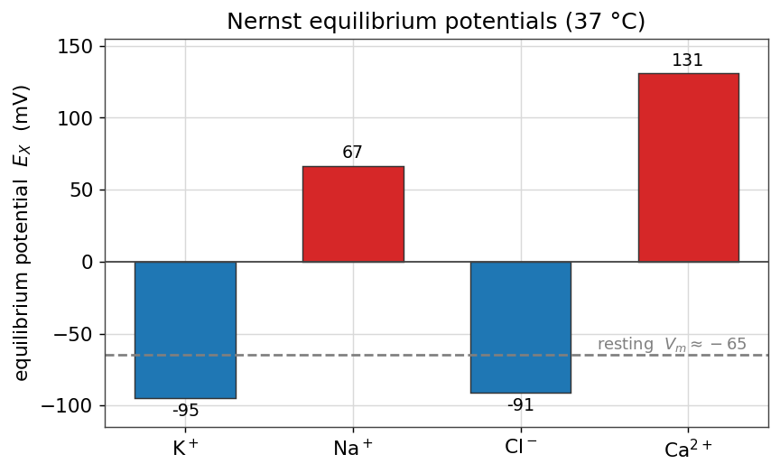
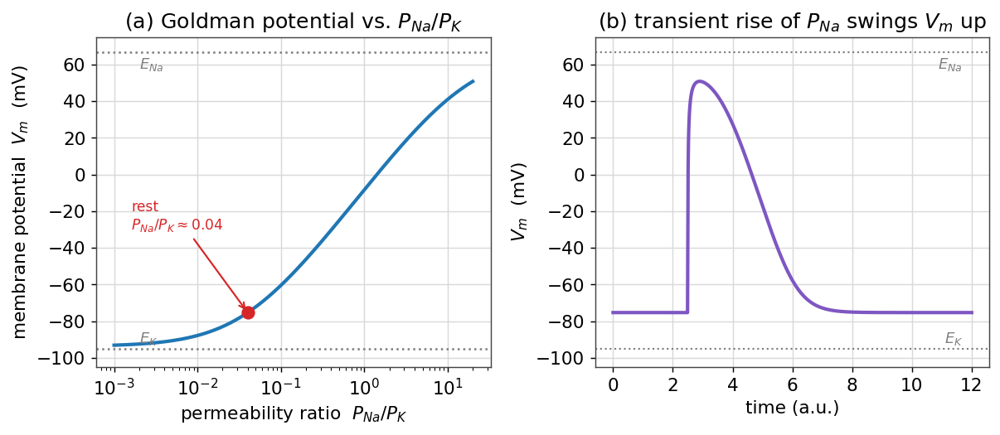
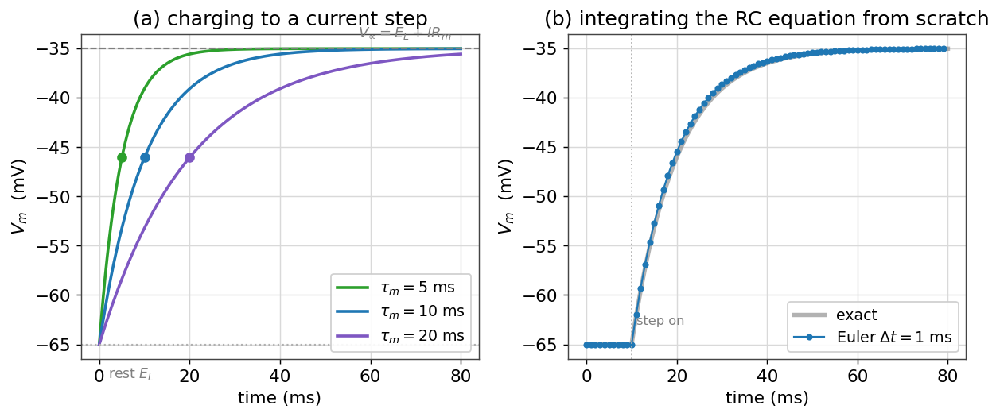
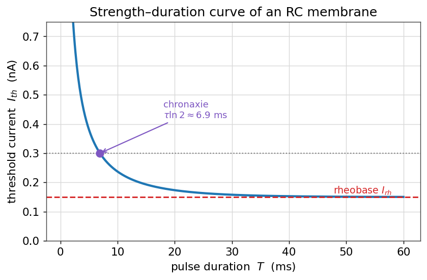

# پتانسیل غشا: نگاهی محاسباتی

در فصلِ [غشای تحریک‌پذیر](ch-biophys-01-excitable-membrane.md) پتانسیل استراحت، معادلهٔ نرنست، معادلهٔ گلدمن و مدارِ معادلِ غشا را به‌صورتِ کیفی و با استخراجِ روی کاغذ دیدیم. اکنون همان مفاهیم را **با کد** بازمی‌سازیم. هدف این است که از فرمول‌ها فراتر برویم و با چند خط پایتون، اعداد را خودمان تولید کنیم، رفتارِ آن‌ها را با تغییرِ پارامترها بکاویم، و مدارِ غشا را از صفر انتگرال‌گیری کنیم. این فصل، پلی است میان بیوفیزیکِ کیفیِ فصل اول و مدل‌های کمّیِ نورون در فصل‌های بعد.

!!! note "در این فصل چه می‌آموزید"
    - پتانسیل تعادلِ نرنست را برای یون‌های اصلی با پایتون محاسبه می‌کنید و جدولِ فصل اول را بازتولید می‌کنید.
    - با معادلهٔ گلدمن می‌بینید که پتانسیل غشا چگونه با **نسبتِ نفوذپذیری‌ها** میان $E_{\text{K}}$ و $E_{\text{Na}}$ حرکت می‌کند.
    - مدارِ **RC غشا** را با روشِ اویلر از صفر حل می‌کنید و پاسخِ پله‌ای و ثابت‌زمانیِ $\tau_m$ را می‌بینید.
    - مفهومِ آستانه را وارد می‌کنید و منحنیِ **شدت–مدت** (رئوبیس و کروناکسی) را می‌سازید.

!!! tip "پیش‌نیازها"
    برای این فصل خوب است با انتگرال‌گیریِ عددیِ معادلات دیفرانسیل (روشِ اویلر) که در فصلِ [حل عددی معادلات دیفرانسیل معمولی](../ch-num-06-ode.md) آمده آشنا باشید. همهٔ کدها تنها به `numpy` و `matplotlib` نیاز دارند.

## معادلهٔ نرنست با کد

معادلهٔ نرنست، پتانسیل تعادلِ یک یون منفرد را بر حسب نسبتِ غلظت‌های دو سوی غشا می‌دهد:

$$
E_X = \frac{RT}{zF}\,\ln\frac{[X]_{\text{out}}}{[X]_{\text{in}}}.
$$

بیایید این رابطه را مستقیماً به کد ترجمه کنیم. نخست ثابت‌های فیزیکی و غلظت‌ها را (همان جدولِ فصل اول) وارد می‌کنیم:

```python
import numpy as np

R = 8.314       # gas constant, J/(K mol)
F = 96485.0     # Faraday constant, C/mol
T = 310.0       # body temperature, K

# each ion: (concentration outside, inside) in mM, and valence z
ions = {
    "K":  dict(out=4.0,   inn=140.0,  z=+1),
    "Na": dict(out=145.0, inn=12.0,   z=+1),
    "Cl": dict(out=120.0, inn=4.0,    z=-1),
    "Ca": dict(out=1.8,   inn=1e-4,   z=+2),
}

def nernst(out, inn, z):
    """Equilibrium potential in mV."""
    return (R * T) / (z * F) * np.log(out / inn) * 1e3   # V -> mV
```

توجه کنید که ضریبِ $RT/F$ در دمای بدن ($T=310$ کلوین) برابرِ حدودِ $26.7$ میلی‌ولت است؛ ضربِ در $\ln 10 \approx 2.303$ همان ضریبِ آشنای $\approx 61.5$ میلی‌ولتِ فصل اول را می‌دهد که با لگاریتمِ ده‌دهی به کار می‌رفت. حالا تابع را روی همهٔ یون‌ها اجرا می‌کنیم:

```python
for name, c in ions.items():
    E = nernst(c["out"], c["inn"], c["z"])
    print(f"E_{name:2s} = {E:6.1f} mV")
```

خروجی چنین است:

```text
E_K  =  -95.0 mV
E_Na =   66.6 mV
E_Cl =  -90.9 mV
E_Ca =  130.9 mV
```

این دقیقاً همان جدولی است که در فصل اول روی کاغذ به‌دست آوردیم. مقایسهٔ این پتانسیل‌های تعادل با پتانسیل استراحتِ نوعی (حدود ۶۵− میلی‌ولت) گویاست: پتانسیل استراحت به $E_{\text{K}}$ نزدیک است، که نشانهٔ غلبهٔ نفوذپذیریِ پتاسیم در حالت استراحت است.

<figure markdown="span">
  
  <figcaption>پتانسیل‌های تعادلِ نرنستِ یون‌های اصلی در دمای بدن، محاسبه‌شده با کد. یون‌هایی که در بیرون غلیظ‌ترند (سدیم، کلسیم) پتانسیل تعادلِ مثبت و پتاسیم پتانسیل تعادلِ منفی دارد؛ خطِ خاکستری، پتانسیل استراحتِ نوعی را نشان می‌دهد که به $E_K$ نزدیک است.</figcaption>
</figure>

## معادلهٔ گلدمن: حرکتِ پتانسیل غشا

معادلهٔ نرنست تنها به یک یون می‌پردازد. اما پتانسیل استراحتِ واقعی، حاصلِ سهمِ هم‌زمانِ چند یون است که با **نفوذپذیریِ** هرکدام وزن می‌خورد. معادلهٔ گلدمن–هاجکین–کاتز برای سه یونِ اصلی چنین است:

$$
V_m = \frac{RT}{F}\,\ln\frac{P_{\text{K}}[\text{K}^+]_{\text{out}} + P_{\text{Na}}[\text{Na}^+]_{\text{out}} + P_{\text{Cl}}[\text{Cl}^-]_{\text{in}}}{P_{\text{K}}[\text{K}^+]_{\text{in}} + P_{\text{Na}}[\text{Na}^+]_{\text{in}} + P_{\text{Cl}}[\text{Cl}^-]_{\text{out}}}.
$$

آن را به کد می‌آوریم. تنها نسبتِ نفوذپذیری‌ها مهم است، پس $P_{\text{K}}$ را برابرِ $1$ می‌گیریم و بقیه را نسبت به آن می‌سنجیم:

```python
def goldman(PK, PNa, PCl):
    """Goldman resting potential in mV, given relative permeabilities."""
    Ko, Ki = ions["K"]["out"],  ions["K"]["inn"]
    Nao, Nai = ions["Na"]["out"], ions["Na"]["inn"]
    Clo, Cli = ions["Cl"]["out"], ions["Cl"]["inn"]
    num = PK*Ko + PNa*Nao + PCl*Cli
    den = PK*Ki + PNa*Nai + PCl*Clo
    return (R * T / F) * np.log(num / den) * 1e3

# resting: potassium dominates
print(goldman(1.0, 0.04, 0.45))   # ~ -75 mV
```

با نسبتِ نوعیِ حالت استراحت، $P_{\text{K}} : P_{\text{Na}} : P_{\text{Cl}} = 1 : 0.04 : 0.45$، پتانسیل غشا حدودِ ۷۵− میلی‌ولت درمی‌آید — نزدیک به $E_{\text{K}}$، همان‌طور که انتظار داشتیم. (مقدارِ دقیق به نسبتِ نفوذپذیری‌های فرض‌شده حساس است؛ با کاستنِ سهمِ کلر یا افزودنِ اندکی نشتِ سدیم، به مقدارِ متعارف‌ترِ حدود ۷۰− میلی‌ولت نزدیک‌تر می‌شویم.)

جالب‌ترین کارِ این معادله وقتی آشکار می‌شود که نفوذپذیری‌ها را **جاروب** کنیم. بیایید ببینیم پتانسیل غشا با تغییرِ نسبتِ $P_{\text{Na}}/P_{\text{K}}$ از مقادیرِ بسیار کوچک تا بزرگ، چگونه حرکت می‌کند:

```python
ratios = np.logspace(-3, 1.3, 300)        # P_Na / P_K
V = [goldman(1.0, r, 0.45) for r in ratios]
```

<figure markdown="span">
  
  <figcaption>(الف) پتانسیل غشا از معادلهٔ گلدمن به‌عنوان تابعی از نسبتِ نفوذپذیریِ $P_{Na}/P_K$. در نسبت‌های کوچک، پتانسیل به $E_K$ می‌چسبد؛ با بزرگ‌شدنِ نسبت، به سمتِ $E_{Na}$ می‌رود. نقطهٔ قرمز، حالت استراحت است. (ب) اگر نفوذپذیریِ سدیم به‌طور گذرا بالا برود (چنان‌که در پتانسیل عمل رخ می‌دهد)، پتانسیل غشا به‌سرعت به سمتِ $E_{Na}$ می‌جهد و سپس بازمی‌گردد.</figcaption>
</figure>

این تصویر، جوهرِ پتانسیل عمل را به‌صورتِ کمّی نشان می‌دهد: پتانسیل غشا چیزی نیست جز یک **میانگینِ وزن‌دار** میانِ پتانسیل‌های تعادلِ یون‌ها، که وزن‌ها همان نفوذپذیری‌ها هستند. هر رویدادی که نفوذپذیریِ نسبی را تغییر دهد — مثلاً بازشدنِ کانال‌های سدیمیِ وابسته به ولتاژ — پتانسیل غشا را جابه‌جا می‌کند. در فصلِ [مدل هاجکین–هاکسلی](../ch03.md) خواهیم دید که همین نفوذپذیری‌ها خودشان به ولتاژ و زمان وابسته‌اند، و همین وابستگی است که پتانسیل عمل را می‌سازد.

!!! info "پیشرفته (اختیاری): معادلهٔ جریانِ GHK"
    معادلهٔ گلدمن، حالتِ پایای پتانسیل را می‌دهد. اگر بخواهیم **جریانِ** عبوریِ یک یون را در ولتاژِ دلخواه بدانیم، به رابطهٔ جریانِ گلدمن–هاجکین–کاتز می‌رسیم:

    $$
    I_X = P_X\,z^2\frac{F^2}{RT}\,V\,\frac{[X]_{\text{in}} - [X]_{\text{out}}\,e^{-zFV/RT}}{1 - e^{-zFV/RT}}.
    $$

    بر خلافِ رابطهٔ خطیِ اهمی $I = g(V-E)$، این رابطه به‌سببِ شیبِ غلظتیِ نامتقارن، یک منحنیِ جریان–ولتاژِ **غیرخطی** (یکسوکننده) می‌دهد. برای بسیاری از کاربردها همان تقریبِ خطیِ اهمی کافی است، اما برای یون‌هایی با شیبِ غلظتیِ بسیار بزرگ (مانند کلسیم) شکلِ GHK دقیق‌تر است.

## غشا به‌مثابهٔ مدارِ RC: انتگرال‌گیری از صفر

تا اینجا حالت‌های ایستا را بررسی کردیم. اما رفتارِ **دینامیکیِ** ولتاژ غشا را موازنهٔ جریان تعیین می‌کند، همان معادله‌ای که در فصل اول معرفی شد. برای یک تکه‌غشای بدونِ کانالِ فعال (یک نورونِ **منفعل** یا زیرآستانه)، جریانِ یونی تنها جریانِ نشتی است و معادله چنین می‌شود:

$$
C_m\,\frac{dV}{dt} = -\,g_L\,(V - E_L) + I_{\text{ext}},
$$

که در آن $g_L = 1/R_m$ رساناییِ نشتی، $E_L$ پتانسیل استراحت و $I_{\text{ext}}$ جریانِ تزریقی است. این یک معادلهٔ دیفرانسیلِ خطیِ مرتبهٔ اول است؛ آن را با روشِ **اویلرِ پیشرو** حل می‌کنیم — دقیقاً همان روشی که در فصلِ مدل هاجکین–هاکسلی برای دستگاهِ کامل به کار می‌رود.

```python
import numpy as np
import matplotlib.pyplot as plt

# membrane parameters (mV, ms, nA, MΩ)
EL = -65.0        # resting / leak reversal potential (mV)
Rm = 100.0        # membrane resistance (MΩ)
tau = 10.0        # membrane time constant (ms)  -> Cm = tau/Rm
Cm = tau / Rm     # capacitance in nF  (tau[ms] = Rm[MΩ]*Cm[nF])

def I_ext(t):
    return 0.30 if t >= 10.0 else 0.0    # a 0.3 nA current step at t = 10 ms

# forward-Euler integration, written out explicitly
dt, T = 1.0, 80.0
steps = int(T / dt)
t = np.arange(steps) * dt
V = np.zeros(steps)
V[0] = EL
for k in range(steps - 1):
    dV = (-(V[k] - EL) / Rm + I_ext(t[k])) / Cm
    V[k + 1] = V[k] + dt * dV
```

قلبِ کار، همان یک خط به‌روزرسانیِ اویلر است. مقدارِ نهایی که ولتاژ به آن میل می‌کند، از قرار دادنِ $dV/dt=0$ به‌دست می‌آید: $V_\infty = E_L + I_{\text{ext}}R_m$. با $I=0.3$ نانوآمپر و $R_m=100$ مگااهم، جابه‌جاییِ نهایی $0.3\times100=30$ میلی‌ولت است، یعنی ولتاژ از ۶۵− به حدودِ ۳۵− میلی‌ولت می‌رسد.

<figure markdown="span">
  
  <figcaption>(الف) پاسخِ پله‌ای مدارِ RC غشا برای سه ثابت‌زمانیِ مختلف؛ ولتاژ به‌صورتِ نمایی به مقدارِ نهایی $V_\infty=E_L+I R_m$ می‌رسد و در $t=\tau_m$ حدودِ ۶۳٪ مسیر را پیموده است (نقطه‌ها). (ب) مقایسهٔ حلِ عددیِ اویلر (نقطه‌ها) با جوابِ دقیقِ نمایی (خاکستری)؛ حتی با گامِ درشتِ ۱ میلی‌ثانیه، تطابق خوب است.</figcaption>
</figure>

### ثابت‌زمانیِ غشا

پاسخِ پله‌ایِ این مدار جوابِ تحلیلیِ ساده‌ای دارد:

$$
V(t) = V_\infty + (V_0 - V_\infty)\,e^{-t/\tau_m},
\qquad \tau_m = R_m C_m.
$$

ثابت‌زمانیِ $\tau_m$، مقیاسِ زمانیِ حافظهٔ غشاست: هرچه بزرگ‌تر باشد، غشا کندتر به تغییراتِ جریان پاسخ می‌دهد و ورودی‌ها را روی بازهٔ زمانیِ طولانی‌تری «جمع» می‌کند. در $t=\tau_m$، ولتاژ دقیقاً $1-e^{-1}\approx 63\%$ راهِ خود تا مقدارِ نهایی را پیموده است. پنلِ (الف) بالا این را برای سه مقدارِ $\tau_m$ نشان می‌دهد: غشای با ثابت‌زمانیِ کوچک تند شارژ می‌شود و غشای با ثابت‌زمانیِ بزرگ کند.

!!! tip "پیوند با پردازش سیگنال"
    مدارِ RC غشا در واقع یک **صافیِ پایین‌گذر** است: تغییراتِ کندِ ورودی را بی‌کم‌وکاست عبور می‌دهد اما نوسان‌های تندتر از $1/\tau_m$ را تضعیف می‌کند. همین ایده در فصلِ [فیلترها](../ch-signal-04-filters.md) به‌صورتِ عمومی بررسی می‌شود؛ غشای نورون، نمونه‌ای فیزیکی از یک صافیِ RC است.

## آستانه و منحنیِ شدت–مدت

مدلِ منفعلِ بالا هرگز شلیک نمی‌کند؛ تنها به‌صورتِ نمایی شارژ و دشارژ می‌شود. اما اگر یک **آستانهٔ** ساده اضافه کنیم — بگوییم هرگاه ولتاژ از $V_{\text{th}}$ بگذرد یک اسپایک رخ می‌دهد — می‌توانیم پرسشی کلاسیک را بکاویم: برای برانگیختنِ اسپایک، یک پالسِ جریان با مدتِ $T$ باید چه شدتی داشته باشد؟

از جوابِ پله‌ای، ولتاژ در پایانِ یک پالسِ به مدتِ $T$ و شدتِ $I$ برابر است با $V(T) = E_L + I R_m\,(1 - e^{-T/\tau_m})$. آستانه وقتی می‌رسد که $V(T)=V_{\text{th}}$؛ با حل بر حسبِ $I$:

$$
I_{\text{th}}(T) = \frac{I_{\text{rh}}}{1 - e^{-T/\tau_m}},
\qquad I_{\text{rh}} = \frac{V_{\text{th}} - E_L}{R_m}.
$$

این رابطه، **منحنیِ شدت–مدت** نام دارد. دو کمیتِ کلیدی از آن بیرون می‌آید:

* **رئوبیس** ($I_{\text{rh}}$): کمینه‌جریانی که حتی با پالسِ بی‌نهایت طولانی برای رسیدن به آستانه لازم است. برای پالس‌های کوتاه، جریانِ لازم بسیار بزرگ‌تر از رئوبیس است.
* **کروناکسی**: مدتِ پالسی که در آن، جریانِ آستانه برابرِ **دو برابرِ** رئوبیس می‌شود. با حلِ رابطهٔ بالا به‌دست می‌آید $t_{\text{ch}} = \tau_m\ln 2$، که آن را به ثابت‌زمانیِ غشا پیوند می‌زند.

```python
EL, Vth, Rm, tau = -65.0, -50.0, 100.0, 10.0
I_rheo = (Vth - EL) / Rm                 # rheobase (nA)
T = np.linspace(0.5, 60, 400)            # pulse duration (ms)
I_th = I_rheo / (1 - np.exp(-T / tau))
chronaxie = tau * np.log(2)              # ~ 6.9 ms
```

<figure markdown="span">
  
  <figcaption>منحنیِ شدت–مدتِ یک غشای RC با آستانه. پالس‌های کوتاه به جریانِ بسیار بزرگ نیاز دارند؛ با بلندترشدنِ پالس، جریانِ آستانه به رئوبیس (خط‌چینِ قرمز) میل می‌کند. کروناکسی، مدتی است که در آن جریانِ آستانه دو برابرِ رئوبیس است و برابرِ $\tau_m\ln 2$ درمی‌آید.</figcaption>
</figure>

این منحنی، بیش از یک صد سال است که در فیزیولوژی و در تحریکِ الکتریکیِ بافت (از تحریکِ عصب تا ضربان‌سازِ قلبی) به کار می‌رود، و زیبایی‌اش در این است که تماماً از همان مدارِ سادهٔ RC + آستانه بیرون می‌آید. در فصلِ [مدل‌های ساده‌شده: LIF، EIF، AdEx](../ch04.md) همین ایدهٔ «RC + آستانه» را به یک مدلِ شلیک‌کنندهٔ کامل گسترش می‌دهیم.

## جمع‌بندی

در این فصل، مفاهیمِ کیفیِ فصل اول را به محاسبه تبدیل کردیم. دیدیم که پتانسیل نرنست تنها یک خط کد است؛ که معادلهٔ گلدمن پتانسیل غشا را به‌صورتِ میانگینِ وزن‌دارِ نفوذپذیری‌ها میان $E_{\text{K}}$ و $E_{\text{Na}}$ می‌راند؛ و که مدارِ RC غشا را می‌توان با روشِ اویلر از صفر انتگرال‌گیری کرد تا پاسخِ پله‌ای، ثابت‌زمانی و منحنیِ شدت–مدت را ساخت. همهٔ این‌ها بلوک‌های سازنده‌ای هستند که در فصل‌های بعد، هنگام افزودنِ کانال‌های وابسته به ولتاژ، دوباره ظاهر می‌شوند.

## تمرین‌ها

!!! question "تمرینِ ۱ — حساسیتِ نرنست به دما"
    تابعِ `nernst` را طوری تغییر دهید که دمای $T$ را به‌عنوان ورودی بگیرد. پتانسیل تعادلِ پتاسیم را در دمای اتاق ($T=293$ کلوین) و دمای بدن ($T=310$ کلوین) حساب کنید. تفاوت چقدر است و چرا؟

    ??? success "راهِ‌حل"
        چون $E_X \propto T$، نسبتِ دو مقدار برابرِ $293/310 \approx 0.945$ است. پس $E_{\text{K}}$ در دمای اتاق حدودِ ۵٪ کوچک‌تر (به‌قدرِ مطلق) می‌شود: از حدودِ ۹۵− به حدودِ ۹۰− میلی‌ولت. وابستگیِ خطی به دما، از حضورِ $T$ در ضریبِ $RT/zF$ می‌آید.

!!! question "تمرینِ ۲ — پایداریِ روشِ اویلر"
    کدِ انتگرال‌گیریِ RC را با گام‌های $\Delta t = 1, 5, 10, 25$ میلی‌ثانیه (با $\tau_m=10$) اجرا کنید. در کدام گام جواب هنوز درست است و در کدام واگرا یا نادرست می‌شود؟ رابطهٔ این با $\tau_m$ چیست؟

    ??? success "راهِ‌حل"
        روشِ اویلرِ پیشرو برای معادلهٔ $\dot V = -(V-E_L)/\tau_m$ تنها وقتی پایدار است که $\Delta t < 2\tau_m$. برای $\tau_m=10$، گام‌های ۱ و ۵ خوب کار می‌کنند، گامِ ۱۰ در مرزِ دقت است، و گامِ ۲۵ (که از $2\tau_m=20$ بزرگ‌تر است) به نوسان‌های واگرا و بی‌معنا می‌انجامد. این همان محدودیتِ پایداری است که در فصلِ روش‌های عددی بحث شد؛ برای مدل‌های سفت‌تر (مانند HH) گامِ بسیار کوچک‌تری لازم است.

!!! question "تمرینِ ۳ — کروناکسی و ثابت‌زمانی"
    نشان دهید که کروناکسی برابرِ $\tau_m\ln 2$ است. سپس توضیح دهید چرا اندازه‌گیریِ کروناکسیِ یک بافت، راهی غیرمستقیم برای برآوردِ ثابت‌زمانیِ غشای آن است.

    ??? success "راهِ‌حل"
        در کروناکسی، $I_{\text{th}}=2I_{\text{rh}}$. با قرار دادن در رابطهٔ شدت–مدت: $2 = 1/(1-e^{-t_{\text{ch}}/\tau_m})$، پس $1-e^{-t_{\text{ch}}/\tau_m}=1/2$، یعنی $e^{-t_{\text{ch}}/\tau_m}=1/2$ و در نتیجه $t_{\text{ch}}=\tau_m\ln 2 \approx 0.69\,\tau_m$. چون کروناکسی متناسب با $\tau_m$ است، اندازه‌گیریِ آن (که تنها به دو پالسِ تجربی نیاز دارد) ثابت‌زمانیِ غشا را بدونِ نیاز به ثبتِ کاملِ پاسخِ پله‌ای می‌دهد.

---

برای مطالعهٔ بیشتر:

<div dir="ltr" markdown>
- Dayan, P., Abbott, L.F., 2005. Theoretical Neuroscience, ch. 5. MIT Press.
- Sterratt, D., Graham, B., Gillies, A., Willshaw, D., 2011. Principles of Computational Modelling in Neuroscience, ch. 2–3. Cambridge University Press.
- Hodgkin, A.L., Rushton, W.A.H., 1946. The electrical constants of a crustacean nerve fibre. Proc. R. Soc. Lond. B 133, 444–479.
- Koch, C., 1999. Biophysics of Computation. Oxford University Press.
</div>
