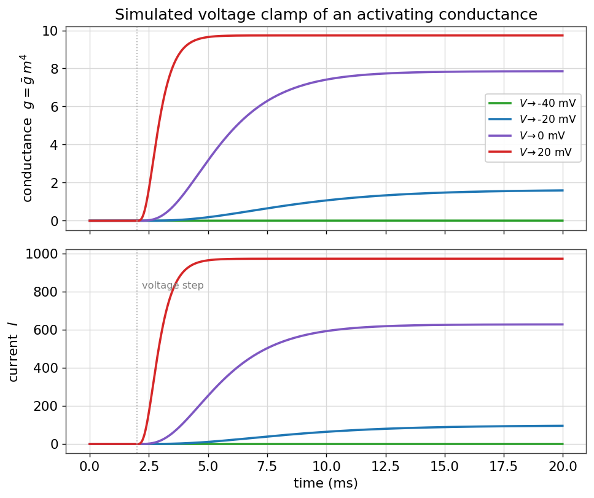
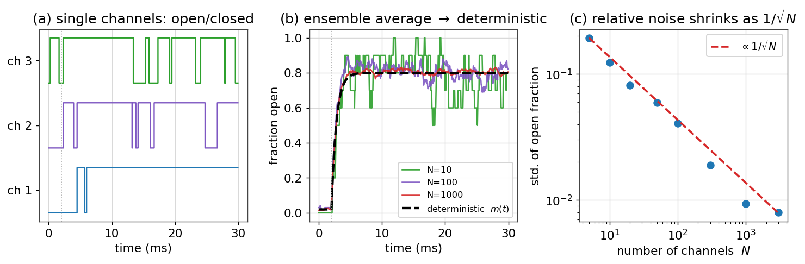

# کانال‌های یونی و دریچه‌گذاری

در فصلِ [غشای تحریک‌پذیر](ch-biophys-01-excitable-membrane.md) دیدیم که کانال‌های یونی میان حالت‌های «باز» و «بسته» جابه‌جا می‌شوند و همین دریچه‌گذاری، پایهٔ پتانسیل عمل است. در این فصل، این جابه‌جایی را **کمّی** می‌کنیم: یاد می‌گیریم که چگونه با یک **متغیر دروازه‌ای** و یک معادلهٔ آهنگِ ساده، رفتارِ یک جمعیت از کانال‌ها را توصیف کنیم، چگونه رساناییِ وابسته به ولتاژ را در یک آزمایشِ تثبیت ولتاژ شبیه‌سازی کنیم، و چرا با آنکه تک‌کانال‌ها ذاتاً **تصادفی** رفتار می‌کنند، در حدِ تعدادِ زیاد به یک رساناییِ هموارِ قطعی می‌رسیم. این فصل، پلِ مستقیم به مدل هاجکین–هاکسلی است.

!!! note "در این فصل چه می‌آموزید"
    - یک **متغیر دروازه‌ای** و معادلهٔ آهنگِ $\dot x = \alpha(V)(1-x) - \beta(V)x$ را می‌سازید و به شکلِ $\dot x = (x_\infty - x)/\tau_x$ بازمی‌نویسید.
    - منحنی‌های **فعال‌سازی و غیرفعال‌سازیِ** بولتزمان و ثابت‌زمانی‌های وابسته به ولتاژ را رسم می‌کنید.
    - یک آزمایشِ **تثبیت ولتاژ** را شبیه‌سازی می‌کنید و می‌بینید چگونه رسانایی با پله‌های ولتاژ روشن می‌شود.
    - با یک مدلِ **مارکفِ تصادفی**، تک‌کانال‌ها را شبیه‌سازی می‌کنید و می‌بینید که میانگینِ جمعیتی به حدِ قطعی و نوفه به‌صورتِ $1/\sqrt{N}$ کوچک می‌شود.

## یک متغیر دروازه‌ای

تصور کنید جمعیتِ بزرگی از کانال‌های هم‌نوع در یک تکه‌غشا داریم. به‌جای دنبال‌کردنِ تک‌تکِ آن‌ها، یک کمیتِ واحد را دنبال می‌کنیم: $x$، یعنی **کسری از کانال‌ها که دروازه‌شان باز است** (یا هم‌ارز با آن، احتمالِ بازبودنِ یک دروازهٔ منفرد). این $x$ میانِ صفر و یک است.

فرض کنید هر دروازه با آهنگِ $\alpha(V)$ از حالتِ بسته به باز و با آهنگِ $\beta(V)$ از باز به بسته می‌رود. آهنگِ خالصِ تغییرِ کسرِ باز، برابرِ «آهنگِ بازشدنِ بسته‌ها منهای آهنگِ بسته‌شدنِ بازها» است:

$$
\frac{dx}{dt} = \alpha(V)\,(1-x) - \beta(V)\,x.
$$

این همان معادله‌ای است که هاجکین و هاکسلی برای هر متغیر دروازه‌ای نوشتند. نکتهٔ کلیدی این است که آهنگ‌ها به **ولتاژ** بستگی دارند؛ همین وابستگی است که کانال را «وابسته به ولتاژ» می‌کند.

### حالت پایا و ثابت‌زمانی

این معادلهٔ خطیِ مرتبهٔ اول را می‌توان به شکلی گویاتر بازنوشت. اگر تعریف کنیم

$$
x_\infty(V) = \frac{\alpha(V)}{\alpha(V) + \beta(V)},
\qquad
\tau_x(V) = \frac{1}{\alpha(V) + \beta(V)},
$$

آنگاه معادله به‌صورتِ زیر درمی‌آید:

$$
\frac{dx}{dt} = \frac{x_\infty(V) - x}{\tau_x(V)}.
$$

تفسیرِ این فرم روشن است: در هر ولتاژِ ثابت، متغیرِ دروازه‌ای با ثابت‌زمانیِ $\tau_x(V)$ به‌صورتِ نمایی به سمتِ مقدارِ تعادلیِ $x_\infty(V)$ میل می‌کند. پس تنها کافی است این دو تابعِ وابسته به ولتاژ را بشناسیم.

در عمل، $x_\infty(V)$ اغلب به‌خوبی با یک **تابعِ بولتزمان** (سیگموئید) توصیف می‌شود:

$$
x_\infty(V) = \frac{1}{1 + e^{-(V - V_{1/2})/k}},
$$

که در آن $V_{1/2}$ ولتاژی است که در آن نیمی از کانال‌ها بازند، و $k$ شیبِ گذار را تعیین می‌کند. برای یک دروازهٔ **فعال‌ساز** (مانند $m$ در سدیم) $k>0$ است و منحنی با دپلاریزه‌شدن بالا می‌رود؛ برای یک دروازهٔ **غیرفعال‌ساز** (مانند $h$) $k<0$ است و منحنی با دپلاریزه‌شدن پایین می‌آید.

```python
import numpy as np
import matplotlib.pyplot as plt

def boltzmann(V, Vhalf, k):
    return 1.0 / (1.0 + np.exp(-(V - Vhalf) / k))

V = np.linspace(-90, 40, 400)
m_inf = boltzmann(V, Vhalf=-25, k=+9)   # activation gate
h_inf = boltzmann(V, Vhalf=-45, k=-7)   # inactivation gate
```

<figure markdown="span">
  
  <figcaption>(الف) منحنی‌های حالت پایای فعال‌سازی ($m_\infty$، آبی) و غیرفعال‌سازی ($h_\infty$، قرمز) به‌صورتِ توابعِ بولتزمان. ناحیهٔ هم‌پوشانیِ آن‌ها، حاصل‌ضربِ $m_\infty h_\infty$ (بنفش)، «پنجرهٔ» جریانی است که در آن هم فعال‌سازی و هم عدم‌غیرفعال‌سازی به‌قدرِ کافی وجود دارد. (ب) ثابت‌زمانی‌های وابسته به ولتاژ؛ دروازهٔ فعال‌سازِ $m$ سریع‌تر (ثابت‌زمانیِ کوچک‌تر) از دروازهٔ غیرفعال‌سازِ $h$ است.</figcaption>
</figure>

نکتهٔ ظریف در پنلِ (الف)، ناحیهٔ **پنجرهٔ جریان** است: در بازه‌ای از ولتاژ که هم $m_\infty$ و هم $h_\infty$ ناصفرند، کانال به‌طور پایدار مقداری جریان می‌گذراند. همین «جریانِ پنجره‌ای» در بسیاری از نورون‌ها نقشِ مهمی در رفتارِ زیرآستانه دارد.

## توانِ دروازه‌ها

هاجکین و هاکسلی با برازشِ داده‌ها دریافتند که رساناییِ یک کانال، نه به یک دروازه، بلکه به **حاصل‌ضربِ چند دروازهٔ مستقل** بستگی دارد. اگر یک کانال $p$ دروازهٔ همسانِ فعال‌ساز داشته باشد که همه باید باز باشند، احتمالِ بازبودنِ کانال برابرِ $x^p$ است و رسانایی چنین می‌شود:

$$
g(V,t) = \bar g\, x^p,
$$

که $\bar g$ بیشینهٔ رسانایی است. برای مثال، کانال پتاسیمِ HH با $n^4$ (چهار دروازهٔ فعال‌ساز) و کانال سدیم با $m^3 h$ (سه فعال‌ساز و یک غیرفعال‌ساز) مدل می‌شود. توانِ بالاتر، شروعِ رسانایی را **تیزتر و با تأخیرِ بیشتر** می‌کند، چون همهٔ دروازه‌ها باید هم‌زمان باز شوند.

## شبیه‌سازیِ تثبیت ولتاژ

برای دیدنِ این دینامیک در عمل، همان آزمایشی را شبیه‌سازی می‌کنیم که هاجکین و هاکسلی انجام دادند: **تثبیت ولتاژ**. ولتاژ را از یک مقدارِ نگه‌دارِ منفی ناگهان به مقادیرِ مختلف می‌پرانیم و رساناییِ (و جریانِ) کانال را دنبال می‌کنیم. کانالِ ما یک رساناییِ فعال‌سازِ نوعِ پتاسیمی است ($g = \bar g\,m^4$).

```python
gbar, E, p = 10.0, -80.0, 4        # K-like conductance
Vhold = -75.0
dt, T = 0.02, 20.0
steps = int(T / dt); t = np.arange(steps) * dt

def tau_m(V):   # bell-shaped time constant (ms)
    return 0.3 + 3.2 * np.exp(-((V + 20) / 24) ** 2)

for Vstep in [-40, -20, 0, 20]:
    m = np.zeros(steps); m[0] = boltzmann(Vhold, -25, 9)
    I = np.zeros(steps)
    for k in range(steps - 1):
        V = Vstep if t[k] >= 2.0 else Vhold        # step at t = 2 ms
        m_inf = boltzmann(V, -25, 9)
        m[k + 1] = m[k] + dt * (m_inf - m[k]) / tau_m(V)
        I[k] = gbar * m[k] ** p * (V - E)
    plt.plot(t, I, label=f"V -> {Vstep} mV")
```

<figure markdown="span">
  
  <figcaption>شبیه‌سازیِ تثبیت ولتاژِ یک رساناییِ فعال‌ساز. با هر پلهٔ دپلاریزه‌کننده، رسانایی $g=\bar g\,m^4$ (بالا) با یک تأخیرِ سیگموئیدی روشن می‌شود؛ هرچه پله بزرگ‌تر باشد، رسانایی سریع‌تر و کامل‌تر بالا می‌رود. جریانِ متناظر (پایین) حاصل‌ضربِ این رسانایی در نیرویِ محرکهٔ $V-E$ است. شکلِ سیگموئیدیِ آغاز، امضای توانِ $m^4$ است.</figcaption>
</figure>

این همان داده‌هایی است که هاجکین و هاکسلی از آکسونِ ماهی مرکب به‌دست آوردند و از رویِ آن‌ها توابعِ آهنگ را برازش دادند. کلِ مدل هاجکین–هاکسلی، که در فصلِ [مدل هاجکین–هاکسلی](../ch03.md) از صفر می‌سازیم، چیزی جز کنار هم گذاشتنِ چند تا از همین متغیرهای دروازه‌ای نیست.

## کانال‌ها در واقع تصادفی‌اند

تا اینجا $x$ را یک کمیتِ هموار و **قطعی** گرفتیم. اما این یک تقریب است. یک تک‌کانال در هر لحظه یا کاملاً باز است یا کاملاً بسته؛ گذارها میان این دو حالت، رویدادهایی **تصادفی** با احتمالِ معیّن در واحدِ زمان‌اند. متغیرِ هموارِ $x$، تنها **میانگینِ** رفتارِ یک جمعیتِ بزرگ از این کانال‌های تصادفی است.

برای دیدنِ این موضوع، ساده‌ترین کانال را در نظر می‌گیریم: یک مدلِ **مارکفِ دو‌حالته** با حالت‌های بسته (C) و باز (O) و آهنگ‌های گذارِ $\alpha$ (بسته به باز) و $\beta$ (باز به بسته). در هر گامِ زمانیِ کوچکِ $\Delta t$، یک کانالِ بسته با احتمالِ $\alpha\,\Delta t$ باز می‌شود و یک کانالِ باز با احتمالِ $\beta\,\Delta t$ بسته می‌شود. این را برای $N$ کانال شبیه‌سازی می‌کنیم:

```python
rng = np.random.default_rng(0)

def simulate_channels(N, alpha, beta, dt=0.05, T=30.0):
    steps = int(T / dt)
    state = np.zeros(N, dtype=int)          # 0 = closed, 1 = open
    frac_open = np.zeros(steps)
    for k in range(steps):
        frac_open[k] = state.mean()
        r = rng.random(N)
        # closed channels may open; open channels may close
        opening = (state == 0) & (r < alpha * dt)
        closing = (state == 1) & (r < beta * dt)
        state[opening] = 1
        state[closing] = 0
    return frac_open
```

مقدارِ تعادلیِ کسرِ باز، همان $x_\infty = \alpha/(\alpha+\beta)$ و ثابت‌زمانیِ رسیدن به آن $\tau = 1/(\alpha+\beta)$ است — دقیقاً همان کمیت‌هایی که در نسخهٔ قطعی داشتیم. حالا نتیجه را برای تعدادهای مختلفِ کانال مقایسه می‌کنیم:

<figure markdown="span">
  
  <figcaption>(الف) رفتارِ سه تک‌کانالِ منفرد: هر کدام به‌صورتِ تصادفی میان باز و بسته می‌پرد. (ب) میانگینِ کسرِ بازِ یک جمعیت با افزایشِ تعدادِ کانال‌ها ($N$) به منحنیِ قطعیِ $m(t)$ (خط‌چینِ سیاه) نزدیک‌تر می‌شود. (ج) دامنهٔ نوسان‌های تصادفیِ حولِ میانگین، به‌صورتِ $1/\sqrt{N}$ کوچک می‌شود؛ محورهای لگاریتمی این قانونِ توانی را به یک خطِ راست تبدیل کرده‌اند.</figcaption>
</figure>

سه درسِ مهم از این تصویر بیرون می‌آید. نخست، تک‌کانال‌ها ذاتاً نوفه‌ای‌اند و رفتارشان تنها با احتمال قابلِ توصیف است. دوم، **میانگینِ** جمعیتی به همان متغیرِ هموارِ قطعیِ $x$ همگرا می‌شود؛ پس مدلِ هاجکین–هاکسلی را می‌توان به‌عنوانِ حدِ تعدادِ زیادِ کانال فهمید. سوم، اندازهٔ نسبیِ نوفه با $1/\sqrt{N}$ کوچک می‌شود — همان قانونی که در فصل اول هنگامِ بحثِ تحلیلِ نوفه دیدیم: از رویِ میانگین و پراکندگیِ جریان می‌توان تعداد و رساناییِ تک‌کانال‌ها را برآورد کرد.

!!! info "پیشرفته (اختیاری): چرا $1/\sqrt{N}$؟"
    اگر هر کانال با احتمالِ $x_\infty$ باز باشد و کانال‌ها مستقل باشند، تعدادِ کانال‌های بازْ توزیعِ دوجمله‌ای دارد. میانگینِ کسرِ باز برابرِ $x_\infty$ و واریانسِ آن برابرِ $x_\infty(1-x_\infty)/N$ است. پس انحرافِ معیارِ کسرِ باز (اندازهٔ نوفه) متناسب با $1/\sqrt{N}$ است. برای یک نورونِ واقعی با هزاران کانال، این نوفه اغلب کوچک است، اما در ساختارهای کوچک (مانند خارهای دندریتی یا آکسون‌های نازک) می‌تواند رفتارِ نورون را به‌طورِ معناداری تحتِ تأثیر قرار دهد. این، سرچشمهٔ **نوفهٔ کانالی** است.

## جمع‌بندی

در این فصل، دریچه‌گذاری را از یک توصیفِ کیفی به یک مدلِ کمّی تبدیل کردیم. دیدیم که یک متغیر دروازه‌ای با معادلهٔ آهنگِ ساده، رفتارِ جمعیتی از کانال‌ها را می‌دهد؛ که منحنی‌های بولتزمان و ثابت‌زمانی‌ها همه‌چیزِ لازم برای شبیه‌سازیِ تثبیت ولتاژ را فراهم می‌کنند؛ و که این متغیرِ هموار، تنها حدِ میانگینِ یک جمعیتِ بزرگ از کانال‌های ذاتاً تصادفی است. با این ابزارها، اکنون آماده‌ایم که در فصلِ [مدل هاجکین–هاکسلی](../ch03.md) چند متغیر دروازه‌ای را کنار هم بگذاریم و پتانسیل عمل را از صفر بسازیم.

## تمرین‌ها

!!! question "تمرینِ ۱ — از آهنگ‌ها به حالت پایا"
    آهنگ‌های $\alpha(V) = 0.1$ و $\beta(V) = 0.4$ (بر حسبِ $\mathrm{ms}^{-1}$) را در نظر بگیرید. مقدارِ حالت پایای $x_\infty$ و ثابت‌زمانیِ $\tau_x$ را حساب کنید. اگر $x$ از صفر آغاز شود، پس از چه مدت به نیمهٔ راهِ خود تا حالت پایا می‌رسد؟

    ??? success "راهِ‌حل"
        $x_\infty = \alpha/(\alpha+\beta) = 0.1/0.5 = 0.2$ و $\tau_x = 1/(\alpha+\beta) = 1/0.5 = 2$ میلی‌ثانیه. زمانِ رسیدن به نیمهٔ راه، $t_{1/2} = \tau_x\ln 2 \approx 1.39$ میلی‌ثانیه است (از حلِ $1-e^{-t/\tau}=1/2$).

!!! question "تمرینِ ۲ — اثرِ توانِ دروازه"
    منحنیِ رساناییِ $g/\bar g = m^p$ را برای $p=1$ و $p=4$ رسم کنید، وقتی $m$ از صفر با ثابت‌زمانیِ ثابت به یک می‌رود. کدام‌یک شروعِ تیزتر و با تأخیرِ بیشتر دارد و چرا؟

    ??? success "راهِ‌حل"
        برای $m(t) = 1 - e^{-t/\tau}$، منحنیِ $m^4$ در آغاز بسیار کندتر بالا می‌رود (چون $m$ کوچک است و توانِ چهار آن را کوچک‌تر می‌کند) اما سپس تیزتر به یک می‌رسد. این «تأخیرِ سیگموئیدی» همان چیزی است که در داده‌های تثبیت ولتاژِ کانال پتاسیم دیده می‌شود و دلیلِ انتخابِ $n^4$ توسط هاجکین و هاکسلی بود.

!!! question "تمرینِ ۳ — همگراییِ حدِ قطعی"
    تابعِ `simulate_channels` را برای $N = 1, 10, 100, 1000$ اجرا کنید و در هر مورد، انحرافِ معیارِ کسرِ باز را در حالت پایا اندازه بگیرید. بررسی کنید که آیا این انحرافِ معیار واقعاً با $1/\sqrt{N}$ کاهش می‌یابد.

    ??? success "راهِ‌حل"
        با رسمِ انحرافِ معیار بر حسبِ $N$ روی محورهای لگاریتمی، نقاط باید تقریباً روی یک خطِ راست با شیبِ $-1/2$ بیفتند (پنلِ (ج) شکلِ بالا). انحرافِ معیارِ نظری $\sqrt{x_\infty(1-x_\infty)/N}$ است؛ برای $N=1000$ و $x_\infty\approx 0.8$، مقدارِ آن حدودِ $0.013$ است، در حالی که برای $N=10$ حدودِ $0.13$، یعنی ده برابر بزرگ‌تر — دقیقاً همان‌طور که $\sqrt{1000/10}\approx 10$ پیش‌بینی می‌کند.

---

برای مطالعهٔ بیشتر:

<div dir="ltr" markdown>
- Hille, B., 2001. Ion Channels of Excitable Membranes, 3rd ed. Sinauer.
- Hodgkin, A.L., Huxley, A.F., 1952. A quantitative description of membrane current and its application to conduction and excitation in nerve. J. Physiol. 117, 500–544.
- Dayan, P., Abbott, L.F., 2005. Theoretical Neuroscience, ch. 5–6. MIT Press.
- Sakmann, B., Neher, E. (eds.), 1995. Single-Channel Recording, 2nd ed. Plenum.
</div>
