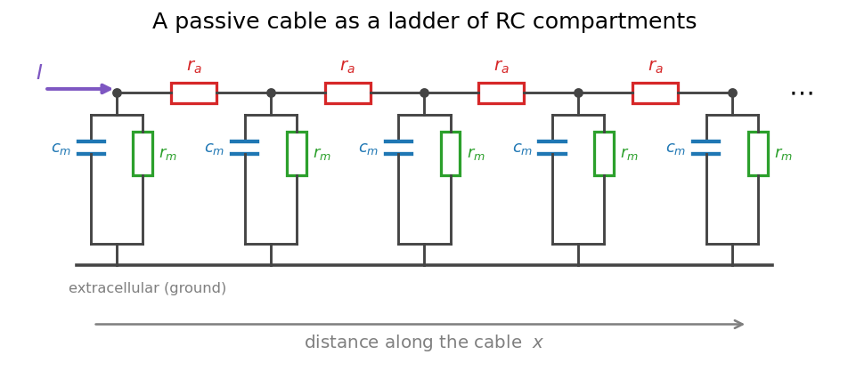
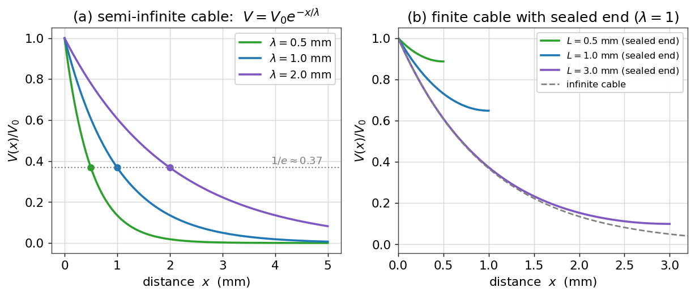
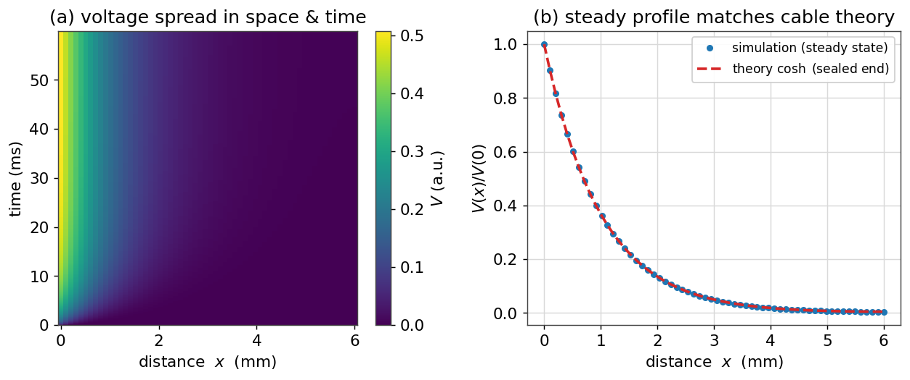
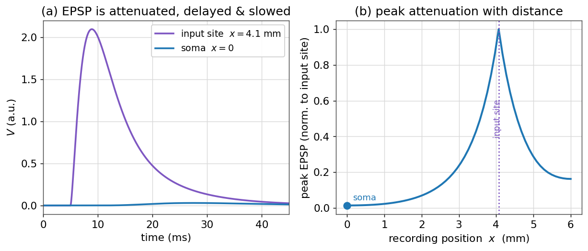

# نظریهٔ کابل و دندریت‌ها

تا اینجا نورون را یک **نقطه** فرض کردیم: یک تکه‌غشا با یک ولتاژِ واحد. اما نورون‌های واقعی درختانِ گسترده‌ای از دندریت و آکسون‌اند که گاه تا یک متر امتداد دارند. ولتاژ در نقاطِ مختلفِ این درخت یکسان نیست؛ سیگنالی که در یک دندریتِ دوردست زاده می‌شود، پیش از رسیدن به سوما تضعیف و کند می‌شود. برای فهمِ این گسترشِ **فضایی**، به **نظریهٔ کابل** نیاز داریم — همان چارچوبی که در قرن نوزدهم برای کابل‌های تلگرافِ زیردریایی ساخته شد و بعدها برای دندریت‌ها به کار رفت.

!!! note "در این فصل چه می‌آموزید"
    - نورونِ کشیده را به‌صورتِ یک **نردبان از محفظه‌های RC** مدل می‌کنید و از آن **معادلهٔ کابل** را استخراج می‌کنید.
    - **ثابت طولِ** $\lambda$ را می‌شناسید و می‌بینید که ولتاژ در حالت پایا به‌صورتِ $e^{-x/\lambda}$ افت می‌کند.
    - اثرِ **شرط‌های مرزی** (کابلِ متناهی با سرِ بسته) را بررسی می‌کنید.
    - یک **مدلِ محفظه‌ای** می‌نویسید و گسترشِ ولتاژ در فضا و زمان را شبیه‌سازی می‌کنید.
    - می‌بینید چرا دندریت یک **صافیِ پایین‌گذر** است که سیناپس‌های دوردست را تضعیف، کند و دیرتر به سوما می‌رساند.

## از یک نقطه به یک کابل

یک قطعهٔ کشیده از دندریت را در نظر بگیرید. آن را به تکه‌های کوچکِ متوالی می‌شکنیم؛ هر تکه، همان مدارِ RC آشنای فصل‌های پیش است: یک خازنِ غشایی $c_m$ به‌موازاتِ یک مقاومتِ غشایی $r_m$ (و باتریِ استراحت). اما این تکه‌ها از هم جدا نیستند: سیتوپلاسمِ درونِ سلول رساناست و تکه‌های مجاور را از راهِ یک **مقاومتِ محوری** $r_a$ به هم وصل می‌کند. حاصل، یک **نردبان** است:

<figure markdown="span">
  
  <figcaption>یک کابلِ منفعل به‌صورتِ نردبانی از محفظه‌های RC. هر گره یک خازنِ غشایی $c_m$ به‌موازاتِ مقاومتِ غشایی $r_m$ دارد، و گره‌های مجاور با مقاومتِ محوریِ $r_a$ (قرمز) به هم وصل‌اند. جریانِ تزریق‌شده در یک سر، هم می‌تواند از غشای همان محفظه بگذرد و هم در امتدادِ محور به محفظهٔ بعد برود.</figcaption>
</figure>

پرسشِ محوریِ نظریهٔ کابل این است: وقتی جریان را در یک نقطه تزریق می‌کنیم، ولتاژ در امتدادِ کابل چگونه توزیع می‌شود؟

## معادلهٔ کابل

بیایید معادله را از همین نردبان بسازیم. ولتاژ را از سطحِ استراحت می‌سنجیم و $V(x,t)$ می‌نامیم. دو قانونِ ساده کافی‌اند. نخست، جریانِ محوری در هر نقطه با شیبِ ولتاژ متناسب است (قانونِ اهم):

$$
i_a = -\frac{1}{r_a}\frac{\partial V}{\partial x}.
$$

دوم، هر تغییری در جریانِ محوری در طولِ کابل، باید از راهِ غشا خارج شده باشد (پایستگیِ بار). جریانِ غشایی در واحدِ طول، مجموعِ جریانِ خازنی و جریانِ نشتی است:

$$
-\frac{\partial i_a}{\partial x} = i_m = c_m\frac{\partial V}{\partial t} + \frac{V}{r_m}.
$$

با جای‌گذاریِ رابطهٔ نخست در دوم، به **معادلهٔ کابل** می‌رسیم:

$$
\frac{1}{r_a}\frac{\partial^2 V}{\partial x^2} = c_m\frac{\partial V}{\partial t} + \frac{V}{r_m}.
$$

اگر دو طرف را در $r_m$ ضرب کنیم و دو ثابتِ طبیعی تعریف کنیم — **ثابت طول** $\lambda = \sqrt{r_m/r_a}$ و **ثابت زمان** $\tau_m = r_m c_m$ — معادله شکلِ زیبایی می‌گیرد:

$$
\lambda^2\frac{\partial^2 V}{\partial x^2} = \tau_m\frac{\partial V}{\partial t} + V.
$$

این معادلهٔ دیفرانسیلِ با مشتقاتِ جزئی، همهٔ رفتارِ ولتاژِ منفعل در یک کابل را در بر دارد. دو کمیتِ $\lambda$ (مقیاسِ مشخصهٔ فضایی) و $\tau_m$ (مقیاسِ مشخصهٔ زمانی) شخصیتِ کابل را تعیین می‌کنند.

## ثابت طول و افتِ پایا

ساده‌ترین حالت، **پایا** است: جریانی ثابت را در نقطه‌ای تزریق می‌کنیم و صبر می‌کنیم تا ولتاژ به تعادل برسد. آنگاه $\partial V/\partial t = 0$ و معادلهٔ کابل به یک معادلهٔ دیفرانسیلِ معمولی فرومی‌کاهد:

$$
\lambda^2\frac{d^2 V}{dx^2} = V
\quad\Longrightarrow\quad
V(x) = V_0\, e^{-x/\lambda}
$$

(برای یک کابلِ نیمه‌بی‌نهایت که در $x=0$ تحریک می‌شود). یعنی ولتاژ در حالت پایا به‌صورتِ **نمایی** با فاصله افت می‌کند، و $\lambda$ فاصله‌ای است که در آن ولتاژ به $1/e \approx 37\%$ مقدارِ اولیه‌اش می‌رسد. هرچه $\lambda$ بزرگ‌تر باشد، سیگنال دورتر می‌رود.

```python
import numpy as np
import matplotlib.pyplot as plt

x = np.linspace(0, 5, 400)          # distance in mm
for lam in [0.5, 1.0, 2.0]:         # length constant in mm
    plt.plot(x, np.exp(-x / lam), label=f"lambda = {lam} mm")
```

<figure markdown="span">
  
  <figcaption>(الف) افتِ نماییِ ولتاژ در حالت پایا در یک کابلِ نیمه‌بی‌نهایت؛ ثابت طولِ بزرگ‌تر یعنی گسترشِ دورتر. (ب) در یک کابلِ متناهی با سرِ بسته (بدونِ نشتِ جریان از انتها)، ولتاژ نزدیکِ انتها بالاتر از حالتِ بی‌نهایت می‌ماند، زیرا جریان جایی برای رفتن ندارد و «پس می‌زند».</figcaption>
</figure>

!!! note "ثابت طول به چه بستگی دارد؟"
    برای یک کابلِ استوانه‌ای با قطرِ $d$، می‌توان نشان داد که $\lambda = \sqrt{\dfrac{d\,R_m}{4\,R_i}}$، که در آن $R_m$ مقاومتِ ویژهٔ غشا و $R_i$ مقاومتِ ویژهٔ سیتوپلاسم است. نتیجهٔ مهم این است که $\lambda \propto \sqrt{d}$: دندریت‌های **کلفت‌تر**، ثابت طولِ بزرگ‌تر دارند و سیگنال را دورتر می‌برند. همین است که آکسون‌های ضخیم، سیگنال را کارآمدتر هدایت می‌کنند.

## کابلِ متناهی و شرط‌های مرزی

دندریت‌های واقعی بی‌نهایت نیستند؛ در انتها به یک نقطه ختم می‌شوند. اگر انتها **بسته** باشد (جریانی از آن خارج نشود، شرطِ $dV/dx=0$ در انتها)، جوابِ پایا دیگر یک نماییِ ساده نیست، بلکه به‌صورتِ زیر درمی‌آید:

$$
V(x) = V_0\,\frac{\cosh\!\big((L - x)/\lambda\big)}{\cosh\!\big(L/\lambda\big)},
$$

که $L$ طولِ کابل است. پنلِ (ب) شکلِ بالا نشان می‌دهد که چنین کابلی، ولتاژ را نزدیکِ انتها بالاتر از حالتِ بی‌نهایت نگه می‌دارد، چون جریان «جایی برای رفتن ندارد» و انباشته می‌شود. این اثرِ سرِ بسته، در دندریت‌های کوتاه اهمیت دارد.

## مدلِ محفظه‌ای

معادلهٔ کابل تنها برای هندسه‌های ساده جوابِ تحلیلی دارد. برای یک درختِ دندریتیِ واقعی، آن را **عددی** حل می‌کنیم: کابل را به $N$ محفظهٔ گسسته می‌شکنیم (همان نردبانِ ابتدای فصل) و برای هر محفظه یک معادلهٔ RC می‌نویسیم که با همسایه‌هایش جفت شده است. این همان کاری است که شبیه‌سازهایی مانند NEURON در دلِ خود انجام می‌دهند.

با گسسته‌کردنِ مشتقِ دومِ فضایی، معادلهٔ به‌روزرسانیِ اویلر برای محفظهٔ $i$ چنین می‌شود:

```python
def simulate_cable(N=60, L=6.0, lam=1.0, tau=10.0, dt=0.02, T=60.0, Iinj=None):
    dx = L / (N - 1)
    coeff = (lam ** 2) / (dx ** 2)
    steps = int(T / dt)
    V = np.zeros(N)
    rec = np.zeros((steps, N))
    for k in range(steps):
        Vxx = np.zeros(N)
        Vxx[1:-1] = V[2:] - 2 * V[1:-1] + V[:-2]     # second difference
        Vxx[0]  = 2 * (V[1] - V[0])                   # sealed ends (no axial
        Vxx[-1] = 2 * (V[-2] - V[-1])                 #   current leaves)
        I = Iinj(k * dt) if Iinj else np.zeros(N)
        V = V + dt * ((coeff * Vxx - V) / tau) + dt * I
        rec[k] = V
    return rec, dx
```

اگر جریانی ثابت را در محفظهٔ نخست تزریق کنیم و اجرا کنیم تا به تعادل برسد، دو چیز را می‌بینیم: نخست، موجی که به‌تدریج در فضا پخش می‌شود، و دوم، پروفایلِ پایا که دقیقاً با پیش‌بینیِ نظریهٔ کابل (شکلِ $\cosh$ برای سرِ بسته) هم‌خوانی دارد.

<figure markdown="span">
  
  <figcaption>(الف) گسترشِ ولتاژ در فضا و زمان پس از تزریقِ جریانِ ثابت در $x=0$؛ رنگِ روشن‌تر ولتاژِ بالاتر است. سیگنال با تأخیر به نقاطِ دوردست می‌رسد و در آنجا کوچک‌تر است. (ب) پروفایلِ پایای شبیه‌سازی (نقطه‌ها) دقیقاً روی منحنیِ نظریِ کابل (خط‌چینِ قرمز) می‌نشیند — تأییدی بر درستیِ مدلِ محفظه‌ای.</figcaption>
</figure>

## دندریت به‌مثابهٔ صافی

مهم‌ترین پیامدِ نظریهٔ کابل برای علوم اعصاب این است: یک سیناپس که روی دندریتِ دوردست فعال می‌شود، اثری بسیار متفاوت با همان سیناپس روی سوما دارد. برای دیدنِ این، به‌جای جریانِ ثابت، یک ورودیِ **گذرا** (شبیهِ یک ورودیِ سیناپسی) را در یک محفظهٔ دوردست تزریق می‌کنیم و ولتاژ را هم در همان‌جا و هم در سوما ثبت می‌کنیم.

<figure markdown="span">
  
  <figcaption>(الف) یک ورودیِ گذرا در دندریتِ دوردست، در محلِ خود یک پاسخِ بزرگ و تیز می‌سازد (بنفش)، اما تا رسیدن به سوما (آبی) به‌شدت **تضعیف**، **کند** و **دیرتر** می‌شود. (ب) بیشینهٔ دامنهٔ پاسخ با فاصله از محلِ ورودی به‌سرعت افت می‌کند؛ کابل، سیناپس‌های دور را «کم‌صداتر» می‌کند.</figcaption>
</figure>

سه اثر را با هم می‌بینیم. **تضعیف**: دامنهٔ پاسخ در سوما بسیار کوچک‌تر است، چون بارِ سیناپسی در طولِ مسیر از راهِ غشا نشت می‌کند. **کندی و پهن‌شدن**: لبهٔ تیزِ پاسخ در سوما گِرد و پهن می‌شود، چون کابل مؤلفه‌های تندِ سیگنال را بیش از مؤلفه‌های کند تضعیف می‌کند — یعنی دندریت یک **صافیِ پایین‌گذر** است، درست مانند مدارِ RC نقطه‌ای، اما این‌بار در فضا. **تأخیر**: قلهٔ پاسخ در سوما دیرتر از محلِ ورودی رخ می‌دهد.

این «فیلترِ دندریتی» صرفاً یک محدودیت نیست؛ محاسبه است. موقعیتِ یک سیناپس روی درختِ دندریتی، وزن و زمان‌بندیِ اثرِ آن را تعیین می‌کند، و همین به نورون اجازه می‌دهد ورودی‌ها را بر پایهٔ مکانشان به‌صورتِ متفاوت ترکیب کند. نحوهٔ **جمع‌شدنِ** این ورودی‌ها در سوما، موضوعِ فصلِ [سیناپس‌ها](ch-biophys-05-synapses.md) است.

## جمع‌بندی

در این فصل، از مدلِ نقطه‌ایِ نورون فراتر رفتیم و ساختارِ فضایی را وارد کردیم. دیدیم که یک کابلِ منفعل با معادلهٔ کابل توصیف می‌شود، که در حالت پایا به افتِ نماییِ ولتاژ با ثابت طولِ $\lambda$ می‌انجامد؛ که شرط‌های مرزی این تصویر را تغییر می‌دهند؛ و که مدلِ محفظه‌ای، راهِ عملیِ شبیه‌سازیِ هر هندسه‌ای است. مهم‌تر از همه، فهمیدیم که دندریت یک صافیِ پایین‌گذرِ فضایی است که سیناپس‌های دور را تضعیف و کند می‌کند. در فصل بعد، منبعِ این ورودی‌های سیناپسی را مدل می‌کنیم.

## تمرین‌ها

!!! question "تمرینِ ۱ — ثابت طول و قطر"
    دو دندریت را در نظر بگیرید که یکی قطرِ چهار برابرِ دیگری دارد اما جنسِ غشا و سیتوپلاسمشان یکسان است. نسبتِ ثابت‌های طولِ آن‌ها چقدر است؟ اگر سیگنال در دندریتِ باریک تا فاصلهٔ ۰٫۵ میلی‌متری به نصف افت کند، در دندریتِ کلفت تا چه فاصله‌ای به همان نسبت افت می‌کند؟

    ??? success "راهِ‌حل"
        چون $\lambda \propto \sqrt{d}$، نسبتِ ثابت‌های طول برابرِ $\sqrt{4}=2$ است. پس دندریتِ کلفت ثابت طولِ دو برابر دارد و همان افتِ نسبی در فاصلهٔ دو برابر (یعنی ۱ میلی‌متر) رخ می‌دهد. دندریت‌های کلفت‌تر، سیگنال را دورتر می‌برند.

!!! question "تمرینِ ۲ — پروفایلِ پایا"
    با تابعِ `simulate_cable`، جریانِ ثابت را در $x=0$ تزریق کنید و پروفایلِ پایا را با منحنیِ نظریِ $\cosh$ مقایسه کنید. سپس ثابت طول را از $\lambda=1$ به $\lambda=0.5$ کاهش دهید. پروفایل چگونه تغییر می‌کند؟

    ??? success "راهِ‌حل"
        پروفایلِ شبیه‌سازی باید روی منحنیِ $\cosh((L-x)/\lambda)/\cosh(L/\lambda)$ بنشیند (پنلِ (ب) شکلِ مدلِ محفظه‌ای). با نصف‌کردنِ $\lambda$، افت بسیار تندتر می‌شود: ولتاژ در فاصله‌های کوتاه‌تری به صفر نزدیک می‌شود، چون سیگنال کمتر می‌تواند در امتدادِ کابل بگسترد.

!!! question "تمرینِ ۳ — تضعیفِ سیناپسی"
    یک ورودیِ گذرا را یک‌بار در محفظهٔ نزدیکِ سوما و یک‌بار در محفظهٔ دوردست تزریق کنید و در هر دو حالت، دامنهٔ پاسخ در سوما را اندازه بگیرید. چرا سیناپس‌های دوردست به دامنهٔ ورودیِ بزرگ‌تری برای اثرِ یکسان بر سوما نیاز دارند؟

    ??? success "راهِ‌حل"
        سیناپسِ دوردست، پاسخی می‌سازد که پیش از رسیدن به سوما به‌اندازهٔ تقریباً $e^{-x/\lambda}$ تضعیف می‌شود؛ پس برای رساندنِ همان دامنه به سوما، باید ورودیِ بزرگ‌تری تولید کند. این «دموکراسیِ دندریتی» یکی از مسائلِ بازِ علوم اعصاب است: برخی نورون‌ها با سازوکارهای فعال (کانال‌های وابسته به ولتاژ در دندریت) این تضعیف را جبران می‌کنند.

---

برای مطالعهٔ بیشتر:

<div dir="ltr" markdown>
- Rall, W., 1977. Core conductor theory and cable properties of neurons. In: Handbook of Physiology. American Physiological Society.
- Dayan, P., Abbott, L.F., 2005. Theoretical Neuroscience, ch. 6. MIT Press.
- Koch, C., 1999. Biophysics of Computation, ch. 2–3. Oxford University Press.
- Sterratt, D., Graham, B., Gillies, A., Willshaw, D., 2011. Principles of Computational Modelling in Neuroscience, ch. 2–4. Cambridge University Press.
</div>
