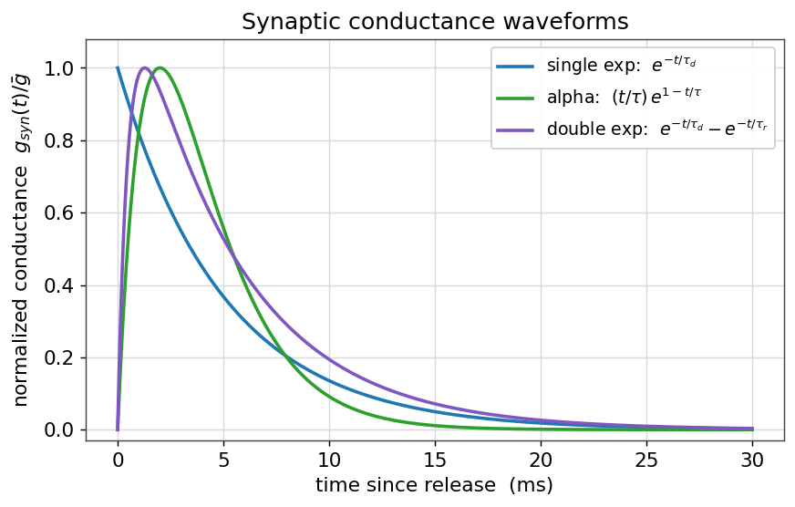
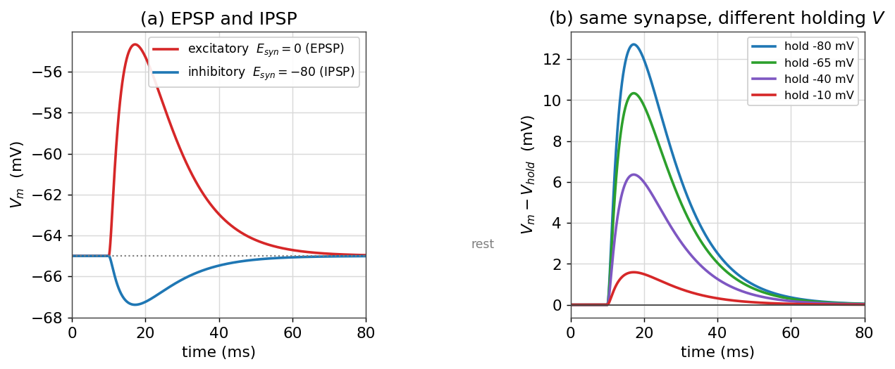
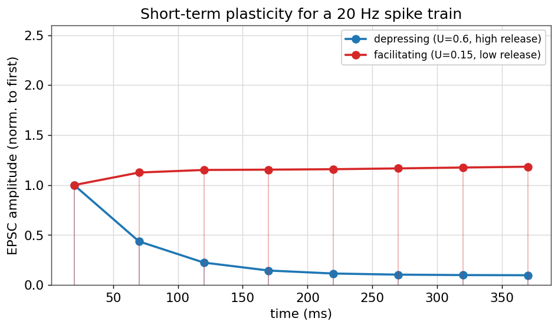
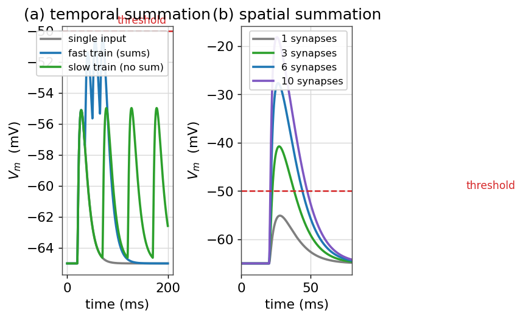

# سیناپس‌ها و انتقال سیناپسی

تا اینجا یک نورونِ منفرد را بررسی کردیم: غشا، کانال‌ها، پتانسیل و گسترشِ فضایی. اما قدرتِ واقعیِ مغز از **ارتباطِ** نورون‌هاست. محلِ این ارتباط، **سیناپس** است؛ نقطه‌ای که در آن پتانسیل عملِ یک نورونِ پیش‌سیناپسی به تغییری در ولتاژِ نورونِ پس‌سیناپسی ترجمه می‌شود. در این فصل، سیناپس را از دیدگاهِ زیست‌فیزیکی و محاسباتی مدل می‌کنیم: از شکلِ رساناییِ سیناپسی و پتانسیل واژگونی، تا گیرنده‌های AMPA و NMDA، پلاستیسیتیِ کوتاه‌مدت و چگونگیِ **جمع‌شدنِ** ورودی‌ها تا رسیدن به آستانه.

!!! note "در این فصل چه می‌آموزید"
    - سیناپس را به‌صورتِ یک **رساناییِ گذرا** مدل می‌کنید و شکل‌موج‌های نمایی، آلفا و دونمایی را می‌سازید.
    - تفاوتِ **EPSP** و **IPSP** و نقشِ **پتانسیل واژگونی** ($E_{\text{syn}}$) را می‌فهمید.
    - گیرنده‌های **AMPA** و **NMDA** و **سدِ وابسته به ولتاژِ منیزیم** را مدل می‌کنید و منحنیِ جریان–ولتاژِ ویژهٔ NMDA را می‌بینید.
    - **پلاستیسیتیِ کوتاه‌مدت** (تضعیف و تسهیل) را برای یک قطارِ اسپایک شبیه‌سازی می‌کنید.
    - **جمع‌شدنِ زمانی و مکانیِ** ورودی‌ها را تا رسیدن به آستانه بررسی می‌کنید.

## سیناپسِ شیمیایی: تصویرِ کلی

در یک سیناپسِ شیمیاییِ نوعی، وقتی پتانسیل عمل به پایانهٔ پیش‌سیناپسی می‌رسد، کانال‌های کلسیمیِ وابسته به ولتاژ باز می‌شوند؛ ورودِ کلسیم باعثِ رهاسازیِ **ناقل‌های عصبی** از وزیکول‌ها به شکافِ سیناپسی می‌شود. این ناقل‌ها در سوی دیگر به **گیرنده‌ها** می‌چسبند و کانال‌های یونیِ وابسته به لیگاند را باز می‌کنند. نتیجه، یک **رساناییِ گذرا** در غشای پس‌سیناپسی است. کلِ این زنجیرهٔ پیچیده را، برای مقاصدِ مدل‌سازی، می‌توان در یک ایده خلاصه کرد: رسیدنِ یک اسپایکِ پیش‌سیناپسی، یک ضربهٔ کوتاهِ رسانایی در نورونِ پس‌سیناپسی می‌سازد.

## مدلِ رسانایی‌محورِ سیناپس

جریانِ سیناپسی، مانندِ هر جریانِ یونیِ دیگر، از قانونِ اهم پیروی می‌کند: رسانایی ضرب در نیرویِ محرکه. اما این‌بار رسانایی به زمان وابسته است و با هر اسپایک یک ضربه می‌خورد:

$$
I_{\text{syn}}(t) = g_{\text{syn}}(t)\,\big(V - E_{\text{syn}}\big),
$$

که در آن $E_{\text{syn}}$ **پتانسیل واژگونیِ** سیناپس است (بسته به یون‌هایی که کانال عبور می‌دهد). شکلِ زمانیِ $g_{\text{syn}}(t)$ را با چند تابعِ استاندارد مدل می‌کنند. ساده‌ترین، یک **افتِ نمایی** پس از هر اسپایک است؛ واقع‌گرایانه‌تر، **تابعِ آلفا** یا **دونمایی** است که هم زمانِ بالاآمدن و هم زمانِ افت را دارد:

$$
g_{\text{exp}}(t) = \bar g\, e^{-t/\tau_d},
\qquad
g_{\alpha}(t) = \bar g\,\frac{t}{\tau}\,e^{1 - t/\tau},
\qquad
g_{\text{2exp}}(t) = \bar g\,A\big(e^{-t/\tau_d} - e^{-t/\tau_r}\big).
$$

```python
import numpy as np
import matplotlib.pyplot as plt

t = np.linspace(0, 30, 1500)          # ms
g_exp   = np.exp(-t / 5.0)
g_alpha = (t / 2.0) * np.exp(1 - t / 2.0)
raw     = np.exp(-t / 5.0) - np.exp(-t / 0.5)     # tau_r=0.5, tau_d=5
g_2exp  = raw / raw.max()
```

<figure markdown="span">
  
  <figcaption>سه شکل‌موجِ استانداردِ رساناییِ سیناپسی. افتِ نماییِ ساده (آبی) تنها یک ثابت‌زمانی دارد؛ تابعِ آلفا (سبز) و دونمایی (بنفش) هم زمانِ بالاآمدن و هم زمانِ افت را مدل می‌کنند و به داده‌های واقعی نزدیک‌ترند. زمانِ بالاآمدنِ متناهی، بازتابِ سرعتِ محدودِ باز شدنِ گیرنده‌هاست.</figcaption>
</figure>

## EPSP، IPSP و پتانسیل واژگونی

اثرِ یک سیناپس بر ولتاژ، به پتانسیل واژگونیِ آن بستگی دارد. برای دیدنِ این، جریانِ سیناپسی را به معادلهٔ RC غشای فصلِ [پتانسیل غشا](ch-biophys-02-membrane-potential.md) اضافه می‌کنیم:

$$
C_m\frac{dV}{dt} = -g_L(V - E_L) - g_{\text{syn}}(t)(V - E_{\text{syn}}).
$$

اگر $E_{\text{syn}}$ بالاتر از آستانه باشد (نوعاً نزدیکِ صفر برای سیناپس‌های تحریکیِ گلوتاماتی)، سیناپس ولتاژ را به سمتِ مثبت می‌برد و یک **پتانسیل پس‌سیناپسیِ تحریکی (EPSP)** می‌سازد. اگر $E_{\text{syn}}$ زیرِ پتانسیل استراحت باشد (نوعاً حدودِ ۷۰− تا ۸۰− میلی‌ولت برای سیناپس‌های مهاریِ GABAیی)، ولتاژ به سمتِ منفی می‌رود و یک **پتانسیل پس‌سیناپسیِ مهاری (IPSP)** پدید می‌آید.

```python
EL, gL, C = -65.0, 0.1, 1.0           # tau = C/gL = 10 ms
def run_synapse(E_syn, gpeak):
    V = np.zeros(steps); V[0] = EL
    for k in range(steps - 1):
        g = gpeak * gsyn_kernel(t[k] - 10.0)          # input at t = 10 ms
        V[k+1] = V[k] + dt * (-gL*(V[k]-EL) - g*(V[k]-E_syn)) / C
    return V

V_epsp = run_synapse(E_syn=0.0,   gpeak=0.05)   # excitatory
V_ipsp = run_synapse(E_syn=-80.0, gpeak=0.05)   # inhibitory
```

<figure markdown="span">
  
  <figcaption>(الف) پاسخِ ولتاژ به یک ورودیِ سیناپسیِ تحریکی ($E_{syn}=0$، قرمز، EPSP) و مهاری ($E_{syn}=-80$، آبی، IPSP). (ب) همان سیناپسِ تحریکی از سطوحِ نگه‌دارِ مختلف: هرچه ولتاژِ نگه‌دار به $E_{syn}=0$ نزدیک‌تر باشد، دامنهٔ پاسخ کوچک‌تر است و در $V=E_{syn}$ پاسخ **واژگون** می‌شود — نشانهٔ آنکه علامتِ اثرِ سیناپس را نه خودِ سیناپس، بلکه فاصلهٔ ولتاژ از پتانسیل واژگونی تعیین می‌کند.</figcaption>
</figure>

پنلِ (ب) نکتهٔ ظریفی را روشن می‌کند: یک سیناپسِ «تحریکی» هم اگر ولتاژ بالاتر از $E_{\text{syn}}$ باشد می‌تواند ولتاژ را **پایین** بکشد. آنچه اثرِ سیناپس را تعیین می‌کند، علامتِ $V - E_{\text{syn}}$ است. همین اصل، پایهٔ **مهارِ شنتی** (shunting) است: سیناپسی با پتانسیل واژگونیِ نزدیک به استراحت، شاید ولتاژ را چندان تغییر ندهد، اما با بالابردنِ رسانایی، اثرِ سایرِ ورودی‌ها را «کوتاه» می‌کند.

## گیرنده‌های AMPA و NMDA

سیناپس‌های تحریکیِ گلوتاماتی معمولاً دو نوع گیرنده دارند که رفتارِ بسیار متفاوتی نشان می‌دهند. گیرندهٔ **AMPA** ساده است: یک رساناییِ اهمیِ سریع با $E_{\text{syn}}\approx 0$. اما گیرندهٔ **NMDA** ویژگیِ چشمگیری دارد: منفذِ آن در ولتاژهای منفی توسط یونِ **منیزیم** مسدود است، و تنها با دپلاریزه‌شدنِ غشا این سد برداشته می‌شود. رساناییِ مؤثرِ NMDA در یک عاملِ وابسته به ولتاژ ضرب می‌شود:

$$
B(V) = \frac{1}{1 + \dfrac{[\text{Mg}^{2+}]}{3.57}\,e^{-0.062\,V}},
\qquad
I_{\text{NMDA}} = \bar g\,B(V)\,(V - E_{\text{syn}}).
$$

```python
def mg_block(V, Mg=1.0):
    return 1.0 / (1.0 + (Mg / 3.57) * np.exp(-0.062 * V))

V = np.linspace(-90, 40, 400)
I_ampa = 1.0 * (V - 0.0)
I_nmda = 1.0 * mg_block(V) * (V - 0.0)
```

<figure markdown="span">
  
  <figcaption>(الف) کسرِ گیرنده‌های NMDA که سدِ منیزیمی‌شان برداشته شده، به‌عنوان تابعی از ولتاژ و غلظتِ منیزیم؛ در ولتاژهای منفی، بیشترِ گیرنده‌ها مسدودند. (ب) منحنیِ جریان–ولتاژ: AMPA (سبز) خطی است، اما NMDA (قرمز) ناحیه‌ای با شیبِ منفی دارد — جریانِ آن تنها وقتی غشا از پیش دپلاریزه شده باشد بزرگ می‌شود.</figcaption>
</figure>

این وابستگیِ ولتاژی، NMDA را به یک **آشکارسازِ هم‌زمانی** بدل می‌کند: جریانِ چشمگیر تنها وقتی جاری می‌شود که هم ناقلِ عصبی حاضر باشد (فعالیتِ پیش‌سیناپسی) و هم غشا دپلاریزه باشد (فعالیتِ پس‌سیناپسی). همین «قاعدهٔ همایندی» شالودهٔ بسیاری از مدل‌های **یادگیری و پلاستیسیتیِ درازمدت** است که در فصلِ [پلاستیسیتی وابسته به زمان اسپایک (STDP)](../ch08.md) به آن بازمی‌گردیم.

## پلاستیسیتیِ کوتاه‌مدت

قدرتِ یک سیناپس ثابت نیست؛ در مقیاسِ میلی‌ثانیه تا ثانیه تغییر می‌کند. اگر یک نورونِ پیش‌سیناپسی پیاپی شلیک کند، پاسخ‌های پس‌سیناپسی ممکن است **تضعیف** (کوچک‌تر) یا **تسهیل** (بزرگ‌تر) شوند. مدلِ کلاسیکِ **تسودیکس–مارکرام** این رفتار را با دو کمیت توصیف می‌کند: $R$، کسرِ منابعِ در دسترس (وزیکول‌ها)، و $u$، احتمالِ رهاسازی. با هر اسپایک، دامنهٔ پاسخ متناسب با $u\cdot R$ است؛ سپس منابع تخلیه و به‌آرامی بازیابی می‌شوند.

```python
def tsodyks_markram(spikes, U, tau_rec, tau_fac):
    R, u = 1.0, U
    amps = []
    last = None
    for ts in spikes:
        if last is not None:
            dt = ts - last
            R = 1 - (1 - R) * np.exp(-dt / tau_rec)         # recovery
            if tau_fac > 0:
                u = U + (u - U) * np.exp(-dt / tau_fac)      # facilitation decay
        if tau_fac > 0:
            u = u + U * (1 - u)                              # facilitation jump
        amps.append(u * R)
        R = R - u * R                                       # depletion
        last = ts
    return np.array(amps)
```

<figure markdown="span">
  
  <figcaption>پاسخِ دو سیناپس به یک قطارِ اسپایکِ ۲۰ هرتزی. سیناپسِ با احتمالِ رهاسازیِ بالا (آبی) به‌سرعت **تضعیف** می‌شود، چون منابعش تخلیه می‌شوند؛ سیناپسِ با احتمالِ رهاسازیِ پایین (قرمز) **تسهیل** می‌شود، چون هر اسپایک احتمالِ رهاسازیِ اسپایکِ بعد را بالا می‌برد. یک سیناپسِ واحد بسته به تاریخچهٔ فعالیت، می‌تواند هر دو رفتار را نشان دهد.</figcaption>
</figure>

پلاستیسیتیِ کوتاه‌مدت، سیناپس را از یک «سیم» به یک **پردازندهٔ زمانی** بدل می‌کند: سیناپس‌های تضعیف‌شونده به تغییراتِ نرخ حساس‌اند و مانندِ صافیِ بالاگذر عمل می‌کنند، حال‌آنکه سیناپس‌های تسهیل‌شونده فعالیتِ پیاپی را برجسته می‌کنند.

## جمع‌شدنِ زمانی و مکانی

یک EPSP منفرد معمولاً بسیار کوچک‌تر از آن است که نورون را به آستانه برساند. نورون به آستانه می‌رسد تنها با **جمع‌شدنِ** چندین ورودی. دو نوع جمع‌شدن وجود دارد. در **جمع‌شدنِ زمانی**، یک سیناپس پیاپی و با فاصلهٔ کوتاه فعال می‌شود؛ اگر فاصله‌ها کوتاه‌تر از ثابت‌زمانیِ غشا باشند، EPSPها روی هم انباشته می‌شوند. در **جمع‌شدنِ مکانی**، چند سیناپسِ مختلف هم‌زمان فعال می‌شوند و اثرشان جمع می‌شود.

<figure markdown="span">
  
  <figcaption>(الف) جمع‌شدنِ زمانی: قطارِ سریعِ ورودی‌ها (آبی) روی هم انباشته می‌شود و به آستانه (خط‌چینِ قرمز) می‌رسد، اما قطارِ کند (سبز) میان ورودی‌ها فرصتِ افت می‌یابد و جمع نمی‌شود. (ب) جمع‌شدنِ مکانی: با افزایشِ تعدادِ سیناپس‌های هم‌زمان، دامنهٔ پاسخ بزرگ‌تر می‌شود تا آنکه از آستانه بگذرد.</figcaption>
</figure>

ثابت‌زمانیِ غشا در اینجا نقشِ کلیدی دارد: غشای با $\tau_m$ بزرگ‌تر، پنجرهٔ زمانیِ طولانی‌تری برای جمع‌شدن فراهم می‌کند و نورون را به یک **انتگرال‌گیر** نزدیک‌تر می‌کند؛ غشای با $\tau_m$ کوچک‌تر، تنها ورودی‌های تقریباً هم‌زمان را جمع می‌کند و مانندِ یک **آشکارسازِ همایندی** عمل می‌کند. همین انتخاب میانِ «انتگرال‌گیر» و «آشکارسازِ همایندی» در فصلِ [مدل‌های ساده‌شده: LIF، EIF، AdEx](../ch04.md) دوباره ظاهر می‌شود.

## جمع‌بندی

در این فصل، سیناپس را از یک اتصالِ زیستیِ پیچیده به یک مدلِ محاسباتیِ فشرده تبدیل کردیم: یک رساناییِ گذرا با یک پتانسیل واژگونی. دیدیم که علامتِ اثرِ سیناپس را پتانسیل واژگونی تعیین می‌کند (EPSP در برابرِ IPSP)، که گیرندهٔ NMDA با سدِ منیزیمی‌اش یک آشکارسازِ هم‌زمانیِ ولتاژی است، که قدرتِ سیناپس با پلاستیسیتیِ کوتاه‌مدت پویا تغییر می‌کند، و که نورون تنها با جمع‌شدنِ زمانی و مکانیِ ورودی‌ها به آستانه می‌رسد. با این فصل، بخشِ **بیوفیزیک نورون** کامل می‌شود: از یک تکه‌غشا آغاز کردیم و به شبکه‌ای از نورون‌های در حالِ گفت‌وگو رسیدیم. گامِ بعدیِ طبیعی، ساختنِ مدل‌های کاملِ نورون ([هاجکین–هاکسلی](../ch03.md)) و سپس به‌هم‌بستنِ آن‌ها در [شبکه‌ها](../ch05.md) است.

## تمرین‌ها

!!! question "تمرینِ ۱ — پتانسیل واژگونی و علامتِ جریان"
    یک سیناپس با $E_{\text{syn}} = -10$ میلی‌ولت را در نظر بگیرید. اگر ولتاژ غشا ۶۵− میلی‌ولت باشد، جریانِ سیناپسی رو به داخل است یا بیرون؟ اگر ولتاژ ۰ میلی‌ولت باشد چطور؟ در چه ولتاژی جریان صفر می‌شود؟

    ??? success "راهِ‌حل"
        جریان متناسب با $V - E_{\text{syn}}$ است. در $V=-65$، داریم $V-E_{\text{syn}} = -55 < 0$؛ جریان (با قراردادِ $I=g(V-E)$) منفی، یعنی رو به داخل و دپلاریزه‌کننده است. در $V=0$، داریم $V-E_{\text{syn}}=+10>0$؛ جریان رو به بیرون و هایپرپلاریزه‌کننده. در $V = E_{\text{syn}} = -10$ میلی‌ولت جریان صفر می‌شود — همان پتانسیل واژگونی.

!!! question "تمرینِ ۲ — چرا NMDA آشکارسازِ هم‌زمانی است؟"
    با استفاده از تابعِ `mg_block`، توضیح دهید چرا جریانِ NMDA تنها وقتی بزرگ می‌شود که هم گلوتامات حاضر باشد و هم غشا دپلاریزه باشد. این ویژگی چه ربطی به یادگیریِ هبی («نورون‌هایی که با هم شلیک می‌کنند، به هم سیم می‌شوند») دارد؟

    ??? success "راهِ‌حل"
        رساناییِ NMDA متناسب با حاصل‌ضربِ دو عامل است: حضورِ گلوتامات (که کانال را در دسترس می‌کند) و $B(V)$ (که تنها با دپلاریزاسیون بزرگ می‌شود). پس جریانِ چشمگیر نیازمندِ **همایندیِ** فعالیتِ پیش‌سیناپسی و پس‌سیناپسی است. ورودِ کلسیم از راهِ NMDA در همین شرایط، سیگنالِ راه‌اندازِ تقویتِ سیناپسی است — سازوکارِ مولکولیِ قاعدهٔ هبی.

!!! question "تمرینِ ۳ — پنجرهٔ جمع‌شدنِ زمانی"
    دو EPSP با فاصلهٔ زمانیِ $\Delta t$ را در نظر بگیرید. به‌صورتِ کیفی توضیح دهید که چرا برای $\Delta t \ll \tau_m$ جمع‌شدن قوی و برای $\Delta t \gg \tau_m$ ناچیز است. اگر $\tau_m$ را دو برابر کنیم، پنجرهٔ جمع‌شدن چه می‌شود؟

    ??? success "راهِ‌حل"
        هر EPSP با ثابت‌زمانیِ $\tau_m$ افت می‌کند. اگر EPSP دوم پیش از افتِ کاملِ اولی برسد ($\Delta t \ll \tau_m$)، روی باقیماندهٔ آن سوار می‌شود و جمع‌شدن قوی است؛ اگر دیر برسد ($\Delta t \gg \tau_m$)، اولی عملاً محو شده و جمع‌شدن ناچیز است. دو برابرکردنِ $\tau_m$، پنجرهٔ زمانیِ جمع‌شدن را تقریباً دو برابر می‌کند و نورون را به یک انتگرال‌گیرِ بهتر بدل می‌سازد.

---

برای مطالعهٔ بیشتر:

<div dir="ltr" markdown>
- Dayan, P., Abbott, L.F., 2005. Theoretical Neuroscience, ch. 5–7. MIT Press.
- Tsodyks, M., Markram, H., 1997. The neural code between neocortical pyramidal neurons depends on neurotransmitter release probability. PNAS 94, 719–723.
- Destexhe, A., Mainen, Z.F., Sejnowski, T.J., 1994. An efficient method for computing synaptic conductances. Neural Computation 6, 14–18.
- Jahr, C.E., Stevens, C.F., 1990. Voltage dependence of NMDA-activated macroscopic conductances. J. Neurosci. 10, 3178–3182.
</div>
